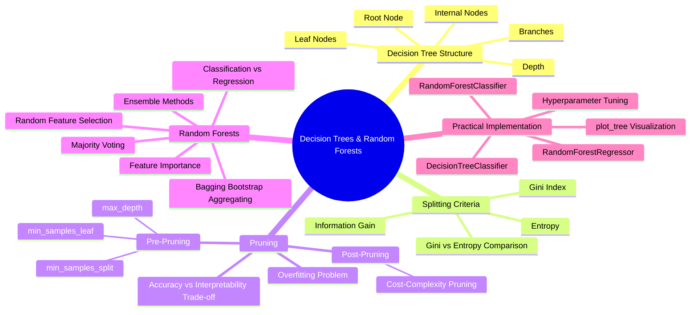
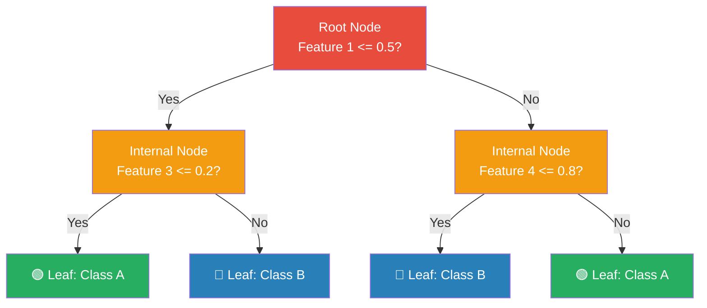
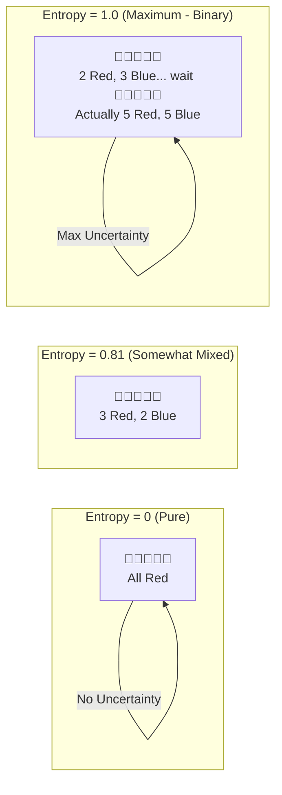
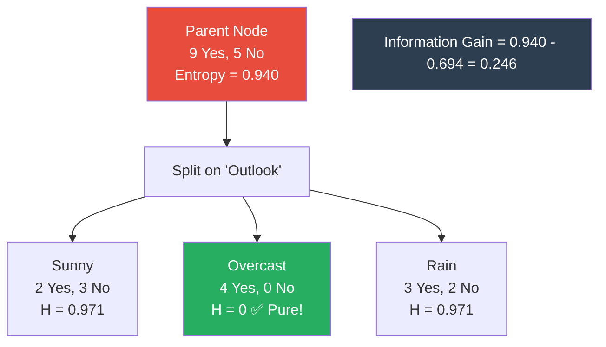
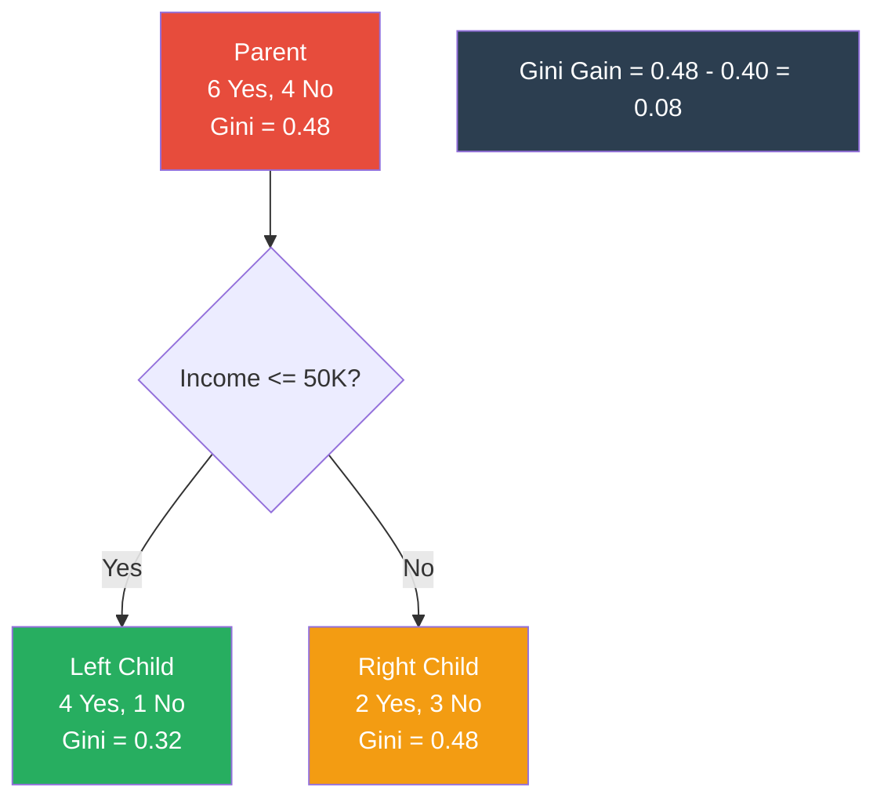

# AS31: Decision Trees and Random Forests - Classroom Session (Part 1)

> 📚 **This is Part 1** covering: Decision Tree Structure, Entropy, Information Gain, Gini Index
> 📘 **See also:** [Part 2](./AS31_DecisionTreesRandomForests2.md), [Part 3](./AS31_DecisionTreesRandomForests3.md)

---

## 🗺️ Mind Map - Topics to Cover (Full Session)



---

## 🎓 Classroom Conversation

### Topic 1: Decision Tree Structure — Oka Tree Laga Think Cheyyadam

---

**Teacher:** Namaskaram students! Ippudu mana chala important topic start cheddham — **Decision Trees and Random Forests**. Idi machine learning lo oka foundational algorithm. Simple ga artham chesuko, interview lo chala frequent ga vastundi, and real-world lo kuda chala widely used.

Modatiga, oka analogy tho start cheddham. Meeru eppudaina oka **20 Questions game** aadinara? Nenu oka animal gurinchi think chestunna, meeru naku questions adugutaru — "Is it big?", "Can it fly?", "Does it live in water?" — ilanti yes/no questions adigi, answer guess chestaru.

**Decision Tree exact ilane work chestundi.** Data ni oka series of questions tho divide chesi, final decision ki reach avutundi.

---

**Beginner Student:** Teacher, Decision Tree ante exactly emi? Tree ante botanical tree laga untunda?

**Teacher:** Chala manchidi question! Decision Tree oka **tree-shaped structure** — kaani idi **inverted tree**, ante top lo root untundi, bottom lo leaves untayi. Botanical tree lo roots bottom lo untayi, kani decision tree lo root TOP lo untundi. 

Oka simple example chuddam:

> 💡 **Jargon Alert - Decision Tree**
> Simple Explanation: Idi oka flowchart laga, series of questions adigutundi data gurinchi, and final answer ki reach avutundi.
> Example: "Should I go outside?" → Is it raining? → Yes → Take umbrella. No → Go directly.

Decision Tree lo 3 main parts untayi:

1. **Root Node** — Modati question. Most important question. Tree start point.
2. **Internal Nodes** (Decision Nodes) — Middle questions. Sub-decisions.
3. **Leaf Nodes** — Final answers. Classification result (Class A, Class B, etc.)



---

**Clever Student:** Teacher, Decision Tree structure gurinchi inka details cheppandi. Root Node eppudu select avutundi? Random ga aa?

**Teacher:** Excellent question! Root Node **random ga select avvadu**. Root Node select cheyyataniki oka mathematical criteria use chestam — adi **Information Gain** leda **Gini Index** based ga avutundi. Whichever feature gives the best split — max information gain leda lowest Gini impurity — adi Root Node avtundi.

Oka school principal analogy lo cheppali ante:

> Meeru principal, 100 students ni 3 groups ga divide cheyaali — "Excellent", "Good", "Average". 
> Modatiga meeru oka question adugutaru: "Did you score above 80%?" — Idi best question, enduku ante idi maximum number of students ni correctly separate chestundi.
> Aa question **Root Node**.
> Tarvata each group lo inko question adugutaru — "Did you submit all assignments?" — Idi **Internal Node**.
> Final ga, each student ki label assign chestaru — "Excellent", "Good", "Average" — Idhi **Leaf Node**.

---

**Critique Student:** Teacher, kaani ilanti tree structure lo problems unnayi kadha? Tree chala deep ga grow avvachu, and adi problem avvachu kadha?

**Teacher:** Baaga pattukunnavu! Avunu, idi oka major problem — **Overfitting** antaru. Tree chala deep ga grow ayyinappudu, adi training data ni full ga memorize chestundi, kaani new/unseen data meeda perform cheyyaledu. Idi tarvata pruning topic lo detailed ga discuss cheddham. Ippudu first basic structure artham chesukoni, tarvata splitting criteria ki veldham.

---

**Debate Student:** Teacher, Decision Tree vs other algorithms — Linear Regression, Logistic Regression — enti difference? Enduku Decision Tree use cheyaali?

**Teacher:** Great comparison question! Chuddam:

| Feature | Decision Tree | Linear/Logistic Regression |
|---------|--------------|---------------------------|
| **Interpretability** | 🟢 Chala easy — tree ni visualize cheyochu | 🟡 Coefficients artham cheyaali |
| **Non-linear relationships** | 🟢 Handle chestundi naturally | 🔴 Linear boundaries only (without feature engineering) |
| **Data preprocessing** | 🟢 Scaling avasaram ledu | 🔴 Feature scaling needed (for gradient-based) |
| **Overfitting risk** | 🔴 High (especially deep trees) | 🟡 Moderate |
| **Missing values** | 🟢 Handle cheyochu | 🔴 Handle cheyaledu directly |
| **Classification + Regression** | 🟢 Both | 🟡 One at a time |

Decision Tree main advantage — **interpretability**. Oka doctor ki "enduku ee patient ki cancer risk high" ani explain cheyali ante, decision tree visually show cheyochu. Idi Linear Regression lo difficult.

---

**Curious Student:** Teacher, Decision Tree internally eppudu split chestundi? Oka feature select chesina tarvata, which value meeda split chestundi? Like Feature 1 <= 0.5 annappudu, aa 0.5 eppudu vacchindi?

**Teacher:** Wonderful question! Idi chala important internal working.

Decision Tree oka feature select chesina tarvata, aa feature yokka **anni possible values** try chestundi as split points. Each split point ki oka **impurity measure** calculate chestundi — Entropy leda Gini Index. Whichever split point gives **maximum purity** (minimum impurity), adi final split point avtundi.

**Example:** Oka feature "Age" lo values [20, 25, 30, 35, 40] unte:
- Split at 22.5 → Check impurity
- Split at 27.5 → Check impurity
- Split at 32.5 → Check impurity
- Split at 37.5 → Check impurity
- Best split select chestundi!

> 💡 **Jargon Alert - Split Point**
> Simple Explanation: Oka line draw chestam data ni 2 groups ga divide cheyataniki. Aa line ekkada draw cheyali — adi split point.
> Example: Class lo students ni "tall" and "short" ga divide chestam. 5'6" ki line draw chestam ante, adi split point.

---

**Practical Student:** Teacher, idi exam lo eppudu adugutaru? And interview lo ela adugutaru?

**Teacher:** Chala important points:

**Exam lo:**
- "What are the components of a Decision Tree?" — Root Node, Internal Nodes, Leaf Nodes, Branches
- "How does a Decision Tree select the best feature to split?" — Using Information Gain or Gini Index
- "What is the depth of a tree?" — Number of levels from root to the deepest leaf

**Interview lo:**
- "Explain how a Decision Tree works" — Use the 20 Questions analogy
- "What is the time complexity of building a Decision Tree?" — O(n × m × log(n)) where n = samples, m = features
- "When would you prefer Decision Tree over other models?" — When interpretability is important, non-linear data, mixed feature types

---

#### 12-Point Coverage: Decision Tree Structure

| # | Point | Explanation |
|---|-------|-------------|
| 1 | **Definition** | Oka tree-shaped model — series of questions adigi data ni classify leda predict chestundi |
| 2 | **Simple Analogy** | 20 Questions game — questions adigi answer guess cheyyadam |
| 3 | **Why it is used** | Non-linear relationships capture cheyataniki, interpretability kavali unappudu |
| 4 | **When to use** | Classification and Regression both, especially when explainability important |
| 5 | **Where to use** | Medical diagnosis, loan approval, customer churn prediction, fraud detection |
| 6 | **Is this the only way?** | No — alternatives: Random Forest, Gradient Boosting, Neural Networks, SVM. But DT is most interpretable |
| 7 | **Mermaid Diagram** | ↑ Above diagram chudandi |
| 8 | **How to use** | `DecisionTreeClassifier()` from scikit-learn |
| 9 | **How it works internally** | Top-down, greedy approach — best split select chesi recursively divide |
| 10 | **Visual Summary** | Root → Questions → Sub-questions → Final Answers |
| 11 | **Advantages** | Interpretable, no scaling needed, handles non-linear data |
| 11 | **Disadvantages** | Overfitting, unstable (small data change = big tree change), biased toward features with more levels |
| 12 | **Jargon Glossary** | Root Node, Internal Node, Leaf Node, Depth, Branch, Split Point |

---

### Topic 2: Entropy — Uncertainty Ni Measure Cheyyadam

---

**Teacher:** Ippudu mana next important concept — **Entropy**. Idi decision tree lo splitting cheyataniki oka foundational concept.

Oka analogy tho start cheddham:

> Meeru oka box lo 10 balls pettaru — 5 Red and 5 Blue. Ippudu nenu kannu moosukoni oka ball teestanu. "Which color ball will I pick?" — Meeru cheppaledu kadha, enduku ante 50-50 chance undi. **Idi HIGH ENTROPY** — maximum uncertainty.
>
> Ippudu same box lo 10 Red balls pettaru, 0 Blue. "Which color ball?" — Easy ga cheppagalaru: "Red!" **Idi ZERO ENTROPY** — no uncertainty, completely pure.
>
> So **Entropy = Measure of Uncertainty/Impurity in data**.

> 💡 **Jargon Alert - Entropy**
> Simple Explanation: Data lo enta confusion undi? Zero ante perfect clarity, high ante chala confusion.
> Example: Oka bag lo 10 red balls unte confusion zero. 5 red + 5 blue unte confusion maximum.

---

**Beginner Student:** Teacher, Entropy formula enti? Eppudu use chestam?

**Teacher:** Entropy formula:

$$H(S) = -\sum_{i=1}^{c} p_i \cdot \log_2(p_i)$$

Where:
- $H(S)$ = Entropy of set S
- $c$ = Number of classes (e.g., 2 for binary classification)
- $p_i$ = Proportion of class $i$ in set S

**Step-by-step calculation example:**

Oka dataset lo 400 samples unayi:
- Class A: 136 samples
- Class B: 135 samples  
- Class C: 129 samples
- Total: 400

Step 1: Each class probability calculate cheyandi:
- $p_A = 136/400 = 0.34$
- $p_B = 135/400 = 0.3375$
- $p_C = 129/400 = 0.3225$

Step 2: Entropy calculate:
$$H(S) = -(0.34 \times \log_2(0.34) + 0.3375 \times \log_2(0.3375) + 0.3225 \times \log_2(0.3225))$$

$$H(S) = -(0.34 \times (-1.556) + 0.3375 \times (-1.567) + 0.3225 \times (-1.633))$$

$$H(S) = -((-0.529) + (-0.529) + (-0.527))$$

$$H(S) = -(-1.585)$$

$$H(S) ≈ 1.585$$

Maximum possible entropy (3 classes) = $\log_2(3) ≈ 1.585$

So almost maximum uncertainty — classes are nearly equal!

> 💡 **Jargon Alert - Impurity**
> Simple Explanation: Data lo different classes mix ayyina status. Pure ante oka class only. Impure ante mixed classes.
> Example: Oka class room lo antha same color shirt unte pure. Different colors unte impure.

---

**Clever Student:** Teacher, Entropy maximum eppudu avutundi? And minimum eppudu?

**Teacher:** Perfect question! 

**Entropy = 0 (Minimum)** — When ALL samples belong to same class. Pure subset.
- Example: [Red, Red, Red, Red, Red] → $p_{Red} = 1.0$ → $H = -(1.0 \times \log_2(1.0)) = 0$

**Entropy = Maximum** — When ALL classes have equal proportion.
- Binary case: $H_{max} = \log_2(2) = 1.0$ (when 50-50 split)
- 3 classes: $H_{max} = \log_2(3) ≈ 1.585$ (when each class = 33.33%)
- $c$ classes: $H_{max} = \log_2(c)$



**Binary classification lo Entropy curve:**
- At $p = 0$ → $H = 0$
- At $p = 0.5$ → $H = 1.0$ (maximum)
- At $p = 1$ → $H = 0$

Idi oka inverted U-shape curve — bell shape.

---

**Critique Student:** Teacher, Entropy always best measure aa? Oka problem unte?

**Teacher:** Good question! Entropy has one disadvantage — **computation cost**. $\log_2$ calculation chala expensive computationally. Anduke alternative ga **Gini Index** use chestam — idi computationally faster because squaring is simpler than logarithm.

In practice:
- Entropy and Gini give **almost same results** (90%+ cases lo same tree vostundi)
- But Gini is **slightly faster** to compute
- scikit-learn **default Gini** use chestundi

---

**Curious Student:** Teacher, Entropy concept Information Theory nundi vacchinda? Claude Shannon?

**Teacher:** Outstanding question! Avunu! **Claude Shannon** 1948 lo "A Mathematical Theory of Communication" paper lo introduce chesadu. 

**Information Theory lo Entropy:**
- Communication channel lo oka message lo enta "information" undi — adi measure chestundi
- Predictable message lo takkuva information (low entropy)
- Surprising message lo ekkuva information (high entropy)

**Decision Trees lo:**
- High entropy node → chala uncertain → inko split avasaram
- Low entropy node → mostly pure → leaf node ga declare cheyochu

It's like weather forecasting — "Tomorrow it will rain in Mumbai during monsoon" carries less information than "Tomorrow it will snow in Chennai"!

---

**Practical Student:** Teacher, Entropy exam lo eppudu adugutaru? Calculation question vacchinda?

**Teacher:** Definitely! Common exam questions:

1. **"Calculate Entropy for the following distribution: 8 Yes, 4 No"**
   - $p_{Yes} = 8/12 = 0.667$, $p_{No} = 4/12 = 0.333$
   - $H = -(0.667 × \log_2(0.667) + 0.333 × \log_2(0.333))$
   - $H = -(0.667 × (-0.585) + 0.333 × (-1.585))$
   - $H = -((-0.390) + (-0.528))$
   - $H = 0.918$

2. **"When is Entropy maximum?"** → When all classes have equal probability
3. **"Range of Entropy?"** → 0 to $\log_2(c)$ where c = number of classes

**Interview lo:** "Explain Entropy in simple terms" → "Entropy measures how mixed or impure our data is. 0 means perfectly pure, higher means more mixed."

---

#### 12-Point Coverage: Entropy

| # | Point | Explanation |
|---|-------|-------------|
| 1 | **Definition** | Oka set lo uncertainty or impurity measure — 0 ante pure, high ante mixed |
| 2 | **Simple Analogy** | Box lo balls — all same color ante 0 entropy, mixed colors ante high entropy |
| 3 | **Why it is used** | Decision Tree lo best split identify cheyataniki — aim: reduce entropy |
| 4 | **When to use** | When building trees and we want to measure how "mixed" data is at a node |
| 5 | **Where to use** | Decision Trees, Information Theory, NLP, Feature Selection |
| 6 | **Is this the only way?** | No — alternatives: Gini Index (faster, same results), Misclassification Error (less sensitive) |
| 7 | **Mermaid Diagram** | ↑ Above diagrams chudandi |
| 8 | **How to use** | $H(S) = -\sum p_i \log_2(p_i)$ — Calculate for parent, then children, then find Information Gain |
| 9 | **How it works internally** | Each class proportion calculate → log2 multiply → sum → negate |
| 10 | **Visual Summary** | Pure (H=0) → Slightly Mixed (H=0.5) → Maximum Mixed (H=1.0 for binary) |
| 11 | **Advantages** | Mathematically rigorous, theoretically grounded (Shannon), sensitive to changes |
| 11 | **Disadvantages** | log2 computationally expensive, can be slow for large datasets |
| 12 | **Jargon Glossary** | Entropy, Impurity, Pure Subset, Information Content, Logarithm Base 2 |

---

### Topic 3: Information Gain — Best Split Ela Select Cheyali

---

**Teacher:** Ippudu Entropy artham ayyindi kadha. Next big question: **Best split ela select chestam?** Answer: **Information Gain** use chesi!

Analogy:

> Meeru teacher, exam papers check chestunnaru. 40 papers mixed ga unnayi — pass and fail kalisi. 
> Ippudu meeru question adugutaru: "Did student score above 50 in Assignment 1?"
> Daani based ga 2 piles lo separate chestaru.
> Pile 1: 25 papers (20 pass, 5 fail) — mostly pass
> Pile 2: 15 papers (3 pass, 12 fail) — mostly fail
> 
> Original mix nundi ee 2 piles ki vachhinappudu, **uncertainty takkuva ayyindi**. Ee "uncertainty reduction" ne **Information Gain** antam.

> 💡 **Jargon Alert - Information Gain**
> Simple Explanation: Oka split cheyaaka uncertainty enta takkuva ayyindi? Ekkuva takkuva ayyite, adi better split.
> Example: Students ni "Assignment submitted?" ani split chestae, pass/fail groups clearly separate avutayi — high information gain!

---

**Beginner Student:** Teacher, Information Gain formula enti? Slowly explain cheyandi.

**Teacher:** Information Gain formula:

$$IG(S, A) = H(S) - \sum_{v \in Values(A)} \frac{|S_v|}{|S|} \times H(S_v)$$

Simple ga cheppali ante:
$$Information\ Gain = Entropy_{before\ split} - Weighted\ Average\ Entropy_{after\ split}$$

**Step-by-step example:**

**Original Data (Parent):** 
- Total: 14 samples
- Play = Yes: 9
- Play = No: 5

**Parent Entropy:**
$$H(Parent) = -(9/14 × \log_2(9/14) + 5/14 × \log_2(5/14))$$
$$H(Parent) = -(0.643 × (-0.637) + 0.357 × (-1.486))$$
$$H(Parent) = -((-0.410) + (-0.531))$$
$$H(Parent) = 0.940$$

**Now split on Feature "Outlook" (Sunny, Overcast, Rain):**

**Sunny subset:** 5 samples → 2 Yes, 3 No
$$H(Sunny) = -(2/5 × \log_2(2/5) + 3/5 × \log_2(3/5)) = 0.971$$

**Overcast subset:** 4 samples → 4 Yes, 0 No
$$H(Overcast) = -(4/4 × \log_2(4/4)) = 0$$ (Pure!)

**Rain subset:** 5 samples → 3 Yes, 2 No
$$H(Rain) = -(3/5 × \log_2(3/5) + 2/5 × \log_2(2/5)) = 0.971$$

**Weighted Average Entropy after split:**
$$H(Children) = \frac{5}{14} × 0.971 + \frac{4}{14} × 0 + \frac{5}{14} × 0.971$$
$$H(Children) = 0.347 + 0 + 0.347 = 0.694$$

**Information Gain:**
$$IG = H(Parent) - H(Children) = 0.940 - 0.694 = 0.246$$

Decision Tree ee process EVERY feature ki repeat chesi, **maximum Information Gain unnna feature select chestundi** as split!



---

**Clever Student:** Teacher, agar oka feature ki Information Gain 0 vachhindu ante enti?

**Teacher:** Manchidi question! **Information Gain = 0** ante aa split valla **entropy change avvaledu**. Ante aa feature useless for splitting — data ni better ga separate cheyyaledu.

Example: Meeru students ni "Do you breathe?" ani split chestae — andaru "Yes" cheptaru. Groups same untayi. Zero information gain!

**Decision Tree aa feature ni skip chesi, next best feature try chestundi.**

---

**Debate Student:** Teacher, Information Gain lo oka bias undi kadha? More values unna features ki higher gain vasthundi — idi unfair kadha?

**Teacher:** Excellent observation! Avunu, idi known problem — **Information Gain has bias toward features with many distinct values.**

Example: "Student ID" oka feature ga unte — every student ki unique ID undi, so split chesina tarvata each leaf lo only 1 student untundi — pure subsets! Kaani idi meaningless split.

**Solution: Gain Ratio** (C4.5 algorithm uses this)
$$Gain\ Ratio = \frac{Information\ Gain}{Split\ Information}$$

Split Information penalizes features with too many values.

Kaani practice lo, scikit-learn **Gini Index default ga use chestundi**, Information Gain kaadu. So ee bias problem takkuva.

---

**Curious Student:** Teacher, Decision Tree eppudu splitting aapestundi? Enduku infinite ga grow avvadu?

**Teacher:** Important question! Decision Tree stop chestundi when:

1. **Pure subset** reached — all samples same class (Entropy = 0)
2. **No more features** to split on
3. **Maximum depth** reached (if specified)
4. **Minimum samples** threshold — oka node lo samples chala takkuva unnappudu
5. **No significant information gain** — split valla improvement chala takkuva

Default ga (scikit-learn lo), tree **pure subsets varaku grow avutundi** — idi overfitting ki lead chestundi! Anduke pruning avasaram — adi Part 2 lo discuss cheddham.

---

**Practical Student:** Teacher, Information Gain calculation exam lo chala important ga vasthundi kadha?

**Teacher:** 100%! Calculation question definitely vasthundi. Key steps remember cheyandi:

1. Parent Entropy calculate cheyandi
2. Each child subset Entropy calculate cheyandi
3. Weighted average of children Entropies calculate cheyandi
4. IG = Parent Entropy - Weighted Average Children Entropy

**Quick tip:** Overcast subset (all same class) ki Entropy = 0 — idi gurtupettukoni calculation shortcut use cheyandi!

**Interview lo:** "Walk me through how a Decision Tree selects the best feature" → Calculate IG for each feature, select the one with highest IG.

---

#### 12-Point Coverage: Information Gain

| # | Point | Explanation |
|---|-------|-------------|
| 1 | **Definition** | Oka split valla entropy enta takkuva ayyindi — uncertainty reduction measure |
| 2 | **Simple Analogy** | Exam papers pile ni oka question based ga sort chesthe, pass/fail clear ga separate avutundi |
| 3 | **Why it is used** | Best feature and best split point identify cheyataniki |
| 4 | **When to use** | Each node lo "which feature to split on" decide cheyaali unappudu |
| 5 | **Where to use** | Decision Trees (ID3, C4.5 algorithms), Feature Selection |
| 6 | **Is this the only way?** | No — alternatives: Gini Index (faster, used in CART), Gain Ratio (handles bias), Chi-Square |
| 7 | **Mermaid Diagram** | ↑ Above flowchart chudandi |
| 8 | **How to use** | IG = H(parent) - Σ(|Sv|/|S|) × H(Sv) |
| 9 | **How it works internally** | Calculate parent entropy → split data → calculate child entropies → subtract weighted average |
| 10 | **Visual Summary** | High IG → Good split (data gets purer) → Low IG → Bad split (data still mixed) |
| 11 | **Advantages** | Intuitive, theoretically sound, works well for categorical features |
| 11 | **Disadvantages** | Biased toward many-valued features, log computation expensive |
| 12 | **Jargon Glossary** | Information Gain, Parent Node, Child Node, Weighted Average, Pure Subset, Split Information |

---

### Topic 4: Gini Index — scikit-learn Default Measure

---

**Teacher:** Ippudu mana most practical splitting criterion — **Gini Index** (also called **Gini Impurity**). scikit-learn lo default idi use avutundi, so exam and interview both ki chala important.

Analogy:

> Meeru oka bag nundi 2 balls random ga teestunnaru (replacement tho). **Two different colored balls vacche probability** — adi Gini Impurity.
> All balls same color unte → Gini = 0 (pure)
> Equal mix unte → Gini maximum

> 💡 **Jargon Alert - Gini Index / Gini Impurity**
> Simple Explanation: Random ga 2 items pick cheste, different class lo unne probability enti? 0 ante all same, high ante all mixed.
> Example: Oka jar lo 10 red marbles unte, 2 teesthe — both red guaranteed. Gini = 0. 5 red + 5 blue unte, different color probability high. Gini = 0.5.

---

**Beginner Student:** Teacher, Gini Index formula enti? Entropy nundi ela different?

**Teacher:** Gini Index formula chala simple:

$$Gini(S) = 1 - \sum_{i=1}^{c} p_i^2$$

Where:
- $c$ = Number of classes
- $p_i$ = Proportion of class $i$

**Key difference from Entropy:** Gini uses **squaring** ($p^2$), Entropy uses **logarithm** ($\log_2$). Squaring is computationally faster!

**Step-by-step calculation:**

**Example from transcript:** Oka node lo 400 samples:
- Class 0: 136 samples
- Class 1: 135 samples
- Class 2: 129 samples

$$p_0 = 136/400 = 0.34$$
$$p_1 = 135/400 = 0.3375$$
$$p_2 = 129/400 = 0.3225$$

$$Gini = 1 - (0.34^2 + 0.3375^2 + 0.3225^2)$$
$$Gini = 1 - (0.1156 + 0.1139 + 0.1040)$$
$$Gini = 1 - 0.3335$$
$$Gini = 0.6665 ≈ 0.66$$

Idi almost maximum Gini for 3 classes ($1 - 1/3 = 0.667$). Classes nearly equal distribution lo unnappudu maximum impurity untundi.

---

**Clever Student:** Teacher, Gini vs Entropy — detailed comparison cheppandi. Eppudu eemi use cheyaali?

**Teacher:** Perfect comparison question! Chuddam:

| Feature | Gini Index | Entropy |
|---------|-----------|---------|
| **Formula** | $1 - \sum p_i^2$ | $-\sum p_i \log_2(p_i)$ |
| **Range (Binary)** | 0 to 0.5 | 0 to 1.0 |
| **Range (c classes)** | 0 to $1 - 1/c$ | 0 to $\log_2(c)$ |
| **Computation** | 🟢 Faster (squaring) | 🔴 Slower (logarithm) |
| **Used by** | CART algorithm, scikit-learn default | ID3, C4.5 algorithms |
| **Results** | Almost same as Entropy | Almost same as Gini |
| **When to prefer** | Default choice, large datasets | When you need theoretical backing |

**Key insight from lecture:**
> "90% cases lo Gini and Entropy same result detayi. Gini slightly faster — anduke scikit-learn default Gini use chestundi."

```python
# scikit-learn default — Gini
from sklearn.tree import DecisionTreeClassifier

# Default — Gini
clf_gini = DecisionTreeClassifier(criterion='gini', random_state=42)

# Alternatively — Entropy
clf_entropy = DecisionTreeClassifier(criterion='entropy', random_state=42)
```

---

**Critique Student:** Teacher, Gini Index 0 ayite enta good? Or adi problem avvachu?

**Teacher:** Manchidi question! **Gini = 0** ante subset is **completely pure** — all samples same class. Idi:

**During building:** Idi goal — each leaf node pure avvali.

**Kaani problem:** Pure leaves avithe kaani, adi **overfitting** indicator avvachu! Too pure trees training data memorize chestunnay — new data ki generalize avvavu.

```
Training Data: Gini = 0 at all leaves → 100% training accuracy
Test Data: Much lower accuracy → OVERFITTING!
```

From the coding demo:
- **Without pruning:** 83% accuracy — tree grew until pure leaves
- **With pruning (max_depth=3):** 76% accuracy — tree stopped early, didn't fully memorize

Accuracy takkuva ayina, pruned tree is **better for real-world** use enduku ante new data ki better generalize avutundi.

---

**Debate Student:** Teacher, Gini Index gurinchi oka doubt — Albert Gini Index and Corrado Gini Index same aa different aa?

**Teacher:** Ha! Chala interesting question. **Gini Index** ante 2 different things refer chestundi different contexts lo:

1. **Gini Impurity (Decision Trees)** — Idi mana topic. Oka node lo mixing measure chestundi.
2. **Gini Coefficient (Economics)** — Income inequality measure chestundi. Corrado Gini (Italian statistician) propose chesadu.

Name same, kaani **completely different formulas and applications**! Exam lo confusion avvakapovaali:
- Decision Trees lo → **Gini Impurity** = $1 - \sum p_i^2$
- Economics lo → **Gini Coefficient** = Area-based inequality measure

---

**Curious Student:** Teacher, mana transcript lo professor oka visual example chepparu — tree visualize chesina tarvata colors vasthay kadha? Orange, green, blue? Adi eppudu work chestundi?

**Teacher:** Avunu! scikit-learn `plot_tree` function lo oka beautiful feature undi — **each class ki oka color assign avutundi**:

- **Orange** → Class 0 dominant
- **Green** → Class 1 dominant  
- **Blue** → Class 2 dominant

**Color intensity** kuda meaningful — **darker color** ante aa class **more dominant** (lower Gini). **Lighter color** ante classes more mixed (higher Gini).

```python
from sklearn.tree import plot_tree
import matplotlib.pyplot as plt

plt.figure(figsize=(14, 7))
plot_tree(clf_pruned, filled=True, 
          feature_names=[f"Feature {i}" for i in range(X.shape[1])])
plt.title("Decision Tree (with pruning)")
plt.show()
```

Each node lo display avutundi:
1. **Feature & threshold** — "Feature 1 <= 0.117"
2. **Gini value** — "gini = 0.66"
3. **Samples** — How many samples at this node: "samples = 400"
4. **Value** — Class distribution: "value = [136, 135, 129]"
5. **Class** — Majority class

---

**Practical Student:** Teacher, Gini Index calculation shortcut undi exam ki?

**Teacher:** Avunu! Binary classification ki chala easy shortcut:

**Binary Gini Shortcut:**
$$Gini = 2 \times p \times (1 - p)$$

Where $p$ = proportion of positive class.

**Example:** 8 Yes, 4 No out of 12:
- $p = 8/12 = 0.667$
- $Gini = 2 × 0.667 × 0.333 = 0.444$

**Without shortcut:**
- $Gini = 1 - (0.667^2 + 0.333^2) = 1 - (0.444 + 0.111) = 0.444$ ✅ Same!

**Exam trick:** For binary classification, just calculate $2p(1-p)$ — chala fast!

**Another quick pattern:**
- Gini(50-50) = 0.5 (maximum for binary)
- Gini(100-0) = 0 (pure)
- Gini(75-25) = 0.375
- Gini(90-10) = 0.18

---

#### Gini-based Split Example (Worked Out)

**Problem:** Dataset with 10 samples. Feature "Income" split at ₹50,000.

| | Play Tennis = Yes | Play Tennis = No | Total |
|---|---|---|---|
| Income ≤ 50K | 4 | 1 | 5 |
| Income > 50K | 2 | 3 | 5 |
| **Total** | 6 | 4 | 10 |

**Step 1: Gini(Parent)**
$$Gini(Parent) = 1 - ((6/10)^2 + (4/10)^2) = 1 - (0.36 + 0.16) = 0.48$$

**Step 2: Gini(Income ≤ 50K)**
$$Gini(Left) = 1 - ((4/5)^2 + (1/5)^2) = 1 - (0.64 + 0.04) = 0.32$$

**Step 3: Gini(Income > 50K)**
$$Gini(Right) = 1 - ((2/5)^2 + (3/5)^2) = 1 - (0.16 + 0.36) = 0.48$$

**Step 4: Weighted Gini after split**
$$Gini(Split) = \frac{5}{10} × 0.32 + \frac{5}{10} × 0.48 = 0.16 + 0.24 = 0.40$$

**Step 5: Gini Gain**
$$Gini\ Gain = Gini(Parent) - Gini(Split) = 0.48 - 0.40 = 0.08$$

Decision Tree idi EVERY feature ki calculate chesi, **maximum Gini Gain** feature select chestundi.



---

#### 12-Point Coverage: Gini Index

| # | Point | Explanation |
|---|-------|-------------|
| 1 | **Definition** | Random ga 2 items pick cheste different class lo unne probability measure — 0 ante pure, high ante impure |
| 2 | **Simple Analogy** | Bag lo marbles — all same color ante Gini 0, mixed colors ante Gini high |
| 3 | **Why it is used** | Faster alternative to Entropy for finding best splits in Decision Trees |
| 4 | **When to use** | Default choice in scikit-learn, prefer for large datasets (faster computation) |
| 5 | **Where to use** | CART algorithm, scikit-learn DecisionTreeClassifier, RandomForestClassifier |
| 6 | **Is this the only way?** | No — alternatives: Entropy (similar results, slower), Misclassification Error, Chi-Square |
| 7 | **Mermaid Diagram** | ↑ Above diagrams chudandi |
| 8 | **How to use** | $Gini = 1 - \sum p_i^2$, Binary shortcut: $Gini = 2p(1-p)$ |
| 9 | **How it works internally** | Each class probability square → sum → subtract from 1 |
| 10 | **Visual Summary** | Gini=0 (Pure) → Gini=0.25 (Somewhat Mixed) → Gini=0.5 (Max for Binary) |
| 11 | **Advantages** | Computationally fast (no log), scikit-learn default, good performance |
| 11 | **Disadvantages** | Slightly less theoretically grounded than Entropy, same overfitting issues as Entropy |
| 12 | **Jargon Glossary** | Gini Impurity, Gini Gain, CART, Criterion, Pure Subset, Impurity Reduction |

---

## 📝 Part 1 Teacher Summary

**Teacher:** Okay students, let's summarize what we learned in Part 1:

### Key Takeaways
- **Decision Tree** oka tree-shaped model — questions adigi data ni classify chestundi
- **3 components**: Root Node (first question), Internal Nodes (sub-questions), Leaf Nodes (final answers)
- **Entropy** = Uncertainty measure. 0 = pure, $\log_2(c)$ = maximum uncertainty
- **Information Gain** = Entropy reduction after a split. Higher = better split
- **Gini Index** = Alternative impurity measure. Faster than entropy. scikit-learn default.
- **Gini formula:** $1 - \sum p_i^2$. Binary shortcut: $2p(1-p)$
- **Both Entropy and Gini** give similar results 90%+ of the time
- **Best split** = Feature with maximum Information Gain or maximum Gini Gain

### Common Mistakes
- **Mistake 1:** Confusing Gini Impurity (ML) with Gini Coefficient (Economics) → Different formulas!
- **Mistake 2:** Thinking low accuracy after pruning = bad → Pruned tree generalizes better
- **Mistake 3:** Forgetting weighted average in IG/Gini calculation → Must weight by subset size
- **Mistake 4:** Not remembering Entropy range → Binary: 0 to 1.0, Multi-class: 0 to $\log_2(c)$
- **Mistake 5:** Assuming Information Gain is unbiased → It favors features with many unique values

---

> 📘 **Continue to:** [Part 2 — Pruning and Decision Tree Code](./AS31_DecisionTreesRandomForests2.md) for overfitting, pre-pruning, post-pruning, and practical code implementations.
