# AS31: Decision Trees and Random Forests - Classroom Session (Part 2)

> 📚 **This is Part 2** covering: Overfitting, Pre-Pruning, Post-Pruning, Decision Tree Code Implementation
> 📘 **Previous:** [Part 1](./AS31_DecisionTreesRandomForests1.md) — Decision Tree Structure, Entropy, Information Gain, Gini Index
> 📘 **Next:** [Part 3](./AS31_DecisionTreesRandomForests3.md) — Random Forests, Bagging, Feature Importance

---

## 🗺️ Mind Map - Part 2 Topics


---

## 🎓 Classroom Conversation (Continued)

### Topic 5: Overfitting — Decision Tree Yokka Biggest Problem

---

**Teacher:** Welcome back students! Part 1 lo mana Decision Tree structure and splitting criteria (Entropy, Information Gain, Gini Index) artham cheskunnam. Ippudu oka **critical problem** discuss cheddham — **Overfitting**.

Analogy:

> Oka student exam ki prepare avutunnadu. Textbook lo unna **EVERY question and answer** word-by-word memorize chesadu. Same questions exam lo vaste — 100% marks! Kaani oka kotha question vaste — zero marks! Enduku ante vaadu **concept artham cheskoledhu**, just memorize chesadu.
>
> Decision Tree kuda alaane chestundi — unlimited ga grow avvakapote, training data ni **exact ga memorize** chestundi.
> 
> Idi **Overfitting** — training data lo excellent, kaani new/unseen data lo poor performance.

> 💡 **Jargon Alert - Overfitting**
> Simple Explanation: Model training data ni chala baaga (too well) learn chestundi, kaani new data ki work avvadu. Memorization, understanding kaadu.
> Example: Student question answers ratta kottadam kaadu, concepts artham cheskovaali. Lekunte same question different ga adigite answer cheppaledu.

---

**Beginner Student:** Teacher, overfitting Decision Tree lo enduku ekkuva avutundi? Other models lo kuda avutunda?

**Teacher:** Manchidi question! Overfitting **all models lo** avvachu, kaani Decision Trees lo **especially common** enduku ante:

1. **No stopping by default** — scikit-learn default lo tree pure subsets varaku grow avutundi
2. **High variance** — Training data lo small change → completely different tree
3. **Deep trees** — Oka leaf node lo only 1-2 samples untayi → noise ni kuda capture chestundi

**From our coding demo:**
- Without pruning: **83% accuracy** on test data
- Kaani training accuracy almost **100%**!
- Gap between training and test accuracy → **Overfitting indicator**

```mermaid
graph LR
    subgraph "Underfitting"
        A["Too Simple<br/>Low Train Acc<br/>Low Test Acc"]
    end
    subgraph "Good Fit ✅"
        B["Right Balance<br/>High Train Acc<br/>Good Test Acc"]
    end
    subgraph "Overfitting"
        C["Too Complex<br/>Very High Train Acc<br/>Low Test Acc"]
    end
    
    A -->|"Add complexity"| B
    B -->|"Too much complexity"| C
    
    style A fill:#e74c3c,color:white
    style B fill:#27ae60,color:white
    style C fill:#e74c3c,color:white
```



---

**Clever Student:** Teacher, overfitting detect cheyyadam ela? Accuracy alone chuste identify avutunda?

**Teacher:** Great question! Overfitting detect cheyyadaniki:

1. **Training vs Test accuracy gap** — Training high, Test low = overfitting
2. **Cross-validation** — Multiple folds lo test chesi average performance chudali
3. **Learning curves** — Plot training and test accuracy vs tree depth
4. **Tree visualization** — Chala deep tree with very few samples in leaf nodes

```python
# Overfitting detection
from sklearn.tree import DecisionTreeClassifier
from sklearn.metrics import accuracy_score

# No pruning — likely overfitting
clf = DecisionTreeClassifier(random_state=42)
clf.fit(X_train, y_train)

train_acc = accuracy_score(y_train, clf.predict(X_train))
test_acc = accuracy_score(y_test, clf.predict(X_test))

print(f"Training Accuracy: {train_acc}")  # Close to 1.0
print(f"Test Accuracy: {test_acc}")        # Much lower
print(f"Gap: {train_acc - test_acc}")      # Large gap = overfitting!
```

---

**Critique Student:** Teacher, overfitting takkuva cheyali ante accuracy sacrifice cheyaala? Adi fair na?

**Teacher:** Excellent criticism! Avunu, **trade-off** undi:

**Trade-off: Accuracy vs Generalization**

From our demo:
- **Without pruning:** 83% test accuracy, kaani overfits
- **With pruning (max_depth=3):** 76% test accuracy, kaani generalizes better

76% sounds takkuva, kaani think cheyandi:
- Unpruned tree new data ki 83% isthundi **sometimes**, kaani inconsistent
- Pruned tree consistently 76% around isthundi **always** — reliable

Think of it like this:
> Oka doctor 2 tests lo choose cheyali:
> - Test A: 90% accurate kaani sometimes completely wrong answers isthundi
> - Test B: 80% accurate and consistent
> 
> Real-world lo **Test B better** enduku ante reliable!

**But also:**
- Pruning valla **better interpretability** vasthundi — tree chala simple, humans easily understand
- **Faster predictions** — fewer questions adigali, quick answer
- **Less storage** — smaller model size
- **Less computation time** — faster inference

---

### Topic 6: Pre-Pruning — Tree Grow Avvakamunte Control Cheyyadam

---

**Teacher:** Overfitting solve cheyataniki first method — **Pre-Pruning** (also called **Early Stopping**).

Analogy:

> Meeru oka garden lo plant penchutunnaru. Unlimited ga grow avvakapote, uncontrolled ga idhoke room occupy chestundi. So meeru **mundu nunde** limits set chestaru — "Maximum 5 feet height" or "At least 3 branches before new growth".
>
> Pre-Pruning kuda alaane — tree build chesetappudu nunde **constraints** set chestam.

> 💡 **Jargon Alert - Pre-Pruning / Early Stopping**
> Simple Explanation: Tree ni build chestuunappudu nunde limits pettatam — "inkaa grow avvakapoindi" ani cheppatam.
> Example: Student ki "maximum 10 pages write cheyyi" ani limit pettinattu — unlimited ga write cheyakunda control.

**Key Pre-Pruning Hyperparameters:**

---

#### 6.1: `max_depth` — Maximum Tree Depth
---

**Beginner Student:** Teacher, max_depth ante enti exactly?

**Teacher:** `max_depth` ante **tree lo maximum levels** enti — Root node nundi deepest leaf node varaku enni layers unnavvo.

```python
# max_depth = 3 → Only 3 levels allowed
clf_pruned = DecisionTreeClassifier(max_depth=3, random_state=42)
clf_pruned.fit(X_train, y_train)
```

**Without max_depth:** Tree 15-20 levels deep avvachu → overfitting
**With max_depth=3:** Only 3 levels → simple, interpretable tree


**From our coding demo:**
- **max_depth not set:** 83% accuracy, complex tree
- **max_depth=3:** 76% accuracy, simple tree, better generalization

> **Practical Student:** Teacher, max_depth ki correct value ela decide chestam?

**Teacher:** Great practical question! max_depth tune cheyataniki:

1. **Try different values:** max_depth = [2, 3, 4, 5, 6, 7, 8, 10, None]
2. **Cross-validation use cheyandi** — each max_depth ki validation accuracy check
3. **Plot accuracy vs max_depth** — sweet spot kanapetti (where test accuracy peaks)
4. **GridSearchCV or RandomizedSearchCV** — automatic ga best value find chestundi

Typical values:
- Simple datasets: max_depth = 3-5
- Complex datasets: max_depth = 8-15
- Very complex: Leave it None and use other pruning methods

---

#### 6.2: `min_samples_split` — Minimum Samples to Split a Node

---

**Teacher:** Next hyperparameter — `min_samples_split`. Idi control chestundi: **oka node ni split cheyataniki minimum enni samples undali?**

Analogy:

> Meeru oka committee form chestunnaru. "Committee lo at least 5 members undali new sub-committee create cheyataniki" — idi rule.
> Only 3 members unte? Sub-committee create cheyaledu — existing committee tho work cheyaali.
>
> Same way, `min_samples_split=5` ante oka node lo 5+ samples unte ne split avutundi. Takkuva samples lo split cheyadu.

```python
# min_samples_split = 10 → Need at least 10 samples to split a node
clf = DecisionTreeClassifier(min_samples_split=10, random_state=42)
```

**Default value:** min_samples_split = 2 (almost no restriction!)
- Increase cheste → fewer splits → simpler tree → less overfitting
- Decrease cheste → more splits → complex tree → more overfitting risk

---

#### 6.3: `min_samples_leaf` — Minimum Samples in a Leaf

---

**Teacher:** `min_samples_leaf` ante **leaf node lo minimum enni samples undali**. Idi ensure chestundi that leaf nodes too specific avvavu.

Analogy:

> Oka classroom lo rule: "Each section lo minimum 15 students undali." 5 students ki separate section create cheyamu.
>
> Similarly, leaf node lo minimum samples undali — too few samples ante model noise learn chestundi.

```python
# min_samples_leaf = 5 → Each leaf must have at least 5 samples
clf = DecisionTreeClassifier(min_samples_leaf=5, random_state=42)
```

**From transcript — Professor's explanation:**
> "So if you reach a point where only 3 samples are left, you don't want to create a new branch based on 3 samples. That's something that we can do to stop the tree from becoming too large."

---

**Clever Student:** Teacher, min_samples_split vs min_samples_leaf — difference enti?

**Teacher:** Perfect comparison question!

| Feature | min_samples_split | min_samples_leaf |
|---------|-------------------|------------------|
| **Controls** | When to STOP splitting | Minimum in each LEAF |
| **Location** | Internal/Decision nodes | Leaf/Terminal nodes |
| **Default** | 2 | 1 |
| **Effect** | Controls branching | Controls leaf size |
| **Analogy** | "Need 5 people to form sub-committee" | "Each sub-committee needs at least 3 members" |

**Example:**
- `min_samples_split=10`: Node with 8 samples → won't split → becomes leaf
- `min_samples_leaf=5`: A split must ensure both child nodes have ≥5 samples

---

#### 6.4: `max_features` — Maximum Features to Consider

---

**Teacher:** `max_features` controls how many features the tree considers for each split.

**Default:** All features considered (which can lead to bias toward high-information features)

```python
# Only consider sqrt(n_features) features at each split
clf = DecisionTreeClassifier(max_features='sqrt', random_state=42)

# Or specific number
clf = DecisionTreeClassifier(max_features=3, random_state=42)
```

**This becomes VERY important in Random Forests** — Part 3 lo discuss cheddham!

---

### Topic 7: Post-Pruning — Grow Full Tree, Then Cut

---

**Teacher:** Second method — **Post-Pruning** (also called **Backward Pruning**). Idi pre-pruning nundi completely different approach.

Analogy:

> Meeru oka bonsai tree cultivate chestunnaru. First **full tree grow avvakapottaru** — long branches, many leaves. Tarvata carefully **unnecessary branches cut** chesi beautiful shape istaru.
>
> Post-Pruning kuda alaane — first **full tree build** chesi, tarvata **weak branches remove** chestam.

> 💡 **Jargon Alert - Post-Pruning**
> Simple Explanation: First full tree build cheyandi, tarvata unnecessary parts remove cheyandi.
> Example: Essay write chesina tarvata editing cheyyadam — redundant sentences remove chesi better essay make cheyyadam.

---

**Beginner Student:** Teacher, Post-Pruning lo "cut" eppudu chestam? Eppudu aapestam?

**Teacher:** scikit-learn lo post-pruning ki **Cost-Complexity Pruning** (Minimal Cost-Complexity Pruning) use chestam. Key parameter: **`ccp_alpha`** (Cost-Complexity Pruning Alpha).

**How it works:**
1. Full tree build cheyandi (no restrictions)
2. Each internal node ki oka "effective alpha" calculate avutundi
3. `ccp_alpha` increase chestunte, more branches cut avutayi
4. Best alpha: cross-validation tho find chestam

```python
from sklearn.tree import DecisionTreeClassifier
import numpy as np

# Step 1: Get the cost-complexity pruning path
clf = DecisionTreeClassifier(random_state=42)
clf.fit(X_train, y_train)

# Get effective alphas and corresponding impurities
path = clf.cost_complexity_pruning_path(X_train, y_train)
ccp_alphas = path.ccp_alphas
impurities = path.impurities

# Step 2: Build trees for different alpha values
clfs = []
for ccp_alpha in ccp_alphas:
    clf = DecisionTreeClassifier(random_state=42, ccp_alpha=ccp_alpha)
    clf.fit(X_train, y_train)
    clfs.append(clf)

# Step 3: Find best alpha using cross-validation
# (Compare training and test accuracy for each alpha)
train_scores = [clf.score(X_train, y_train) for clf in clfs]
test_scores = [clf.score(X_test, y_test) for clf in clfs]
```

---

**Critique Student:** Teacher, Pre-Pruning vs Post-Pruning — which is better?

**Teacher:** Chala important comparison:

| Aspect | Pre-Pruning | Post-Pruning |
|--------|-------------|--------------|
| **Approach** | Stop early | Grow full, then cut |
| **Speed** | 🟢 Faster (tree smaller) | 🔴 Slower (build full tree first) |
| **Results** | Good, but might miss good splits below threshold | 🟢 Often better (considers full tree) |
| **Risk** | Might stop too early (underfitting) | Might not prune enough |
| **Ease** | 🟢 Simple hyperparameters | 🔴 More complex (ccp_alpha) |
| **Use in scikit-learn** | max_depth, min_samples_* | ccp_alpha |
| **Analogy** | Setting height limit before planting | Pruning bonsai after growing |

**Professor's advice from transcript:**
> "Pruning is always faster. You have already trained your model, and now you just want to clip some branches and create a classifier."

**In practice,** **Pre-Pruning is more commonly used** enduku ante:
1. Simpler to implement and tune
2. Faster — no need to build full tree first
3. max_depth alone chala effective

---

**Debate Student:** Teacher, pruning avasaram lekunda overfitting handle cheyocha? Like, oka different approach?

**Teacher:** Avunu! Alternatives to pruning:

1. **Random Forests** — Build many trees, take majority vote → overfitting reduced! (Part 3 lo detail)
2. **Cross-validation** — Select model with best validation performance
3. **Ensemble methods** — Combine multiple trees (Bagging, Boosting)
4. **Feature selection** — Remove noisy/irrelevant features before building tree

But within single Decision Tree context, **pruning is THE primary defense** against overfitting.

---

### Topic 8: Decision Tree Code Implementation — Practical Demo

---

**Teacher:** Ippudu practical coding part ki veldham! Idi exam lo kuda vasthundi — "Write code for Decision Tree" type questions. And interview lo "Walk through the code" type questions.

#### 8.1: Creating Synthetic Dataset

```python
# Step 1: Import required libraries
import pandas as pd
import numpy as np
from sklearn.model_selection import train_test_split
from sklearn.tree import DecisionTreeClassifier, plot_tree
from sklearn.metrics import accuracy_score
import matplotlib.pyplot as plt
import seaborn as sns

# Set plot style
sns.set(style="whitegrid", palette="Set2")
```

> 💡 **Jargon Alert - make_classification**
> Simple Explanation: Fake data create chestundi for practice. Real data laga behave chestundi.
> Example: Exam practice ki mock test papers create cheyyadam.

```python
from sklearn.datasets import make_classification

# Create a synthetic dataset (more realistic, with noise)
X, y = make_classification(
    n_samples=500,        # Total 500 rows of data
    n_features=5,         # Each row has 5 features (X1 ... X5)
    n_informative=3,      # Out of 5 features, 3 are actually useful for prediction
    n_redundant=0,        # No duplicate or derived features
    n_classes=3,          # There are 3 output classes (0, 1, or 2)
    random_state=42
)
```

**Beginner Student:** Teacher, n_informative=3, n_features=5 ante enti?

**Teacher:** Good question! Think of it like exam:
- **5 subjects** (n_features=5) lo prepare chestunnav
- Kaani **only 3 subjects** (n_informative=3) actually result ki contribute chestunnai
- Remaining 2 subjects marks ki impact ledu — noise laga

Idi real-world lo common — not all features are useful. Decision Tree should learn **which features are informative**.

---

#### 8.2: Train-Test Split

```python
# Split the data — 80% train, 20% test
X_train, X_test, y_train, y_test = train_test_split(
    X, y, test_size=0.2, random_state=42
)

# X_train: 400 samples for training
# X_test: 100 samples for testing
```

**From transcript:** "80% goes for training and 20% goes for testing."

---

#### 8.3: Decision Tree WITHOUT Pruning (Default)

```python
# Train a Decision Tree WITHOUT pruning (default)
clf_default = DecisionTreeClassifier(random_state=42)
clf_default.fit(X_train, y_train)

# Evaluate accuracy
y_pred_default = clf_default.predict(X_test)
print("Accuracy without pruning:", accuracy_score(y_test, y_pred_default))
# Output: Accuracy without pruning: 0.83
```

**Key observations:**
- Default tree — no max_depth, no min_samples restrictions
- Tree grows until pure subsets (Gini = 0 at each leaf)
- 83% test accuracy
- But training accuracy is close to 100%! (overfitting sign)

**Clever Student:** Teacher, 83% accuracy ayyindi — idi good or bad?

**Teacher:** 83% is decent, kaani:
- Training accuracy ~100% — gap undi → overfitting
- Tree chala complex — many levels, many nodes
- Visualization difficult — too many nodes to understand

---

#### 8.4: Visualizing Unpruned Tree

```python
plt.figure(figsize=(14, 7))
plot_tree(clf_default, filled=True, 
          feature_names=[f"Feature {i}" for i in range(X.shape[1])])
plt.title("Decision Tree (without pruning)")
plt.show()
```

**From transcript:** "This is what the decision tree looks like. This might be looking very hazy to you." — Unpruned tree chala complex!

---

#### 8.5: Decision Tree WITH Pruning (max_depth=3)

```python
# Train a Decision Tree WITH pruning
clf_pruned = DecisionTreeClassifier(max_depth=3, random_state=42)
clf_pruned.fit(X_train, y_train)

# Evaluate accuracy
y_pred_pruned = clf_pruned.predict(X_test)
print("Accuracy with pruning:", accuracy_score(y_test, y_pred_pruned))
# Output: Accuracy with pruning: 0.76
```

**Key observations:**
- **Accuracy dropped from 83% to 76%** — expected!
- But tree is **much simpler** — only 3 levels
- **Better interpretability** — you can understand the decisions
- **Better generalization** — more reliable on new data

**From transcript — Professor's explanation:**
> "You would have seen the accuracy is reduced. Earlier the accuracy was 83%. Now the accuracy is 76% which is very natural here. I am pruning some of the branches. It means I will lose some information. But what I will get in return — better interpretability, quick decisions, less storage, less time."

---

#### 8.6: Visualizing Pruned Tree

```python
plt.figure(figsize=(14, 7))
plot_tree(clf_pruned, filled=True, 
          feature_names=[f"Feature {i}" for i in range(X.shape[1])])
plt.title("Decision Tree (with pruning, max_depth=3)")
plt.show()
```

**Teacher explains the visualization:**

Pruned tree lo each node show chestundi:
1. **Feature & threshold:** "Feature 1 <= 0.117" — question being asked
2. **Gini value:** "gini = 0.66" — impurity of this node
3. **Samples:** "samples = 400" — how many training samples at this node
4. **Value:** "[136, 135, 129]" — class distribution
5. **Class:** Majority class prediction if this were a leaf


---

**Curious Student:** Teacher, eppudu oka sample ni trace cheyocha tree lo? Like, oka specific sample ki which path follow avutundho chudocha?

**Teacher:** Avunu! Professor exactly idi demo chesaru:

```python
# Pick one random test sample
sample_idx = 7
sample = X_test[sample_idx]
actual_label = y_test[sample_idx]
predicted_label = clf_pruned.predict([sample])[0]

print(f"Sample index: {sample_idx}")
print(f"Actual label: {actual_label}")
print(f"Predicted label: {predicted_label}")
print(f"Feature values: {sample}")
```

**How to trace:**
1. Sample lo Feature 1 value check cheyandi
2. Root node question tho compare: "Feature 1 <= 0.117?"
3. If True → Left child ki go
4. Next node question check: "Feature 4 <= 0.033?"
5. Compare with sample's Feature 4 value
6. Continue until leaf node reach
7. Leaf node lo majority class = prediction!

**Idi Decision Tree yokka biggest advantage** — you can **explain WHY** a particular prediction was made. From transcript:
> "You can easily interpret the result. That is the most important thing about decision trees."

---

**Practical Student:** Teacher, Decision Tree code exam lo eppudu vasthundi? Common questions enti?

**Teacher:** Very likely questions:

1. **"Write code to train a Decision Tree and evaluate accuracy"**
```python
from sklearn.tree import DecisionTreeClassifier
from sklearn.metrics import accuracy_score

clf = DecisionTreeClassifier(random_state=42)
clf.fit(X_train, y_train)
y_pred = clf.predict(X_test)
print("Accuracy:", accuracy_score(y_test, y_pred))
```

2. **"How to implement pruning?"**
```python
clf_pruned = DecisionTreeClassifier(max_depth=3, random_state=42)
clf_pruned.fit(X_train, y_train)
```

3. **"Visualize a Decision Tree"**
```python
from sklearn.tree import plot_tree
plt.figure(figsize=(14, 7))
plot_tree(clf, filled=True, feature_names=feature_names)
plt.show()
```

4. **"Compare accuracy with and without pruning"** — Show both, explain trade-off.

**Interview questions:**
- "What happens when max_depth is too low?" → Underfitting
- "What happens when max_depth is too high/None?" → Overfitting
- "How do you choose the right max_depth?" → Cross-validation
- "Is pruning faster than retraining?" → "Yes, pruning is faster because model is already trained, you just clip branches"

---

#### 12-Point Coverage: Pruning

| # | Point | Explanation |
|---|-------|-------------|
| 1 | **Definition** | Overfitting prevent cheyataniki tree complexity control cheyyadam — branches cut cheyyadam |
| 2 | **Simple Analogy** | Bonsai tree — grow chesina tarvata unwanted branches cut cheyyadam for beautiful shape |
| 3 | **Why it is used** | Prevent overfitting, improve generalization, enhance interpretability |
| 4 | **When to use** | When tree is too deep, training-test accuracy gap is large, tree is hard to interpret |
| 5 | **Where to use** | All Decision Tree applications — especially critical in medical, financial decisions |
| 6 | **Is this the only way?** | No — alternatives: Random Forests (ensemble), Cross-validation, Feature Selection |
| 7 | **Mermaid Diagram** | ↑ Above diagrams chudandi |
| 8 | **How to use** | Pre: `max_depth`, `min_samples_split`, `min_samples_leaf`. Post: `ccp_alpha` |
| 9 | **How it works internally** | Pre: adds stopping conditions. Post: grows full tree, then removes weak branches using alpha |
| 10 | **Visual Summary** | Full tree → Identify weak branches → Cut them → Simpler tree → Better generalization |
| 11 | **Advantages** | Reduces overfitting, simpler model, faster inference, better interpretability |
| 11 | **Disadvantages** | May lose accuracy, choosing right parameters is tricky, need cross-validation |
| 12 | **Jargon Glossary** | Pre-Pruning, Post-Pruning, max_depth, min_samples_split, min_samples_leaf, ccp_alpha, Cost-Complexity |

---

#### 12-Point Coverage: DecisionTreeClassifier (scikit-learn)

| # | Point | Explanation |
|---|-------|-------------|
| 1 | **Definition** | scikit-learn lo Decision Tree classification model — CART algorithm implement chestundi |
| 2 | **Simple Analogy** | Ready-made tool — tree building steps automatic ga chestundi, meeru hyperparameters set cheyaali |
| 3 | **Why it is used** | Quick Decision Tree model build cheyataniki — 2 lines of code tho |
| 4 | **When to use** | Classification problems (binary or multi-class), when interpretability needed |
| 5 | **Where to use** | Medical diagnosis, fraud detection, customer segmentation, recommender systems |
| 6 | **Is this the only way?** | No — alternatives: RandomForestClassifier (ensemble), GradientBoostingClassifier, XGBoost |
| 7 | **Mermaid Diagram** | See tree visualization above |
| 8 | **How to use** | `clf = DecisionTreeClassifier(criterion='gini', max_depth=3, random_state=42)` then `clf.fit(X, y)` then `clf.predict(X_new)` |
| 9 | **How it works internally** | CART algorithm — binary splits, Gini default, recursive partitioning |
| 10 | **Visual Summary** | Import → Create → Fit → Predict → Evaluate → Visualize |
| 11 | **Advantages** | Simple API, built-in pruning params, visualization support, no feature scaling needed |
| 11 | **Disadvantages** | Single tree can overfit, unstable to small data changes, biased toward many-level features |
| 12 | **Jargon Glossary** | CART, criterion, random_state, fit, predict, score, plot_tree |

---

## 📝 Part 2 Teacher Summary

**Teacher:** Okay students, Part 2 lo mana key learnings:

### Key Takeaways
- **Overfitting** — Decision Tree yokka biggest enemy. Training accuracy high, test accuracy low.
- **Pre-Pruning** — Tree build chesetappudu nunde limits set (max_depth, min_samples_split, min_samples_leaf)
- **Post-Pruning** — Full tree build chesi tarvata ccp_alpha tho weak branches cut
- **max_depth** is most commonly used pre-pruning parameter
- **Trade-off:** Lower accuracy but better generalization, interpretability, speed
- **Code:** Just 2 lines — `DecisionTreeClassifier()` then `fit()` — same pattern as LinearRegression, LogisticRegression, SVM
- **Visualization:** `plot_tree()` function — filled=True for colors, feature_names for labels
- **Sample tracing:** Any prediction can be explained by following tree path — main advantage of DT

### Common Mistakes
- **Mistake 1:** Using default DT without pruning → Almost certainly overfits
- **Mistake 2:** Thinking accuracy drop after pruning is bad → Better generalization is worth it
- **Mistake 3:** Setting max_depth too low → Underfitting (too simple)
- **Mistake 4:** Forgetting random_state → Results not reproducible
- **Mistake 5:** Not comparing training vs test accuracy → Miss overfitting detection
- **Mistake 6:** "Pruning is slower than retraining" → WRONG! Pruning is faster because you already have the trained model

---

> 📘 **Continue to:** [Part 3 — Random Forests](./AS31_DecisionTreesRandomForests3.md) for Ensemble Methods, Bagging, Majority Voting, Feature Importance, and RF Code Implementation.
