# AS31: Decision Trees and Random Forests - Classroom Session (Part 3)

> 📚 **This is Part 3** covering: Ensemble Methods, Random Forests, Bagging, Feature Importance, RF Code (Classification & Regression)
> 📘 **Previous:** [Part 1](./AS31_DecisionTreesRandomForests1.md), [Part 2](./AS31_DecisionTreesRandomForests2.md)

---

## 🗺️ Mind Map - Part 3 Topics


---

## 🎓 Classroom Conversation (Continued)

### Topic 9: Ensemble Methods — "Crowd Wisdom"

---

**Teacher:** Okay students, Parts 1 and 2 lo single Decision Tree artham cheskunnam — structure, splits, pruning. Ippudu oka **game-changing concept** — **Ensemble Methods** and specifically **Random Forests**.

Oka very powerful analogy:

> Meeru oka **difficult exam** ki prepare avutunnaru. Oka friend annadhu "Answer is A". Meeru confused. 
> Kaani ippudu **100 friends** ni adugutaru — 70 mandi "A", 20 mandi "B", 10 mandi "C" annaru.
> Majority "A" ante — **A most likely correct answer!**
>
> Idi **Ensemble Learning** — oka model kaadu, **multiple models** combine chesi better prediction cheyyam.
> 
> Random Forest = **Multiple Decision Trees** → **Majority Vote** → **Final Prediction**

> 💡 **Jargon Alert - Ensemble Method**
> Simple Explanation: Oka model baaga cheppaledu, kaani 100 models combine cheste — chala baaga cheptayi!
> Example: Oka doctor opinion kaadu, 10 doctors opinion teesukoni decide cheyyadam — "second opinion" concept extended!

---

**Beginner Student:** Teacher, enduku oka Decision Tree chalu kaadu? Enduku multiple trees kavali?

**Teacher:** Perfect basic question! **Single Decision Tree problems:**

1. **Overfitting** — Oka tree training data memorize chestundi
2. **High Variance** — Data lo small change → completely different tree (unstable)
3. **Sensitivity to noise** — Noise/outliers tree structure ni drastically change chestayee

**Real-life analogy:**
> Meeru oka court case lo judge ki velinappudu:
> - **1 judge** — Biased avvachu, mistake cheyochu
> - **3 judges (High Court)** — Better, kaani still possible bias
> - **5+ judges (Supreme Court)** — Much more fair and balanced
>
> Multiple judges = Multiple Trees → Better, more stable decisions!


---

### Topic 10: Bagging — Bootstrap Aggregating

---

**Teacher:** Random Forest yokka core mechanism — **Bagging** (Bootstrap Aggregating). Idi 2 steps:

1. **Bootstrap Sampling** — Original data nundi random subsets create (with replacement)
2. **Aggregating** — Multiple trees build chesi results combine

Analogy:

> Meeru oka school lo 1000 students unnaaru. Vaallu ki talent show organize chestunnaru.
> 
> **Bootstrap Sampling** = 1000 students nundi randomly 800 students select cheyandi (oka student multiple times select avvachu — replacement tho!)
> Idi 100 sarlu repeat cheyandi — 100 different groups create avutayi.
> 
> **Each group** ki oka separate judge (Decision Tree) assign cheyandi.
> **Each judge** independently evaluate chesi results isthundi.
> 
> **Aggregating** = All 100 judges results combine chesi final winner decide cheyandi!

> 💡 **Jargon Alert - Bootstrap Sampling**
> Simple Explanation: Original data nundi randomly samples pick cheyyadam, **replacement tho** (same sample multiple times pick avvachu).
> Example: 10 cards deck nundi 8 cards draw, each card back pettesi. Same card again draw avvachu.

> 💡 **Jargon Alert - Bagging**
> Simple Explanation: Bootstrap sample → Tree train → Repeat multiple times → Combine results.
> Example: 100 different teachers same question answer chepptaru, majority answer final answer.

```mermaid
flowchart TD
    D["📊 Original Dataset<br/>N samples"] --> B1["Bootstrap Sample 1<br/>(N samples with replacement)"]
    D --> B2["Bootstrap Sample 2<br/>(N samples with replacement)"]
    D --> B3["Bootstrap Sample 3<br/>(N samples with replacement)"]
    D --> BN["Bootstrap Sample 100<br/>(N samples with replacement)"]
    
    B1 --> T1["🌳 Tree 1"]
    B2 --> T2["🌳 Tree 2"]
    B3 --> T3["🌳 Tree 3"]
    BN --> TN["🌳 Tree 100"]
    
    T1 --> V["🗳️ Majority Vote"]
    T2 --> V
    T3 --> V
    TN --> V
    
    V --> F["✅ Final Prediction"]
    
    style D fill:#3498db,color:white
    style V fill:#e74c3c,color:white
    style F fill:#27ae60,color:white
```



---

**Clever Student:** Teacher, Bootstrap Sampling lo "with replacement" means enti? And idi enduku important?

**Teacher:** Excellent question! 

**With Replacement** = Oka sample select chesina tarvata, adi back pool lo pettadam. Same sample again select avvachu.

**Example:**
- Original: [A, B, C, D, E] (5 items)
- Bootstrap Sample 1: [A, A, C, D, E] (A repeated!)
- Bootstrap Sample 2: [B, C, C, D, E] (C repeated!)
- Bootstrap Sample 3: [A, B, D, D, E] (D repeated!)

**Enduku important?**
1. **Diversity** — Each bootstrap sample different untundi, so each tree different untundi
2. **No data leakage** — Each tree sees only partial data → can't memorize full training set
3. **Out-of-bag samples** — ~37% data each tree ki "not seen" → free validation data!

**Mathematical fact:** With replacement, approximately **63.2%** of original samples appear in each bootstrap sample, and **36.8%** are "out-of-bag" (OOB).

---

**Debate Student:** Teacher, Bagging vs just training on different subsets without replacement — enti difference?

**Teacher:** Great debate question!

| Aspect | Bagging (With Replacement) | Subsampling (Without Replacement) |
|--------|---------------------------|----------------------------------|
| **Sample overlap** | Yes, samples repeat | No repetition |
| **OOB estimation** | 🟢 Available (~37% unused) | 🔴 Harder to estimate |
| **Diversity** | 🟢 More diverse trees | 🟡 Less diverse |
| **Bias** | Slightly higher | Lower |
| **Variance reduction** | 🟢 Better | 🟡 Good |

Bagging (with replacement) **standard** approach enduku ante idi **more diversity** create chestundi trees lo. And **OOB score** oka free cross-validation measure isthundi — additional computation avasaram ledu!

---

### Topic 11: Random Feature Selection — Decorrelation Magic

---

**Teacher:** Random Forest yokka **secret weapon** — just data ni random ga sample cheyyam, features ni kuda **random ga select** chestam!

Analogy:

> Meeru oka quiz team form chestunnaru. 10 topics undi — Math, Science, History, Geography, etc.
> 
> **Without random features:** Every team member prepare all 10 topics → Teams similar ga untayi
> **With random features:** Each team member randomly 3-4 topics allot chestam → Teams diverse, each team different strengths!
>
> Random Forest lo, each tree **random subset of features** only consider chestundi at each split.

```python
# In Random Forest, at each split:
# Only sqrt(n_features) features are considered

# If total features = 25
# Each split considers only sqrt(25) = 5 random features
```

> 💡 **Jargon Alert - Decorrelation**
> Simple Explanation: Trees ni oka-daniko "different" ga make cheyyadam. All trees same features use cheste, same answers isthayi — useless! Different features force cheste — diverse opinions.
> Example: News channels — oka channel oka anchor oke perspective cheptadi. Multiple channels different perspectives → better understanding.

**Beginner Student:** Teacher, enduku all features use cheyakapodam? Accuracy takkuva avutundi kadha?

**Teacher:** Intuitive question! Oka example lo artham avutundi:

Suppose Feature 1 is VERY strong (like "Age" in Titanic survival prediction). Without random feature selection:
- **All 100 trees** Feature 1 ni root node ga use chestayee
- All trees **almost same** untayi
- Majority vote meaningless — andaru same answer cheptaru!

With random feature selection:
- Tree 1 sees [Feature 1, 3, 7] → picks Feature 1
- Tree 2 sees [Feature 2, 4, 5] → picks Feature 4
- Tree 3 sees [Feature 1, 6, 8] → picks Feature 1
- Tree 4 sees [Feature 3, 5, 9] → picks Feature 5

**Different trees, different perspectives** → **Majority vote meaningful!**


---

### Topic 12: Majority Voting & Averaging

---

**Teacher:** Final prediction ela vasthundi? **Majority Voting** (classification) or **Averaging** (regression).

**Classification — Majority Voting:**
> 100 trees lo:
> - 65 trees predict "Survived" 
> - 35 trees predict "Not Survived"
> - **Final prediction: "Survived"** (65 > 35)

**Regression — Averaging:**
> 100 trees predict house prices:
> - Tree 1: ₹50,000
> - Tree 2: ₹48,000
> - Tree 3: ₹52,000
> - ...
> - Tree 100: ₹49,500
> - **Final prediction: Average of all 100 predictions**

```python
# Classification: RandomForestClassifier → Majority Vote
from sklearn.ensemble import RandomForestClassifier
rf_clf = RandomForestClassifier(n_estimators=100, random_state=42)

# Regression: RandomForestRegressor → Average
from sklearn.ensemble import RandomForestRegressor
rf_reg = RandomForestRegressor(n_estimators=100, random_state=42)
```

---

### Topic 13: Feature Importance — Which Features Matter Most

---

**Teacher:** Random Forest yokka chala unique benefit — **Feature Importance**. Idi tells you **which features are most important** for prediction.

Analogy:

> Meeru exam ki 10 subjects study chesaru. Result vachina tarvata analyze chestunnaru — "which subjects contributed most to my total marks?"
> - Math: 30% contribution
> - Science: 25%
> - English: 15%
> - ...
>
> Feature Importance kuda alaane — model ki which features most useful ani tell chestundi.

> 💡 **Jargon Alert - Feature Importance**
> Simple Explanation: Model ki which input features most helpful prediction ki? Oka ranking isthundi.
> Example: House price predict cheyataniki "location" 40% important, "size" 30%, "age" 20%, "color" 10%.

**How Feature Importance works in Random Forest:**
1. Each tree lo, each feature eppudu split ki use avutundho track chestundi
2. Feature eppudu use avutundho, adi enta impurity reduce chestundho measure
3. Average across all trees → Feature Importance score

**From transcript — Professor's explanation:**
> "If a particular feature — say three decision trees are taking decision based on that feature, then of course that feature is more important as compared to other features."

```python
# Get feature importances from Random Forest
feature_importances = rf.feature_importances_

# Plot feature importances
import matplotlib.pyplot as plt
import pandas as pd

# Create DataFrame for easy plotting
importance_df = pd.DataFrame({
    'Feature': feature_names,
    'Importance': feature_importances
}).sort_values('Importance', ascending=False)

plt.figure(figsize=(10, 6))
plt.barh(importance_df['Feature'], importance_df['Importance'])
plt.xlabel('Importance')
plt.title('Feature Importance from Random Forest')
plt.show()
```

---

**Critique Student:** Teacher, Feature Importance always reliable aa? Oka problem unte?

**Teacher:** Good skepticism! **Feature Importance limitations:**

1. **Correlated features** — Two similar features importance share chestunttayi → individually low importance appear avutundi
2. **Permutation importance** — Alternative method, more reliable but slower
3. **Not causal** — Importance doesn't mean the feature "causes" the outcome
4. **Biased toward high-cardinality features** — Features with many unique values get higher importance

**Better alternative:** `permutation_importance` from scikit-learn
```python
from sklearn.inspection import permutation_importance

result = permutation_importance(rf, X_test, y_test, n_repeats=10, random_state=42)
```

---

### Topic 14: Random Forest Classification — Titanic Dataset

---

**Teacher:** Ippudu practical coding part — **Titanic Dataset** tho Random Forest Classification!

From the transcript: "For random forest, I have taken an example of Titanic dataset."

```python
import pandas as pd
import seaborn as sns
from sklearn.ensemble import RandomForestClassifier
from sklearn.model_selection import train_test_split
from sklearn.metrics import accuracy_score

# Load Titanic dataset
df = sns.load_dataset('titanic')

# Select features
features = ['pclass', 'sex', 'age', 'sibsp', 'parch', 'fare', 'embarked']
```

---

**Beginner Student:** Teacher, Titanic dataset lo enduku ee specific features select chesaru?

**Teacher:** Good question! Each feature significance:

| Feature | Meaning | Why Important |
|---------|---------|---------------|
| `pclass` | Passenger class (1,2,3) | Higher class → more likely survived |
| `sex` | Male/Female | Women and children first! |
| `age` | Age in years | Children had priority |
| `sibsp` | Siblings/Spouses aboard | Family size effect |
| `parch` | Parents/Children aboard | Family size effect |
| `fare` | Ticket fare | Proxy for wealth/class |
| `embarked` | Port of embarkation | Different survival rates by port |

```python
# Step 1: Handle missing values
df = df[features + ['survived']].dropna()

# Step 2: Convert categorical to numerical
df = pd.get_dummies(df, columns=['sex', 'embarked'], drop_first=True)

# Step 3: Create X and y
X = df.drop('survived', axis=1)
y = df['survived']

# Step 4: Train-test split
X_train, X_test, y_train, y_test = train_test_split(
    X, y, test_size=0.2, random_state=42
)
```

---

#### Train Random Forest Classifier

```python
# Train Random Forest
rf = RandomForestClassifier(n_estimators=100, random_state=42)
rf.fit(X_train, y_train)

# Predict and evaluate
y_pred = rf.predict(X_test)
print("Random Forest Accuracy:", accuracy_score(y_test, y_pred))
# Output: ~0.76 (76% accuracy)
```

---

**Clever Student:** Teacher, `n_estimators=100` ante enti? And idi ela decide chestam?

**Teacher:** `n_estimators` = **Number of Decision Trees** in the forest.

| n_estimators | Effect |
|------|--------|
| 10 | Fast but less accurate — too few trees |
| 100 | 🟢 Good default — balanced speed and accuracy |
| 500 | Better accuracy, slower training |
| 1000 | Marginally better, much slower |

**From transcript:**
> "Number of estimators is a hundred, which means I am taking 100 separate decision trees. This is a customizable number. You can create 50, 100, depends upon how much processing time and how much accuracy is important to you."

**Important:** After some point (~100-200 trees), adding more trees gives **diminishing returns** — accuracy improvement negligible but training time increases!

---

#### Feature Importance from Titanic Random Forest

```python
# Feature Importance
importances = rf.feature_importances_
feature_names = X.columns

# Sort by importance
importance_df = pd.DataFrame({
    'Feature': feature_names,
    'Importance': importances
}).sort_values('Importance', ascending=False)

print(importance_df)
```

**From transcript — Results:**
> "Which feature is really important? **Age, Fare, Sex_male, Pclass** — in this order. So Age is the most important feature that the model has thought of."


---

**Practical Student:** Teacher, Random Forest ki exam lo eppudu questions vasthay? Interview lo ela adugutaru?

**Teacher:** Very commonly asked!

**Exam questions:**
1. "What is Random Forest?" → Ensemble of multiple Decision Trees using Bagging
2. "How does Random Forest reduce overfitting?" → Multiple trees, random data + random features → diverse trees → majority vote
3. "What is n_estimators?" → Number of trees in the forest
4. "How does feature importance work?" → Tracks how much each feature reduces impurity across all trees

**Interview questions:**
- "Why Random Forest over single Decision Tree?" → Less overfitting, more stable, feature importance
- "Can Random Forest overfit?" → Theoretically yes, but much less than single DT. More trees generally don't overfit (just takes longer)
- "What are hyperparameters to tune?" → n_estimators, max_depth, max_features, min_samples_split

---

### Topic 15: Random Forest Regression — California Housing

---

**Teacher:** Decision Trees and Random Forests **regression** ki kuda use avutayi! Let's see an example with **California Housing dataset**.

From transcript: "Let's take one more example of regression because I have mentioned initially that with Random Forest and Decision Tree, you can do classification and regression both."

```python
from sklearn.datasets import fetch_california_housing
from sklearn.ensemble import RandomForestRegressor
from sklearn.metrics import mean_squared_error, r2_score
import pandas as pd

# Load California Housing dataset
housing = fetch_california_housing()
df_housing = pd.DataFrame(housing.data, columns=housing.feature_names)
df_housing['MedHouseVal'] = housing.target

# Features and target
X = df_housing.drop('MedHouseVal', axis=1)
y = df_housing['MedHouseVal']

# Train-test split
X_train, X_test, y_train, y_test = train_test_split(
    X, y, test_size=0.2, random_state=42
)
```

---

**Beginner Student:** Teacher, regression lo Decision Tree ela work chestundi? Eppudu Yes/No questions adugutundi kadha?

**Teacher:** Excellent question — idi transcript lo kuda adigaru!

**Regression Tree ki difference:**
- **Classification:** Leaf nodes contain **class labels** (e.g., "Survived", "Not Survived")
- **Regression:** Leaf nodes contain **numerical values** (mean of samples at that leaf)

**Splitting criterion also different:**
- Classification: Gini Index or Entropy
- Regression: **Mean Squared Error (MSE)** — split that minimizes MSE in children

**Example:**
- Oka leaf lo 5 houses: [₹50K, ₹52K, ₹48K, ₹51K, ₹49K]
- Prediction for new sample reaching this leaf = Mean = ₹50K

> 💡 **Jargon Alert - Regression Tree**
> Simple Explanation: Decision Tree kaani final answer number isthundi (price, score, etc.), class kaadu.
> Example: "House price ₹50,000" isthundi, "Expensive/Cheap" category kaadu.

---

#### Train Random Forest Regressor

```python
# Train Random Forest Regressor
rf_reg = RandomForestRegressor(n_estimators=100, random_state=42)
rf_reg.fit(X_train, y_train)

# Predict
y_pred = rf_reg.predict(X_test)

# Evaluate
mse = mean_squared_error(y_test, y_pred)
r2 = r2_score(y_test, y_pred)

print(f"Mean Squared Error: {mse}")
print(f"R² Score: {r2}")
# Output: R² Score ≈ 0.81
```

**From transcript:**
> "R2 score is 0.810. So since R2 score is close to 1, I'll say that my regression is working nice."

---

**Clever Student:** Teacher, MSE chala high vacchindi but R² good undi — idi eppudu?

**Teacher:** Very sharp observation! From transcript, professor gurtupettaru:

> "Mean square error is huge. So you might think the model is not working good."

**Explanation:**
- **MSE** depends on the **scale** of target variable. House prices lakhs lo unte, MSE kuda crores lo untundi — normal!
- **R²** is **scale-independent** — 0 to 1. Close to 1 = good fit.
- So **R² is better metric** for comparing regression models.

**Also from transcript — Heteroscedasticity observation:**
> "For low-price houses, prediction is nice. But as prices increase, predictions are quite spread."

This is called **Heteroscedasticity** — error is not constant, increases with higher values.

> 💡 **Jargon Alert - Heteroscedasticity**
> Simple Explanation: Errors oka constant kaadu — low values ki small error, high values ki large error.
> Example: ₹10,000 house predict chestae ₹500 error. ₹10,00,000 house predict chestae ₹50,000 error. Error percentage same kaani, absolute error very different.

---

#### Actual vs Predicted Visualization

```python
# Compare actual vs predicted
comparison = pd.DataFrame({
    'Actual': y_test[:10].values,
    'Predicted': y_pred[:10]
})
print(comparison)

# Scatter plot: Actual vs Predicted
plt.figure(figsize=(8, 6))
plt.scatter(y_test, y_pred, alpha=0.3)
plt.plot([y_test.min(), y_test.max()], [y_test.min(), y_test.max()], 
         'r--', lw=2, label='Perfect Prediction')
plt.xlabel('Actual Prices')
plt.ylabel('Predicted Prices')
plt.title('Random Forest Regressor: Actual vs Predicted')
plt.legend()
plt.show()
```

**Interpretation:** Points close to red line → good prediction. Points far from line → poor prediction. From transcript, low-price houses are closer to the line.

---

### Topic 16: Decision Tree vs Random Forest — Final Comparison

---

**Teacher:** Final ga oka comprehensive comparison:

| Aspect | Decision Tree | Random Forest |
|--------|--------------|---------------|
| **Structure** | Single tree | Forest of 100+ trees |
| **Overfitting** | 🔴 High risk | 🟢 Much lower |
| **Accuracy** | Moderate | 🟢 Generally higher |
| **Interpretability** | 🟢 High — can visualize | 🔴 Low — too many trees |
| **Speed (Training)** | 🟢 Fast | 🔴 Slower (100 trees) |
| **Speed (Prediction)** | 🟢 Fast | 🟡 Moderate |
| **Feature Importance** | Limited | 🟢 Built-in, reliable |
| **Handles Missing Data** | 🟢 Yes | 🟢 Yes |
| **Parallelizable** | 🔴 No | 🟢 Yes — trees are independent |
| **Stability** | 🔴 Unstable — data change = tree change | 🟢 Stable |
| **Best For** | Explainable AI, simple problems | Complex problems, production ML |

**From transcript — key insight:**
> "Decision Tree is a foundation of many ML algorithms. Random Forests — ensemble for accuracy and robustness."

---

**Debate Student:** Teacher, Random Forest always better aa Decision Tree nundi? Eppudaina DT use cheyaala?

**Teacher:** Manchidi question! Decision Tree better in these cases:

1. **Explainability critical** — Medical, legal, financial decisions lo "WHY" explain cheyaali
2. **Simple problem** — Features takkuva, data simple → single tree sufficient
3. **Training speed** — Real-time learning needed unappudu
4. **Memory constraints** — 100 trees store cheyalekapoyinappudu

**Random Forest better in these cases:**
1. **Accuracy more important than explainability**
2. **Large, complex datasets** with many features
3. **Feature importance** needed for analysis
4. **Parallel computing available** — trees can train simultaneously

**From transcript:**
> "For one decision tree it is more interpretable. If there are multiple decision trees, it is very hard to manually see every decision and analyze how they are taking decision. So interpretability is reduced compared to a single decision tree, but you are getting better accuracy."

---

#### 12-Point Coverage: Random Forest

| # | Point | Explanation |
|---|-------|-------------|
| 1 | **Definition** | Ensemble of multiple Decision Trees — bagging + random features + majority voting = better predictions |
| 2 | **Simple Analogy** | 100 doctors opinion → majority answer. Better than 1 doctor alone |
| 3 | **Why it is used** | Reduces overfitting, improves accuracy, provides feature importance |
| 4 | **When to use** | Complex classification/regression problems where accuracy > interpretability |
| 5 | **Where to use** | Fraud detection, medical diagnosis (screening), recommendation systems, stock prediction |
| 6 | **Is this the only way?** | No — alternatives: Gradient Boosting (XGBoost, LightGBM — sequential, not parallel), Neural Networks |
| 7 | **Mermaid Diagram** | ↑ See Bagging flowchart above |
| 8 | **How to use** | `RandomForestClassifier(n_estimators=100)` for classification, `RandomForestRegressor(n_estimators=100)` for regression |
| 9 | **How it works internally** | Bootstrap sample data → Train tree on subset with random features → Repeat 100x → Majority vote/average |
| 10 | **Visual Summary** | Data → Bootstrap → Multiple Trees → Different Perspectives → Combine → Better Prediction |
| 11 | **Advantages** | Less overfitting, more accurate, parallel training, feature importance, handles missing data |
| 11 | **Disadvantages** | Less interpretable, slower training, more memory, not great for extrapolation |
| 12 | **Jargon Glossary** | Ensemble, Bagging, Bootstrap, n_estimators, max_features, feature_importances_, OOB score |

---

#### Advantages & Disadvantages with Proof

**Advantage 1: Reduces Overfitting**
- **Claim:** Random Forest overfitting takkuva chestundi compared to single DT
- **Proof:** Single DT accuracy gap (Train: ~100%, Test: 83%) vs RF (Train and Test closer)
- **Analogy:** 1 student memorize chestae exam lo fail. 100 students together study chestae, individual mistakes cancel out
- **When it matters:** Large datasets, complex problems

**Advantage 2: Feature Importance**
- **Claim:** RF automatically tells which features are most important
- **Proof:** Titanic example — Age, Fare, Sex most important
- **Analogy:** After exam, analyzing which subjects contributed most to total marks
- **When it matters:** Feature selection, data understanding, model debugging

**Disadvantage 1: Reduced Interpretability**
- **Claim:** RF with 100 trees is hard to interpret/explain
- **Proof:** Cannot visualize 100 trees like you can with 1 tree. No single "explanation path"
- **Analogy:** 1 teacher's explanation = clear. 100 teachers speaking simultaneously = confusion
- **When it matters:** Regulated industries (banking, healthcare) where "explainability" is law

**Disadvantage 2: Training Time**
- **Claim:** RF takes longer to train than single DT
- **Proof:** n_estimators=100 → 100x more trees to build. Regression problem takes more time than classification
- **Analogy:** 1 exam paper correct cheyyadam vs 100 papers correct cheyyadam
- **When it matters:** Real-time applications, resource-limited environments

---

## 📝 Part 3 Teacher Summary (Final Summary)

**Teacher:** Baaga done students! Ippudu full session summary cheddham:

### Key Takeaways

#### Decision Trees
1. **Tree structure:** Root → Internal Nodes → Leaf Nodes
2. **Splitting criteria:** Entropy ($-\sum p_i \log_2 p_i$), Information Gain, Gini Index ($1 - \sum p_i^2$)
3. **Gini is scikit-learn default** — faster computation, similar results to Entropy
4. **Overfitting** is main problem — tree memorizes training data
5. **Pre-pruning:** max_depth, min_samples_split, min_samples_leaf
6. **Post-pruning:** ccp_alpha (Cost-Complexity Pruning)
7. **Trade-off:** Accuracy vs Interpretability

#### Random Forests
8. **Ensemble method** — multiple trees combined via majority voting
9. **Bagging:** Bootstrap sampling + Aggregating
10. **Random features** at each split → decorrelates trees → diversity
11. **n_estimators:** Number of trees (default 100, diminishing returns after ~200)
12. **Feature importance:** Unique RF benefit — tells which features matter
13. **Classification:** RandomForestClassifier → Majority Voting
14. **Regression:** RandomForestRegressor → Average prediction
15. **Parallelizable:** Trees are independent → can train on multiple CPU cores

### Common Mistakes
- **Mistake 1:** Using single Decision Tree for production → Use Random Forest instead
- **Mistake 2:** Setting n_estimators too high (1000+) → Diminishing returns, wasted computation
- **Mistake 3:** Ignoring feature importance analysis → Missing valuable insights
- **Mistake 4:** Expecting RF to extrapolate well → RF can't predict beyond training data range
- **Mistake 5:** Confusing Gini Impurity with Gini Coefficient → Different formulas!
- **Mistake 6:** Thinking pruning reduces model quality → Better generalization is the goal
- **Mistake 7:** Not setting random_state → Results not reproducible
- **Mistake 8:** Forgetting that RF can be parallelized → Use `n_jobs=-1` for faster training

```python
# Pro tip: Use all CPU cores for faster training
rf = RandomForestClassifier(
    n_estimators=100, 
    random_state=42,
    n_jobs=-1  # Use all available CPU cores!
)
```

---

> 📘 **Full Session Complete!** Review all parts:
> - [Part 1](./AS31_DecisionTreesRandomForests1.md) — DT Structure, Entropy, Information Gain, Gini Index
> - [Part 2](./AS31_DecisionTreesRandomForests2.md) — Overfitting, Pruning, DT Code
> - **Part 3 (this file)** — Random Forests, Bagging, Feature Importance, RF Code
> - [Exam Preparation](./AS31_DecisionTreesRandomForests_exam_preparation.md) — MCQs, MSQs, Numerical Questions, Revision
