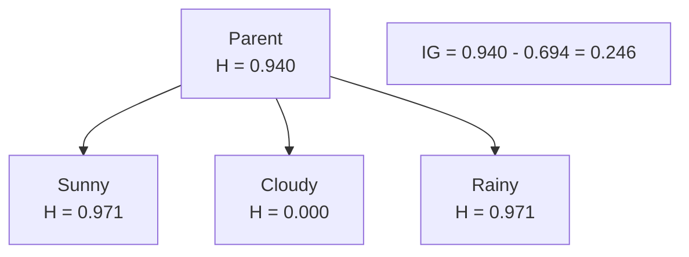
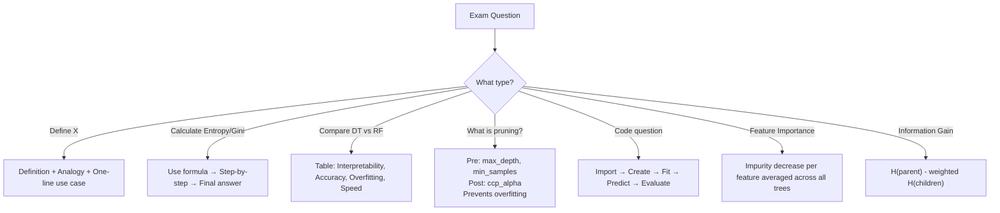

# AS31: Decision Trees and Random Forests - Exam Preparation

---

## Section A: Multiple Choice Questions (MCQ) - 15 Questions

---

### MCQ 1
**Question:** What is the default splitting criterion used by scikit-learn's `DecisionTreeClassifier`?

**Options:**
- A) Entropy
- B) Information Gain
- C) Gini Index
- D) Chi-Square

**✅ Correct Answer:** C

**📖 Explanation:** scikit-learn's DecisionTreeClassifier uses **Gini Index** as the default criterion (`criterion='gini'`). Gini is computationally faster than Entropy because it uses squaring instead of logarithms.

**❌ Why Others Are Wrong:**
- A) Entropy is an alternative (set `criterion='entropy'`) but NOT the default
- B) Information Gain is a concept used WITH Entropy, not a standalone criterion in scikit-learn
- D) Chi-Square is used in CHAID algorithm, not in scikit-learn's CART implementation

---

### MCQ 2
**Question:** What is the Entropy of a dataset where ALL samples belong to the same class?

**Options:**
- A) 1.0
- B) 0.5
- C) 0
- D) log₂(c) where c = number of classes

**✅ Correct Answer:** C

**📖 Explanation:** When all samples belong to one class, $p_1 = 1.0$ and all other $p_i = 0$. $H = -(1.0 × \log_2(1.0)) = -(1.0 × 0) = 0$. Zero entropy = pure subset = no uncertainty.

**❌ Why Others Are Wrong:**
- A) 1.0 is maximum entropy for binary classification (50-50 split)
- B) 0.5 is Gini Index maximum for binary classification
- D) $\log_2(c)$ is maximum entropy when all classes are equally distributed

---

### MCQ 3
**Question:** In a Random Forest with `n_estimators=100`, how does the final classification prediction work?

**Options:**
- A) Average of all tree predictions
- B) Prediction of the tree with highest accuracy
- C) Majority voting across all 100 trees
- D) Weighted average based on tree depth

**✅ Correct Answer:** C

**📖 Explanation:** In Random Forest **classification**, final prediction is by **majority voting** — whichever class gets the most votes from the 100 trees wins. Averaging is used for **regression**, not classification.

**❌ Why Others Are Wrong:**
- A) Averaging is used for Random Forest REGRESSION, not classification
- B) RF doesn't select one "best" tree — all trees contribute equally
- D) No weighted average mechanism in standard RF

---

### MCQ 4
**Question:** What is the Gini Impurity for a dataset with 6 positive and 4 negative samples?

**Options:**
- A) 0.24
- B) 0.48
- C) 0.50
- D) 0.36

**✅ Correct Answer:** B

**📖 Explanation:** $p_{pos} = 6/10 = 0.6$, $p_{neg} = 4/10 = 0.4$. $Gini = 1 - (0.6² + 0.4²) = 1 - (0.36 + 0.16) = 1 - 0.52 = 0.48$

**❌ Why Others Are Wrong:**
- A) 0.24 would be $Gini = 1 - 0.76$ which doesn't match any valid calculation
- C) 0.50 is the maximum Gini for binary classification (50-50 only)
- D) 0.36 is $p_{pos}²$, just one term of the formula, not the final Gini

---

### MCQ 5
**Question:** Which of the following is a PRE-pruning technique?

**Options:**
- A) Cost-Complexity Pruning (ccp_alpha)
- B) Setting max_depth=5
- C) Growing a full tree then removing branches
- D) Calculating effective alpha for each node

**✅ Correct Answer:** B

**📖 Explanation:** Pre-pruning means setting constraints **before** or **during** tree building. `max_depth=5` limits the tree depth during construction — this is a pre-pruning (early stopping) technique.

**❌ Why Others Are Wrong:**
- A) ccp_alpha is a POST-pruning technique — tree is fully grown first, then pruned
- C) "Growing full tree then removing" describes POST-pruning
- D) Calculating effective alpha is part of POST-pruning (cost-complexity pruning path)

---

### MCQ 6
**Question:** In Bootstrap sampling (used in Bagging), approximately what percentage of the original data appears in each bootstrap sample?

**Options:**
- A) 50%
- B) 63.2%
- C) 80%
- D) 100%

**✅ Correct Answer:** B

**📖 Explanation:** With sampling with replacement, each sample has probability $(1 - 1/N)$ of NOT being selected in one draw. Over $N$ draws, probability of not being selected = $(1 - 1/N)^N ≈ e^{-1} ≈ 0.368$. So approximately $1 - 0.368 = 0.632$ or **63.2%** of data appears in each bootstrap sample.

**❌ Why Others Are Wrong:**
- A) 50% would be if we sampled without replacement taking half the data
- C) 80% is a common train-test split ratio, not bootstrap proportion
- D) 100% would mean no randomness in sampling

---

### MCQ 7
**Question:** What does the `random_state` parameter do in `DecisionTreeClassifier`?

**Options:**
- A) Randomly selects the splitting criterion
- B) Randomly shuffles features before training
- C) Ensures reproducible results by fixing the random seed
- D) Randomly prunes the tree after training

**✅ Correct Answer:** C

**📖 Explanation:** `random_state` fixes the random number generator seed, ensuring that running the same code twice produces the **same results**. This is crucial for reproducibility in experiments and debugging.

**❌ Why Others Are Wrong:**
- A) Splitting criterion is set by the `criterion` parameter, not random_state
- B) Feature shuffling is part of Random Forest's max_features, not random_state's primary function
- D) Pruning is controlled by pruning parameters (max_depth, ccp_alpha), not random_state

---

### MCQ 8
**Question:** What is the maximum possible Gini Impurity for a 3-class classification problem?

**Options:**
- A) 0.50
- B) 0.67
- C) 1.00
- D) 1.585

**✅ Correct Answer:** B

**📖 Explanation:** Maximum Gini for c classes = $1 - 1/c = 1 - 1/3 = 0.667 ≈ 0.67$. This happens when all 3 classes have equal proportion (1/3 each).

**❌ Why Others Are Wrong:**
- A) 0.50 is maximum Gini for BINARY (2-class) classification
- C) 1.00 is maximum ENTROPY for binary classification, not Gini
- D) 1.585 is maximum ENTROPY for 3-class classification ($\log_2(3)$)

---

### MCQ 9
**Question:** Which of the following is NOT an advantage of Random Forest over a single Decision Tree?

**Options:**
- A) Better accuracy
- B) Reduced overfitting
- C) Better interpretability
- D) Feature importance estimation

**✅ Correct Answer:** C

**📖 Explanation:** Random Forest has **LOWER interpretability** than a single Decision Tree. A single tree can be visualized and each prediction path can be explained. With 100 trees, this is practically impossible.

**❌ Why Others Are Wrong:**
- A) RF generally has better accuracy — correct advantage
- B) RF reduces overfitting through bagging and random features — correct advantage
- D) RF provides built-in feature_importances_ — correct advantage

---

### MCQ 10
**Question:** In a Decision Tree, what does a node with Gini = 0 represent?

**Options:**
- A) Maximum impurity — all classes equally mixed
- B) Pure subset — all samples belong to one class
- C) An error in the tree construction
- D) The root node always has Gini = 0

**✅ Correct Answer:** B

**📖 Explanation:** Gini = 0 means $1 - \sum p_i^2 = 0$, which is only possible when one class has $p = 1.0$ and all others have $p = 0$. This means ALL samples at that node belong to the same class — a pure subset.

**❌ Why Others Are Wrong:**
- A) Maximum impurity would be Gini = 0.5 (binary) or $1 - 1/c$ (multi-class)
- C) Gini=0 is valid and desirable at leaf nodes
- D) Root node typically has HIGH Gini (mixed data)

---

### MCQ 11
**Question:** In the California Housing dataset example, the R² score was approximately 0.81. What does this mean?

**Options:**
- A) The model is 81% accurate in classification
- B) The model explains approximately 81% of the variance in house prices
- C) 81% of predictions are exactly correct
- D) Mean Squared Error is 0.81

**✅ Correct Answer:** B

**📖 Explanation:** R² (coefficient of determination) measures what proportion of variance in the target variable is explained by the model. R² = 0.81 means the model captures 81% of the variability in house prices. The remaining 19% is unexplained variance.

**❌ Why Others Are Wrong:**
- A) R² is a regression metric, not classification accuracy
- C) R² doesn't count exact matches; it measures variance explained
- D) MSE and R² are different metrics with different scales

---

### MCQ 12
**Question:** What is the purpose of `max_features` parameter in Random Forest?

**Options:**
- A) Limits the total number of features in the dataset
- B) Limits the number of features considered at each split
- C) Removes features with low importance
- D) Scales features before training

**✅ Correct Answer:** B

**📖 Explanation:** `max_features` controls how many features are randomly selected and considered at **each split** in each tree. Default is `sqrt(n_features)` for classification. This creates diversity among trees (decorrelation).

**❌ Why Others Are Wrong:**
- A) It doesn't remove features from the dataset — it randomly samples features at each split
- C) Feature removal based on importance is done separately (feature selection)
- D) Decision Trees don't require feature scaling

---

### MCQ 13
**Question:** Which algorithm does scikit-learn's DecisionTreeClassifier implement?

**Options:**
- A) ID3
- B) C4.5
- C) CART
- D) CHAID

**✅ Correct Answer:** C

**📖 Explanation:** scikit-learn implements the **CART (Classification and Regression Trees)** algorithm, which creates binary splits and uses Gini Index by default. ID3 uses Information Gain with multi-way splits, C4.5 uses Gain Ratio, and CHAID uses Chi-Square.

**❌ Why Others Are Wrong:**
- A) ID3 uses Information Gain and creates multi-way splits — not in scikit-learn
- B) C4.5 uses Gain Ratio — not in scikit-learn
- D) CHAID uses Chi-Square — not in scikit-learn

---

### MCQ 14
**Question:** Why does Random Forest use bootstrap sampling (with replacement)?

**Options:**
- A) To reduce the size of the dataset
- B) To create diverse training sets for each tree
- C) To remove outliers from the data
- D) To ensure all samples are used exactly once

**✅ Correct Answer:** B

**📖 Explanation:** Bootstrap sampling with replacement creates **different subsets** of the original data for each tree. This ensures each tree is trained on a slightly different dataset, creating diversity that makes the ensemble prediction more robust than any single tree.

**❌ Why Others Are Wrong:**
- A) Bootstrap samples are the SAME size as original (just with repetitions)
- C) Bootstrap doesn't specifically target outliers
- D) "Exactly once" describes WITHOUT replacement — bootstrap uses WITH replacement

---

### MCQ 15
**Question:** After pruning a Decision Tree with `max_depth=3`, the accuracy dropped from 83% to 76%. What is the BEST interpretation?

**Options:**
- A) The pruned model is worse and should not be used
- B) The original model was underfitting
- C) The pruned model trades some accuracy for better generalization
- D) max_depth should always be set to None

**✅ Correct Answer:** C

**📖 Explanation:** The accuracy drop is expected after pruning. The pruned model is **simpler, more interpretable, and generalizes better** to unseen data. The unpruned model (83%) likely overfits — high training accuracy but less reliable on new data.

**❌ Why Others Are Wrong:**
- A) Lower accuracy doesn't mean worse — generalization, interpretability, and stability matter
- B) The UNPRUNED model was OVERFITTING, not the original underfitting
- D) max_depth=None (default) often leads to overfitting

---

## Section B: Multiple Select Questions (MSQ) - 12 Questions

---

### MSQ 1
**Question:** Which of the following are valid splitting criteria used in Decision Trees? (Select ALL that apply)

**Options:**
- A) Gini Index
- B) Entropy / Information Gain
- C) Mean Squared Error
- D) R² Score
- E) Chi-Square Test

**✅ Correct Answers:** A, B, C, E

**📖 Explanation:**
- A) Gini Index — used in CART for classification ✅
- B) Entropy/IG — used in ID3/C4.5 for classification ✅
- C) MSE — used for regression trees ✅
- E) Chi-Square — used in CHAID algorithm ✅

**❌ Why Others Are Wrong:**
- D) R² Score is an evaluation metric, not a splitting criterion

---

### MSQ 2
**Question:** Which of the following are pre-pruning parameters in scikit-learn's DecisionTreeClassifier? (Select ALL that apply)

**Options:**
- A) max_depth
- B) min_samples_split
- C) min_samples_leaf
- D) ccp_alpha
- E) max_features

**✅ Correct Answers:** A, B, C, E

**📖 Explanation:**
- A) max_depth — limits tree depth (pre-pruning) ✅
- B) min_samples_split — minimum samples to split a node (pre-pruning) ✅
- C) min_samples_leaf — minimum samples in leaf node (pre-pruning) ✅
- E) max_features — limits features at each split (pre-pruning) ✅

**❌ Why Others Are Wrong:**
- D) ccp_alpha is a POST-pruning parameter (cost-complexity pruning)

---

### MSQ 3
**Question:** Which of the following are TRUE about Random Forests? (Select ALL that apply)

**Options:**
- A) It uses bagging (Bootstrap Aggregating)
- B) It considers all features at every split
- C) Individual trees in RF can be trained in parallel
- D) It provides built-in feature importance
- E) It reduces overfitting compared to a single Decision Tree

**✅ Correct Answers:** A, C, D, E

**📖 Explanation:**
- A) Bagging is the foundation of RF ✅
- C) Trees are independent — can be trained on separate CPU cores ✅
- D) `feature_importances_` attribute is built-in ✅
- E) Multiple trees + random sampling = less overfitting ✅

**❌ Why Others Are Wrong:**
- B) RF considers a **random subset** of features at each split (e.g., `sqrt(n_features)`), NOT all features. This is key to creating diversity!

---

### MSQ 4
**Question:** When is Entropy exactly equal to 0? (Select ALL that apply)

**Options:**
- A) When all samples belong to one class
- B) When the dataset is perfectly pure
- C) When samples are equally distributed across all classes
- D) When there is no uncertainty in the prediction
- E) When the node is a leaf node with only one class

**✅ Correct Answers:** A, B, D, E

**📖 Explanation:**
- A) All one class → $p = 1.0$ → $H = 0$ ✅
- B) "Perfectly pure" = one class = Entropy 0 ✅
- D) No uncertainty = all samples same class = Entropy 0 ✅
- E) Leaf node with one class = pure subset = Entropy 0 ✅

**❌ Why Others Are Wrong:**
- C) Equal distribution gives MAXIMUM entropy, not zero

---

### MSQ 5
**Question:** Which of the following are advantages of Decision Trees? (Select ALL that apply)

**Options:**
- A) High interpretability (can visualize the tree)
- B) No feature scaling needed
- C) Can handle both classification and regression
- D) Very stable to small data changes
- E) Can handle non-linear relationships naturally

**✅ Correct Answers:** A, B, C, E

**📖 Explanation:**
- A) Decision Tree can be visualized and each decision explained ✅
- B) Unlike SVM/LR, DT doesn't need feature normalization ✅
- C) DecisionTreeClassifier for classification, DecisionTreeRegressor for regression ✅
- E) DT creates non-linear decision boundaries through recursive splits ✅

**❌ Why Others Are Wrong:**
- D) Decision Trees are UNSTABLE — small data changes can completely change the tree structure (high variance)

---

### MSQ 6
**Question:** Which of the following describe Heteroscedasticity observed in the RF Regression example? (Select ALL that apply)

**Options:**
- A) Error is constant across all prediction ranges
- B) Error increases with higher house prices
- C) Low-price houses are predicted more accurately
- D) High-price houses have more spread in predictions
- E) It is a desirable property of the model

**✅ Correct Answers:** B, C, D

**📖 Explanation:**
- B) As actual price increases, prediction error increases ✅
- C) Low-price predictions are closer to actual values ✅
- D) High-price predictions show wider scatter ✅

**❌ Why Others Are Wrong:**
- A) Heteroscedasticity means error is NOT constant — it changes
- E) Heteroscedasticity is NOT desirable — it indicates the model struggles with certain ranges

---

### MSQ 7
**Question:** Which of the following cause overfitting in a Decision Tree? (Select ALL that apply)

**Options:**
- A) No max_depth limit set
- B) min_samples_leaf = 1 (default)
- C) Tree growing until pure subsets
- D) Using Gini instead of Entropy
- E) Training on noisy data without regularization

**✅ Correct Answers:** A, B, C, E

**📖 Explanation:**
- A) Unlimited depth → tree grows extremely deep → memorizes data ✅
- B) Leaf with 1 sample = memorizing individual data points ✅
- C) Pure subsets = every sample classified → noise captured ✅
- E) Noise amplifies overfitting when no regularization applied ✅

**❌ Why Others Are Wrong:**
- D) Switching Gini to Entropy generally doesn't affect overfitting — same results in 90% cases

---

### MSQ 8
**Question:** Which of the following are correct about the comparison between Gini Index and Entropy? (Select ALL that apply)

**Options:**
- A) Both give similar results in most cases (90%+)
- B) Gini is computationally faster because it uses squaring
- C) Entropy uses logarithm base 2
- D) Entropy range is always 0 to 1.0
- E) Maximum Gini for binary classification is 0.5

**✅ Correct Answers:** A, B, C, E

**📖 Explanation:**
- A) 90%+ cases lo same tree structure results ✅
- B) $p^2$ is faster than $\log_2(p)$ ✅
- C) Entropy formula uses $\log_2$ ✅
- E) Binary Gini max = $1 - (0.5^2 + 0.5^2) = 0.5$ ✅

**❌ Why Others Are Wrong:**
- D) Entropy range for BINARY is 0 to 1.0, but for multi-class it goes up to $\log_2(c)$ which can exceed 1.0. The statement says "always" which is incorrectyes

---

### MSQ 9
**Question:** What happens when you increase `n_estimators` in a Random Forest from 100 to 1000? (Select ALL that apply)

**Options:**
- A) Training time increases significantly
- B) Accuracy improves dramatically
- C) Memory usage increases
- D) Overfitting risk increases significantly
- E) Accuracy improvement shows diminishing returns

**✅ Correct Answers:** A, C, E

**📖 Explanation:**
- A) 10x more trees = 10x more training time ✅
- C) 10x more trees stored in memory ✅
- E) After ~100-200 trees, additional trees provide marginal improvement ✅

**❌ Why Others Are Wrong:**
- B) Improvement is MARGINAL, not dramatic — diminishing returns
- D) More trees generally DON'T increase overfitting — RF is resistant to this

---

### MSQ 10
**Question:** In the Titanic Random Forest example, which features were identified as most important? (Select ALL that apply)

**Options:**
- A) Age
- B) Fare
- C) Sex (male)
- D) Embarked
- E) Pclass

**✅ Correct Answers:** A, B, C, E

**📖 Explanation:** From the transcript, the most important features in order were: Age, Fare, Sex_male, and Pclass. These features had the highest feature importance scores.

**❌ Why Others Are Wrong:**
- D) Embarked had relatively low feature importance compared to the others listed

---

### MSQ 11
**Question:** Which of the following are valid stopping criteria for a Decision Tree? (Select ALL that apply)

**Options:**
- A) All samples in a node belong to the same class
- B) Maximum depth is reached
- C) Number of samples in a node is below min_samples_split
- D) Information Gain for all features is negative
- E) No more features to split on

**✅ Correct Answers:** A, B, C, E

**📖 Explanation:**
- A) Pure subset → no need to split further ✅
- B) max_depth reached → forced stop ✅
- C) Too few samples → cannot create meaningful split ✅
- E) All features exhausted → nothing to split on ✅

**❌ Why Others Are Wrong:**
- D) Information Gain can be 0 (no improvement) but not negative by definition. The tree stops when gain is 0 or insignificant, not "negative"

---

### MSQ 12
**Question:** Which of the following use Decision Trees as a base component? (Select ALL that apply)

**Options:**
- A) Random Forest
- B) Gradient Boosting (XGBoost, LightGBM)
- C) Linear Regression
- D) AdaBoost
- E) Logistic Regression

**✅ Correct Answers:** A, B, D

**📖 Explanation:**
- A) Random Forest = ensemble of Decision Trees (bagging) ✅
- B) Gradient Boosting uses shallow Decision Trees as weak learners ✅
- D) AdaBoost commonly uses Decision Tree stumps (depth=1) ✅

**❌ Why Others Are Wrong:**
- C) Linear Regression uses linear equations, not trees
- E) Logistic Regression uses sigmoid function, not trees

---

## Section C: Numerical/Calculation Questions - 7 Questions

---

### Numerical 1
**Question:** Calculate the Entropy of a dataset with 10 positive (Yes) and 6 negative (No) samples.

**Given:**
- Positive samples = 10
- Negative samples = 6
- Total samples = 16

**Solution Steps:**
1. $p_{Yes} = 10/16 = 0.625$
2. $p_{No} = 6/16 = 0.375$
3. $H = -(0.625 × \log_2(0.625) + 0.375 × \log_2(0.375))$
4. $H = -(0.625 × (-0.678) + 0.375 × (-1.415))$
5. $H = -((-0.424) + (-0.530))$
6. $H = -(-0.954)$
7. $H = 0.954$

**✅ Final Answer:** Entropy = **0.954**

---

### Numerical 2
**Question:** Calculate the Gini Impurity for a node with 30 Class A, 20 Class B, and 10 Class C samples.

**Given:**
- Class A = 30, Class B = 20, Class C = 10
- Total = 60

**Solution Steps:**
1. $p_A = 30/60 = 0.5$
2. $p_B = 20/60 = 0.333$
3. $p_C = 10/60 = 0.167$
4. $Gini = 1 - (p_A^2 + p_B^2 + p_C^2)$
5. $Gini = 1 - (0.5^2 + 0.333^2 + 0.167^2)$
6. $Gini = 1 - (0.250 + 0.111 + 0.028)$
7. $Gini = 1 - 0.389$
8. $Gini = 0.611$

**✅ Final Answer:** Gini Impurity = **0.611**

---

### Numerical 3
**Question:** Calculate the Information Gain when splitting the following dataset on Feature "Weather":

| | Play = Yes | Play = No | Total |
|---|---|---|---|
| Sunny | 2 | 3 | 5 |
| Cloudy | 4 | 0 | 4 |
| Rainy | 3 | 2 | 5 |
| **Total** | **9** | **5** | **14** |

**Solution Steps:**

**Step 1: Parent Entropy**
$H(Parent) = -(9/14 × \log_2(9/14) + 5/14 × \log_2(5/14))$
$H(Parent) = -(0.643 × (-0.637) + 0.357 × (-1.486))$
$H(Parent) = -(-0.410 + (-0.531))$
$H(Parent) = 0.940$

**Step 2: Child Entropies**
$H(Sunny) = -(2/5 × \log_2(2/5) + 3/5 × \log_2(3/5)) = 0.971$
$H(Cloudy) = -(4/4 × \log_2(4/4)) = 0$ (Pure!)
$H(Rainy) = -(3/5 × \log_2(3/5) + 2/5 × \log_2(2/5)) = 0.971$

**Step 3: Weighted Average**
$H(Children) = (5/14 × 0.971) + (4/14 × 0) + (5/14 × 0.971)$
$H(Children) = 0.347 + 0 + 0.347 = 0.694$

**Step 4: Information Gain**
$IG = 0.940 - 0.694 = 0.246$

**✅ Final Answer:** Information Gain = **0.246**



---

### Numerical 4
**Question:** Calculate the Gini Gain for the following split:

| | Fraud = Yes | Fraud = No | Total |
|---|---|---|---|
| Amount > ₹10K | 8 | 2 | 10 |
| Amount ≤ ₹10K | 3 | 7 | 10 |
| **Total** | **11** | **9** | **20** |

**Solution Steps:**

**Step 1: Gini(Parent)**
$Gini(Parent) = 1 - ((11/20)^2 + (9/20)^2) = 1 - (0.3025 + 0.2025) = 1 - 0.505 = 0.495$

**Step 2: Gini(Amount > ₹10K)**
$Gini(Left) = 1 - ((8/10)^2 + (2/10)^2) = 1 - (0.64 + 0.04) = 0.32$

**Step 3: Gini(Amount ≤ ₹10K)**
$Gini(Right) = 1 - ((3/10)^2 + (7/10)^2) = 1 - (0.09 + 0.49) = 0.42$

**Step 4: Weighted Gini**
$Gini(Split) = (10/20 × 0.32) + (10/20 × 0.42) = 0.16 + 0.21 = 0.37$

**Step 5: Gini Gain**
$Gini\ Gain = 0.495 - 0.37 = 0.125$

**✅ Final Answer:** Gini Gain = **0.125**

---

### Numerical 5
**Question:** In a Random Forest with 100 trees, 65 predict "Spam" and 35 predict "Not Spam". What is the final prediction? If we add 10 more trees (all predicting "Not Spam"), what happens?

**Solution Steps:**

**Original (100 trees):**
- Spam votes: 65
- Not Spam votes: 35
- Majority: Spam (65 > 35)

**After adding 10 more trees (110 total):**
- Spam votes: 65
- Not Spam votes: 35 + 10 = 45
- Majority: Spam (65 > 45)

**✅ Final Answer:** Both cases predict **"Spam"** — majority still favors Spam (65 vs 45).

---

### Numerical 6
**Question:** Using the binary Gini shortcut formula $Gini = 2p(1-p)$, calculate Gini for the following distributions: (a) 70% positive, 30% negative (b) 90% positive, 10% negative

**Solution Steps:**

**(a) p = 0.7:**
$Gini = 2 × 0.7 × 0.3 = 0.42$

**(b) p = 0.9:**
$Gini = 2 × 0.9 × 0.1 = 0.18$

**Verification with standard formula:**
(a) $1 - (0.7^2 + 0.3^2) = 1 - (0.49 + 0.09) = 0.42$ ✅
(b) $1 - (0.9^2 + 0.1^2) = 1 - (0.81 + 0.01) = 0.18$ ✅

**✅ Final Answers:** (a) Gini = **0.42**, (b) Gini = **0.18**

---

### Numerical 7
**Question:** A Random Forest with bootstrap sampling has 1000 original samples. What is the expected number of unique samples in one bootstrap sample? How many out-of-bag samples?

**Given:**
- Original dataset: N = 1000
- Bootstrap sample size: N = 1000 (same) with replacement

**Solution Steps:**
1. Probability of one sample NOT being selected in one draw = $(1 - 1/1000)$
2. Probability of NOT being selected in 1000 draws = $(1 - 1/1000)^{1000} ≈ e^{-1} ≈ 0.368$
3. Expected unique samples = $1000 × (1 - 0.368) = 1000 × 0.632 = 632$
4. Expected OOB samples = $1000 - 632 = 368$

**✅ Final Answer:** Approximately **632 unique samples** in bootstrap, **368 out-of-bag samples**

---

## Section D: Fill in the Blanks - 8 Questions

---

### Fill 1
**Question:** The default splitting criterion in scikit-learn's DecisionTreeClassifier is _______.

**Answer:** Gini Index (or `gini`)

**Explanation:** scikit-learn's CART implementation uses Gini Impurity as the default criterion for classification. Set `criterion='gini'` (default) or `criterion='entropy'` to switch.

---

### Fill 2
**Question:** The formula for Entropy is H(S) = _______.

**Answer:** $-\sum_{i=1}^{c} p_i \cdot \log_2(p_i)$

**Explanation:** Entropy measures the impurity/uncertainty in a dataset. Each class probability is multiplied by its log base 2, summed, and negated.

---

### Fill 3
**Question:** In Random Forest, each bootstrap sample contains approximately _______% of the original data, and _______% are out-of-bag samples.

**Answer:** 63.2%, 36.8%

**Explanation:** Due to sampling with replacement, $(1 - 1/N)^N ≈ e^{-1} ≈ 0.368$ probability of not being selected. So 63.2% are selected, 36.8% are out-of-bag.

---

### Fill 4
**Question:** Pruning a Decision Tree helps prevent _______ by reducing tree _______.

**Answer:** overfitting, complexity (or depth)

**Explanation:** Pruning reduces the tree's complexity (fewer nodes, lower depth), which prevents the model from memorizing training data and improves generalization to unseen data.

---

### Fill 5
**Question:** In Random Forest classification, predictions are made using _______, while in regression, predictions use _______.

**Answer:** majority voting, averaging

**Explanation:** For classification, each tree casts a vote for a class, and the majority class wins. For regression, each tree predicts a number, and the predictions are averaged.

---

### Fill 6
**Question:** The binary shortcut formula for Gini Impurity is _______.

**Answer:** $Gini = 2p(1-p)$ where p is the proportion of the positive class

**Explanation:** For binary classification, $Gini = 1 - (p^2 + (1-p)^2) = 1 - p^2 - 1 + 2p - p^2 = 2p - 2p^2 = 2p(1-p)$.

---

### Fill 7
**Question:** Random Forest uses random subsets of _______ at each split to create _______ among trees.

**Answer:** features, diversity (decorrelation)

**Explanation:** By considering only a random subset of features (e.g., sqrt(n_features)) at each split, different trees learn different patterns, making the ensemble more robust.

---

### Fill 8
**Question:** In scikit-learn, the parameter `n_estimators` in RandomForestClassifier controls the _______.

**Answer:** number of Decision Trees in the forest

**Explanation:** `n_estimators=100` means 100 individual Decision Trees are trained on bootstrap samples and their predictions are combined via majority voting.

---

## 📚 Quick Revision Points

### Key Formulas
- **Entropy:** $H(S) = -\sum p_i \log_2(p_i)$ — Range: 0 to $\log_2(c)$
- **Gini:** $G(S) = 1 - \sum p_i^2$ — Range: 0 to $1 - 1/c$
- **Gini Shortcut (Binary):** $G = 2p(1-p)$
- **Information Gain:** $IG = H(parent) - \sum (|S_v|/|S|) × H(S_v)$
- **Bootstrap OOB:** ~36.8% of data is out-of-bag (≈ $e^{-1}$)

### Key Concepts Summary
| Concept | One-Line Definition | When to Use |
|---------|---------------------|-------------|
| Decision Tree | Tree-shaped model using questions to classify data | When interpretability is critical |
| Entropy | Measure of uncertainty (0 = pure, high = mixed) | With Information Gain for splitting |
| Gini Index | Impurity measure (faster than Entropy) | Default in scikit-learn DecisionTreeClassifier |
| Information Gain | Entropy reduction after a split | To select the best feature/split point |
| Pre-Pruning | Setting limits before/during tree building | max_depth, min_samples_split, min_samples_leaf |
| Post-Pruning | Growing full tree then cutting weak branches | ccp_alpha parameter |
| Random Forest | Ensemble of many Decision Trees using bagging | When accuracy > interpretability |
| Bagging | Bootstrap Aggregating — sample data + train trees + combine | Foundation of Random Forest |
| Feature Importance | Ranking of which features matter most | Feature selection, model understanding |

### Common Exam Traps
1. **Trap:** "Entropy is always between 0 and 1" → **Correct:** Only true for binary! Multi-class goes up to $\log_2(c)$
2. **Trap:** "Gini = 0 is bad" → **Correct:** Gini = 0 means pure subset — good for leaf nodes!
3. **Trap:** "Random Forest can overfit" → **Correct:** Technically yes, but practically very resistant. More trees don't overfit.
4. **Trap:** "Pruning always reduces accuracy" → **Correct:** On TRAINING data yes, but on TEST data accuracy may improve!
5. **Trap:** "Gini Index measures income inequality" → **Correct:** That's Gini COEFFICIENT — different formula!

---

## 🚀 Section E: Shortcuts & Cheat Codes for Exam

### ⚡ One-Liner Shortcuts
| Concept | Shortcut/Cheat Code | When to Use |
|---------|---------------------|-------------|
| Gini (Binary) | $2p(1-p)$ | Whenever you see binary classification Gini |
| Entropy (50-50) | Always = 1.0 | Quick check: equal binary = max entropy |
| Gini (50-50) | Always = 0.5 | Quick check: equal binary = max Gini |
| Entropy (pure) | Always = 0 | If all same class, don't calculate — it's 0 |
| Bootstrap unique | ~63.2% | When asked about bootstrap sampling |
| OOB proportion | ~36.8% | Out-of-bag estimation |
| max Entropy (c classes) | $\log_2(c)$ | Multi-class max entropy |
| max Gini (c classes) | $1 - 1/c$ | Multi-class max Gini |

### 🎯 Memory Tricks (Mnemonics)
1. **"G-S-I"** = Gini uses Squaring, Information Gain uses log → "Gini Squares It" → Helps remember: Gini formula uses $p^2$
2. **"ROOT-INT-LEAF"** = Root-Internal-Leaf → Tree has 3 parts, top to bottom → Helps remember: DT structure
3. **"BARF"** = Bagging + Aggregating + Random Features = Forest → Helps remember: Random Forest components
4. **"PRUNE = PRe + UNEarth"** = Pre-pruning + Unearth (dig out) post-pruning → Helps remember: Two types of pruning
5. **"63-37"** = 63% in sample, 37% out-of-bag → Helps remember: Bootstrap proportions

### 🔢 Quick Calculation Hacks
| Scenario | Hack/Shortcut | Example |
|----------|---------------|---------|
| Binary Gini | Use $2p(1-p)$ | p=0.7 → $2×0.7×0.3 = 0.42$ |
| Pure subset | Skip calculation → H=0, Gini=0 | All same class → 0 |
| Equal binary | Skip → H=1.0, Gini=0.5 | 50-50 split → max! |
| 3-class equal | Max H=$\log_2(3)≈1.585$, Max Gini=$1-1/3≈0.667$ | Each class 33.3% |
| Weighted avg | Weight = subset_size/total | 5/14 × H(subset) |

### 📝 Last-Minute Formula Sheet
```
📌 Entropy: H(S) = -Σ pᵢ log₂(pᵢ) → Use when: Asked about Information Theory or splitting
📌 Gini: G(S) = 1 - Σ pᵢ² → Use when: Asked about CART or scikit-learn default
📌 Gini Shortcut: G = 2p(1-p) → Use when: Binary classification only
📌 IG = H(parent) - Σ(|Sv|/|S|) × H(Sv) → Use when: Calculating best split
📌 Max Entropy (binary) = 1.0 → Use when: 50-50 split
📌 Max Gini (binary) = 0.5 → Use when: 50-50 split
📌 Bootstrap unique ≈ 63.2% → Use when: Asked about bagging
📌 OOB ≈ 36.8% → Use when: Asked about out-of-bag
📌 R² = 1 means perfect → Use when: Evaluating regression
```

### 🎓 Interview One-Liners
| Question Pattern | Safe Answer Template |
|------------------|---------------------|
| "What is a Decision Tree?" | "A Decision Tree is a tree-shaped model that makes predictions by asking a series of yes/no questions about features, splitting data until reaching leaf nodes with final predictions." |
| "What is Gini Index?" | "Gini Index measures the impurity of a node — probability of misclassifying a randomly chosen sample. 0 means pure, 0.5 (binary) means maximum impurity." |
| "Why use Random Forest over Decision Tree?" | "Random Forest reduces overfitting by combining multiple diverse trees via bagging and random feature selection, achieving better accuracy and stability." |
| "How does pruning help?" | "Pruning controls tree complexity to prevent overfitting — trading some training accuracy for better generalization on unseen data." |
| "What is bagging?" | "Bagging (Bootstrap Aggregating) creates multiple models on random subsets of data with replacement, then combines their predictions for more robust results." |
| "Explain Feature Importance" | "Feature Importance measures how much each feature contributes to the model's predictions, calculated by averaging the impurity decrease across all trees in the forest." |
| "Gini vs Entropy?" | "Both measure impurity. Gini uses squaring (faster), Entropy uses logarithm. Results are similar in 90%+ cases. Gini is scikit-learn's default." |

### ⚠️ "If You Forget Everything, Remember This"
1. **Golden Rule 1:** Decision Tree = Questions game → Best split via Gini/Entropy → Prune to avoid overfitting
2. **Golden Rule 2:** Random Forest = Multiple Trees + Bootstrap + Random Features + Majority Vote = Better than single tree
3. **Golden Rule 3:** Gini = $1 - \sum p_i^2$ (scikit-learn default), Entropy = $-\sum p_i \log_2(p_i)$ — both give similar results

### 🔄 Quick Decision Flowchart


### 🎯 Safe Answer Patterns
- **For "What is X?"** → Definition + One-line use case
- **For "Explain X"** → Analogy + Technical definition + Example
- **For "Compare X vs Y"** → Table with 4-5 differences
- **For "Calculate X"** → Formula + Step-by-step + Final answer
- **For "Why X?"** → Problem it solves + Alternative comparison
- **For "Code for X?"** → Import + Create + Fit + Predict + Evaluate (5-step pattern)
- **For "When to use X vs Y?"** → Use X when [condition], use Y when [condition]
