# AS40: Regularization and Generalization - Classroom Session (Part 1)

> 📚 **This is Part 1** covering: Machine Learning Goals, Generalization, Underfitting, Overfitting, Bias-Variance Tradeoff
> 📘 **See also:** [Part 2 - Regularization Techniques](./AS40_RegularizationGeneralization2.md), [Part 3 - Dropout & Learning Curves](./AS40_RegularizationGeneralization3.md)

---

## 🗺️ Complete Mind Map - All Topics to Cover


---

## 🎓 Classroom Conversation - Part 1

### 📍 Mind Map for This Part


---

### Topic 1: Introduction - Machine Learning Ultimate Goal

**Teacher:** Namaskaram students! Aaj mana class lo chala important topic discuss chestam - Regularization and Generalization. Ee topic complete machine learning journey lo oka foundation concept. Mundu start cheyyamundha, oka simple question adugutanu - mana machine learning model yokka ultimate goal enti?

**Beginner Student:** Sir, mana model accurate ga predict cheyyali kada?

**Teacher:** Correct, kani accuracy ante enti exactly? Training data meedha accuracy kavala, leka real world unseen data meedha accuracy kavala?

**Clever Student:** Sir, real world data meedha accuracy kavali. Training data meedha perform cheste use enti? We will never see that data again in production.

**Teacher:** Perfect! Idi chala critical point. Mana model ni train chestam training data tho, kani mana ultimate goal enti ante - **unseen data, new data, production data** meedha baga perform cheyyali. Idi simple ga cheppalante - oka student exam preparation laaga artham cheskundi.

> 💡 **Jargon Alert - Unseen Data**
> Simple Explanation: Training time lo model chudani data - like exam paper which you haven't seen before
> Example: Exam lo new questions vastay - same concept but different presentation

**Beginner Student:** Sir, training data meedha baga perform cheste automatically test data meedha perform chestadi kada?

**Teacher:** Ledu! Ikkade main problem start avthadi. Imagine chey - oka student book lo anni questions byheartedly muggudu chesadu. Examin lo exact same questions vasthe 100 marks vasthay. Kani kottaga oka tricky question vasthe - fail avthadu!

**Practical Student:** Sir, ee concept industry lo ela important? Interviews lo aduguthara?

**Teacher:** Interviews lo definitely adugutharu! "Explain overfitting and how to prevent it" - ee question almost every ML interview lo untadi. Real projects lo - oka fraud detection model train chestav, training data lo 99% accuracy vasthadi, kani production lo new fraud patterns vasthe model fail avthadi. Adi disaster!

---

### Topic 2: Generalization - The Heart of Machine Learning

**Teacher:** Ippudu mana main concept ki vastam - **Generalization**. 

> 💡 **Jargon Alert - Generalization**
> Simple Explanation: Model ability to perform well on data it has never seen before - like a student who understood concepts can solve any question, not just memorized ones
> Example: A doctor who learned diseases properly can diagnose new patients, not just textbook cases

**Curious Student:** Sir, generalization ante exactly enti? Proper definition cheppandi.

**Teacher:** Generalization ante - **mana model training data meedha learn chesina patterns ni unseen data meedha apply cheyye ability**. 

Oka real life example chuddam:
- **Good Generalization**: Oka doctor anatomy baga learn chesadu, ippudu any patient ni diagnose cheyagaladu
- **Poor Generalization**: Oka doctor only book lo unna cases muggudu chesadu, new patient symptoms vasthe confused avthadu

**Clever Student:** Sir, generalization ni ela measure chestam? Quantitatively cheppagalara?

**Teacher:** Excellent question! Memu measure chestam through **training accuracy vs validation accuracy** comparison. 

```
Generalization Gap = Validation Loss - Training Loss
```

OR in terms of accuracy:
```
Generalization Gap = Training Accuracy - Validation Accuracy
```

**Idi gap small unte → good generalization**
**Idi gap large unte → poor generalization (usually overfitting)**

**Beginner Student:** Sir, training and validation enti? Different aa?

**Teacher:** Haan, very important question! Let me explain with diagram:


- **Training Data**: Model idi chusi learn chestadi - like student reading textbook
- **Validation Data**: Model tuning kosam use chestam - like student practicing previous year papers
- **Test Data**: Final evaluation - like actual exam (model never sees this during training)

**Critique Student:** Sir, kani validation data kuda model indirect ga chustadi kada during hyperparameter tuning? Adi true unseen data avvadhu?

**Teacher:** Excellent observation! Ade reason Test data completely separate ga untadi. Validation data meedha based on results, memu hyperparameters tune chestam, so adi truly unseen kaadu. But test data - final exam paper laaga - adi truly unseen.

**Debate Student:** Sir, cross-validation use cheste better kaada? Single validation split kaakunda?

**Teacher:** Very valid point! Cross-validation definitely more robust. K-fold cross-validation lo, data ni K parts ga divide chesi, each part once validation set ga use avthadi. Idi variance reduce chestadi. But computationally expensive. Simple cases lo train-validation-test split sufficient.

---

### Topic 3: Underfitting - When Model is Too Simple

**Teacher:** Ippudu mana first problematic scenario discuss chestam - **Underfitting**.

> 💡 **Jargon Alert - Underfitting**
> Simple Explanation: Model too simple - can't learn even basic patterns from data. Like a class 5 student trying to learn calculus - mind itself not ready
> Example: Drawing a straight line through curved data points - line can't capture the curve pattern

**Beginner Student:** Sir, underfitting ante model golu golu ga untada?

**Teacher:** Haha, nice way to put it! 😄 Yes, underfitting ante model **too weak, too simple, too dull** to learn the underlying patterns in data.

Imagine chey:
- 10 years data tho stock market predict cheyyali
- Model: Simple straight line fit
- Reality: Stock market has complex ups and downs

Ee simple line can't capture those complex patterns. Adi underfitting!

**Clever Student:** Sir, mathematically underfitting ni ela identify chestam?

**Teacher:** Great question! Underfitting signs:

| Indicator | Value/Pattern |
|-----------|---------------|
| Training Accuracy | LOW ❌ |
| Validation Accuracy | LOW ❌ |
| Training Loss | HIGH ❌ |
| Validation Loss | HIGH ❌ |
| Gap between Train/Val | SMALL (both are bad) |

Ikkada key point enti ante - **both training AND validation performance chala bad**. Model training data kuda learn cheyyaledu, validation data ento dooram!

**Practical Student:** Sir, underfitting detection code cheppandi?

**Teacher:** Sure! Simple example:

```python
# Training Results Example - Underfitting
history = model.fit(X_train, y_train, validation_data=(X_val, y_val), epochs=50)

# Check for underfitting
train_acc = history.history['accuracy'][-1]  # Final training accuracy
val_acc = history.history['val_accuracy'][-1]  # Final validation accuracy

print(f"Training Accuracy: {train_acc:.4f}")
print(f"Validation Accuracy: {val_acc:.4f}")

# Underfitting indicators:
# train_acc ≈ 0.55 (LOW!)
# val_acc ≈ 0.52 (LOW!)
# Both are close but BOTH are bad!
```

**Curious Student:** Sir, underfitting enduku vasthadi? Causes enti?

**Teacher:** Excellent question! Underfitting causes chala untay:


1. **Model Too Simple**: 2 layer neural network for complex image recognition
2. **Too Few Features**: Using only age to predict disease when symptoms needed
3. **Too Much Regularization**: Lambda chala high - weights ki breathe space ledu
4. **Too Few Epochs**: Training 5 epochs when 100 needed
5. **High Learning Rate**: Model oscillating, settle avvaledu
6. **Poor Feature Engineering**: Raw data ichhinam, meaningful features extract cheyyaledu

**Critique Student:** Sir, eppudu too simple ante ela telustadi? How many layers are "enough"?

**Teacher:** Valid concern! Idi trial and error tho determine chestam. General guidelines:

- **Tabular data (simple)**: 2-4 layers sufficient
- **Image classification**: 5-15+ layers (CNNs)
- **Complex NLP**: 12-24 layers (Transformers)

But actual lo - start with simpler model, check performance, then increase complexity if underfitting.

**Beginner Student:** Sir, underfitting fix ela chestam?

**Teacher:** Underfitting remedies:

| Problem | Solution |
|---------|----------|
| Model too simple | Add more layers, more neurons |
| Few features | Add more relevant features |
| Too much regularization | Reduce lambda, reduce dropout |
| Few epochs | Train longer |
| High learning rate | Reduce learning rate |
| Poor data | Get more data, better data |


> 💡 **Jargon Alert - High Bias**
> Simple Explanation: Underfitting is also called "High Bias" - model has strong assumptions that don't match reality
> Example: Assuming all relationships are linear when they're actually curved

---

### Topic 4: Overfitting - When Model Memorizes Instead of Learning

**Teacher:** Ippudu mana main villain ki vastam - **Overfitting**! Ee concept regularization ki directly related.

> 💡 **Jargon Alert - Overfitting**
> Simple Explanation: Model memorizes training data including noise, fails on new data. Like mugging up textbook word-by-word - same question vasthe answer vastadi, slightly different question vasthe confuse!
> Example: Student who memorized "India capital is Delhi" - if asked "What is Delhi?" - confused!

**Beginner Student:** Sir, overfitting ante model clever ga untadi kada? Training meedha baga perform chesthadi?

**Teacher:** Ikkade trick undi! Model **too clever for its own good**. Training data lo unna noise, outliers, random patterns anni nerchukunadi. But ae patterns are specific to training data - unseen data lo avi levu!

Real life example:
- Oka student previous year papers anni muggudu chesadu
- Exact same format questions vasthe - 100%
- Slightly different format vasthe - FAIL!

Ee student understood concepts kaadu - just memorized patterns!

**Clever Student:** Sir, mathematically overfitting ela identify chestam?

**Teacher:** Overfitting patterns chala clear:

| Indicator | Value/Pattern |
|-----------|---------------|
| Training Accuracy | VERY HIGH ✅ (too good!) |
| Validation Accuracy | LOW ❌ |
| Training Loss | VERY LOW ✅ (too good!) |
| Validation Loss | HIGH ❌ or INCREASING ⚠️ |
| Gap between Train/Val | LARGE ❌ (this is the problem!) |

Key signature: **Training performance excellent, validation performance poor!**

```python
# Overfitting Example
# After training:
train_acc = 0.99  # 99% - Almost perfect!
val_acc = 0.72    # 72% - Significantly worse!

gap = train_acc - val_acc  # 0.27 - Large gap! OVERFITTING!
```

**Practical Student:** Sir, real interview lo overfitting question ela vasthadi?

**Teacher:** Common interview questions:

1. **"What is overfitting and how to detect it?"**
   - Answer: High train accuracy, low val accuracy, large gap

2. **"Tell me techniques to prevent overfitting"**
   - Regularization (L1, L2), Dropout, Early Stopping, More Data, Data Augmentation

3. **"You trained a model with 99% train accuracy but 70% test accuracy. What's wrong?"**
   - Overfitting! Model memorized training data.

**Curious Student:** Sir, overfitting enduku vasthadi? Root causes enti?

**Teacher:** Excellent question! Let me explain with diagram:


1. **Model Too Complex**: 100 layer network for classifying 2 categories
2. **Too Little Data**: Only 1000 images for 1000-class classification
3. **Too Many Epochs**: Training for 1000 epochs when 50 sufficient
4. **No Regularization**: Weights free ga grow avthay
5. **Noisy Data**: Outliers, labeling errors in training data
6. **Too Many Features**: Curse of dimensionality

**Debate Student:** Sir, oka doubt. Training data samples increase cheste overfitting reduce avthada?

**Teacher:** Absolutely! More diverse training data = less overfitting. 

Think about it:
- 100 photos of cats → model memorizes specific features of those 100 cats
- 100,000 photos of cats → model HAS to generalize - can't memorize all!


**Critique Student:** Sir, kani real world lo more data always available undadu. Limited data tho ela handle chestam?

**Teacher:** Great practical concern! Limited data scenarios lo:

1. **Data Augmentation**: Same image rotate, flip, zoom - artificially increase data
2. **Regularization**: L1, L2, Dropout - force model to be simpler
3. **Transfer Learning**: Pre-trained model use - already learned features use
4. **Cross-Validation**: Available data better utilize
5. **Simpler Model**: Match model complexity to data size

---

### Topic 5: Bias-Variance Tradeoff

**Teacher:** Ippudu oka key concept - **Bias-Variance Tradeoff**. Underfitting and Overfitting ni another perspective lo chustam.

> 💡 **Jargon Alert - Bias**
> Simple Explanation: Error from wrong assumptions in the learning algorithm. Model too simplified view of data.
> Example: Assuming road is always straight when it actually curves

> 💡 **Jargon Alert - Variance**
> Simple Explanation: Error from sensitivity to small fluctuations in training data. Model too sensitive to specific training examples.
> Example: Student answer changes completely if one word in question changes

**Beginner Student:** Sir, bias and variance simple ga explain cheyandi?

**Teacher:** Let me give you a perfect analogy:

**Bias (High = Underfitting)**:
- Imagine archer ↤
- Arrows consistently missing target - all arrows go LEFT of bullseye
- Archer has **systematic error** - wrong technique
- Even with practice, arrows go same wrong direction

**Variance (High = Overfitting)**:
- Another archer
- Arrows scattered EVERYWHERE - some left, some right, some up, some down
- No consistency
- Too sensitive to every small hand movement

```mermaid
graph TB
    subgraph "High Bias Low Variance"
        A1((●))
        A2((●))
        A3((●))
        A4((●))
        A1 --- A2
        A2 --- A3
        A3 --- A4
    end
    
    subgraph "Low Bias High Variance"  
        B1((●))
        B2((●))
        B3((●))
        B4((●))
    end
    
    subgraph "Sweet Spot"
        C[Target🎯]
    end
```



**Clever Student:** Sir, mathematically ela represent chestam?

**Teacher:** 

```
Total Error = Bias² + Variance + Irreducible Error
```

- **Bias²**: Error from simplifying assumptions (underfitting)
- **Variance**: Error from model complexity (overfitting)
- **Irreducible Error**: Noise in data (can't reduce)


**Practical Student:** Sir, interview lo bias-variance tradeoff question ela answer cheyaali?

**Teacher:** Perfect answer structure:

**Question**: "Explain Bias-Variance Tradeoff"

**Model Answer**:
> "Bias-Variance tradeoff is the fundamental tension in ML between model simplicity and complexity.
> 
> **High Bias** (Underfitting): Model too simple, makes strong assumptions, consistently wrong in same way. Both training and validation errors high.
> 
> **High Variance** (Overfitting): Model too complex, memorizes training data, performs differently on different datasets. Training error low but validation error high.
> 
> **Goal**: Find the sweet spot where total error (Bias² + Variance) is minimized.
> 
> **Solutions**: For high bias - increase complexity. For high variance - regularization, more data, simpler model."

**Curious Student:** Sir, eppudu model complexity exact ga ela decide chestam? Magic number unda?

**Teacher:** No magic number! Adi iterative process:

```mermaid
flowchart TD
    A[Start with Simple Model] --> B[Train and Evaluate]
    B --> C{Check Performance}
    C -->|Both train/val low| D[Underfitting - Increase Complexity]
    C -->|Train high, val low| E[Overfitting - Reduce Complexity/Add Regularization]
    C -->|Both good, gap small| F[Good Fit! ✅]
    D --> B
    E --> B
```



**Debate Student:** Sir, oka situation lo - training accuracy 85%, validation accuracy 83%. Idi overfitting aa underfitting aa?

**Teacher:** Excellent scenario-based question! 

**Analysis**:
- Training: 85%
- Validation: 83%
- Gap: 2%

**Verdict**: Neither severe overfitting nor underfitting! 
- Gap small (2%) → Not overfitting
- Both accuracies reasonably high → Not underfitting
- This is **GOOD FIT**! ✅

But context matters:
- If task is simple and should give 95% → both are underfitting
- If task is complex and 85% is good → perfect fit!

---

## 📝 Part 1 Summary

**Teacher:** Okay students, let's quickly summarize Part 1 before moving to regularization techniques in Part 2.

### Key Takeaways - Part 1

1. **Ultimate Goal**: Model should generalize well to unseen data, not just training data
2. **Generalization**: Ability to perform well on new, unseen examples
3. **Generalization Gap**: Difference between training and validation performance
4. **Underfitting (High Bias)**:
   - Model too simple
   - Both train AND validation performance poor
   - Solution: More complexity, more data, more epochs
5. **Overfitting (High Variance)**:
   - Model too complex
   - Training good but validation poor
   - Solution: Regularization (Next topic!)
6. **Bias-Variance Tradeoff**: Balance between underfitting and overfitting

### Common Mistakes - Part 1

| Mistake | Correction |
|---------|------------|
| "High training accuracy = good model" | Check validation accuracy too! |
| "Add more layers if accuracy low" | First check if it's under or overfitting |
| "Overfitting only happens with neural networks" | Any ML model can overfit! |
| "Bias and Variance are bad" | Some amount of both is inevitable - find balance |

### Jargon Glossary - Part 1

| Term | Simple Meaning |
|------|----------------|
| Generalization | Perform well on unseen data |
| Underfitting | Model too weak to learn |
| Overfitting | Model memorizes instead of learns |
| Bias | Systematic error from wrong assumptions |
| Variance | Error from over-sensitivity to training data |
| Generalization Gap | Train performance minus Val performance |

---

> 📘 **Continue to Part 2**: [Regularization Techniques (L1, L2, Elastic Net)](./AS40_RegularizationGeneralization2.md)
