# AS40: Regularization and Generalization - Classroom Session (Part 2)

> 📚 **This is Part 2** covering: Regularization Introduction, L2 Regularization (Ridge), L1 Regularization (Lasso), Elastic Net, Mathematical Intuition, Lambda Hyperparameter
> 📘 **Previous:** [Part 1 - Generalization & Overfitting](./AS40_RegularizationGeneralization1.md)
> 📘 **Next:** [Part 3 - Dropout & Learning Curves](./AS40_RegularizationGeneralization3.md)

---

## 🎓 Classroom Conversation - Part 2

### 📍 Mind Map for This Part


---

### Topic 6: Regularization - Introduction

**Teacher:** Okay students, Part 1 lo memu overfitting problem understand chesam. Ippudu solution ki vastam - **Regularization**!

> 💡 **Jargon Alert - Regularization**
> Simple Explanation: Technique to prevent model from becoming too complex. Like teacher saying "Don't mug up! Understand concepts!"
> Example: Adding rules to control how much each weight can grow

**Beginner Student:** Sir, regularization ante exactly enti? Simple ga explain cheyandi.

**Teacher:** Regularization ante oka **deliberately deliberate attempt to make your model weaker** so that it performs better on unseen data.

Wait, what? Model ni weak cheyyalani antunnara?? Adi counterintuitive kada?

**Curious Student:** Sir, adi strange ga undi. Memu model ni strong cheyyali annaru mundu. Ippudu weak cheymanmantunnaru?

**Teacher:** Excellent question! Idhi chala important intuition:

Imagine two students:
1. **Student A**: Everything mugging up - every example, every sentence from textbook
2. **Student B**: Concepts slowly understand - steady and systematic learning

Question paper lo:
- Exact same question vasthe → Student A wins
- Slightly different question vasthe → **Student B wins!**

Student A is **too specialized** on training material. Student B has **generalized understanding**!


**Practical Student:** Sir, regularization real ML projects lo chala important aa?

**Teacher:** Critical! Almost every production ML model uses some form of regularization:

| Application | Regularization Used |
|-------------|---------------------|
| Fraud Detection | L2 (Ridge) |
| Spam Filtering | L1 (Lasso) for feature selection |
| Image Classification | Dropout + L2 |
| NLP Models | Dropout + Weight Decay |
| Recommendation Systems | L2 with careful tuning |

**Critique Student:** Sir, kani model weak chesthe accuracy drop avvadu?

**Teacher:** Training accuracy slightly drop avvachu. But validation/test accuracy improve avthadi! That's the exchange we want.

Remember:
- Without regularization: Train 99%, Val 70% (Overfitting!)
- With regularization: Train 90%, Val 88% (Good Generalization!)

Which is better for real-world use? 90-88 of course!

---

### Topic 7: L2 Regularization (Ridge Regularization)

**Teacher:** Ippudu mana first regularization technique - **L2 Regularization**, also called **Ridge Regularization** or **Weight Decay**.

> 💡 **Jargon Alert - L2 Regularization / Ridge / Weight Decay**
> Simple Explanation: Penalty that discourages large weights by adding squared weight values to loss. Shrinks weights smoothly but doesn't make them zero.
> Example: Tax on big houses - larger the house, more the tax. Discourages extremely large houses.

**Beginner Student:** Sir, L2 ante enti? "L" ante enti?

**Teacher:** L ante **Norm**! 

- L1 Norm = Sum of absolute values = |w₁| + |w₂| + |w₃| + ...
- L2 Norm = Sum of squared values = w₁² + w₂² + w₃² + ...

L2 regularization lo, weights ki L2 norm penalty add chestam.

**Clever Student:** Sir, formula cheppandi clearly.

**Teacher:** Sure! Original loss function:

```
Original Loss = L_data = (y - ŷ)² [Mean Squared Error example]
```

With L2 Regularization:

```
New Loss = L_data + λ × Σ(wi²)
         = (y - ŷ)² + λ × (w₁² + w₂² + w₃² + ... + wn²)
```

Where:
- λ (lambda) = Regularization strength (hyperparameter)
- wi = All weights in the model
- Σ = Summation over all weights


**Beginner Student:** Sir, λ × wi² add cheste enti avthadi?

**Teacher:** Magic ikkade undi! Let me explain step by step:

**Example**: Say weight = 10
- Weight² = 100
- λ = 0.01
- Penalty = 0.01 × 100 = 1

Now say weight = 0.1
- Weight² = 0.01
- λ = 0.01
- Penalty = 0.01 × 0.01 = 0.0001

**Observation**: Larger weights get MUCH LARGER penalties!

```
Weight = 10 → Penalty = 1
Weight = 0.1 → Penalty = 0.0001

10 is 100x larger than 0.1
But penalty is 10000x larger!
```

This **square** effect strongly discourages large weights.

**Curious Student:** Sir, gradient descent update ela change avthadi L2 tho?

**Teacher:** Excellent question! Let me derive:

**Original Gradient Update**:
```
w_new = w_old - η × ∂L_data/∂w
```

**With L2 Regularization**:
```
New Loss = L_data + λ × Σ(wi²)

Taking partial derivative with respect to w:
∂(New Loss)/∂w = ∂L_data/∂w + 2λw

So update becomes:
w_new = w_old - η × (∂L_data/∂w + 2λw)
      = w_old - η × ∂L_data/∂w - 2ηλw
```

**Key Insight**: That extra term `-2ηλw` is always **pulling weights towards zero**!

```mermaid
flowchart TD
    A[Current Weight w] --> B{Is w large?}
    B -->|Yes, w=10| C[2λw = Large Term]
    C --> D[Strong pull towards 0]
    
    B -->|No, w=0.1| E[2λw = Small Term]
    E --> F[Weak pull towards 0]
    
    G[Result] --> H[All weights shrink]
    H --> I[No weight dominates]
```



**Practical Student:** Sir, idi interview lo ela explain cheyali?

**Teacher:** Interview answer:

> "L2 regularization adds the sum of squared weights to the loss function, multiplied by lambda. During gradient descent, this creates a term proportional to the weight itself that always pulls weights towards zero. Larger weights are penalized more heavily because of the square. This prevents any single weight from dominating, leading to smoother decision boundaries and better generalization."

**Debate Student:** Sir, L2 weights ni exactly zero chestada?

**Teacher:** No! That's key difference. L2 **shrinks** weights but rarely makes them exactly zero. 

Why? Because of the square term - as weight approaches zero, the penalty also approaches zero very fast. So there's no strong push to go exactly to zero.

```
Weight = 0.001
Penalty = 0.001² = 0.000001 (very small!)
```

The penalty becomes so small near zero that the data term dominates.

**Clever Student:** Sir, L2 ante Weight Decay bhi antaru. Same aa?

**Teacher:** Almost same! In deep learning, weight decay is implemented as:

```python
# Two equivalent ways:
# 1. L2 in loss function
loss = data_loss + lambda * tf.reduce_sum(weights**2)

# 2. Weight decay in optimizer
optimizer = tf.keras.optimizers.Adam(learning_rate=0.001, weight_decay=0.01)
```

Technically slightly different in some optimizers (like AdamW), but conceptually same idea - shrink weights every step.

---

### Topic 8: L2 Regularization - Code Implementation

**Teacher:** Ippudu practical code chuddam.

**Beginner Student:** Sir, TensorFlow/Keras lo L2 ela apply chestam?

**Teacher:** Very simple!

```python
# Import required
from tensorflow.keras.models import Sequential
from tensorflow.keras.layers import Dense
from tensorflow.keras.regularizers import l2

# WITHOUT Regularization
model_no_reg = Sequential([
    Dense(128, activation='relu', input_shape=(20,)),
    Dense(64, activation='relu'),
    Dense(1, activation='sigmoid')
])

# WITH L2 Regularization
model_with_l2 = Sequential([
    Dense(128, activation='relu', 
          kernel_regularizer=l2(0.001),  # λ = 0.001
          input_shape=(20,)),
    Dense(64, activation='relu', 
          kernel_regularizer=l2(0.001)),  # λ = 0.001
    Dense(1, activation='sigmoid')
])
```

**Clever Student:** Sir, `kernel_regularizer=l2(0.001)` lo 0.001 enti?

**Teacher:** That's λ (lambda)! The regularization strength.

| λ Value | Effect |
|---------|--------|
| 0.0 | No regularization |
| 0.0001 | Very light |
| 0.001 | Light (common starting point) |
| 0.01 | Moderate |
| 0.1 | Strong |
| 1.0 | Very strong |
| 10.0 | Extremely strong (likely underfitting!) |

**Practical Student:** Sir, lambda value ela choose chestam?

**Teacher:** Trial and validation! General approach:

```mermaid
flowchart TD
    A[Start with λ = 0.001] --> B[Train Model]
    B --> C[Check Learning Curves]
    C --> D{Train-Val Gap?}
    
    D -->|Still Large Gap| E[Increase λ: 0.01]
    D -->|Gap Small, Both Good| F[Good λ! ✅]
    D -->|Both Bad, Small Gap| G[Decrease λ: 0.0001]
    
    E --> B
    G --> B
```



**Critique Student:** Sir, lambda chala high chesthe enti avthadi?

**Teacher:** Lambda too high = Too much penalty = Weights can't grow = Model can't learn = **Underfitting!**

```python
# Example: Lambda too high
model_overregularized = Sequential([
    Dense(128, activation='relu', 
          kernel_regularizer=l2(10.0),  # Way too high!
          input_shape=(20,)),
    Dense(64, activation='relu', 
          kernel_regularizer=l2(10.0)),
    Dense(1, activation='sigmoid')
])

# Result: Training accuracy 55%, Validation accuracy 52%
# Both bad! Underfitting due to over-regularization!
```

---

### Topic 9: L1 Regularization (Lasso Regularization)

**Teacher:** Ippudu L1 Regularization - **Lasso Regularization** chuddam. L1 has a special superpower!

> 💡 **Jargon Alert - L1 Regularization / Lasso**
> Simple Explanation: Penalty using absolute values of weights. Special property - can make weights exactly ZERO, effectively removing features!
> Example: Budget constraint for hiring - you can only hire limited people, so you'll pick the BEST ones and fire others completely

**Beginner Student:** Sir, L1 formula enti?

**Teacher:** 

```
Original Loss = L_data

With L1 Regularization:
New Loss = L_data + λ × Σ|wi|
         = L_data + λ × (|w₁| + |w₂| + |w₃| + ... + |wn|)
```

Key difference from L2:
- L2: Σ(wi²) - squared
- L1: Σ|wi| - absolute value

**Clever Student:** Sir, L1 lo special enti? L2 different ga enti behaviour?

**Teacher:** L1's magic power: **It can push weights EXACTLY to zero!**

Why? Let me explain with calculus:

```
∂|w|/∂w = +1  if w > 0
        = -1  if w < 0
        = undefined at w = 0 (subgradient: [-1, +1])
```



```mermaid
flowchart TD
    A[L1 Gradient] --> B{Weight Sign?}
    B -->|w > 0| C[Gradient = +λ]
    C --> D[Constant push towards 0]
    
    B -->|w < 0| E[Gradient = -λ]
    E --> D
    
    F[Key Insight] --> G[Push is CONSTANT regardless of weight size!]
    G --> H[Small weights get pushed to EXACTLY 0]
```

**Contrast with L2**:
- L2: Push = 2λw (proportional to weight)
- L1: Push = ±λ (constant!)

When weight is small:
- L2: Small push (gradient shrinks with weight)
- L1: Same constant push (can push to zero!)

**Curious Student:** Sir, weight zero avthe enti avthadi?

**Teacher:** Excellent question! When weight = 0, that connection is **dead**! 

```mermaid
flowchart LR
    A[Input Feature] -->|w=0| B[Neuron]
    B --> C[Output]
    
    D[Feature contribution] --> E[w × x = 0 × x = 0]
    E --> F[Feature has NO effect!]
```



If ALL weights from a particular input feature become zero → that feature is **completely removed** from the model!

**Practical Student:** Sir, idi enduku useful? Feature selection ki aa?

**Teacher:** Exactly! L1 is a natural **feature selector**!

Real world example:
- Dataset has 100 features
- Only 10 are actually relevant
- L1 will push 90 irrelevant feature weights to zero
- Model automatically selects important features!


**Debate Student:** Sir, enti kondaru L2 prefer chestaru, kondaru L1? Difference?

**Teacher:** Great comparison question!

| Aspect | L2 (Ridge) | L1 (Lasso) |
|--------|------------|------------|
| Penalty | Sum of squared weights | Sum of absolute weights |
| Weight behavior | Shrinks all, none to zero | Many become exactly zero |
| Sparsity | Dense model (all features) | Sparse model (few features) |
| Feature selection | No | Yes |
| Correlated features | Handles well (shares weight) | Picks one randomly |
| Stability | More stable | Less stable |
| Use case | General regularization | Feature selection needed |
| Mathematical property | Smooth gradient | Non-smooth at zero |


**Beginner Student:** Sir, code lo L1 ela use chestam?

**Teacher:** Similar to L2:

```python
from tensorflow.keras.regularizers import l1

# With L1 Regularization
model_with_l1 = Sequential([
    Dense(128, activation='relu', 
          kernel_regularizer=l1(0.001),  # λ = 0.001
          input_shape=(20,)),
    Dense(64, activation='relu', 
          kernel_regularizer=l1(0.001)),
    Dense(1, activation='sigmoid')
])
```

**Critique Student:** Sir, oka problem. L1 lo weights zero ayi pothe, important feature kuda accidently kill avvachu kadaa?

**Teacher:** Valid concern! Two scenarios:

**Scenario 1: Important feature killed**
- If λ too high, even important features can be killed
- Solution: Use smaller λ

**Scenario 2: Correlated features**
- If two features highly correlated (like "height in cm" and "height in inches")
- L1 randomly picks ONE and kills the other
- This can be problematic

That's why sometimes **Elastic Net** is preferred (coming up next!).

---

### Topic 10: L1 Gradient Descent Update - Deep Dive

**Teacher:** Let me explain L1 gradient descent update in detail.

**Clever Student:** Sir, L1 gradient update formula derive cheyandi.

**Teacher:** 

```
Loss = L_data + λ × Σ|wi|

Partial derivative of |w| with respect to w:
∂|w|/∂w = sign(w) = { +1 if w > 0
                     { -1 if w < 0
                     { undefined at 0 (use subgradient)

So:
∂(Loss)/∂w = ∂L_data/∂w + λ × sign(w)

Update rule:
w_new = w_old - η × (∂L_data/∂w + λ × sign(w))
      = w_old - η × ∂L_data/∂w - η × λ × sign(w)
```

**Key observation**: The term `η × λ × sign(w)` is a **constant** magnitude push!
- If w > 0: Push is -ηλ (towards zero)
- If w < 0: Push is +ηλ (towards zero)

**Beginner Student:** Sir, sign(w) ante enti exactly?

**Teacher:** sign(w) is simple:

```python
def sign(w):
    if w > 0:
        return +1
    elif w < 0:
        return -1
    else:  # w == 0
        return 0  # or any value in [-1, +1]
```


**Curious Student:** Sir, L1 lo weight exactly zero ela reach avthadi? Mathematically explain cheyandi.

**Teacher:** Great question! Let me trace an example:

```
Initial: w = 0.05 (small positive weight)
λ = 0.01, η = 0.1

Data gradient: ∂L_data/∂w = 0.02 (pushing weight up slightly)

Update:
w_new = 0.05 - 0.1 × (0.02 + 0.01 × 1)
      = 0.05 - 0.1 × 0.03
      = 0.05 - 0.003
      = 0.047

Next iteration, say data gradient = 0.01:
w_new = 0.047 - 0.1 × (0.01 + 0.01)
      = 0.047 - 0.002
      = 0.045

If data gradient becomes 0 (feature irrelevant):
w_new = 0.045 - 0.1 × (0 + 0.01)
      = 0.045 - 0.001
      = 0.044

...continuing with zero data gradient:
0.044 → 0.043 → 0.042 → ... → 0.001 → 0!
```

**Key**: If data gradient is weak (feature irrelevant), L1 penalty **keeps pushing** until weight reaches zero!

**Practical Student:** Sir, L1 vs L2 - practical project lo konni choose cheyali?

**Teacher:** Decision tree:


---

### Topic 11: Elastic Net - Best of Both Worlds

**Teacher:** Sometimes L1 kaadu L2 kaadu, both combine chesukuntam - **Elastic Net**!

> 💡 **Jargon Alert - Elastic Net**
> Simple Explanation: Combination of L1 and L2 regularization. Gets sparsity from L1 and stability from L2.
> Example: Two teachers - one strict (L1), one gentle (L2) - working together gives balanced education!

**Beginner Student:** Sir, Elastic Net formula enti?

**Teacher:** 

```
Elastic Net Loss = L_data + λ₁ × Σ|wi| + λ₂ × Σ(wi²)
```

OR written differently:

```
Elastic Net Loss = L_data + λ × (α × Σ|wi| + (1-α) × Σ(wi²))
```

Where:
- λ = Overall regularization strength
- α = L1 ratio (0 to 1)
  - α = 0: Pure L2
  - α = 1: Pure L1
  - α = 0.5: Equal mix

**Clever Student:** Sir, Elastic Net enduku use chestam? L1 or L2 kaakunda?

**Teacher:** Elastic Net solves key problems:

**Problem 1: Correlated Features**
- Pure L1 picks only ONE from correlated group
- Elastic Net can keep multiple correlated features

**Problem 2: Stability**
- Pure L1 can be unstable (solutions change a lot with small data change)
- L2 component adds stability

**Problem 3: Balance**
- Sometimes you want SOME sparsity but not too extreme
- Elastic Net gives controlled sparsity


**Practical Student:** Sir, code lo Elastic Net ela implement chestam?

**Teacher:** 

```python
from tensorflow.keras.regularizers import l1_l2

# Elastic Net = L1 + L2
model_elastic = Sequential([
    Dense(128, activation='relu', 
          kernel_regularizer=l1_l2(l1=0.001, l2=0.001),  # Both!
          input_shape=(20,)),
    Dense(64, activation='relu', 
          kernel_regularizer=l1_l2(l1=0.001, l2=0.001)),
    Dense(1, activation='sigmoid')
])

# Sklearn alternative
from sklearn.linear_model import ElasticNet
model = ElasticNet(alpha=0.1, l1_ratio=0.5)  # α = 0.5 = 50% L1, 50% L2
```

**Debate Student:** Sir, Elastic Net better ante, always use cheyyochu kadaa?

**Teacher:** Good question! Tradeoff exists:

| Scenario | Best Choice |
|----------|-------------|
| Need maximum sparsity | Pure L1 |
| Need maximum stability | Pure L2 |
| Need balance | Elastic Net |
| Few correlated features | L1 or L2 fine |
| Many correlated features | Elastic Net or L2 |

Elastic Net has **more hyperparameters** (both λ₁ and λ₂, or λ and α), so more tuning needed!

---

### Topic 12: Lambda (λ) - The Regularization Controller

**Teacher:** Ippudu λ (lambda) gurinchi deep dive chestam. Idi most important hyperparameter in regularization.

**Beginner Student:** Sir, lambda ante exactly enti? Simple ga?

**Teacher:** λ is the **regularizer strength knob**!

```
λ = 0     → No regularization (model free to grow)
λ = small → Light regularization (gentle control)
λ = large → Strong regularization (strict control)
```

Analogy:
- λ = Teacher's strictness level
- λ = 0: "Do whatever you want" (students might go wrong)
- λ = small: "Study regularly, don't stress" (balanced)
- λ = very high: "Study 20 hours daily!" (students exhausted, can't learn)

**Clever Student:** Sir, lambda too high or too low effects enti?

**Teacher:** 


**Practical Student:** Sir, lambda tuning practical approach?

**Teacher:** Grid search or validation-based:

```python
# Method 1: Grid Search
from sklearn.model_selection import GridSearchCV

lambdas = [0.0001, 0.001, 0.01, 0.1, 1.0]

for lam in lambdas:
    model = build_model_with_l2(lambda_value=lam)
    model.fit(X_train, y_train, validation_data=(X_val, y_val))
    
    # Record train/val performance
    # Choose lambda with best validation score

# Method 2: Keras Tuner (automated)
import keras_tuner as kt

def model_builder(hp):
    lam = hp.Float('lambda', min_value=1e-5, max_value=1, sampling='log')
    model = Sequential([
        Dense(128, activation='relu', kernel_regularizer=l2(lam))
    ])
    return model
```

**Critique Student:** Sir, different layers ki different lambda values use cheyyocha?

**Teacher:** Yes! Often done:

```python
# Larger layers (more parameters) → might need more regularization
model = Sequential([
    Dense(256, activation='relu', 
          kernel_regularizer=l2(0.01)),   # Larger → more reg
    Dense(128, activation='relu', 
          kernel_regularizer=l2(0.005)),  # Medium
    Dense(64, activation='relu', 
          kernel_regularizer=l2(0.001)),  # Smaller → less reg
    Dense(1, activation='sigmoid')
])
```

---

## 📝 Part 2 Summary

**Teacher:** Okay students, Part 2 summarize chestam before Part 3 ki move avvadam.

### Key Takeaways - Part 2

1. **Regularization Purpose**: Deliberately constrain model to prevent overfitting
2. **L2 (Ridge)**:
   - Penalty: λ × Σ(wi²)
   - Effect: Shrinks all weights, none to zero
   - Good for: General regularization, stability
3. **L1 (Lasso)**:
   - Penalty: λ × Σ|wi|
   - Effect: Pushes many weights to exactly zero
   - Good for: Feature selection, sparse models
4. **Elastic Net**:
   - Penalty: λ₁ × Σ|wi| + λ₂ × Σ(wi²)
   - Best of both worlds
5. **Lambda (λ)**:
   - Controls regularization strength
   - Too low → still overfit
   - Too high → underfit

### Common Mistakes - Part 2

| Mistake | Correction |
|---------|------------|
| "L2 makes weights zero" | L2 shrinks but rarely to zero - L1 does that |
| "Higher lambda always better" | Too high causes underfitting |
| "Apply same lambda everywhere" | Can tune per layer |
| "L1 and L2 are interchangeable" | Different behaviors - choose based on need |

### Formulas to Remember

```
L2 Loss = L_data + λ × Σ(wi²)
L2 Gradient = ∂L_data/∂w + 2λw

L1 Loss = L_data + λ × Σ|wi|
L1 Gradient = ∂L_data/∂w + λ×sign(w)

Elastic Net Loss = L_data + λ₁×Σ|wi| + λ₂×Σ(wi²)
```

---

> 📘 **Continue to Part 3**: [Dropout & Learning Curves](./AS40_RegularizationGeneralization3.md)
