# AS40: Regularization and Generalization - Classroom Session (Part 3)

> 📚 **This is Part 3** covering: Dropout Regularization, Co-adaptation, Inverted Dropout, Learning Curves, Early Stopping, Practical Implementation
> 📘 **Previous:** [Part 1 - Generalization & Overfitting](./AS40_RegularizationGeneralization1.md), [Part 2 - L1/L2 Regularization](./AS40_RegularizationGeneralization2.md)

---

## 🎓 Classroom Conversation - Part 3

### 📍 Mind Map for This Part


---

### Topic 13: Dropout Regularization - Introduction

**Teacher:** Part 2 lo L1, L2 regularization chusam - avi weights ni control chestay. Ippudu oka different regularization technique chuddam - **Dropout**! Idi specifically neural networks kosam designed.

> 💡 **Jargon Alert - Dropout**
> Simple Explanation: Randomly "turn off" some neurons during each training step. Like randomly absent students in class - remaining students must step up!
> Example: Cricket team practice where random players sit out - others must learn to play all positions!

**Beginner Student:** Sir, dropout ante neurons ni off chestama? Adi ela help avthadi?

**Teacher:** Excellent question! Let me explain with a story:

Imagine oka cricket team:
- Player A (batsman) always plays
- Players B, C, D always support A
- A eppudu batti, B, C, D just watch A

Problem: Tournament lo A injured ayyadu. Team LOST because others never learned to bat!

**Solution**: Practice matches lo randomly A ni bench chey. B, C, D force avtharu bat cheyyali. Everyone becomes capable!

Same with neural networks:
- Some neurons become "lazy" - rely on other neurons
- This is called **co-adaptation**
- Solution: Randomly disable neurons during training
- Each neuron learns to work independently!


> 💡 **Jargon Alert - Co-adaptation**
> Simple Explanation: Neurons becoming too dependent on each other. One learns, others become lazy and just copy.
> Example: Group project where one person does all work - others learn nothing

**Clever Student:** Sir, co-adaptation problem enti exactly? Why is it bad?

**Teacher:** Co-adaptation = Neurons form "cliques" - tight groups that only work together.

Problem:
- Clique learns very specific patterns
- If ANY member missing (due to noise in input), whole clique fails
- Network becomes fragile, not robust

Example:
```
Without Dropout:
Neuron 1 + Neuron 3 + Neuron 7 = Learn pattern "Cat has whiskers"
If Neuron 3's input slightly noisy → whole pattern fails!

With Dropout:
Each neuron independently learns cat features
Some neurons OFF during training
Network robust to individual neuron noise
```

---

### Topic 14: Dropout Mechanism - How It Works

**Teacher:** Ippudu dropout mechanism technically understand chestam.

**Beginner Student:** Sir, dropout exactly ela work avthadi? Step by step cheppandi.

**Teacher:** 

**Step 1: Decide Dropout Rate (p)**
- p = probability of dropping a neuron
- p = 0.5 means 50% neurons will be dropped

**Step 2: Each Training Iteration**
- For every neuron, flip a coin (probability p)
- Heads → Drop this neuron (output = 0)
- Tails → Keep this neuron

**Step 3: Forward Pass**
- Dropped neurons contribute NOTHING
- Only surviving neurons participate

**Step 4: Backward Pass**
- Only update weights of surviving neurons
- Dropped neurons not updated

**Step 5: Next Iteration**
- RESET! Different neurons might be dropped
- Completely random each time

```mermaid
flowchart LR
    subgraph "Iteration 1"
        A1[N1 ✅] --> O1[Output]
        A2[N2 ❌] -.-> O1
        A3[N3 ✅] --> O1
        A4[N4 ❌] -.-> O1
    end
    
    subgraph "Iteration 2"
        B1[N1 ❌] -.-> O2[Output]
        B2[N2 ✅] --> O2
        B3[N3 ❌] -.-> O2
        B4[N4 ✅] --> O2
    end
    
    subgraph "Iteration 3"
        C1[N1 ✅] --> O3[Output]
        C2[N2 ✅] --> O3
        C3[N3 ❌] -.-> O3
        C4[N4 ✅] --> O3
    end
```



**Curious Student:** Sir, mathematically dropout ela represent chestam?

**Teacher:** 

```
Standard activation: h = f(Wx + b)

With Dropout:
m ~ Bernoulli(1-p)  # Mask: 1 with prob (1-p), 0 with prob p
h̃ = m ⊙ h          # Element-wise multiplication

# If m[i] = 0, neuron i is dropped
# If m[i] = 1, neuron i is kept
```

**Practical Student:** Sir, p = 0.5 ante exactly enti avthadi? Example with numbers.

**Teacher:** 

```
Layer has 4 neurons with activations: [0.8, 0.5, 0.3, 0.9]
Dropout rate p = 0.5

Random mask generated: [1, 0, 1, 0]
(Each 0/1 comes from Bernoulli with p=0.5)

After dropout:
h̃ = [0.8, 0.5, 0.3, 0.9] ⊙ [1, 0, 1, 0]
   = [0.8, 0.0, 0.3, 0.0]

Neurons 2 and 4 are "dropped" - contribute nothing!
```

---

### Topic 15: Inverted Dropout - The Standard Implementation

**Teacher:** Ippudu important concept - **Inverted Dropout**. Real frameworks lo idi use avthadi.

> 💡 **Jargon Alert - Inverted Dropout**
> Simple Explanation: Scale up surviving neurons during training so total output magnitude stays same. No changes needed during inference!
> Example: If 2 out of 4 workers absent, remaining 2 work 2x harder to maintain productivity

**Beginner Student:** Sir, inverted dropout enduku kavali? Normal dropout saripoadu?

**Teacher:** Problem with normal dropout:

```
Training (with dropout p=0.5):
- Expected output = 0.5 × (sum of all activations)
- Half the neurons are OFF on average

Testing (no dropout):
- Expected output = 1.0 × (sum of all activations)
- All neurons are ON!

MISMATCH! Output magnitude different during train vs test!
```

**Solution - Inverted Dropout**:

Scale up surviving neurons during training by `1/(1-p)`:

```
Training:
h̃ = (m ⊙ h) / (1-p)

If p = 0.5:
h̃ = (m ⊙ h) / 0.5 = 2 × (m ⊙ h)
```

Now:
- Training: Half neurons, but each scaled up 2x → Expected output = same
- Testing: All neurons, no scaling → Expected output = same

No mismatch!

**Clever Student:** Sir, example tho explain cheyandi.

**Teacher:** 

```
Layer: 4 neurons, activations = [0.8, 0.5, 0.3, 0.9]
Total expected output (sum) = 2.5

WITHOUT Inverted Dropout:
Training mask = [1, 0, 1, 0]
Dropped output = [0.8, 0, 0.3, 0] → Sum = 1.1
Testing (all neurons) → Sum = 2.5
Mismatch: 1.1 vs 2.5!

WITH Inverted Dropout (p=0.5):
Training mask = [1, 0, 1, 0]
Dropped = [0.8, 0, 0.3, 0]
Scaled = [0.8/0.5, 0, 0.3/0.5, 0] = [1.6, 0, 0.6, 0] → Sum = 2.2
Testing (all neurons) → Sum = 2.5
Much closer! Expected values match!
```



```mermaid
flowchart TB
    subgraph "Normal Dropout"
        A[Training: 50% OFF] --> B[Output: Low]
        C[Testing: All ON] --> D[Output: High]
        B & D --> E[Mismatch!❌]
    end
    
    subgraph "Inverted Dropout"
        F[Training: 50% OFF + Scale 2x] --> G[Output: Normal]
        H[Testing: All ON] --> I[Output: Normal]
        G & I --> J[Match!✅]
    end
```

**Practical Student:** Sir, frameworks automatically inverted dropout use chestaya?

**Teacher:** Yes! TensorFlow, PyTorch automatically use inverted dropout. You don't need to implement scaling manually.

```python
# TensorFlow/Keras - uses inverted dropout automatically
from tensorflow.keras.layers import Dropout

model = Sequential([
    Dense(128, activation='relu'),
    Dropout(0.5),  # Inverted dropout is automatic!
    Dense(64, activation='relu'),
    Dropout(0.3),
    Dense(1, activation='sigmoid')
])
```

---

### Topic 16: Dropout Rate (p) - Choosing the Right Value

**Teacher:** Dropout rate p is crucial hyperparameter. Idi wrong set chesthe problems vastayi.

**Beginner Student:** Sir, p value ela choose chestam?

**Teacher:** General guidelines:

| p Value | Effect | When to Use |
|---------|--------|-------------|
| 0.0 | No dropout | No regularization needed |
| 0.1 - 0.3 | Mild | Light overfitting |
| 0.4 - 0.5 | Moderate | Standard choice, common overfitting |
| 0.6 - 0.8 | Strong | Severe overfitting |
| 0.9+ | Very strong | Rarely useful, usually underfits |

**Common defaults**:
- Input layer: p = 0.2 (light)
- Hidden layers: p = 0.5 (moderate)
- Before output: Usually no dropout

**Critique Student:** Sir, p too high chesthe enti avthadi?

**Teacher:** p too high = Too many neurons off = Network can't learn!

```
p = 0.9 means 90% neurons dropped
Only 10% neurons learning each iteration
Network effectively very very small
→ UNDERFITTING!
```

Example:
```python
# BAD: Too much dropout
model = Sequential([
    Dense(128, activation='relu'),
    Dropout(0.9),  # 90% dropped! Only 12 neurons active!
    Dense(1, activation='sigmoid')
])

# Training result:
# Train accuracy: 55%
# Val accuracy: 53%
# Both bad! Underfitting!
```

**Debate Student:** Sir, dropout in different layer types lo different behavior unda?

**Teacher:** Good question! Yes!

| Layer Type | Dropout Recommendation |
|------------|----------------------|
| Dense/FC layers | Common, p=0.2-0.5 |
| CNN backbone | Less common, use BatchNorm instead |
| CNN classifier head | Common, p=0.5 |
| RNN/LSTM | Special: Recurrent dropout |
| Transformer | Used but with other regularizers too |


---

### Topic 17: Dropout vs L2 - When to Use What?

**Teacher:** Common confusion - dropout or L2? Let me clarify.

**Curious Student:** Sir, dropout and L2 same thing aa? Different aa?

**Teacher:** Different mechanisms, similar goal!

| Aspect | L2 Regularization | Dropout |
|--------|-------------------|---------|
| Controls | Weight magnitudes | Neuron dependencies |
| Mechanism | Penalty on weights | Random neuron removal |
| Effect | Smaller weights | Robust features |
| Targets | Weights directly | Activations |
| Analogy | "Don't shout too loud" | "Work even if teammates absent" |
| Math | λ×Σ(w²) added to loss | Mask × activations |

**Practical Student:** Sir, both together use cheyyocha?

**Teacher:** Absolutely! Many production models use both:

```python
model = Sequential([
    # L2 on weights + Dropout on activations
    Dense(128, activation='relu', 
          kernel_regularizer=l2(0.001)),  # L2 controls weights
    Dropout(0.3),                          # Dropout controls neuron dependency
    
    Dense(64, activation='relu', 
          kernel_regularizer=l2(0.001)),
    Dropout(0.3),
    
    Dense(1, activation='sigmoid')
])
```

Think of it as:
- L2: "Don't let any weight grow too large"
- Dropout: "Don't let neurons become too dependent on each other"

Both together = Double protection against overfitting!

---

### Topic 18: Learning Curves - Your Diagnosis Tool

**Teacher:** Ippudu very practical skill nerchistam - **Learning Curves** read cheyyatam. Idi your fastest tool to diagnose model problems!

> 💡 **Jargon Alert - Learning Curves**
> Simple Explanation: Plots showing how training and validation loss/accuracy change over epochs. Like a student's progress report card!
> Example: Plotting your marks from January to December - can see if improving, constant, or getting worse

**Beginner Student:** Sir, learning curves ante enti exactly?

**Teacher:** 

```
Learning Curve = Plot of:
- X-axis: Training epochs (1, 2, 3, ... N)
- Y-axis: Loss or Accuracy

Two lines plotted:
1. Training Loss/Accuracy (how well on training data)
2. Validation Loss/Accuracy (how well on unseen data)
```

```python
# Training a model
history = model.fit(
    X_train, y_train,
    validation_data=(X_val, y_val),
    epochs=50
)

# Plotting learning curves
plt.figure(figsize=(12, 4))

# Loss curves
plt.subplot(1, 2, 1)
plt.plot(history.history['loss'], label='Training Loss')
plt.plot(history.history['val_loss'], label='Validation Loss')
plt.xlabel('Epoch')
plt.ylabel('Loss')
plt.legend()
plt.title('Loss Curves')

# Accuracy curves
plt.subplot(1, 2, 2)
plt.plot(history.history['accuracy'], label='Training Accuracy')
plt.plot(history.history['val_accuracy'], label='Validation Accuracy')
plt.xlabel('Epoch')
plt.ylabel('Accuracy')
plt.legend()
plt.title('Accuracy Curves')

plt.show()
```

---

### Topic 19: Learning Curve Patterns - Diagnosis

**Teacher:** Ippudu different patterns recognize cheyyatam nerchistam.

**Clever Student:** Sir, underfitting pattern ela untadi learning curves lo?

**Teacher:** 

**Underfitting Pattern Type 1: Both High and Flat**

```
Loss
 │   ═══════════════════ Val Loss (high, flat)
 │   ─────────────────── Train Loss (high, flat)
 │
 └────────────────────────► Epochs
```

**Signs**:
- Both curves high
- Both curves FLAT (no improvement)
- Small gap (both are equally bad!)

**Diagnosis**: Model not learning ANYTHING!

**Remedies**:
- Increase model complexity
- Reduce regularization (λ or p)
- Check data/pipeline for bugs
- More epochs might not help here!

---

**Underfitting Pattern Type 2: Both Improving, Can Go Further**

```
Loss
 │
 │╲
 │ ╲
 │  ╲ Val Loss (going down)
 │   ╲───────────────
 │    ╲ Train Loss (going down)
 └────────────────────────► Epochs
```

**Signs**:
- Both curves going DOWN
- Neither has plateaued
- If we stopped here, model hasn't converged

**Diagnosis**: Training stopped too early!

**Remedies**:
- Train for more epochs
- Increase learning rate for faster convergence
- This is NOT underfitting due to capacity - just incomplete training

**Practical Student:** Sir, overfitting pattern ela identify chestam?

**Teacher:** 

**Classic Overfitting Pattern**

```
Loss
 │         ╱─────── Val Loss (goes UP!)
 │        ╱
 │  ─────╱
 │  ╲
 │   ╲
 │    ╲────────── Train Loss (goes DOWN)
 └────────────────────────► Epochs
```

**Signs**:
- Training loss keeps decreasing ↘️
- Validation loss FIRST decreases, then INCREASES ↗️
- Gap between curves WIDENS
- Clear divergence point

**Diagnosis**: Model memorizing training data, failing on validation!

**Remedies**:
- Add regularization (L1, L2, Dropout)
- Early stopping at divergence point
- Reduce model complexity
- More training data
- Data augmentation

```mermaid
flowchart LR
    A[Epoch 10] --> B[Train Loss: 0.5, Val Loss: 0.6]
    B --> C[Gap: 0.1 ✅]
    
    D[Epoch 50] --> E[Train Loss: 0.1, Val Loss: 0.9]
    E --> F[Gap: 0.8 ❌ OVERFITTING!]
```



**Critique Student:** Sir, good fit pattern ela untadi?

**Teacher:** 

**Good Fit (Near Optimal)**

```
Loss
 │
 │╲
 │ ╲   Val Loss
 │  ╲─────────────
 │   ╲  Train Loss
 │    ════════════
 └────────────────────────► Epochs
```

**Signs**:
- Both curves decrease
- Both curves plateau (stabilize)
- Gap is SMALL and STABLE
- Both losses are LOW

**This is what we want!** ✅

---

### Topic 20: Learning Curves - Special Cases

**Teacher:** Kondaru special patterns kuda chuddam.

**Curious Student:** Sir, validation better than training ante enti avthadi?

**Teacher:** **Unrepresentative Training Data**

```
Loss
 │   
 │   ════════════ Train Loss (HIGH)
 │─────────────── Val Loss (lower than train!)
 │
 └────────────────────────► Epochs
```

**Signs**:
- Validation loss LOWER than training loss
- Both improving but gap remains

**Possible causes**:
- Training data harder/noisier than validation
- Dropout active during training (but OFF during validation)
- Data leakage (validation data in training)

---

**Unrepresentative Validation Data**

```
Loss
 │   
 │   ╱╲╱╲╱╲╱╲ Val Loss (jumping randomly)
 │───────────── Train Loss (stable, going down)
 │
 └────────────────────────► Epochs
```

**Signs**:
- Validation loss jumping up and down
- Training loss stable
- No clear pattern in validation

**Diagnosis**: Validation set too small or not representative!

**Remedies**:
- Get more validation data
- Better train/val split (stratified)
- Cross-validation

---

### Topic 21: Early Stopping - Smart Training

**Teacher:** Ippudu oka powerful technique - **Early Stopping**. Idi overfitting prevention ki chala effective.

> 💡 **Jargon Alert - Early Stopping**
> Simple Explanation: Stop training when validation performance stops improving. Don't wait for all epochs!
> Example: Student studying at night - once sleepy and not absorbing anymore, better to stop and sleep than push further!

**Beginner Student:** Sir, early stopping ela work avthadi?

**Teacher:** Concept is simple:

```
Monitor: Validation Loss (or Accuracy)
Rule: If validation doesn't improve for 'patience' epochs → STOP!
Bonus: Restore best weights from best epoch
```


**Practical Student:** Sir, TensorFlow lo early stopping ela implement chestam?

**Teacher:** 

```python
from tensorflow.keras.callbacks import EarlyStopping, ModelCheckpoint

# Early Stopping callback
early_stop = EarlyStopping(
    monitor='val_loss',      # What to monitor
    patience=10,             # Wait 10 epochs for improvement
    restore_best_weights=True,  # Get best model at the end
    verbose=1                # Print message when stopping
)

# Model checkpoint (save best model)
checkpoint = ModelCheckpoint(
    'best_model.keras',
    monitor='val_loss',
    save_best_only=True
)

# Train with callbacks
history = model.fit(
    X_train, y_train,
    validation_data=(X_val, y_val),
    epochs=1000,  # Set high - early stopping will handle it!
    callbacks=[early_stop, checkpoint]
)
```

**Clever Student:** Sir, patience enti exactly? Value ela decide chestam?

**Teacher:** 

**Patience** = Number of epochs to wait for improvement before stopping.

| Patience | Effect |
|----------|--------|
| Small (3-5) | Stops quickly, might stop too early |
| Medium (10-20) | Balance, common choice |
| Large (50+) | Very patient, might train too long |

**Guidelines**:
- Simple models: patience = 5-10
- Complex models (CNNs, Transformers): patience = 10-30
- If training is expensive: smaller patience
- If want to find absolute best: larger patience

```python
# Common patterns:

# Quick experiments
early_stop = EarlyStopping(patience=5, ...)

# Standard training
early_stop = EarlyStopping(patience=10, ...)

# Final production model
early_stop = EarlyStopping(patience=20, restore_best_weights=True)
```

---

### Topic 22: Complete Practical Implementation

**Teacher:** Ippudu complete code example chuddam - all regularization techniques together!

**Beginner Student:** Sir, full code cheppandi - underfitting, overfitting solve cheyyadaniki.

**Teacher:** Complete example:

```python
# ===========================================
# Complete Regularization Example
# ===========================================

import numpy as np
import matplotlib.pyplot as plt
from sklearn.datasets import make_classification
from sklearn.model_selection import train_test_split
from sklearn.preprocessing import StandardScaler

import tensorflow as tf
from tensorflow.keras.models import Sequential
from tensorflow.keras.layers import Dense, Dropout
from tensorflow.keras.regularizers import l2, l1, l1_l2
from tensorflow.keras.callbacks import EarlyStopping

# -------------------------------------------
# Step 1: Create Dataset
# -------------------------------------------
X, y = make_classification(
    n_samples=2000,
    n_features=20,
    n_informative=10,
    n_redundant=5,
    flip_y=0.3,  # Some noise
    random_state=42
)

# -------------------------------------------
# Step 2: Train-Validation-Test Split
# -------------------------------------------
X_temp, X_test, y_temp, y_test = train_test_split(
    X, y, test_size=0.2, random_state=42
)
X_train, X_val, y_train, y_val = train_test_split(
    X_temp, y_temp, test_size=0.25, random_state=42  # 0.25 of 0.8 = 0.2
)

# -------------------------------------------
# Step 3: Standardize Features
# -------------------------------------------
scaler = StandardScaler()
X_train = scaler.fit_transform(X_train)
X_val = scaler.transform(X_val)
X_test = scaler.transform(X_test)

print(f"Train: {X_train.shape}, Val: {X_val.shape}, Test: {X_test.shape}")

# -------------------------------------------
# Step 4: Build Model WITHOUT Regularization
# -------------------------------------------
def build_baseline():
    model = Sequential([
        Dense(128, activation='relu', input_shape=(20,)),
        Dense(64, activation='relu'),
        Dense(32, activation='relu'),
        Dense(1, activation='sigmoid')
    ])
    model.compile(
        optimizer='adam',
        loss='binary_crossentropy',
        metrics=['accuracy']
    )
    return model

# -------------------------------------------
# Step 5: Build Model WITH Full Regularization
# -------------------------------------------
def build_regularized():
    model = Sequential([
        # L2 regularization on weights
        Dense(128, activation='relu', 
              kernel_regularizer=l2(0.001),
              input_shape=(20,)),
        Dropout(0.3),  # Dropout after first layer
        
        Dense(64, activation='relu', 
              kernel_regularizer=l2(0.001)),
        Dropout(0.3),
        
        Dense(32, activation='relu', 
              kernel_regularizer=l2(0.001)),
        Dropout(0.2),  # Less dropout near output
        
        Dense(1, activation='sigmoid')  # No regularization on output
    ])
    model.compile(
        optimizer='adam',
        loss='binary_crossentropy',
        metrics=['accuracy']
    )
    return model

# -------------------------------------------
# Step 6: Train Both Models
# -------------------------------------------
# Early stopping callback
early_stop = EarlyStopping(
    monitor='val_loss',
    patience=10,
    restore_best_weights=True,
    verbose=1
)

# Train baseline
print("Training Baseline (No Regularization)...")
baseline = build_baseline()
history_base = baseline.fit(
    X_train, y_train,
    validation_data=(X_val, y_val),
    epochs=100,
    batch_size=32,
    verbose=0
)

# Train regularized
print("Training Regularized (L2 + Dropout + EarlyStopping)...")
regularized = build_regularized()
history_reg = regularized.fit(
    X_train, y_train,
    validation_data=(X_val, y_val),
    epochs=100,
    batch_size=32,
    callbacks=[early_stop],
    verbose=0
)

# -------------------------------------------
# Step 7: Plot Learning Curves
# -------------------------------------------
def plot_comparison(history_base, history_reg):
    fig, axes = plt.subplots(2, 2, figsize=(14, 10))
    
    # Baseline - Accuracy
    axes[0, 0].plot(history_base.history['accuracy'], label='Train')
    axes[0, 0].plot(history_base.history['val_accuracy'], label='Val')
    axes[0, 0].set_title('Baseline: Accuracy')
    axes[0, 0].legend()
    
    # Baseline - Loss
    axes[0, 1].plot(history_base.history['loss'], label='Train')
    axes[0, 1].plot(history_base.history['val_loss'], label='Val')
    axes[0, 1].set_title('Baseline: Loss')
    axes[0, 1].legend()
    
    # Regularized - Accuracy
    axes[1, 0].plot(history_reg.history['accuracy'], label='Train')
    axes[1, 0].plot(history_reg.history['val_accuracy'], label='Val')
    axes[1, 0].set_title('Regularized: Accuracy')
    axes[1, 0].legend()
    
    # Regularized - Loss
    axes[1, 1].plot(history_reg.history['loss'], label='Train')
    axes[1, 1].plot(history_reg.history['val_loss'], label='Val')
    axes[1, 1].set_title('Regularized: Loss')
    axes[1, 1].legend()
    
    plt.tight_layout()
    plt.show()

plot_comparison(history_base, history_reg)

# -------------------------------------------
# Step 8: Evaluate on Test Set
# -------------------------------------------
print("\n===== FINAL EVALUATION =====")
base_test = baseline.evaluate(X_test, y_test, verbose=0)
reg_test = regularized.evaluate(X_test, y_test, verbose=0)

print(f"Baseline - Test Accuracy: {base_test[1]:.4f}")
print(f"Regularized - Test Accuracy: {reg_test[1]:.4f}")
print(f"Improvement: {(reg_test[1] - base_test[1])*100:.2f}%")
```

**Clever Student:** Sir, expected output enti ee code ki?

**Teacher:** Expected:

```
Baseline - Test Accuracy: 0.7800
Regularized - Test Accuracy: 0.8450
Improvement: 6.50%
```

Key observations:
- Baseline overfits (train ~99%, val ~78%)
- Regularized generalizes (train ~88%, val ~85%)
- Test accuracy improves with regularization!

---

## 📝 Complete Session Summary

**Teacher:** Okay students! Mana Regularization and Generalization session complete ayyindi! Let me give final summary.

### All Key Takeaways

| Part | Topics | Key Points |
|------|--------|------------|
| **Part 1** | Generalization, Underfitting, Overfitting | Train for unseen data, not just training data |
| **Part 2** | L1, L2, Elastic Net, Lambda | Control weight growth, choose based on need |
| **Part 3** | Dropout, Learning Curves, Early Stopping | Prevent co-adaptation, diagnose with plots, stop smart |

### Decision Flowchart

```mermaid
flowchart TD
    A[Model Performance Issue?] --> B{Look at Learning Curves}
    
    B -->|Both train & val HIGH| C[UNDERFITTING]
    C --> D[Increase complexity]
    C --> E[Reduce regularization]
    C --> F[Train longer]
    
    B -->|Train good, val bad| G[OVERFITTING]
    G --> H[Add L2/L1 regularization]
    G --> I[Add Dropout]
    G --> J[Early Stopping]
    G --> K[More data/augmentation]
    
    B -->|Both good, gap small| L[GOOD FIT ✅]
```



### Interview Quick Reference

| Question | One-Line Answer |
|----------|-----------------|
| What is generalization? | Model's ability to perform on unseen data |
| What causes overfitting? | Model too complex for data size |
| How to detect overfitting? | Large gap: high train accuracy, low val accuracy |
| L1 vs L2 main difference? | L1 makes weights zero (sparse), L2 shrinks (dense) |
| What is dropout? | Randomly disable neurons during training |
| Why use early stopping? | Stop before model memorizes training data |

### Common Traps to Avoid

| Trap | Truth |
|------|-------|
| "Higher train accuracy = better model" | Check validation too! |
| "Use all regularization techniques together" | Can over-regularize and underfit |
| "Lambda = 1 is default" | Usually start with 0.001 |
| "Dropout = 0.5 always" | Depends on overfitting severity |
| "Train for max epochs always" | Use early stopping! |

### Jargon Master List

| Term | Meaning |
|------|---------|
| Generalization | Perform well on unseen data |
| Underfitting | Model too simple |
| Overfitting | Model memorizes training data |
| Bias | Error from wrong assumptions |
| Variance | Error from over-sensitivity |
| L1/Lasso | Absolute value penalty, causes sparsity |
| L2/Ridge | Squared penalty, shrinks weights |
| Elastic Net | L1 + L2 combined |
| Lambda (λ) | Regularization strength |
| Dropout | Randomly disable neurons |
| Co-adaptation | Neurons becoming too dependent |
| Learning Curves | Loss/accuracy over epochs |
| Early Stopping | Stop when val stops improving |
| Patience | Epochs to wait before stopping |

---

> 📘 **Complete Series:**
> - [Part 1 - Generalization, Underfitting, Overfitting](./AS40_RegularizationGeneralization1.md)
> - [Part 2 - L1, L2, Elastic Net Regularization](./AS40_RegularizationGeneralization2.md)
> - [Part 3 - Dropout, Learning Curves, Early Stopping](./AS40_RegularizationGeneralization3.md) (Current)
> - [Exam Preparation](./AS40_RegularizationGeneralization_exam_preparation.md)
