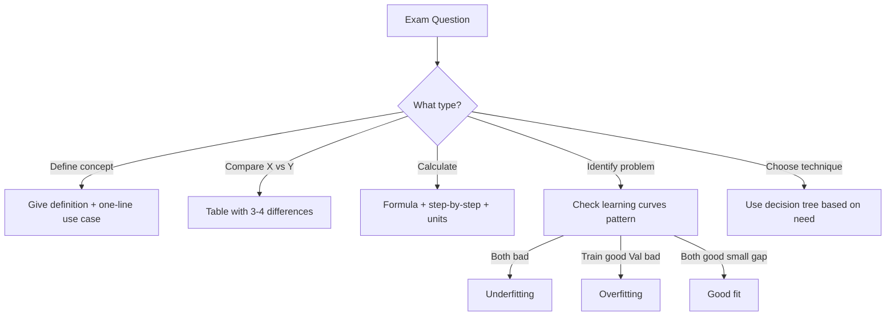

# AS40: Regularization and Generalization - Exam Preparation

> 📚 **Complete Exam Prep** for: Generalization, Underfitting, Overfitting, L1/L2 Regularization, Dropout, Learning Curves, Early Stopping

---

## Section A: Multiple Choice Questions (MCQ) - 15 Questions

### MCQ 1
**Question:** What is the primary goal of regularization in machine learning?

**Options:**
- A) Increase training accuracy
- B) Reduce model complexity to prevent overfitting
- C) Speed up training process
- D) Increase the number of features

**✅ Correct Answer:** B

**📖 Explanation:** Regularization deliberately adds constraints to the model to prevent it from becoming too complex and memorizing training data (overfitting). It helps the model generalize better to unseen data.

**❌ Why Others Are Wrong:**
- A) Regularization actually reduces training accuracy slightly in exchange for better validation accuracy
- C) Regularization may actually slow down training due to additional penalty calculations
- D) L1 regularization actually reduces features, not increases them

---

### MCQ 2
**Question:** In the context of learning curves, overfitting is indicated when:

**Options:**
- A) Both training and validation loss are high and flat
- B) Training loss decreases while validation loss starts increasing
- C) Both training and validation loss decrease together
- D) Validation loss is lower than training loss

**✅ Correct Answer:** B

**📖 Explanation:** The classic overfitting pattern shows training loss continually decreasing (model memorizing) while validation loss initially decreases then starts increasing (model failing on new data).

**❌ Why Others Are Wrong:**
- A) This indicates underfitting (model not learning)
- C) This indicates a healthy training process (good fit)
- D) This is unusual and might indicate data leakage or very different data distributions

---

### MCQ 3
**Question:** L1 regularization (Lasso) is preferred over L2 (Ridge) when:

**Options:**
- A) The model needs stability with correlated features
- B) Feature selection is desired and only important features should survive
- C) All features are equally important
- D) The model is already too sparse

**✅ Correct Answer:** B

**📖 Explanation:** L1 regularization pushes many weights to exactly zero, effectively selecting only the most important features. This makes it ideal when feature selection is needed.

**❌ Why Others Are Wrong:**
- A) L2 handles correlated features better; L1 picks one randomly
- C) If all features important, L2 is better as it keeps all with small weights
- D) If already sparse, L1 would make it even more sparse which is not desired

---

### MCQ 4
**Question:** What happens when the regularization parameter λ (lambda) is set too high?

**Options:**
- A) Severe overfitting occurs
- B) Model weights become very large
- C) Model underfits due to over-constrained weights
- D) Training becomes faster

**✅ Correct Answer:** C

**📖 Explanation:** λ too high means very strong penalty on weights. Weights cannot grow enough to learn patterns, resulting in a model that is too simple → underfitting.

**❌ Why Others Are Wrong:**
- A) High λ reduces overfitting, but can cause underfitting if too extreme
- B) High λ shrinks weights, not enlarges them
- D) Training speed is generally not affected by λ value

---

### MCQ 5
**Question:** Dropout regularization prevents which phenomenon in neural networks?

**Options:**
- A) Vanishing gradients
- B) Co-adaptation of neurons
- C) Weight explosion
- D) Data leakage

**✅ Correct Answer:** B

**📖 Explanation:** Dropout randomly disables neurons during training, preventing them from becoming overly dependent on each other (co-adaptation). Each neuron learns to work independently.

**❌ Why Others Are Wrong:**
- A) Vanishing gradients is addressed by techniques like ReLU, residual connections
- C) Weight explosion is handled by gradient clipping or weight constraints
- D) Data leakage is a data handling problem, not solved by dropout

---

### MCQ 6
**Question:** In L2 regularization, what term is added to the gradient during weight update?

**Options:**
- A) λ × sign(w)
- B) 2λw
- C) λ/w
- D) λw²

**✅ Correct Answer:** B

**📖 Explanation:** L2 penalty is λΣw². Taking derivative: ∂(λw²)/∂w = 2λw. This term is added to the gradient, always pulling weights towards zero.

**❌ Why Others Are Wrong:**
- A) λ × sign(w) is from L1 regularization
- C) There's no division in the gradient
- D) λw² is the penalty term, not its derivative

---

### MCQ 7
**Question:** What is the "generalization gap" in machine learning?

**Options:**
- A) Difference between training loss and test loss
- B) Difference between L1 and L2 regularization
- C) Gap between different epochs
- D) Difference between model prediction and actual value

**✅ Correct Answer:** A

**📖 Explanation:** Generalization gap measures how much worse the model performs on unseen data compared to training data. It's typically measured as (Validation/Test Loss) - (Training Loss).

**❌ Why Others Are Wrong:**
- B) L1 and L2 are regularization techniques, not related to gap
- C) Epoch gap is not a standard term
- D) That's the residual or error, not generalization gap

---

### MCQ 8
**Question:** Early stopping is triggered when:

**Options:**
- A) Training loss reaches zero
- B) Validation performance stops improving for 'patience' epochs
- C) All epochs are completed
- D) Training accuracy reaches 100%

**✅ Correct Answer:** B

**📖 Explanation:** Early stopping monitors validation metric and stops training when it doesn't improve for a specified number of epochs (patience). This prevents overtraining/overfitting.

**❌ Why Others Are Wrong:**
- A) Training loss reaching zero indicates overfitting, not stopping criterion
- C) Early stopping by definition stops BEFORE all epochs
- D) 100% training accuracy is a sign of overfitting

---

### MCQ 9
**Question:** Which regularization technique results in sparse models?

**Options:**
- A) L2 (Ridge)
- B) L1 (Lasso)
- C) Dropout
- D) All of the above

**✅ Correct Answer:** B

**📖 Explanation:** L1 regularization pushes small weights to exactly zero, creating sparse models where many weights are zero. L2 shrinks but doesn't zero weights; dropout affects activations, not weight sparsity.

**❌ Why Others Are Wrong:**
- A) L2 shrinks all weights but keeps them non-zero (dense)
- C) Dropout affects activations during training, not final weight sparsity
- D) Only L1 creates truly sparse models

---

### MCQ 10
**Question:** What is the typical range for dropout rate (p) in hidden layers?

**Options:**
- A) 0.8 - 0.95
- B) 0.01 - 0.05
- C) 0.2 - 0.5
- D) 1.0

**✅ Correct Answer:** C

**📖 Explanation:** Dropout rate of 0.2-0.5 is most common. p=0.5 means 50% neurons dropped. Higher (0.8+) causes underfitting; lower has minimal effect.

**❌ Why Others Are Wrong:**
- A) Too high - would cause severe underfitting
- B) Too low - minimal regularization effect
- D) p=1.0 means all neurons dropped - no learning possible!

---

### MCQ 11
**Question:** Inverted dropout is used to:

**Options:**
- A) Invert the weight matrices
- B) Scale activations during training so no scaling needed at inference
- C) Reverse the order of layers
- D) Invert the loss function

**✅ Correct Answer:** B

**📖 Explanation:** Inverted dropout scales surviving neurons by 1/(1-p) during training. This maintains expected activation magnitude, so at inference (when all neurons active) no adjustment needed.

**❌ Why Others Are Wrong:**
- A) Weight matrix inversion is a completely different concept
- C) Layer order is architectural, not related to dropout
- D) Loss function inversion doesn't make sense

---

### MCQ 12
**Question:** High bias in a model typically indicates:

**Options:**
- A) Overfitting
- B) Underfitting
- C) Perfect generalization
- D) Data imbalance

**✅ Correct Answer:** B

**📖 Explanation:** High bias means the model makes strong (incorrect) assumptions about the data. This leads to underfitting - model too simple to capture true patterns.

**❌ Why Others Are Wrong:**
- A) Overfitting is high variance, not high bias
- C) Perfect generalization has low bias AND low variance
- D) Data imbalance is a data issue, not bias-variance

---

### MCQ 13
**Question:** In Elastic Net regularization, what is controlled by the l1_ratio parameter?

**Options:**
- A) Learning rate
- B) Balance between L1 and L2 penalties
- C) Number of layers
- D) Dropout probability

**✅ Correct Answer:** B

**📖 Explanation:** l1_ratio (also called α) controls the mix: l1_ratio=0 is pure L2, l1_ratio=1 is pure L1, l1_ratio=0.5 is equal mix.

**❌ Why Others Are Wrong:**
- A) Learning rate is a separate optimizer parameter
- C) Number of layers is architecture, not regularization
- D) Dropout probability is independent of Elastic Net

---

### MCQ 14
**Question:** What does the term "kernel_regularizer" in Keras refer to?

**Options:**
- A) Regularization applied to activation functions
- B) Regularization applied to weight matrices
- C) Regularization applied to input data
- D) Regularization applied to output predictions

**✅ Correct Answer:** B

**📖 Explanation:** In Keras, "kernel" refers to the weight matrix of a layer. kernel_regularizer applies L1/L2/Elastic Net penalty to these weights.

**❌ Why Others Are Wrong:**
- A) Activation regularization is "activity_regularizer"
- C) Input regularization would be preprocessing, not in model
- D) Output regularization would be "bias_regularizer" for biases

---

### MCQ 15
**Question:** When learning curves show both training and validation loss decreasing but with a large stable gap:

**Options:**
- A) Model is underfitting
- B) Model is overfitting
- C) Training data may be unrepresentative
- D) Model is well-trained

**✅ Correct Answer:** C

**📖 Explanation:** Both improving but large gap suggests training data might be harder/different than validation data. This could indicate sampling bias or data quality issues in training set.

**❌ Why Others Are Wrong:**
- A) Underfitting would show both curves high, not improving well
- B) Overfitting would show validation going up while train goes down
- D) Well-trained model has small gap

---

## Section B: Multiple Select Questions (MSQ) - 12 Questions

### MSQ 1
**Question:** Which of the following are valid remedies for overfitting? (Select ALL that apply)

**Options:**
- A) Add L2 regularization
- B) Increase model complexity
- C) Use dropout
- D) Collect more training data
- E) Increase learning rate

**✅ Correct Answers:** A, C, D

**📖 Explanation:** 
- A) L2 regularization constrains weights, reducing overfitting
- C) Dropout prevents co-adaptation, improves generalization
- D) More data makes memorization harder, improves generalization

**❌ Why Others Are Wrong:**
- B) Increasing complexity usually worsens overfitting
- E) Learning rate doesn't directly address overfitting (though schedule can help)

---

### MSQ 2
**Question:** Which statements about L1 regularization are TRUE? (Select ALL that apply)

**Options:**
- A) Uses absolute value of weights in penalty
- B) Can make weights exactly zero
- C) Produces dense solutions
- D) Acts as feature selector
- E) Gradient has sign function component

**✅ Correct Answers:** A, B, D, E

**📖 Explanation:**
- A) L1 penalty is λΣ|w| - absolute values
- B) Constant push towards zero regardless of weight size can zero weights
- D) Zero weights = removed features = automatic feature selection
- E) ∂|w|/∂w = sign(w), giving the sign component

**❌ Why Others Are Wrong:**
- C) L1 produces SPARSE solutions (many zeros), not dense

---

### MSQ 3
**Question:** Which are signs of underfitting? (Select ALL that apply)

**Options:**
- A) Training accuracy is very high
- B) Validation accuracy is low
- C) Both training and validation accuracy are low
- D) Learning curves are flat and high
- E) Small gap between training and validation

**✅ Correct Answers:** C, D, E

**📖 Explanation:**
- C) Both poor = model not learning = underfitting
- D) Flat high curves = no learning happening
- E) Small gap when both are bad = equal but poor performance

**❌ Why Others Are Wrong:**
- A) Very high training accuracy suggests overfitting, not underfitting
- B) Low validation alone (with high training) is overfitting

---

### MSQ 4
**Question:** Dropout regularization: (Select ALL that apply)

**Options:**
- A) Is only applied during training, not inference
- B) Randomly sets some activations to zero
- C) Requires scaling neurons during or after training
- D) Reduces co-adaptation of neurons
- E) Increases training time per epoch

**✅ Correct Answers:** A, B, C, D, E

**📖 Explanation:**
- A) Dropout OFF during inference/testing
- B) Core mechanism: random activations to zero
- C) Inverted dropout scales during training; standard scales at inference
- D) Primary purpose: prevent neuron dependencies
- E) Extra computations (masking, scaling) add overhead

---

### MSQ 5
**Question:** When should you use Early Stopping? (Select ALL that apply)

**Options:**
- A) When validation loss starts increasing
- B) When training loss is still decreasing
- C) When you want to prevent overfitting
- D) When computation resources are limited
- E) When you want the best validation performance

**✅ Correct Answers:** A, B, C, D, E

**📖 Explanation:**
- A) Classic trigger: validation getting worse
- B) Train might still improve but we stop to prevent overfit
- C) Primary purpose of early stopping
- D) Saves time by stopping unnecessary epochs
- E) restore_best_weights gives best validation model

---

### MSQ 6
**Question:** Which are hyperparameters in regularization? (Select ALL that apply)

**Options:**
- A) Lambda (λ) in L1/L2
- B) Dropout rate (p)
- C) Number of weights
- D) Patience in early stopping
- E) Weight values

**✅ Correct Answers:** A, B, D

**📖 Explanation:**
- A) λ is manually set, controls regularization strength
- B) p is manually set, controls dropout fraction
- D) Patience is manually set, controls early stopping sensitivity

**❌ Why Others Are Wrong:**
- C) Number of weights determined by architecture, not tuned as hyperparameter
- E) Weight values are learned during training, not hyperparameters

---

### MSQ 7
**Question:** What does λ (lambda) control in regularization? (Select ALL that apply)

**Options:**
- A) Strength of the penalty on weights
- B) Trade-off between fitting data and keeping weights small
- C) Learning rate
- D) How much weights are shrunk
- E) Number of epochs

**✅ Correct Answers:** A, B, D

**📖 Explanation:**
- A) λ multiplies the penalty term
- B) Higher λ = more emphasis on small weights vs fitting data
- D) Larger λ = stronger shrinkage

**❌ Why Others Are Wrong:**
- C) Learning rate (η) is separate hyperparameter
- E) Number of epochs is unrelated to λ

---

### MSQ 8
**Question:** Which factors can cause overfitting? (Select ALL that apply)

**Options:**
- A) Model is too complex for the data
- B) Training data is too small
- C) Regularization strength is too high
- D) Training for too many epochs
- E) No regularization applied

**✅ Correct Answers:** A, B, D, E

**📖 Explanation:**
- A) Complex model + limited data = memorization
- B) Small data easy to memorize
- D) More epochs = more chance to memorize
- E) No constraints on weights = can overfit

**❌ Why Others Are Wrong:**
- C) High regularization causes UNDERfitting, not overfitting

---

### MSQ 9
**Question:** L2 regularization (Ridge): (Select ALL that apply)

**Options:**
- A) Uses sum of squared weights
- B) Produces sparse solutions
- C) Adds 2λw to gradient
- D) Shrinks all weights towards zero
- E) Is same as weight decay in deep learning

**✅ Correct Answers:** A, C, D, E

**📖 Explanation:**
- A) L2 penalty is λΣw²
- C) Derivative of λw² is 2λw
- D) All weights shrink, but rarely to exactly zero
- E) Weight decay is essentially L2 in most implementations

**❌ Why Others Are Wrong:**
- B) L2 produces dense solutions; L1 produces sparse

---

### MSQ 10
**Question:** When reading learning curves, a healthy training process shows: (Select ALL that apply)

**Options:**
- A) Both losses decreasing
- B) Small gap between training and validation
- C) Validation loss eventually plateauing
- D) Training loss reaching zero
- E) Curves converging to low values

**✅ Correct Answers:** A, B, C, E

**📖 Explanation:**
- A) Both should decrease (model learning, generalizing)
- B) Small gap = good generalization
- C) Plateau indicates convergence
- E) Low values = good fit

**❌ Why Others Are Wrong:**
- D) Training loss = 0 often indicates overfitting (perfect fit to training data)

---

### MSQ 11
**Question:** Elastic Net is preferred when: (Select ALL that apply)

**Options:**
- A) Features are highly correlated
- B) Both sparsity and stability are needed
- C) Pure L1 is too unstable
- D) All features are equally important
- E) Some feature selection is desired with robustness

**✅ Correct Answers:** A, B, C, E

**📖 Explanation:**
- A) L2 component handles correlated features better than pure L1
- B) Gets sparsity from L1 + stability from L2
- C) L2 component stabilizes the unstable L1
- E) Controlled sparsity with robustness

**❌ Why Others Are Wrong:**
- D) If all features equally important, pure L2 might suffice

---

### MSQ 12
**Question:** Where is dropout commonly applied in neural networks? (Select ALL that apply)

**Options:**
- A) Fully connected (Dense) layers
- B) Convolutional feature extraction layers
- C) Classifier head of CNNs
- D) Before the output layer
- E) Recurrent layers (with special handling)

**✅ Correct Answers:** A, C, E

**📖 Explanation:**
- A) Most common use case for dropout
- C) Classifier head is usually FC layers where dropout helps
- E) Recurrent dropout exists for RNNs with special implementation

**❌ Why Others Are Wrong:**
- B) Conv layers typically use BatchNorm instead of dropout
- D) Dropout right before output is uncommon; usually a layer or two before

---

## Section C: Numerical/Calculation Questions - 6 Questions

### Numerical 1
**Question:** A model has the following loss function with L2 regularization:
Loss = MSE + λ × Σ(w²)

Given:
- MSE (data loss) = 0.5
- Weights: w₁ = 2, w₂ = -1, w₃ = 3
- λ = 0.01

Calculate the total loss.

**Given:**
- MSE = 0.5
- Weights = [2, -1, 3]
- λ = 0.01

**Solution Steps:**
1. Calculate sum of squared weights:
   Σ(w²) = 2² + (-1)² + 3² = 4 + 1 + 9 = 14

2. Calculate regularization penalty:
   λ × Σ(w²) = 0.01 × 14 = 0.14

3. Calculate total loss:
   Total = MSE + Penalty = 0.5 + 0.14 = 0.64

**✅ Final Answer:** 0.64

---

### Numerical 2
**Question:** Calculate the L2 gradient component for weight w = 5 with λ = 0.02.

**Given:**
- w = 5
- λ = 0.02

**Solution Steps:**
1. L2 gradient component formula: 2λw
2. Calculate: 2 × 0.02 × 5 = 0.2

**✅ Final Answer:** 0.2

---

### Numerical 3
**Question:** A layer has 100 neurons. With dropout rate p = 0.3, how many neurons are expected to be active (on average) during each training iteration?

**Given:**
- Total neurons = 100
- Dropout rate p = 0.3

**Solution Steps:**
1. Probability of keeping each neuron = 1 - p = 1 - 0.3 = 0.7
2. Expected active neurons = 100 × 0.7 = 70

**✅ Final Answer:** 70 neurons

---

### Numerical 4
**Question:** With inverted dropout, if activation value is 0.8 and dropout rate is p = 0.5, what is the scaled activation value (assuming the neuron survives)?

**Given:**
- Activation = 0.8
- p = 0.5
- Neuron survives (not dropped)

**Solution Steps:**
1. Inverted dropout scaling factor = 1/(1-p) = 1/(1-0.5) = 1/0.5 = 2
2. Scaled activation = 0.8 × 2 = 1.6

**✅ Final Answer:** 1.6

---

### Numerical 5
**Question:** Calculate the L1 regularization term for the following weights with λ = 0.1:
Weights: w₁ = 0.5, w₂ = -0.3, w₃ = 0.8, w₄ = -0.2

**Given:**
- Weights = [0.5, -0.3, 0.8, -0.2]
- λ = 0.1

**Solution Steps:**
1. Calculate sum of absolute values:
   Σ|w| = |0.5| + |-0.3| + |0.8| + |-0.2|
        = 0.5 + 0.3 + 0.8 + 0.2 = 1.8

2. Calculate L1 penalty:
   λ × Σ|w| = 0.1 × 1.8 = 0.18

**✅ Final Answer:** 0.18

---

### Numerical 6
**Question:** Training accuracy is 95% and validation accuracy is 78%. Calculate the generalization gap (in percentage points). Is this overfitting?

**Given:**
- Training accuracy = 95%
- Validation accuracy = 78%

**Solution Steps:**
1. Generalization gap = Training accuracy - Validation accuracy
2. Gap = 95% - 78% = 17 percentage points

3. Analysis: A gap of 17 percentage points is large (>5% is concerning)
4. This indicates **overfitting** - model memorizing training data

**✅ Final Answer:** 17 percentage points; Yes, this is overfitting

---

## Section D: Fill in the Blanks - 8 Questions

### Fill 1
**Question:** L1 regularization is also called _______ regularization.

**Answer:** Lasso

**Explanation:** Lasso stands for "Least Absolute Shrinkage and Selection Operator"

---

### Fill 2
**Question:** L2 regularization is also called _______ regularization.

**Answer:** Ridge

**Explanation:** Ridge regularization refers to the ridge penalty on the weight space

---

### Fill 3
**Question:** The phenomenon where neurons become overly dependent on each other is called _______.

**Answer:** Co-adaptation

**Explanation:** Co-adaptation means neurons learn together and rely on each other, reducing robustness

---

### Fill 4
**Question:** In the bias-variance tradeoff, underfitting corresponds to high _______.

**Answer:** Bias

**Explanation:** High bias means model makes strong wrong assumptions, leading to underfitting

---

### Fill 5
**Question:** The parameter that controls regularization strength in L1/L2 is called _______.

**Answer:** Lambda (λ)

**Explanation:** Lambda multiplies the penalty term, controlling how strongly weights are penalized

---

### Fill 6
**Question:** _______ stopping is a technique that halts training when validation performance stops improving.

**Answer:** Early

**Explanation:** Early stopping prevents overfitting by stopping before model memorizes training data

---

### Fill 7
**Question:** The difference between training loss and validation loss is called the _______ gap.

**Answer:** Generalization

**Explanation:** Generalization gap measures how well the model generalizes to unseen data

---

### Fill 8
**Question:** In inverted dropout with rate p=0.4, activations are scaled by _______.

**Answer:** 1/(1-0.4) = 1/0.6 ≈ 1.67 (or simply 1/(1-p))

**Explanation:** Inverted dropout scales by 1/(1-p) to maintain expected activation magnitude

---

## 📚 Quick Revision Points

### Key Formulas

| Concept | Formula |
|---------|---------|
| L2 Loss | L_data + λ × Σ(w²) |
| L1 Loss | L_data + λ × Σ\|w\| |
| L2 Gradient | ∂L/∂w + 2λw |
| L1 Gradient | ∂L/∂w + λ×sign(w) |
| Generalization Gap | Train Performance - Val Performance |
| Dropout Survival | Probability = 1 - p |
| Inverted Dropout Scale | 1/(1-p) |
| Elastic Net | λ₁×Σ\|w\| + λ₂×Σ(w²) |

### Key Concepts Summary

| Concept | One-Line Definition | When to Use |
|---------|---------------------|-------------|
| L2 (Ridge) | Penalizes squared weights | General regularization, stability |
| L1 (Lasso) | Penalizes absolute weights | Feature selection, sparsity |
| Elastic Net | L1 + L2 combined | Correlated features, balanced |
| Dropout | Random neuron disabling | Deep neural networks |
| Early Stopping | Stop when val plateaus | Prevent overtraining |
| Generalization | Performance on unseen data | Ultimate goal of ML |

### Common Exam Traps

| Trap | Correct Understanding |
|------|----------------------|
| "L2 makes weights zero" | L2 shrinks but rarely zeros; L1 zeros |
| "High lambda = better" | Too high λ causes underfitting |
| "Dropout rate 0.8 is good" | Too high; 0.2-0.5 is typical |
| "Low training loss = good model" | Must check validation too! |
| "Regularization speeds training" | Can slow it; used for generalization |

---

## 🚀 Section E: Shortcuts & Cheat Codes for Exam

### ⚡ One-Liner Shortcuts

| Concept | Shortcut/Cheat Code | When to Use |
|---------|---------------------|-------------|
| L1 vs L2 | "L1 = Zeros weights, L2 = Shrinks weights" | Comparison questions |
| Overfitting detection | "Train ↓ good, Val ↑ bad = Overfit" | Learning curve analysis |
| Underfitting detection | "Both high, both flat = Underfit" | Learning curve analysis |
| Lambda effect | "λ high = Underfit, λ low = Overfit" | Hyperparameter questions |
| Dropout effect | "p high = Underfit (too many neurons off)" | Dropout tuning |
| Generalization goal | "Small gap + low losses = Good" | Evaluation questions |

### 🎯 Memory Tricks (Mnemonics)

1. **L1 = Lean**: L1 makes model LEAN (sparse, fewer features)
2. **L2 = Lots (but small)**: L2 keeps LOTS of features but makes them small
3. **BIAS = Bad Simplification**: High bias = oversimplified model
4. **VARIANCE = Very Sensitive**: High variance = too sensitive to training data
5. **DROP = Don't Rely On Partners**: Dropout prevents neuron dependency
6. **λ (Lambda) = Limiter**: Lambda limits how big weights can grow

### 🔢 Quick Calculation Hacks

| Scenario | Hack/Shortcut | Example |
|----------|---------------|---------|
| L2 gradient | Just 2λw | λ=0.1, w=3 → 2×0.1×3 = 0.6 |
| Dropout survival | (1-p) × total neurons | p=0.3, 100 neurons → 70 |
| Inverted scale | Divide by (1-p) | p=0.5 → divide by 0.5 = multiply by 2 |
| Gen gap | Train - Val (for accuracy) | 95% - 80% = 15% gap |

### 📝 Last-Minute Formula Sheet
```
📌 L2 Penalty: λ × Σ(w²) → Use for smooth shrinkage
📌 L1 Penalty: λ × Σ|w| → Use for feature selection
📌 L2 Gradient: 2λw → Pull proportional to weight
📌 L1 Gradient: λ×sign(w) → Constant pull (±λ)
📌 Dropout Scale: 1/(1-p) → Compensate for dropped neurons
📌 Elastic Net: λ₁×|w| + λ₂×w² → Best of both
```

### 🎓 Interview One-Liners

| Question Pattern | Safe Answer Template |
|------------------|---------------------|
| "What is overfitting?" | "Overfitting is when model memorizes training data instead of learning general patterns, resulting in high training accuracy but poor validation accuracy." |
| "L1 vs L2?" | "L1 (Lasso) uses absolute values and creates sparse models by zeroing weights. L2 (Ridge) uses squared values and shrinks weights without zeroing. Choose L1 for feature selection, L2 for stability." |
| "What is dropout?" | "Dropout randomly disables neurons during training to prevent co-adaptation, forcing each neuron to learn independently. It's OFF during inference." |
| "How to prevent overfitting?" | "Use regularization (L1/L2), dropout, early stopping, more training data, data augmentation, or reduce model complexity." |

### ⚠️ "If You Forget Everything, Remember This"

1. **Golden Rule 1**: Regularization trades training accuracy for better generalization
2. **Golden Rule 2**: L1 = sparse (feature selection), L2 = dense (shrinkage)
3. **Golden Rule 3**: Overfitting = train good + val bad; Underfitting = both bad
4. **Golden Rule 4**: Always monitor BOTH training AND validation metrics
5. **Golden Rule 5**: Lambda too high → underfit; Lambda too low → overfit

### 🔄 Quick Decision Flowchart



### 🎯 Safe Answer Patterns

- **For "What is X?"** → Definition + one-line use case + example
- **For "Explain X"** → Intuition → Math → Code block → When to use
- **For "Compare X vs Y"** → Table format with key differences
- **For "Calculate"** → Formula + Substitution + Step-by-step + Final answer with units
- **For "When to use X?"** → Scenario + Check conditions + Alternatives
- **For "Identify problem"** → Look at train-val gap → Name the issue → Suggest fix
