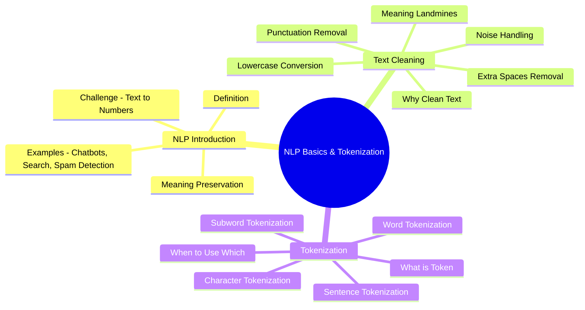
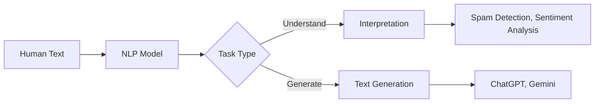
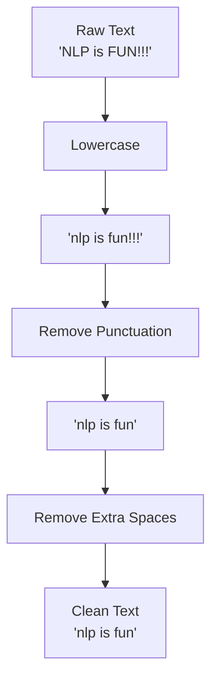
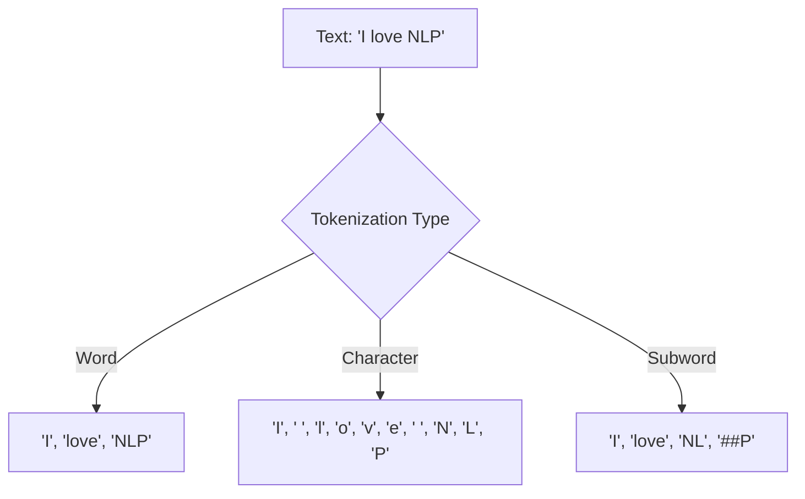

# AS41: NLP Basics & Tokenization - Classroom Session (Part 1)

> 📚 **This is Part 1** covering: Natural Language Processing Introduction, Text Cleaning, Tokenization Types
> 📘 **See also:** [Part 2 - Vocabulary & Embeddings](./AS41_NLP_BasicsTokenization2.md), [Part 3 - Word2Vec & Similarity](./AS41_NLP_BasicsTokenization3.md)

---

## 🗺️ Mind Map - Topics Covered in Part 1



---

## 🎓 Classroom Conversation

### Topic 1: Introduction to Natural Language Processing (NLP)

**Teacher:** Okay students, aaj mana class chala important topic start chestunnam - Natural Language Processing, short lo NLP. Mee andhariki oka question - meeru daily ChatGPT, Google Search, ya Alexa use chestunnaru kada? Ivi anni NLP examples!

**Beginner Student:** Sir, NLP ante exactly enti? Maku simple ga explain cheyandi please.

**Teacher:** Excellent question! Simple ga cheppalante - NLP is a field of AI that helps computers understand, interpret, and generate human language. 

Oka analogy cheptha - meeru oka foreign country ki vellaru, akkada language teliyadu. Meeku translator kavali, right? NLP is like that translator between humans and computers!

> 💡 **Jargon Alert - NLP (Natural Language Processing)**
> Simple Explanation: Computer ki human language artham cheyinche technology. Mana Telugu, English anni computers ki artham cheyinche magic!
> Example: Google lo search chesthe results vasthay - adhi NLP!

**Clever Student:** Sir, so ChatGPT kuda NLP use chesthundi ante, adi text generate chesthe adhi NLP advanced version aa?

**Teacher:** Perfect understanding! ChatGPT definition satisfy chesthundi - it understands your language, interprets what you're saying, and then generates response in human language. Generation is advanced NLP, interpretation is basic NLP.



**Practical Student:** Sir, interview lo NLP examples adugutharu, anni examples cheppandi please.

**Teacher:** Interview lo ye examples cheppali ante:
1. **Chatbots** - Customer support bots
2. **Google Search** - Query understanding
3. **Spam Detection** - Email filtering
4. **Sentiment Analysis** - Twitter/X analysis
5. **Language Translation** - German to Hindi
6. **Voice Assistants** - Alexa, Siri
7. **Text Summarization** - Long documents short cheyyadam

**Critique Student:** Sir, but computers only numbers understand chesthay, text directly process cheyaleru kada? How does NLP work then?

**Teacher:** Adi THE BIGGEST CHALLENGE of NLP! Humans understand text naturally, but computers only understand numbers!

```
Human Text → ??? → Numbers → Model → Output
```

Challenge enti ante - text ni numbers ga convert chesthe, meaning preserve avvali! Random numbers pettina model artham chesukoadu.

**Curious Student:** Sir, meaning preserve cheyyadam ante exactly enti? Oka example tho explain cheyandi.

**Teacher:** Excellent! Oka example - "Movie is good" and "Film is excellent" - rendu same meaning convey chesthunnai. If we convert them to numbers, similar sentences ki similar numbers ravali. Adhe meaning preservation!

If "Movie" = 5 and "Film" = 100, that doesn't help. But if "Movie" ≈ "Film" in number representation, model understands they are related!

---

### Topic 2: Text Cleaning - The First Step

**Teacher:** Ippudu mana first step - Text Cleaning. Think of it like this - exam paper ki answer raasthe, handwriting clean ga undali teacher ki artham avvadaniki. Same way, text clean ga undali machine ki artham avvadaniki!

**Beginner Student:** Sir, text lo dirty enti? Memu normal ga text rasthunnam kada?

**Teacher:** Great question! "Dirty" text examples:
- **UPPERCASE and lowercase mixing**: "NLP" vs "nlp" vs "Nlp"
- **Punctuation marks**: "Hello!!!" vs "Hello"
- **Extra spaces**: "NLP   is   fun" vs "NLP is fun"
- **Special symbols**: "@#$%"
- **HTML tags**: `<br>`, `<div>`

Model ki "NLP" and "nlp" different words la kanipinchuthai if we don't clean!



**Clever Student:** Sir, code lo ela chesthamu text cleaning?

**Teacher:** Python lo simple ga cheyochu:

```python
import re

def clean_text(text):
    # Step 1: Convert to lowercase
    text = text.lower()
    
    # Step 2: Remove punctuation (keep only a-z and spaces)
    text = re.sub(r'[^a-z\s]', '', text)
    
    # Step 3: Remove extra spaces
    text = ' '.join(text.split())
    
    # Step 4: Strip leading/trailing spaces
    text = text.strip()
    
    return text

# Example
raw_text = "NLP is FUN!!!  It's AMAZING..."
clean = clean_text(raw_text)
print(clean)  # Output: "nlp is fun its amazing"
```

**Debate Student:** Sir, but exclamation marks sentiment indicate chesthay kada? "Good" vs "Good!!!" lo difference undi. Remove chesthe meaning pothadi kada?

**Teacher:** Excellent observation! Adhe "cleaning decisions" ante. It DEPENDS on your task:

| Task | Exclamation Mark |
|------|------------------|
| Sentiment Analysis | **KEEP** - intensity indicates! |
| Topic Classification | Remove - not needed |
| Spam Detection | May keep - spam has many !!! |
| Summarization | Remove - meaning same |

> 💡 **Jargon Alert - Noise in NLP**
> Simple Explanation: Text lo meaning contribute cheyani characters anni noise antaru. Like TV lo static noise - distraction without meaning.
> Example: "Hello###World!!!" lo ### is noise.

**Critique Student:** Sir, what if we over-clean? Meaning destroy avvadhu kadaa?

**Teacher:** Very important point! These are "Meaning Landmines" - dangerous cleaning mistakes:

1. **Removing Negation**: "not good" → "good" (MEANING FLIPS!)
2. **Over-removing punctuation**: "Dr." → "Dr" (abbreviation broken)
3. **Removing domain tokens**: Medical text lo "BP", "mg/dL" remove cheyakudadu
4. **Aggressive stopword removal**: "no", "not", "without" are NOT noise!

```python
# WRONG: Removing 'not'
bad_clean = "I do not like this".replace("not", "")
# Result: "I do like this" - OPPOSITE MEANING!

# CORRECT: Keep negation
good_clean = "I do not like this".lower()
# Result: "i do not like this" - meaning preserved
```

**Practical Student:** Sir, real projects lo text cleaning ki best practices enti?

**Teacher:** Interview lo safe answer:

| Level | Action | When Safe |
|-------|--------|-----------|
| Level A | Whitespace normalization, Unicode normalization | Always safe |
| Level B | URLs, numbers handling | Task dependent |
| Level C | Stemming, Lemmatization | Be careful, modern models skip this |

---

### Topic 3: Tokenization - Breaking Text into Units

**Teacher:** Text clean chesam, ippudu next step - Tokenization. Idi chala important concept!

**Beginner Student:** Sir, tokenization ante enti? Token ante what?

**Teacher:** Simple analogy - meeru oka sentence rasaru: "I love NLP"

Idhi model ki directly artham kaadu. We break it into pieces called TOKENS:
- "I" - Token 1
- "love" - Token 2  
- "NLP" - Token 3

> 💡 **Jargon Alert - Token**
> Simple Explanation: Text lo smallest unit that model processes. Words, characters, or pieces of words.
> Example: "Hello World" → ["Hello", "World"] = 2 tokens

**Clever Student:** Sir, tokens and words same aa?

**Teacher:** Not always! Tokens can be:
1. **Words** - ["I", "love", "NLP"]
2. **Sentences** - ["I love NLP.", "It is fun."]
3. **Subwords** - ["un", "happi", "ness"]
4. **Characters** - ["I", " ", "l", "o", "v", "e"]



**Debate Student:** Sir, meku chala types unnai ante, which one is best? Why not use only one?

**Teacher:** Each type has advantages and disadvantages. Let me explain:

#### 3.1 Word Tokenization

```python
text = "I love NLP"
tokens = text.split()
print(tokens)  # ['I', 'love', 'NLP']
```

| Aspect | Details |
|--------|---------|
| **How it works** | Split by whitespace/punctuation |
| **Pros** | Simple, intuitive, easy to implement |
| **Cons** | Every typo/new word becomes OOV (Out of Vocabulary) |
| **Best for** | Simple text with known vocabulary |

**Practical Student:** Sir, OOV ante enti?

**Teacher:** OOV = Out of Vocabulary. Model ki vocabulary lo leni words!

Example - Training lo "happiness" undi, but test lo "happinesss" (typo) vaste:
- Word tokenization: "happinesss" becomes [UNK] (unknown)
- Model doesn't know what to do!

#### 3.2 Character Tokenization

```python
text = "NLP"
tokens = list(text)
print(tokens)  # ['N', 'L', 'P']
```

| Aspect | Details |
|--------|---------|
| **How it works** | Each character is a token |
| **Pros** | Almost no OOV problem (only 26 letters!) |
| **Cons** | Sequences become VERY long, hard to learn word meaning |
| **Best for** | When you need to handle ALL possible text |

**Curious Student:** Sir, character tokenization lo "hello" ki 5 tokens vastay. Long documents ki chala tokens avuthayi kada?

**Teacher:** Exactly! "The quick brown fox" = 19 characters = 19 tokens (including spaces)!

Compare:
- Word tokens: 4
- Character tokens: 19

Transformers attention is O(L²) - L doubles means 4x compute! Character tokenization is expensive!

#### 3.3 Subword Tokenization (Modern Default!)

**Teacher:** Ippudu modern NLP lo most used - Subword Tokenization. BERT, GPT, all LLMs use this!

```python
# Conceptual example (real implementations differ)
"unhappiness" → ["un", "happi", "ness"]
"playing" → ["play", "##ing"]
"neuroimaging" → ["neuro", "imaging"]
```

| Aspect | Details |
|--------|---------|
| **How it works** | Frequent words stay whole, rare words split into pieces |
| **Pros** | Low OOV, manageable vocab (30k-50k), balanced sequence length |
| **Cons** | Slightly more complex implementation |
| **Best for** | Modern NLP, LLMs, production systems |

> 💡 **Jargon Alert - BPE (Byte Pair Encoding)**
> Simple Explanation: Subword tokenization algorithm. Most frequent character pairs merge into one token, repeat until vocab size reached.
> Example: "l" + "o" → "lo" → "lov" → "love"

**Critique Student:** Sir, subword tokenization eppudu bad?

**Teacher:** Subword also has issues:
- Very small vocab → sequences too long
- Very large vocab → too many parameters
- May split meaningful units weirdly

But overall, it's the **practical sweet spot**!

#### 3.4 Sentence Tokenization

**Teacher:** Sometimes we need sentence-level tokens:

```python
text = "I love NLP. It is fun!"
sentences = text.split('.')
print(sentences)  # ['I love NLP', ' It is fun!']
```

| Aspect | Details |
|--------|---------|
| **How it works** | Split by sentence boundaries (., !, ?) |
| **Best for** | Summarization, document processing, sentiment per sentence |

**Practical Student:** Sir, interview lo which tokenization use karo cheppamante?

**Teacher:** Safe answer template:

```
"For most modern NLP tasks, I would use SUBWORD tokenization 
(like BPE or WordPiece) because:
1. It handles OOV words by splitting them
2. Keeps vocabulary size manageable (30k-50k)
3. Balances sequence length and coverage
4. Used by state-of-art models like BERT, GPT"
```

---

### Topic 4: Tokenization in Python

**Teacher:** Practical implementation chuddam:

```python
# Simple Word Tokenization
text = "natural language processing enables computers to understand human language"
tokens = text.split()
print(f"Total tokens: {len(tokens)}")
print(f"Tokens: {tokens}")

# Output:
# Total tokens: 8
# Tokens: ['natural', 'language', 'processing', 'enables', 'computers', 'to', 'understand', 'human', 'language']
```

**Beginner Student:** Sir, split() function lo emi pass cheyali?

**Teacher:** By default, split() uses whitespace. But you can customize:

```python
text = "apple,banana,cherry"

# Split by comma
tokens = text.split(',')
print(tokens)  # ['apple', 'banana', 'cherry']

# Split by space (default)
text2 = "apple banana cherry"
tokens2 = text2.split()
print(tokens2)  # ['apple', 'banana', 'cherry']
```

**Clever Student:** Sir, duplicate tokens handling ela cheyali?

**Teacher:** Vocabulary building lo duplicates remove chesthamu. But first, let's see the token list:

```python
text = "NLP is fun. NLP is powerful. Language processing is part of NLP."
clean_text = text.lower().replace('.', '')
tokens = clean_text.split()

print(f"All tokens: {tokens}")
print(f"Total: {len(tokens)}")

# Output:
# All tokens: ['nlp', 'is', 'fun', 'nlp', 'is', 'powerful', 'language', 'processing', 'is', 'part', 'of', 'nlp']
# Total: 12

# Unique tokens
unique_tokens = set(tokens)
print(f"Unique: {unique_tokens}")
print(f"Unique count: {len(unique_tokens)}")

# Output:
# Unique: {'is', 'nlp', 'processing', 'of', 'fun', 'language', 'part', 'powerful'}
# Unique count: 8
```

---

## 📝 Teacher Summary - Part 1

**Teacher:** Students, let's summarize what we learned in Part 1:

### Key Takeaways

| Concept | One-Line Summary |
|---------|------------------|
| NLP | AI field helping computers understand human language |
| Text Cleaning | Making text consistent - lowercase, remove punctuation, spaces |
| Tokenization | Breaking text into smaller units called tokens |
| Word Tokens | Each word is one token |
| Character Tokens | Each character is one token |
| Subword Tokens | Frequent words whole, rare words split (Modern default!) |
| OOV | Out of Vocabulary - unknown words problem |

### Common Mistakes

1. **Removing negation words** → Meaning flips!
2. **Using word tokenization for diverse text** → OOV explosion
3. **Using character tokenization** → Very long sequences
4. **Not cleaning text before tokenization** → Inconsistent tokens

### Interview Quick Points

- NLP = Natural Language Processing
- Challenge = Converting text to numbers while preserving meaning
- Tokenization types: Word, Character, Subword, Sentence
- Modern default = Subword (BPE, WordPiece)
- BERT, GPT use subword tokenization

---

> 📘 **Continue to Part 2:** [Vocabulary Building & Word Embeddings](./AS41_NLP_BasicsTokenization2.md)
