# AS41: NLP Basics & Tokenization - Classroom Session (Part 2)

> 📚 **This is Part 2** covering: Vocabulary Building, Bag-of-Words, Special Tokens, Token-to-ID Mapping, Word Embeddings Introduction
> 📘 **Previous:** [Part 1 - NLP, Text Cleaning, Tokenization](./AS41_NLP_BasicsTokenization1.md)
> 📘 **Next:** [Part 3 - Word2Vec & Similarity](./AS41_NLP_BasicsTokenization3.md)

---

## 🗺️ Mind Map - Topics Covered in Part 2


---

## 🎓 Classroom Conversation Continued

### Topic 5: Vocabulary Building

**Teacher:** Students, tokens generate chesam. Ippudu next step - Vocabulary Building. Mee vocabulary strong ante, language lo chala words teliyali kada? Same concept here!

**Beginner Student:** Sir, vocabulary building ante enti exactly? Dictionary create chestunnam aa?

**Teacher:** Exactly! Vocabulary ante - all UNIQUE tokens ki numbers assign cheyyadam. Dictionary create chestunnam - word to number AND number to word mappings.

> 💡 **Jargon Alert - Vocabulary (Vocab)**
> Simple Explanation: All unique tokens that our NLP system knows. Like a dictionary with only known words.
> Example: Vocab = {"i": 0, "love": 1, "nlp": 2}

**Clever Student:** Sir, why do we need word to number mapping? Tokens directly use cheyachu kada?

**Teacher:** Models numbers tho work chesthay, not strings! 

```
"i love nlp" → ["i", "love", "nlp"] → [0, 1, 2]
```

Now [0, 1, 2] can go into neural network!


**Practical Student:** Sir, code lo ela implement chesthamu?

**Teacher:** Let me show step by step:

```python
# Step 1: Get all tokens
text = "natural language processing enables computers to understand human language"
text = text.lower()
tokens = text.split()
print(f"All tokens: {tokens}")
# ['natural', 'language', 'processing', 'enables', 'computers', 'to', 'understand', 'human', 'language']

# Step 2: Get unique tokens (vocabulary)
vocab = sorted(set(tokens))
print(f"Vocabulary: {vocab}")
# ['computers', 'enables', 'human', 'language', 'natural', 'processing', 'to', 'understand']

# Step 3: Create word-to-index mapping
word_to_index = {word: idx for idx, word in enumerate(vocab)}
print(f"Word to Index: {word_to_index}")
# {'computers': 0, 'enables': 1, 'human': 2, 'language': 3, 'natural': 4, 'processing': 5, 'to': 6, 'understand': 7}

# Step 4: Create index-to-word mapping (reverse)
index_to_word = {idx: word for word, idx in word_to_index.items()}
print(f"Index to Word: {index_to_word}")
# {0: 'computers', 1: 'enables', 2: 'human', 3: 'language', 4: 'natural', 5: 'processing', 6: 'to', 7: 'understand'}
```

**Debate Student:** Sir, why did we use sorted()? Alphabetical order kavali aa?

**Teacher:** Strictly needed kaadu, but helpful for:
1. **Reproducibility** - same order every time
2. **Debugging** - easy to find words
3. **Comparison** - across different runs

In production, order doesn't matter as long as mapping is consistent!

**Curious Student:** Sir, "language" text lo 2 times undi, but vocabulary lo once undi. Frequency track cheyamu aa?

**Teacher:** Great observation! Frequency separately track cheyochu:

```python
from collections import Counter

tokens = ['natural', 'language', 'processing', 'enables', 'computers', 
          'to', 'understand', 'human', 'language']

# Count frequency
freq = Counter(tokens)
print(freq)
# Counter({'language': 2, 'natural': 1, 'processing': 1, ...})

# Most common
print(freq.most_common(3))
# [('language', 2), ('natural', 1), ...]
```

Frequency useful for:
- Removing rare words (frequency < 2)
- Removing very common words (stopwords)
- Understanding text distribution

---

### Topic 6: Special Tokens - Critical for NLP!

**Teacher:** Vocabulary lo normal words kaaka, "special tokens" kuda undali. Ivi control tokens - model ki important signals isthayi!

**Beginner Student:** Sir, special tokens ante enti? Extra words aa?

**Teacher:** Yes! These are not natural language words, but CRUCIAL for modeling:

| Token | Full Name | Purpose |
|-------|-----------|---------|
| `[PAD]` | Padding | Fill shorter sequences to match length |
| `[UNK]` | Unknown | Replace words not in vocabulary |
| `[BOS]` | Begin of Sequence | Mark sentence start |
| `[EOS]` | End of Sequence | Mark sentence end |
| `[MASK]` | Mask | Hide words during training (BERT) |

> 💡 **Jargon Alert - [PAD] Token**
> Simple Explanation: When sentences have different lengths, short ones get [PAD] at end to make all same length. Like adding extra blank pages to make all notebooks same thickness!
> Example: "I love NLP" → ["I", "love", "NLP", "[PAD]", "[PAD]"]

**Clever Student:** Sir, why padding kavali? Different length sentences handle cheyachu kada?

**Teacher:** Neural networks need FIXED SIZE inputs! Like a table with fixed columns - you can't have some rows with 5 columns and some with 10.


Example:
```python
# Original sentences (different lengths)
sent1 = ["I", "love", "NLP"]           # Length 3
sent2 = ["AI", "is", "the", "future"]  # Length 4
sent3 = ["Deep", "learning"]           # Length 2

# After padding (all length 4)
sent1_padded = ["I", "love", "NLP", "[PAD]"]
sent2_padded = ["AI", "is", "the", "future"]
sent3_padded = ["Deep", "learning", "[PAD]", "[PAD]"]
```

**Critique Student:** Sir, but model [PAD] tokens ko attention desthey waste kadaa?

**Teacher:** Perfect point! That's why we use ATTENTION MASKS!

```python
# Padded sequence
tokens = ["I", "love", "NLP", "[PAD]", "[PAD]"]

# Attention mask: 1 = real, 0 = padding
mask = [1, 1, 1, 0, 0]

# Model uses mask to IGNORE padding positions!
```

> 💡 **Jargon Alert - Attention Mask**
> Simple Explanation: A 0/1 array telling model which tokens are real (1) and which are padding (0). Model ignores 0 positions.
> Example: mask = [1, 1, 1, 0, 0] means first 3 tokens real, last 2 padding

**Practical Student:** Sir, [UNK] token eppudu use avuthundi?

**Teacher:** When model sees a word NOT in vocabulary during inference:

```python
vocab = {"i": 0, "love": 1, "nlp": 2, "[UNK]": 3, "[PAD]": 4}

# Training
text1 = "i love nlp"  # All known → [0, 1, 2]

# Inference - new word!
text2 = "i love pytorch"  
# "pytorch" not in vocab → [0, 1, 3]  (3 = [UNK])
```

This is why subword tokenization reduces [UNK] - it splits unknown words into known pieces!

---

### Topic 7: Token to ID Encoding

**Teacher:** Vocabulary ready, ippudu actual encoding - tokens to IDs:

```python
def encode(tokens, word_to_index):
    """Convert tokens to IDs"""
    ids = []
    for token in tokens:
        if token in word_to_index:
            ids.append(word_to_index[token])
        else:
            ids.append(word_to_index.get("[UNK]", 0))
    return ids

def decode(ids, index_to_word):
    """Convert IDs back to tokens"""
    return [index_to_word[id] for id in ids]

# Example
vocab = {"[PAD]": 0, "[UNK]": 1, "i": 2, "love": 3, "nlp": 4}
word_to_index = vocab
index_to_word = {v: k for k, v in vocab.items()}

# Encode
tokens = ["i", "love", "nlp"]
ids = encode(tokens, word_to_index)
print(f"Encoded: {ids}")  # [2, 3, 4]

# Decode
decoded = decode(ids, index_to_word)
print(f"Decoded: {decoded}")  # ['i', 'love', 'nlp']
```

**Curious Student:** Sir, encoding tho model ki input ready aa?

**Teacher:** Almost! We also need:
1. **Padding** - fixed length
2. **Attention masks** - ignore padding
3. **Embeddings** - dense vectors (coming next!)

---

### Topic 8: Bag of Words (BoW) - Simple but Limited

**Teacher:** Before embeddings, let's see simplest numerical representation - Bag of Words!

**Beginner Student:** Sir, Bag of Words ante enti? Words bag lo vestham aa?

**Teacher:** Ha ha! Conceptually yes! We put all words in a "bag" and count them - ORDER doesn't matter!

> 💡 **Jargon Alert - Bag of Words (BoW)**
> Simple Explanation: Represent text by counting how many times each word appears. Order is ignored, only counts matter.
> Example: "I love NLP. NLP is fun." → {I: 1, love: 1, NLP: 2, is: 1, fun: 1}

```python
import numpy as np

def bag_of_words(tokens, vocab):
    """Create BoW vector for given tokens"""
    bow_vector = np.zeros(len(vocab))
    for token in tokens:
        if token in vocab:
            bow_vector[vocab[token]] += 1
    return bow_vector

# Vocabulary (word to index)
vocab = {"and": 0, "assistants": 1, "chatbots": 2, "computers": 3, 
         "enables": 4, "engines": 5, "human": 6, "in": 7, "is": 8,
         "language": 9, "nlp": 10, "processing": 11, "search": 12,
         "to": 13, "understand": 14, "used": 15, "voice": 16}

# Example text
tokens = ["nlp", "enables", "computers", "to", "understand", 
          "human", "language", "nlp", "is", "used"]

bow = bag_of_words(tokens, vocab)
print(f"BoW Vector: {bow}")
# [0. 0. 0. 1. 1. 0. 1. 0. 1. 1. 2. 0. 0. 1. 1. 1. 0.]
# Notice: nlp appears twice → value is 2
```

**Critique Student:** Sir, BoW lo major problems enti?

**Teacher:** Excellent question! BoW has SERIOUS limitations:

#### Problem 1: Order Ignored

```python
sentence1 = "NLP is fun"      # Positive
sentence2 = "fun is NLP"      # Same BoW!
sentence3 = "is fun NLP"      # Same BoW!

# All three have IDENTICAL BoW vectors!
# {NLP: 1, is: 1, fun: 1}
```

#### Problem 2: Meaning Not Captured

```python
sentence1 = "Movie is good"
sentence2 = "Film is excellent"

# These mean SAME THING, but BoW treats completely different!
# BoW1: {movie: 1, is: 1, good: 1}
# BoW2: {film: 1, is: 1, excellent: 1}
# Only "is" is common!
```

#### Problem 3: High Dimensionality

If vocabulary has 100,000 words, each BoW vector is 100,000 dimensions!

**Debate Student:** Sir, then why is BoW still taught? Anyone uses it?

**Teacher:** Good question! BoW is:
- **Good baseline** - simple to implement
- **Works for some tasks** - spam detection, document classification
- **Foundation** - understanding why embeddings are better!

| BoW Advantage | BoW Limitation |
|---------------|----------------|
| Simple implementation | Ignores word order |
| Works with any vocab size | No semantic meaning |
| Good baseline | High dimensional |

---

### Topic 9: Introduction to Word Embeddings

**Teacher:** BoW problems solve cheyyadaniki - Word Embeddings! This is THE most important concept today!

**Beginner Student:** Sir, embedding ante enti? Simple ga cheppandi.

**Teacher:** Embedding = Dense vector representation of a word that CAPTURES MEANING!

> 💡 **Jargon Alert - Word Embedding**
> Simple Explanation: Convert words into numbers (vectors) such that similar words have similar numbers. "Movie" and "Film" should have close vectors!
> Example: movie = [0.7, 0.2, 0.9], film = [0.72, 0.19, 0.88] (similar!)

**Clever Student:** Sir, BoW lo bhi vectors vaadutunnam kadaa? Embedding different ela?

**Teacher:** BIG difference! Let me compare:

| Aspect | Bag of Words | Word Embeddings |
|--------|--------------|-----------------|
| **Vector size** | Vocabulary size (huge!) | Fixed small (50-300) |
| **Sparsity** | Sparse (mostly zeros) | Dense (all values used) |
| **Similarity** | No similarity captured | Similar words = similar vectors |
| **Learning** | Count based | Learned from data |
| **Example** | [0,0,0,1,0,0,0,0] | [0.7, 0.2, -0.5, 0.9] |

```mermaid
flowchart TD
    subgraph BoW ["Bag of Words (Dim = 10000)"]
        A["movie = [0,0,0,1,0,0,...,0]"]
        B["film = [0,0,0,0,1,0,...,0]"]
        C["Cosine Similarity = 0"]
    end
    
    subgraph EMB ["Embeddings (Dim = 50)"]
        D["movie = [0.7, 0.2, 0.9, ...]"]
        E["film = [0.72, 0.19, 0.88, ...]"]
        F["Cosine Similarity ≈ 0.98"]
    end
```



**Curious Student:** Sir, embeddings ela learn avuthay? Manually assign chesthama?

**Teacher:** NO! Embeddings are LEARNED by the model - just like CNN learns filters!

Remember CNN filters?
- Initially random values
- Through backpropagation, learn to detect edges, shapes
- Weights = learned values

Same with embeddings:
- Initially random vectors
- Through training, learn semantic relationships
- Embedding values = learned weights!


**Practical Student:** Sir, embedding dimension enti chepparu 50-300? Why this range?

**Teacher:** Trade-off!

| Dimension | Pros | Cons |
|-----------|------|------|
| Low (50) | Fast, less memory | Less expressive |
| Medium (100-200) | Good balance | Standard choice |
| High (300+) | Very expressive | Slow, more memory |

Common choices:
- Word2Vec: 100-300
- GloVe: 50, 100, 200, 300
- BERT: 768
- GPT-3: 12288!

---

### Topic 10: Static vs Contextual Embeddings

**Teacher:** Embeddings lo two types - Static and Contextual. Interview favorite question!

**Beginner Student:** Sir, static and contextual difference enti?

**Teacher:** Simple example tho explain chestha:

Word "bank":
1. "I went to the **bank** to deposit money" - Financial institution
2. "I sat by the river **bank**" - River side

> **Static Embedding** (Word2Vec):
> "bank" = [0.5, 0.3, 0.8] - SAME vector in both sentences!

> **Contextual Embedding** (BERT, GPT):
> "bank" in sentence 1 = [0.9, 0.2, 0.1] (financial context)
> "bank" in sentence 2 = [0.1, 0.8, 0.7] (nature context)
> DIFFERENT vectors based on surrounding words!

```mermaid
flowchart TD
    subgraph Static ["Static (Word2Vec, GloVe)"]
        A["bank → [0.5, 0.3, 0.8]"]
        B["Always same vector"]
    end
    
    subgraph Contextual ["Contextual (BERT, GPT)"]
        C["bank (money) → [0.9, 0.2, 0.1]"]
        D["bank (river) → [0.1, 0.8, 0.7]"]
        E["Vector depends on context!"]
    end
```



**Critique Student:** Sir, then static embeddings useless aa? Everyone contextual use cheyyali aa?

**Teacher:** Not useless! Each has use cases:

| Aspect | Static | Contextual |
|--------|--------|------------|
| **Examples** | Word2Vec, GloVe, FastText | BERT, GPT, RoBERTa |
| **Speed** | Fast (lookup table) | Slow (needs computation) |
| **Memory** | Low | High |
| **Polysemy** | Cannot handle | Handles well |
| **Best for** | Simple tasks, limited resources | Complex tasks, production |

**Practical Student:** Sir, interview lo static vs contextual difference aduguthey safe answer enti?

**Teacher:** Safe answer template:

```
"Static embeddings like Word2Vec give ONE vector per word, regardless 
of context. 'bank' has same vector whether referring to money or river.

Contextual embeddings like BERT give DIFFERENT vectors based on 
surrounding words. Same 'bank' gets different representations in 
different sentences.

I would choose:
- Static: Fast prototyping, limited resources, simple tasks
- Contextual: Production systems, complex understanding needed"
```

---

## 📝 Teacher Summary - Part 2

**Teacher:** Let's summarize Part 2:

### Key Takeaways

| Concept | One-Line Summary |
|---------|------------------|
| Vocabulary | Set of all unique tokens with ID mappings |
| word_to_index | Dictionary: token → integer ID |
| index_to_word | Dictionary: integer ID → token |
| [PAD] | Padding token for fixed length |
| [UNK] | Unknown token for OOV words |
| Attention Mask | 0/1 array to ignore padding |
| Bag of Words | Count-based representation, ignores order |
| Embedding | Dense vector capturing semantic meaning |
| Static Embedding | One vector per word (Word2Vec) |
| Contextual Embedding | Context-dependent vector (BERT) |

### Common Mistakes

1. **Forgetting special tokens** → Model breaks on unknown words
2. **No attention mask** → Model learns from padding (bad!)
3. **Using BoW for semantic tasks** → Order matters!
4. **Using static for polysemy** → Same vector for different meanings

### Interview Quick Points

- Vocab size trade-off: coverage vs memory
- Special tokens: [PAD], [UNK], [BOS], [EOS], [MASK]
- BoW problem: ignores order, no meaning
- Embeddings solve BoW problems
- Static vs Contextual = Word2Vec vs BERT

---

> 📘 **Continue to Part 3:** [Word2Vec, Cosine Similarity & Practical Implementation](./AS41_NLP_BasicsTokenization3.md)
