# AS41: NLP Basics & Tokenization - Classroom Session (Part 3)

> 📚 **This is Part 3** covering: Embedding Matrices, Word2Vec, Gensim Library, Cosine Similarity, Practical Implementation
> 📘 **Previous:** [Part 1 - NLP, Text Cleaning, Tokenization](./AS41_NLP_BasicsTokenization1.md)
> 📘 **Previous:** [Part 2 - Vocabulary & Embeddings](./AS41_NLP_BasicsTokenization2.md)

---

## 🗺️ Mind Map - Topics Covered in Part 3

```mermaid
mindmap
  root((Word2Vec & Similarity))
    Embedding Matrix
      Matrix Shape V×d
      Lookup Table
      Parameter Cost
    Word2Vec
      Gensim Library
      Parameters
      Vector Size
      Window Size
      Min Count
      Epochs
    Cosine Similarity
      Formula
      Direction vs Magnitude
      When to Use
      Similarity Table
    Longest Token Size
      Padding
      Truncation
      Batch Processing
    Complete Pipeline
      Text → Tokens → IDs → Embeddings
```



---

## 🎓 Classroom Conversation Continued

### Topic 11: Embedding Matrix - The Core Structure

**Teacher:** Students, embeddings conceptually understand chesam. Ippudu technically exact structure chuddam - Embedding Matrix!

**Beginner Student:** Sir, embedding matrix ante enti? Matrix form lo embeddings undaa?

**Teacher:** Exactly! Embedding matrix is a 2D table:
- Rows = Vocabulary size (V)
- Columns = Embedding dimension (d)

```
E ∈ R^(V × d)

Where:
- V = Vocabulary size (e.g., 30,000 words)
- d = Embedding dimension (e.g., 100)
```

> 💡 **Jargon Alert - Embedding Matrix**
> Simple Explanation: A big table where each row is the vector for one word. Row 5 = embedding for word with ID 5.
> Example: If vocab = 1000 words and dim = 50, matrix is 1000×50

**Clever Student:** Sir, lookup ela work avuthundi?

**Teacher:** Simple! Token ID row number avuthundi:

```python
import numpy as np

# Create embedding matrix (usually learned, here random for demo)
V = 6  # Vocabulary size
d = 4  # Embedding dimension

E = np.random.randn(V, d)
print("Embedding Matrix:")
print(E)
# Output (example):
# [[ 0.5  -0.3   0.8   0.1]   # ID 0 → [PAD]
#  [ 0.2   0.9  -0.1   0.4]   # ID 1 → [UNK]
#  [ 0.7   0.2   0.5  -0.3]   # ID 2 → "i"
#  [-0.1   0.8   0.3   0.6]   # ID 3 → "love"
#  [ 0.4   0.1   0.9   0.2]   # ID 4 → "nlp"
#  [ 0.3   0.7  -0.2   0.5]]  # ID 5 → "language"

# Lookup embedding for token ID 4 ("nlp")
token_id = 4
embedding = E[token_id]
print(f"Embedding for 'nlp' (ID {token_id}): {embedding}")
# Output: [ 0.4  0.1  0.9  0.2]
```


**Practical Student:** Sir, embedding matrix ki total parameters enta?

**Teacher:** Simple calculation!

```
Parameters = V × d

Example:
- Vocabulary V = 30,000
- Dimension d = 300

Parameters = 30,000 × 300 = 9,000,000 = 9 Million!
```

That's why vocab size matters - larger vocab = more parameters = more memory!

| V | d | Parameters |
|---|---|------------|
| 10,000 | 100 | 1 Million |
| 30,000 | 300 | 9 Million |
| 50,000 | 768 | 38.4 Million |

**Critique Student:** Sir, embedding matrix lo [PAD] token ke bhi embedding undaa?

**Teacher:** Yes! Even [PAD] gets a row in the matrix. But:
- [PAD] embedding usually zeros or learned to be ignored
- Attention mask ensures model doesn't use it
- Important: [PAD] ID = 0 is common convention

---

### Topic 12: Sentence to Embeddings - Full Pipeline

**Teacher:** Full pipeline chuddam - sentence se embedding tensor tak:

```python
import numpy as np

# Step 1: Vocabulary
vocab = {"[PAD]": 0, "[UNK]": 1, "i": 2, "love": 3, "nlp": 4}
V = len(vocab)  # 5
d = 50  # embedding dimension

# Step 2: Embedding Matrix (pretend these are learned)
E = np.random.randn(V, d)

# Step 3: Sentence
sentence = "i love nlp"
tokens = sentence.split()  # ["i", "love", "nlp"]

# Step 4: Tokens to IDs
ids = [vocab[t] for t in tokens]  # [2, 3, 4]

# Step 5: IDs to Embeddings
embeddings = E[ids]  # Shape: (3, 50)
print(f"Sentence embedding shape: {embeddings.shape}")
# Output: (3, 50) - 3 tokens, each with 50-dim vector
```

**Curious Student:** Sir, batch lo multiple sentences honthey shape ela untadi?

**Teacher:** Batch processing:

```python
# Batch of sentences (after padding to same length L=4)
batch_ids = [
    [2, 3, 4, 0],     # "i love nlp [PAD]"
    [2, 3, 0, 0],     # "i love [PAD] [PAD]"
    [4, 2, 3, 4]      # "nlp i love nlp"
]
batch_ids = np.array(batch_ids)
print(f"Batch shape: {batch_ids.shape}")  # (3, 4) - B×L

# Batch embeddings
batch_embeddings = E[batch_ids]
print(f"Batch embedding shape: {batch_embeddings.shape}")
# Output: (3, 4, 50) - B × L × d

# B = Batch size = 3
# L = Sequence length = 4
# d = Embedding dimension = 50
```


---

### Topic 13: Longest Token Size & Padding

**Teacher:** Real-world lo sentences different lengths untayi. "Longest token size" handle cheyyadam important!

**Beginner Student:** Sir, longest token size ante enti?

**Teacher:** Batch lo longest sentence length L ki andharini pad cheyyadam:

```python
# Batch of 3 sentences with different lengths
sent1 = ["i", "love", "nlp"]           # Length 3
sent2 = ["nlp", "is", "amazing", "field"]  # Length 4 ← LONGEST
sent3 = ["hello"]                       # Length 1

# L = max(3, 4, 1) = 4

# After padding
sent1_padded = ["i", "love", "nlp", "[PAD]"]     # 3 + 1 pad
sent2_padded = ["nlp", "is", "amazing", "field"]  # 4 + 0 pad
sent3_padded = ["hello", "[PAD]", "[PAD]", "[PAD]"]  # 1 + 3 pad

# Padding counts
pads = [4-3, 4-4, 4-1]  # [1, 0, 3]
```

**Clever Student:** Sir, attention masks ela banuthay?

**Teacher:** Simple rule: real tokens lo 1, padding lo 0:

```python
# Masks
mask1 = [1, 1, 1, 0]    # 3 real, 1 pad
mask2 = [1, 1, 1, 1]    # 4 real, 0 pad
mask3 = [1, 0, 0, 0]    # 1 real, 3 pad

print(f"Sentence 3 mask: {mask3}")
```

> 💡 **Jargon Alert - Dynamic Padding**
> Simple Explanation: Instead of fixed max length for all data, pad to longest IN CURRENT BATCH. Less wasted padding!
> Example: If batch max is 5, pad to 5. Next batch max is 10, pad to 10.

**Practical Student:** Sir, if sentence is TOO long, truncation ela chesthamu?

**Teacher:** Truncation strategies:

```python
max_length = 10
sentence = ["this", "is", "a", "very", "long", "sentence", "that", 
            "exceeds", "the", "maximum", "length", "limit"]  # Length 12

# Strategy 1: Keep first L tokens
truncated_first = sentence[:max_length]
# ["this", "is", "a", "very", "long", "sentence", "that", "exceeds", "the", "maximum"]

# Strategy 2: Keep last L tokens
truncated_last = sentence[-max_length:]
# ["a", "very", "long", "sentence", "that", "exceeds", "the", "maximum", "length", "limit"]
```

| Strategy | Best For |
|----------|----------|
| Keep first | News classification (title first) |
| Keep last | QA (answer often at end) |
| Middle | Long documents (both ends) |

---

### Topic 14: Word2Vec - Real Embeddings

**Teacher:** Ippudu real embeddings generate cheddham using Word2Vec with Gensim library!

**Beginner Student:** Sir, Word2Vec ante enti?

**Teacher:** Word2Vec is a neural network algorithm that learns word embeddings from text data. It creates vectors where similar words have similar vectors!

> 💡 **Jargon Alert - Word2Vec**
> Simple Explanation: Algorithm that learns word vectors by predicting surrounding words. If "king" and "queen" appear in similar contexts, they get similar vectors!
> Example: The famous "king - man + woman = queen" analogy

```python
# Install gensim first: pip install gensim
from gensim.models import Word2Vec

# Corpus (list of sentences, each sentence is list of words)
corpus = [
    ["nlp", "is", "fun"],
    ["nlp", "is", "powerful"],
    ["language", "processing", "is", "part", "of", "ai"],
    ["ai", "and", "nlp", "are", "related"],
    ["deep", "learning", "helps", "nlp"],
    ["language", "models", "learn", "meaning"]
]

# Train Word2Vec model
model = Word2Vec(
    sentences=corpus,      # Training data
    vector_size=50,        # Embedding dimension
    window=3,              # Context window
    min_count=1,           # Min word frequency
    workers=2,             # CPU cores
    epochs=100             # Training iterations
)

# Get embedding for "nlp"
nlp_vector = model.wv["nlp"]
print(f"NLP embedding shape: {nlp_vector.shape}")  # (50,)
print(f"First 5 values: {nlp_vector[:5]}")
```

**Clever Student:** Sir, each parameter explain cheyandi.

**Teacher:** Let me explain each:

#### vector_size (Embedding Dimension)

```python
vector_size=50  # Each word gets 50-dimensional vector
```

| Size | Trade-off |
|------|-----------|
| Small (50) | Fast training, less memory, less expressive |
| Medium (100-200) | Good balance |
| Large (300+) | More expressive, slower, more memory |

#### window (Context Window)

```python
window=3  # Look at 3 words before AND 3 words after
```

```
Sentence: "deep learning helps nlp models"
                    ^
                  target
           ← 3 →        ← 3 →
         context       context
```

| Window | Captures |
|--------|----------|
| Small (2-3) | Syntactic similarity (grammar) |
| Large (5-10) | Semantic similarity (meaning) |

#### min_count (Minimum Frequency)

```python
min_count=1  # Include words appearing at least 1 time
```

Set to 2-5 to filter rare words (typos, noise).

#### epochs (Training Iterations)

```python
epochs=100  # See entire corpus 100 times
```

More epochs = better embeddings, but slower training.

**Debate Student:** Sir, Word2Vec self-supervised ante, labels lekunda ela learn avuthundi?

**Teacher:** Clever question! Word2Vec creates its OWN labels from context:

```
Training task: Predict context from center word (Skip-gram)
OR: Predict center word from context (CBOW)

Input: "nlp"
Labels: ["is", "fun"] ← these ARE the labels from context!

Model learns: If "nlp" appears near "fun" often, their vectors
should be similar. No external labels needed!
```


---

### Topic 15: Using Word2Vec Model

**Teacher:** Model train chesam, ippudu use cheddham:

```python
# Get embedding for a word
nlp_vector = model.wv["nlp"]
language_vector = model.wv["language"]

print(f"NLP vector: {nlp_vector[:5]}...")
print(f"Language vector: {language_vector[:5]}...")

# Check if word exists
print(model.wv.key_to_index)  # All words in vocabulary

# Get most similar words
similar = model.wv.most_similar("nlp", topn=5)
print(f"Most similar to 'nlp': {similar}")
# Output: [('ai', 0.95), ('learning', 0.89), ...]
```

**Practical Student:** Sir, production lo Word2Vec use chesthara?

**Teacher:** Word2Vec is foundation, but now we use more advanced:

| Model | Type | When to Use |
|-------|------|-------------|
| Word2Vec | Static | Learning, prototyping |
| GloVe | Static | When you need pretrained |
| FastText | Static | Handles subwords, typos |
| BERT | Contextual | Production, complex tasks |
| GPT | Contextual | Generation tasks |

---

### Topic 16: Cosine Similarity - Measuring Closeness

**Teacher:** Embeddings unnai, similar aa different aa ela decide chesthamu? Cosine Similarity!

**Beginner Student:** Sir, cosine similarity ante enti?

**Teacher:** Two vectors YE DIRECTION lo point chestunnaro measure chesthundi. 0 to 1 (or -1 to 1) value.

> 💡 **Jargon Alert - Cosine Similarity**
> Simple Explanation: Measure of how much two vectors point in same direction. 1 = same direction (similar), 0 = perpendicular (unrelated), -1 = opposite (antonyms).
> Example: "king" and "queen" → cosine similarity ≈ 0.85 (similar)

**Mathematical Formula:**

```
cosine_similarity(A, B) = (A · B) / (||A|| × ||B||)

Where:
- A · B = dot product
- ||A|| = magnitude (length) of A
- ||B|| = magnitude (length) of B
```

```python
import numpy as np

def cosine_similarity(v1, v2):
    """Calculate cosine similarity between two vectors"""
    dot_product = np.dot(v1, v2)
    norm_v1 = np.linalg.norm(v1)
    norm_v2 = np.linalg.norm(v2)
    return dot_product / (norm_v1 * norm_v2)

# Example
v1 = np.array([1, 2, 3])
v2 = np.array([1, 2, 4])  # Similar to v1
v3 = np.array([-1, -2, -3])  # Opposite to v1

print(f"Similarity v1-v2: {cosine_similarity(v1, v2):.4f}")  # ~0.99
print(f"Similarity v1-v3: {cosine_similarity(v1, v3):.4f}")  # -1.0
```

**Clever Student:** Sir, why cosine similarity? Euclidean distance use cheyachu kadaa?

**Teacher:** NLP lo cosine preferred because:


Example:
- "good" appears 1 time → small magnitude
- "good" appears 100 times → big magnitude
- But MEANING is same!

Cosine ignores magnitude, focuses on direction (meaning).

| Measure | Considers | Best For |
|---------|-----------|----------|
| Euclidean | Magnitude + Direction | Physical distance |
| Cosine | Only Direction | Semantic similarity |

**Practical Student:** Sir, similarity score interpret ela cheyali?

**Teacher:** Reference table:

| Similarity Range | Interpretation |
|-----------------|----------------|
| 0.9 - 1.0 | Very similar (synonyms) |
| 0.6 - 0.8 | Related words |
| 0.3 - 0.5 | Weak relation |
| 0.0 - 0.2 | Unrelated |
| < 0 | Opposite meaning (antonyms) |

```python
# Using Word2Vec model
similarity = model.wv.similarity("nlp", "language")
print(f"NLP-Language similarity: {similarity:.4f}")

# Find most similar
similar = model.wv.most_similar("nlp", topn=3)
for word, sim in similar:
    print(f"  {word}: {sim:.4f}")
```

---

### Topic 17: Complete NLP Pipeline Summary

**Teacher:** Mana complete pipeline recap:


**Complete Code:**

```python
import numpy as np
import re

# Step 1: Text Cleaning
def clean_text(text):
    text = text.lower()
    text = re.sub(r'[^a-z\s]', '', text)
    text = ' '.join(text.split())
    return text

# Step 2: Tokenization
def tokenize(text):
    return text.split()

# Step 3: Build Vocabulary
def build_vocab(token_list):
    special_tokens = ["[PAD]", "[UNK]"]
    unique_tokens = sorted(set(token_list))
    all_tokens = special_tokens + unique_tokens
    word_to_idx = {word: idx for idx, word in enumerate(all_tokens)}
    idx_to_word = {idx: word for word, idx in word_to_idx.items()}
    return word_to_idx, idx_to_word

# Step 4: Encode
def encode(tokens, word_to_idx):
    unk_id = word_to_idx.get("[UNK]", 1)
    return [word_to_idx.get(t, unk_id) for t in tokens]

# Step 5: Pad
def pad_sequence(ids, max_len, pad_id=0):
    if len(ids) < max_len:
        return ids + [pad_id] * (max_len - len(ids))
    return ids[:max_len]

# Step 6: Create Embedding Matrix
def create_embedding_matrix(vocab_size, embed_dim):
    return np.random.randn(vocab_size, embed_dim)

# Step 7: Get Embeddings
def get_embeddings(ids, E):
    return E[ids]

# FULL PIPELINE
raw_text = "I LOVE NLP!!! NLP is awesome."

# Process
clean = clean_text(raw_text)
tokens = tokenize(clean)
word_to_idx, idx_to_word = build_vocab(tokens)
ids = encode(tokens, word_to_idx)
padded = pad_sequence(ids, max_len=10)
E = create_embedding_matrix(len(word_to_idx), embed_dim=50)
embeddings = get_embeddings(padded, E)

print(f"Original: {raw_text}")
print(f"Clean: {clean}")
print(f"Tokens: {tokens}")
print(f"IDs: {ids}")
print(f"Padded: {padded}")
print(f"Embedding shape: {embeddings.shape}")  # (10, 50)
```

---

## 📝 Teacher Summary - Part 3

**Teacher:** Final summary for Part 3:

### Key Takeaways

| Concept | One-Line Summary |
|---------|------------------|
| Embedding Matrix | V×d matrix where rows are word vectors |
| Parameter Count | V × d (vocab size × dimension) |
| Word2Vec | Self-supervised algorithm to learn embeddings |
| vector_size | Embedding dimension (50-300 typical) |
| window | Context words considered (small=syntax, large=semantics) |
| Cosine Similarity | Measure of direction similarity (0-1) |
| Dynamic Padding | Pad to batch's longest sequence |
| Attention Mask | 1=real, 0=padding (prevents model confusion) |

### Common Mistakes

1. **Forgetting to train Word2Vec** on domain-specific data
2. **Using Euclidean for NLP** → magnitude distorts similarity
3. **Not creating attention masks** → model learns from padding
4. **Too small window** → misses semantic relationships

### Interview Quick Points

- Embedding Matrix: E ∈ R^(V×d)
- Cosine similarity = dot_product / (||A|| × ||B||)
- Word2Vec learns from context (self-supervised)
- Window size trade-off: small=syntactic, large=semantic
- Modern NLP: BERT/GPT contextual > Word2Vec static

---

## 🎓 Final Teacher Remarks

**Teacher:** Students, aaj mana NLP Basics & Tokenization complete chesam!

Key pipeline remember cheyandi:
1. **Clean** → Remove noise
2. **Tokenize** → Break into units
3. **Build Vocab** → Create word-to-ID mapping
4. **Encode** → Convert to numbers
5. **Pad** → Fixed length
6. **Embed** → Dense vectors
7. **Model** → Neural network

Next session lo BERT, Transformers chustham! Any questions?

---

> 📘 **See also:** [Exam Preparation](./AS41_NLP_BasicsTokenization_exam_preparation.md)
