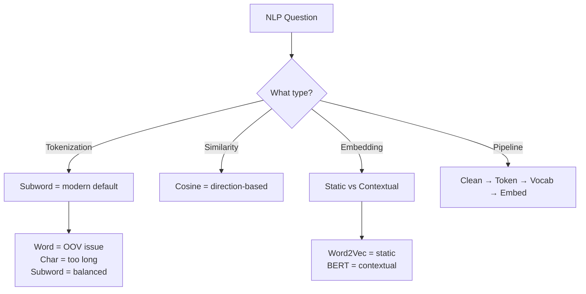

# AS41: NLP Basics & Tokenization - Exam Preparation

> 📚 **Complete Exam Prep** for: NLP, Text Cleaning, Tokenization, Vocabulary Building, Bag-of-Words, Word Embeddings, Word2Vec, Cosine Similarity

---

## Section A: Multiple Choice Questions (MCQ) - 15 Questions

### MCQ 1
**Question:** What is the main challenge in Natural Language Processing?

**Options:**
- A) Converting images to text
- B) Converting text to numbers while preserving meaning
- C) Creating beautiful user interfaces
- D) Storing large amounts of data

**✅ Correct Answer:** B

**📖 Explanation:** The biggest challenge in NLP is converting human language (text) into numerical representations that machines can process, while ensuring the meaning and relationships between words are preserved.

**❌ Why Others Are Wrong:**
- A) Image to text is OCR, not the main NLP challenge
- C) UI is web development, not NLP
- D) Storage is database management, not NLP

---

### MCQ 2
**Question:** Which tokenization type is used by modern LLMs like BERT and GPT?

**Options:**
- A) Word Tokenization
- B) Character Tokenization
- C) Subword Tokenization
- D) Sentence Tokenization

**✅ Correct Answer:** C

**📖 Explanation:** Subword tokenization (BPE, WordPiece) is the modern default because it balances vocabulary size, sequence length, and handles OOV words by splitting them into known pieces.

**❌ Why Others Are Wrong:**
- A) Word tokenization causes OOV explosion
- B) Character tokenization creates very long sequences
- D) Sentence tokenization is used for specific tasks only

---

### MCQ 3
**Question:** What does [PAD] token do in NLP?

**Options:**
- A) Removes noise from text
- B) Fills shorter sequences to match fixed length
- C) Replaces unknown words
- D) Marks sentence boundaries

**✅ Correct Answer:** B

**📖 Explanation:** [PAD] (Padding) token is used to make all sequences in a batch the same length by adding extra tokens to shorter sequences.

**❌ Why Others Are Wrong:**
- A) Text cleaning removes noise, not [PAD]
- C) [UNK] replaces unknown words
- D) [BOS]/[EOS] mark sentence boundaries

---

### MCQ 4
**Question:** In Bag of Words representation, if sentences "NLP is fun" and "fun is NLP" are processed, what happens?

**Options:**
- A) They get completely different vectors
- B) They get identical vectors
- C) They get opposite vectors
- D) One gets zeros, other gets ones

**✅ Correct Answer:** B

**📖 Explanation:** Bag of Words ignores word order and only counts word frequencies. Both sentences have {NLP:1, is:1, fun:1}, resulting in identical vectors.

**❌ Why Others Are Wrong:**
- A) BoW doesn't consider order, so vectors are same
- C) There's no "opposite" concept in BoW
- D) Both have same word counts

---

### MCQ 5
**Question:** What is the shape of an embedding matrix with vocabulary size 10,000 and embedding dimension 300?

**Options:**
- A) 300 × 10,000
- B) 10,000 × 300
- C) 10,000 × 10,000
- D) 300 × 300

**✅ Correct Answer:** B

**📖 Explanation:** Embedding matrix E ∈ R^(V×d) has shape (Vocabulary size × Embedding dimension) = (10,000 × 300).

**❌ Why Others Are Wrong:**
- A) Rows should be vocabulary, not embedding dimension
- C) This would be a square matrix, incorrect
- D) This doesn't include vocabulary size

---

### MCQ 6
**Question:** Why is cosine similarity preferred over Euclidean distance in NLP?

**Options:**
- A) It is faster to compute
- B) It only considers direction, ignoring magnitude
- C) It gives larger numbers
- D) It works only with word embeddings

**✅ Correct Answer:** B

**📖 Explanation:** In NLP, we care about semantic meaning (direction of vectors), not magnitude. Cosine similarity focuses on direction, making it ideal for comparing word meanings.

**❌ Why Others Are Wrong:**
- A) Computation speed is similar
- C) Value range doesn't matter
- D) Cosine works with any vectors

---

### MCQ 7
**Question:** In Word2Vec, what does a larger window size capture?

**Options:**
- A) Syntactic similarity
- B) Semantic similarity
- C) Spelling similarity
- D) Length similarity

**✅ Correct Answer:** B

**📖 Explanation:** Larger context windows capture semantic (meaning) relationships by considering more surrounding words. Smaller windows capture syntactic (grammatical) relationships.

**❌ Why Others Are Wrong:**
- A) Small windows capture syntactic similarity
- C) Spelling has no relation to window size
- D) Length is not captured by Word2Vec

---

### MCQ 8
**Question:** What is the purpose of attention mask in NLP?

**Options:**
- A) To make model pay more attention
- B) To hide padding tokens from the model
- C) To increase training speed
- D) To reduce vocabulary size

**✅ Correct Answer:** B

**📖 Explanation:** Attention mask tells the model which tokens are real (1) and which are padding (0), preventing the model from learning from meaningless padding tokens.

**❌ Why Others Are Wrong:**
- A) Attention mechanisms handle attention, not masks
- C) Masking doesn't directly affect speed
- D) Vocabulary is separate from masking

---

### MCQ 9
**Question:** Static embeddings like Word2Vec have which limitation?

**Options:**
- A) Cannot handle large vocabulary
- B) Same vector for same word regardless of context
- C) Require labeled data
- D) Only work with English

**✅ Correct Answer:** B

**📖 Explanation:** Static embeddings assign one vector per word type, regardless of context. "Bank" gets same vector whether referring to financial institution or river bank.

**❌ Why Others Are Wrong:**
- A) Word2Vec can handle large vocabularies
- C) Word2Vec is self-supervised (no labels needed)
- D) Word2Vec works with any language

---

### MCQ 10
**Question:** What is OOV in NLP?

**Options:**
- A) Out of Vocabulary - words not in training vocabulary
- B) Over Optimized Vectors
- C) Original Output Values
- D) Online Optimization Variables

**✅ Correct Answer:** A

**📖 Explanation:** OOV (Out of Vocabulary) refers to words that appear during inference but were not seen during training and are not in the vocabulary.

**❌ Why Others Are Wrong:**
- B, C, D) These are not standard NLP terms

---

### MCQ 11
**Question:** Which text cleaning step should be avoided for sentiment analysis?

**Options:**
- A) Lowercasing
- B) Removing extra spaces
- C) Removing negation words like "not"
- D) Unicode normalization

**✅ Correct Answer:** C

**📖 Explanation:** Removing negation words flips meaning: "I do not like" becomes "I do like" - completely opposite sentiment! This is a "meaning landmine."

**❌ Why Others Are Wrong:**
- A) Lowercasing is generally safe
- B) Extra spaces don't carry meaning
- D) Unicode normalization is safe

---

### MCQ 12
**Question:** How many parameters does an embedding matrix with V=20,000 and d=100 have?

**Options:**
- A) 20,100
- B) 200,000
- C) 2,000,000
- D) 20,000

**✅ Correct Answer:** C

**📖 Explanation:** Parameters = V × d = 20,000 × 100 = 2,000,000 (2 million parameters).

**❌ Why Others Are Wrong:**
- A) This is V + d, incorrect formula
- B) This is V × 10, incorrect
- D) This is just V, missing dimension

---

### MCQ 13
**Question:** What does Word2Vec's min_count parameter do?

**Options:**
- A) Minimum vector size
- B) Minimum word frequency to include in vocabulary
- C) Minimum training epochs
- D) Minimum similarity threshold

**✅ Correct Answer:** B

**📖 Explanation:** min_count filters out rare words. If min_count=2, words appearing less than 2 times in corpus are excluded from vocabulary.

**❌ Why Others Are Wrong:**
- A) vector_size controls vector size
- C) epochs control training iterations
- D) Word2Vec doesn't have similarity threshold

---

### MCQ 14
**Question:** Cosine similarity between two identical vectors equals:

**Options:**
- A) 0
- B) 0.5
- C) 1
- D) -1

**✅ Correct Answer:** C

**📖 Explanation:** When two vectors are identical, they point in exactly the same direction, giving cosine similarity = 1 (maximum similarity).

**❌ Why Others Are Wrong:**
- A) 0 means perpendicular (unrelated)
- B) 0.5 is partial similarity
- D) -1 means opposite directions

---

### MCQ 15
**Question:** Which special token is used in BERT for masked language modeling?

**Options:**
- A) [PAD]
- B) [UNK]
- C) [MASK]
- D) [SEP]

**✅ Correct Answer:** C

**📖 Explanation:** [MASK] token replaces some words during training, and BERT learns to predict the original word - this is masked language modeling.

**❌ Why Others Are Wrong:**
- A) [PAD] is for padding
- B) [UNK] is for unknown words
- D) [SEP] separates sentences

---

## Section B: Multiple Select Questions (MSQ) - 12 Questions

### MSQ 1
**Question:** Which are valid tokenization types? (Select ALL that apply)

**Options:**
- A) Word Tokenization
- B) Character Tokenization
- C) Subword Tokenization
- D) Paragraph Tokenization
- E) Sentence Tokenization

**✅ Correct Answers:** A, B, C, E

**📖 Explanation:** Word, Character, Subword, and Sentence tokenization are standard types. Paragraph tokenization is not a standard term.

**❌ Why Others Are Wrong:**
- D) Paragraph tokenization is not a defined type

---

### MSQ 2
**Question:** Which are special tokens in NLP? (Select ALL that apply)

**Options:**
- A) [PAD]
- B) [UNK]
- C) [WORD]
- D) [BOS]
- E) [MASK]

**✅ Correct Answers:** A, B, D, E

**📖 Explanation:** [PAD], [UNK], [BOS], [EOS], [MASK] are standard special tokens. [WORD] is not a standard special token.

**❌ Why Others Are Wrong:**
- C) [WORD] is not a standard special token

---

### MSQ 3
**Question:** Which are problems with Bag of Words? (Select ALL that apply)

**Options:**
- A) Ignores word order
- B) No semantic meaning captured
- C) High dimensionality
- D) Requires GPU
- E) Different sentences can have same vector

**✅ Correct Answers:** A, B, C, E

**📖 Explanation:** BoW ignores order, doesn't capture semantics, creates high-dimensional vectors, and orders of same words give identical vectors.

**❌ Why Others Are Wrong:**
- D) BoW doesn't require GPU

---

### MSQ 4
**Question:** Which statements about Word2Vec are TRUE? (Select ALL that apply)

**Options:**
- A) It is self-supervised
- B) It requires labeled data
- C) It learns embeddings from context
- D) It is a static embedding method
- E) It can handle polysemy

**✅ Correct Answers:** A, C, D

**📖 Explanation:** Word2Vec is self-supervised, learns from context, and produces static embeddings. It does NOT handle polysemy (same word different meanings).

**❌ Why Others Are Wrong:**
- B) Word2Vec doesn't need labels
- E) Static embeddings cannot handle polysemy

---

### MSQ 5
**Question:** Text cleaning may include which of the following? (Select ALL that apply)

**Options:**
- A) Lowercasing
- B) Removing punctuation
- C) Removing extra spaces
- D) Changing sentence meaning
- E) Unicode normalization

**✅ Correct Answers:** A, B, C, E

**📖 Explanation:** Cleaning includes normalization tasks but should NEVER change meaning.

**❌ Why Others Are Wrong:**
- D) Changing meaning is a mistake, not cleaning

---

### MSQ 6
**Question:** Which affect embedding matrix size? (Select ALL that apply)

**Options:**
- A) Vocabulary size V
- B) Embedding dimension d
- C) Sequence length L
- D) Batch size B
- E) Learning rate

**✅ Correct Answers:** A, B

**📖 Explanation:** Embedding matrix shape is V × d. Sequence length, batch size, and learning rate don't affect the matrix size.

**❌ Why Others Are Wrong:**
- C, D, E) These are training parameters, not matrix parameters

---

### MSQ 7
**Question:** Cosine similarity is preferred in NLP because: (Select ALL that apply)

**Options:**
- A) Ignores vector magnitude
- B) Focuses on direction (meaning)
- C) Works well with high dimensions
- D) Always returns positive values
- E) Used in recommendation systems

**✅ Correct Answers:** A, B, C, E

**📖 Explanation:** Cosine focuses on direction (ignoring magnitude), works in high dimensions, and is used in recommendations. It can return negative values for opposite vectors.

**❌ Why Others Are Wrong:**
- D) Cosine can return -1 to 1, not always positive

---

### MSQ 8
**Question:** Which are examples of NLP applications? (Select ALL that apply)

**Options:**
- A) ChatGPT
- B) Spam Detection
- C) Image Classification
- D) Sentiment Analysis
- E) Language Translation

**✅ Correct Answers:** A, B, D, E

**📖 Explanation:** ChatGPT, spam detection, sentiment analysis, and translation are NLP tasks. Image classification is computer vision.

**❌ Why Others Are Wrong:**
- C) Image classification is CV, not NLP

---

### MSQ 9
**Question:** Attention masks have which properties? (Select ALL that apply)

**Options:**
- A) Value 1 for real tokens
- B) Value 0 for padding
- C) Same length as input sequence
- D) Used to increase training speed
- E) Prevents model from attending to padding

**✅ Correct Answers:** A, B, C, E

**📖 Explanation:** Masks are 1 for real, 0 for padding, match sequence length, and prevent attending to padding.

**❌ Why Others Are Wrong:**
- D) Mask purpose is correctness, not speed

---

### MSQ 10
**Question:** Word2Vec parameters include: (Select ALL that apply)

**Options:**
- A) vector_size
- B) window
- C) min_count
- D) learning_rate
- E) epochs

**✅ Correct Answers:** A, B, C, E

**📖 Explanation:** vector_size, window, min_count, and epochs are Word2Vec parameters in Gensim.

**❌ Why Others Are Wrong:**
- D) It's called 'alpha' in Gensim, not 'learning_rate'

---

### MSQ 11
**Question:** Subword tokenization advantages include: (Select ALL that apply)

**Options:**
- A) Handles OOV words
- B) Manageable vocabulary size
- C) Balanced sequence length
- D) Always faster than word tokenization
- E) Used by BERT and GPT

**✅ Correct Answers:** A, B, C, E

**📖 Explanation:** Subword handles OOV by splitting, keeps vocab manageable, balances length, and is used by modern LLMs.

**❌ Why Others Are Wrong:**
- D) Speed depends on implementation

---

### MSQ 12
**Question:** Contextual embeddings (BERT) vs Static (Word2Vec): (Select ALL TRUE statements)

**Options:**
- A) Contextual handles polysemy
- B) Static is faster for lookup
- C) Contextual requires more memory
- D) Static gives different vectors for same word in different contexts
- E) BERT is contextual

**✅ Correct Answers:** A, B, C, E

**📖 Explanation:** Contextual handles polysemy, static is faster, contextual needs more memory, and BERT is contextual.

**❌ Why Others Are Wrong:**
- D) Static gives SAME vector regardless of context

---

## Section C: Numerical/Calculation Questions - 6 Questions

### Numerical 1
**Question:** An embedding matrix has V=5000 words and d=200 dimensions. How many parameters does it have?

**Given:**
- Vocabulary size V = 5000
- Embedding dimension d = 200

**Solution Steps:**
1. Formula: Parameters = V × d
2. Calculation: 5000 × 200 = 1,000,000

**✅ Final Answer:** 1,000,000 (1 Million parameters)

---

### Numerical 2
**Question:** A batch contains sentences with lengths [3, 7, 5, 4]. What is the longest token size L, and how many PAD tokens are added to each sentence?

**Given:**
- Sentence lengths: [3, 7, 5, 4]

**Solution Steps:**
1. L = max(3, 7, 5, 4) = 7
2. PAD counts = L - original length
   - Sentence 1: 7 - 3 = 4 PADs
   - Sentence 2: 7 - 7 = 0 PADs
   - Sentence 3: 7 - 5 = 2 PADs
   - Sentence 4: 7 - 4 = 3 PADs

**✅ Final Answer:** L = 7, PAD counts = [4, 0, 2, 3]

---

### Numerical 3
**Question:** Vector A = [1, 2, 3] and Vector B = [2, 4, 6]. Calculate cosine similarity.

**Given:**
- A = [1, 2, 3]
- B = [2, 4, 6]

**Solution Steps:**
1. Dot product: A·B = (1×2) + (2×4) + (3×6) = 2 + 8 + 18 = 28
2. ||A|| = √(1² + 2² + 3²) = √(1+4+9) = √14 ≈ 3.74
3. ||B|| = √(2² + 4² + 6²) = √(4+16+36) = √56 ≈ 7.48
4. Cosine = 28 / (3.74 × 7.48) = 28 / 27.98 ≈ 1.0

**✅ Final Answer:** Cosine Similarity = 1.0 (vectors are parallel/identical direction)

---

### Numerical 4
**Question:** Vocabulary has tokens with counts: {"nlp": 10, "ai": 5, "ml": 3, "dl": 1, "cv": 1}. If min_count=2, how many tokens remain in vocabulary?

**Given:**
- Token counts: {"nlp": 10, "ai": 5, "ml": 3, "dl": 1, "cv": 1}
- min_count = 2

**Solution Steps:**
1. Keep tokens with count ≥ 2
2. nlp (10 ≥ 2) ✓
3. ai (5 ≥ 2) ✓
4. ml (3 ≥ 2) ✓
5. dl (1 < 2) ✗
6. cv (1 < 2) ✗

**✅ Final Answer:** 3 tokens remain (nlp, ai, ml)

---

### Numerical 5
**Question:** A sentence has 5 tokens. After embedding lookup with d=100, what is the embedding tensor shape?

**Given:**
- Tokens = 5
- Embedding dimension d = 100

**Solution Steps:**
1. Each token → one row of embedding matrix
2. Shape = (number of tokens, embedding dimension)
3. Shape = (5, 100)

**✅ Final Answer:** Shape = (5, 100)

---

### Numerical 6
**Question:** Batch has 4 sentences, each padded to L=10, with embedding dimension d=50. What is the batch embedding shape?

**Given:**
- Batch size B = 4
- Sequence length L = 10
- Embedding dimension d = 50

**Solution Steps:**
1. Batch embedding shape = (B, L, d)
2. Shape = (4, 10, 50)

**✅ Final Answer:** Shape = (4, 10, 50) or B × L × d

---

## Section D: Fill in the Blanks - 8 Questions

### Fill 1
**Question:** The process of breaking text into smaller units is called _______.

**Answer:** Tokenization

**Explanation:** Tokenization splits text into tokens (words, subwords, or characters).

---

### Fill 2
**Question:** The special token _______ is used to replace words not in vocabulary.

**Answer:** [UNK]

**Explanation:** [UNK] = Unknown token, used when model encounters OOV words.

---

### Fill 3
**Question:** Word embeddings represent words as _______ vectors that capture meaning.

**Answer:** Dense

**Explanation:** Dense = filled with values (unlike sparse one-hot vectors).

---

### Fill 4
**Question:** The embedding matrix has shape _______ where V is vocabulary size and d is dimension.

**Answer:** V × d (or (V, d))

**Explanation:** Each of V words gets a d-dimensional vector.

---

### Fill 5
**Question:** Cosine similarity measures the _______ between two vectors.

**Answer:** Direction (or angle)

**Explanation:** Cosine calculates the cosine of the angle, focusing on direction not magnitude.

---

### Fill 6
**Question:** Static embeddings give _______ vector for the same word regardless of context.

**Answer:** Same (or one/single)

**Explanation:** Static embeddings (Word2Vec) don't consider context.

---

### Fill 7
**Question:** Word2Vec is a _______ learning method that doesn't require labeled data.

**Answer:** Self-supervised (or unsupervised)

**Explanation:** Word2Vec creates its own training signal from context words.

---

### Fill 8
**Question:** The attention mask value for padding tokens is _______.

**Answer:** 0

**Explanation:** 1 = real tokens, 0 = padding (to be ignored).

---

## 📚 Quick Revision Points

### Key Formulas

| Formula | Description |
|---------|-------------|
| Parameters = V × d | Embedding matrix parameter count |
| L = max(lengths) | Longest token size in batch |
| PAD_count = L - len | Padding tokens needed |
| cosine_sim = (A·B)/(‖A‖·‖B‖) | Cosine similarity formula |

### Key Concepts Summary

| Concept | One-Line Definition | When to Use |
|---------|---------------------|-------------|
| NLP | AI field for human language understanding | Text processing tasks |
| Tokenization | Breaking text into units | All NLP pipelines |
| Vocabulary | Set of unique tokens with IDs | After tokenization |
| Bag of Words | Count-based representation | Simple baseline |
| Embeddings | Dense learned vectors | Modern NLP |
| Word2Vec | Static embedding algorithm | Quick prototype |
| Cosine Similarity | Direction-based similarity | Comparing meanings |

### Common Exam Traps

1. **Trap:** BoW captures word order
   **Correct:** BoW ignores order completely

2. **Trap:** Word2Vec handles polysemy
   **Correct:** Word2Vec is static, cannot handle polysemy

3. **Trap:** Cosine similarity is always positive
   **Correct:** Cosine ranges from -1 to 1

4. **Trap:** [PAD] token is ignored automatically
   **Correct:** Need attention mask to ignore padding

---

## 🚀 Section E: Shortcuts & Cheat Codes for Exam

### ⚡ One-Liner Shortcuts

| Concept | Shortcut/Cheat Code | When to Use |
|---------|---------------------|-------------|
| Embedding params | V × d | Asked about matrix size |
| Cosine = 1 | Identical vectors | Maximum similarity |
| Cosine = 0 | Perpendicular | Unrelated words |
| Static embedding | Same vector always | Word2Vec, GloVe |
| Contextual | Different per context | BERT, GPT |

### 🎯 Memory Tricks (Mnemonics)

1. **PCVE** = Pipeline: Clean → tokenize → Vocab → Embed
2. **PUM** = Special tokens: Pad, Unknown, Mask
3. **WSM** = Word2Vec: Static, Self-supervised, Meaning

### 🔢 Quick Calculation Hacks

| Scenario | Hack | Example |
|----------|------|---------|
| Params count | V × d directly | 10000 × 100 = 1M |
| PAD count | L - length | 10 - 7 = 3 PADs |
| Batch shape | B × L × d | 32 × 128 × 768 |

### 📝 Last-Minute Formula Sheet

```
📌 Embedding Params = V × d → e.g., 30000 × 300 = 9M
📌 L (longest) = max(all sentence lengths)
📌 PAD count = L - current_length
📌 Cosine = dot_product / (norm_A × norm_B)
📌 Batch embedding shape = (B, L, d)
```

### 🎓 Interview One-Liners

| Question | Safe Answer |
|----------|-------------|
| What is tokenization? | Breaking text into meaningful units called tokens |
| Word vs Subword? | Subword handles OOV, used by BERT/GPT |
| Why cosine not Euclidean? | Cosine ignores magnitude, focuses on meaning (direction) |
| Static vs Contextual? | Static = one vector per word; Contextual = context-dependent |
| What is OOV? | Out of Vocabulary - unknown words not in training vocab |

### ⚠️ "If You Forget Everything, Remember This"

1. **Golden Rule 1:** Text → Tokens → IDs → Embeddings → Model
2. **Golden Rule 2:** Cosine similarity = direction, not magnitude
3. **Golden Rule 3:** [PAD] needs attention mask (0) to be ignored
4. **Golden Rule 4:** Subword tokenization = modern default (BERT/GPT)

### 🔄 Quick Decision Flowchart



### 🎯 Safe Answer Patterns

- **For "What is X?"** → Simple definition + one example
- **For "Why X?"** → Problem it solves + comparison
- **For "Compare X vs Y"** → 3-4 differences in table format
- **For "Calculate"** → Formula + step-by-step + final answer with units
- **For "When to use X?"** → Specific scenario + trade-off awareness
