# AS42: Transformers & Prompt Engineering - Classroom Session (Part 1)

> 📚 **This is Part 1** covering: Transformer Architecture, Self-Attention Mechanism, QKV Vectors, Multi-Head Attention
> 📘 **See also:** [Part 2 - Prompt Engineering](./AS42_TransformersPromptEngineering2.md), [Part 3 - Practical Applications](./AS42_TransformersPromptEngineering3.md)

---

## 🗺️ Mind Map - Topics Covered in This Session


---

## 🎓 Classroom Conversation

### Topic 1: Introduction to Transformers - The Revolution

**Teacher:** Students, aaj mana session chala exciting - Transformers! Ye concept 2017 lo introduce ayyindi and it CHANGED AI FOREVER! ChatGPT, Gemini, Claude - anni ivi vaduthayi!

**Beginner Student:** Sir, Transformer ante robots like Optimus Prime aa? 😄

**Teacher:** Ha ha! No no! AI lo Transformer is a neural network architecture. "Transform" ante convert cheyyadam - input text ni output text ga convert chesthundi!

Real-life lo think cheyyi:
- **Translator** ante oka person - English cheppithe Hindi lo convert chesthadu
- **Transformer model** ante same thing - input text ichthe, output text generate chesthundi

```mermaid
flowchart LR
    I["Input Text<br>'Hello, how are you?'"] --> T["🤖 Transformer"]
    T --> O["Output Text<br>'नमस्ते, आप कैसे हैं?'"]
```



**Clever Student:** Sir, RNN and LSTM kuda text process chesthay kadaa? Transformer enti special?

**Teacher:** Excellent question! Main difference:

| Feature | RNN/LSTM | Transformer |
|---------|----------|-------------|
| Processing | Sequential (one by one) | Parallel (all at once) |
| Memory | Limited long-term | Attention-based |
| Speed | Slow training | Fast training |
| Long text | Forgets beginning | Remembers everything |

**Key Innovation**: "Attention is All You Need" paper - 2017 Google!

> 💡 **Jargon Alert - "Attention is All You Need"**
> Simple Explanation: Famous 2017 paper that introduced Transformers. Title means: We don't need RNN/LSTM, just ATTENTION mechanism is enough!
> Example: Instead of reading book page-by-page, look at ALL pages simultaneously and focus on relevant ones.

---

### Topic 2: Self-Attention Mechanism - The Heart of Transformers

**Teacher:** Self-Attention is the CORE concept! Let me explain with simple analogy.

**Beginner Student:** Sir, attention ante kya hai? Focus karna?

**Teacher:** Exactly! Think of classroom:
- You're reading a textbook
- Teacher asks question about Chapter 5
- Your attention FOCUSES on Chapter 5, not Chapter 1

Same way, when model reads "Jack and Jill went up the hill":
- For word "went", model gives MORE attention to "Jack", "Jill" (who went)
- LESS attention to "the", "hill" (less relevant for understanding "went")


**Practical Student:** Sir, interview lo self-attention explain karna ho, toh kaise bolein?

**Teacher:** Safe interview answer:

> "Self-attention is a mechanism where each word in a sentence calculates its relationship with ALL other words. It generates attention scores indicating which words are most relevant to each other. This helps the model understand context better than RNNs."

```python
# Conceptual self-attention
sentence = ["Jack", "and", "Jill", "went", "up", "the", "hill"]

# For each word, calculate attention to all other words
# "went" attends to:
attention_scores = {
    "Jack": 0.6,   # High - subject of the action
    "Jill": 0.5,   # High - also subject
    "and": 0.1,    # Low - connector word
    "up": 0.2,     # Medium - direction
    "the": 0.05,   # Very low - article
    "hill": 0.15   # Low-medium - destination
}
```

**Curious Student:** Sir, ye scores kaise calculate hote hain? Manually set karte hain kya?

**Teacher:** Great question! Model LEARNS these through training! Initially random, but backpropagation updates weights to learn correct attention patterns.

---

### Topic 3: Query, Key, Value (QKV) Vectors

**Teacher:** Ippudu most important concept - Q, K, V! Attention calculation uses THREE matrices:

**Beginner Student:** Sir, Q, K, V ante kya? Simple mein samjhao!

**Teacher:** Library analogy use karta hun:

| Component | Library Analogy | In Transformer |
|-----------|-----------------|----------------|
| **Query (Q)** | Your search question: "Physics books kahan hai?" | What current word is looking for |
| **Key (K)** | Book labels: "Fiction", "Science", "History" | What each word offers/represents |
| **Value (V)** | Actual book content | Actual information from each word |

**Process**:
1. You ask Query: "Physics books?"
2. Compare with all Keys: Match found at "Science" label!
3. Get Value: Here are the actual physics books


**Clever Student:** Sir, formula kya hai attention ka?

**Teacher:** The famous formula:

$$\text{Attention}(Q, K, V) = \text{softmax}\left(\frac{QK^T}{\sqrt{d_k}}\right) \times V$$

Let me break it down:

```python
import numpy as np

def scaled_dot_product_attention(Q, K, V):
    """
    Q: Query matrix - what we're looking for
    K: Key matrix - what each token offers
    V: Value matrix - actual content
    d_k: Dimension of key vectors
    """
    d_k = K.shape[-1]
    
    # Step 1: Multiply Q with K transpose (compatibility)
    scores = np.dot(Q, K.T)
    
    # Step 2: Scale by sqrt(d_k) to prevent large values
    scaled_scores = scores / np.sqrt(d_k)
    
    # Step 3: Apply softmax for probability distribution
    attention_weights = softmax(scaled_scores)
    
    # Step 4: Multiply with V to get weighted values
    output = np.dot(attention_weights, V)
    
    return output
```

> 💡 **Jargon Alert - Scaled Dot-Product Attention**
> Simple Explanation: Multiply Query with Key (how similar?), scale down to prevent explosion, softmax for probabilities, then get weighted Values.
> Example: Like rating how relevant each book is (1-10), then getting content from highest-rated books.

**Critique Student:** Sir, why divide by √d_k? Ye scaling kyun chahiye?

**Teacher:** Excellent critical question!

Without scaling:
- Large dimensions → Very large dot products (like 1000, 2000)
- Softmax on large values → Output becomes 0 or 1 (extreme)
- Gradients become tiny → Training fails!

With scaling:
- Values stay in reasonable range (like 5, 10)
- Softmax gives balanced probabilities (0.3, 0.5, 0.2)
- Gradients flow properly → Training works!

```
Without scaling: softmax([1000, 2000, 500]) → [0, 1, 0]  ❌ Extreme!
With scaling:    softmax([10, 20, 5])       → [0.1, 0.8, 0.1]  ✅ Balanced!
```

---

### Topic 4: Multi-Head Attention

**Teacher:** Single attention head oka type ka relationship learn karta hai. But text has MANY relationships!

**Debate Student:** Sir, single head se kya problem hai? Multiple heads kyun chahiye?

**Teacher:** Great debate question! Think of it:

**Single Head** = One person reading book
- Can focus on one aspect only

**Multi-Head** = Team of readers, each with different focus
- Reader 1: Grammar relationships
- Reader 2: Subject-Object relationships
- Reader 3: Temporal relationships
- Reader 4: Semantic similarity


Example with sentence: "The quick brown fox jumps over the lazy dog"

| Head | What it learns |
|------|----------------|
| Head 1 | "quick" → "fox", "lazy" → "dog" (adjectives) |
| Head 2 | "fox" → "jumps" (who does action) |
| Head 3 | "jumps" → "over" (action direction) |
| Head 4 | "fox" similar to "dog" (both animals) |

**Practical Student:** Sir, BERT, GPT mein kitne heads hote hain?

**Teacher:** Good practical question!

| Model | Heads | Layers | Hidden Dim |
|-------|-------|--------|------------|
| BERT-base | 12 | 12 | 768 |
| BERT-large | 16 | 24 | 1024 |
| GPT-2 | 12 | 12 | 768 |
| GPT-3 | 96 | 96 | 12,288 |

More heads = More diverse relationship learning!

```python
class MultiHeadAttention:
    def __init__(self, d_model=512, num_heads=8):
        self.num_heads = num_heads
        self.d_k = d_model // num_heads  # Each head dimension
        # d_model=512, num_heads=8 → d_k=64 per head
        
    def forward(self, Q, K, V):
        # Split into multiple heads
        heads_output = []
        for i in range(self.num_heads):
            head_out = scaled_dot_product_attention(Q_i, K_i, V_i)
            heads_output.append(head_out)
        
        # Concatenate all heads
        concat = np.concatenate(heads_output, axis=-1)
        
        # Final linear projection
        output = np.dot(concat, W_o)
        return output
```

---

### Topic 5: Positional Encoding - Where Am I?

**Teacher:** RNN processes one-by-one, so position automatic hai. But Transformer processes ALL tokens simultaneously - position info kahan se aayega?

**Beginner Student:** Sir, position important kyun hai?

**Teacher:** Think about these sentences:
- "Dog bites man" - Normal news
- "Man bites dog" - Shocking news! 😄

Same words, different order, completely different meaning! Position CRITICAL hai!

**Solution**: Positional Encoding - add position information to embeddings!

```python
import numpy as np

def positional_encoding(seq_len, d_model):
    """
    Add position information using sine and cosine functions
    
    Paper formula:
    PE(pos, 2i) = sin(pos / 10000^(2i/d_model))
    PE(pos, 2i+1) = cos(pos / 10000^(2i/d_model))
    """
    PE = np.zeros((seq_len, d_model))
    
    for pos in range(seq_len):
        for i in range(0, d_model, 2):
            PE[pos, i] = np.sin(pos / (10000 ** (i / d_model)))
            PE[pos, i+1] = np.cos(pos / (10000 ** (i / d_model)))
    
    return PE

# Final embedding = Token Embedding + Positional Encoding
final_embedding = token_embedding + positional_encoding
```

> 💡 **Jargon Alert - Positional Encoding**
> Simple Explanation: Numbers added to each word's embedding to tell model "this word is at position 1", "this is at position 2", etc.
> Example: Like roll numbers in class - helps identify who sits where!

**Types of Positional Encoding**:
1. **Sinusoidal** (Original Transformer) - Fixed formula, no training
2. **Learned** (BERT) - Trained like other parameters
3. **Rotary (RoPE)** (Modern) - Relative positions, used in LLaMA

---

### Topic 6: Complete Transformer Architecture

**Teacher:** Ab complete architecture dekhte hain:


**Clever Student:** Sir, Add & Normalize kya hai?

**Teacher:** Two important techniques:

1. **Add (Residual Connection)**:
   - Output = Input + Layer_Output
   - Skip connection - helps gradient flow

2. **Normalize (Layer Normalization)**:
   - Normalize values for stable training
   - Prevents exploding/vanishing values

```python
def add_and_norm(input_tensor, sublayer_output, layer_norm):
    # Residual connection - add input directly
    residual = input_tensor + sublayer_output
    
    # Layer normalization - stabilize values
    normalized = layer_norm(residual)
    
    return normalized
```

**Curious Student:** Sir, Feed Forward Network kya karta hai?

**Teacher:** FFN is simple 2-layer MLP at each position:

```python
def feed_forward_network(x, d_model=512, d_ff=2048):
    """
    FFN(x) = max(0, xW1 + b1)W2 + b2
    
    First expand: 512 → 2048
    Then compress: 2048 → 512
    """
    # Expand
    hidden = relu(np.dot(x, W1) + b1)  # 512 → 2048
    
    # Compress
    output = np.dot(hidden, W2) + b2   # 2048 → 512
    
    return output
```

Usually d_ff = 4 × d_model (expansion factor of 4)

---

## 📝 Teacher Summary - Part 1

**Teacher:** Students, Part 1 summarize karte hain:

### Key Takeaways

| Concept | One-Line Definition |
|---------|---------------------|
| Transformer | Neural network using attention instead of recurrence |
| Self-Attention | Each word calculates relevance to all other words |
| Q, K, V | Query (what I want), Key (what offered), Value (actual content) |
| Scaling | Divide by √d_k to prevent extreme softmax values |
| Multi-Head | Multiple attention calculations for diverse relationships |
| Positional Encoding | Add position info since no sequential processing |
| Residual + Norm | Skip connections + normalization for stable training |

### Common Mistakes

1. **Forgetting scaling** → Leads to vanishing gradients
2. **Ignoring positional encoding** → Word order lost
3. **Single head for complex tasks** → Misses relationship types

### Interview Quick Points

- Transformer = 2017, "Attention is All You Need", Google
- Self-Attention = Each token attends to all tokens
- QKV = Query-Key-Value matrices
- Multi-head = Parallel attention for diverse patterns
- Positional Encoding = Position info for parallel processing

---

> 📘 **Continue to Part 2:** [Prompt Engineering Techniques](./AS42_TransformersPromptEngineering2.md)
