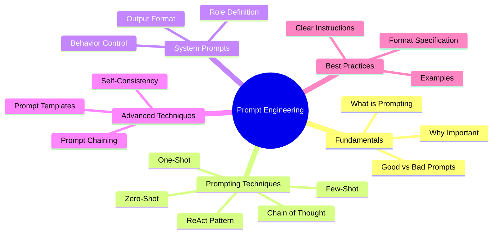
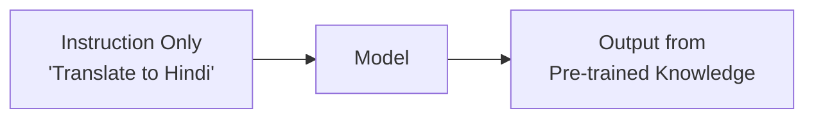
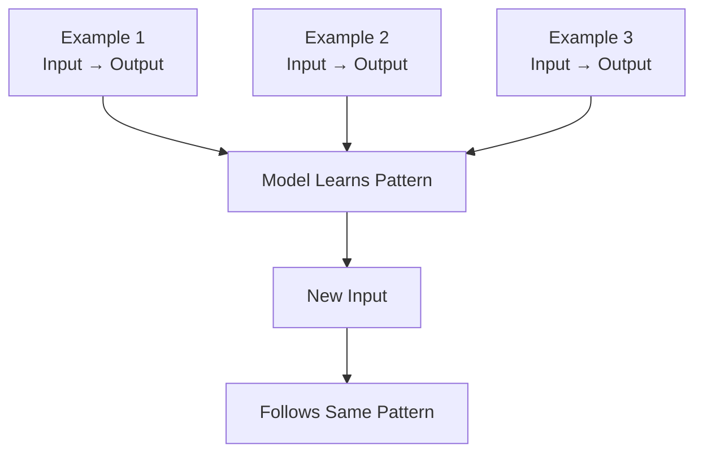
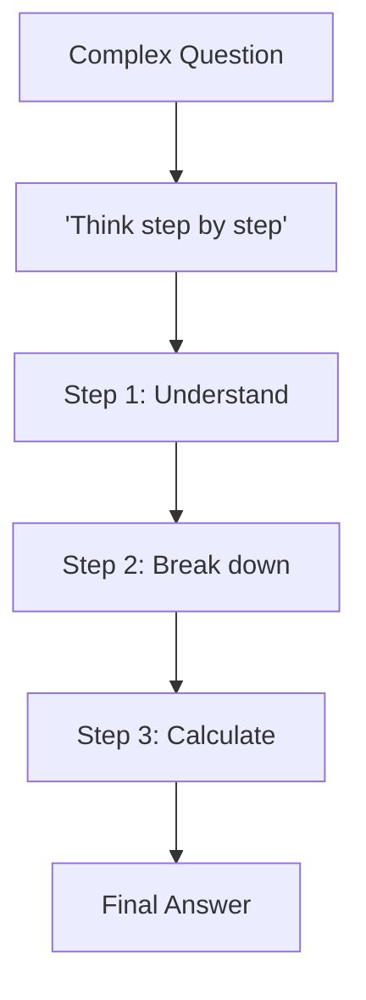
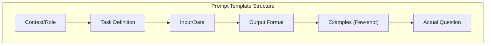
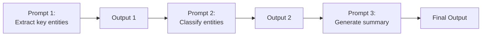

# AS42: Transformers & Prompt Engineering - Classroom Session (Part 2)

> 📚 **This is Part 2** covering: Prompt Engineering Fundamentals, Zero-Shot, Few-Shot, Chain of Thought, System Prompts, Prompt Templates
> 📘 **Previous:** [Part 1 - Transformer Architecture](./AS42_TransformersPromptEngineering1.md)
> 📘 **Next:** [Part 3 - Practical Applications](./AS42_TransformersPromptEngineering3.md)

---

## 🗺️ Mind Map - Topics Covered in Part 2



---

## 🎓 Classroom Conversation Continued

### Topic 7: What is Prompt Engineering?

**Teacher:** Students, Part 1 mein Transformers architecture samjhe. Ab most PRACTICAL skill - Prompt Engineering! This is what makes ChatGPT useful!

**Beginner Student:** Sir, prompt engineering kya hai? Kuch special coding?

**Teacher:** Nahi! Prompt engineering is the ART of asking questions correctly!

Think about:
- **Bad Question** (to teacher): "Tell me about India"
  - Teacher: Starts talking for 2 hours randomly

- **Good Question**: "Tell me 5 important freedom fighters of India in bullet points"
  - Teacher: Gives exactly what you need!

Same with AI:
```
❌ Bad Prompt: "Tell me about AI"
   Output: Very long, unfocused answer...

✅ Good Prompt: "Explain AI in 3 bullet points for a 10-year-old child"
   Output: 
   • AI is like a smart robot brain that learns
   • It can recognize pictures and understand words
   • It helps in games, phones, and cars
```

> 💡 **Jargon Alert - Prompt Engineering**
> Simple Explanation: Crafting the perfect question/instruction to get the best answer from AI. Like being a good interviewer!
> Example: Instead of "write code", say "write Python function to sort list with comments"

**Practical Student:** Sir, interview mein prompt engineering ke baare mein puchte hain?

**Teacher:** 2024 mein, YES! It's a JOB ROLE now - "Prompt Engineer"!

Companies hire people just to write good prompts. Salary: ₹15-50 LPA!

---

### Topic 8: Zero-Shot Prompting

**Teacher:** First technique - Zero-Shot! "Zero" examples dete hain, model apne knowledge se answer karta hai.

**Beginner Student:** Sir, zero-shot matlab koi example nahi?

**Teacher:** Exactly! Model relies on its pre-training knowledge only.

```python
# Zero-Shot Example
prompt = "Translate this to Hindi: Hello, how are you?"

# Output (from model's knowledge)
output = "नमस्ते, आप कैसे हैं?"

# No examples provided - model knows from training!
```



**When Zero-Shot Works Well**:
- Simple, well-defined tasks
- Common knowledge questions
- Standard formats (translation, summarization)
- Model is well-trained on similar tasks

**When Zero-Shot Fails**:
- Complex reasoning
- Domain-specific tasks
- Unusual formats
- Tasks needing specific examples

**Clever Student:** Sir, agar zero-shot fail ho jaye toh?

**Teacher:** Tab Few-Shot use karte hain!

---

### Topic 9: Few-Shot Prompting

**Teacher:** Few-Shot means giving FEW EXAMPLES to guide the model!

**Debate Student:** Sir, kitne examples chahiye? 1? 5? 100?

**Teacher:** Usually 1-5 examples sufficient! That's why "few"-shot.

| Type | Examples | When to Use |
|------|----------|-------------|
| Zero-shot | 0 | Simple, common tasks |
| One-shot | 1 | Show format once |
| Few-shot | 2-5 | Complex patterns |

```python
# Few-Shot Example for Sentiment Analysis
prompt = """
Classify the sentiment:

Text: "I love this movie!"
Sentiment: Positive

Text: "This was terrible."
Sentiment: Negative

Text: "The food was okay, nothing special."
Sentiment: Neutral

Text: "Best vacation ever!"
Sentiment: """

# Model follows pattern and outputs: "Positive"
```



**Practical Use Cases**:

```python
# Few-Shot for Code Comment Generation
prompt = """
Generate comments for code:

Code: x = 5
Comment: # Initialize variable x with value 5

Code: for i in range(10):
Comment: # Loop from 0 to 9

Code: result = a + b * c
Comment: """

# Output: "# Calculate result by adding a to product of b and c"
```

> 💡 **Jargon Alert - In-Context Learning**
> Simple Explanation: Model learns from examples IN the prompt itself, without updating weights. It's like showing someone 3 solved math problems before asking them to solve the 4th.
> Example: Few-shot prompting IS in-context learning!

---

### Topic 10: Chain of Thought (CoT) Prompting

**Teacher:** Ippudu most POWERFUL technique - Chain of Thought! "THINK STEP BY STEP" magic words hai!

**Beginner Student:** Sir, step by step se kya farak padta hai?

**Teacher:** Huge difference! Let me show:

**Without Chain of Thought**:
```
Prompt: "If I have 5 apples, give 2 to John, buy 3 more, 
        how many do I have?"

Output: "6 apples"  ← Correct but no reasoning visible
```

**With Chain of Thought**:
```
Prompt: "If I have 5 apples, give 2 to John, buy 3 more, 
        how many do I have? Think step by step."

Output: 
"Let me solve this step by step:
Step 1: Start with 5 apples
Step 2: Give 2 to John: 5 - 2 = 3 apples
Step 3: Buy 3 more: 3 + 3 = 6 apples
Answer: 6 apples"
```



**Curious Student:** Sir, mathematically CoT kyun better hai?

**Teacher:** Deep question! Two reasons:

1. **Intermediate Tokens**: Model generates reasoning tokens first, which help generate correct final answer
2. **Error Correction**: If step is wrong, model can catch it in next step

```python
# CoT Prompting Template
def chain_of_thought_prompt(question):
    return f"""
    Question: {question}
    
    Let's think step by step:
    1. First, I need to understand what is being asked.
    2. Then, I'll identify the key information.
    3. Next, I'll apply the relevant formula/logic.
    4. Finally, I'll calculate and verify.
    
    Solution:
    """
```

**Critique Student:** Sir, CoT har jagah kaam karta hai kya?

**Teacher:** Good critique! CoT works best for:
- Mathematical problems
- Logical reasoning
- Multi-step tasks
- Complex decision making

Does NOT help much for:
- Simple factual questions
- Translation
- Creative writing

---

### Topic 11: System Prompts - Setting the Stage

**Teacher:** System prompts define MODEL'S PERSONALITY and BEHAVIOR!

**Practical Student:** Sir, system prompt kya hota hai? User prompt se different?

**Teacher:** Excellent question! In modern LLMs (ChatGPT, Claude), there are roles:

| Role | Purpose | Example |
|------|---------|---------|
| **System** | Define behavior, personality | "You are a helpful Python tutor" |
| **User** | User's question/input | "How do I write a for loop?" |
| **Assistant** | Model's response | "Here's how to write a for loop..." |

```python
# API Call Structure
messages = [
    {
        "role": "system",
        "content": "You are a friendly coding tutor. Explain concepts simply with examples. Always encourage the student."
    },
    {
        "role": "user",
        "content": "What is a variable?"
    }
]

# Response will be friendly, simple, encouraging!
```

**System Prompt Examples**:

```python
# Example 1: Pirate Personality
system_prompt = "You are a helpful assistant who speaks like a pirate."
user_prompt = "What is 2+2?"
# Response: "Arrr, matey! That be 4 doubloons!"

# Example 2: JSON Output Format
system_prompt = "Always respond in valid JSON format with keys: answer, confidence, explanation"
user_prompt = "What is the capital of France?"
# Response: {"answer": "Paris", "confidence": 0.99, "explanation": "Paris is the capital city of France"}

# Example 3: Coding Assistant
system_prompt = """You are a senior Python developer. 
- Always include type hints
- Add docstrings to functions
- Follow PEP8 guidelines
- Include error handling"""
```

> 💡 **Jargon Alert - System Prompt**
> Simple Explanation: Hidden instructions that tell AI how to behave, like a secret rulebook. User doesn't see it, but AI follows it!
> Example: "Be concise", "Reply in Hindi", "Always ask clarifying questions"

---

### Topic 12: Prompt Templates & Structure

**Teacher:** Professional mein templates use karte hain for consistency!

**Clever Student:** Sir, template kaise banate hain?

**Teacher:** Good templates have clear sections:

```python
# Professional Prompt Template
template = """
## Context
You are an expert {expert_type} with {years} years of experience.

## Task
{task_description}

## Input Data
{input_data}

## Output Requirements
- Format: {output_format}
- Length: {length}
- Tone: {tone}

## Examples (Optional)
{examples}

## Constraints
- Do not {constraint_1}
- Always {constraint_2}

## Question
{actual_question}
"""

# Filled Template
prompt = template.format(
    expert_type="data scientist",
    years="10",
    task_description="Analyze the given sales data",
    input_data="Q1: $100K, Q2: $150K, Q3: $120K, Q4: $200K",
    output_format="bullet points",
    length="5-7 points",
    tone="professional",
    examples="",
    constraint_1="use technical jargon",
    constraint_2="provide actionable insights",
    actual_question="What are the key trends and recommendations?"
)
```

**Common Template Patterns**:



---

### Topic 13: Advanced Prompting Techniques

**Teacher:** Ippudu advanced techniques cover karte hain:

#### 1. Self-Consistency

Multiple answers generate karo, majority vote lo:

```python
# Run same prompt 5 times
responses = [
    "6 apples",  # Response 1
    "6 apples",  # Response 2
    "7 apples",  # Response 3 (wrong)
    "6 apples",  # Response 4
    "6 apples",  # Response 5
]

# Majority vote: "6 apples" (4 out of 5)
final_answer = most_common(responses)  # "6 apples"
```

#### 2. Prompt Chaining

Break complex task into smaller prompts:



```python
# Step 1: Extract
prompt1 = "Extract all person names from this text: {text}"
names = call_llm(prompt1)  # ["John", "Mary", "Tom"]

# Step 2: Classify
prompt2 = f"For each name, identify if adult or child: {names}"
classified = call_llm(prompt2)  # {"John": "adult", ...}

# Step 3: Summarize
prompt3 = f"Summarize the roles of: {classified}"
summary = call_llm(prompt3)  # Final summary
```

#### 3. ReAct Pattern (Reason + Act)

Model reasons then takes action:

```
Prompt: Find the population of capital of France.

Response:
Thought: I need to find capital of France first.
Action: Search "capital of France"
Observation: Paris is the capital.

Thought: Now I need population of Paris.
Action: Search "population of Paris"
Observation: About 2.1 million.

Answer: The population of Paris (capital of France) is about 2.1 million.
```

> 💡 **Jargon Alert - ReAct**
> Simple Explanation: Model alternates between Reasoning (thinking) and Acting (searching, calculating). Like how humans solve problems!
> Example: "Let me think... okay I need to search this... found it... now let me calculate..."

---

### Topic 14: Prompt Engineering Best Practices

**Teacher:** Final section - Best Practices summary!

**Practical Student:** Sir, interview ke liye quick tips?

**Teacher:** Here's the complete checklist:

```markdown
## ✅ Prompt Engineering Checklist

### DO ✅
1. Be specific: "5 bullet points" not "some points"
2. Give examples: Few-shot when complex
3. Specify format: JSON, markdown, table
4. Set constraints: Max length, no jargon
5. Define role: "You are an expert..."
6. Ask for reasoning: "Think step by step"

### DON'T ❌
1. Vague instructions: "Tell me about X"
2. Assume context: Model doesn't remember
3. Skip format: Gets messy output
4. Ignore edge cases: Add constraints
5. One-size-fits-all: Adapt per task
```

**Good vs Bad Prompts Comparison**:

| Bad Prompt | Good Prompt |
|------------|-------------|
| "Write about Python" | "Write 5 key features of Python for beginners, with one example each" |
| "Fix this code" | "This code throws IndexError. Find the bug and explain the fix with corrected code" |
| "Summarize" | "Summarize this article in 3 bullet points, max 50 words total" |
| "Help" | "I'm building a REST API in Flask. How do I handle authentication?" |

---

## 📝 Teacher Summary - Part 2

**Teacher:** Students, Part 2 summarize karte hain:

### Key Takeaways

| Technique | When to Use | Magic Words |
|-----------|-------------|-------------|
| Zero-shot | Simple, common tasks | Just ask directly |
| Few-shot | Complex patterns | Give 2-5 examples |
| Chain of Thought | Math, logic, reasoning | "Think step by step" |
| System Prompt | Control behavior | Define role first |
| Prompt Chaining | Multi-step tasks | Break into smaller prompts |
| Self-Consistency | Critical accuracy | Multiple attempts + vote |

### Common Mistakes

1. **Too vague** → Be specific with format and length
2. **No examples for complex tasks** → Add few-shot examples
3. **Forgetting context** → Model doesn't remember previous chats
4. **Not specifying output format** → Get messy responses

### Interview Quick Points

- Prompt Engineering = Crafting effective AI instructions
- Zero-shot = No examples, rely on training
- Few-shot = Give examples to guide
- CoT = "Think step by step"
- System Prompt = Define AI's personality/behavior
- ReAct = Reason + Act pattern

---

> 📘 **Continue to Part 3:** [Practical Applications & HuggingFace](./AS42_TransformersPromptEngineering3.md)
