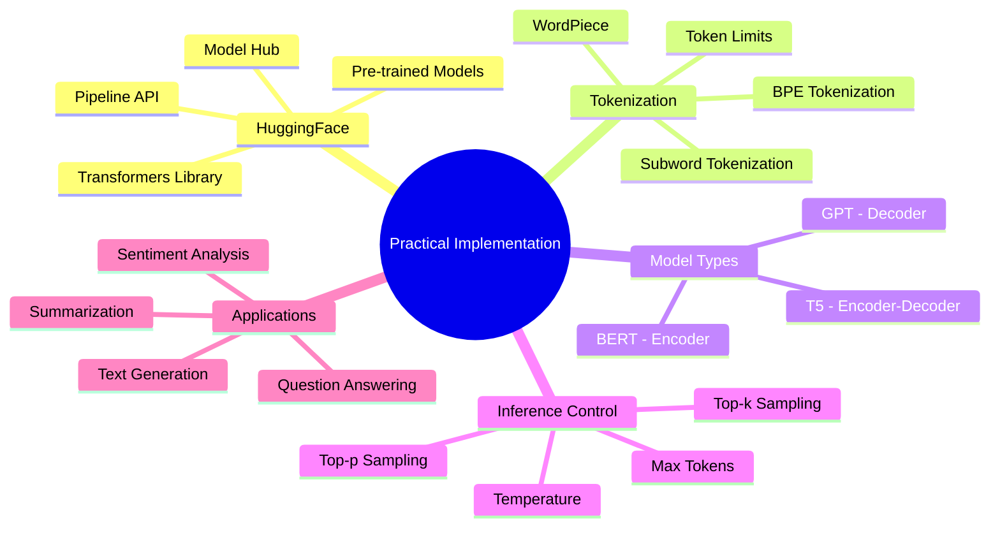
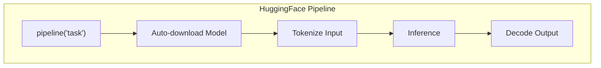
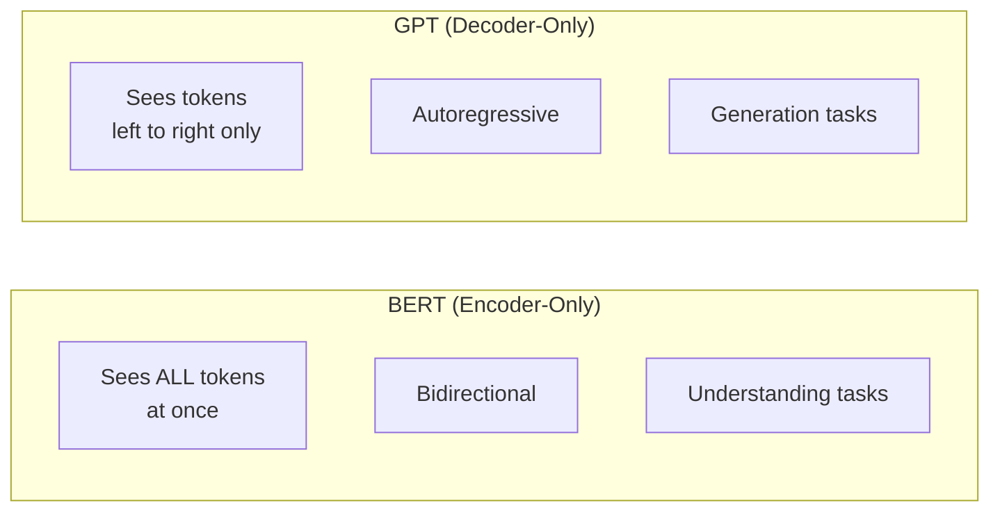
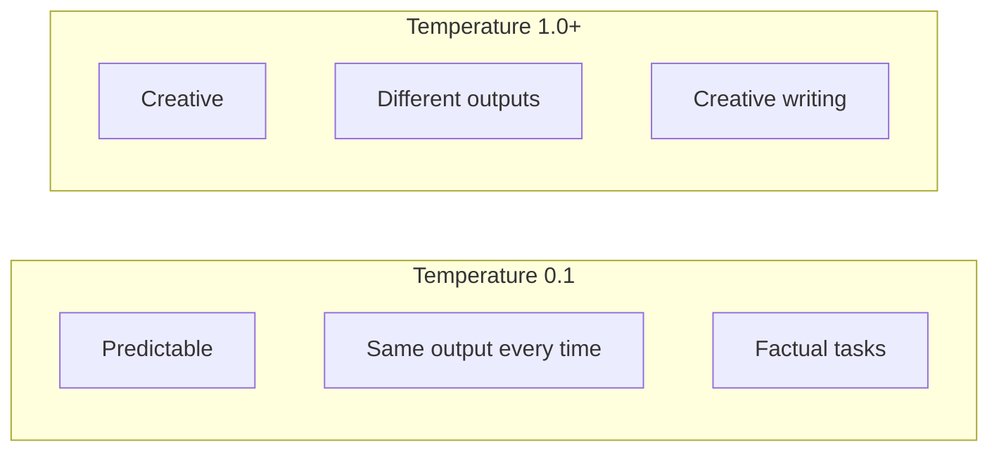

# AS42: Transformers & Prompt Engineering - Classroom Session (Part 3)

> 📚 **This is Part 3** covering: HuggingFace Transformers, Tokenization, BERT vs GPT, Temperature Control, Practical Applications
> 📘 **Previous:** [Part 1 - Transformer Architecture](./AS42_TransformersPromptEngineering1.md), [Part 2 - Prompt Engineering](./AS42_TransformersPromptEngineering2.md)

---

## 🗺️ Mind Map - Topics Covered in Part 3



---

## 🎓 Classroom Conversation Continued

### Topic 15: HuggingFace Transformers Library

**Teacher:** Students, practical implementation ke liye HuggingFace MOST IMPORTANT library hai!

**Beginner Student:** Sir, HuggingFace kya hai? Strange name hai!

**Teacher:** Ha ha! HuggingFace is a company + library + ecosystem:
- **Library**: Easy Python code for transformers
- **Model Hub**: 500,000+ pre-trained models
- **Datasets**: Ready-to-use datasets
- **Spaces**: Deploy ML apps online

```python
# Installation
# pip install transformers torch

from transformers import pipeline

# One line for sentiment analysis!
classifier = pipeline("sentiment-analysis")
result = classifier("I love learning transformers!")
print(result)
# [{'label': 'POSITIVE', 'score': 0.9998}]
```

> 💡 **Jargon Alert - HuggingFace**
> Simple Explanation: "App Store for AI models" - download any pre-trained model with one line of code!
> Example: BERT, GPT-2, T5, LLaMA - all available for free download!

**Practical Student:** Sir, pipeline API ke saare tasks kya hain?

**Teacher:** Main tasks supported by pipeline:

```python
# Available Pipeline Tasks
tasks = {
    "sentiment-analysis": "Positive/Negative classification",
    "text-generation": "Generate text continuation",
    "question-answering": "Answer from context",
    "summarization": "Summarize long text",
    "translation_en_to_fr": "Translate between languages",
    "fill-mask": "Fill [MASK] tokens (BERT)",
    "ner": "Named Entity Recognition",
    "zero-shot-classification": "Classify without training",
    "text-classification": "Custom categories",
}
```



---

### Topic 16: Tokenization Deep Dive

**Teacher:** Tokenization is CRITICAL! Model text nahi samajhta - numbers chahiye!

**Clever Student:** Sir, simple split use karein toh?

**Teacher:** Simple split fails in many cases:

```python
# Simple split problems
text = "I'm learning NLP. It's amazing!"
tokens = text.split(" ")
# ["I'm", "learning", "NLP.", "It's", "amazing!"]

# Problems:
# - "I'm" should be "I" + "'" + "m"
# - "NLP." has punctuation attached
# - Unknown words: "supercalifragilisticexpialidocious"
```

**Subword Tokenization** solves this:

```python
from transformers import AutoTokenizer

tokenizer = AutoTokenizer.from_pretrained("bert-base-uncased")

text = "transformers are amazing!"
tokens = tokenizer.tokenize(text)
print(tokens)
# ['transform', '##ers', 'are', 'amazing', '!']

# Note: "transformers" split into "transform" + "##ers"
# "##" means continuation of previous word
```

**Types of Subword Tokenizers**:

| Algorithm | Used By | Approach |
|-----------|---------|----------|
| **BPE** | GPT-2, GPT-3, GPT-4 | Merge frequent character pairs |
| **WordPiece** | BERT | Score-based merging |
| **SentencePiece** | T5, LLaMA | Language-independent |
| **Unigram** | T5 variant | Probabilistic selection |

> 💡 **Jargon Alert - Subword Tokenization**
> Simple Explanation: Break words into smaller pieces that model knows. "unhappiness" → "un" + "happi" + "ness"
> Example: Handle unknown words by breaking into known pieces!

**Beginner Student:** Sir, token ID kya hai?

**Teacher:** Each token gets a unique number:

```python
tokenizer = AutoTokenizer.from_pretrained("bert-base-uncased")

text = "Hello world"
# Step 1: Tokenize
tokens = tokenizer.tokenize(text)
# ['hello', 'world']

# Step 2: Convert to IDs
token_ids = tokenizer.encode(text)
# [101, 7592, 2088, 102]
# Note: 101 = [CLS], 102 = [SEP] (special tokens)

# Step 3: Decode back
decoded = tokenizer.decode(token_ids)
# "[CLS] hello world [SEP]"
```

**Special Tokens**:

| Token | ID (BERT) | Purpose |
|-------|-----------|---------|
| [CLS] | 101 | Classification token (start) |
| [SEP] | 102 | Separator (end or between sentences) |
| [PAD] | 0 | Padding for equal length |
| [MASK] | 103 | Token to predict (training) |
| [UNK] | 100 | Unknown token |

---

### Topic 17: BERT vs GPT - When to Use What

**Teacher:** Most important distinction - BERT and GPT are DIFFERENT architectures for DIFFERENT tasks!

**Debate Student:** Sir, dono transformer hi hai na? Fir difference kya?

**Teacher:** Architecture difference:



| Feature | BERT | GPT |
|---------|------|-----|
| Architecture | Encoder-only | Decoder-only |
| Direction | Bidirectional (sees past + future) | Left-to-right (past only) |
| Training | Masked Language Modeling | Next Token Prediction |
| Best For | Classification, NER, Q&A (extractive) | Generation, Chat, Completion |
| Example Models | BERT, RoBERTa, ALBERT, DistilBERT | GPT-2, GPT-3, GPT-4, LLaMA |

**BERT Example - Understanding**:
```python
from transformers import pipeline

# BERT for classification
classifier = pipeline("sentiment-analysis", model="bert-base-uncased")
result = classifier("I love this product!")
# {'label': 'POSITIVE', 'score': 0.99}

# BERT for Q&A (extractive)
qa = pipeline("question-answering", model="bert-large-uncased-whole-word-masking-finetuned-squad")
result = qa(
    question="What is the capital of France?",
    context="Paris is the capital city of France."
)
# {'answer': 'Paris', 'score': 0.98}
```

**GPT Example - Generation**:
```python
from transformers import pipeline

# GPT for text generation
generator = pipeline("text-generation", model="gpt2")
result = generator("Once upon a time", max_length=50)
# "Once upon a time, there was a young girl who lived in a small village..."
```

> 💡 **Jargon Alert - Autoregressive**
> Simple Explanation: Generate one token at a time, using previous tokens to predict next. Like writing word by word!
> Example: "The cat" → predict "sat" → "The cat sat" → predict "on" → ...

**Practical Student:** Sir, interview mein BERT vs GPT compare karein toh?

**Teacher:** Safe answer template:

> "Use BERT when you need to UNDERSTAND text - classification, sentiment, NER, extractive Q&A. Use GPT when you need to GENERATE text - chatbots, completion, creative writing, code generation."

---

### Topic 18: Temperature and Sampling

**Teacher:** When generating text, TEMPERATURE controls creativity!

**Curious Student:** Sir, temperature exactly kya karta hai?

**Teacher:** Temperature affects probability distribution:

```python
# Temperature = 0.1 (Low) - Very focused, predictable
# "The capital of France is" → "Paris" (always)

# Temperature = 1.0 (Medium) - Balanced
# "The capital of France is" → "Paris" (usually), "the city of lights" (sometimes)

# Temperature = 2.0 (High) - Very creative, random
# "The capital of France is" → "dancing cats" (sometimes!) 
```



**Sampling Methods**:

| Method | Description | When to Use |
|--------|-------------|-------------|
| **Temperature** | Scale logits before softmax | General creativity control |
| **Top-k** | Keep only top k tokens | Limit choices |
| **Top-p (nucleus)** | Keep tokens summing to p probability | Dynamic choices |
| **Greedy** | Always pick highest probability | Deterministic output |

```python
from transformers import pipeline

generator = pipeline("text-generation", model="gpt2")

# Different temperature
result_low = generator(
    "The future of AI is",
    temperature=0.2,  # Low - predictable
    max_length=50
)

result_high = generator(
    "The future of AI is", 
    temperature=1.5,  # High - creative
    max_length=50
)
```

---

### Topic 19: Token Limits and Context Windows

**Teacher:** Every model has MAXIMUM TOKENS it can process!

**Beginner Student:** Sir, token limit exceed ho jaye toh kya hoga?

**Teacher:** Model will either:
1. TRUNCATE (cut off) your input
2. Throw ERROR

**Token Limits of Popular Models**:

| Model | Max Tokens | Approx Pages |
|-------|------------|--------------|
| GPT-2 | 1,024 | ~2 pages |
| BERT | 512 | ~1 page |
| GPT-3.5 | 4,096 | ~8 pages |
| GPT-4 | 8,192 / 32K / 128K | ~16-250 pages |
| Claude | 100K / 200K | ~200-400 pages |
| Gemini 1.5 | 1M - 2M | ~2000+ pages |

**Token Counting**:
```python
from transformers import AutoTokenizer

tokenizer = AutoTokenizer.from_pretrained("gpt2")

text = "This is a sample text to count tokens."
tokens = tokenizer.encode(text)
print(f"Number of tokens: {len(tokens)}")  # 9

# Rule of thumb:
# 1 token ≈ 4 characters
# 1 token ≈ 0.75 words
# 100 words ≈ 130 tokens
```

**Handling Long Documents**:
1. **Truncation**: Cut to fit (loses info)
2. **Chunking**: Split into pieces, process separately
3. **Summarize first**: Compress, then process
4. **Use longer context model**: Switch to GPT-4 128K

---

### Topic 20: Complete Practical Examples

**Teacher:** Ab complete practical examples dekhte hain!

#### Example 1: Sentiment Analysis Pipeline

```python
from transformers import pipeline

# Initialize
sentiment = pipeline("sentiment-analysis")

# Single text
result = sentiment("I love this movie!")
print(result)  # [{'label': 'POSITIVE', 'score': 0.9998}]

# Multiple texts
texts = [
    "This is amazing!",
    "I hate waiting in line.",
    "The weather is okay today."
]
results = sentiment(texts)
for text, result in zip(texts, results):
    print(f"{text} → {result['label']} ({result['score']:.2f})")
```

#### Example 2: Text Generation with Control

```python
from transformers import pipeline, set_seed

set_seed(42)  # Reproducibility

generator = pipeline("text-generation", model="gpt2")

prompt = "In 2025, artificial intelligence will"

# Generate with different settings
result = generator(
    prompt,
    max_length=100,
    num_return_sequences=3,
    temperature=0.7,
    top_k=50,
    top_p=0.95,
    do_sample=True
)

for i, seq in enumerate(result):
    print(f"=== Sequence {i+1} ===")
    print(seq['generated_text'])
```

#### Example 3: Question Answering

```python
from transformers import pipeline

qa = pipeline("question-answering")

context = """
Transformers were introduced in 2017 by Google researchers.
The key innovation was the self-attention mechanism,
which allows the model to process all tokens in parallel.
"""

questions = [
    "When were transformers introduced?",
    "Who created transformers?",
    "What is the key innovation?"
]

for q in questions:
    result = qa(question=q, context=context)
    print(f"Q: {q}")
    print(f"A: {result['answer']} (score: {result['score']:.2f})")
    print()
```

#### Example 4: Custom Prompt with System Message (OpenAI API style)

```python
# Using OpenAI API (for reference)
from openai import OpenAI

client = OpenAI()

response = client.chat.completions.create(
    model="gpt-4",
    messages=[
        {
            "role": "system",
            "content": "You are a helpful Python tutor. Explain concepts clearly with examples."
        },
        {
            "role": "user",
            "content": "What is a list comprehension?"
        }
    ],
    temperature=0.7,
    max_tokens=500
)

print(response.choices[0].message.content)
```

---

## 📝 Teacher Summary - Part 3

**Teacher:** Students, Part 3 summarize karte hain:

### Key Takeaways

| Concept | One-Line Definition | Example |
|---------|---------------------|---------|
| HuggingFace | Library + Model Hub for transformers | `pipeline("sentiment-analysis")` |
| Subword Tokenization | Break words into smaller pieces | "transformers" → ["transform", "##ers"] |
| BERT | Encoder, bidirectional, understanding | Classification, NER, Q&A |
| GPT | Decoder, autoregressive, generation | Chat, completion, coding |
| Temperature | Controls creativity (0=focused, 1+=creative) | Low for facts, high for creativity |
| Token Limit | Max tokens model can process | GPT-4: 128K, Gemini: 2M |

### Common Mistakes

1. **Using GPT for classification** → Use BERT/encoder models
2. **Using BERT for generation** → Use GPT/decoder models  
3. **Ignoring token limits** → Count tokens before sending
4. **Wrong temperature** → Low for facts, high for creative

### Interview Quick Points

- HuggingFace = Download pre-trained models instantly
- Subword = Handle unknown words by splitting
- BERT = Understanding, bidirectional
- GPT = Generation, left-to-right
- Temperature = Creativity dial (0-2)
- Token limit = Model's "memory capacity"

### Complete Code Template

```python
from transformers import pipeline, AutoTokenizer

# 1. Choose task and model
classifier = pipeline("sentiment-analysis")
generator = pipeline("text-generation", model="gpt2")
qa = pipeline("question-answering")

# 2. Count tokens (important!)
tokenizer = AutoTokenizer.from_pretrained("gpt2")
tokens = tokenizer.encode("Your text here")
print(f"Tokens: {len(tokens)}")

# 3. Run inference
result = classifier("I love AI!")
print(result)
```

---

> 📘 **Complete Session.** See [Exam Preparation](./AS42_TransformersPromptEngineering_exam_preparation.md) for questions.
