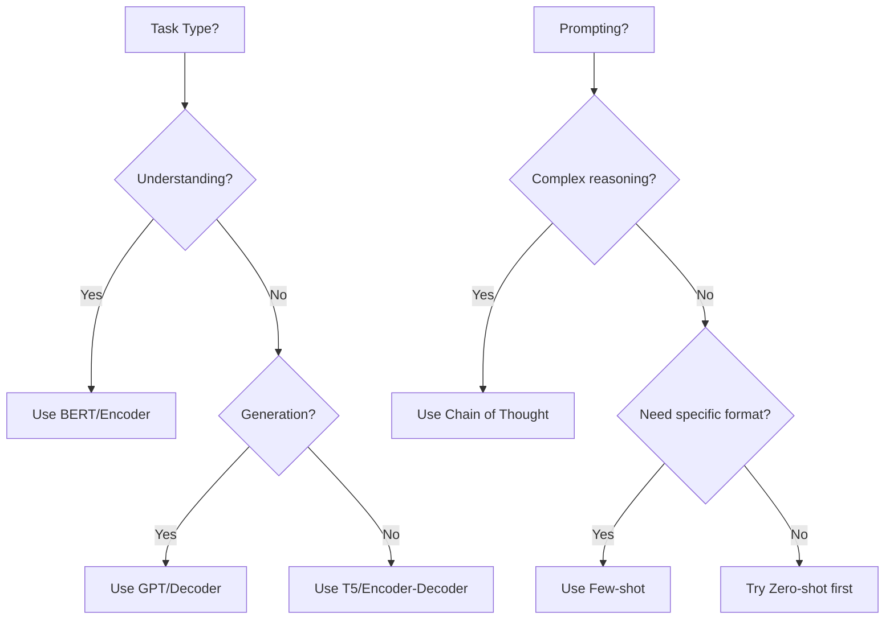

# AS42: Transformers & Prompt Engineering - Exam Preparation

> 📚 **Complete Exam Prep** for: Transformer Architecture, Self-Attention, QKV, Prompt Engineering, Zero/Few-shot, Chain of Thought, HuggingFace, Tokenization, BERT vs GPT

---

## Section A: Multiple Choice Questions (MCQ) - 15 Questions

### MCQ 1
**Question:** What does the "Q" in QKV stand for in Transformer attention?

**Options:**
- A) Quantized
- B) Query
- C) Queue
- D) Quotient

**✅ Correct Answer:** B

**📖 Explanation:** Q stands for Query - it represents what the current token is "looking for" in other tokens.

**❌ Why Others Are Wrong:**
- A) Quantization is a separate compression technique
- C) Queue is a data structure, not related
- D) Quotient is a math term

---

### MCQ 2
**Question:** Chain of Thought prompting is most useful for:

**Options:**
- A) Simple translation tasks
- B) Mathematical and logical reasoning problems
- C) Sentiment analysis
- D) Named Entity Recognition

**✅ Correct Answer:** B

**📖 Explanation:** CoT ("Think step by step") helps with multi-step reasoning, especially math and logic problems.

---

### MCQ 3
**Question:** Why is attention scaled by √d_k?

**Options:**
- A) To speed up computation
- B) To prevent softmax saturation with large values
- C) To reduce memory usage
- D) To add non-linearity

**✅ Correct Answer:** B

**📖 Explanation:** Large dot products cause softmax to output extreme values (0 or 1), causing vanishing gradients.

---

### MCQ 4
**Question:** Which model is best for text GENERATION tasks?

**Options:**
- A) BERT
- B) RoBERTa
- C) GPT
- D) ALBERT

**✅ Correct Answer:** C

**📖 Explanation:** GPT (decoder-only) is designed for autoregressive generation. BERT/RoBERTa/ALBERT are encoders for understanding.

---

### MCQ 5
**Question:** Zero-shot prompting means:

**Options:**
- A) Model requires no training
- B) No examples are provided in the prompt
- C) Temperature is set to zero
- D) Model produces no output

**✅ Correct Answer:** B

**📖 Explanation:** Zero-shot means relying purely on pre-training knowledge without showing examples in the prompt.

---

### MCQ 6
**Question:** In HuggingFace, which function provides easy access to pre-trained models?

**Options:**
- A) load_model()
- B) get_transformer()
- C) pipeline()
- D) create_model()

**✅ Correct Answer:** C

**📖 Explanation:** `pipeline("task_name")` automatically downloads and sets up pre-trained models for inference.

---

### MCQ 7
**Question:** Subword tokenization (BPE) is used because:

**Options:**
- A) It's faster than word tokenization
- B) It handles unknown words by breaking them into known subwords
- C) It reduces model size
- D) It improves accuracy on all tasks

**✅ Correct Answer:** B

**📖 Explanation:** BPE breaks unknown words into smaller known pieces, handling vocabulary limitations.

---

### MCQ 8
**Question:** BERT uses which training objective?

**Options:**
- A) Next Token Prediction
- B) Masked Language Modeling
- C) Sequence Classification
- D) Image-Text Matching

**✅ Correct Answer:** B

**📖 Explanation:** BERT predicts [MASK]ed tokens, forcing it to understand bidirectional context.

---

### MCQ 9
**Question:** Higher temperature in text generation causes:

**Options:**
- A) Faster generation
- B) More random/creative outputs
- C) Shorter outputs
- D) More accurate outputs

**✅ Correct Answer:** B

**📖 Explanation:** Higher temperature flattens probability distribution, making unlikely tokens more probable.

---

### MCQ 10
**Question:** Multi-head attention uses multiple heads because:

**Options:**
- A) It's faster than single head
- B) Different heads learn different types of relationships
- C) It uses less memory
- D) It reduces overfitting

**✅ Correct Answer:** B

**📖 Explanation:** Each head can focus on different aspects (syntax, semantics, positions).

---

### MCQ 11
**Question:** System prompt in LLM APIs is used for:

**Options:**
- A) User authentication
- B) Defining model's behavior and personality
- C) Setting maximum tokens
- D) Choosing model version

**✅ Correct Answer:** B

**📖 Explanation:** System prompt sets rules like "be helpful", "respond in JSON", "act as expert".

---

### MCQ 12
**Question:** Which is true about positional encoding?

**Options:**
- A) Only used in RNNs
- B) Tells model about token positions since transformers process in parallel
- C) Reduces model parameters
- D) Only needed during training

**✅ Correct Answer:** B

**📖 Explanation:** Unlike RNNs, transformers process all tokens at once, losing position info without encoding.

---

### MCQ 13
**Question:** Few-shot prompting typically uses:

**Options:**
- A) 0 examples
- B) 1-5 examples
- C) 100+ examples
- D) The entire training dataset

**✅ Correct Answer:** B

**📖 Explanation:** "Few-shot" means a small number (1-5) of examples to demonstrate the pattern.

---

### MCQ 14
**Question:** The [CLS] token in BERT is used for:

**Options:**
- A) Marking unknown words
- B) Separating sentences
- C) Aggregating sequence-level representation for classification
- D) Padding sequences

**✅ Correct Answer:** C

**📖 Explanation:** [CLS] token's embedding captures entire sequence meaning for classification tasks.

---

### MCQ 15
**Question:** Token limit in GPT-4 128K means:

**Options:**
- A) 128 kilobytes of text
- B) 128,000 maximum tokens can be processed
- C) 128,000 words maximum
- D) Model has 128K parameters

**✅ Correct Answer:** B

**📖 Explanation:** Context window of 128K tokens ≈ 96,000 words ≈ 250 pages.

---

## Section B: Multiple Select Questions (MSQ) - 12 Questions

### MSQ 1
**Question:** Select ALL valid prompting techniques:

**Options:**
- A) Zero-shot
- B) Few-shot
- C) Chain of Thought
- D) Temperature scaling
- E) System prompting

**✅ Correct Answers:** A, B, C, E

**📖 Explanation:** Temperature is inference parameter, not a prompting technique.

---

### MSQ 2
**Question:** Components of Transformer architecture: (Select ALL)

**Options:**
- A) Multi-head attention
- B) Feed forward network
- C) Positional encoding
- D) Convolutional layers
- E) Layer normalization

**✅ Correct Answers:** A, B, C, E

**📖 Explanation:** Transformers don't use convolutional layers - that's CNNs.

---

### MSQ 3
**Question:** BERT is suitable for: (Select ALL)

**Options:**
- A) Sentiment analysis
- B) Named Entity Recognition
- C) Text generation/chatbots
- D) Question answering (extractive)
- E) Text classification

**✅ Correct Answers:** A, B, D, E

**📖 Explanation:** BERT is encoder-only, not for generation (C). Use GPT for generation.

---

### MSQ 4
**Question:** HuggingFace pipeline supports: (Select ALL)

**Options:**
- A) sentiment-analysis
- B) text-generation
- C) question-answering
- D) summarization
- E) image-generation

**✅ Correct Answers:** A, B, C, D

**📖 Explanation:** Image generation requires different models (Stable Diffusion, DALL-E), not standard pipelines.

---

### MSQ 5
**Question:** Chain of Thought prompting helps with: (Select ALL)

**Options:**
- A) Mathematical problems
- B) Logic puzzles
- C) Multi-step reasoning
- D) Simple factual questions
- E) Complex decision making

**✅ Correct Answers:** A, B, C, E

**📖 Explanation:** Simple factual questions don't need step-by-step reasoning.

---

### MSQ 6
**Question:** Subword tokenization methods include: (Select ALL)

**Options:**
- A) BPE (Byte Pair Encoding)
- B) WordPiece
- C) SentencePiece
- D) Whitespace split
- E) Unigram

**✅ Correct Answers:** A, B, C, E

**📖 Explanation:** Whitespace split is word-level, not subword tokenization.

---

### MSQ 7
**Question:** QKV in attention mechanism: (Select ALL true statements)

**Options:**
- A) Q stands for Query
- B) K stands for Key
- C) V stands for Value
- D) All have same dimensions
- E) Computed from input embeddings

**✅ Correct Answers:** A, B, C, E

**📖 Explanation:** Q, K, V can have different dimensions (d_k, d_k, d_v).

---

### MSQ 8
**Question:** Low temperature (0.1-0.3) is best for: (Select ALL)

**Options:**
- A) Factual questions
- B) Code generation
- C) Creative writing
- D) Data extraction
- E) Brainstorming

**✅ Correct Answers:** A, B, D

**📖 Explanation:** Creative tasks (C, E) need higher temperature for varied outputs.

---

### MSQ 9
**Question:** Special tokens in BERT include: (Select ALL)

**Options:**
- A) [CLS]
- B) [SEP]
- C) [MASK]
- D) [PAD]
- E) <bos>

**✅ Correct Answers:** A, B, C, D

**📖 Explanation:** <bos> is used by GPT-style models, not BERT.

---

### MSQ 10
**Question:** Self-attention in Transformers: (Select ALL true)

**Options:**
- A) Each token attends to all other tokens
- B) Generates attention scores
- C) Replaces RNN sequential processing
- D) Requires less computation than RNN
- E) Enables parallel processing

**✅ Correct Answers:** A, B, C, E

**📖 Explanation:** Self-attention can be more expensive than RNN for very long sequences (D is often false).

---

### MSQ 11
**Question:** Good prompt engineering practices: (Select ALL)

**Options:**
- A) Be specific about output format
- B) Give examples when needed
- C) Use vague instructions for flexibility
- D) Specify constraints and length
- E) Define the model's role

**✅ Correct Answers:** A, B, D, E

**📖 Explanation:** Vague instructions (C) lead to poor outputs - be specific.

---

### MSQ 12
**Question:** Token limit handling strategies: (Select ALL)

**Options:**
- A) Truncation
- B) Chunking
- C) Increasing model parameters
- D) Summarization first
- E) Using longer context model

**✅ Correct Answers:** A, B, D, E

**📖 Explanation:** Increasing parameters doesn't change context window.

---

## Section C: Numerical Questions - 6 Questions

### Numerical 1
**Question:** If a transformer has 8 heads and d_model = 512, what is d_k (dimension per head)?

**Solution:**
- d_k = d_model / num_heads
- d_k = 512 / 8 = **64**

---

### Numerical 2
**Question:** Calculate the attention score for Q = [1, 2], K = [2, 1] with d_k = 2.

**Solution:**
- QK^T = (1×2) + (2×1) = 4
- Scaled: 4 / √2 = 4 / 1.414 = **2.83**

---

### Numerical 3
**Question:** A text has 500 words. Approximately how many tokens will it have?

**Solution:**
- Rule: 100 words ≈ 130 tokens
- 500 words ≈ 500 × 1.3 = **~650 tokens**

---

### Numerical 4
**Question:** BERT-base has 12 layers and 12 heads. How many total attention heads?

**Solution:**
- Total heads = 12 × 12 = **144 attention heads**

---

### Numerical 5
**Question:** If vocabulary size is 30,000 and embedding dimension is 768, what's embedding matrix size?

**Solution:**
- Size = vocab × dim = 30,000 × 768 = **23,040,000 parameters** (23M)

---

### Numerical 6
**Question:** Few-shot prompt has 3 examples of 50 tokens each, main query of 100 tokens. Total tokens?

**Solution:**
- Examples: 3 × 50 = 150 tokens
- Query: 100 tokens
- Total = 150 + 100 = **250 tokens**

---

## Section D: Fill in the Blanks - 8 Questions

1. The Transformer paper is titled "_________ is All You Need".
   - **Answer:** Attention

2. _________ prompting means giving examples in the prompt for the model to follow.
   - **Answer:** Few-shot

3. GPT stands for Generative _________ Transformer.
   - **Answer:** Pre-trained

4. BERT stands for _________ Encoder Representations from Transformers.
   - **Answer:** Bidirectional

5. In attention formula, we divide by _________ to prevent gradient issues.
   - **Answer:** √d_k (square root of d_k)

6. _________ prompt defines the AI's behavior and personality in API calls.
   - **Answer:** System

7. BPE stands for _________ Pair Encoding.
   - **Answer:** Byte

8. "Think step by step" is the key phrase for _________ prompting.
   - **Answer:** Chain of Thought (CoT)

---

## 📚 Quick Revision Points

### Transformer Formula
$$\text{Attention}(Q,K,V) = \text{softmax}\left(\frac{QK^T}{\sqrt{d_k}}\right) \times V$$

### BERT vs GPT Quick Reference
| Feature | BERT | GPT |
|---------|------|-----|
| Type | Encoder | Decoder |
| Direction | Bidirectional | Left-to-right |
| Best For | Understanding | Generation |
| Training | MLM | Next token |

### Prompting Hierarchy
```
Zero-shot → Few-shot → Chain of Thought
   ↓           ↓            ↓
No examples   2-5 examples   Step-by-step
```

---

## 🚀 Section E: Shortcuts & Cheat Codes

### ⚡ One-Liner Shortcuts

| Concept | Shortcut | When to Use |
|---------|----------|-------------|
| Attention formula | QK^T / √d_k | Any attention question |
| Token estimate | 1 token ≈ 0.75 words | Token counting |
| Head dimension | d_k = d_model / num_heads | Multi-head questions |
| Temperature | Low=focused, High=creative | Generation control |

### 🎯 Memory Tricks

1. **QKV**: "Query Knows Value" - Q asks, K matches, V answers
2. **BERT vs GPT**: "BERT reads Both sides, GPT Goes one way"
3. **CoT**: "Chain of Thoughts = Show your work"
4. **Scaling √d_k**: "Square root Stops explosions"

### 🔢 Quick Calculation Hacks

| Scenario | Hack | Example |
|----------|------|---------|
| Words to tokens | × 1.3 | 100 words = 130 tokens |
| Tokens to words | × 0.75 | 100 tokens = 75 words |
| Characters to tokens | ÷ 4 | 400 chars = 100 tokens |

### 📝 Last-Minute Formula Sheet
```
📌 Attention = softmax(QK^T / √d_k) × V
📌 d_k = d_model / num_heads
📌 1 token ≈ 4 characters ≈ 0.75 words
📌 Few-shot = 1-5 examples in prompt
📌 Low temp (0.1) = deterministic, High temp (1+) = creative
```

### 🎓 Interview One-Liners

| Question | Answer Template |
|----------|-----------------|
| What is attention? | "Mechanism that calculates importance weights for all tokens" |
| BERT vs GPT? | "BERT=understanding (bidirectional), GPT=generation (autoregressive)" |
| Zero vs Few-shot? | "Zero=no examples, Few=2-5 examples in prompt" |
| What is CoT? | "'Think step by step' for complex reasoning" |

### ⚠️ Golden Rules

1. **BERT for understanding, GPT for generation**
2. **Always scale attention by √d_k**
3. **Low temperature for facts, high for creativity**
4. **Count tokens before making API calls**

### 🔄 Quick Decision Flowchart



---

**📚 End of Exam Preparation. Good luck!** 🎓
