# AS43: Responsible AI - Fairness & Bias - Classroom Session (Part 1)

> 📚 **This is Part 1** covering: Introduction to Responsible AI, Bias Definition, Data-Related Biases, Algorithmic & Model Biases
> 📘 **See also:** [Part 2](./AS43_ResponsibleAIFairnessBias2.md), [Part 3](./AS43_ResponsibleAIFairnessBias3.md)

---

## 🗺️ Mind Map - Topics to Cover


---

## 🎓 Classroom Conversation

### Topic 1: Introduction to Responsible AI

**Teacher:** Namskar students! Ippudu mana AI/ML journey lo chala important oka topic chuddam - **Responsible AI**. Idi technical topic kaadu - idi philosophy, ethics, and correctness gurinchi. AI systems how fair ga behave cheyali ani discuss chestamu.

**Beginner Student:** Sir, Responsible AI ante exactly enti? Mana regular AI kanna emi different?

**Teacher:** Chala manchiga adigav! Chudandi - ippudu mana lives lo AI chala critical decisions lo involve avtundi:

- **Banking**: Loan approve cheyala vadda ani
- **Healthcare**: Treatment prescribe cheyali ani
- **Hiring**: Job ki qualify avutara leda ani
- **Criminal Justice**: Bail ivvala vadda ani

Oka real-life analogy cheptha - suppose mee school lo teacher marks estunnadu. Oka caste/gender base chesi higher marks istunnadu, kalisi class lo manchi marks vaccinadu. Idi **unfair** kada? Same ga AI kuda unfair ga behave cheyochu - adi identify chesi correct cheyali!

> 💡 **Jargon Alert - Responsible AI**
> Simple Explanation: AI systems that are fair, transparent, accountable, and don't discriminate against any group
> Example: Bank loan algorithm that treats rich and poor, men and women equally

**Clever Student:** Sir, but AI mathematical algorithm kada - adi oka specific logic follow chestundi. Bias ela vastundi technology lo?

**Teacher:** Excellent question! Idi chala important point - **AI is not inherently neutral**. Bias vachchedi three main sources nunchi:

1. **Human Decisions** - Who created the data
2. **Data Generating Process** - How data was collected
3. **Optimization Objectives** - What algorithm tries to minimize/maximize


**Critique Student:** Sir, idi theoretical ga chepparu, but practically AI bias valla real harm jarugutunda?

**Teacher:** Chala jarugutundi! Real examples cheptha:

| Company | What Happened | Impact |
|---------|--------------|--------|
| Apple Credit Card | Women ki lower credit limits | Discrimination |
| LinkedIn | Male candidates over females | Job inequality |
| US Healthcare | Black patients underestimated | Medical harm |
| Facebook Ads | Age discrimination in job ads | Employment issues |

Ivi official investigations lo prove ayyayi. Ippudu these companies had to change their algorithms!

**Practical Student:** Sir, interview lo "Why is fairness important in AI?" ani adugutharu - short answer enti?

**Teacher:** Interview one-liner:

> *"Fairness in AI is essential because AI increasingly impacts critical decisions like hiring, loans, and healthcare. Biased AI can perpetuate discrimination, erode trust, and cause real harm to marginalized groups. Responsible AI ensures equality and justice for all."*

---

### Topic 2: What is Bias in AI?

**Teacher:** Ippudu let's define what exactly bias means in AI context.

**Beginner Student:** Sir, bias ante enti exactly? Normal English lo "preference" ani meaning kada?

**Teacher:** Correct! But AI context lo bias has specific meaning:

> 💡 **Jargon Alert - Bias in AI**
> Simple Explanation: Systematic errors in AI that lead to unfair outcomes for certain groups
> Example: Model always rejecting loan applications from a particular community

**Key characteristics of AI bias:**

1. **Systematic** - Not accidental, happens consistently
2. **Emerges from multiple sources** - Data, algorithms, deployment
3. **Leads to discrimination** - Based on protected characteristics

```python
# Conceptual: How bias manifests
def biased_prediction(features, protected_attribute):
    """
    Bias happens when:
    - Model's prediction correlates with protected_attribute
    - When it should NOT correlate
    
    Protected attributes: Gender, Race, Age, Religion, Caste, etc.
    """
    # If gender affects loan decision (shouldn't!)
    if protected_attribute == "female":
        return "DENY"  # This is bias!
    else:
        return "APPROVE"
```

**Curious Student:** Sir, bias entire ML lifecycle lo happen avuthunda? Specific stage lo only kaadu?

**Teacher:** Great observation! Bias can enter at ANY stage - idini **"Pipeline Problem"** antaru:

```mermaid
flowchart TD
    subgraph Data_Stage ["📊 Data Stage"]
        A[Data Collection] --> B[Data Labeling]
        B --> C[Data Preprocessing]
    end
    
    subgraph Model_Stage ["🤖 Model Stage"]
        C --> D[Feature Selection]
        D --> E[Model Training]
        E --> F[Model Evaluation]
    end
    
    subgraph Deploy_Stage ["🚀 Deployment Stage"]
        F --> G[Deployment]
        G --> H[User Interaction]
        H --> I[Feedback Loop]
    end
    
    style A fill:#ffcccc
    style D fill:#ffcccc
    style G fill:#ffcccc
```



**Red boxes = Common bias entry points!**

**Debate Student:** Sir, but idi conceptually samajhlo - practically bias identify cheyyadam difficult kada?

**Teacher:** Yes, that's the challenge! Bias is often **invisible** - model accuracy high undochu, but specific group ki very bad performance undochu. Example:

| Metric | Overall | Group A (Majority) | Group B (Minority) |
|--------|---------|-------------------|-------------------|
| Accuracy | 95% | 98% | 70% |

Overall looks great, but Group B is suffering! This is why we need **fairness metrics** - later chepptha.

---

### Topic 3: Data-Related Biases (5 Types)

**Teacher:** Ippudu mana first major category - **Data-Related Biases**. Data lo bias unte, model definite ga biased avtundi. "Garbage In, Garbage Out" - but here it's "Bias In, Bias Out"!

#### 3.1 Historical Bias

**Beginner Student:** Sir, historical bias ante enti?

**Teacher:** Very important concept! Real-life analogy cheptha:

Imagine 50 years back, mostly men were doctors and women were nurses. If I collect this data, it shows:
- Doctor = Male (90%)
- Nurse = Female (90%)

Model learns: "Doctor should be male" - but idi wrong! Society was biased, data reflects that bias.

> 💡 **Jargon Alert - Historical Bias**
> Simple Explanation: Bias that exists in data because society itself was/is biased, even if data is accurately collected
> Example: Historical hiring data shows fewer women in tech roles due to past discrimination

**Real Examples:**
- **Hiring Data**: Fewer women promoted (historic glass ceiling)
- **Loan Approvals**: Marginalized communities denied credit historically
- **Criminal Records**: Over-policing in certain neighborhoods


**Idi circle la undhi - bias perpetuates itself!**

**Curious Student:** Sir, perfect data collection chesinappudu kuda historical bias untunda?

**Teacher:** Absolutely! That's the tricky part. Even **perfectly accurate data** can have historical bias because society was biased when that data was generated.

#### 3.2 Sampling Bias

**Teacher:** Next is **Sampling Bias** - ido chala common problem.

**Beginner Student:** Sampling bias ante?

**Teacher:** Simple analogy - mee classroom lo survey chestunnav:
- "What is favorite food?" ani question
- But only rich students ni adigavu
- Poor students skip chesavu

Result: "Everyone loves pizza!" - but reality lo poor students rice prefer cheyochu.

> 💡 **Jargon Alert - Sampling Bias**
> Simple Explanation: When some groups are overrepresented and others underrepresented in data
> Example: Face recognition dataset with mostly white faces performing poorly on darker skin tones

**Real Examples:**
| Domain | Overrepresented | Underrepresented |
|--------|----------------|-----------------|
| Face Recognition | Lighter skin tones | Darker skin tones |
| Medical Data | Urban hospitals | Rural hospitals |
| Speech Recognition | Standard accent | Regional accents |
| Internet Data | Urban population | Rural population |

**Why does sampling bias happen?**

1. **Cost**: Reaching underrepresented groups is expensive
2. **Accessibility**: Some groups hard to access
3. **Convenience**: Easy to sample from available sources

```python
# Conceptual: Sampling Bias Impact
total_samples = 1000
group_a_samples = 900  # Majority - overrepresented
group_b_samples = 100  # Minority - underrepresented

# Model learns Group A very well, Group B poorly
# Error rate for Group B will be much higher!
```

**Critique Student:** Sir, but industry lo actual datasets entha skewed untayi?

**Teacher:** Very skewed! Famous example - **Gender Shades** study showed:

| Skin Type | Error Rate |
|-----------|------------|
| Lighter-skinned males | 0.8% |
| Darker-skinned females | 34.7% |

**43x higher error rate!** Just because dataset had fewer darker-skinned female faces.

#### 3.3 Label Bias

**Teacher:** Next bias - **Label Bias**. Idi human annotators introduce chestaru.

**Beginner Student:** Sir, labeling lo bias ela vastundi?

**Teacher:** Excellent question! When humans label data, they bring their own:
- Cultural biases
- Subjective judgments
- Inconsistent standards

**Real analogy**: Two teachers grading same essay:
- Teacher A (strict): 70/100
- Teacher B (lenient): 90/100

Same essay, different grades! **Subjectivity** is the problem.

> 💡 **Jargon Alert - Label Bias**
> Simple Explanation: Bias introduced when humans label data inconsistently or based on stereotypes
> Example: One annotator labels a comment as "toxic" while another labels same comment as "joke"

**When Label Bias Occurs:**


**Examples:**
- **Toxicity Detection**: Same comment - "joke" in one culture, "offensive" in another
- **Image Classification**: Cultural context changes interpretation
- **Medical Diagnosis**: Different standards across hospitals

#### 3.4 Measurement Bias

**Practical Student:** Sir, measurement bias enti? Accurate ga measure cheste bias ela vastundi?

**Teacher:** Very practical question! Measurement bias happens when:

> **What you measure ≠ What you intended to measure**

**Real-life analogy**: 
- You want to measure: How much students learned
- What you actually measure: Exam marks
- Problem: Exam marks can be affected by stress, health, luck!

> 💡 **Jargon Alert - Measurement Bias**
> Simple Explanation: Mismatch between what we want to measure and what we actually measure
> Example: Using "arrest records" as proxy for "crime rate" - arrests depend on policing patterns, not just crime

**Classic Examples:**

| Intended Measurement | Actual Proxy Used | Problem |
|---------------------|-------------------|---------|
| Crime Rate | Arrest Records | Overpoliced areas show more arrests |
| Healthcare Need | Healthcare Spending | Poor people spend less (access issues) |
| Student Intelligence | Test Scores | Doesn't capture creativity, EQ |
| Employee Value | Years in Company | Not productivity |

**Clever Student:** Sir, idi Healthcare case study lo famous incident untundi kada?

**Teacher:** Exactly! Famous **Science paper (2019)** showed:

```mermaid
flowchart LR
    A[Healthcare Algorithm] --> B[Predicts "Need"]
    B --> C[Uses COST as proxy]
    C --> D[Black patients have lower costs]
    D --> E[Algorithm says they need less care]
    E --> F[WRONG - They actually needed MORE care]
    
    style F fill:#ff9999
```

**Why lower costs?**
- Access barriers
- Historical discrimination
- Insurance differences

Even though Black patients had same illness severity, algorithm rated them lower!

#### 3.5 Missing Data Bias

**Teacher:** Last data bias - **Missing Data Bias**.

**Beginner Student:** Sir, missing data bias ante data missing ayite bias aa?

**Teacher:** Partially correct! Issue is:
- **If data is missing RANDOMLY** → OK, can handle
- **If data is missing SYSTEMATICALLY for one group** → BIAS!

> 💡 **Jargon Alert - Missing Data Bias**
> Simple Explanation: When data is not randomly missing but systematically missing for certain groups
> Example: Medical tests done less frequently on women, so women's data is missing more often

**Real Examples:**
- Medical tests less conducted on women
- Internet data missing for rural areas
- Surveys skipping hard-to-reach populations

**What happens with missing data:**


**Curious Student:** Sir, missing data handle cheyyadaniki imputation chestamu kada? Adi help chestunda bias lo?

**Teacher:** Good question! Imputation can help if missing is random. But if missing is systematic:

| If You Do | Effect |
|-----------|--------|
| Delete missing rows | Even fewer Group B samples! More bias |
| Impute with mean | May distort Group B characteristics |

Neither is a perfect solution - you need to **understand WHY data is missing first**.

---

### Topic 4: Algorithmic and Model Biases

**Teacher:** Ippudu mana second major category - bias that comes from **algorithms and models** themselves, not just data.

#### 4.1 Objective Function Bias

**Clever Student:** Sir, objective function lo bias ela vastundi? Mathematical optimization kada?

**Teacher:** Excellent question! Remember our typical ML objective:

$$\text{Minimize } L = \sum_{i=1}^{n} \text{Loss}(y_i, \hat{y}_i)$$

**Problem**: This minimizes OVERALL loss, but doesn't care about:
- Loss for Minority Group vs Majority Group
- Equal error rates across groups

**Simple analogy**: 
- Class of 100 students
- 90 are from City, 10 from Village
- Teacher wants to minimize total failed students
- If all 10 Village students fail BUT all 90 City students pass
- Total fail = 10% → "Great result!"
- But 100% of Village students failed! **Unfair!**

> 💡 **Jargon Alert - Objective Function Bias**
> Simple Explanation: Standard ML objectives treat all errors equally, but some errors may be more costly for certain groups
> Example: A model that treats $50 loss same for rich and poor person, but $50 matters more to poor person

```python
# Standard Objective - Neutral but potentially unfair
def standard_loss(y_true, y_pred):
    return sum((y_true - y_pred) ** 2) / len(y_true)
    # Doesn't check if loss is equal across groups!
    
# Fairness-aware Objective
def fair_loss(y_true, y_pred, groups):
    # Check loss per group
    for group in unique(groups):
        group_loss = calculate_loss(group)
        # Penalize if group losses are very different!
```

#### 4.2 Loss Aggregation Bias

**Teacher:** Related concept - **Loss Aggregation Bias**.

**Debate Student:** Sir, idi Objective Function Bias kanna different aa?

**Teacher:** Slightly different focus:

- **Objective Bias**: We don't DESIGN for fairness
- **Loss Aggregation Bias**: Minority groups contribute LESS to total loss

**Why?** Because minority has fewer samples:

| Group | Samples | Error | Contribution to Total Loss |
|-------|---------|-------|---------------------------|
| Majority (A) | 900 | 10% = 90 errors | 90 / 100 = 90% |
| Minority (B) | 100 | 10% = 10 errors | 10 / 100 = 10% |

Even with SAME error rate, minority's errors contribute less → Model ignores them!

**Real Example:**
> Speech recognition works great for standard American English, poorly for accented speech. Why? Accented samples are minority in training data.

#### 4.3 Feature Selection Bias

**Practical Student:** Sir, feature selection lo bias ela introduce avtundi?

**Teacher:** We select features based on **predictive power**, not **fairness impact**.

**Example**: In hiring prediction:
- Feature: "Employment Gap"
- High predictive power: Yes
- Problem: Women often have gaps (maternity leave, caregiving)
- Result: Algorithm penalizes women

> 💡 **Jargon Alert - Feature Selection Bias**
> Simple Explanation: Choosing features only for predictive power, ignoring their discriminatory impact
> Example: Using "zip code" as feature can be proxy for race/income

**Proxy features** are dangerous:
- Zip Code → Race/Income proxy
- Name → Gender/Ethnicity proxy
- College name → Socioeconomic proxy


#### 4.4 Model Architecture Bias

**Curious Student:** Sir, model architecture tho bias ela relate avtundi?

**Teacher:** Model assumptions may not fit all groups equally!

**Examples:**
| Model Type | Bias Issue |
|------------|------------|
| Vision Models | Trained on Western lighting, skin tones |
| NLP Models | Trained primarily on English |
| Speech Models | Trained on specific accents |

**Real Example**: Facial recognition models:
- Trained mostly on Western faces
- High error on Asian faces (different features)
- Not the algorithm's fault - training data assumption!

---

## 📝 Teacher Summary

**Teacher:** Okay students, ippudu idi Part 1 summary chepptha. Mana next class lo fairness metrics and mitigation strategies chustamu.

### Key Takeaways

1. **Responsible AI** = Fair, transparent, non-discriminatory AI systems
2. **Bias** = Systematic errors leading to unfair outcomes
3. **Data Biases** (5 types):
   - Historical (society bias reflected in data)
   - Sampling (unequal representation)
   - Label (human annotator inconsistency)
   - Measurement (wrong proxy for target)
   - Missing Data (systematic gaps)
4. **Algorithmic Biases** (4 types):
   - Objective Function (overall loss focus)
   - Loss Aggregation (minority contribution less)
   - Feature Selection (predictive over fair)
   - Model Architecture (assumptions mismatch)

### Common Mistakes

| Mistake | Correct Approach |
|---------|-----------------|
| "AI is mathematical, so it's neutral" | Bias enters through data and design |
| "High overall accuracy = fair model" | Check subgroup performance |
| "Perfect data collection = no bias" | Historical bias still exists |
| "Imputation removes missing data bias" | Understand WHY data is missing first |

### Interview Quick Points

| Question | One-liner Answer |
|----------|------------------|
| What is AI bias? | Systematic errors that lead to unfair outcomes for certain groups |
| Name 3 data biases | Historical, Sampling, Measurement |
| How does objective function cause bias? | Minimizes overall loss without checking fairness across groups |
| What is a proxy feature? | Feature that indirectly encodes protected attributes (zip code → race) |

---

**Teacher:** Next class lo Fairness Metrics and Mitigation Strategies padhthamu. Ippudu homework - think about one AI system you use and identify potential biases in it!

*"Bias is not a bug - it's a pipeline problem!"*

---

> 📘 Continue to [Part 2: Fairness Metrics](./AS43_ResponsibleAIFairnessBias2.md)
