# AS43: Responsible AI - Fairness & Bias - Classroom Session (Part 2)

> 📚 **This is Part 2** covering: Evaluation & Deployment Biases, Societal Biases, Fairness Metrics (Demographic Parity, Equal Opportunity, Equalized Odds)
> 📘 **Previous:** [Part 1](./AS43_ResponsibleAIFairnessBias1.md)
> 📘 **Next:** [Part 3](./AS43_ResponsibleAIFairnessBias3.md)

---

## 🗺️ Mind Map - Part 2 Topics

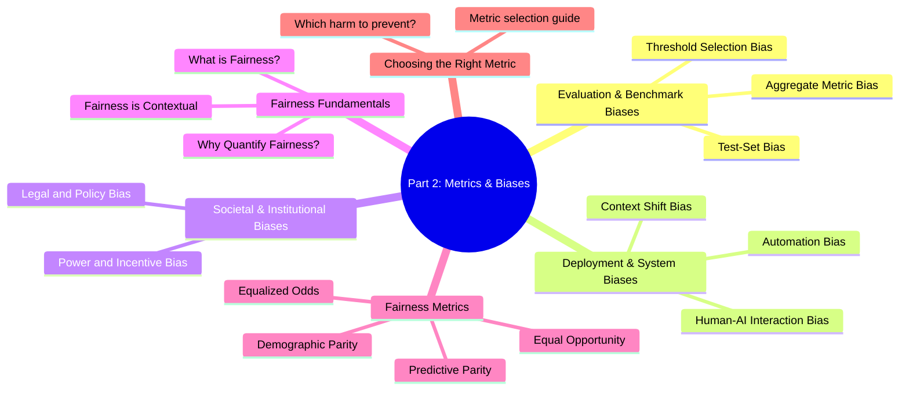

---

## 🎓 Classroom Conversation

### Continuation: Evaluation & Benchmark Biases

**Teacher:** Welcome back students! Previous class lo data biases and algorithmic biases chusamu. Ippudu remaining bias sources complete chesi, then fairness metrics loki veldam.

#### Evaluation & Benchmark Biases

**Beginner Student:** Sir, evaluation stage lo kuda bias untunda? Model train ayyaka kada idi?

**Teacher:** Yes! Even evaluation can introduce bias. Three types chuddam:

##### Aggregate Metric Bias

**Teacher:** Mana first issue - **Aggregate Metric Bias**.

When we report:
- Overall Accuracy: 95%
- Overall F1-Score: 0.92
- Overall AUC: 0.96

We are **hiding subgroup disparities**!

> 💡 **Jargon Alert - Aggregate Metric Bias**
> Simple Explanation: Reporting only overall metrics hides how model performs differently for different groups
> Example: Model with 95% overall accuracy has 99% accuracy for Group A but only 70% for Group B

**Analogy**: Class average marks cheptunnav:
- Class Average: 85%
- But Boys: 95%, Girls: 75%

Average looks good, but there's inequality!

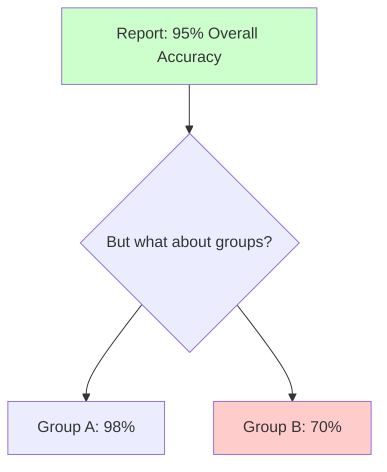

**Clever Student:** Sir, idhi avoid cheyyadaniki emi cheyali?

**Teacher:** **Report subgroup metrics!** Always break down:
- Accuracy per group
- TPR per group
- FPR per group

```python
# Don't just report overall
overall_accuracy = accuracy_score(y_true, y_pred)  # 95%

# Also report per group
for group in ['A', 'B', 'C']:
    group_mask = (groups == group)
    group_acc = accuracy_score(y_true[group_mask], y_pred[group_mask])
    print(f"Group {group} Accuracy: {group_acc:.2%}")
```

##### Test-Set Bias

**Practical Student:** Sir, test set lo bias ante?

**Teacher:** **Test-Set Bias** happens when:
- Test data mirrors training data biases
- Test doesn't represent real deployment population

**Example**: 
- Training: 90% Urban data
- Test: 90% Urban data (same ratio)
- Deployment: 50% Urban, 50% Rural

Model looks great on test, fails in deployment!

> 💡 **Jargon Alert - Test-Set Bias**
> Simple Explanation: Evaluation data that doesn't represent the real-world population you'll serve
> Example: Testing facial recognition only on light-skinned faces when deployed for all populations

**Cure**: Make test set reflect **deployment population**, not training distribution!

##### Threshold Selection Bias

**Curious Student:** Sir, threshold selection lo bias ela vastundi?

**Teacher:** Great question! When we classify:
- Model gives probability: 0.6
- We use threshold: 0.5
- If prob > 0.5 → Positive class

**Problem**: Same threshold for all groups may be unfair!

**Example**: Credit scoring
- Same threshold (0.5) for all
- Group A: Easy to cross threshold
- Group B: Harder to cross (different distribution)

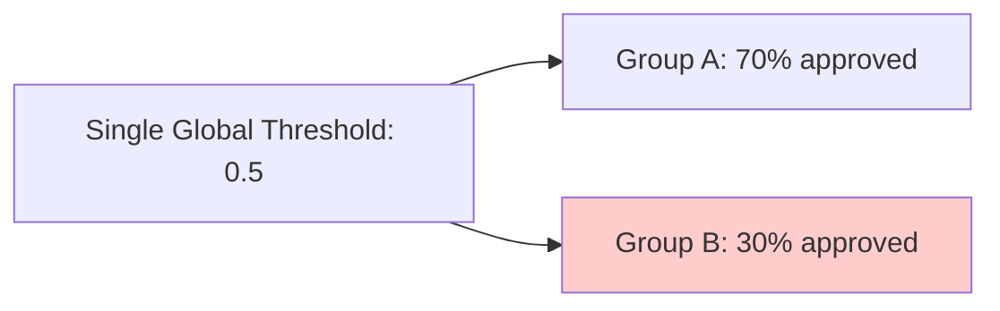

**Different groups may need different thresholds to achieve fairness!** (We'll discuss in mitigation section)

---

### Topic 5: Deployment & System Level Biases

**Teacher:** Ippudu deployment stage biases chuddam.

#### Human-AI Interaction Bias

**Beginner Student:** Sir, model deploy ayyaka bias ela increase avtundi?

**Teacher:** When humans use AI, they often **over-rely** on it:

> 💡 **Jargon Alert - Human-AI Interaction Bias**
> Simple Explanation: Humans treating AI output as authoritative without critical evaluation
> Example: Judges relying too heavily on risk scores, doctors ignoring patient context due to AI suggestions

**Real Examples:**
| Domain | Issue |
|--------|-------|
| Criminal Justice | Judges over-rely on risk assessment scores |
| Healthcare | Doctors trust AI diagnosis without checking patient context |
| Hiring | HR accepts AI recommendations without review |

**Teacher (continuing):** AI output "looks authoritative" because it's computer-generated. But AI can be wrong, especially for minority groups!

#### Automation Bias

**Critique Student:** Sir, automation bias different aa Human-AI Interaction bias nundi?

**Teacher:** Related but slightly different:

- **Human-AI Interaction**: Treating AI as authoritative
- **Automation Bias**: Preferring automated decisions OVER human judgment

**Example**: 
- AI says: "Don't hire this candidate"
- HR person thinks: "But this candidate seems good..."
- HR still rejects: "Computer knows better"

This is **Automation Bias** - blindly following automation!

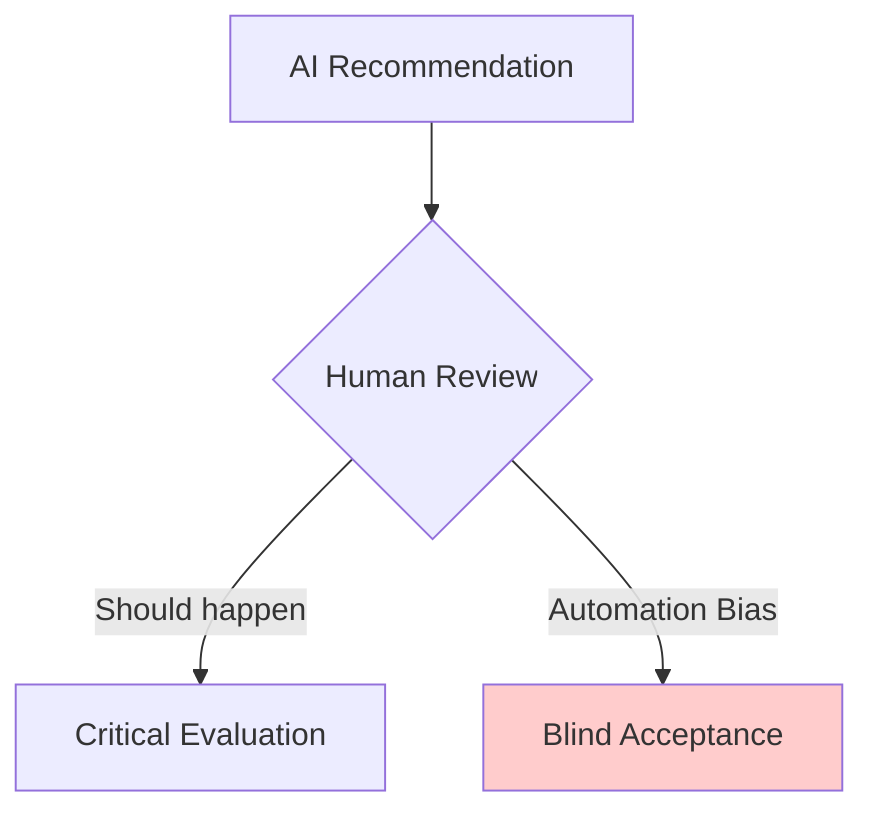

#### Context Shift Bias

**Practical Student:** Sir, context shift bias enti?

**Teacher:** Model is trained in ONE context, deployed in ANOTHER:

| Training Context | Deployment Context | Problem |
|-----------------|-------------------|---------|
| Urban data | Rural areas | Poor performance |
| US English | Indian English | Misunderstandings |
| Daytime photos | Nighttime conditions | Recognition failures |

> 💡 **Jargon Alert - Context Shift Bias**
> Simple Explanation: Model trained in one setting performing poorly in different deployment settings
> Example: Medical model trained on US hospital data fails when deployed in Indian rural clinics

**This is also called "Distribution Shift" or "Domain Shift"!**

---

### Topic 6: Societal & Institutional Biases

**Teacher:** Last bias category - biases from society and institutions themselves.

#### Power and Incentive Bias

**Debate Student:** Sir, power bias ante?

**Teacher:** AI is often optimized for **institutional goals**, not **social welfare**.

**Example**: Bank loan algorithm:
- Goal: Maximize profit (institutional)
- Result: Deny loans to poor (because risky)
- Social impact: Poor remain poor

> 💡 **Jargon Alert - Power and Incentive Bias**
> Simple Explanation: AI optimized for business/institutional goals ignoring social responsibility
> Example: Social media algorithms optimizing for engagement, even if spreading harmful content

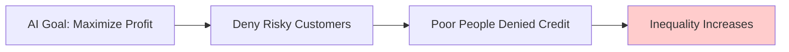

#### Legal and Policy Bias

**Curious Student:** Sir, legal bias AI lo ela affect chestundi?

**Teacher:** AI doesn't understand:
- Different laws in different regions
- Protected characteristics vary by country
- Legal protections for different groups

**Example**: Medicine suggestions from ChatGPT
- Some medicines banned in India
- AI trained on US data might suggest them
- AI doesn't know Indian regulations!

**Teacher:** Okay students, ippudu bias sources complete ayyayi. Let me summarize:

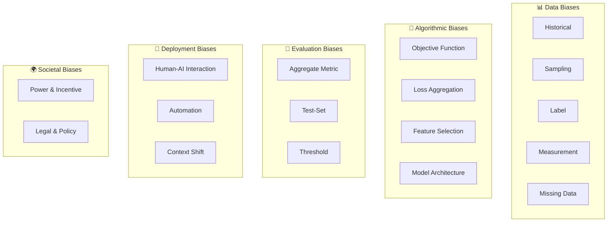

---

### Topic 7: Introduction to Fairness

**Teacher:** Now comes the important question - biases identify chesamu, but **how to measure if system is fair?**

**Beginner Student:** Sir, fairness ante simply "everyone gets same treatment" kadaa?

**Teacher:** Not that simple! Fairness has multiple definitions. Let me explain with analogy:

**Scenario**: 3 kids want to see over a fence:
- Kid A: Tall (can see)
- Kid B: Medium (can barely see)  
- Kid C: Short (cannot see)

**Option 1 - Equality**: Give same size box to everyone
- Result: A sees great, B sees, C still can't see

**Option 2 - Equity**: Give boxes based on need
- A: 0 boxes, B: 1 box, C: 2 boxes
- Result: Everyone can see

**Which is "fair"?** Depends on context!

> 💡 **Jargon Alert - Fairness in AI**
> Simple Explanation: Ensuring AI models don't discriminate against groups based on protected characteristics (gender, race, age, etc.)
> Example: Loan approval algorithm approving similar qualified candidates at same rate regardless of gender

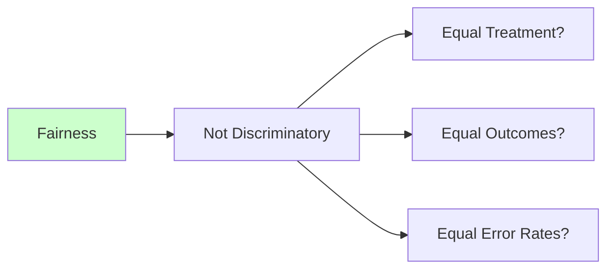

**Clever Student:** Sir, mathematical ga fairness ela define chestaru?

**Teacher:** That's what fairness metrics do! Let me introduce the notation first:

### Notation for Fairness Metrics

```
A = Sensitive/Protected Attribute (Gender, Race, Age, etc.)
Y = True Label (Ground truth: qualified/not qualified)
Ŷ = Predicted Label (Model prediction: approved/not approved)
```

**For binary classification:**
| Actual \ Predicted | Positive (Ŷ=1) | Negative (Ŷ=0) |
|-------------------|----------------|----------------|
| Positive (Y=1) | TP (True Positive) | FN (False Negative) |
| Negative (Y=0) | FP (False Positive) | TN (True Negative) |

**Key Rates per Group:**
- **Selection Rate** = (TP + FP) / Total = P(Ŷ=1)
- **TPR (True Positive Rate)** = TP / (TP + FN) = P(Ŷ=1 | Y=1)
- **FPR (False Positive Rate)** = FP / (FP + TN) = P(Ŷ=1 | Y=0)

---

### Topic 8: Fairness Metric 1 - Demographic Parity

**Teacher:** First fairness metric - **Demographic Parity** (also called Statistical Parity).

**Beginner Student:** Sir, demographic parity ante enti?

**Teacher:** Simple definition:

> **Different groups should receive positive predictions at similar rates**

**Mathematical Notation:**
$$P(\hat{Y}=1 | A=a) \approx P(\hat{Y}=1 | A=b)$$

**Plain English**: Selection rate for Group A ≈ Selection rate for Group B

> 💡 **Jargon Alert - Demographic Parity**
> Simple Explanation: All groups should be approved/selected at the same rate
> Example: If 70% of male applicants get loans approved, 70% of female applicants should also get approved

**Real Example - Loan Approvals:**

| Group | Applications | Approved | Approval Rate |
|-------|-------------|----------|---------------|
| Male | 1000 | 700 | 70% |
| Female | 1000 | 400 | 40% |

**Gap = 70% - 40% = 30%** → Violates Demographic Parity!

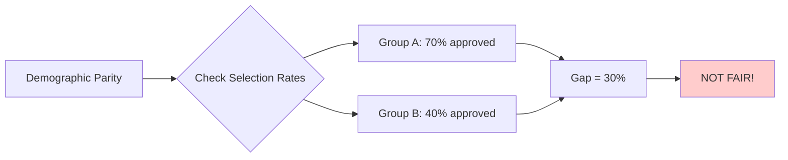

**Critique Student:** Sir, but idi forced equality kadaa? What if one group is actually less qualified?

**Teacher:** Excellent critique! This is the **limitation** of Demographic Parity:

**Pros:**
- Simple to understand and measure
- Ensures equal access

**Cons:**
- Doesn't consider if groups have different base rates
- May force equal outcomes even when not appropriate

**When to use**: Allocation decisions where balanced access is the policy goal (scholarships, outreach programs)

---

### Topic 9: Fairness Metric 2 - Equal Opportunity

**Teacher:** Next metric - **Equal Opportunity** (also called Equality of Opportunity).

**Clever Student:** Sir, idi demographic parity kanna different ela?

**Teacher:** Key difference:

- **Demographic Parity**: Among ALL people, equal selection rate
- **Equal Opportunity**: Among QUALIFIED people (Y=1), equal selection rate

**Mathematical Notation:**
$$P(\hat{Y}=1 | Y=1, A=a) \approx P(\hat{Y}=1 | Y=1, A=b)$$

**Plain English**: True Positive Rate for Group A ≈ True Positive Rate for Group B

> 💡 **Jargon Alert - Equal Opportunity**
> Simple Explanation: Among people who truly deserve positive outcome, all groups should have same chance of getting it
> Example: Among actually qualified candidates, males and females should have equal chance of being hired

**Real Example - Job Hiring:**

| Group | Actually Qualified | Hired | TPR |
|-------|-------------------|-------|-----|
| Male | 100 | 90 | 90% |
| Female | 100 | 60 | 60% |

**TPR Gap = 90% - 60% = 30%** → Violates Equal Opportunity!

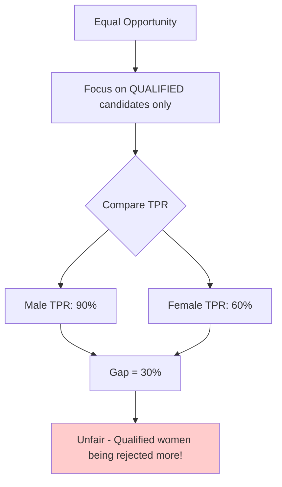

**Practical Student:** Sir, interview lo "When to use Equal Opportunity?" ani adugutharu - answer enti?

**Teacher:** Interview one-liner:

> *"Use Equal Opportunity when missing qualified positives is the main harm - like scholarships, medical screening, or interview shortlisting. It ensures qualified candidates from all groups have equal chance of being selected."*

**Comparison so far:**

| Metric | What it Checks | Formula |
|--------|---------------|---------|
| Demographic Parity | Overall selection rate equal | P(Ŷ=1\|A=a) = P(Ŷ=1\|A=b) |
| Equal Opportunity | TPR equal (qualified people) | P(Ŷ=1\|Y=1,A=a) = P(Ŷ=1\|Y=1,A=b) |

---

### Topic 10: Fairness Metric 3 - Equalized Odds

**Teacher:** Most comprehensive metric - **Equalized Odds**.

**Curious Student:** Sir, idi previous two kanna strong kadaa?

**Teacher:** Yes! Equalized Odds requires BOTH:
1. Equal TPR across groups (like Equal Opportunity)
2. Equal FPR across groups (controls false positives too!)

**Mathematical Notation:**
$$P(\hat{Y}=1 | Y=y, A=a) \approx P(\hat{Y}=1 | Y=y, A=b) \text{ for } y \in \{0, 1\}$$

**Plain English**: Error rates should be similar for both groups in both directions!

> 💡 **Jargon Alert - Equalized Odds**
> Simple Explanation: Both True Positive Rate AND False Positive Rate should be equal across groups
> Example: Model should catch criminals equally across races (TPR), AND wrongly flag innocents equally (FPR)

**Why this matters:**

| If Only TPR Equal | Issue |
|-------------------|-------|
| TPR Group A = 90% | Good for qualified A |
| TPR Group B = 90% | Good for qualified B |
| FPR Group A = 5% | A rarely wrongly flagged |
| FPR Group B = 25% | B wrongly flagged 5x more! |

Equal Opportunity satisfied, but still unfair for unqualified Group B!

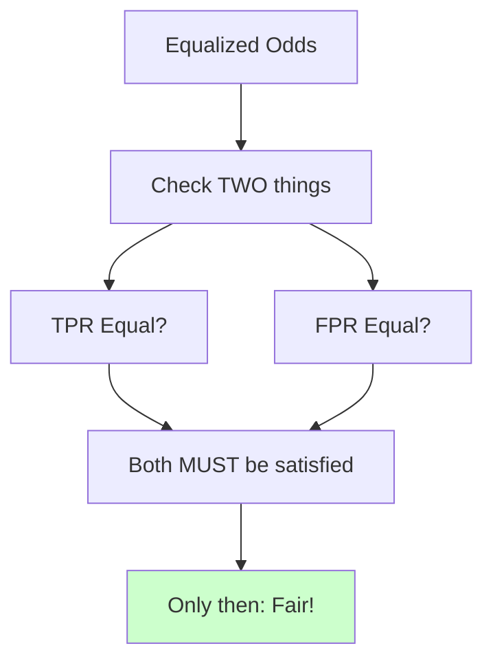

**Real Example - Criminal Justice:**

| Group | Actually Guilty | Predicted Guilty | TPR | Actually Innocent | Predicted Guilty | FPR |
|-------|----------------|-----------------|-----|-------------------|-----------------|-----|
| Black | 100 | 85 | 85% | 1000 | 250 | 25% |
| White | 100 | 80 | 80% | 1000 | 50 | 5% |

- TPR Gap: 5% (small, acceptable)
- FPR Gap: 20% (HUGE problem!)

**Innocent Black people are flagged 5x more often!** This was the COMPAS controversy.

**Debate Student:** Sir, but all three metrics satisfy cheyyadam possible aa?

**Teacher:** Great question! **Often impossible!** This is called the **Fairness Impossibility Theorem**.

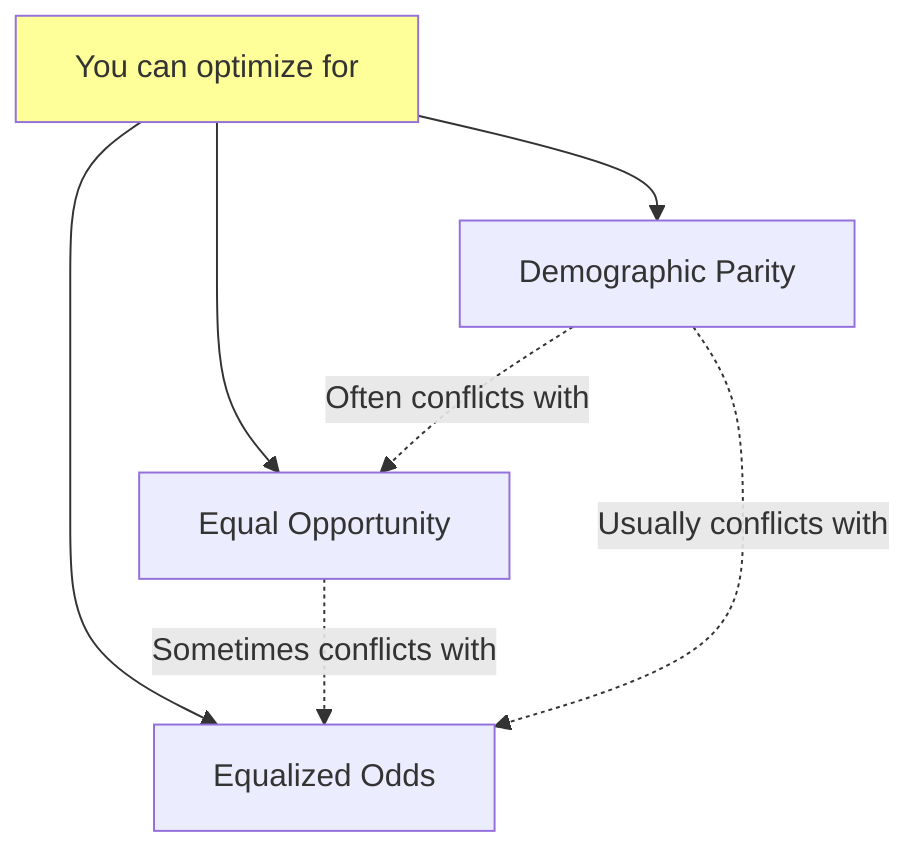

**You must CHOOSE based on which harm you want to prevent!**

---

### Topic 11: Choosing the Right Fairness Metric

**Practical Student:** Sir, how to choose which metric in interviews and real projects?

**Teacher:** Decision framework:

**Ask: "Which mistake is the HARM we care about most?"**

| Harm Type | Recommended Metric |
|-----------|--------------------|
| Qualified people are being missed | Equal Opportunity (TPR parity) |
| Error rates differ across groups (both directions) | Equalized Odds |
| Access/selection is imbalanced | Demographic Parity |

**Domain-specific examples:**

| Domain | Main Harm | Metric |
|--------|-----------|--------|
| Scholarships | Missing qualified students | Equal Opportunity |
| Fraud Detection | False positives costly | Equalized Odds |
| Medical Screening | Missing true cases dangerous | Equal Opportunity |
| Hiring (shortlist) | Unequal access | Demographic Parity |
| Criminal Risk | Wrongly flagging innocents | Equalized Odds |

```python
# Conceptual: Fairness Metric Selection
def choose_fairness_metric(domain, main_concern):
    """
    Guide to selecting appropriate fairness metric
    """
    if main_concern == "missing_qualified":
        return "Equal Opportunity (TPR Parity)"
    elif main_concern == "error_rate_imbalance":
        return "Equalized Odds (TPR + FPR Parity)"
    elif main_concern == "access_imbalance":
        return "Demographic Parity (Selection Rate Parity)"
    else:
        return "Consult domain experts and affected communities"
```

**Teacher:** Important NIST guidance:

> *"There is no single metric that works for every domain. Use fairness metrics where appropriate AND develop context-specific metrics with domain experts and affected communities."*

---

## 📝 Teacher Summary - Part 2

**Teacher:** Okay students, Part 2 summary chepptha:

### Key Takeaways

1. **Evaluation Biases**: Aggregate metrics hide disparities, test sets may not represent deployment
2. **Deployment Biases**: Human over-reliance on AI, context shifts
3. **Societal Biases**: AI optimized for profit not welfare
4. **Fairness = Contextual**: No single definition fits all
5. **Three Core Metrics**:
   - Demographic Parity: Equal selection rates
   - Equal Opportunity: Equal TPR (for qualified)
   - Equalized Odds: Equal TPR AND FPR

### Formulas Quick Reference

| Metric | Formula | Plain English |
|--------|---------|---------------|
| Demographic Parity | P(Ŷ=1\|A=a) = P(Ŷ=1\|A=b) | Same approval rate |
| Equal Opportunity | P(Ŷ=1\|Y=1,A=a) = P(Ŷ=1\|Y=1,A=b) | Same TPR |
| Equalized Odds | TPR_a = TPR_b AND FPR_a = FPR_b | Same error rates |

### Common Mistakes

| Mistake | Correct Approach |
|---------|-----------------|
| "Use Demographic Parity always" | Choose based on which harm to prevent |
| "High TPR = fair model" | Also check FPR (Equalized Odds) |
| "All metrics can be satisfied together" | Fairness trade-offs exist |
| "Overall accuracy = fairness" | Always check subgroup metrics |

### Interview Quick Points

| Question | Answer |
|----------|--------|
| What is Demographic Parity? | Equal selection rates across groups |
| Equal Opportunity vs Equalized Odds? | EO checks only TPR, Equalized Odds checks TPR+FPR |
| When to use Equal Opportunity? | When missing qualified candidates is main harm |
| What is Fairness Impossibility? | Can't satisfy all fairness metrics simultaneously |

---

**Teacher:** Next class lo Mitigation Strategies and Case Studies chustamu!

> 📘 Continue to [Part 3: Mitigation & Case Studies](./AS43_ResponsibleAIFairnessBias3.md)
