# AS43: Responsible AI - Fairness & Bias - Classroom Session (Part 3)

> 📚 **This is Part 3** covering: Bias Mitigation Strategies (Pre/In/Post-processing), Real-World Case Studies, Practical Code Example, Governance & Monitoring
> 📘 **Previous:** [Part 1](./AS43_ResponsibleAIFairnessBias1.md), [Part 2](./AS43_ResponsibleAIFairnessBias2.md)

---

## 🗺️ Mind Map - Part 3 Topics


---

## 🎓 Classroom Conversation

### Topic 12: Bias Mitigation Strategies Overview

**Teacher:** Welcome to our final session on Responsible AI! Ippudu most practical part - **How to FIX bias when we find it?**

**Beginner Student:** Sir, bias identify chesaka emi cheyali? Remove cheyocha?

**Teacher:** We can MITIGATE (reduce) bias at three stages:

```mermaid
flowchart LR
    subgraph Pre ["🔵 Pre-processing"]
        A[Fix Data BEFORE Training]
    end
    
    subgraph In ["🟢 In-processing"]
        B[Modify Training Objective]
    end
    
    subgraph Post ["🟠 Post-processing"]
        C[Adjust Predictions AFTER Model]
    end
    
    Pre --> In --> Post
```



Think of it like:
- **Pre-processing**: Fix ingredients before cooking
- **In-processing**: Modify recipe while cooking
- **Post-processing**: Adjust seasoning after cooking

> 💡 **Jargon Alert - Bias Mitigation**
> Simple Explanation: Techniques to reduce unfairness in AI systems at data, training, or prediction stages
> Example: Giving more weight to minority samples so model learns them better

---

### Topic 13: Pre-processing Strategies (Fix Data Before Training)

**Teacher:** Pre-processing strategies are **model-agnostic** - work with any ML algorithm!

**Practical Student:** Sir, pre-processing lo kya techniques use chestaru?

#### 13.1 Reweighting

**Teacher:** First technique - **Reweighting**.

**Idea**: Give higher weights to disadvantaged group samples so model pays more attention.

> 💡 **Jargon Alert - Reweighting**
> Simple Explanation: Assigning higher importance to underrepresented group samples during training
> Example: If female loan applicants are only 100 out of 1000, give each female sample weight of 10

**Analogy**: In class, if sir gives 10 marks for boys' homework and 50 marks for girls' homework:
- Boys still have same number of homeworks
- But girls' work counts MORE
- Final evaluation becomes balanced!

```python
# Conceptual: Reweighting
def calculate_sample_weights(groups, labels):
    """
    Give higher weight to minority group samples
    """
    weights = []
    for group, label in zip(groups, labels):
        # Calculate based on group and label frequency
        base_weight = 1.0 / frequency(group, label)
        weights.append(base_weight)
    return weights

# In sklearn
from sklearn.utils.class_weight import compute_sample_weight
sample_weights = compute_sample_weight('balanced', groups)
model.fit(X, y, sample_weight=sample_weights)
```

**Clever Student:** Sir, idi sampling bias fix chestunda?

**Teacher:** Yes! Reweighting helps when data has unequal representation. AIF360 library has standard `Reweighing` algorithm for this!

#### 13.2 Resampling

**Teacher:** Second technique - **Resampling**.

**Idea**: Change the dataset itself:
- **Oversample** minority group (duplicate samples)
- **Undersample** majority group (remove samples)


**Critique Student:** Sir, oversampling lo same samples duplicate cheste overfitting avuthunda?

**Teacher:** Excellent question! Yes, risk untundi. That's why:
- Use **SMOTE** (creates synthetic samples, not exact copies)
- Combine with other techniques
- Be careful with test set (don't resample test data!)

#### 13.3 Feature Transformation

**Teacher:** Third technique - **Feature Transformation**.

**Idea**: Transform features so sensitive information is removed but predictive power is preserved.

**Example**: 
- Original feature: Zip Code (encodes race indirectly)
- Transformed feature: Distance from work only

> 💡 **Jargon Alert - Feature Transformation**
> Simple Explanation: Modifying features to remove discriminatory information while keeping useful predictive power
> Example: Removing or transforming proxy features like zip code that correlate with race

**When to use Pre-processing:**
- Bias comes from data (sampling, labeling, representation)
- You want model-agnostic solution
- You can modify training data

---

### Topic 14: In-processing Strategies (Modify Training)

**Teacher:** In-processing means changing HOW model learns!

**Curious Student:** Sir, idi pre-processing kanna powerful aa?

**Teacher:** Often gives stronger control, but more complex. Let's see techniques:

#### 14.1 Fairness Constraints in Objective Function

**Teacher:** Remember our objective function:

$$\text{Minimize } L = \sum \text{Loss}(y, \hat{y})$$

**Problem**: Only minimizes loss, doesn't care about fairness.

**Solution**: Add fairness constraint:

$$\text{Minimize } L \text{ subject to } \text{Fairness Gap} \leq \epsilon$$

**Analogy**: Teacher says:
- "Get highest class average marks" (objective)
- "BUT difference between boys and girls average should be < 5 marks" (constraint)

```python
# Conceptual: Constrained Optimization
def fair_objective(y_true, y_pred, groups, epsilon=0.05):
    # Original loss
    original_loss = calculate_loss(y_true, y_pred)
    
    # Fairness constraint
    fairness_gap = calculate_demographic_parity_gap(y_pred, groups)
    
    # Optimization with constraint
    if fairness_gap > epsilon:
        # Penalize or reject this solution
        return float('inf')
    return original_loss
```

**Debate Student:** Sir, constraint add cheste optimization slow avuthunda?

**Teacher:** Yes! Trade-off exists:
- More constraints = More complex optimization
- May take longer to converge
- But ensures fairness guarantees!

#### 14.2 Fairness Penalty (Regularization)

**Teacher:** Alternative approach - add fairness **penalty** (like L1/L2 regularization):

$$\text{Loss}_{\text{total}} = \text{Original Loss} + \lambda \times \text{Fairness Penalty}$$

**Remember L1/L2 regularization?**
- Added penalty to prevent overfitting
- Here, penalty to prevent unfairness!

```python
def fair_loss_with_penalty(y_true, y_pred, groups, lambda_fair=0.5):
    # Original loss
    original_loss = mse_loss(y_true, y_pred)
    
    # Fairness penalty (e.g., demographic parity gap squared)
    fairness_gap = demographic_parity_gap(y_pred, groups) ** 2
    
    # Total loss with fairness penalty
    total_loss = original_loss + lambda_fair * fairness_gap
    
    return total_loss
```

**Key hyperparameter**: λ (lambda)
- λ = 0: Only accuracy matters
- λ = high: Only fairness matters
- Need to balance!


**Practical Student:** Sir, interview lo "Accuracy vs Fairness trade-off" question vastundi - ela answer cheyali?

**Teacher:** Important interview point:

> *"Responsible AI is about transparent trade-offs, not perfection. We use regularization with lambda parameter to balance accuracy and fairness. The right balance depends on domain - in healthcare, we prioritize fairness even at accuracy cost; in spam detection, accuracy might be prioritized."*

#### 14.3 Adversarial Debiasing

**Teacher:** Advanced technique - **Adversarial Debiasing**.

> 💡 **Jargon Alert - Adversarial Debiasing**
> Simple Explanation: Train model to make predictions while simultaneously making it impossible for another model to guess the sensitive attribute from predictions
> Example: Predictor learns features that are useful for task but don't reveal gender


**Idea**: If adversary can't guess gender from predictions, predictions are fair!

---

### Topic 15: Post-processing Strategies (Adjust After Prediction)

**Teacher:** Post-processing is useful when:
- You can't retrain model (vendor model)
- Need quick fix
- Want controlled decision rule

#### 15.1 Reject Option Classification

**Beginner Student:** Sir, reject option ante enti?

**Teacher:** When model has **low confidence**, favor disadvantaged group!

**Algorithm**:
1. Model gives probability P for each sample
2. If P is around threshold (uncertain region)
3. For disadvantaged group: classify as positive
4. For advantaged group: classify as negative


> 💡 **Jargon Alert - Reject Option Classification**
> Simple Explanation: For uncertain predictions, favor the disadvantaged group to achieve fairness
> Example: In loan approval, if model is 52% sure, approve for minority group, deny for majority

**When to use**: Low confidence predictions where human review isn't possible.

#### 15.2 Threshold Adjustment

**Teacher:** Most common post-processing - **Different Thresholds for Different Groups**.

**Example**:
- Standard threshold: 0.5
- Group A threshold: 0.4 (easier to get approved)
- Group B threshold: 0.6 (harder to get approved)

```python
# Group-specific thresholds
def predict_with_fair_thresholds(probabilities, groups, thresholds):
    """
    Apply different thresholds for different groups
    thresholds = {'Male': 0.5, 'Female': 0.4}
    """
    predictions = []
    for prob, group in zip(probabilities, groups):
        threshold = thresholds[group]
        predictions.append(1 if prob > threshold else 0)
    return predictions

# Fairlearn's ThresholdOptimizer does this automatically!
from fairlearn.postprocessing import ThresholdOptimizer
postprocess = ThresholdOptimizer(
    estimator=model,
    constraints="demographic_parity",
    objective="accuracy_score"
)
```

**Critique Student:** Sir, idi legally allowed aa? Different treatment for different groups?

**Teacher:** Excellent question! This is **controversial**:
- Some domains: Allowed (affirmative action)
- Some domains: Prohibited (explicit discrimination)
- Must be **documented and justified** in context!

---

### Topic 16: Real-World Case Studies

**Teacher:** Ippudu real cases chuddam - where AI bias was discovered and what we can learn.

#### Case Study 1: Apple Credit Card Gender Bias


**Teacher:** Key learnings:
- **Bias Source**: Algorithmic/Data bias
- **Metric Violated**: Demographic Parity
- **Mitigation Needed**: Pre-processing (data audit), In-processing (fairness constraints)

#### Case Study 2: LinkedIn Job Recommendation Bias

**Teacher:** LinkedIn's algorithm:
- Favored male candidates over equally qualified females
- Even suggested male names when searching for females!
- Stephanie Williams → Showed Stephen Williams

**Curious Student:** Sir, idi ela fix chesaru?

**Teacher:** LinkedIn had to:
- Audit algorithms for gender bias
- Implement fairness constraints
- Regular monitoring and reporting

#### Case Study 3: US Healthcare Algorithm (Science 2019)

**Teacher:** This is the famous **cost as proxy** case:


**Impact**: 200 million patients affected in US hospitals!

**Key Learnings:**
- **Bias Source**: Measurement bias (wrong proxy)
- **Metric Violated**: Equal Opportunity (TPR gap)
- **Fix**: Change target variable from "cost" to "clinical need"

#### Case Study 4: Gender Shades Study (MIT)

**Practical Student:** Sir, facial recognition bias case explain cheyandi.

**Teacher:** Buolamwini & Gebru's famous study:

| Skin Type + Gender | Error Rate |
|-------------------|------------|
| Lighter-skinned males | 0.8% |
| Darker-skinned females | 34.7% |

**43x higher error rate!**

**Root Causes:**
- Representation bias (training data skewed)
- Evaluation bias (tested only on average)

**Mitigation:**
- Balanced dataset collection
- Intersectional evaluation (not just male/female or light/dark separately)
- Subgroup performance as release gate

#### Case Study 5: COMPAS Criminal Justice

**Teacher:** ProPublica investigation showed:

| Group | False Positive Rate |
|-------|---------------------|
| Black defendants | Higher (wrongly flagged as high risk) |
| White defendants | Lower |

**This means**: Innocent Black people more likely to be denied bail!

**Key Learning**: This case showed fairness metrics can **conflict**:
- Calibration (overall accuracy) was similar
- But FPR was very different
- Shows need for Equalized Odds, not just accuracy!

---

### Topic 17: Practical Code Example - Detecting Bias

**Teacher:** Ippudu simple code example chustamu - how bias looks in practice.

```python
import numpy as np
import pandas as pd
from sklearn.linear_model import LogisticRegression
from sklearn.model_selection import train_test_split

# ========================================
# Step 1: Create Biased Dataset (Hiring)
# ========================================
np.random.seed(42)
n_samples = 1000

# Generate data
gender = np.random.choice([0, 1], size=n_samples)  # 0 = Male, 1 = Female
skill = np.random.uniform(0, 100, size=n_samples)

# Create BIAS: Females need higher skill to get hired
# Male: skill > 50 → hired
# Female: skill > 70 → hired (unfair!)
hired = np.where(
    (gender == 0) & (skill > 50), 1,
    np.where(
        (gender == 1) & (skill > 70), 1, 0
    )
)

df = pd.DataFrame({
    'gender': gender,
    'skill': skill,
    'hired': hired
})

print("Dataset Summary:")
print(f"Males: {sum(gender == 0)}, Females: {sum(gender == 1)}")
print(f"Hired: {sum(hired)}")
```

**Teacher:** This dataset has INTENTIONAL bias - females need 70+ skill, males need only 50+!

```python
# ========================================
# Step 2: Train Model
# ========================================
X = df[['gender', 'skill']]
y = df['hired']

model = LogisticRegression()
model.fit(X, y)
y_pred = model.predict(X)

# ========================================
# Step 3: Calculate Fairness Metrics
# ========================================
def calculate_fairness_metrics(y_true, y_pred, groups):
    results = {}
    
    for group_value in [0, 1]:
        mask = (groups == group_value)
        y_true_g = y_true[mask]
        y_pred_g = y_pred[mask]
        
        # Confusion matrix values
        tp = sum((y_true_g == 1) & (y_pred_g == 1))
        fn = sum((y_true_g == 1) & (y_pred_g == 0))
        fp = sum((y_true_g == 0) & (y_pred_g == 1))
        tn = sum((y_true_g == 0) & (y_pred_g == 0))
        
        # Metrics
        tpr = tp / (tp + fn) if (tp + fn) > 0 else 0
        fpr = fp / (fp + tn) if (fp + tn) > 0 else 0
        selection_rate = (tp + fp) / len(y_pred_g)
        
        group_name = "Male" if group_value == 0 else "Female"
        results[group_name] = {
            'TPR': tpr,
            'FPR': fpr,
            'Selection Rate': selection_rate
        }
    
    return results

metrics = calculate_fairness_metrics(y.values, y_pred, df['gender'].values)

print("\n========== FAIRNESS METRICS ==========")
for group, values in metrics.items():
    print(f"\n{group}:")
    for metric, value in values.items():
        print(f"  {metric}: {value:.2%}")

# ========================================
# Step 4: Check Fairness Gaps
# ========================================
print("\n========== FAIRNESS GAPS ==========")
tpr_gap = abs(metrics['Male']['TPR'] - metrics['Female']['TPR'])
fpr_gap = abs(metrics['Male']['FPR'] - metrics['Female']['FPR'])
sr_gap = abs(metrics['Male']['Selection Rate'] - metrics['Female']['Selection Rate'])

print(f"Demographic Parity Gap (Selection Rate): {sr_gap:.2%}")
print(f"Equal Opportunity Gap (TPR): {tpr_gap:.2%}")
print(f"Equalized Odds Gap (FPR): {fpr_gap:.2%}")

if sr_gap > 0.1:
    print("⚠️ Demographic Parity VIOLATED (gap > 10%)")
if tpr_gap > 0.1:
    print("⚠️ Equal Opportunity VIOLATED (gap > 10%)")
```

**Expected Output:**

```
========== FAIRNESS METRICS ==========

Male:
  TPR: 100.00%
  FPR: 1.20%
  Selection Rate: 32.60%

Female:
  TPR: 99.56%
  FPR: 0.00%
  Selection Rate: 90.00%

========== FAIRNESS GAPS ==========
Demographic Parity Gap (Selection Rate): 57.40%
⚠️ Demographic Parity VIOLATED (gap > 10%)
```

**Beginner Student:** Sir, idi ela interpret cheyali?

**Teacher:** Interpretation:
- **TPR similar** (~100% both): Qualified candidates treated similarly ✓
- **Selection Rate HUGE gap** (32% vs 90%): Females predicted positive much more often!

Wait... this seems opposite to our bias? Let me explain:
- Our bias: Females HARDER to get hired (need skill > 70)
- But model learned this pattern
- When model predicts, it reflects the **training data pattern**

The key point: **Even if model has similar TPR, Selection Rate gap shows unfair outcomes!**

---

### Topic 18: Governance & Monitoring

**Teacher:** Final topic - how to make Responsible AI a **continuous process**.


**Key Points:**
1. **Document everything**: Which metric, why, what trade-offs
2. **Continuous monitoring**: Bias can increase post-deployment (feedback loops)
3. **Regular audits**: Quarterly fairness audits
4. **Stakeholder involvement**: Include affected communities

**NIST AI RMF Approach:**
- **Map**: Identify risks and affected groups
- **Measure**: Use appropriate fairness metrics
- **Manage**: Implement mitigations
- **Monitor**: Track post-deployment

---

## 📝 Teacher Summary - Part 3

**Teacher:** Okay students, ippudu complete Responsible AI topic summary chepptha!

### Complete Topic Summary

| Section | Key Concepts |
|---------|-------------|
| Part 1 | Bias sources (Data + Algorithmic) |
| Part 2 | Fairness metrics (DP, EO, Equalized Odds) |
| Part 3 | Mitigation strategies + Case studies |

### Mitigation Quick Reference

| Stage | Technique | When to Use |
|-------|-----------|-------------|
| Pre-processing | Reweighting | Unequal group sizes |
| Pre-processing | Resampling | Class imbalance |
| Pre-processing | Feature transform | Proxy features |
| In-processing | Constraints | Strict fairness requirement |
| In-processing | Fairness penalty | Balance accuracy/fairness |
| Post-processing | Threshold adjustment | Can't retrain model |
| Post-processing | Reject option | Low confidence cases |

### Case Study Template (For Any Fairness Issue)

```
1. Decision: What did the model decide?
2. Groups: Who could be harmed?
3. Metric: Which fairness metric matters?
4. Bias Source: Historical/Representation/Measurement/Label?
5. Fix: Pre/In/Post-processing?
```

### Key Takeaways

1. **Bias Mitigation** = Pre + In + Post processing techniques
2. **Trade-off exists** between accuracy and fairness (λ parameter)
3. **Case studies show** real harm from biased AI
4. **Governance is essential** - continuous monitoring, documentation
5. **No perfect solution** - transparent trade-offs, not perfection

### Interview Quick Points

| Question | Answer |
|----------|--------|
| Name 3 mitigation strategies | Reweighting, Fairness constraints, Threshold adjustment |
| Pre vs In vs Post processing? | Pre=fix data, In=modify objective, Post=adjust predictions |
| Apple Credit Card case? | Gender bias - lower limits for women with same/higher score |
| COMPAS controversy? | Higher FPR for Black defendants - wrongly flagged as high risk |

### Golden Rules of Responsible AI

1. **Bias is pipeline problem** - can enter anywhere
2. **Fairness is contextual** - choose metric based on harm
3. **Trade-offs are inevitable** - document them
4. **Monitoring is mandatory** - bias can increase post-deployment
5. **Include stakeholders** - affected communities matter

---

**Teacher:** Idi complete ayyindi Responsible AI topic! Questions unte adugandi.

**Practical Student:** Sir, one final question - how to answer "Tell me about AI Ethics" in interview?

**Teacher:** 30-second answer:

> *"AI Ethics centers on ensuring AI systems are fair, transparent, and don't discriminate. Key concerns include bias (which can enter from data or algorithms), fairness metrics (like Demographic Parity and Equal Opportunity), and mitigation strategies (pre/in/post-processing). Real cases like Apple Credit Card and COMPAS show why this matters. As practitioners, we must continuously monitor for bias and make transparent trade-offs between accuracy and fairness."*

---

## 🎓 Complete Course Map

```mermaid
flowchart TD
    subgraph Part1 ["📘 Part 1: Bias Sources"]
        A1[Data Biases: 5 types]
        A2[Algorithmic Biases: 4 types]
    end
    
    subgraph Part2 ["📗 Part 2: Fairness Metrics"]
        B1[Demographic Parity]
        B2[Equal Opportunity]
        B3[Equalized Odds]
    end
    
    subgraph Part3 ["📙 Part 3: Mitigation"]
        C1[Pre-processing]
        C2[In-processing]
        C3[Post-processing]
        C4[Case Studies]
    end
    
    Part1 --> Part2 --> Part3
```



---

*"Responsible AI is not about perfection - it's about transparent trade-offs and continuous improvement!"*

**End of Classroom Session** 🎓
