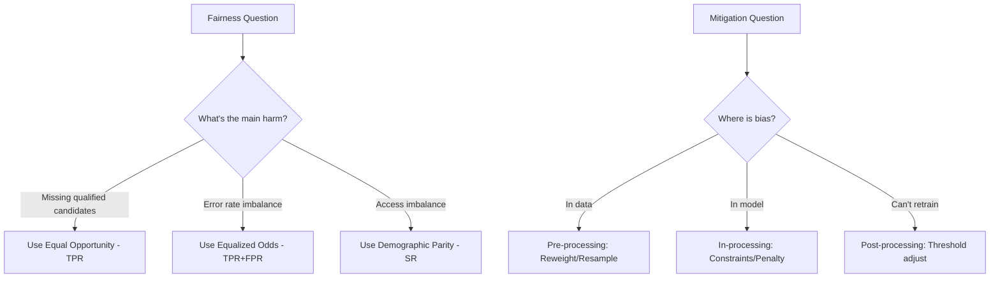

# AS43: Responsible AI - Fairness & Bias - Exam Preparation

> 📚 **Complete Exam Prep** for: Bias Sources, Fairness Metrics (Demographic Parity, Equal Opportunity, Equalized Odds), Mitigation Strategies, Case Studies

---

## Section A: Multiple Choice Questions (MCQ) - 15 Questions

### MCQ 1
**Question:** Which type of bias exists even when data is perfectly collected because society itself is biased?

**Options:**
- A) Sampling Bias
- B) Historical Bias
- C) Measurement Bias
- D) Label Bias

**✅ Correct Answer:** B

**📖 Explanation:** Historical bias reflects past discrimination in society, regardless of how accurately data is collected.

**❌ Why Others Are Wrong:**
- A) Sampling bias is about unequal representation
- C) Measurement bias is about wrong proxies
- D) Label bias is about annotator inconsistency

---

### MCQ 2
**Question:** Demographic Parity requires:

**Options:**
- A) Equal True Positive Rates across groups
- B) Equal False Positive Rates across groups
- C) Equal Selection/Prediction Rates across groups
- D) Equal accuracy across groups

**✅ Correct Answer:** C

**📖 Explanation:** Demographic Parity (Statistical Parity) requires P(Ŷ=1|A=a) = P(Ŷ=1|A=b) - equal selection rates.

---

### MCQ 3
**Question:** Equal Opportunity metric focuses on:

**Options:**
- A) Overall accuracy
- B) True Positive Rate equality
- C) False Positive Rate equality
- D) Selection Rate equality

**✅ Correct Answer:** B

**📖 Explanation:** Equal Opportunity ensures qualified candidates from all groups have equal chance of positive prediction (TPR parity).

---

### MCQ 4
**Question:** Equalized Odds requires:

**Options:**
- A) Only TPR to be equal
- B) Only FPR to be equal
- C) Both TPR and FPR to be equal
- D) Overall accuracy to be equal

**✅ Correct Answer:** C

**📖 Explanation:** Equalized Odds is the strictest - requires BOTH True Positive Rate AND False Positive Rate to be similar across groups.

---

### MCQ 5
**Question:** Using "healthcare cost" as proxy for "healthcare need" is an example of:

**Options:**
- A) Historical Bias
- B) Sampling Bias
- C) Measurement Bias
- D) Label Bias

**✅ Correct Answer:** C

**📖 Explanation:** Measurement bias occurs when what you measure differs from what you intended - cost ≠ actual medical need.

---

### MCQ 6
**Question:** Reweighting is a ______ technique:

**Options:**
- A) Pre-processing
- B) In-processing
- C) Post-processing
- D) Deployment

**✅ Correct Answer:** A

**📖 Explanation:** Reweighting assigns higher importance to underrepresented samples BEFORE training - a pre-processing technique.

---

### MCQ 7
**Question:** Adding fairness penalty to loss function (like L1/L2 regularization for fairness) is:

**Options:**
- A) Pre-processing
- B) In-processing
- C) Post-processing
- D) Feature Engineering

**✅ Correct Answer:** B

**📖 Explanation:** Modifying the objective function during training is an in-processing technique.

---

### MCQ 8
**Question:** Threshold adjustment (different thresholds for different groups) is:

**Options:**
- A) Pre-processing
- B) In-processing
- C) Post-processing
- D) Data augmentation

**✅ Correct Answer:** C

**📖 Explanation:** Adjusting decision thresholds after model predictions is a post-processing technique.

---

### MCQ 9
**Question:** In the COMPAS case study, the main issue was:

**Options:**
- A) Low overall accuracy
- B) Different False Positive Rates across races
- C) Low True Positive Rate
- D) Too conservative predictions

**✅ Correct Answer:** B

**📖 Explanation:** COMPAS had higher FPR for Black defendants - more innocent Black people wrongly flagged as high risk.

---

### MCQ 10
**Question:** Gender Shades study revealed bias in:

**Options:**
- A) Speech recognition
- B) Facial analysis systems
- C) Healthcare prediction
- D) Credit scoring

**✅ Correct Answer:** B

**📖 Explanation:** Buolamwini & Gebru's study showed facial recognition had 43x higher error for darker-skinned women.

---

### MCQ 11
**Question:** When model is trained on urban data but deployed in rural areas, it's called:

**Options:**
- A) Automation Bias
- B) Context Shift Bias
- C) Historical Bias
- D) Label Bias

**✅ Correct Answer:** B

**📖 Explanation:** Context Shift (Distribution Shift) occurs when training and deployment contexts differ.

---

### MCQ 12
**Question:** Reporting only overall accuracy while hiding subgroup performance is:

**Options:**
- A) Aggregate Metric Bias
- B) Sampling Bias
- C) Selection Bias
- D) Confirmation Bias

**✅ Correct Answer:** A

**📖 Explanation:** Aggregate Metric Bias hides disparities by only reporting overall metrics, not subgroup performance.

---

### MCQ 13
**Question:** Apple Credit Card controversy was about:

**Options:**
- A) Age discrimination
- B) Gender discrimination (lower limits for women)
- C) Racial discrimination
- D) Income discrimination

**✅ Correct Answer:** B

**📖 Explanation:** Women received lower credit limits even with higher credit scores than their spouses.

---

### MCQ 14
**Question:** Lambda (λ) in fairness penalty controls:

**Options:**
- A) Learning rate
- B) Trade-off between accuracy and fairness
- C) Number of epochs
- D) Batch size

**✅ Correct Answer:** B

**📖 Explanation:** Lambda balances accuracy (λ=0 means only accuracy matters) and fairness (high λ prioritizes fairness).

---

### MCQ 15
**Question:** Which is TRUE about fairness metrics?

**Options:**
- A) All fairness metrics can be satisfied simultaneously
- B) There's one best metric for all domains
- C) Different metrics often conflict (Fairness Impossibility)
- D) Fairness metrics don't need domain context

**✅ Correct Answer:** C

**📖 Explanation:** Fairness Impossibility Theorem states different fairness definitions often cannot be satisfied simultaneously.

---

## Section B: Multiple Select Questions (MSQ) - 12 Questions

### MSQ 1
**Question:** Data-related biases include: (Select ALL that apply)

**Options:**
- A) Historical Bias
- B) Sampling Bias
- C) Label Bias
- D) Objective Function Bias
- E) Measurement Bias

**✅ Correct Answers:** A, B, C, E

**📖 Explanation:** Objective Function Bias is algorithmic/model bias, not data bias.

---

### MSQ 2
**Question:** Algorithmic/Model biases include: (Select ALL)

**Options:**
- A) Objective Function Bias
- B) Loss Aggregation Bias
- C) Feature Selection Bias
- D) Missing Data Bias
- E) Model Architecture Bias

**✅ Correct Answers:** A, B, C, E

**📖 Explanation:** Missing Data Bias is a data-related bias, not algorithmic.

---

### MSQ 3
**Question:** Pre-processing mitigation techniques include: (Select ALL)

**Options:**
- A) Reweighting
- B) Resampling
- C) Threshold adjustment
- D) Feature transformation
- E) Fairness constraints

**✅ Correct Answers:** A, B, D

**📖 Explanation:** Threshold adjustment is post-processing, Fairness constraints is in-processing.

---

### MSQ 4
**Question:** In-processing mitigation techniques include: (Select ALL)

**Options:**
- A) Fairness constraints in objective
- B) Fairness penalty (regularization)
- C) Adversarial debiasing
- D) Resampling
- E) Reject option classification

**✅ Correct Answers:** A, B, C

**📖 Explanation:** Resampling is pre-processing, Reject option is post-processing.

---

### MSQ 5
**Question:** Fairness metrics include: (Select ALL)

**Options:**
- A) Demographic Parity
- B) Equal Opportunity
- C) Equalized Odds
- D) Accuracy
- E) Predictive Parity

**✅ Correct Answers:** A, B, C, E

**📖 Explanation:** Accuracy is a performance metric, not a fairness metric.

---

### MSQ 6
**Question:** Real-world AI bias case studies include: (Select ALL)

**Options:**
- A) Apple Credit Card
- B) LinkedIn Hiring
- C) US Healthcare Algorithm
- D) COMPAS Risk Score
- E) Netflix Recommendations

**✅ Correct Answers:** A, B, C, D

**📖 Explanation:** Netflix recommendations wasn't a documented major fairness controversy.

---

### MSQ 7
**Question:** Deployment-level biases include: (Select ALL)

**Options:**
- A) Human-AI Interaction Bias
- B) Automation Bias
- C) Context Shift Bias
- D) Historical Bias
- E) Feedback Loop Bias

**✅ Correct Answers:** A, B, C, E

**📖 Explanation:** Historical Bias is data-related, not deployment-level.

---

### MSQ 8
**Question:** Equalized Odds requires: (Select ALL)

**Options:**
- A) Equal True Positive Rate
- B) Equal False Positive Rate
- C) Equal Selection Rate
- D) Error rates balanced across groups

**✅ Correct Answers:** A, B, D

**📖 Explanation:** Selection Rate equality is Demographic Parity, not Equalized Odds.

---

### MSQ 9
**Question:** When to use Equal Opportunity metric: (Select ALL)

**Options:**
- A) Scholarship selection
- B) Medical screening
- C) Job interview shortlisting
- D) Fraud detection with false positive concerns
- E) General allocation decisions

**✅ Correct Answers:** A, B, C

**📖 Explanation:** D needs Equalized Odds (FPR matters), E needs Demographic Parity.

---

### MSQ 10
**Question:** Bias in AI can enter at: (Select ALL stages)

**Options:**
- A) Data collection
- B) Model training
- C) Model evaluation
- D) Deployment
- E) All of the above

**✅ Correct Answers:** A, B, C, D, E

**📖 Explanation:** Bias is a "pipeline problem" - can enter at ANY stage!

---

### MSQ 11
**Question:** Responsible AI governance includes: (Select ALL)

**Options:**
- A) Define harm and fairness goals
- B) Choose appropriate metrics
- C) Continuous monitoring
- D) Document trade-offs
- E) Deploy without audits

**✅ Correct Answers:** A, B, C, D

**📖 Explanation:** Responsible AI requires regular audits, not deployment without them.

---

### MSQ 12
**Question:** Gender Shades study found higher errors for: (Select ALL)

**Options:**
- A) Darker-skinned individuals
- B) Women
- C) Darker-skinned women (intersection)
- D) Lighter-skinned males
- E) All groups equally

**✅ Correct Answers:** A, B, C

**📖 Explanation:** The study showed intersectional bias - darker-skinned women had 34.7% error vs 0.8% for lighter-skinned males.

---

## Section C: Numerical/Calculation Questions - 6 Questions

### Numerical 1
**Question:** Group A has 900 samples, Group B has 100 samples. If error rate is 10% for both groups, how much does each group contribute to total loss (assuming equal error weight)?

**Solution:**
- Group A errors: 900 × 10% = 90 errors
- Group B errors: 100 × 10% = 10 errors
- Total errors: 100
- Group A contribution: 90/100 = **90%**
- Group B contribution: 10/100 = **10%**

**✅ Answer:** Group A contributes 90%, Group B contributes 10% despite same error rate!

---

### Numerical 2
**Question:** Model predicts loans:
- Group A (Male): 700 approved out of 1000
- Group B (Female): 400 approved out of 1000

Calculate Demographic Parity Gap.

**Solution:**
- Selection Rate A = 700/1000 = 70%
- Selection Rate B = 400/1000 = 40%
- Demographic Parity Gap = |70% - 40%| = **30%**

**✅ Answer:** 30% gap - violates Demographic Parity!

---

### Numerical 3
**Question:** Given confusion matrices for two groups:

**Group A:**
| | Predicted Positive | Predicted Negative |
|---|---|---|
| Actually Positive | 90 | 10 |
| Actually Negative | 5 | 95 |

**Group B:**
| | Predicted Positive | Predicted Negative |
|---|---|---|
| Actually Positive | 60 | 40 |
| Actually Negative | 5 | 95 |

Calculate TPR for both groups.

**Solution:**
- TPR_A = TP / (TP + FN) = 90 / (90 + 10) = **90%**
- TPR_B = TP / (TP + FN) = 60 / (60 + 40) = **60%**
- Equal Opportunity Gap = |90% - 60%| = **30%**

**✅ Answer:** TPR_A = 90%, TPR_B = 60%, Gap = 30%

---

### Numerical 4
**Question:** Healthcare cost proxy:
- Black patients with illness severity 8/10 have average cost: $5000
- White patients with illness severity 8/10 have average cost: $8000
- Algorithm threshold: $7000 for "high need"

Which group gets flagged as needing care?

**Solution:**
- Black: $5000 < $7000 → NOT flagged
- White: $8000 > $7000 → Flagged

**✅ Answer:** Only White patients flagged despite same illness severity! This is measurement bias.

---

### Numerical 5
**Question:** Model uses threshold 0.5 for both groups. If fair threshold for Group B should be 0.4, what happens to Group B's approval rate when we change threshold?

Given: 500 samples with probabilities:
- 100 samples: P = 0.45 (currently rejected)
- 150 samples: P = 0.55 (currently approved)
- Rest < 0.4 or > 0.5

**Solution:**
- Original (threshold 0.5): 150 approved
- New (threshold 0.4): 150 + 100 = 250 approved
- Increase in approval rate = (250 - 150) / 500 = **20% increase**

**✅ Answer:** Approval rate increases by 20% when threshold lowered to 0.4

---

### Numerical 6
**Question:** Gender Shades error rates:
- Lighter-skinned males: 0.8%
- Darker-skinned females: 34.7%

How many times higher is the error for darker-skinned females?

**Solution:**
- Ratio = 34.7% / 0.8% = **43.375 times higher**
- Approximately **43x higher**

**✅ Answer:** ~43 times higher error rate!

---

## Section D: Fill in the Blanks - 8 Questions

1. _______ Bias exists even when data is perfectly collected because society itself is biased.
   - **Answer:** Historical

2. The fairness metric that requires equal selection rates across groups is called _______.
   - **Answer:** Demographic Parity

3. Equal Opportunity focuses on equalizing _______ across groups.
   - **Answer:** True Positive Rate (TPR)

4. Modifying training data before model training is called _______ mitigation.
   - **Answer:** Pre-processing

5. Using "arrest records" as proxy for "crime rate" is an example of _______ bias.
   - **Answer:** Measurement

6. The _______ case study showed facial recognition had 43x higher error for darker-skinned women.
   - **Answer:** Gender Shades

7. λ (lambda) in fairness penalty controls trade-off between _______ and _______.
   - **Answer:** Accuracy and Fairness

8. COMPAS controversy was about different _______ rates across races.
   - **Answer:** False Positive

---

## 📚 Quick Revision Points

### Bias Types Hierarchy

```
Data Biases → Historical, Sampling, Label, Measurement, Missing Data
Algorithmic Biases → Objective Function, Loss Aggregation, Feature Selection, Model Architecture
Evaluation Biases → Aggregate Metric, Test-Set, Threshold Selection
Deployment Biases → Human-AI Interaction, Automation, Context Shift
Societal Biases → Power/Incentive, Legal/Policy
```

### Fairness Metrics Formulas

| Metric | Formula | Plain English |
|--------|---------|---------------|
| Demographic Parity | P(Ŷ=1\|A=a) = P(Ŷ=1\|A=b) | Same approval rate |
| Equal Opportunity | P(Ŷ=1\|Y=1,A=a) = P(Ŷ=1\|Y=1,A=b) | Same TPR |
| Equalized Odds | TPR_a = TPR_b AND FPR_a = FPR_b | Same error rates |

### Mitigation Stages

| Stage | Techniques | When to Use |
|-------|------------|-------------|
| Pre-processing | Reweighting, Resampling, Feature transform | Data is biased |
| In-processing | Constraints, Penalties, Adversarial | Need strong fairness |
| Post-processing | Threshold adjustment, Reject option | Can't retrain |

---

## 🚀 Section E: Shortcuts & Cheat Codes

### ⚡ One-Liner Shortcuts

| Concept | Shortcut | When to Use |
|---------|----------|-------------|
| Demographic Parity | "Equal selection, ignore qualification" | Access/allocation decisions |
| Equal Opportunity | "Equal TPR for qualified" | Missing qualified harmful |
| Equalized Odds | "Equal TPR + FPR" | Both error types matter |
| Pre/In/Post | "Data/Training/Prediction" | Choosing mitigation stage |

### 🎯 Memory Tricks (Mnemonics)

1. **HSLMM** for Data Biases: **H**istorical, **S**ampling, **L**abel, **M**easurement, **M**issing
2. **OLFM** for Algorithmic Biases: **O**bjective, **L**oss aggregation, **F**eature selection, **M**odel architecture
3. **DEE** for Fairness Metrics: **D**emographic Parity, **E**qual Opportunity, **E**qualized Odds
4. **RRF** for Pre-processing: **R**eweighting, **R**esampling, **F**eature transform

### 🔢 Quick Calculation Hacks

| Scenario | Hack | Example |
|----------|------|---------|
| Demographic Parity Gap | \|SR_A - SR_B\| | \|70% - 40%\| = 30% |
| Equal Opportunity Gap | \|TPR_A - TPR_B\| | \|90% - 60%\| = 30% |
| TPR formula | TP / (TP + FN) | 90/(90+10) = 90% |
| FPR formula | FP / (FP + TN) | 5/(5+95) = 5% |

### 📝 Last-Minute Formula Sheet

```
📌 Demographic Parity: P(Ŷ=1|A=a) = P(Ŷ=1|A=b)
📌 Equal Opportunity: P(Ŷ=1|Y=1,A=a) = P(Ŷ=1|Y=1,A=b) [TPR equality]
📌 Equalized Odds: TPR_a = TPR_b AND FPR_a = FPR_b
📌 TPR = TP / (TP + FN)
📌 FPR = FP / (FP + TN)
📌 Selection Rate = (TP + FP) / Total
📌 Fair Loss = Original Loss + λ × Fairness Penalty
```

### 🎓 Interview One-Liners

| Question | Safe Answer Template |
|----------|---------------------|
| What is AI bias? | "Systematic errors leading to unfair outcomes for certain groups" |
| Name 3 data biases | "Historical, Sampling, Measurement" |
| DP vs EO? | "DP checks selection rate, EO checks TPR for qualified" |
| When use Equalized Odds? | "When both false positives and false negatives matter" |
| What is measurement bias? | "When proxy used differs from intended measurement" |
| Apple case? | "Women got lower credit limits despite higher/equal scores" |
| COMPAS issue? | "Higher false positive rate for Black defendants" |

### ⚠️ "If You Forget Everything, Remember This"

1. **Bias is pipeline problem** - enters at data, training, evaluation, deployment
2. **Fairness is contextual** - choose metric based on which harm to prevent
3. **Trade-offs exist** - can't have both perfect accuracy and perfect fairness
4. **Three mitigation stages** - Pre (data), In (training), Post (prediction)
5. **Monitor continuously** - bias can increase post-deployment

### 🔄 Quick Decision Flowchart



### 🎯 Safe Answer Patterns

- **For "What is X bias?"** → Definition + Example + Impact
- **For "How to mitigate X?"** → Pre/In/Post options + trade-offs
- **For "Compare metric A vs B"** → What each measures + when to use
- **For case study questions** → Bias source + Metric violated + Fix

---

**📚 End of Exam Preparation. Good luck!** 🎓
