# AS44: Deployment & MLOps Essentials - Classroom Session (Part 1)

> 📚 **This is Part 1** covering: MLOps Fundamentals, CI/CD Pipelines, Deployment Challenges, Safe Deployment Strategies
> 📘 **See also:** [Part 2](./AS44_DeploymentMLOpsEssentials2.md), [Part 3](./AS44_DeploymentMLOpsEssentials3.md)

---

## 🗺️ Mind Map - Topics to Cover


---

## 🎓 Classroom Conversation

### Topic 1: Introduction to Deployment & MLOps

**Teacher:** Namskar students! Ippudu mana ML journey lo chala important topic - **Deployment & MLOps** - gurinchi discuss chestamu. Idi training kanna chaala different undi, but equally important!

**Beginner Student:** Sir, deployment ante enti exactly? Model train chesaka emi chestam?

**Teacher:** Excellent question! Chudandi - oka simple analogy cheptha:

> **Training** = Cooking a dish once in your own kitchen. You control everything - ingredients, stove, timing.
> 
> **Deployment** = Serving that same dish every day to many people, in different kitchens, and still keeping it consistent!

**Actual Definition:**
- **Deployment** = Making your ML model available for real-world use
- Users can send inputs and get predictions through API/web interface

> 💡 **Jargon Alert - Deployment**
> Simple Explanation: Taking your trained model and putting it somewhere people can actually USE it
> Example: A loan prediction model on a bank's website that checks customer eligibility

**Clever Student:** Sir, but training ayyaka model file save chesi icchestey work avthundi kadaa?

**Teacher:** That's where the problem starts! Let me explain the reality:


**Real-world challenges AFTER deployment:**

| Challenge | What Happens |
|-----------|-------------|
| **Data Changes** | Production data looks different from training data |
| **Scale Issues** | 1000 requests/second - model can't keep up |
| **Reliability** | Model crashes, returns null values |
| **Reproducibility** | Works on your machine, fails on server |

**Practical Student:** Sir, interview lo "Why do ML models fail in production?" adugutharu - answer enti?

**Teacher:** Very good question! Interview one-liner:

> *"ML models fail in production because of: (1) Data drift - production data differs from training, (2) Scale issues - can't handle high request volume, (3) Environment mismatch - different Python/library versions, (4) No monitoring - silent degradation goes undetected."*

---

### Topic 2: What is MLOps?

**Teacher:** Ippudu key term introduce chesta - **MLOps**.

**Beginner Student:** Sir, MLOps enti? DevOps tho related aa?

**Teacher:** Exactly! MLOps = **DevOps + Machine Learning**

> 💡 **Jargon Alert - MLOps**
> Simple Explanation: Set of practices to deploy, monitor, and maintain ML models in production - like DevOps but for ML!
> Example: Automatically retraining model when accuracy drops, tracking model versions, containerizing deployments

**Why MLOps is needed:**

In traditional software:
- Code → Build → Test → Deploy → Monitor

In ML:
- **Data** + Code → Build → Test → Deploy → Monitor + **Retrain** + **Version Control (Data, Model, Config)**


**Critique Student:** Sir, MLOps nerchukokapothe emi avthundi? Models work avvavaa?

**Teacher:** Models run avvutayi, but:
- No version tracking → "Which model is in production?" confusion
- No monitoring → Silent failures
- No automation → Manual errors
- No reproducibility → "Works on my machine" problem

**Real Statistics**: Most ML projects fail after deployment, not during training!

---

### Topic 3: MLOps Lifecycle & Workflow

**Teacher:** Ippudu complete MLOps workflow chuddam:


**Curious Student:** Sir, Model Registry enti? Why is it needed?

**Teacher:** Very good question! Model Registry is like a warehouse for your models:

> 💡 **Jargon Alert - Model Registry**
> Simple Explanation: Centralized storage where you keep all trained models with their metadata (version, accuracy, hyperparameters)
> Example: Like a library catalog - you know which book (model) is where and what it contains

**What Model Registry stores:**

| Metadata Field | Why Important |
|---------------|---------------|
| Model Name | Identification |
| Version | Track changes |
| Accuracy/F1/AUC | Performance comparison |
| Hyperparameters | Reproducibility |
| Training Data Info | Know what data was used |
| Timestamp | When was it trained |

```python
# Conceptual: Model Metadata Example
model_metadata = {
    "name": "fraud_detector",
    "version": "2.3.1",
    "timestamp": "2024-02-07T10:30:00",
    "accuracy": 0.95,
    "hyperparameters": {
        "n_estimators": 100,
        "max_depth": 10,
        "random_state": 42
    },
    "training_samples": 50000,
    "features": ["amount", "time", "location", "device_type"]
}
```

**Debate Student:** Sir, without registry manual ga track cheyocha?

**Teacher:** Can try, but will fail! Imagine:
- 50 models in production
- Each has 10+ versions
- Different teams training
- Need to rollback quickly

Without registry = **chaos!**

---

### Topic 4: CI/CD for Machine Learning

**Teacher:** Ippudu core MLOps concept - **CI/CD** - gurinchi discuss chestamu.

**Beginner Student:** Sir, CI/CD ante enti? Abbreviation expand cheyandi.

**Teacher:** 
- **CI** = Continuous Integration
- **CD** = Continuous Deployment (or Delivery)

**Simple Analogy:**
- **CI** = Quality control before shipping (check everything works)
- **CD** = Safely ship to customers (deploy without drama)


**The Infinity Symbol:**

```
     ┌──── CI ────┐    ┌──── CD ────┐
     │            │    │            │
     ↓            │    │            ↓
  ∞ Plan → Code → Build → Test → Deploy → Monitor
     ↑                                    │
     └────────────────────────────────────┘
```

This is **infinite** because the process never ends - continuous improvement!

**Clever Student:** Sir, ML lo CI/CD normal software CI/CD kanna different aa?

**Teacher:** Excellent observation! Yes, very different:

| Aspect | Software CI/CD | ML CI/CD |
|--------|---------------|----------|
| What changes? | Only Code | Code + Data + Config + Model |
| Tests check | Code correctness | Code + Data validity + Model performance |
| Deploy criteria | Tests pass | Tests pass + Model better than baseline |
| After deploy | Monitor crashes | Monitor drift, accuracy, latency |

**This is critical difference** - in ML, "tests pass" doesn't mean "deploy ready"!

---

### Topic 5: CI for ML - What to Check

**Teacher:** Ippudu CI side specifically chuddam - what checks to run?

#### 5.1 Code Tests (Layer 1)

**Teacher:** Basic software checks:

```python
# Example CI Code Tests
def test_preprocessing_runs():
    """Preprocessing function doesn't crash"""
    data = load_sample_data()
    preprocessed = preprocess(data)
    assert preprocessed is not None

def test_inference_output_shape():
    """Model returns correct output shape"""
    input_sample = np.random.rand(1, 10)
    output = model.predict(input_sample)
    assert output.shape == (1, 3)  # 3 classes

def test_no_nan_outputs():
    """Model doesn't return NaN"""
    output = model.predict(sample_input)
    assert not np.any(np.isnan(output))
```

#### 5.2 Data Validation Tests (Layer 2)

**Teacher:** These catch pipeline and schema failures:

| Check | What it detects |
|-------|-----------------|
| Schema Check | Required columns exist |
| Range Check | Values in plausible bounds |
| Missingness Check | Sudden spike in null values |
| Type Check | Correct datatypes |

```python
# Conceptual: Data Validation
def validate_data(df):
    # Schema check
    required_cols = ['amount', 'time', 'user_id']
    assert all(col in df.columns for col in required_cols)
    
    # Range check
    assert df['amount'].min() >= 0  # No negative amounts
    assert df['age'].max() <= 150  # Realistic age
    
    # Missingness check
    assert df['user_id'].isna().mean() < 0.05  # <5% missing
```

#### 5.3 Model Sanity Tests (Layer 3)

**Practical Student:** Sir, model specific tests enti?

**Teacher:** Quick checks that model is basically working:

1. **Model loads successfully** - No file corruption
2. **Inference runs on test batch** - Doesn't crash
3. **Output shape correct** - Expected dimensions
4. **Latency reasonable** - Not too slow
5. **No NaN predictions** - Valid outputs

```mermaid
flowchart TD
    A[Model Sanity Checks] --> B[Can model load?]
    B -->|Yes| C[Can it predict?]
    C -->|Yes| D[Output shape correct?]
    D -->|Yes| E[Latency acceptable?]
    E -->|Yes| F[No NaN/Invalid outputs?]
    F -->|Yes| G[✓ Pass to CD]
    
    B -->|No| X[❌ Fail CI]
    C -->|No| X
    D -->|No| X
    E -->|No| X
    F -->|No| X
```



---

### Topic 6: CD for ML - Model Gates & Deployment

**Teacher:** CD side chuddam - here's where ML is really different!

**Beginner Student:** Sir, CD lo emi special untundi ML lo?

**Teacher:** In software: Tests pass → Deploy
In ML: Tests pass → **STILL NOT ENOUGH!**

We need **Model Gates** - extra checks:

> 💡 **Jargon Alert - Model Gates**
> Simple Explanation: Rules that block deployment if new model isn't good enough compared to current production model
> Example: "Don't deploy if accuracy drops more than 1% compared to baseline"

**Common Model Gates:**

| Gate | Rule Example |
|------|-------------|
| Performance Gate | F1 ≥ baseline - 0.01 |
| Slice Performance | Works on all subgroups |
| Latency Gate | Inference < 100ms |
| Memory Gate | Uses < 2GB RAM |

```python
# Conceptual: Model Gate
def check_model_gate(new_model, baseline_model, test_data):
    new_f1 = calculate_f1(new_model, test_data)
    baseline_f1 = calculate_f1(baseline_model, test_data)
    
    tolerance = 0.01  # 1% tolerance
    
    if new_f1 >= baseline_f1 - tolerance:
        return "PASS - Deploy allowed"
    else:
        return "FAIL - Model is worse than baseline"
```

**Critique Student:** Sir, gate pass avvakapothe emi chestam?

**Teacher:** Options:
1. **Investigate** - Why is new model worse?
2. **Retrain** - With better data/hyperparameters
3. **Keep current** - Don't deploy the worse model

**Key principle**: Never deploy a model that makes things worse!

---

### Topic 7: Safe Deployment Strategies

**Teacher:** Ippudu most important topic - **HOW to safely deploy** new models.

**Beginner Student:** Sir, safe deployment ante? Simply new model upload cheyocha?

**Teacher:** NO! That's risky. Imagine:
- New model has bug
- You deploy to 1 million users
- All get wrong predictions
- **Disaster!**

Instead, we use **safe deployment strategies**.

#### 7.1 Blue-Green Deployment

**Teacher:** First strategy - **Blue-Green**:


**Steps:**
1. Old model (Blue) serves all traffic
2. Deploy new model (Green) alongside
3. Test Green thoroughly
4. Switch ALL traffic to Green
5. Keep Blue on standby (for rollback)

> 💡 **Jargon Alert - Blue-Green Deployment**
> Simple Explanation: Keep two environments - switch completely from old to new when ready
> Example: Like having two servers - one running, one waiting as backup

**Pros**: Quick rollback (just switch back to Blue)
**Cons**: All-or-nothing switch is risky

#### 7.2 Canary Release

**Teacher:** Second strategy - **Canary Release** - this is most popular!


**Steps:**
1. Deploy new model
2. Send only 5% traffic to new model
3. Monitor performance
4. If OK, increase to 10%, 20%, etc.
5. Finally, 100% on new model

> 💡 **Jargon Alert - Canary Deployment**
> Simple Explanation: Gradually roll out new model to small percentage of users, increase only if healthy
> Example: Like testing new medicine on small group before giving to everyone

**Why "Canary"?** Coal miners used canaries to detect gas - if canary dies, danger! Similarly, small traffic tests "danger" of new model.

**Practical Student:** Sir, industry lo koni percentage steps use chestaru?

**Teacher:** Common pattern:
- 1-5% → 10% → 25% → 50% → 100%
- Each step: Monitor for hours/days
- Any issue → Immediate rollback

#### 7.3 Shadow Deployment

**Teacher:** Third strategy - **Shadow Deployment**:


**How it works:**
1. Both models receive SAME traffic
2. Old model responds to users
3. New model runs in background (shadow)
4. Compare predictions for analysis
5. Users not affected by new model

> 💡 **Jargon Alert - Shadow Deployment**
> Simple Explanation: Run new model alongside old one, but don't use its predictions for real users - just observe
> Example: Like a trainee doctor observing - they don't treat patients, just learn

**Best for**: Testing new model on real production traffic without any risk!

#### 7.4 Comparison Table

| Strategy | Risk Level | Rollback Speed | Use When |
|----------|-----------|----------------|----------|
| Blue-Green | Medium | Fast (instant switch) | Quick switchover needed |
| Canary | Low | Fast | Gradual safer rollout |
| Shadow | Very Low | N/A (never live) | Testing before real deployment |

---

## 📝 Teacher Summary - Part 1

**Teacher:** Okay students, Part 1 summary chepptha:

### Key Takeaways

1. **Deployment** = Making model available for real-world use (not just training!)
2. **MLOps** = DevOps + ML lifecycle management
3. **Model Registry** = Centralized storage with versions & metadata
4. **CI/CD for ML** = Different from software (data + model considerations)
5. **CI Checks**: Code tests + Data validation + Model sanity
6. **Model Gates**: Don't deploy if worse than baseline
7. **Safe Strategies**: Blue-Green, Canary, Shadow

### Common Mistakes

| Mistake | Correct Approach |
|---------|-----------------|
| "Model trained = deployment ready" | Need packaging, testing, monitoring |
| "Just upload the .pkl file" | Use containerization, version control |
| "Tests pass = deploy" | Check model gates (performance comparison) |
| "Deploy to everyone at once" | Use Canary for gradual rollout |

### Interview Quick Points

| Question | Answer |
|----------|--------|
| What is MLOps? | DevOps + ML - managing ML lifecycle (deploy, monitor, retrain) |
| Why models fail in production? | Data drift, scale issues, environment mismatch, no monitoring |
| What is Canary deployment? | Gradually rollout to small % of users, increase if healthy |
| Blue-Green vs Canary? | Blue-Green is all-or-nothing switch; Canary is gradual |

---

**Teacher:** Next class lo Docker containerization and Drift Monitoring chustamu!

> 📘 Continue to [Part 2: Docker & Drift Monitoring](./AS44_DeploymentMLOpsEssentials2.md)
