# AS44: Deployment & MLOps Essentials - Classroom Session (Part 2)

> 📚 **This is Part 2** covering: Docker Containerization, Data Drift, Concept Drift, Drift Detection Methods, Automated Monitoring
> 📘 **Previous:** [Part 1](./AS44_DeploymentMLOpsEssentials1.md)
> 📘 **Next:** [Part 3](./AS44_DeploymentMLOpsEssentials3.md)

---

## 🗺️ Mind Map - Part 2 Topics


---

## 🎓 Classroom Conversation

### Topic 8: Docker Containerization - Why It Matters

**Teacher:** Welcome back students! Ippudu chala important topic - **Docker Containerization** - gurinchi discuss chestamu.

**Beginner Student:** Sir, Docker ante enti? Mana ML models ki enduku kavali?

**Teacher:** Very common question! Let me explain with a story:

**Scenario 1 - Without Docker:**
- You train model on your laptop (Python 3.9, NumPy 1.24)
- Send model to server
- Server has Python 3.7, NumPy 1.19
- Model crashes! 😱

**Scenario 2 - With Docker:**
- You train model, package in container
- Container includes Python 3.9, NumPy 1.24, YOUR code
- Send container to server
- Works exactly same as your laptop! ✅

> 💡 **Jargon Alert - Docker**
> Simple Explanation: A platform that packages your application with ALL its dependencies into a "container" - runs the same everywhere
> Example: Like shipping goods in a standard container - doesn't matter which ship, it fits and works

```mermaid
flowchart LR
    subgraph Without ["❌ Without Docker"]
        A[Your Laptop] -->|Send model.pkl| B[Server]
        B --> C["Error: Package X not found!"]
    end
    
    subgraph With ["✅ With Docker"]
        D[Your Laptop] -->|Send Container| E[Server]
        E --> F["Works perfectly!"]
    end
```



**Clever Student:** Sir, Virtual Machine bhi same cheyyochuga? Docker special enti?

**Teacher:** Excellent question! Key difference:

| Aspect | Virtual Machine | Docker Container |
|--------|----------------|------------------|
| Size | 10-20 GB | 100-500 MB |
| Startup Time | Minutes | Seconds |
| Resource Usage | Heavy (full OS) | Light (shares host OS) |
| Isolation | Complete (own OS) | Process-level |

Docker containers share host OS kernel - **much lighter and faster!**


---

### Topic 9: Docker Key Concepts

**Teacher:** Ippudu Docker lo important terms explain chesta:

#### 9.1 Image vs Container

**Beginner Student:** Sir, image and container same kadaa?

**Teacher:** NO! Very important difference:

> **Image** = Blueprint / Recipe (static, read-only)
> **Container** = Running instance of image (active, writable)

**Analogy:**
- Image = Cake recipe book
- Container = Actual cake you made from that recipe

| Concept | What it is | Action |
|---------|-----------|--------|
| Image | Template with code, dependencies | `docker build` |
| Container | Running application | `docker run` |

```python
# You BUILD an image
# You RUN a container

# Same image → Multiple containers possible!
# Like same cake recipe → Many cakes
```

#### 9.2 Docker Registry

**Teacher:** Registry = Storage for Docker images.

> 💡 **Jargon Alert - Docker Registry**
> Simple Explanation: Like GitHub but for Docker images - store, version, and share images
> Example: Docker Hub (public), AWS ECR (private), Google Container Registry

#### 9.3 Dockerfile

**Teacher:** Dockerfile = Instructions to build an image.

```dockerfile
# Example Dockerfile for ML Model
FROM python:3.11-slim

WORKDIR /app

COPY requirements.txt .
RUN pip install --no-cache-dir -r requirements.txt

COPY . .

EXPOSE 8000
CMD ["uvicorn", "app:api", "--host", "0.0.0.0", "--port", "8000"]
```

**Line-by-line explanation:**

| Line | Meaning |
|------|---------|
| `FROM python:3.11-slim` | Start from lightweight Python image |
| `WORKDIR /app` | Set working folder inside container |
| `COPY requirements.txt .` | Copy requirements file |
| `RUN pip install...` | Install dependencies |
| `COPY . .` | Copy all code |
| `EXPOSE 8000` | Open port 8000 |
| `CMD [...]` | What to run when container starts |

**Curious Student:** Sir, COPY two times kyun?

**Teacher:** Docker builds in **layers**. If requirements.txt didn't change, pip install layer is cached - **faster builds!**

---

### Topic 10: Training-Serving Skew

**Teacher:** Ippudu most dangerous ML deployment issue - **Training-Serving Skew**.

**Practical Student:** Sir, training-serving skew ante enti? Interview lo adugutharu?

**Teacher:** VERY important concept!

> **Training-Serving Skew** = When preprocessing in training ≠ preprocessing in production

**Example:**
- Training: Normalize with mean=50, std=10
- Production: Normalize with mean=45, std=12
- **Result**: Model gives wrong predictions!

> 💡 **Jargon Alert - Training-Serving Skew**
> Simple Explanation: Mismatch between how data was processed during training vs how it's processed in production
> Example: Training used one-hot encoding from scikit-learn, production uses manual encoding - different results!


**Solution with Docker:**
- Package preprocessing code WITH model
- Same container for training and serving
- **No mismatch possible!**

**Critique Student:** Sir, but Docker use cheste completely solve avthunda?

**Teacher:** Docker helps by:
1. Same Python version
2. Same library versions
3. Same preprocessing code

But you still need to VERSION your preprocessing pipeline!

---

### Topic 11: Docker Best Practices for ML

**Teacher:** Industry best practices for ML + Docker:

| Practice | Why Important |
|----------|--------------|
| **Pin Dependencies** | Avoid random version changes |
| **Keep Images Small** | Faster deploy, fewer vulnerabilities |
| **Separate Train vs Serve** | Training heavy, inference lean |
| **Don't Bake Secrets** | Use environment variables |
| **Version Everything** | Container + Model + Preprocessing |

```python
# BAD - requirements.txt
numpy
pandas
scikit-learn

# GOOD - requirements.txt (pinned versions!)
numpy==1.24.3
pandas==2.0.2
scikit-learn==1.2.2
```

**Practical Student:** Sir, separate training and inference images ante?

**Teacher:** Training needs:
- GPU libraries (CUDA, cuDNN)
- Training frameworks (full TensorFlow)
- Data processing tools
- **Size: 5-10 GB**

Inference needs:
- Only inference runtime
- Minimal dependencies
- **Size: 500 MB - 1 GB**

**Keep production images LEAN!**

---

### Topic 12: Introduction to Drift Monitoring

**Teacher:** Ippudu production lo most critical topic - **Drift Monitoring**.

**Beginner Student:** Sir, drift ante enti? Model deploy chesaka emi monitor cheyali?

**Teacher:** Excellent question! Deployment is NOT the finish line - it's the START of a new problem!

**Reality:**
- Production data **changes** over time
- Model doesn't know it's becoming wrong
- Keeps predicting **confidently wrong**


**Without monitoring**: You only discover problem when customers complain!

> 💡 **Jargon Alert - Drift**
> Simple Explanation: When production data or real-world relationships change from what model was trained on
> Example: COVID changed shopping patterns - models trained on 2019 data became useless in 2020

---

### Topic 13: Types of Drift

**Teacher:** Two main types of drift - **idi chala important!**

#### 13.1 Data Drift (Input Drift)

**Teacher:** **Data Drift** = Input data distribution changes.

**Formal**: p(x) shifts over time

**Simple Explanation**: The kind of data model sees in production is DIFFERENT from training.

**Examples:**
- Camera settings change → Image brightness different
- Hospital upgrades scanner → MRI intensity different
- New user demographic joins → Different user behavior


**Analogy**: You learned to recognize cats from photos. Now someone gives you cat paintings - format changed!

> 💡 **Jargon Alert - Data Drift**
> Simple Explanation: Input features in production look different from input features during training
> Example: Model trained on urban images, deployed in rural areas - very different images!

#### 13.2 Concept Drift (Relationship Drift)

**Teacher:** **Concept Drift** = Relationship between input and output changes.

**Formal**: p(y|x) shifts over time

**Simple Explanation**: Same input, but the CORRECT answer changed!

**Examples:**
- Fraud tactics evolve (old signals no longer mean fraud)
- Medical guidelines change (same symptoms, different diagnosis)
- User preferences change (same product, different demand)

```mermaid
flowchart TD
    A[Before: Feature X=High → Fraud] 
    B[After: Feature X=High → Not Fraud anymore!]
    
    A -.->|RELATIONSHIP CHANGED!| B
    
    style B fill:#ffcccc
```



**Analogy**: In 2010, "typing fast" meant computer expert. In 2024, everyone types fast - meaning changed!

> 💡 **Jargon Alert - Concept Drift**
> Simple Explanation: The patterns that used to predict the target no longer do - the world changed
> Example: Housing prices used to depend mainly on size, now location matters more

**Clever Student:** Sir, data drift and concept drift ekasaari happen avvocha?

**Teacher:** Yes! Common scenario:
- New scanner installed (DATA drift)
- New diagnosis protocol (CONCEPT drift)

Both can happen simultaneously!

#### 13.3 Key Difference

| Drift Type | What Changes | Detection |
|------------|-------------|-----------|
| Data Drift | Input distribution p(x) | Can detect WITHOUT labels |
| Concept Drift | Input-Output relationship p(y\|x) | Usually NEEDS labels |

**Interview one-liner:**
> *"Data drift is when inputs look different; Concept drift is when the meaning of patterns changes. Data drift can be detected by comparing distributions; Concept drift needs actual labels to confirm."*

---

### Topic 14: Drift Detection Methods

**Teacher:** Ippudu drift detect cheyyadam ela?

#### 14.1 Statistical Tests for Data Drift

**Teacher:** Most common method - **statistical tests**.

##### Kolmogorov-Smirnov (KS) Test

**Beginner Student:** Sir, KS test enti?

**Teacher:** KS test compares two distributions:
- Distribution 1: Training data
- Distribution 2: Production data
- **Question**: Do they come from same distribution?

**Output**: p-value
- p-value < 0.05 → Distributions are DIFFERENT (drift detected!)
- p-value > 0.05 → Distributions might be same

```python
from scipy import stats

# Compare training vs production for a feature
training_feature = [1.2, 1.5, 1.3, 1.4, 1.6, ...]
production_feature = [2.1, 2.3, 2.0, 2.5, 2.2, ...]

statistic, p_value = stats.ks_2samp(training_feature, production_feature)

if p_value < 0.05:
    print("⚠️ DATA DRIFT DETECTED!")
else:
    print("✓ No significant drift")
```

> 💡 **Jargon Alert - KS Test**
> Simple Explanation: Statistical test that checks if two sets of numbers come from the same distribution
> Example: Compare heights of students from two schools - are they from same population?

##### Wasserstein Distance

**Curious Student:** Sir, KS test kanna better method unda?

**Teacher:** **Wasserstein Distance** (also called Earth Mover's Distance):

- Measures HOW MUCH distributions differ
- Not just yes/no, but MAGNITUDE of drift

**Analogy**: Imagine two piles of sand. Wasserstein distance = minimum effort to reshape one pile into another.

```python
from scipy.stats import wasserstein_distance

training_data = [1.0, 1.2, 1.1, 1.3]
production_data = [2.0, 2.2, 2.1, 2.3]

distance = wasserstein_distance(training_data, production_data)
print(f"Drift magnitude: {distance}")

# Set threshold based on acceptable drift
if distance > 0.5:
    print("⚠️ Significant drift!")
```

---

### Topic 15: What to Monitor Without Labels

**Teacher:** Most important practical question - labs available kaadu during production, emi monitor cheyali?

**Practical Student:** Sir, production lo ground truth labels absent kabatti performance track cheyalem kadaa?

**Teacher:** Correct! But we can still monitor **early warning signals**:

#### 15.1 Data Quality Checks (Is data broken?)

| Check | What it catches |
|-------|-----------------|
| Missing values spike | Pipeline failure |
| Schema changes | Column renamed/removed |
| Invalid ranges | Negative age, impossible values |
| Corrupted data | All zeros, NaN flood |

```python
def data_quality_check(df, baseline_stats):
    alerts = []
    
    # Missing value check
    missing_rate = df.isna().mean()
    if missing_rate['user_id'] > 0.05:
        alerts.append("⚠️ user_id missing rate > 5%!")
    
    # Range check
    if df['age'].min() < 0 or df['age'].max() > 150:
        alerts.append("⚠️ Invalid age values detected!")
    
    # Schema check
    expected_cols = ['user_id', 'amount', 'timestamp']
    if not all(col in df.columns for col in expected_cols):
        alerts.append("⚠️ Schema changed - missing columns!")
    
    return alerts
```

#### 15.2 Distribution Checks (Does data look different?)

Compare production vs training:
- Mean/Standard deviation shifts
- Quantile changes (median, 95th percentile)
- Histogram shape changes

```python
def distribution_check(training_data, production_data, threshold=0.1):
    drift_detected = []
    
    for feature in training_data.columns:
        train_mean = training_data[feature].mean()
        prod_mean = production_data[feature].mean()
        
        pct_change = abs(prod_mean - train_mean) / train_mean
        
        if pct_change > threshold:
            drift_detected.append(f"⚠️ {feature} mean shifted by {pct_change:.1%}")
    
    return drift_detected
```

#### 15.3 Prediction Behavior Checks

Monitor what MODEL outputs:
- Class proportions shift (suddenly 80% Class A instead of 50%)
- Confidence distribution changes
- Entropy increases (model more uncertain)


---

### Topic 16: What to Monitor WITH Labels

**Teacher:** When labels are available (even delayed):

| Metric Type | Metrics |
|-------------|---------|
| Classification | Accuracy, F1, Precision, Recall, AUROC |
| Segmentation | Dice, IoU |
| Regression | MSE, MAE, R² |

**Most Important**: **Slice Monitoring**!

**Debate Student:** Sir, slice monitoring enti? Overall accuracy sufficient kadaa?

**Teacher:** NO! Overall average hides problems:

**Example:**
- Overall accuracy: 92%
- Hospital A accuracy: 98%
- Hospital B accuracy: 70% 😱

Without slice monitoring, you'd never know Hospital B is suffering!

```python
# Slice monitoring example
for hospital in ['A', 'B', 'C', 'D']:
    mask = df['hospital'] == hospital
    acc = accuracy_score(y_true[mask], y_pred[mask])
    print(f"Hospital {hospital}: {acc:.2%}")
    
    if acc < 0.80:
        alert(f"⚠️ Performance degradation at Hospital {hospital}")
```

---

## 📝 Teacher Summary - Part 2

**Teacher:** Okay students, Part 2 summary chepptha:

### Key Takeaways

1. **Docker** = Package app + dependencies + environment into portable container
2. **Image vs Container** = Blueprint vs Running instance
3. **Training-Serving Skew** = Preprocessing mismatch causes silent failures
4. **Data Drift** = Input distribution changes (p(x) shifts)
5. **Concept Drift** = Relationship changes (p(y|x) shifts)
6. **KS Test** = Check if two distributions are different
7. **Monitor without labels**: Data quality, distributions, prediction behavior
8. **Slice monitoring** = Performance by subgroups, not just overall

### Common Mistakes

| Mistake | Correct Approach |
|---------|-----------------|
| "VM and Docker are same" | Docker is lighter, faster, shares kernel |
| "Deploy model, monitoring done" | Drift monitoring is continuous |
| "Overall accuracy is fine" | Check slice performance |
| "Data drift = Concept drift" | Data drift is input change; Concept drift is relationship change |

### Interview Quick Points

| Question | Answer |
|----------|--------|
| What is Docker? | Platform to package app with dependencies into portable containers |
| Data Drift vs Concept Drift? | Data drift = inputs change; Concept drift = meaning of patterns changes |
| How to detect drift without labels? | Monitor data quality, distributions, prediction behavior |
| What is training-serving skew? | Preprocessing mismatch between training and production |

---

**Teacher:** Next class lo Automated Retraining, Scaling, and Practical Implementation chustamu!

> 📘 Continue to [Part 3: Scaling & Implementation](./AS44_DeploymentMLOpsEssentials3.md)
