# AS44: Deployment & MLOps Essentials - Classroom Session (Part 3)

> 📚 **This is Part 3** covering: Automated Retraining, Kubernetes Scaling, Complete Implementation, Version Control, Industry Practices
> 📘 **Previous:** [Part 1](./AS44_DeploymentMLOpsEssentials1.md), [Part 2](./AS44_DeploymentMLOpsEssentials2.md)

---

## 🗺️ Mind Map - Part 3 Topics


---

## 🎓 Classroom Conversation

### Topic 17: Actions When Drift is Detected

**Teacher:** Welcome back students! Part 2 lo drift detection nerchukunnam. Ippudu drift detect ayyaka emi cheyali?

**Beginner Student:** Sir, drift alert vachindi, next emi?

**Teacher:** Systematic approach:


#### 17.1 Rollback Strategy

**Practical Student:** Sir, rollback ela chestam quickly?

**Teacher:** This is why **Model Registry** is critical!

```python
# Conceptual: Quick Rollback
class ModelManager:
    def rollback_to_previous(self):
        current_version = self.get_current_version()  # v2.3
        previous_version = current_version - 1        # v2.2
        
        # Load previous model from registry
        previous_model = self.registry.load_model(previous_version)
        
        # Deploy previous model
        self.deploy(previous_model)
        
        # Alert team
        self.notify("Rolled back from v2.3 to v2.2 due to drift")
```

**Key Principle**: Always keep at least 2-3 previous model versions ready for quick rollback!

#### 17.2 When to Retrain vs Rollback

| Situation | Action | Why |
|-----------|--------|-----|
| Sudden performance drop | Rollback first | Quick recovery, then investigate |
| Gradual drift over weeks | Retrain | Model needs to learn new patterns |
| Data pipeline broke | Fix pipeline, no retrain | Model is fine, data was wrong |
| New user segment | Retrain with new data | Model needs to learn segment |

**Clever Student:** Sir, automated retraining setup ela?

**Teacher:** Let me explain the complete retraining pipeline!

---

### Topic 18: Automated Retraining Pipeline

**Teacher:** Ideal scenario - completely automated:


#### 18.1 Retraining Strategies

**Critique Student:** Sir, retrain cheyataniki anni data use cheyyala?

**Teacher:** Three approaches:

| Strategy | What Data | When to Use |
|----------|-----------|-------------|
| **Full Retrain** | ALL historical data | Best accuracy, but expensive |
| **Sliding Window** | Recent N months only | Concept drift adaptation |
| **Incremental** | Only new data, update model | Fast, but can drift |

```python
# Sliding Window Example
def get_training_data(window_months=6):
    cutoff_date = datetime.now() - timedelta(days=window_months * 30)
    
    recent_data = db.query("""
        SELECT * FROM training_samples
        WHERE timestamp > ?
    """, cutoff_date)
    
    return recent_data
```

**Why Sliding Window?**
- Old patterns may be irrelevant (2019 shopping ≠ 2024 shopping)
- More relevant recent data improves adaptation
- Cheaper than full retrain

#### 18.2 Retraining Safeguards

**Teacher:** Critical - never auto-deploy without checks!


**Safeguards checklist:**
1. ✅ New model F1 ≥ baseline - 1%
2. ✅ Performance on all slices acceptable
3. ✅ Latency within bounds
4. ✅ Memory usage within bounds
5. ✅ No data leakage detected

```python
def retraining_gate(new_model, baseline_model, test_data):
    checks = {
        "performance": check_performance(new_model, baseline_model, test_data),
        "fairness": check_fairness_slices(new_model, test_data),
        "latency": check_latency(new_model) < 100,  # ms
        "memory": check_memory(new_model) < 2048,    # MB
    }
    
    all_pass = all(checks.values())
    
    if all_pass:
        return "DEPLOY via Canary"
    else:
        failed = [k for k, v in checks.items() if not v]
        return f"REJECT - Failed: {failed}"
```

---

### Topic 19: Scaling with Kubernetes

**Teacher:** Ippudu very important production topic - **Scaling**.

**Beginner Student:** Sir, scaling enduku kavali? Oka server sufficient kadaa?

**Teacher:** Let me show the problem:

**Scenario: Single Server**
- Normal day: 100 requests/minute ✅
- Sale day: 10,000 requests/minute ❌ (server dies!)

```mermaid
flowchart TD
    A[User Requests] --> B[Single Server]
    B -->|Normal Load| C[Happy Users ✓]
    B -->|High Load| D[Server Crashes! ✗]
```



**Solution: Multiple Servers with Load Balancer**


> 💡 **Jargon Alert - Load Balancer**
> Simple Explanation: Distributes incoming requests across multiple servers evenly
> Example: Like a restaurant host directing customers to different tables

#### 19.1 Horizontal vs Vertical Scaling

**Clever Student:** Sir, scaling types enti?

**Teacher:** Two approaches:

| Type | What | Pros | Cons |
|------|------|------|------|
| **Vertical** | Bigger server (more CPU, RAM) | Simple | Has limit, expensive |
| **Horizontal** | More servers | No limit, fault-tolerant | More complex |


**Industry Standard**: Horizontal scaling with Kubernetes!

#### 19.2 Kubernetes Basics

**Teacher:** **Kubernetes (K8s)** = Container orchestration platform.

> 💡 **Jargon Alert - Kubernetes**
> Simple Explanation: System that manages, scales, and heals your containers automatically
> Example: Like a manager for your Docker containers - tells them where to run, how many to run

**Key Kubernetes Concepts:**

| Concept | Simple Meaning |
|---------|---------------|
| **Pod** | Smallest unit - one or more containers together |
| **Deployment** | Describes what to run and how many |
| **Service** | Exposes pods to network (load balancer) |
| **Node** | Physical or virtual machine running pods |

```yaml
# Example: Kubernetes Deployment (Conceptual)
apiVersion: apps/v1
kind: Deployment
metadata:
  name: fraud-model
spec:
  replicas: 3              # Run 3 copies!
  template:
    spec:
      containers:
      - name: model-server
        image: fraud-model:v2.3
        resources:
          limits:
            cpu: "2"
            memory: "4Gi"
```

**What Kubernetes does:**
1. ✅ Runs 3 copies of your model server
2. ✅ If one crashes, automatically restarts
3. ✅ Distributes traffic across all copies
4. ✅ Can auto-scale based on CPU/memory

#### 19.3 Auto-scaling

**Practical Student:** Sir, automatically servers add avthaya?

**Teacher:** Yes! **Horizontal Pod Autoscaler (HPA)**:

```yaml
# Auto-scale based on CPU usage
apiVersion: autoscaling/v2
kind: HorizontalPodAutoscaler
spec:
  scaleTargetRef:
    kind: Deployment
    name: fraud-model
  minReplicas: 2          # Minimum
  maxReplicas: 10         # Maximum
  metrics:
  - type: Resource
    resource:
      name: cpu
      targetAverageUtilization: 70  # Scale up if CPU > 70%
```


---

### Topic 20: Version Control for Everything

**Teacher:** MLOps lo versioning chala critical - not just code, but DATA and MODELS too!

**Curious Student:** Sir, Git sufficient kadaa?

**Teacher:** Git is for CODE only! ML needs more:

| What | Why Version | Tool |
|------|-------------|------|
| **Code** | Track changes | Git |
| **Data** | Reproduce training | DVC, MLflow |
| **Models** | Rollback, compare | Model Registry |
| **Config** | Hyperparameters | Git, MLflow |
| **Experiments** | Compare runs | MLflow, Weights & Biases |

#### 20.1 Experiment Tracking

**Teacher:** Every training run should be tracked:

```python
import mlflow

# Start experiment tracking
mlflow.start_run()

# Log hyperparameters
mlflow.log_param("n_estimators", 100)
mlflow.log_param("max_depth", 10)
mlflow.log_param("learning_rate", 0.01)

# Train model
model.fit(X_train, y_train)

# Log metrics
mlflow.log_metric("train_accuracy", train_acc)
mlflow.log_metric("val_accuracy", val_acc)
mlflow.log_metric("val_f1", val_f1)

# Log model
mlflow.sklearn.log_model(model, "model")

mlflow.end_run()
```

**Benefits:**
- Compare 100s of runs easily
- Find best hyperparameters
- Reproduce any experiment
- Team collaboration

#### 20.2 Data Versioning

**Debate Student:** Sir, data versioning difficult kadaa? GB/TB files!

**Teacher:** Use **DVC (Data Version Control)**:

```bash
# Track data file
dvc add data/training_data.csv

# Commit metadata to Git
git add data/training_data.csv.dvc .gitignore
git commit -m "Add training data v1"

# When data changes
dvc add data/training_data.csv  # Updates hash
git add data/training_data.csv.dvc
git commit -m "Update training data v2"
```

**DVC stores actual data elsewhere (S3, GCS), Git stores metadata!**

---

### Topic 21: Complete MLOps Pipeline Example

**Teacher:** Ippudu end-to-end pipeline chuddam:


#### 21.1 Tools Overview

| Stage | Common Tools |
|-------|-------------|
| **Version Control** | Git, GitHub, DVC |
| **CI/CD** | GitHub Actions, Jenkins, GitLab CI |
| **Experiment Tracking** | MLflow, Weights & Biases, Neptune |
| **Model Registry** | MLflow Registry, SageMaker, Vertex AI |
| **Containerization** | Docker, Podman |
| **Orchestration** | Kubernetes, Docker Swarm |
| **Monitoring** | Evidently, Arize, WhyLabs |
| **Feature Store** | Feast, Tecton, Hopsworks |

#### 21.2 Complete Code Flow

```python
# === Stage 1: Training (CI) ===
# Triggered by new data or code push

import mlflow
from sklearn.model_selection import train_test_split
from sklearn.ensemble import RandomForestClassifier

# Load and log data version
data_version = get_dvc_version("data/features.csv")
mlflow.log_param("data_version", data_version)

# Train
model = RandomForestClassifier(n_estimators=100)
model.fit(X_train, y_train)

# Evaluate vs baseline
baseline_f1 = load_baseline_metrics()["f1"]
new_f1 = f1_score(y_val, model.predict(X_val))

# Gate: Only proceed if better
if new_f1 >= baseline_f1 - 0.01:
    mlflow.sklearn.log_model(model, "model")
    register_model(model, version="v2.4")
    trigger_deployment("v2.4")
else:
    alert_team(f"New model worse: {new_f1} < {baseline_f1}")
```

```python
# === Stage 2: Deployment (CD) ===
# Canary rollout

def canary_deploy(model_version, traffic_percent):
    """Deploy to traffic_percent of users"""
    
    # Update K8s deployment
    update_deployment(
        model_version=model_version,
        replicas=calculate_replicas(traffic_percent)
    )
    
    # Monitor
    for hour in range(24):
        metrics = collect_hourly_metrics()
        
        if metrics["error_rate"] > 0.05:
            print(f"⚠️ High error rate! Rolling back...")
            rollback()
            return False
        
        if metrics["latency_p95"] > 200:  # ms
            print(f"⚠️ High latency! Rolling back...")
            rollback()
            return False
    
    # All good - increase traffic
    return True

# Gradual rollout
for pct in [5, 10, 25, 50, 100]:
    if canary_deploy("v2.4", pct):
        print(f"✓ {pct}% traffic successful")
    else:
        break
```

```python
# === Stage 3: Monitoring ===
# Continuous monitoring in production

from evidently import ColumnDriftMetric
from evidently.report import Report

def daily_drift_check():
    # Get today's production data
    prod_data = get_production_data(days=1)
    
    # Compare with training distribution
    training_data = load_training_reference()
    
    # Create drift report
    report = Report(metrics=[ColumnDriftMetric()])
    report.run(reference_data=training_data, current_data=prod_data)
    
    drift_score = report.as_dict()["drift_score"]
    
    if drift_score > 0.3:
        alert("⚠️ Significant drift detected!")
        trigger_retraining_pipeline()
    
    return drift_score
```

---

### Topic 22: Industry Best Practices

**Teacher:** Real-world lessons from industry:

#### 22.1 Common MLOps Failures

| Failure | What Happened | Prevention |
|---------|--------------|------------|
| Silent model degradation | Accuracy dropped 30% over months, no one noticed | Monitoring + Alerts |
| Deployment breaks all users | Bug in preprocessing, deployed to 100% | Canary deployment |
| Can't reproduce training | "Which data version? Which hyperparams?" | Experiment tracking |
| Works locally, fails in prod | Different library versions | Docker |
| Rollback takes hours | No previous version available | Model registry |

#### 22.2 Success Patterns

1. **Start Simple** - Basic monitoring before fancy MLOps
2. **Automate Gradually** - Manual → Semi-auto → Full auto
3. **Test Everything** - Unit tests, integration tests, model tests
4. **Monitor Slices** - Overall metrics hide problems
5. **Document Decisions** - Why this threshold? Why this strategy?

**Interview Question:** "How would you design an MLOps pipeline?"

**Answer Framework:**
```
1. Version Control: Git + DVC for code/data
2. Experiment Tracking: MLflow for runs
3. CI/CD: GitHub Actions with model gates
4. Containerization: Docker with pinned dependencies
5. Deployment: Canary with K8s
6. Monitoring: Data drift + performance metrics
7. Retraining: Automated with safeguards
```

---

## 📝 Teacher Summary - Part 3

**Teacher:** Okay students, Part 3 summary:

### Key Takeaways

1. **Drift Response**: Alert → Investigate → Rollback/Retrain
2. **Retraining Strategies**: Full, Sliding Window, Incremental
3. **Safeguards**: Never auto-deploy without gates
4. **Scaling**: Horizontal (more servers) > Vertical (bigger server)
5. **Kubernetes**: Container orchestration for production
6. **Version Everything**: Code + Data + Model + Config
7. **Experiment Tracking**: MLflow, W&B for comparing runs

### Common Mistakes

| Mistake | Correct Approach |
|---------|-----------------|
| "Auto-deploy without checks" | Use model gates before deployment |
| "Single server is enough" | Horizontal scaling for reliability |
| "Git for everything" | DVC for data, Registry for models |
| "Train once, deploy forever" | Continuous monitoring and retraining |

### Interview Quick Points

| Question | Answer |
|----------|--------|
| What is Kubernetes? | Container orchestration - manages, scales, heals containers automatically |
| When to retrain? | When drift causes performance drop below acceptable threshold |
| What is experiment tracking? | Recording all training runs with hyperparams, metrics for comparison |
| Horizontal vs Vertical scaling? | Horizontal = more machines; Vertical = bigger machine |

---

## 🎯 Complete Topic Summary

| Part | Topics Covered |
|------|---------------|
| Part 1 | MLOps Fundamentals, CI/CD, Safe Deployment (Blue-Green, Canary, Shadow) |
| Part 2 | Docker, Training-Serving Skew, Data Drift, Concept Drift, Monitoring |
| Part 3 | Retraining, Kubernetes, Scaling, Version Control, Complete Pipeline |

---

**Teacher:** Congratulations students! Deployment & MLOps Essentials complete ayyindi. Now you understand the complete lifecycle from model training to production!

> 📘 See all parts:
> - [Part 1: Fundamentals & Deployment](./AS44_DeploymentMLOpsEssentials1.md)
> - [Part 2: Docker & Drift](./AS44_DeploymentMLOpsEssentials2.md)
> - [Part 3: Scaling & Implementation](./AS44_DeploymentMLOpsEssentials3.md)
> - [Exam Preparation](./AS44_DeploymentMLOpsEssentials_exam_preparation.md)
