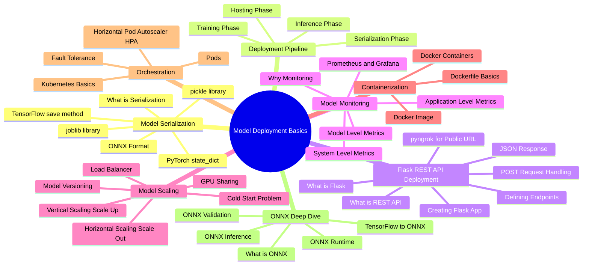
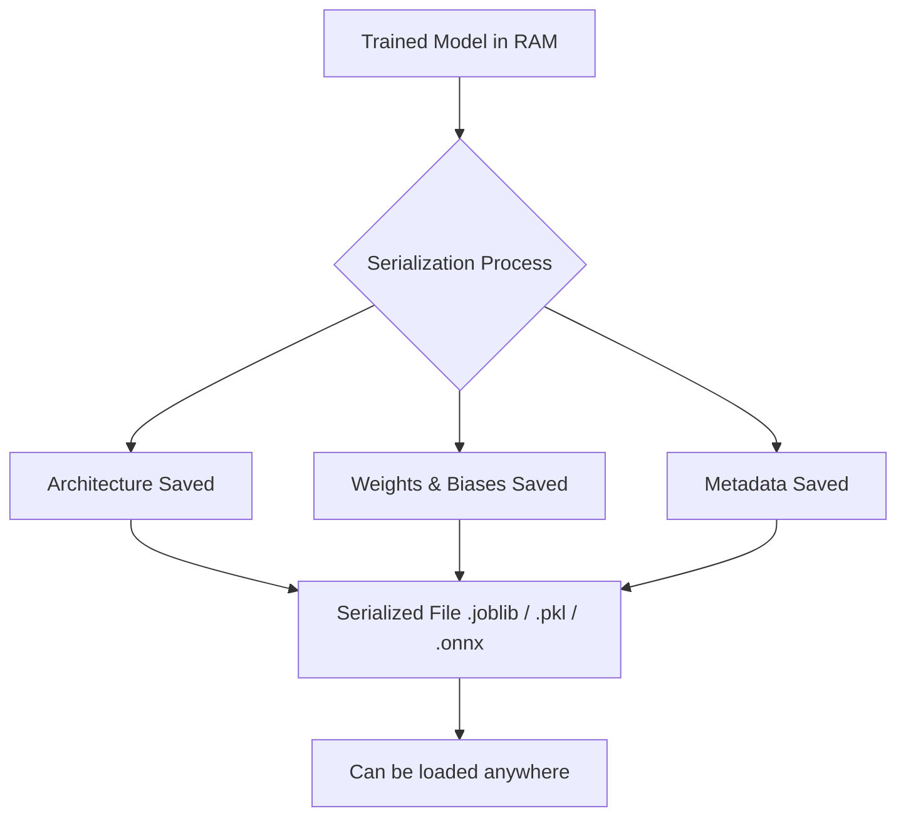
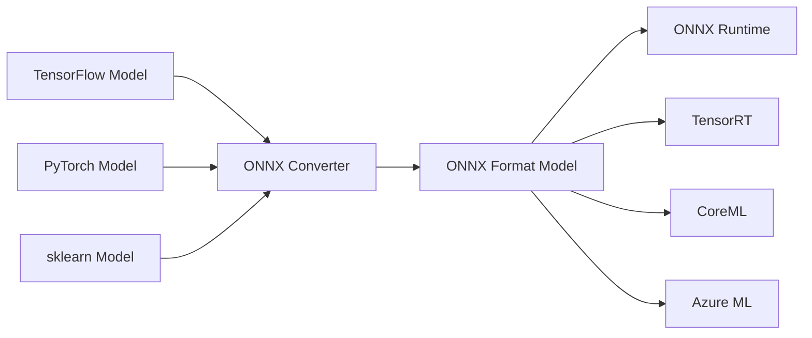
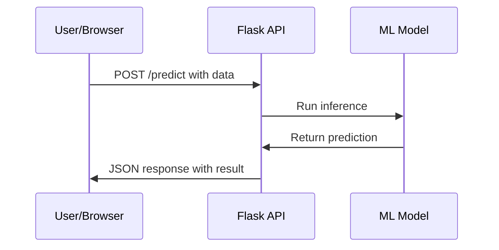
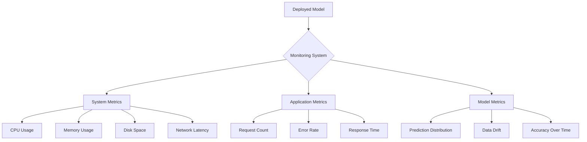
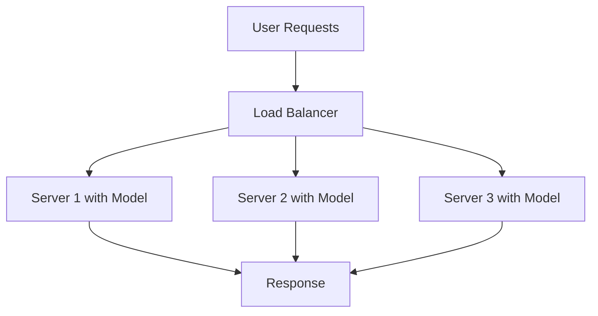
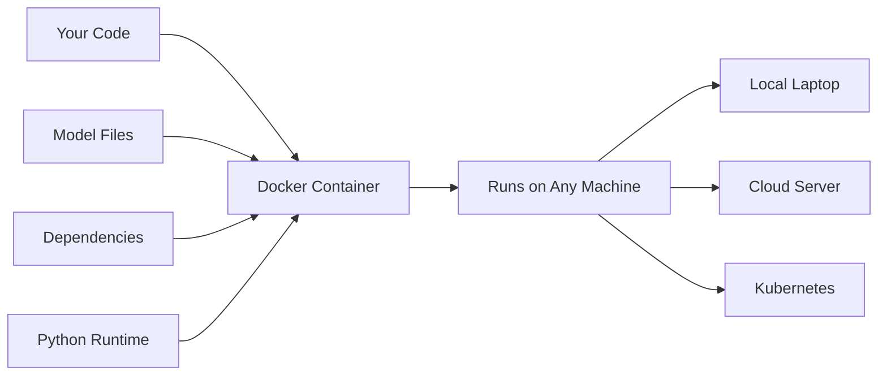
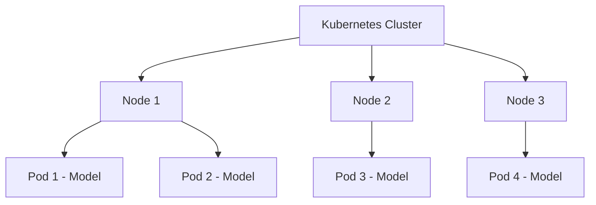
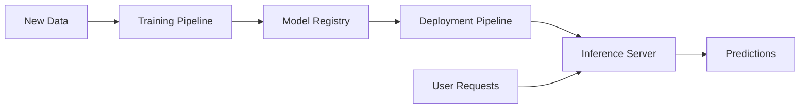
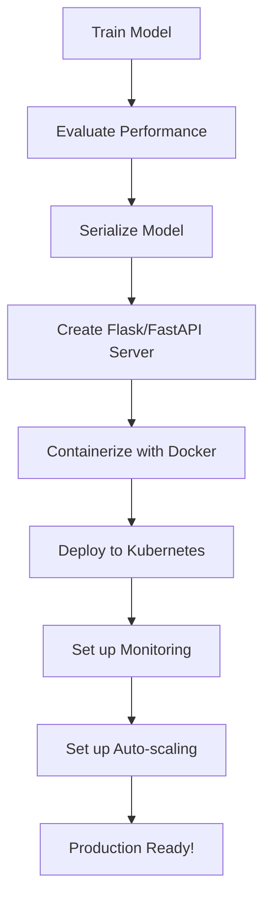

# CL37: Model Deployment Basics - Classroom Session

## 🗺️ Mind Map - Topics to Cover



---

## 🎓 Classroom Conversation

### Topic 1: Introduction to Model Deployment - Enduku Deployment Important?

**Teacher:** Namaskaram students! Ippudu mana oka chala important topic start cheddham - Model Deployment. Meeru antha varaku machine learning models train cheyyadam nerchukunaru - decisions trees, random forests, neural networks anni. Kani oka pedda question undhi - model train chesina tarvata emi chestham?

**Beginner Student:** Sir, model train ayyindi ante, adi finish ayinattlu kadha? W accuracy vachindi, model ready ah?

**Teacher:** Chala manchiga adugav! Idi exact ga chala mandi beginners chesina mistake. Meeru model train chesaru - weights tho, architecture tho. Kani adi just meeku meeru laptop lo undhi. Real world lo evaraina use cheyyalante emi cheyali?

Udaharanaku cheptha - meeru oka exam preparation center open chesaru. Meeru excellent ga teach chestaru. Kani meeru only oka room lo kurkuntaru ante, students vere cities lo unte ela vachcharu? Mee knowledge ni internet dwara, videos dwara accessible cheyali kadha? Same concept deployment ki kuda apply avthundhi!

**Clever Student:** Sir, ante mana trained model ni ekkadaina server lo pettali, and users internet through access cheyyali - adi deployment ah?

**Teacher:** Exactly Arjun! Mee understanding perfect. Deployment ante meeru train chesina model ni oka server lo host cheyyadam, and real-time lo users ki inference provide cheyyadam. 

Imagine cheyandi - meeru Google Photos open chesaru. Oka photo upload chesaru. Immediately adi "Dog" ani, "Beach" ani tags vestundhi. Ela? Background lo ML model running undhi, adi meeru upload chesina image chusi inference chesthundhi. Adi deployment power!

> 💡 **Jargon Alert - Inference**
> Simple Explanation: Model ki new data ichchi, prediction adagadam. Like - teacher ki oka question  ichchi answer adagadam.
> Example: Image ichchi "what animal is this?" ani adagadam.

**Practical Student:** Sir, interview lo adugutara deployment gurinchi? Companies lo exactly ela use chestharu?

**Teacher:** Excellent question! Let me tell you - deployment knowledge lekunda data scientist job dhooram. Every company ki trained model production lo pettali. Netflix, Amazon, Zomato - anni companies ML models deploy chestharu. Interview lo common questions:
- "How would you deploy your model?"
- "Explain the deployment pipeline"
- "What are the challenges in production ML?"

So, let's start understanding step by step!

---

### Topic 2: Model Serialization - Model ni File ga Save Cheyyadam

**Teacher:** First step deployment lo - Model Serialization. Meeru model train chesaru. Adi meeru laptop RAM lo undhi. Ippudu laptop off chesthe? Model poyindhi!

**Beginner Student:** Sir, serialization ante enti exactly? Chala difficult word laga undhi...

**Teacher:** Simple ga cheptha! Meeru oka recipe book raasaru. Adi meeru memory lo undhi. Ippudu future lo use cheyalante paper lo raayali kadha? Same - serialization ante meeru RAM lo unna model ni HARD DISK lo save cheyyadam. File format lo convert cheyyadam.

> 💡 **Jargon Alert - Serialization**
> Simple Explanation: Memory lo unna object ni file ga save cheyyadam. Like - meeru brain lo unna knowledge ni paper lo raayadam.
> Example: Trained model ni `.joblib` or `.pkl` file ga save cheyyadam.

**Clever Student:** Sir, model lo exactly enti save avthundhi? Weights matrame na leda architecture kuda?

**Teacher:** Brilliant question! Model save chesthunaappudu TWO things save avuthaayi:

1. **Model Architecture** - How many layers, how many neurons, what activation functions
2. **Weights and Biases** - Training lo nerchukunna values

Hyperparameters (like learning rate, epochs) save avvavu - enduku ante avi training kosam use chesam, already apply ayyayi. Model already trained state lo undhi!



**Critique Student:** Sir, oka doubt. Mana data kuda save avuthundha model lo? Data leak avutundha?

**Teacher:** Excellent security awareness! NO - training data NEVER save avvadhu model file lo. Only learned parameters save avuthaayi. So data leak problem undadhu. Model file chala lightweight untundhi compared to data.

---

### Topic 3: Serialization Libraries - pickle, joblib, TensorFlow, PyTorch

**Teacher:** Ippudu different libraries chuddam serialization kosam. Each library different purpose ki suit avthundhi.

#### 3.1 pickle Library

**Teacher:** Pickle - Python lo oldest serialization library. Any Python object ni serialize cheyyachu.

```python
import pickle

# Save model
with open('model.pkl', 'wb') as f:
    pickle.dump(trained_model, f)

# Load model
with open('model.pkl', 'rb') as f:
    loaded_model = pickle.load(f)
```

**Beginner Student:** Sir, pickle enduku use chestham? Idi oka only way ah?

**Teacher:** Pickle general purpose library. Python lo any object - dictionary, list, class - anni serialize cheyyachu. But ML models kosam better options unnayi!

**Curious Student:** Sir, pickle lo emi drawbacks unnayi? Enduku memu better options vethukutunnam?

**Teacher:** Great curiosity! Pickle has ONE BIG PROBLEM - **Security Risk!**

Pickle files open chesthe, malicious code run avvachu. Untrusted sources nundi pickle files load cheyyadam DANGEROUS. Interview lo adi cheppandi - "pickle is not secure for production use with untrusted files."

> 💡 **Jargon Alert - Malicious Code**
> Simple Explanation: Bad code that can harm your computer. Like - kottha person nundi unknown food tinadam - risk undhi.
> Example: Pickle file lo hidden code computer ni hack cheyyachu.

#### 3.2 joblib Library

**Teacher:** Joblib - sklearn models kosam RECOMMENDED library. Faster than pickle for large numpy arrays!

```python
import joblib

# Save model
joblib.dump(trained_model, 'model.joblib')

# Load model
loaded_model = joblib.load('model.joblib')
```

**Practical Student:** Sir, interview lo joblib vs pickle adugutara? Simple ga ela explain cheyali?

**Teacher:** Simple answer: "joblib is optimized for sklearn models and large numpy arrays. It's faster and more efficient. For sklearn models, always use joblib over pickle."

| Feature | pickle | joblib |
|---------|--------|--------|
| Speed for NumPy | Slow | Fast |
| Security | Risk | Same Risk |
| Best for | General Python objects | sklearn models |
| File size | Larger | Compressed |

**Debate Student:** Sir, JDG joblib kuda same security risk undhi ante, enduku use chestham?

**Teacher:** Valid point! Security risk internal use lo minor problem. Ek organization lo internal team save and load chesthu unte, trust undhi. Problem external untrusted sources nundhi files accept chesthunte vastundhi. Production lo, ONNX use cheyyadam better!

#### 3.3 TensorFlow save() Method

**Teacher:** TensorFlow models kosam TensorFlow's own method undhi:

```python
import tensorflow as tf

# Save entire model
model.save('my_model')  # Creates a folder

# Load model
loaded_model = tf.keras.models.load_model('my_model')
```

**Clever Student:** Sir, TensorFlow save chesthe oka folder create chesthundhi - why not single file?

**Teacher:** TensorFlow saves multiple things:
- Model architecture (JSON)
- Weights (HDF5 or TF format)  
- Training configuration
- Optimizer state

All these separate files in folder. Alternative ga single file kuda save cheyyachu:

```python
model.save('my_model.h5')  # Single HDF5 file
```

#### 3.4 PyTorch state_dict

**Teacher:** PyTorch lo different approach undhi. Weights matrame save chestharu:

```python
import torch

# Save only weights
torch.save(model.state_dict(), 'model_weights.pth')

# Load (need to create architecture first!)
model = MyModelClass()  # Create same architecture
model.load_state_dict(torch.load('model_weights.pth'))
```

**Beginner Student:** Sir, PyTorch lo architecture separate ga define cheyali ante effort ekkuva kadha?

**Teacher:** Correct! But flexibility ekkuva. Architecture modify chesi same weights use cheyyachu. Also file size smaller. Trade-off undhi always!

---

### Topic 4: ONNX - Open Neural Network Exchange

**Teacher:** Ippudu most important topic - ONNX! Idi industry standard for deployment.

**Beginner Student:** Sir, ONNX enti? Pronunciation kuda confusing ga undhi!

**Teacher:** ONNX pronounce cheyyadam "O-N-N-X" (each letter separately) or some say "onnix". Full form: **Open Neural Network Exchange**.

Real life analogy cheptha: Meeru Telugu lo letter raasaru. Mee friend Hindi matrame artham avthadu. Emi chestaru? Translate chestharu! Same - TensorFlow model ni PyTorch runtime lo run cheyyalante translate cheyali. ONNX is that common translation format!



> 💡 **Jargon Alert - ONNX**
> Simple Explanation: Universal translator for ML models. Any framework lo train cheyandi, anywhere run cheyandi.
> Example: Telugu to English translator - different languages common ga matladatam enable chesthundhi.

**Debate Student:** Sir, andaru TensorFlow use chesthunnaru, PyTorch use chesthunnaru. Separate ONNX enduku? Extra step kadha?

**Teacher:** Excellent debate point! Let me explain the PROBLEM first:

Meeru TensorFlow lo model train chesaru. Mee client uses Azure with PyTorch runtime. Emi chestharu? Model rewrite cheyali ah? NO! ONNX ki convert cheyandi - works everywhere!

**Advantages of ONNX:**
1. **Framework Independence** - Train anywhere, deploy anywhere
2. **Optimized Runtime** - ONNX Runtime is highly optimized
3. **Hardware Acceleration** - Works with GPUs, TPUs, specialized hardware
4. **Industry Standard** - Microsoft, Facebook, Amazon - all support

**Practical Student:** Sir, actual code ela untundhi ONNX conversion ki?

**Teacher:** Good question! TensorFlow to ONNX conversion:

```python
import tensorflow as tf
import tf2onnx
import onnx

# Trained TensorFlow model ready undhi
model = tf.keras.models.load_model('my_model')

# Define input signature
spec = (tf.TensorSpec((None, 28, 28), tf.float32, name="input"),)

# Create a function from model
@tf.function(input_signature=spec)
def model_func(x):
    return model(x)

# Convert to ONNX
onnx_model, _ = tf2onnx.convert.from_function(
    model_func,
    input_signature=spec,
    opset=13  # ONNX version
)

# Save ONNX model
with open("model.onnx", "wb") as f:
    f.write(onnx_model.SerializeToString())

# Validate
onnx.checker.check_model(onnx_model)
print("Model is valid!")
```

**Curious Student:** Sir, opset=13 ante enti? Adi change chesthey emi avuthundhi?

**Teacher:** Excellent curiosity! opset ante ONNX version number. Higher opset = more operators supported. opset 13 means ONNX version 13 compatibility.

Lower opset - older runtimes work
Higher opset - newer features available

Always use reasonable recent opset (11-15 range) for best compatibility.

#### ONNX Inference with ONNX Runtime

**Teacher:** ONNX model ready ayyindi. Ippudu inference cheddham:

```python
import onnxruntime as ort
import numpy as np

# Load ONNX model in session
ort_session = ort.InferenceSession("model.onnx")

# Get input name
input_name = ort_session.get_inputs()[0].name
print(f"Input name: {input_name}")

# Prepare test data
x_test = np.random.rand(3, 28, 28).astype("float32")

# Run inference
outputs = ort_session.run(None, {input_name: x_test})

# Get predictions
predictions = np.argmax(outputs[0], axis=1)
print(f"Predicted classes: {predictions}")
```

**Beginner Student:** Sir, TensorFlow lo kuda inference cheyyachu kadha? ONNX Runtime enduku use cheyali?

**Teacher:** Great question! Comparison chuddam:

| Aspect | TensorFlow Inference | ONNX Runtime |
|--------|---------------------|--------------|
| Speed | Good | Faster (optimized) |
| Memory | Higher | Lower |
| Dependencies | TensorFlow full install | Lightweight onnxruntime |
| Cross-platform | Python focused | C++, Java, JS, Mobile |
| Hardware | GPU support | GPU + specialized accelerators |

ONNX Runtime is specifically optimized for inference - production lo better performance!

---

### Topic 5: Flask REST API Deployment

**Teacher:** Model ready, serialized. Ippudu adi users ki available cheddham through Flask REST API!

**Beginner Student:** Sir, Flask enti? REST API enti? Both chala new terms...

**Teacher:** Okay, step by step explain chestha!

#### What is Flask?

**Teacher:** Flask is a Python library to create web applications. Chala lightweight and simple.

Real life analogy: Meeru oka restaurant open chestunnaru. Flask is like the restaurant building + tables + kitchen setup. Meeru just food (model) provide cheyali, Flask infrastructure handle chesthundhi.

> 💡 **Jargon Alert - Flask**
> Simple Explanation: Python lo small websites or APIs create cheyyataniki library. Light and easy to use.
> Example: Restaurant ki building - meeru food matrame focus cheyandi, building provide chesthundhi Flask.

#### What is REST API?

**Teacher:** REST API is a way for computers to talk to each other over internet.

Simple analogy: Meeru restaurant lo order ivvali. Menu chusi, waiter ki chepparu - "Biryani please." Waiter kitchen ki velli, Biryani techchi meeku istaru.

REST API lo:
- **Meeru (Client)** = User or application
- **Waiter (API)** = Communication layer  
- **Kitchen (Server)** = Where model runs
- **Biryani (Response)** = Prediction result



**Clever Student:** Sir, POST, GET enti? Different types of requests ah?

**Teacher:** Yes! HTTP methods:

| Method | Purpose | Example |
|--------|---------|---------|
| GET | Retrieve data | Get webpage, Get information |
| POST | Send data for processing | Send image for prediction |
| PUT | Update existing data | Update user profile |
| DELETE | Remove data | Delete account |

ML deployment lo mostly POST use chestharu - data send chesi prediction receive cheyataniki.

#### Flask App for Model Deployment

**Teacher:** Ippudu actual code chuddam:

```python
from flask import Flask, request, jsonify
import joblib
import numpy as np

# Create Flask app
app = Flask(__name__)

# Load model at startup
model_bundle = joblib.load('model/iris_rf.joblib')
model = model_bundle['model']
target_names = model_bundle.get('target_names', None)

# Root endpoint - information
@app.route('/')
def index():
    return 'Iris Model Server. Use POST /predict with JSON.'

# Prediction endpoint
@app.route('/predict', methods=['POST'])
def predict():
    # Get JSON data from request
    data = request.get_json(force=True)
    
    # Extract instances
    instances = data.get('instances', [])
    
    # Convert to numpy array
    arr = np.array(instances, dtype=float)
    
    # Make predictions
    predictions = model.predict(arr)
    
    # Prepare response
    response = {
        'predictions': predictions.tolist(),
        'labels': [target_names[int(p)] for p in predictions]
    }
    
    return jsonify(response)

if __name__ == '__main__':
    app.run(host='0.0.0.0', port=5000)
```

**Beginner Student:** Sir, line by line explain chestara? Chala confusion undhi...

**Teacher:** Absolutely! Let's break it down:

**Line 1-3: Imports**
- `Flask` - Main web framework
- `request` - To get data from user
- `jsonify` - To send JSON response

**Line 6: Create App**
```python
app = Flask(__name__)
```
Idi Flask application create chesthundhi. `__name__` current file name istundhi.

**Line 8-11: Load Model**
```python
model_bundle = joblib.load('model/iris_rf.joblib')
model = model_bundle['model']
target_names = model_bundle.get('target_names', None)
```
App start avvaganey model load chesthundhi. Oka saari load - multiple predictions use cheyachu.

**Line 13-16: Root Endpoint**
```python
@app.route('/')
def index():
    return 'Iris Model Server...'
```
`@app.route('/')` means - when someone visits main URL, run this function. Information display chesthundhi.

**Line 18-35: Predict Endpoint**
```python
@app.route('/predict', methods=['POST'])
def predict():
    # ...
```
`/predict` URL ki POST request vasthe ee function run avuthundhi. This is heart of our API!

**Critique Student:** Sir, error handling ledhu code lo. Production lo emi avuthundhi errors vasthe?

**Teacher:** Excellent observation! Production code lo error handling MUST. Let me show improved version:

```python
@app.route('/predict', methods=['POST'])
def predict():
    try:
        data = request.get_json(force=True)
        if not data or 'instances' not in data:
            return jsonify({'error': 'Missing instances in request'}), 400
        
        instances = data['instances']
        arr = np.array(instances, dtype=float)
        predictions = model.predict(arr)
        
        response = {
            'predictions': predictions.tolist(),
            'labels': [target_names[int(p)] for p in predictions]
        }
        return jsonify(response), 200
        
    except Exception as e:
        return jsonify({'error': str(e)}), 500
```

HTTP Status codes:
- `200` = Success
- `400` = Bad Request (user error)
- `500` = Server Error (our error)

**Practical Student:** Sir, real lo flask app ela run chestharu? Local host vs production difference enti?

**Teacher:** Great practical question!

**Local Development:**
```bash
python app.py
# Runs on http://localhost:5000
```

**Production (with Gunicorn - WSGI server):**
```bash
gunicorn -w 4 app:app
# 4 worker processes for handling multiple requests
```

> 💡 **Jargon Alert - WSGI (Gunicorn)**
> Simple Explanation: Production grade server. Flask alone is like practice kitchen, Gunicorn is professional restaurant kitchen - handles many orders simultaneously.
> Example: Local Flask = Home cooking, Gunicorn = Professional restaurant service.

#### pyngrok for Public Testing

**Teacher:** Local lo running but internet nundi access cheyyalante? pyngrok use cheyandi!

```python
from pyngrok import ngrok

# Set auth token (from ngrok.com account)
ngrok.set_auth_token("your_token_here")

# Create public tunnel
public_url = ng.connect(5000)
print(f"Public URL: {public_url}")
```

Now anyone on internet can access `public_url` and use your model!

---

### Topic 6: Model Monitoring - Model Performance Track Cheyyadam

**Teacher:** Model deployed! Users using. Ayithe ippudu emi? Just vdali pettali ah?

**Beginner Student:** Sir, model deploy ayyindi ante work aipoyindhi kadha? Inkemi cheyali?

**Teacher:** Excellent question! Ikkada chala mandi mistake chestharu. Deployment is NOT the end - monitoring START avuthundhi!

Real analogy: Meeru car konnaru. Drive chesthunnaru. Ma car ni monitor cheyyala - fuel, oil, temperature. Same - model ki kuda continuous monitoring kavali!

**Questions to ask daily:**
1. Is the model still running?
2. Is it giving predictions fast enough?
3. Are predictions still accurate?
4. Is anything unusual happening?



**Clever Student:** Sir, Prometheus, Grafana ante enti? Interview lo cheppamantaru...

**Teacher:** Prometheus and Grafana are monitoring TOOLS.

**Prometheus:** 
- Collects metrics from your application
- Stores them in time-series database
- Like a data collector that keeps recording

**Grafana:**
- Visualization tool
- Creates beautiful dashboards
- Shows graphs, charts, alerts

> 💡 **Jargon Alert - Prometheus & Grafana**
> Simple Explanation: Prometheus = CCTV recording. Grafana = TV monitor chusi chudadam. Together - full surveillance system.
> Example: Hospital lo patient vitals continuous monitor - same concept deployment ki.

**Critique Student:** Sir, oka valid question. Prometheus lo model accuracy monitor cheyyachu ah? Direct ga?

**Teacher:** Very insightful question! Short answer: NO, not directly.

Prometheus monitors INFRASTRUCTURE metrics - CPU, memory, request count. For MODEL accuracy monitoring, meeru custom pipelines build cheyali:

1. Store predictions and actual outcomes
2. Compare periodically
3. Calculate accuracy over time
4. Alert if accuracy drops

Idi separate ML monitoring pipeline - tools like MLflow, Evidently AI help!

---

### Topic 7: Model Scaling - More Users Handle Cheyyadam

**Teacher:** Meeru model deploy chesaru. 10 users use chesthunnaru - perfect! Suddenly 10,000 users vasthe? System crash!

**Beginner Student:** Sir, scaling ante exactly enti? Ela handle chestham?

**Teacher:** Scaling ante - MORE CAPACITY ADD CHEYYADAM. Two types:

#### Vertical Scaling (Scale Up)

**Teacher:** UPGRADE your existing machine. More powerful computer.

```
Before: 4 CPU, 8 GB RAM
After:  16 CPU, 64 GB RAM (Same machine, better hardware)
```

Real analogy: Meeru restaurant run chesthunnaru. Customers ekkuva. Emi chestharu? Bigger kitchen install cheyandi same building lo!

**Advantages:**
- Simple to manage
- No code changes needed

**Disadvantages:**
- Hardware limits undhi - max capacity vachesariki?
- Expensive - high-end hardware is premium

#### Horizontal Scaling (Scale Out)

**Teacher:** ADD MORE MACHINES running same model.

```
Before: 1 server handling all requests
After:  5 servers sharing the load
```

Real analogy: Restaurant chala successful. Bigger kitchen limit ki vachindi. Emi chestharu? 5 restaurants open cheyandi! Same menu everywhere!

**Advantages:**
- Theoretically unlimited scaling
- Fault tolerance - one fails, others work
- Cost effective (use commodity hardware)

**Disadvantages:**
- Complex to manage
- Need load balancer
- Data sync issues possible

**Debate Student:** Sir, which is better - scale up or scale out? Interview lo adugutara.

**Teacher:** Interview lo this is COMMON QUESTION! Answer:

"Scale out is generally preferred for production ML systems because:
1. Fault tolerance - if one server fails, others handle traffic
2. No hardware limits
3. Cost effective at scale

However, scale up might be used initially or for specific GPU-heavy models."

Remember: Most real-world ML systems use SCALE OUT!

> 💡 **Jargon Alert - Load Balancer**
> Simple Explanation: Traffic police for your servers.Incoming requests ni different servers ki distribute chesthundhi equally.
> Example: School lo students different rooms ki divide cheyyadam - each room teacher ni equally load distribute.



#### Cold Start Problem

**Curious Student:** Sir, cold start problem antunnaru transcript lo. Adi enti?

**Teacher:** Great observation! When you scale out and add new server, that server needs time to:
1. Start the container
2. Load the model into memory
3. Warm up connections

This "startup time" is called **Cold Start**. Large models ki 30-90 seconds pattachu!

Problem: User request vasthe, new server start avvakapothe, waiting!

Solutions:
- Keep minimum servers always running (warm pool)
- Pre-warm servers during low traffic
- Use faster model loading techniques

---

### Topic 8: Containerization with Docker

**Teacher:** Docker is the MOST IMPORTANT deployment tool today! Idi ardam kakapote deployment ardam kaadu.

**Beginner Student:** Sir, Docker container enti? Normal file sharing tho difference enti?

**Teacher:** Excellent question! Let me explain with analogy.

**Problem without Docker:**
Meeru model develop chesaru Windows lo. Mee friend run cheyyali Linux lo. Dependencies different, Python version different, libraries different. CHAOS!

"Works on my machine!" - most frustrating sentence in software.

**Docker Solution:**
Meeru COMPLETE ENVIRONMENT package chestharu:
- Operating system
- Python version
- All libraries
- Your code
- Your model

All in ONE package called **Container**. This container runs EXACTLY SAME everywhere!



> 💡 **Jargon Alert - Docker Container**
> Simple Explanation: Oka box lo meeru complete room pettinatu - furniture, AC, TV anni. Aa box ekkadaina open chesthey ready room!
> Example: Meeru Biryani chesthu pot tho rasam, spices, rice anni oka box lo pack chesaru. Ekkadaina box open chesi heat chesthey same Biryani!

**Practical Student:** Sir, Dockerfile ela raayali? Basic example cheppandi.

**Teacher:** Dockerfile is a recipe to build your container:

```dockerfile
# Start from Python base image
FROM python:3.8-slim

# Set working directory
WORKDIR /app

# Copy requirements file
COPY requirements.txt .

# Install dependencies
RUN pip install -r requirements.txt

# Copy application code
COPY . .

# Expose Flask port
EXPOSE 5000

# Command to run app
CMD ["python", "app.py"]
```

Line by line:
1. `FROM` - Start with Python 3.8 image
2. `WORKDIR` - Working folder /app
3. `COPY requirements.txt .` - Copy requirements file
4. `RUN pip install` - Install libraries
5. `COPY . .` - Copy all code
6. `EXPOSE 5000` - Port open for Flask
7. `CMD` - Command to start app

**Build and run:**
```bash
docker build -t my-ml-app .
docker run -p 5000:5000 my-ml-app
```

---

### Topic 9: Kubernetes Orchestration

**Teacher:** Docker containers ready. Kani 100 containers manage cheyyali. Emi chestham? Kubernetes!

**Beginner Student:** Sir, Kubernetes enti? Docker tho difference enti?

**Teacher:** Think of it this way:
- **Docker** = Single container create and run
- **Kubernetes** = MANY containers manage, scale, heal

Real analogy:
- Docker = One restaurant run cheyyadam
- Kubernetes = 100 restaurants chain manage cheyyadam - staff scheduling, inventory, quality control

> 💡 **Jargon Alert - Kubernetes (K8s)**
> Simple Explanation: Container orchestration platform. Many containers manage, scale up/down, restart if failed - all automatic.
> Example: Army general - soldiers (containers) deploy cheyyadam, manage cheyyadam, rescue cheyyadam.

#### Pods - Basic Unit

**Teacher:** Kubernetes lo basic unit is **Pod**. Pod = one or more containers together.

Usually: 1 Pod = 1 Container = 1 Model instance



**Clever Student:** Sir, Kubernetes automatic ga pods add chesthundha? Ela work avuthundhi?

**Teacher:** Yes! This is called **Horizontal Pod Autoscaler (HPA)**.

You define:
```yaml
minReplicas: 2
maxReplicas: 10
targetCPUUtilization: 60%
```

Meaning:
- Minimum 2 pods always running
- Maximum 10 pods can scale to
- When CPU crosses 60%, add more pods
- When CPU drops, remove pods

Kubernetes automatically handles this! 

**Practical Student:** Sir, interview lo Kubernetes questions ela answer cheyali?

**Teacher:** Common interview questions and answers:

**Q1: What is a Pod?**
A: "Pod is smallest deployable unit in Kubernetes. Usually contains one container running one service."

**Q2: How does Kubernetes handle failures?**
A: "If a pod fails, Kubernetes automatically restarts it. If a node fails, pods are rescheduled to other nodes."

**Q3: What is HPA?**
A: "Horizontal Pod Autoscaler automatically scales pods based on CPU, memory, or custom metrics."

---

### Topic 10: Flask vs Gradio - Quick Comparison

**Debate Student:** Sir, Flask and Gradio difference enti? Both API create chesthaayi kadha?

**Teacher:** Good comparison question!

| Feature | Flask | Gradio |
|---------|-------|--------|
| Purpose | General web apps | ML model demos |
| UI | Manual coding needed | Automatic UI |
| Complexity | More control, more code | Simple, few lines |
| Best for | Production APIs | Quick demos, prototypes |
| Learning curve | Steeper | Very easy |

**Flask example:**
```python
# 30+ lines of code for API
```

**Gradio example:**
```python
import gradio as gr

def predict(image):
    return model.predict(image)

gr.Interface(fn=predict, inputs="image", outputs="label").launch()
# 4 lines - complete UI with prediction!
```

**Practical Student:** Sir, interview lo which one cheppali use chestharu ani?

**Teacher:** Safe answer: "Flask for production APIs, Gradio for quick demos and prototypes. In production, I would use Flask or FastAPI for robustness and control."

---

### Topic 11: Model Versioning

**Curious Student:** Sir, model multiple versions unte ela manage chestharu? V1, V2, V3...

**Teacher:** Excellent question! Model versioning chala important!

**Three model states usually exist:**
1. **Development** - Still training, experimenting
2. **Testing** - Internal testing, validation  
3. **Production** - Live, serving users

**Versioning strategies:**
1. File naming: `model_v1.onnx`, `model_v2.onnx`
2. Folder structure: `models/v1/`, `models/v2/`
3. Model registry tools: MLflow, DVC

**When upgrading:**
1. Deploy new version alongside old (blue-green deployment)
2. Route small traffic to new version
3. Monitor performance
4. If good, gradually shift all traffic
5. Keep old version as backup

> 💡 **Jargon Alert - Blue-Green Deployment**
> Simple Explanation: Two environments running - Blue (old) and Green (new). Traffic switch instant ga cheyachu.
> Example: Old restaurant (Blue) running, new restaurant (Green) ready. Customers slowly Green ki shift.

---

### Topic 12: Training vs Inference Separation

**Practical Student:** Sir, production lo training and inference same time lo run avthaya?

**Teacher:** GREAT question! Short answer: NO, almost never!

**Why separate?**
1. **Resource conflict** - Training needs massive resources, inference needs fast response
2. **Stability** - Training can fail/crash, shouldn't affect live predictions
3. **Different requirements** - Training = throughput, Inference  = latency

**Typical workflow:**


ChatGPT example:
- Your prompts don't train the model real-time
- Prompts are STORED
- Later, offline training happens with collected data
- New model deployed separately

---

## 📝 Teacher Summary

**Teacher:** Okay students, let's summarize everything we learned today!

### Key Takeaways

1. **Model Deployment** is essential - trained model must reach users
2. **Serialization** saves model (architecture + weights) to file
3. **joblib** for sklearn, **TensorFlow save()** for TF, **state_dict** for PyTorch
4. **ONNX** is industry standard - train anywhere, deploy anywhere
5. **Flask REST API** serves predictions via HTTP endpoints
6. **Monitoring** tracks system, application, and model metrics
7. **Scaling** - Vertical (bigger machine) vs Horizontal (more machines)
8. **Docker** packages complete environment in containers
9. **Kubernetes** orchestrates many containers
10. **Training and Inference** should be SEPARATED in production

### Common Mistakes to Avoid

1. **Mistake:** Using pickle for production deployment
   **Correct:** Use joblib for sklearn, ONNX for cross-platform

2. **Mistake:** Deploying without error handling
   **Correct:** Always have try-except, proper HTTP status codes

3. **Mistake:** Not monitoring deployed models
   **Correct:** Set up Prometheus/Grafana, track metrics

4. **Mistake:** Only vertical scaling
   **Correct:** Prefer horizontal scaling for fault tolerance

5. **Mistake:** Training and inference on same server
   **Correct:** Separate resources for training and serving

### Deployment Pipeline Summary



**Teacher:** Ikkada class end avuthundhi. Next class lo memu hands-on deployment practice cheddham! Any final questions?

**All Students:** Thank you sir! Chala clear ga explain chesaru!

---

## 📚 Jargon Glossary

| Term | Simple Explanation |
|------|-------------------|
| Serialization | Memory lo unna object ni file ga save cheyyadam |
| Inference | Model ki new data ichchi prediction adagadam |
| REST API | Computers internet lo matladukonataniki standard format |
| Flask | Python lo websites/APIs create cheyyataniki library |
| ONNX | Universal ML model format - anywhere deploy cheyyachu |
| Docker | Complete environment package cheyyataniki tool |
| Container | Packaged environment - code + dependencies + runtime |
| Kubernetes | Many containers manage cheyyataniki platform |
| Pod | Kubernetes lo smallest unit - usually one container |
| Load Balancer | Traffic distribute cheyyataniki middleware |
| Vertical Scaling | Same machine upgrade cheyyadam (more CPU/RAM) |
| Horizontal Scaling | More machines add cheyyadam |
| Cold Start | New server start avvatam ki pattey delay |
| HPA | Horizontal Pod Autoscaler - automatic scaling |
| Prometheus | Metrics collection tool |
| Grafana | Visualization and dashboard tool |
| Endpoint | API lo specific URL that handles requests |
| JSON | Data exchange format (human readable) |
| joblib | sklearn models serialize cheyyataniki library |
| state_dict | PyTorch model weights dictionary |
