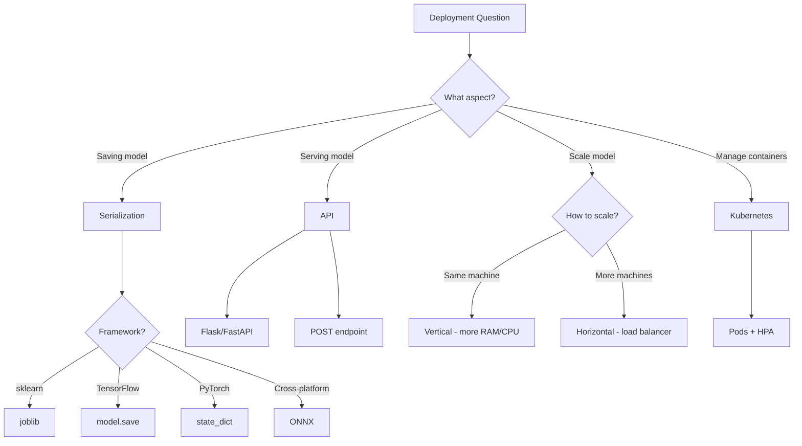

# CL37: Model Deployment Basics - Exam Preparation

---

## Section A: Multiple Choice Questions (MCQ) - 15 Questions

### MCQ 1
**Question:** What is Model Serialization in the context of ML deployment?

**Options:**
- A) Training a model with serial data
- B) Converting a trained model into a storable format without retraining
- C) Running multiple models in sequence
- D) Splitting a model into smaller parts

**✅ Correct Answer:** B

**📖 Explanation:** Serialization is the process of converting a trained model (architecture + weights) into a file format that can be stored, transferred, and later loaded for inference without needing to retrain.

**❌ Why Others Are Wrong:**
- A) Serial data training is unrelated to serialization
- C) Running models in sequence is pipeline orchestration, not serialization
- D) Model splitting is model parallelism, not serialization

---

### MCQ 2
**Question:** Which library is RECOMMENDED for serializing scikit-learn models?

**Options:**
- A) pickle
- B) joblib
- C) TensorFlow save()
- D) state_dict

**✅ Correct Answer:** B

**📖 Explanation:** joblib is specifically optimized for sklearn models and handles large numpy arrays more efficiently than pickle. It provides better compression and faster serialization for machine learning models.

**❌ Why Others Are Wrong:**
- A) pickle works but is less efficient for numpy arrays and has security concerns
- C) TensorFlow save() is for TensorFlow models, not sklearn
- D) state_dict is PyTorch's method for saving model weights

---

### MCQ 3
**Question:** What does ONNX stand for?

**Options:**
- A) Online Neural Network eXchange
- B) Open Neural Network Exchange
- C) Optimized Neural Network eXtension
- D) Open Node Network eXecution

**✅ Correct Answer:** B

**📖 Explanation:** ONNX stands for Open Neural Network Exchange. It's an open standard format that allows models trained in one framework (like TensorFlow or PyTorch) to run on different runtimes and platforms.

**❌ Why Others Are Wrong:**
- A) It's "Open" not "Online"
- C) "eXtension" is incorrect
- D) "Node Network" is wrong

---

### MCQ 4
**Question:** In Flask, which HTTP method is primarily used for sending data for model inference?

**Options:**
- A) GET
- B) DELETE
- C) POST
- D) PUT

**✅ Correct Answer:** C

**📖 Explanation:** POST method is used to send data to the server for processing. In ML deployment, we POST input data (like images or features) to the model endpoint and receive predictions in response.

**❌ Why Others Are Wrong:**
- A) GET is for retrieving data, not sending data
- B) DELETE is for removing data
- D) PUT is for updating existing data, not inference

---

### MCQ 5
**Question:** What is the main security concern with pickle serialization?

**Options:**
- A) Files are too large
- B) Slow loading speed
- C) Can execute malicious code when loading untrusted files
- D) Not compatible with Python 3

**✅ Correct Answer:** C

**📖 Explanation:** Pickle can execute arbitrary code during unpickling. If you load a pickle file from an untrusted source, it could run malicious code on your system, making it unsafe for production use with external files.

**❌ Why Others Are Wrong:**
- A) File size is not a security issue
- B) Speed is not a security concern
- D) Pickle is fully compatible with Python 3

---

### MCQ 6
**Question:** What is Vertical Scaling (Scale Up)?

**Options:**
- A) Adding more machines to handle load
- B) Increasing hardware resources on the same machine
- C) Reducing model size
- D) Creating multiple model versions

**✅ Correct Answer:** B

**📖 Explanation:** Vertical Scaling means upgrading the existing machine with more CPU, RAM, or GPU. You keep the same single machine but make it more powerful.

**❌ Why Others Are Wrong:**
- A) Adding more machines is Horizontal Scaling (Scale Out)
- C) Model compression is different from scaling
- D) Versioning is about model management, not scaling

---

### MCQ 7
**Question:** What is a Pod in Kubernetes?

**Options:**
- A) A type of Docker container
- B) The smallest deployable unit in Kubernetes
- C) A load balancing algorithm
- D) A monitoring tool

**✅ Correct Answer:** B

**📖 Explanation:** In Kubernetes, a Pod is the smallest deployable unit. It represents one or more containers running together on a shared network and storage context. Typically, one Pod runs one container with one model instance.

**❌ Why Others Are Wrong:**
- A) Pods are not containers; they contain containers
- C) Load balancing is handled by Services, not Pods
- D) Monitoring tools are Prometheus/Grafana, not Pods

---

### MCQ 8
**Question:** What does HPA stand for in Kubernetes?

**Options:**
- A) High Performance Architecture
- B) Horizontal Pod Autoscaler
- C) Hyperparameter Adjustment
- D) HTTP Protocol Adapter

**✅ Correct Answer:** B

**📖 Explanation:** HPA (Horizontal Pod Autoscaler) automatically scales the number of Pods based on CPU, memory, or custom metrics. When load increases, HPA adds more Pods; when load decreases, it removes Pods.

**❌ Why Others Are Wrong:**
- A) HPA is about scaling, not architecture
- C) Hyperparameter tuning is ML training related
- D) HTTP adapters are networking related

---

### MCQ 9
**Question:** What is the purpose of a Load Balancer in ML deployment?

**Options:**
- A) To train models faster
- B) To compress model weights
- C) To distribute incoming requests among multiple servers
- D) To monitor model accuracy

**✅ Correct Answer:** C

**📖 Explanation:** A Load Balancer distributes incoming inference requests across multiple model instances/servers. This ensures even distribution of work and prevents any single server from being overwhelmed.

**❌ Why Others Are Wrong:**
- A) Training speed is not related to load balancing
- B) Compression is a different technique
- D) Monitoring is done by tools like Prometheus

---

### MCQ 10
**Question:** What is the "Cold Start" problem in ML deployment?

**Options:**
- A) Model performing worse in cold weather
- B) Delay when spinning up new containers/servers to load the model
- C) CPU temperature issues
- D) Network latency in cold regions

**✅ Correct Answer:** B

**📖 Explanation:** Cold Start refers to the delay when new server instances start up. They need time to load the model into memory and warm up before serving requests. Large models can have 30-90 second cold start times.

**❌ Why Others Are Wrong:**
- A) Weather is not relevant to deployment
- C) CPU temperature is hardware issue, not deployment
- D) Geographic regions don't create "cold start"

---

### MCQ 11
**Question:** Which statement is TRUE about what gets saved during model serialization?

**Options:**
- A) Training data and model weights
- B) Model architecture, weights, biases, and hyperparameters
- C) Model architecture, weights, and biases (not hyperparameters)
- D) Only the model weights

**✅ Correct Answer:** C

**📖 Explanation:** Serialization saves the model architecture and learned parameters (weights and biases). Hyperparameters like learning rate are NOT saved because they were already used during training - we don't need them for inference.

**❌ Why Others Are Wrong:**
- A) Training data is NEVER saved with the model
- B) Hyperparameters are not needed for inference
- D) Architecture is also saved, not just weights

---

### MCQ 12
**Question:** What is the main advantage of ONNX over framework-specific formats?

**Options:**
- A) Smaller file sizes
- B) Faster training
- C) Framework independence - train anywhere, deploy anywhere
- D) Better accuracy

**✅ Correct Answer:** C

**📖 Explanation:** ONNX provides framework independence. You can train in TensorFlow, PyTorch, or sklearn, convert to ONNX, and deploy anywhere that supports ONNX Runtime - without rewriting deployment code.

**❌ Why Others Are Wrong:**
- A) File size depends on model, not format
- B) ONNX is for deployment, not training
- D) Accuracy depends on model, not serialization format

---

### MCQ 13
**Question:** In a Flask app, what does `@app.route('/predict', methods=['POST'])` do?

**Options:**
- A) Creates a new Flask application
- B) Defines that the predict() function handles POST requests to /predict URL
- C) Starts the Flask server
- D) Loads the machine learning model

**✅ Correct Answer:** B

**📖 Explanation:** This decorator maps the `/predict` URL endpoint to the function below it. When a POST request comes to `/predict`, Flask will call the decorated function (predict()) to handle it.

**❌ Why Others Are Wrong:**
- A) `Flask(__name__)` creates the application
- C) `app.run()` starts the server
- D) `joblib.load()` loads the model

---

### MCQ 14
**Question:** What is Docker Container?

**Options:**
- A) A virtual machine
- B) A packaged environment with code, dependencies, and runtime
- C) A type of database
- D) A monitoring dashboard

**✅ Correct Answer:** B

**📖 Explanation:** Docker Container packages everything needed to run an application - code, libraries, Python runtime, model files - into a single unit that runs consistently across any environment.

**❌ Why Others Are Wrong:**
- A) Containers are lighter than VMs; they share the OS kernel
- C) Docker is not for data storage
- D) Grafana is for dashboards, not Docker

---

### MCQ 15
**Question:** Why should training and inference be separated in production?

**Options:**
- A) They use the same resources efficiently together
- B) Training needs massive resources while inference needs fast response
- C) They must run on the same server
- D) Inference doesn't need a model

**✅ Correct Answer:** B

**📖 Explanation:** Training is resource-intensive (GPU, memory) and can be slow. Inference needs low latency for user requests. Separating them prevents resource conflicts and ensures stable production service.

**❌ Why Others Are Wrong:**
- A) They compete for resources when together
- C) They should NOT run on the same server
- D) Inference definitely needs a trained model

---

## Section B: Multiple Select Questions (MSQ) - 10 Questions

### MSQ 1
**Question:** Which of the following are valid model serialization methods? (Select ALL that apply)

**Options:**
- A) pickle.dump()
- B) joblib.dump()
- C) model.save() in TensorFlow
- D) torch.save(model.state_dict())
- E) onnx.convert()

**✅ Correct Answers:** A, B, C, D

**📖 Explanation:** 
- A) pickle.dump() - saves any Python object
- B) joblib.dump() - recommended for sklearn
- C) model.save() - TensorFlow/Keras method
- D) torch.save(state_dict) - PyTorch method

**❌ Why E is Wrong:**
- E) ONNX conversion uses tf2onnx.convert or other converters, not onnx.convert()

---

### MSQ 2
**Question:** What information is saved when serializing a trained neural network? (Select ALL that apply)

**Options:**
- A) Model architecture (layers, neurons)
- B) Weights and biases
- C) Training dataset
- D) Learning rate
- E) Target class names (if included)

**✅ Correct Answers:** A, B, E

**📖 Explanation:** 
- Architecture (A) and learned parameters (B) are saved
- Metadata like target class names (E) can be saved optionally
- Training data and hyperparameters are NOT saved

**❌ Why Others Are Wrong:**
- C) Training data is NEVER saved - security risk and unnecessary
- D) Learning rate is a hyperparameter used only during training

---

### MSQ 3
**Question:** Which are valid HTTP methods used in REST APIs? (Select ALL that apply)

**Options:**
- A) GET
- B) POST
- C) PUSH
- D) DELETE
- E) PUT

**✅ Correct Answers:** A, B, D, E

**📖 Explanation:** 
- GET - retrieve data
- POST - send data for processing
- DELETE - remove data
- PUT - update existing data

**❌ Why C is Wrong:**
- C) PUSH is not a standard HTTP method; you might be thinking of POST

---

### MSQ 4
**Question:** What are the advantages of Horizontal Scaling (Scale Out)? (Select ALL that apply)

**Options:**
- A) Fault tolerance - if one server fails, others work
- B) Simpler to manage than vertical scaling
- C) Theoretically unlimited scaling
- D) Cost effective at large scale
- E) No load balancer needed

**✅ Correct Answers:** A, C, D

**📖 Explanation:** 
- A) Multiple servers provide redundancy
- C) You can keep adding servers as needed
- D) Commodity hardware is cheaper than super-powerful single servers

**❌ Why Others Are Wrong:**
- B) Horizontal scaling is MORE complex to manage (needs orchestration)
- E) Load balancer IS needed to distribute traffic

---

### MSQ 5
**Question:** Which are components/features of Kubernetes? (Select ALL that apply)

**Options:**
- A) Pods
- B) Horizontal Pod Autoscaler
- C) Flask
- D) Automatic health checks
- E) Container scheduling

**✅ Correct Answers:** A, B, D, E

**📖 Explanation:** 
- A) Pods - basic deployment unit
- B) HPA - automatic scaling
- D) Health checks - restart failed pods
- E) Scheduling - assigns pods to nodes

**❌ Why C is Wrong:**
- C) Flask is a Python web framework, not part of Kubernetes

---

### MSQ 6
**Question:** What should you monitor in a deployed ML model? (Select ALL that apply)

**Options:**
- A) CPU usage
- B) Memory usage
- C) Request latency
- D) Prediction accuracy over time
- E) Original training data

**✅ Correct Answers:** A, B, C, D

**📖 Explanation:** 
- System metrics (A, B) - for infrastructure health
- Application metrics (C) - for service quality
- Model metrics (D) - for model performance

**❌ Why E is Wrong:**
- E) Original training data is for training, not deployment monitoring

---

### MSQ 7
**Question:** What problems can occur when scaling ML deployments? (Select ALL that apply)

**Options:**
- A) Cold start delays
- B) GPU resource sharing conflicts
- C) Multiple model versioning complexity
- D) Better performance
- E) Load balancing overhead

**✅ Correct Answers:** A, B, C, E

**📖 Explanation:** 
- A) New containers take time to load models
- B) Multiple models competing for GPU memory
- C) Managing development/testing/production versions
- E) Load balancing adds overhead

**❌ Why D is Wrong:**
- D) Better performance is a benefit, not a problem

---

### MSQ 8
**Question:** What are benefits of using ONNX? (Select ALL that apply)

**Options:**
- A) Cross-platform compatibility
- B) Optimized inference runtime
- C) Faster training
- D) Hardware acceleration support
- E) Framework independence

**✅ Correct Answers:** A, B, D, E

**📖 Explanation:** 
- A) Works on different platforms (Windows, Linux, mobile)
- B) ONNX Runtime is highly optimized
- D) Supports GPUs, TPUs, specialized hardware
- E) Train in any framework, deploy anywhere

**❌ Why C is Wrong:**
- C) ONNX is for deployment/inference, not training

---

### MSQ 9
**Question:** What are key components of a Dockerfile for ML deployment? (Select ALL that apply)

**Options:**
- A) FROM - base image
- B) RUN pip install - install dependencies
- C) COPY - copy code and model files
- D) TRAIN - train the model
- E) CMD - command to run the app

**✅ Correct Answers:** A, B, C, E

**📖 Explanation:** 
- A) FROM sets base image (e.g., python:3.8)
- B) RUN installs required packages
- C) COPY brings code into container
- E) CMD defines startup command

**❌ Why D is Wrong:**
- D) TRAIN is not a Dockerfile instruction; training happens before containerization

---

### MSQ 10
**Question:** Which statements about model versioning are TRUE? (Select ALL that apply)

**Options:**
- A) Version names can be specified during serialization
- B) Blue-green deployment uses two environments
- C) Only one model version should exist
- D) Testing version is validated before production deployment
- E) Version management can use tools like MLflow

**✅ Correct Answers:** A, B, D, E

**📖 Explanation:** 
- A) File names like model_v1.onnx include version
- B) Blue-green runs old and new simultaneously
- D) Testing validates before promoting to production
- E) MLflow, DVC are version management tools

**❌ Why C is Wrong:**
- C) Multiple versions typically exist: development, testing, production

---

## Section C: Numerical/Calculation Questions - 5 Questions

### Numerical 1
**Question:** A model has 3 hidden layers with 128, 64, and 32 neurons respectively. Each layer uses the previous layer's output as input. The input layer has 784 neurons. How many weight parameters are there in total? (Ignore biases)

**Given:**
- Input layer: 784 neurons
- Hidden layer 1: 128 neurons
- Hidden layer 2: 64 neurons
- Hidden layer 3: 32 neurons (output)

**Solution Steps:**
1. Weights from Input to Hidden 1: 784 × 128 = 100,352
2. Weights from Hidden 1 to Hidden 2: 128 × 64 = 8,192
3. Weights from Hidden 2 to Hidden 3: 64 × 32 = 2,048
4. Total weights = 100,352 + 8,192 + 2,048 = 110,592

**✅ Final Answer:** 110,592 weight parameters

---

### Numerical 2
**Question:** An HPA is configured with minReplicas=2, maxReplicas=10, and targetCPU=60%. Current CPU utilization is 90%. How many pods should be running if the system scales proportionally?

**Given:**
- Current pods: 2 (minimum)
- Target CPU: 60%
- Current CPU: 90%

**Solution Steps:**
1. Scale factor = Current CPU / Target CPU = 90 / 60 = 1.5
2. Required pods = Current pods × Scale factor = 2 × 1.5 = 3
3. Round up for safety: 3 pods
4. Check limits: 3 is between min(2) and max(10) ✓

**✅ Final Answer:** 3 pods

---

### Numerical 3
**Question:** A Flask server can handle 50 requests per second (RPS). During peak hours, 200 RPS are expected. How many server instances are needed with horizontal scaling?

**Given:**
- Single server capacity: 50 RPS
- Peak demand: 200 RPS

**Solution Steps:**
1. Minimum instances needed = Peak demand / Server capacity
2. Minimum instances = 200 / 50 = 4
3. Add buffer for reliability (typically 20-50%): 4 × 1.25 = 5

**✅ Final Answer:** 5 server instances (4 minimum, 5 with buffer)

---

### Numerical 4
**Question:** Cold start time for a model is 30 seconds. Three model versions are loaded on demand. What is the worst-case total cold start time if all three are started simultaneously vs sequentially?

**Given:**
- Cold start per model: 30 seconds
- Number of models: 3

**Solution Steps:**
1. **Simultaneously** (parallel): All start at the same time
   - Total time = 30 seconds (all models load in parallel)
2. **Sequentially** (one after another):
   - Total time = 30 × 3 = 90 seconds

**✅ Final Answer:** Parallel = 30 seconds, Sequential = 90 seconds

---

### Numerical 5
**Question:** A serialized joblib model file is 45 MB. Docker image size is 500 MB base + model + 200 MB dependencies. What is the total Docker image size?

**Given:**
- Base image: 500 MB
- Model file: 45 MB
- Dependencies: 200 MB

**Solution Steps:**
1. Total = Base + Model + Dependencies
2. Total = 500 + 45 + 200 = 745 MB

**✅ Final Answer:** 745 MB

---

## Section D: Fill in the Blanks - 8 Questions

### Fill 1
**Question:** The process of converting a trained model into a storable file format is called _______.

**Answer:** Serialization

**Explanation:** Serialization converts the in-memory model (architecture + weights) into a file that can be saved to disk and later loaded for inference.

---

### Fill 2
**Question:** ONNX stands for Open _______ Network Exchange.

**Answer:** Neural

**Explanation:** ONNX = Open Neural Network Exchange, a universal format for ML models.

---

### Fill 3
**Question:** In Kubernetes, the smallest deployable unit is called a _______.

**Answer:** Pod

**Explanation:** Pods are the atomic unit of deployment in Kubernetes, typically containing one container.

---

### Fill 4
**Question:** Adding more CPU and RAM to an existing machine is called _______ scaling.

**Answer:** Vertical (or Scale Up)

**Explanation:** Vertical scaling upgrades the same machine vs horizontal scaling which adds more machines.

---

### Fill 5
**Question:** The delay when a new server starts and loads a model is called the _______ problem.

**Answer:** Cold Start

**Explanation:** Cold start refers to the initialization time needed for new instances to become ready for serving requests.

---

### Fill 6
**Question:** Flask uses the _______ decorator to map URLs to functions.

**Answer:** @app.route()

**Explanation:** @app.route('/path') tells Flask which function handles requests to that URL path.

---

### Fill 7
**Question:** In REST APIs, the _______ method is used to send data for processing.

**Answer:** POST

**Explanation:** POST method sends data in the request body for server-side processing, perfect for ML inference.

---

### Fill 8
**Question:** Prometheus is used for metrics collection, while _______ is used for visualization.

**Answer:** Grafana

**Explanation:** Prometheus collects and stores metrics; Grafana creates dashboards and visualizations from that data.

---

## 📚 Quick Revision Points

### Key Concepts Summary
| Concept | One-Line Definition | When to Use |
|---------|---------------------|-------------|
| Serialization | Convert model to file format | After training, before deployment |
| joblib | Optimized serialization for sklearn | Saving sklearn models |
| ONNX | Universal model format | Cross-platform deployment |
| Flask | Python web framework | Creating REST APIs |
| REST API | HTTP-based communication | Server-client interaction |
| Docker | Container packaging | Environment consistency |
| Kubernetes | Container orchestration | Large-scale deployment |
| Pod | Smallest K8s unit | Running containers |
| HPA | Auto-scaling pods | Handling variable load |
| Load Balancer | Distribute requests | Multiple server instances |
| Cold Start | New instance startup delay | Scaling considerations |
| Prometheus | Metrics collection | Monitoring performance |
| Grafana | Visualization dashboards | Viewing metrics |

### Key Takeaways
1. **Serialization** saves architecture + weights, NOT data or hyperparameters
2. **joblib** is preferred over pickle for sklearn models
3. **ONNX** enables framework-independent deployment
4. **POST** method is used for sending inference data
5. **Horizontal scaling** is preferred over vertical for fault tolerance
6. **Training and inference** should be separated in production
7. **Kubernetes** manages containers; Docker creates them
8. **Monitor** system, application, AND model metrics

### Common Exam Traps
1. **Trap:** "Hyperparameters are saved with the model"
   **Correct:** Only architecture and learned weights are saved
   
2. **Trap:** "pickle is secure for production"
   **Correct:** pickle has security vulnerabilities; use joblib or ONNX

3. **Trap:** "GET method for inference"
   **Correct:** POST method is used for sending data for inference

4. **Trap:** "Vertical scaling has no limits"
   **Correct:** Vertical scaling is limited by maximum hardware specs

5. **Trap:** "Training data is stored in serialized model"
   **Correct:** Training data is NEVER stored; only learned parameters

---

## 🚀 Section E: Shortcuts & Cheat Codes for Exam

### ⚡ One-Liner Shortcuts
| Concept | Shortcut/Cheat Code | When to Use |
|---------|---------------------|-------------|
| Serialization | "Memory → File" | When asked what serialization does |
| joblib vs pickle | "joblib = sklearn best friend" | Comparison questions |
| ONNX | "Universal translator for models" | Framework independence questions |
| POST vs GET | "POST = Send data, GET = Receive data" | HTTP method questions |
| HPA | "Auto chef hiring based on orders" | Kubernetes scaling |
| Pod | "Smallest box in Kubernetes" | K8s unit questions |
| Cold Start | "Morning coffee time for servers" | Startup delay questions |
| Vertical vs Horizontal | "Up = Same machine bigger, Out = More machines" | Scaling type questions |

### 🎯 Memory Tricks (Mnemonics)

1. **ONNX benefits: "FOHO"**
   - **F**ramework independent
   - **O**ptimized runtime
   - **H**ardware acceleration
   - **O**pen standard
   
2. **What's serialized: "AWM"**
   - **A**rchitecture
   - **W**eights
   - **M**etadata (optional, like class names)
   
3. **HTTP Methods: "GPDD"**
   - **G**ET - retrieve
   - **P**OST - process
   - **D**ELETE - remove
   - **P**UT/PATCH - update

4. **Monitoring levels: "SAM"**
   - **S**ystem (CPU, memory)
   - **A**pplication (latency, errors)
   - **M**odel (accuracy, drift)

### 🔢 Quick Calculation Hacks
| Scenario | Hack/Shortcut | Example |
|----------|---------------|---------|
| Weight count | prev_neurons × current_neurons | 784 × 128 = 100,352 |
| HPA scaling | (current_CPU / target_CPU) × current_pods | (90/60) × 2 = 3 pods |
| Server count | peak_demand / server_capacity + buffer | 200/50 × 1.25 = 5 |
| Sequential cold start | cold_time × num_models | 30s × 3 = 90s |

### 📝 Last-Minute Formula Sheet
```
📌 Weight Parameters = Σ (neurons_prev_layer × neurons_current_layer)
📌 HPA Scaling = (Current_CPU / Target_CPU) × Current_Pods
📌 Server Count = (Peak_RPS / Single_Server_RPS) × Safety_Factor
📌 Cold Start (Sequential) = Cold_Time × Number_of_Models
📌 Docker Image Size = Base + Dependencies + Model_Files
```

### 🎓 Interview One-Liners
| Question Pattern | Safe Answer Template |
|------------------|---------------------|
| "What is serialization?" | "Converting in-memory model to storable file format with architecture and weights" |
| "Why ONNX over native format?" | "Framework independence - train in any library, deploy anywhere" |
| "Horizontal vs Vertical scaling?" | "Vertical=bigger machine, Horizontal=more machines. Horizontal preferred for fault tolerance" |
| "What is Cold Start?" | "Delay when new server loads model into memory before serving requests" |
| "How to monitor ML models?" | "Three levels: System (CPU/memory), Application (latency), Model (accuracy/drift)" |
| "Why separate training and inference?" | "Different resource needs: training=compute heavy, inference=low latency required" |

### ⚠️ "If You Forget Everything, Remember This"
1. **Golden Rule 1:** Serialization saves ARCHITECTURE + WEIGHTS, never training data
2. **Golden Rule 2:** ONNX = Universal model format for cross-platform deployment
3. **Golden Rule 3:** Horizontal Scaling > Vertical Scaling for production (fault tolerance)
4. **Golden Rule 4:** POST method for sending inference data, GET for retrieving
5. **Golden Rule 5:** Always separate training infrastructure from inference infrastructure

### 🔄 Quick Decision Flowchart


### 🎯 Safe Answer Patterns
- **For "What is X?"** → Simple definition + One practical example
- **For "Compare X vs Y"** → Table with 3-4 differences + recommendation
- **For "Advantages of X"** → List 3 points with brief justification
- **For "Steps to deploy"** → Train → Serialize → Create API → Containerize → Deploy → Monitor
- **For "Why X?"** → Problem it solves + What happens without it
