# CL38: Backpropagation & ANN Fundamentals - Classroom Session

---

## 🗺️ Mind Map - Topics to Cover

```mermaid
mindmap
  root((Backpropagation & ANN))
    Neural Network Architecture
      Neurons
      Layers - Input, Hidden, Output
      Weights and Biases
      Fully Connected Network
    Activation Functions
      ReLU
      Sigmoid
      Tanh
      Softmax
      Why Non-linearity
    Forward Propagation
      Z = WX + b
      Applying Activation
      Layer by Layer Computation
      Getting Y-hat
    Loss Function
      Y vs Y-hat
      MSE Loss
      Cross Entropy
    Backpropagation
      Chain Rule
      Gradient Computation
      del L / del W
      del L / del b
      Error Propagation
    Weight Update
      Gradient Descent
      Learning Rate
      W_new = W_old - η × gradient
      Adam Optimizer
    Training vs Inference
      Forward + Backward Pass
      Forward Only
    ANN vs CNN
      Parameter Count
      Weight Sharing
      When to use which
    Practical Examples
      MNIST Dataset
      CIFAR-10 Dataset
      Activation Visualization
      Feature Maps
```



---

## 🎓 Classroom Conversation

### Topic 1: Neural Network Architecture Basics

**Teacher:** Okay students, ippudu mana neural network journey start cheddham. Mundu basic architecture ardham cheskundham. So what is a neural network actually?

Imagine cheyandi - mee brain lo neurons unnay, they're connected to each other, messages pass chestharu. Same concept - artificial neural network lo artificial neurons untayi, connected layers lo arranged.

> 💡 **Jargon Alert - Neuron**
> Simple Explanation: A neuron is like a small calculator that takes inputs, does math, and gives one output
> Example: Like a student who takes notes from multiple teachers, combines them, and writes one answer

**Beginner Student:** Sir, oka doubt. Mana human brain lo billions of neurons untayi. ANN lo enni neurons untayi?

**Teacher:** Excellent question! ANN lo neurons number mana choice - we decide based on the problem. Oka simple network lo 2-3 neurons undochu, complex networks lo millions undochu.

Let me show you the structure:


Ikkada three layers unnay:
1. **Input Layer** - Where you give your data (X1, X2)
2. **Hidden Layer** - Where computation happens (the "thinking" part)
3. **Output Layer** - Where you get prediction (Y-hat)

**Clever Student:** Sir, why is it called "hidden" layer? What's hidden there?

**Teacher:** Good thinking! "Hidden" ante users ki directly visible kaadu. Input layer - mana data direct ga ichham. Output layer - mana prediction direct ga vasthundi. But hidden layers - they're between input and output, we don't directly see their intermediate values during usage. That's why "hidden"!

**Practical Student:** Sir, interview lo aduguthey, how do I explain this architecture simply?

**Teacher:** Perfect interview answer: "Neural network is composed of layers of neurons. Each neuron receives inputs, multiplies with weights, adds bias, applies activation function, and passes output to next layer."

---

### Topic 2: Weights and Biases - The Learnable Parameters

**Teacher:** Ippudu mana network lo most important elements chuddam - Weights and Biases!

Think of it this way:
- **Weights** = Importance you give to each input (like marks weightage)
- **Bias** = Your starting point adjustment (like grace marks)

At each neuron, we calculate:

```
Z = W₁X₁ + W₂X₂ + ... + WₙXₙ + b
```

Idi linear combination antaru.

**Beginner Student:** Sir, weights initially ela set chestaru? We know the correct values beforehand aa?

**Teacher:** Chala important question! No, initially we DON'T know correct weights. So we:
1. Start with random values (random initialization)
2. Check the output (forward pass)
3. See the error (loss)
4. Adjust weights to reduce error (backpropagation)
5. Repeat until good accuracy!

Idi entire learning process!

**Critique Student:** Sir, random values tho start chesthey, sometimes model converge avvakunda poyina chance undaa?

**Teacher:** Absolutely valid concern! Yes, bad initialization can cause problems:
- **Too small weights** → Vanishing gradients
- **Too large weights** → Exploding gradients

That's why we use special initialization methods like Xavier, He initialization. They choose random values from a smart distribution.

**Debate Student:** Sir, why can't we just use zeros for all weights?

**Teacher:** Excellent trap question! If all weights are zero:
- All neurons will compute the same thing
- All gradients will be equal
- All neurons will update identically
- Network won't learn anything different!

This is called the **symmetry problem**. We need randomness to break symmetry.

> 💡 **Jargon Alert - Symmetry Breaking**
> Simple Explanation: Making neurons different so each learns something unique
> Example: Like assigning different topics to different students in a group project

---

### Topic 3: Activation Functions - Adding Non-linearity

**Teacher:** Ab mana main question - Z calculate chesam, but Z is just a linear combination. Why is that a problem?

**Curious Student:** Sir, linear functions stack chesthey kuda linear ee untundi kadaa?

**Teacher:** Exactly! You understood the core issue!

If we stack 100 linear layers:
```
Layer1: Z1 = W1*X
Layer2: Z2 = W2*Z1 = W2*W1*X
Layer3: Z3 = W3*Z2 = W3*W2*W1*X
...
```

Final result = Some W_combined * X = Still just one linear transformation!

100 layers == 1 layer mathematically! All that computation for nothing!

**Beginner Student:** Then how to solve this problem sir?

**Teacher:** We add **activation functions** - they add non-linearity!

Common activation functions:

| Function | Formula | Range | When to Use |
|----------|---------|-------|-------------|
| **ReLU** | max(0, x) | [0, ∞) | Hidden layers (most popular) |
| **Sigmoid** | 1/(1+e⁻ˣ) | (0, 1) | Binary output |
| **Tanh** | (eˣ-e⁻ˣ)/(eˣ+e⁻ˣ) | (-1, 1) | Hidden layers (older networks) |
| **Softmax** | eˣⁱ/Σeˣʲ | (0, 1), sum=1 | Multi-class output |


**Clever Student:** Sir, ReLU chala simple ga kanipistundi - just max(0,x). Why is this preferred over sigmoid?

**Teacher:** Brilliant question! Let me explain with a real problem:

**Sigmoid Problem - Vanishing Gradient:**
- Sigmoid derivative maximum = 0.25
- Deep network lo 10 layers unte: 0.25¹⁰ = 0.000001
- Gradient almost zero avuthundi!
- Early layer weights update avvavu!

**ReLU Solution:**
- ReLU derivative = 1 (for positive x)
- 10 layers tho kuda: 1¹⁰ = 1
- Gradient intact ga untundi!

```python
# ReLU Example
def relu(x):
    return max(0, x)

# Sigmoid Example  
def sigmoid(x):
    return 1 / (1 + math.exp(-x))
```

**Practical Student:** Sir, interview lo "Why ReLU?" adugithey, best answer enti?

**Teacher:** One-liner answer: "ReLU avoids vanishing gradient problem because its gradient is 1 for positive values, unlike sigmoid whose gradient is maximum 0.25 and becomes near-zero for deep networks."

---

### Topic 4: Forward Propagation - Computing Outputs

**Teacher:** Ab complete forward pass chuddam step by step:

Given:
- Input: X1, X2
- Hidden layer: 2 neurons with ReLU
- Output layer: 1 neuron with Softmax

```
Step 1: Hidden Layer Neuron 1
Z1 = W11*X1 + W21*X2 + b1
H1 = ReLU(Z1) = max(0, Z1)

Step 2: Hidden Layer Neuron 2  
Z2 = W12*X1 + W22*X2 + b2
H2 = ReLU(Z2) = max(0, Z2)

Step 3: Output Layer
Z_out = V1*H1 + V2*H2 + c
Y_hat = Softmax(Z_out)
```

**Beginner Student:** Sir, idi chala calculations. Computer ela ivanni fast ga chesthundi?

**Teacher:** Great question! These calculations are:
1. **Matrix multiplications** - GPU excels at this
2. **Parallel operations** - Multiple neurons calculated simultaneously
3. **Vectorized** - No loops, direct array operations

That's why deep learning uses GPUs - matrix math ki optimized!

**Curious Student:** Sir, forward pass complete ayyaka, Y_hat vachindi. But actual Y tho compare ela chestam?

**Teacher:** That's where **Loss Function** comes in...

---

### Topic 5: Loss Function - Measuring Error

**Teacher:** Y_hat is our prediction. Y is actual/true value. Difference ni measure chesthundi Loss function.

Common Loss Functions:

| Loss | Formula | Use Case |
|------|---------|----------|
| **MSE** | ½(Y - Ŷ)² | Regression |
| **Binary Cross-Entropy** | -[Y·log(Ŷ) + (1-Y)·log(1-Ŷ)] | Binary Classification |
| **Categorical Cross-Entropy** | -Σ Y·log(Ŷ) | Multi-class Classification |

Example calculation:
```
Actual Y = 1 (True class)
Predicted Ŷ = 0.7

MSE Loss = ½(1 - 0.7)² = ½(0.3)² = 0.045
```

**Critique Student:** Sir, loss value 0.045 vachindi. Idi good aa bad aa? How to interpret?

**Teacher:** Loss interpretation:
- **Lower is better** - Closer to 0 = Better prediction
- **Compare across epochs** - Loss should decrease over training
- **Loss = 0** means perfect prediction (rarely happens)

But remember - very low training loss with high validation loss = **Overfitting**!

---

### Topic 6: Backpropagation - The Heart of Learning

**Teacher:** Ippudu most important topic! Loss calculate chesam, now weights update cheyyali to reduce loss. How?

Imagine a scenario:
- Mee team project fail ayyindi (loss)
- Manager (loss function) check chestharu who contributed to failure
- Each team member (weight) ki blame assign cheyamantaru proportionally
- Blame = Gradient!

This process of tracing error back is **Backpropagation**.

**Beginner Student:** Sir, blame ela assign chestam? Antha math ela chestam?

**Teacher:** Chain Rule of calculus use chestam! Let me explain:

We want: ∂L/∂W (How much does weight W affect Loss L?)

But L is not directly connected to W. It goes through multiple layers:

```
W → Z → H → Z_out → Y_hat → L
```

Chain Rule says:
```
∂L/∂W = ∂L/∂Y_hat × ∂Y_hat/∂Z_out × ∂Z_out/∂H × ∂H/∂Z × ∂Z/∂W
```

Each term is a partial derivative!

```mermaid
graph RL
    L[Loss L] -->|∂L/∂Y_hat| Y[Y_hat]
    Y -->|∂Y_hat/∂Z_out| Zout[Z_out]
    Zout -->|∂Z_out/∂H| H[H]
    H -->|∂H/∂Z| Z[Z]
    Z -->|∂Z/∂W| W[Weight W]
```



**Clever Student:** Sir, ee chain antha calculate cheyali ante, last layer tho start chestam right? Because loss ikkade calculate ayyindi.

**Teacher:** Exactly! That's why it's called **BACK**propagation:
1. Start from output layer (where loss is)
2. Calculate gradients going backward
3. Each layer uses previous layer's gradient
4. Finally reach input layer weights

> 💡 **Jargon Alert - Gradient**
> Simple Explanation: Gradient tells how much and which direction to change weight
> Example: Like GPS telling "turn left 10 degrees" - direction and amount both

**Critique Student:** Sir, every weight ki separate gradient calculate cheyali ante, time chala ekkuva avuthundi kadaa?

**Teacher:** You're right, but there's a beautiful thing:

Many layers **share common terms**! 

Example: ∂L/∂Y_hat and ∂Y_hat/∂Z_out are needed for ALL weights in earlier layers.

So we:
1. Calculate once
2. Store the result
3. Reuse for all weights in that layer

This is called **gradient caching** - makes backprop efficient!

---

### Topic 7: Weight Update Rule - Gradient Descent

**Teacher:** Gradient calculate chesam. Now weights update ela chestam?

**The Golden Formula:**
```
W_new = W_old - η × ∂L/∂W
```

Where:
- η (eta) = Learning Rate (step size)
- ∂L/∂W = Gradient

**Debate Student:** Sir, why minus sign? Why not plus?

**Teacher:** Excellent question! 

Gradient points in direction of **steepest ascent** (increase in loss).
We want to **decrease** loss.
So we go in **opposite direction** = subtract!


**Beginner Student:** Sir, learning rate enti exactly? Chala important antunnaru.

**Teacher:** Learning rate is like step size:
- **Too large** = You might overshoot the minimum
- **Too small** = Takes forever to reach minimum
- **Just right** = Converges nicely

```
η = 0.001  → Too slow
η = 0.1   → Usually good
η = 1.0   → Too fast, might diverge
```

Common optimizers handle learning rate smartly:
- **Adam** - Adapts learning rate per weight
- **SGD with Momentum** - Uses velocity to smooth updates

---

### Topic 8: Training vs Inference

**Teacher:** Ab crucial difference: Training time vs Inference time.

| Aspect | Training | Inference |
|--------|----------|-----------|
| **Forward Pass** | ✓ Yes | ✓ Yes |
| **Loss Calculation** | ✓ Yes | ✗ No |
| **Backward Pass** | ✓ Yes | ✗ No |
| **Weight Update** | ✓ Yes | ✗ No |
| **Purpose** | Learn weights | Get predictions |

**Practical Student:** Sir, interview lo "backpropagation during inference" adugithey?

**Teacher:** Clear answer: "NO backpropagation during inference. Weights are frozen. Only forward pass happens to get predictions."

Telglish: "Inference time lo weights already perfect ga trained ayyay. Inka update cheyyakkarle. Just input icchi, output tiskundam!"

---

### Topic 9: ANN vs CNN - When to Use What

**Teacher:** Ippudu mana final comparison - ANN vs CNN.

**Critique Student:** Sir, image classification ki ANN vadochu kadaa? Why CNN specifically?

**Teacher:** Let me show you the math problem:

For a **100×100 RGB image:**
- Input pixels = 100 × 100 × 3 = 30,000
- First hidden layer with 1000 neurons
- Parameters = 30,000 × 1000 = **30 million weights!**

For a **1000×1000 image:**
- Input = 3 million pixels
- Parameters = **3 BILLION weights!**

This is **computationally impossible** to train!

**CNN Solution:**
- Uses **weight sharing** - same 3×3 filter slides everywhere
- 3×3×3 filter = just 27 parameters!
- Works regardless of image size!

| Feature | ANN | CNN |
|---------|-----|-----|
| **Best for** | Tabular data | Images |
| **Parameters** | Very high for images | Low (weight sharing) |
| **Spatial Info** | Lost (flattened) | Preserved |
| **Translation Invariance** | No | Yes |

**Curious Student:** Sir, CNN meedha backpropagation ela work avuthundi? Filters update avuthaaya?

**Teacher:** Great question! In CNN backpropagation:
- **Filter WEIGHTS are updated** (learned)
- **Filter SIZE is fixed** (3×3, 5×5 - we decide)

So filters automatically learn to detect edges, textures, objects!

---

### Topic 10: Practical Example - MNIST Visualization

**Teacher:** Chivara, practical ga chuddam. MNIST dataset tho ANN train chesi, activations visualize chesthey:

```python
# Network Architecture
model = Sequential([
    Flatten(input_shape=(28, 28)),    # 784 inputs
    Dense(128, activation='relu'),      # Hidden layer 1
    Dropout(0.2),
    Dense(64, activation='relu'),       # Hidden layer 2
    Dense(10, activation='softmax')     # Output: 10 classes (0-9)
])
```

When we pass a digit '6' through trained network:
- **Hidden Layer 1**: Some neurons activate (yellow), some don't (purple)
- **Hidden Layer 2**: Different pattern of activations
- **Output Layer**: Only neuron #6 is bright (max activation!)

This shows that the network learned to recognize digit 6!

```mermaid
graph LR
    A[Input: Digit 6] --> B[Hidden 1: Some neurons ON]
    B --> C[Hidden 2: Pattern changes]
    C --> D[Output: Neuron 6 = MAX!]
    D --> E[Prediction: 6 ✓]
```



---

## 📝 Teacher Summary

**Teacher:** Okay students, aaj mana session complete ayyindi. Key takeaways:

### Key Takeaways
1. **Neural Network** = Layers of neurons with weights and biases
2. **Activation Functions** = Add non-linearity (ReLU > Sigmoid for hidden layers)
3. **Forward Pass** = Input → Z (weighted sum) → Activation → Output
4. **Loss** = Difference between prediction and actual
5. **Backpropagation** = Calculate gradients using chain rule
6. **Weight Update** = W_new = W_old - η × gradient
7. **Training** = Forward + Backward passes
8. **Inference** = Forward pass only
9. **CNN vs ANN** = CNN better for images (weight sharing)
10. **Filters in CNN** = Weights learned, sizes fixed

### Common Mistakes
1. **Mistake**: Using sigmoid in deep hidden layers → **Correct**: Use ReLU
2. **Mistake**: Thinking inference needs backprop → **Correct**: Only forward pass
3. **Mistake**: Zero weight initialization → **Correct**: Random initialization
4. **Mistake**: CNN updates filter sizes → **Correct**: Only filter weights update
5. **Mistake**: High learning rate is faster → **Correct**: May cause divergence

### Interview Power Points
- "Backpropagation uses chain rule to calculate gradients layer by layer"
- "We start from output layer because that's where loss is calculated"
- "ReLU gradient is 1, sigmoid gradient max is 0.25 - that's why ReLU avoids vanishing gradient"
- "During inference, weights are frozen, only forward pass happens"

---

**Good luck with your learning! 🍀**
