# CL39: Hyperparameter Tuning & Grid Search - Classroom Session

## 🗺️ Mind Map - Topics to Cover


---

## 🎓 Classroom Conversation

---

### Topic 1: Introduction to Hyperparameter Tuning

**Teacher:** Namaste students! Ippudu mana class start cheddaam. Ee roju mana topic chala important - Hyperparameter Tuning and Grid Search. Nenu meeku oka simple question adugutanu - mee machine learning model accuracy improve cheyalante emi chestaru?

**Beginner Student:** Sir, nenu chala basic question adugutanu. Hyperparameter ante enti sir? Model parameter ki hyperparameter ki difference enti?

**Teacher:** Chala manchidi question! Idi basic lo basic question, kani chala important. Nenu meeku simple ga cheptanu:

> 💡 **Jargon Alert - Hyperparameter**
> Simple Explanation: Hyperparameter ante training start cheyadaniki mundu mananame decide chese values. Model ki emi teach cheyalo decide chestamu.
> Example: Teacher classroom lo students ki eppudu exam istado (learning rate), class lo entha mandi students untaro (batch size) - ivi teacher decide chestaaru, students kaadu.

> 💡 **Jargon Alert - Model Parameter**
> Simple Explanation: Model training lo nerchukune values. Ivi data chusi automatically learn avutayi.
> Example: Student exam lo questions chusi answers nerchukuntadu - aa answers model parameters laanti vi. Weights and biases model parameters.

**Clever Student:** Sir, so hyperparameters define chestae model ela train avutundo, and model parameters are result of training. Correct ga?

**Teacher:** Exactly! Perfect understanding. Chudandi:

| Aspect | Hyperparameter | Model Parameter |
|--------|----------------|-----------------|
| **Decision by** | Mananame (Human) | Model (Training lo) |
| **When set** | Training mundu | Training lo |
| **Examples** | Learning rate, C, kernel, batch size | Weights, Biases |
| **Change** | Manual tuning | Automatic (Gradient Descent) |

**Practical Student:** Sir, interviews lo idhi adugutara? Ela answer cheyali?

**Teacher:** Ha, definitely adugutaru! Simple ga cheppu: "Hyperparameters are settings we choose before training to control how the model learns. Model parameters are values the model learns during training from data."

---

### Topic 2: Types of Hyperparameters

**Teacher:** Ippudu hyperparameters ni 3 categories lo classify cheddaam:


**Critique Student:** Sir, nenu doubt. Mana model already train ayindi, malli hyperparameters tune cheyyadam waste of time kaada? Oka set of hyperparameters tho train cheste aypotundi kadha?

**Teacher:** Excellent question! Kani nenu neeku practical example cheptanu. Default hyperparameters use chesinappudu meeku 90% accuracy vastundi. Proper tuning chesthe 95% vastundi. Ee 5% difference real world lo crores of rupees difference kavacchu!

**Beginner Student:** Sir, eppudu models train chestamo, aa default values enduku correct kaavu?

**Teacher:** Very good thinking! Default values avi "average case" kosam set chesina values. Every dataset different, every problem different. Mee data kosam best values veru undachu. Like - oka shirt size M everybody ki fit avvadu, different people ki different sizes kavali!

**Curious Student:** Sir, all hyperparameters tune chestama? Anni tune cheste time waste avvadu?

**Teacher:** Smart question! Idi chala important understanding. Prathi hyperparameter equally important kaadu. Konni hyperparameters performance ni heavily affect chestay, konni minor impact istay. Mana job - most important hyperparameters identify chesi vaatini tune cheyyadam.

---

### Topic 3: Grid Search CV - The Exhaustive Search

**Teacher:** Ippudu main topic ki vacheddaam - Grid Search CV. Idi SK Learn library lo available. Meeku oka question - meeru exam ki prepare avutunnaru, 3 subjects undi, each subject lo 2 chapters. Total enni combinations chadavachu?

**Beginner Student:** Sir, 3 subjects x 2 chapters = 6 combinations?

**Teacher:** Perfect! Ade logic Grid Search lo use avutundi!

> 💡 **Jargon Alert - Grid Search CV**
> Simple Explanation: All possible combinations of hyperparameters try chesi, best combination choose cheyyadam.
> Example: Restaurant menu lo 3 starters and 2 main courses unte, all 6 meal combinations try chesi best meal decide cheyyadam.

```python
# Grid Search Example
from sklearn.model_selection import GridSearchCV
from sklearn.svm import SVC

# Define parameter grid
param_grid = {
    'C': [0.1, 1, 10],
    'kernel': ['linear', 'rbf']
}

# Create GridSearchCV object
grid = GridSearchCV(
    estimator=SVC(),
    param_grid=param_grid,
    cv=5,
    scoring='accuracy',
    n_jobs=-1
)

# Fit on training data
grid.fit(X_train, y_train)

# Get results
print("Best Parameters:", grid.best_params_)
print("Best Score:", grid.best_score_)
best_model = grid.best_estimator_
```

**Debate Student:** Sir, adi normal model fit chesthe same kaada? Grid Search cheyyadam lo special enti?

**Teacher:** Super question! Normal fit lo meeru ONE set of hyperparameters use chestaru. Grid Search lo:
- C = 0.1, 1, 10 (3 values)
- kernel = linear, rbf (2 values)
- Total = 3 × 2 = **6 combinations**
- CV = 5 folds
- **Total models = 6 × 5 = 30 models** train avutay!


**Practical Student:** Sir, interview lo Grid Search gurinchi adugutaru, ela explain cheyali?

**Teacher:** Simple ga cheppu:
> "Grid Search systematically tries all possible combinations of hyperparameters using cross-validation. It's exhaustive search - tries everything and picks the best."

**Clever Student:** Sir, ippudu GridSearchCV output nunchi 3 important methods untay ani chepparu - best_params_, best_score_, best_estimator_. Ivi exact ga emi return chestay?

**Teacher:** Excellent! Let me explain each:

| Method | Returns | Purpose |
|--------|---------|---------|
| `best_params_` | Dictionary | Best hyperparameter values (e.g., {'C': 1, 'kernel': 'linear'}) |
| `best_score_` | Float | Best CV accuracy (e.g., 0.9583) |
| `best_estimator_` | Model object | Trained model with best params |
| `cv_results_` | Dictionary | All CV results for analysis |

---

### Topic 4: Parallel Processing with n_jobs

**Teacher:** Ippudu chala important concept - n_jobs parameter. 30 models train cheyyadaniki chala time padutundi. Parallel ga run chesthe fast avutundi!

> 💡 **Jargon Alert - n_jobs**
> Simple Explanation: Eppudu enni CPU cores use cheyalo specify chestundi.
> Example: Office lo 30 files process cheyali. Oka person chesthe 30 hours. 6 people chesthe 5 hours!

```python
# Parallel processing
grid = GridSearchCV(
    estimator=SVC(),
    param_grid=param_grid,
    cv=5,
    scoring='accuracy',
    n_jobs=-1  # Use all available CPU cores
)
```

**Beginner Student:** Sir, n_jobs = -1 ante enti?

**Teacher:** 
- `n_jobs=1` → One CPU core use (sequential)
- `n_jobs=2` → Two CPU cores use
- `n_jobs=-1` → **All available CPU cores use** (fastest!)

**Critique Student:** Sir, n_jobs=-1 always use cheste enti problem? Always fast kadha?

**Teacher:** Very important point! Grid Search models lo no dependency undi - anni models independent ga train avvachu. Kani konni cases lo:
1. Memory limited unte problem avvachu
2. Other programs slow avvachu
3. Large models lo GPU use chestae n_jobs impact takkuva

---

### Topic 5: Hyperparameter Search Space Design

**Teacher:** Ippudu chala important concept - how to design your hyperparameter search space. Idi proper ga cheyakpothe Grid Search waste!

**Curious Student:** Sir, C values 0.1, 1, 10 enduku ala pick chesaru? 1, 2, 3 pettachu kadha?

**Teacher:** Aha! Idi key insight! Two types of scales untay:


| Scale Type | When to Use | Example Hyperparameters |
|------------|-------------|------------------------|
| **Linear** | Direct effect on model | Tree depth, K in KNN, Number of layers |
| **Logarithmic** | Spans multiple orders of magnitude | Learning rate, C, Regularization strength |

**Debate Student:** Sir, learning rate ki 0.001, 0.01, 0.1 enduku? 0.001, 0.002, 0.003 enduku kaadu?

**Teacher:** Excellent question! Learning rate effect multiplicative ga untundi:
- 0.001 → Very slow learning
- 0.01 → Moderate learning (10x faster!)
- 0.1 → Fast learning (100x faster than 0.001!)

So log scale lo search cheyyadam makes sense. Linear ga chesthe important ranges miss avutay.

**Teacher:** Ika continuous vs discrete hyperparameters:

| Type | Examples | Notes |
|------|----------|-------|
| **Discrete** | Kernel type, Number of layers, K in KNN | Fixed set of values |
| **Continuous** | Learning rate, Dropout rate, Regularization | Any real value in range |

---

### Topic 6: Wide to Narrow Search Strategy

**Teacher:** Ippudu practical tip - Wide search first, then narrow!


**Beginner Student:** Sir, idhi ela work avutundi?

**Teacher:** Simple example:
1. **Wide Search**: C = [0.001, 0.01, 0.1, 1, 10] lo C=0.01 best
2. **Narrow Search**: C = [0.005, 0.01, 0.015, 0.02] lo fine-tune
3. Best C might be 0.015!

Idi like - first city level search, then area level, then house level!

**Practical Student:** Sir, real projects lo emi approach use chestaru?

**Teacher:** Real projects lo:
1. Start with wide random search (fast)
2. Identify promising region
3. Do fine-grained grid search around that region
4. Validate on test set

---

### Topic 7: Random Search CV - The Smart Alternative

**Teacher:** Ippudu Grid Search ki alternative - Random Search CV!

> 💡 **Jargon Alert - Random Search CV**
> Simple Explanation: All combinations kaakunda, random ga koni combinations try chestundi. Fast and effective!
> Example: Biryani restaurant lo 100 varieties untay. Anni taste cheyadam kaadu, random ga 10 try chesi best choose cheyyadam!

```python
from sklearn.model_selection import RandomizedSearchCV
import numpy as np

# Define parameter distribution
param_dist = {
    'C': np.logspace(-3, 3, 20),  # 20 values in log scale
    'kernel': ['linear', 'rbf', 'poly']
}

# Create RandomizedSearchCV
random_search = RandomizedSearchCV(
    estimator=SVC(),
    param_distributions=param_dist,
    n_iter=10,  # Only try 10 random combinations
    cv=5,
    scoring='accuracy',
    random_state=42,
    n_jobs=-1
)

random_search.fit(X_train, y_train)
```

**Clever Student:** Sir, 20 C values × 3 kernels = 60 combinations. Kani n_iter=10 ante 10 combinations try chestundi. Adi enough aa?

**Teacher:** Exactly correct calculation! Random Search:
- Total possible = 60 combinations
- We try = 10 random combinations
- **Much faster** than trying all 60!

**Critique Student:** Sir, kani best combination miss avvachu kadha? Random lo best rakkapovachu!

**Teacher:** Valid concern! Kani research shows interesting result:

| Scenario | Grid Search | Random Search |
|----------|-------------|---------------|
| Small space (< 20 combinations) | ✅ Better | ❌ Overkill |
| Large space (100+ combinations) | ❌ Too slow | ✅ Efficient |
| Unknown good values | ❌ May miss | ✅ Explores more |
| Only 1-2 params important | ❌ Wastes trials | ✅ More unique values |

**Curious Student:** Sir, "Only 1-2 params important" ante em meaning?

**Teacher:** Great question! Many models lo, only few hyperparameters really matter:
- SVM lo C is most important
- Neural network lo learning rate is crucial

Grid Search wastes time uniformly on all params. Random Search explores more unique values of important params!

---

### Topic 8: Grid Search vs Random Search Comparison

**Teacher:** Ippudu direct comparison cheddaam:

```mermaid
flowchart TD
    subgraph Grid["Grid Search"]
        G1["Tries ALL combinations"]
        G2["Exhaustive but slow"]
        G3["Best for small space"]
    end
    
    subgraph Random["Random Search"]
        R1["Tries RANDOM combinations"]
        R2["Fast but may miss best"]
        R3["Best for large space"]
    end
    
    Grid --> Decision{Which to Choose?}
    Random --> Decision
    
    Decision --> Small["Small search space → Grid"]
    Decision --> Large["Large search space → Random"]
    Decision --> Unknown["Unknown range → Random first"]
```



| Criteria | Grid Search | Random Search |
|----------|-------------|---------------|
| **Method** | All combinations | Random subset |
| **Speed** | Slow for large grids | Fixed budget (n_iter) |
| **Guarantee** | Finds best in grid | May miss best |
| **Use when** | Small, known space | Large, unknown space |
| **Resource control** | Hard (depends on grid) | Easy (set n_iter) |

**Practical Student:** Sir, interview lo adugutay - "When to use Grid vs Random?" Ela answer?

**Teacher:** Perfect answer template:
> "Use Grid Search when hyperparameter space is small and I have prior knowledge of good ranges. Use Random Search when space is large, or I don't know good values, or I have limited compute budget. Often I use Random Search first to find promising region, then Grid Search to fine-tune."

---

### Topic 9: Cross-Validation Techniques Recap

**Teacher:** Grid Search lo CV = 5 use chesamu. Ippudu different CV methods quick ga chuddam.

**Beginner Student:** Sir, CV enduku use chestamu? Simple train-test split chesthe aypotundi kadha?

**Teacher:** Very important question! Simple train-test split problem:

> 💡 **Jargon Alert - Holdout Validation**
> Simple Explanation: Data ni one time train-test split cheyyadam.
> Example: Exam paper ki 70% questions chadivi, 30% chadavakunda test ivvadam. Aa 30% eppudu easy ayinarlu, eppudu hard ayinarlu - luck!


**Critique Student:** Sir, so oka split tho decide cheyyadam safe kaadu?

**Teacher:** Exactly! That's why we use K-Fold CV:

> 💡 **Jargon Alert - K-Fold Cross-Validation**
> Simple Explanation: Data ni K parts chesi, K different experiments run chestamu. Each part once test data avutundi.
> Example: Class lo 5 groups. Each group oka sari exam lo sit out - others practice, aa group real exam rastundi. All 5 groups ki same chance!


```python
from sklearn.model_selection import cross_val_score, KFold

# K-Fold CV
kf = KFold(n_splits=5, shuffle=True, random_state=42)
scores = cross_val_score(model, X, y, cv=kf)
print(f"Mean Accuracy: {np.mean(scores):.4f}")
```

---

### Topic 10: Stratified K-Fold for Imbalanced Data

**Teacher:** K-Fold lo oka problem undi - imbalanced data!

**Beginner Student:** Sir, imbalanced data ante enti?

**Teacher:** 
> 💡 **Jargon Alert - Imbalanced Data**
> Simple Explanation: One class ke chala samples untay, other class ki takkuva.
> Example: Hospital lo 95 healthy patients, 5 sick patients. Sick patients data chala takkuva - imbalanced!

**Clever Student:** Sir, K-Fold lo imbalanced data ki problem enti?

**Teacher:** Problem bagane undi! 
- Fold 1 lo all sick patients padachu
- Fold 2, 3, 4, 5 lo only healthy patients
- This creates inconsistent training!

**Solution: Stratified K-Fold** - Each fold lo same class distribution maintain!

```python
from sklearn.model_selection import StratifiedKFold

# Stratified K-Fold
skf = StratifiedKFold(n_splits=5, shuffle=True, random_state=42)
scores = cross_val_score(model, X, y, cv=skf)
```

| CV Type | Class Balance | Use When |
|---------|---------------|----------|
| K-Fold | Random | Balanced data |
| Stratified K-Fold | Maintained | Imbalanced data |

---

### Topic 11: Leave-One-Out Cross-Validation (LOOCV)

**Teacher:** Oka extreme case chuddam - Leave One Out CV!

> 💡 **Jargon Alert - Leave-One-Out CV**
> Simple Explanation: Each sample oka sari test data avutundi, all others training.
> Example: Class lo 30 students. Each student oka sari exam istadu, other 29 teach chestaru. 30 experiments!

```python
from sklearn.model_selection import LeaveOneOut

loo = LeaveOneOut()
# If n_samples = 100, then 100 iterations!
```

**Critique Student:** Sir, idi chala slow kadha? 100 samples unte 100 models train cheyali!

**Teacher:** Absolutely correct! That's the trade-off:

| Aspect | LOOCV | K-Fold (K=5) |
|--------|-------|--------------|
| **Iterations** | N (sample count) | 5 |
| **Variability** | Low (uses almost all data) | Higher |
| **Compute** | Very expensive | Reasonable |
| **Use when** | Very small datasets only | Most cases |

---

### Topic 12: Nested Cross-Validation

**Teacher:** Ippudu advanced concept - Nested CV! Grid Search CV lo oka problem undi...

**Clever Student:** Sir, Grid Search CV lo emi problem? We use CV internally kadha?

**Teacher:** Excellent observation! Kani think about it:
- Grid Search CV finds best hyperparameters on training data
- We test on test data
- But... hyperparameters were tuned on training data splits
- **CV score might be optimistic!**

> 💡 **Jargon Alert - Nested Cross-Validation**
> Simple Explanation: CV inside CV - one loop for tuning, one loop for honest evaluation.
> Example: School exams lo - inner exam practice papers (tuning), outer exam board exam (real evaluation). Practice lo answer chusi marks taggisthe unfair - nested CV avoids this!


**Beginner Student:** Sir, nested CV lo total enni models train avutay?

**Teacher:** Good question! Calculation:
- Inner CV: 5 folds × 6 param combinations = 30 models
- Outer CV: 5 folds
- **Total: 5 × 30 = 150 models!**

```python
from sklearn.model_selection import cross_val_score, GridSearchCV

# Inner loop - hyperparameter tuning
inner_cv = GridSearchCV(
    estimator=SVC(),
    param_grid=param_grid,
    cv=5,
    scoring='accuracy',
    n_jobs=-1
)

# Outer loop - unbiased evaluation
outer_scores = cross_val_score(
    inner_cv, 
    X, y,  # Full dataset
    cv=5
)

print(f"Nested CV Score: {np.mean(outer_scores):.4f}")
```

**Practical Student:** Sir, real projects lo nested CV use chestara?

**Teacher:** Honestly speaking - rarely! Kani:
- **Use when**: Small datasets, publication-grade estimates needed
- **Don't use when**: Large datasets (too slow), quick experiments

---

### Topic 13: Data Leakage Prevention

**Teacher:** Ippudu chala important topic - Data Leakage! Idi mistake cheste mee model accuracy fake!

> 💡 **Jargon Alert - Data Leakage**
> Simple Explanation: Test data information training lo use ayithe leakage avutundi. Cheating chesnattu!
> Example: Exam paper advance lo chudadam - marks vacchayi kani actual knowledge ledu. Same with model!

**Curious Student:** Sir, hyperparameter tuning lo leakage ela avutundi?

**Teacher:** Most common mistake - preprocessing on full data!

❌ **Wrong Way:**
```python
# WRONG - Leakage!
scaler = StandardScaler()
X_scaled = scaler.fit_transform(X)  # Uses ALL data including test!
grid.fit(X_scaled[:80], y[:80])  # But scaler saw test data
```

✅ **Correct Way - Use Pipeline:**
```python
from sklearn.pipeline import Pipeline

# CORRECT - No leakage
pipe = Pipeline([
    ('scaler', StandardScaler()),
    ('svc', SVC())
])

param_grid = {
    'svc__C': [0.1, 1, 10],
    'svc__kernel': ['linear', 'rbf']
}

grid = GridSearchCV(pipe, param_grid, cv=5)
grid.fit(X_train, y_train)  # Scaler fits only on train folds!
```


**Practical Student:** Sir, Pipeline use cheyyadam mandatory aa interview lo adugutaru?

**Teacher:** Yes! Important answer:
> "Always use Pipeline when doing preprocessing with cross-validation. Without Pipeline, if we scale before CV, the scaler sees validation fold data - causing data leakage. Pipeline ensures preprocessing is fit only on training portion of each fold."

---

### Topic 14: Hyperparameters vs Model Parameters Activity

**Teacher:** Quick activity! Classify each as Hyperparameter or Model Parameter:

| Item | Your Answer | Correct Answer |
|------|-------------|----------------|
| Learning Rate | ? | **Hyperparameter** |
| Weights | ? | **Model Parameter** |
| Bias | ? | **Model Parameter** |
| Number of Layers | ? | **Hyperparameter** |
| Batch Size | ? | **Hyperparameter** |
| Kernel Type | ? | **Hyperparameter** |
| C in SVM | ? | **Hyperparameter** |
| Max Depth in Tree | ? | **Hyperparameter** |

**Beginner Student:** Sir, easy way to remember?

**Teacher:** Simple rule:
- **We set before training → Hyperparameter**
- **Model learns during training → Model Parameter**

---

### Topic 15: Practical Code Example - Complete Workflow

**Teacher:** Ippudu complete workflow chuddam with Iris dataset:

```python
# Complete Hyperparameter Tuning Workflow
import numpy as np
from sklearn.datasets import load_iris
from sklearn.model_selection import train_test_split, GridSearchCV
from sklearn.svm import SVC
from sklearn.pipeline import Pipeline
from sklearn.preprocessing import StandardScaler
from sklearn.metrics import accuracy_score

# 1. Load Data
iris = load_iris()
X, y = iris.data, iris.target

# 2. Train-Test Split (80-20)
X_train, X_test, y_train, y_test = train_test_split(
    X, y, test_size=0.2, random_state=42, stratify=y
)

print(f"Training samples: {X_train.shape[0]}")
print(f"Testing samples: {X_test.shape[0]}")

# 3. Create Pipeline (prevents data leakage)
pipeline = Pipeline([
    ('scaler', StandardScaler()),
    ('svc', SVC())
])

# 4. Define Parameter Grid
param_grid = {
    'svc__C': [0.1, 1, 10],
    'svc__kernel': ['linear', 'rbf']
}

# 5. Grid Search with CV
grid_search = GridSearchCV(
    estimator=pipeline,
    param_grid=param_grid,
    cv=5,
    scoring='accuracy',
    n_jobs=-1,
    verbose=1
)

# 6. Fit Grid Search
grid_search.fit(X_train, y_train)

# 7. Results
print(f"\nBest Parameters: {grid_search.best_params_}")
print(f"Best CV Score: {grid_search.best_score_:.4f}")

# 8. Final Test
best_model = grid_search.best_estimator_
y_pred = best_model.predict(X_test)
test_accuracy = accuracy_score(y_test, y_pred)
print(f"Test Accuracy: {test_accuracy:.4f}")
```

**Output:**
```
Training samples: 120
Testing samples: 30
Best Parameters: {'svc__C': 1, 'svc__kernel': 'linear'}
Best CV Score: 0.9583
Test Accuracy: 1.0000
```

---

## 📝 Teacher Summary

**Teacher:** Okay students, let's summarize what we learned today!

### Key Takeaways

1. **Hyperparameters vs Model Parameters**
   - Hyperparameters: We set before training (C, kernel, learning rate)
   - Model Parameters: Model learns during training (weights, biases)

2. **Grid Search CV**
   - Exhaustive search - tries ALL combinations
   - Use for small search spaces
   - Total fits = combinations × CV folds

3. **Random Search CV**
   - Samples random combinations
   - Use for large search spaces
   - Fixed budget with n_iter

4. **Search Space Design**
   - Logarithmic scale: Learning rate, C, regularization
   - Linear scale: Number of layers, depth, neighbors
   - Wide search first, then narrow

5. **Nested CV**
   - Two loops: Inner (tuning) + Outer (evaluation)
   - Unbiased estimate but expensive
   - Use for small datasets, publication

6. **Data Leakage Prevention**
   - Always use Pipeline with GridSearchCV
   - Preprocessing must happen inside CV folds

7. **CV Techniques**
   - Holdout: Single split (risky)
   - K-Fold: Multiple splits (reliable)
   - Stratified: Maintains class balance
   - LOOCV: Each sample tests once (slow)

### Common Mistakes

| Mistake | Correct Approach |
|---------|------------------|
| Scaling before CV | Use Pipeline |
| Testing on CV data | Keep test set separate |
| Linear scale for learning rate | Use logarithmic scale |
| Too many hyperparameters in grid | Use random search first |
| n_jobs=1 | Use n_jobs=-1 for parallelization |
| Using LOOCV for large data | Use K-Fold instead |

---

## 📚 Visual Summary


---

## 🎯 Interview Quick Reference

| Question | Quick Answer |
|----------|--------------|
| What is hyperparameter tuning? | Choosing best hyperparameters for model performance |
| Grid vs Random Search? | Grid = exhaustive, Random = sampled subset |
| Why use CV in tuning? | Avoid lucky/unlucky splits, get reliable estimate |
| What is nested CV? | CV inside CV - tuning in inner, evaluation in outer |
| How to prevent leakage? | Use Pipeline - preprocessing inside each CV fold |
| n_jobs=-1 meaning? | Use all CPU cores for parallel processing |
