# CL39: Hyperparameter Tuning & Grid Search - Exam Preparation

---

## Section A: Multiple Choice Questions (MCQ) - 15 Questions

### MCQ 1
**Question:** What is a hyperparameter in machine learning?

**Options:**
- A) A parameter learned during training
- B) A parameter set before training begins
- C) A parameter that changes during forward propagation
- D) A parameter updated by gradient descent

**✅ Correct Answer:** B

**📖 Explanation:** Hyperparameters are settings we choose BEFORE training starts. They control how the model learns but are not learned from the data.

**❌ Why Others Are Wrong:**
- A) Learned parameters are model parameters (weights, biases), not hyperparameters
- C) Forward propagation uses fixed hyperparameters, doesn't change them
- D) Gradient descent updates model parameters (weights), not hyperparameters

---

### MCQ 2
**Question:** Which of the following is a model parameter (NOT a hyperparameter)?

**Options:**
- A) Learning rate
- B) Number of hidden layers
- C) Weight values
- D) Batch size

**✅ Correct Answer:** C

**📖 Explanation:** Weights are learned during training through backpropagation and gradient descent. They are model parameters.

**❌ Why Others Are Wrong:**
- A) Learning rate is set before training - hyperparameter
- B) Number of layers is architecture choice - hyperparameter
- D) Batch size is chosen before training - hyperparameter

---

### MCQ 3
**Question:** In Grid Search CV, if you have C ∈ {0.1, 1, 10} and kernel ∈ {linear, rbf}, how many combinations will be tested?

**Options:**
- A) 5
- B) 6
- C) 9
- D) 3

**✅ Correct Answer:** B

**📖 Explanation:** Grid Search tests ALL combinations. 3 values of C × 2 values of kernel = 6 combinations.

**❌ Why Others Are Wrong:**
- A) 5 is the sum (3+2), not the product
- C) 9 would be 3×3
- D) 3 is just the number of C values

---

### MCQ 4
**Question:** With Grid Search CV having 6 parameter combinations and cv=5, how many total model fits occur?

**Options:**
- A) 5
- B) 6
- C) 11
- D) 30

**✅ Correct Answer:** D

**📖 Explanation:** Total fits = combinations × CV folds = 6 × 5 = 30. Each combination is tested with 5-fold cross-validation.

**❌ Why Others Are Wrong:**
- A) 5 is just the number of folds
- B) 6 is just the number of combinations
- C) 11 is the sum, not the product

---

### MCQ 5
**Question:** What does n_jobs=-1 parameter do in GridSearchCV?

**Options:**
- A) Uses only 1 CPU core
- B) Uses all available CPU cores
- C) Disables parallel processing
- D) Uses 10 CPU cores

**✅ Correct Answer:** B

**📖 Explanation:** n_jobs=-1 is a special value that instructs the algorithm to use ALL available CPU cores for parallel processing.

**❌ Why Others Are Wrong:**
- A) n_jobs=1 uses 1 core
- C) n_jobs=1 or not setting it disables parallelism
- D) n_jobs=10 would use 10 cores

---

### MCQ 6
**Question:** Which method returns the best performing model in GridSearchCV?

**Options:**
- A) best_params_
- B) best_score_
- C) best_estimator_
- D) cv_results_

**✅ Correct Answer:** C

**📖 Explanation:** best_estimator_ returns the actual trained model object with the best hyperparameters, refitted on the full training data.

**❌ Why Others Are Wrong:**
- A) best_params_ returns dictionary of best hyperparameter values
- B) best_score_ returns the best CV score (a number)
- D) cv_results_ returns all CV results for all combinations

---

### MCQ 7
**Question:** When should you prefer Random Search over Grid Search?

**Options:**
- A) When you have a small search space
- B) When you have a large hyperparameter search space
- C) When you want to try all combinations
- D) When you have unlimited compute resources

**✅ Correct Answer:** B

**📖 Explanation:** Random Search is ideal for large hyperparameter spaces as it samples a fixed number of random combinations instead of trying all possible combinations.

**❌ Why Others Are Wrong:**
- A) Small space is ideal for Grid Search
- C) Grid Search tries all combinations
- D) Unlimited resources means Grid Search is feasible

---

### MCQ 8
**Question:** What scale should be used for tuning learning rate?

**Options:**
- A) Linear scale (0.1, 0.2, 0.3)
- B) Logarithmic scale (0.001, 0.01, 0.1)
- C) Random scale
- D) Fixed value only

**✅ Correct Answer:** B

**📖 Explanation:** Learning rate effects span multiple orders of magnitude. Logarithmic scale efficiently explores this range (10⁻³, 10⁻², 10⁻¹, etc.).

**❌ Why Others Are Wrong:**
- A) Linear scale wastes trials on narrow range
- C) Random scale is not a proper search strategy
- D) Fixed value means no tuning

---

### MCQ 9
**Question:** What is the main purpose of Nested Cross-Validation?

**Options:**
- A) To speed up hyperparameter tuning
- B) To get an unbiased estimate of model performance
- C) To reduce the number of model fits
- D) To increase the search space

**✅ Correct Answer:** B

**📖 Explanation:** Nested CV has inner loop for tuning and outer loop for evaluation, providing an unbiased generalization estimate.

**❌ Why Others Are Wrong:**
- A) Nested CV is actually slower (more fits)
- C) Nested CV increases fits (5×30=150)
- D) Nested CV doesn't change search space size

---

### MCQ 10
**Question:** What is data leakage in context of hyperparameter tuning?

**Options:**
- A) Losing training data during CV
- B) Test data information influencing training/tuning
- C) Hyperparameters being set incorrectly
- D) Model weights being reset

**✅ Correct Answer:** B

**📖 Explanation:** Data leakage occurs when information from test/validation data influences the training process, leading to optimistic performance estimates.

**❌ Why Others Are Wrong:**
- A) CV doesn't lose data
- C) Incorrect hyperparameters is not leakage
- D) Weight reset is unrelated to leakage

---

### MCQ 11
**Question:** How do you prevent data leakage when using StandardScaler with GridSearchCV?

**Options:**
- A) Scale after GridSearchCV
- B) Use Pipeline to include scaling
- C) Don't use scaling at all
- D) Scale only test data

**✅ Correct Answer:** B

**📖 Explanation:** Pipeline ensures that scaling is fitted only on the training portion of each fold, preventing leakage from validation data.

**❌ Why Others Are Wrong:**
- A) Scaling after GridSearchCV defeats the purpose
- C) Scaling is often necessary for algorithms like SVM
- D) Scaling only test data would cause train-test mismatch

---

### MCQ 12
**Question:** In a Pipeline, how do you specify the C parameter of SVC step named "svc"?

**Options:**
- A) C
- B) svc_C
- C) svc__C
- D) pipeline__svc__C

**✅ Correct Answer:** C

**📖 Explanation:** Pipeline uses double underscore notation: stepname__parametername. So "svc__C" targets the C parameter of the SVC step.

**❌ Why Others Are Wrong:**
- A) "C" alone is ambiguous without step reference
- B) Single underscore is not the correct syntax
- D) "pipeline__" prefix is not needed

---

### MCQ 13
**Question:** What is Stratified K-Fold Cross-Validation primarily used for?

**Options:**
- A) Time series data
- B) Imbalanced datasets
- C) Large datasets
- D) Text data only

**✅ Correct Answer:** B

**📖 Explanation:** Stratified K-Fold maintains the same class distribution in each fold, which is crucial for imbalanced datasets.

**❌ Why Others Are Wrong:**
- A) Time series uses TimeSeriesSplit
- C) K-Fold works for any size
- D) Applicable to any classification task

---

### MCQ 14
**Question:** In nested CV with 5 outer folds, 5 inner folds, and 6 parameter combinations, how many total model fits?

**Options:**
- A) 30
- B) 55
- C) 150
- D) 180

**✅ Correct Answer:** C

**📖 Explanation:** Total = outer folds × inner folds × combinations = 5 × 5 × 6 = 150 fits.

**❌ Why Others Are Wrong:**
- A) 30 is 5×6 (ignoring outer loop)
- B) 55 is incorrect calculation
- D) 180 is 6×30, not correct formula

---

### MCQ 15
**Question:** What does the n_iter parameter control in RandomizedSearchCV?

**Options:**
- A) Number of CV folds
- B) Number of random combinations to try
- C) Number of CPU cores
- D) Number of epochs

**✅ Correct Answer:** B

**📖 Explanation:** n_iter specifies how many random hyperparameter combinations to sample and evaluate from the search space.

**❌ Why Others Are Wrong:**
- A) cv parameter controls folds
- C) n_jobs controls CPU cores
- D) epochs is for model training, not hyperparameter search

---

## Section B: Multiple Select Questions (MSQ) - 12 Questions

### MSQ 1
**Question:** Which of the following are hyperparameters? (Select ALL that apply)

**Options:**
- A) Learning rate
- B) Weights
- C) Number of hidden layers
- D) Bias values
- E) Batch size
- F) Regularization strength

**✅ Correct Answers:** A, C, E, F

**📖 Explanation:** Hyperparameters are set before training. Learning rate, number of layers, batch size, and regularization strength are all chosen by the user before model training begins.

**❌ Why Others Are Wrong:**
- B) Weights are learned during training (model parameters)
- D) Biases are learned during training (model parameters)

---

### MSQ 2
**Question:** Which methods can you call on a fitted GridSearchCV object? (Select ALL that apply)

**Options:**
- A) best_params_
- B) best_score_
- C) best_estimator_
- D) cv_results_
- E) predict()
- F) gradient_descent()

**✅ Correct Answers:** A, B, C, D, E

**📖 Explanation:** GridSearchCV provides all these methods after fitting. You can get best parameters, best score, best model, all CV results, and make predictions.

**❌ Why Others Are Wrong:**
- F) gradient_descent() is not a GridSearchCV method; it's used internally by models

---

### MSQ 3
**Question:** Which hyperparameters should use logarithmic scale? (Select ALL that apply)

**Options:**
- A) Learning rate
- B) Number of trees in Random Forest
- C) Regularization strength (C in SVM)
- D) Number of neighbors (K in KNN)
- E) Weight decay
- F) Max depth of decision tree

**✅ Correct Answers:** A, C, E

**📖 Explanation:** Parameters that span multiple orders of magnitude (10⁻³ to 10³) should use log scale: learning rate, C, weight decay, gamma.

**❌ Why Others Are Wrong:**
- B) Number of trees uses linear scale (10, 50, 100, 200)
- D) K in KNN uses linear scale (1, 3, 5, 7)
- F) Max depth uses linear scale (3, 5, 7, 10)

---

### MSQ 4
**Question:** What information does cv_results_ contain? (Select ALL that apply)

**Options:**
- A) Mean CV score for each parameter combination
- B) Standard deviation of CV scores
- C) Time taken for each combination
- D) Individual fold scores
- E) Final test set accuracy
- F) Parameter values tested

**✅ Correct Answers:** A, B, C, D, F

**📖 Explanation:** cv_results_ contains comprehensive details about all tested combinations including scores, times, and parameters.

**❌ Why Others Are Wrong:**
- E) Test set accuracy is not in cv_results_; you must evaluate separately on test data

---

### MSQ 5
**Question:** When should you use Random Search over Grid Search? (Select ALL that apply)

**Options:**
- A) Large hyperparameter search space
- B) Limited computational resources
- C) Unknown good hyperparameter ranges
- D) Small search space with known values
- E) When you need fixed compute budget
- F) When exhaustive search is required

**✅ Correct Answers:** A, B, C, E

**📖 Explanation:** Random Search is ideal for large spaces, limited compute, unknown ranges, and when you need to control compute budget with n_iter.

**❌ Why Others Are Wrong:**
- D) Small known space is ideal for Grid Search
- F) Exhaustive search = Grid Search

---

### MSQ 6
**Question:** Which of the following are cross-validation techniques? (Select ALL that apply)

**Options:**
- A) K-Fold CV
- B) Stratified K-Fold CV
- C) Leave-One-Out CV
- D) Holdout Validation
- E) Train-Test Split
- F) Nested CV

**✅ Correct Answers:** A, B, C, D, F

**📖 Explanation:** All these are validation techniques. K-Fold, Stratified, LOOCV are CV methods. Holdout is simple validation. Nested CV uses CV inside CV.

**❌ Why Others Are Wrong:**
- E) Train-Test Split is the method/function, Holdout Validation is the technique name (D and E refer to same concept, but E is the function name)

---

### MSQ 7
**Question:** What are advantages of using Pipeline in GridSearchCV? (Select ALL that apply)

**Options:**
- A) Prevents data leakage
- B) Speeds up training
- C) Ensures preprocessing fits only on training folds
- D) Simplifies code
- E) Automatically chooses best preprocessing
- F) Makes hyperparameter naming cleaner

**✅ Correct Answers:** A, C, D, F

**📖 Explanation:** Pipeline prevents leakage by fitting preprocessing on train folds only, simplifies code by chaining steps, and uses stepname__param naming.

**❌ Why Others Are Wrong:**
- B) Pipeline doesn't inherently speed up training
- E) Pipeline doesn't automatically choose preprocessing

---

### MSQ 8
**Question:** Which are characteristics of Nested Cross-Validation? (Select ALL that apply)

**Options:**
- A) Has inner and outer loops
- B) Inner loop for hyperparameter tuning
- C) Outer loop for performance evaluation
- D) Faster than regular CV
- E) Provides unbiased performance estimate
- F) Recommended for small datasets

**✅ Correct Answers:** A, B, C, E, F

**📖 Explanation:** Nested CV has two loops: inner for tuning, outer for evaluation. It's unbiased and recommended for small datasets.

**❌ Why Others Are Wrong:**
- D) Nested CV is SLOWER (more model fits required)

---

### MSQ 9
**Question:** What are disadvantages of Grid Search? (Select ALL that apply)

**Options:**
- A) Computationally expensive for large spaces
- B) Number of trials grows exponentially
- C) May miss optimal values if not in grid
- D) Cannot be parallelized
- E) Wastes trials on unimportant dimensions
- F) Requires predefined discrete values

**✅ Correct Answers:** A, B, C, E, F

**📖 Explanation:** Grid Search has exponential growth, is expensive, may miss values not in grid, wastes trials uniformly, and needs predefined values.

**❌ Why Others Are Wrong:**
- D) Grid Search CAN be parallelized with n_jobs=-1

---

### MSQ 10
**Question:** Which statements about Stratified K-Fold are correct? (Select ALL that apply)

**Options:**
- A) Maintains class distribution in each fold
- B) Used for imbalanced datasets
- C) Random shuffling of data
- D) Same as regular K-Fold for balanced data
- E) Only works for binary classification
- F) Ensures each fold represents the whole dataset

**✅ Correct Answers:** A, B, D, F

**📖 Explanation:** Stratified K-Fold maintains class distribution, is essential for imbalanced data, and ensures representative folds.

**❌ Why Others Are Wrong:**
- C) Shuffling is optional (shuffle=True parameter)
- E) Works for any multi-class classification

---

### MSQ 11
**Question:** What causes data leakage in hyperparameter tuning? (Select ALL that apply)

**Options:**
- A) Scaling on full dataset before CV
- B) Using test data in CV folds
- C) Feature selection on full data before CV
- D) Using Pipeline for preprocessing
- E) Computing statistics on validation fold
- F) Using random_state for reproducibility

**✅ Correct Answers:** A, B, C, E

**📖 Explanation:** Leakage occurs when test/validation info influences training: scaling on all data, using test in CV, feature selection on all data, or using validation stats.

**❌ Why Others Are Wrong:**
- D) Pipeline PREVENTS leakage
- F) random_state is for reproducibility, not leakage

---

### MSQ 12
**Question:** Which scoring metrics can be used in GridSearchCV? (Select ALL that apply)

**Options:**
- A) accuracy
- B) f1
- C) roc_auc
- D) precision
- E) recall
- F) average_precision

**✅ Correct Answers:** A, B, C, D, E, F

**📖 Explanation:** GridSearchCV accepts many sklearn scoring metrics. All listed options are valid scoring parameters.

---

## Section C: Numerical/Calculation Questions - 8 Questions

### Numerical 1
**Question:** You have a Grid Search with C ∈ {0.01, 0.1, 1, 10, 100}, kernel ∈ {linear, rbf, poly}, and gamma ∈ {scale, auto}. How many total parameter combinations exist?

**Given:**
- C values = 5
- kernel values = 3
- gamma values = 2

**Solution Steps:**
1. Total combinations = C values × kernel values × gamma values
2. Total = 5 × 3 × 2
3. Total = **30 combinations**

**✅ Final Answer:** 30

---

### Numerical 2
**Question:** With the 30 combinations from Numerical 1 and cv=10, how many model fits occur in GridSearchCV?

**Given:**
- Combinations = 30
- CV folds = 10

**Solution Steps:**
1. Total fits = combinations × CV folds
2. Total = 30 × 10
3. Total = **300 model fits**

**✅ Final Answer:** 300

---

### Numerical 3
**Question:** In Nested CV with 5 outer folds, 3 inner folds, and 8 parameter combinations, calculate total model fits.

**Given:**
- Outer folds = 5
- Inner folds = 3
- Parameter combinations = 8

**Solution Steps:**
1. Inner fits per outer fold = inner folds × combinations = 3 × 8 = 24
2. Total fits = outer folds × inner fits = 5 × 24
3. Total = **120 model fits**

**✅ Final Answer:** 120

---

### Numerical 4
**Question:** You use RandomizedSearchCV with n_iter=25 and cv=5. How many total model fits occur?

**Given:**
- n_iter = 25 (random combinations to try)
- cv = 5

**Solution Steps:**
1. Total fits = n_iter × cv
2. Total = 25 × 5
3. Total = **125 model fits**

**✅ Final Answer:** 125

---

### Numerical 5
**Question:** A dataset has 150 samples. Using Leave-One-Out CV, how many models are trained?

**Given:**
- Total samples = 150
- LOOCV leaves one sample out for testing each time

**Solution Steps:**
1. In LOOCV, each sample is test once
2. Number of iterations = number of samples
3. Models trained = **150**

**✅ Final Answer:** 150

---

### Numerical 6
**Question:** Grid Search with M=50 combinations takes 2 minutes per combination on 1 CPU. How long with n_jobs=5?

**Given:**
- Combinations = 50
- Time per combination = 2 minutes
- CPUs available = 5

**Solution Steps:**
1. Sequential time = 50 × 2 = 100 minutes
2. Parallel time = Sequential time / CPUs = 100 / 5
3. Parallel time = **20 minutes**

**✅ Final Answer:** 20 minutes

---

### Numerical 7
**Question:** RandomizedSearchCV has search space of 1000 possible combinations but n_iter=50. What percentage of space is explored?

**Given:**
- Total possible = 1000
- n_iter = 50

**Solution Steps:**
1. Percentage = (explored / total) × 100
2. Percentage = (50 / 1000) × 100
3. Percentage = **5%**

**✅ Final Answer:** 5%

---

### Numerical 8
**Question:** 5-Fold CV scores are: 0.90, 0.88, 0.92, 0.87, 0.93. Calculate mean CV score.

**Given:**
- Scores = [0.90, 0.88, 0.92, 0.87, 0.93]
- Folds = 5

**Solution Steps:**
1. Sum = 0.90 + 0.88 + 0.92 + 0.87 + 0.93 = 4.50
2. Mean = 4.50 / 5
3. Mean = **0.90**

**✅ Final Answer:** 0.90 (or 90%)

---

## Section D: Fill in the Blanks - 10 Questions

### Fill 1
**Question:** The process of selecting the best hyperparameters before training is called _______.

**Answer:** Hyperparameter Tuning

**Explanation:** Hyperparameter tuning is the systematic process of finding optimal hyperparameter values for a model.

---

### Fill 2
**Question:** In GridSearchCV, the parameter _______ determines how many CPU cores to use for parallel processing.

**Answer:** n_jobs

**Explanation:** n_jobs=-1 uses all cores, n_jobs=1 uses one core, n_jobs=N uses N cores.

---

### Fill 3
**Question:** The method _______ returns the best trained model from GridSearchCV.

**Answer:** best_estimator_

**Explanation:** best_estimator_ is the model object trained with the best hyperparameters.

---

### Fill 4
**Question:** To prevent data leakage when using preprocessing with GridSearchCV, you should use a _______.

**Answer:** Pipeline

**Explanation:** Pipeline ensures preprocessing is fitted only on training portions of each fold.

---

### Fill 5
**Question:** In Random Search CV, the parameter _______ controls how many random combinations to try.

**Answer:** n_iter

**Explanation:** n_iter specifies the number of random hyperparameter combinations sampled from the search space.

---

### Fill 6
**Question:** For tuning learning rate, _______ scale is preferred over linear scale.

**Answer:** Logarithmic

**Explanation:** Learning rate effects span multiple orders of magnitude (0.0001 to 1), making log scale more efficient.

---

### Fill 7
**Question:** _______ K-Fold CV maintains the same class distribution in each fold.

**Answer:** Stratified

**Explanation:** Stratified K-Fold ensures each fold has similar class proportions as the full dataset.

---

### Fill 8
**Question:** In nested CV, the _______ loop is used for hyperparameter tuning and the outer loop for evaluation.

**Answer:** Inner

**Explanation:** Inner loop tunes hyperparameters, outer loop provides unbiased performance estimate.

---

### Fill 9
**Question:** Weights and biases learned during training are called _______ parameters.

**Answer:** Model

**Explanation:** Model parameters are learned from data during training, unlike hyperparameters which are set beforehand.

---

### Fill 10
**Question:** In Pipeline, parameters are specified using double underscore notation: stepname_______parametername.

**Answer:** __ (double underscore)

**Explanation:** The syntax is stepname__parametername (e.g., svc__C for C parameter of SVC step).

---

## 📚 Quick Revision Points

### Key Formulas

| Formula | Description |
|---------|-------------|
| Total fits = M × K | M = combinations, K = CV folds |
| Nested fits = Outer × Inner × M | Three-level nesting |
| Mean CV Score = Σ(scores) / K | Average of K fold scores |
| Parallel time = Sequential / n_jobs | Speedup from parallelization |

### Key Concepts Summary

| Concept | One-Line Definition | When to Use |
|---------|---------------------|-------------|
| GridSearchCV | Exhaustive search of all hyperparameter combinations | Small search space, known good ranges |
| RandomizedSearchCV | Random sampling of hyperparameter combinations | Large space, limited compute |
| Nested CV | CV inside CV for unbiased evaluation | Small datasets, publications |
| Pipeline | Chains preprocessing and model steps | Prevent data leakage |
| Stratified K-Fold | Class-balanced CV splits | Imbalanced datasets |
| n_jobs | Parallel processing control | Speed up hyperparameter search |

### Common Exam Traps

| Trap | Correct Understanding |
|------|----------------------|
| Total fits = M + K | **Wrong!** Correct: M × K (product, not sum) |
| best_params_ returns the model | **Wrong!** It returns dictionary; best_estimator_ returns model |
| Random Search always worse than Grid | **Wrong!** Often better for large spaces |
| n_jobs=-1 means disable parallelism | **Wrong!** It means use ALL available cores |
| Pipeline slows down training | **Wrong!** It prevents leakage, may not affect speed |
| Nested CV is faster | **Wrong!** Nested CV is SLOWER (more fits) |

---

## 🚀 Section E: Shortcuts & Cheat Codes for Exam

### ⚡ One-Liner Shortcuts

| Concept | Shortcut/Cheat Code | When to Use |
|---------|---------------------|-------------|
| Total Grid Search fits | M × K (combinations × folds) | Calculation questions |
| Use log scale | Learning rate, C, regularization | Scale selection questions |
| Use linear scale | Depth, layers, neighbors | Scale selection questions |
| Prevent leakage | Pipeline + GridSearchCV | Leakage prevention questions |
| All CPU cores | n_jobs=-1 | Parallelization questions |
| Best model | best_estimator_ | Method questions |
| Best hyperparams | best_params_ | Method questions |
| Random vs Grid | Large space → Random | Comparison questions |

### 🎯 Memory Tricks (Mnemonics)

1. **PLEB** for GridSearchCV outputs:
   - **P**arams → best_params_
   - **L**earning score → best_score_
   - **E**stimator → best_estimator_
   - **B**ig results → cv_results_

2. **LOG for Log Scale**: Learning rate, Optimization penalties, Gamma → Use logarithmic scale

3. **LINEAR for Linear Scale**: Layers, Iterations, Neighbors, Epochs, And depth, Rounds of boosting

4. **PIPE prevents LEAK**: **PIPE**line **L**eakage **E**limination **A**sks for **K**eeping preprocessing inside

### 🔢 Quick Calculation Hacks

| Scenario | Hack/Shortcut | Example |
|----------|---------------|---------|
| Grid Search fits | Multiply all param counts × CV | 3×2×5 = 30 |
| Nested CV fits | Outer × Inner × Combinations | 5×5×6 = 150 |
| LOOCV iterations | = Number of samples | 100 samples = 100 iterations |
| Parallel speedup | Divide by n_jobs | 100min/5cores = 20min |
| Random Search explored % | (n_iter/total) × 100 | 50/1000 × 100 = 5% |

### 📝 Last-Minute Formula Sheet

```
📌 Grid Search Fits = Combinations × CV_Folds
   → 6 combos × 5 folds = 30 fits

📌 Nested CV Fits = Outer × Inner × Combinations
   → 5 × 5 × 6 = 150 fits

📌 Mean CV Score = Sum(fold_scores) / K
   → (0.9+0.8+0.85)/3 = 0.85

📌 Parallel Time = Sequential_Time / n_jobs
   → 100 min / 5 = 20 min

📌 LOOCV Iterations = N (sample count)
   → 150 samples = 150 models
```

### 🎓 Interview One-Liners

| Question Pattern | Safe Answer Template |
|------------------|---------------------|
| "What is hyperparameter tuning?" | "Selecting optimal model settings before training to maximize performance on unseen data" |
| "Grid vs Random Search?" | "Grid tries all combinations (exhaustive), Random samples subset (efficient for large spaces)" |
| "Why use CV in tuning?" | "CV provides stable performance estimate, avoids overfitting to single validation split" |
| "What is nested CV?" | "CV inside CV - inner loop tunes hyperparameters, outer loop gives unbiased evaluation" |
| "How to prevent leakage?" | "Use Pipeline - preprocessing fits only on training portion of each CV fold" |
| "n_jobs=-1 meaning?" | "Use all available CPU cores for parallel processing" |
| "When Random Search wins?" | "Large search space, unknown good ranges, limited compute budget" |

### ⚠️ "If You Forget Everything, Remember This"

1. **Golden Rule 1**: Grid Search fits = Combinations × CV folds (multiply, never add!)

2. **Golden Rule 2**: Use Pipeline with GridSearchCV to prevent data leakage

3. **Golden Rule 3**: Log scale for learning rate/regularization, Linear scale for counts/depths

4. **Golden Rule 4**: Random Search for large spaces, Grid Search for small known spaces

5. **Golden Rule 5**: best_estimator_ gives model, best_params_ gives dictionary

### 🔄 Quick Decision Flowchart

```mermaid
flowchart TD
    A[Exam Question] --> B{What type?}
    
    B -->|Hyperparameter vs Model Param| C["Set before training = Hyperparameter<br/>Learned during training = Model Parameter"]
    
    B -->|Grid vs Random| D{Search Space Size?}
    D -->|Small| E[Grid Search]
    D -->|Large| F[Random Search]
    
    B -->|Calculate Fits| G["Fits = Combos × CV Folds<br/>Nested: Outer × Inner × Combos"]
    
    B -->|Leakage Prevention| H[Use Pipeline]
    
    B -->|Scale Type| I{What Parameter?}
    I -->|LR, C, Regularization| J[Logarithmic]
    I -->|Layers, Depth, K| K[Linear]
    
    B -->|Best Model| L[best_estimator_]
    B -->|Best Params| M[best_params_]
```



### 🎯 Safe Answer Patterns

- **For "What is X?"** → Definition + One-line use case
  - Example: "GridSearchCV is exhaustive hyperparameter search that tries all combinations with cross-validation"

- **For "Explain X"** → Analogy + Technical definition + Example
  - Example: "Like trying all menu combinations to find best meal (analogy). Grid Search tests all hyperparameter combinations (technical). For C=[0.1,1] and kernel=[linear,rbf], it tests 4 combinations (example)"

- **For "Compare X vs Y"** → Table with 3-4 differences
  - Example: Grid vs Random comparison table

- **For "Calculate X"** → Formula + Step-by-step + Final answer with units
  - Example: "Total fits = 6 × 5 = 30 models"

- **For "Why X?"** → Problem it solves + Alternative comparison
  - Example: "Pipeline prevents leakage because preprocessing is fitted only on training folds. Without it, scaler would see validation data"

---

## 🎯 Super Quick Revision (Last 5 Minutes)

| Question | Answer |
|----------|--------|
| Hyperparameter examples | Learning rate, C, kernel, batch size, layers |
| Model parameter examples | Weights, biases |
| Grid Search total fits | combinations × CV folds |
| Random Search advantage | Efficient for large spaces |
| Prevent leakage how | Use Pipeline |
| n_jobs=-1 does what | Uses all CPU cores |
| best_estimator_ returns | Trained model |
| best_params_ returns | Dictionary of best hyperparameters |
| Log scale for | Learning rate, C, regularization |
| Linear scale for | Depth, layers, neighbors, epochs |
| Stratified K-Fold for | Imbalanced data |
| Nested CV purpose | Unbiased performance estimate |
