# CL01: Convolutional Neural Networks (CNN) - Classroom Session

## 🗺️ Mind Map - Topics to Cover

Ee class lo CNN (Convolutional Neural Networks) gurinchi complete ga cover cheddham. Idhi deep learning lo oka chala important architecture. Images, videos handle cheyyataniki ee CNN ne use chestaru!


---

## 🎯 Career Opportunities & Industry Applications

**CNN Knowledge tho Emiti Jobs Vachestayo:**

| Job Role | Description |
|----------|-------------|
| **Computer Vision Engineer** | Image/video processing systems build cheyyatam |
| **Applied Scientist** | Kotha architectures research and develop cheyyatam |
| **Machine Learning Engineer** | CNN models ni production ki deploy cheyyatam |
| **Deep Learning Engineer** | CNN training optimize and scale cheyyatam |

**Real Products - CNN Use Chestunnavi:**

```mermaid
flowchart LR
    subgraph Social["📱 Social Media"]
        A[Instagram Auto-tagging]
        B[Snapchat Filters]
    end
    
    subgraph Auto["🚗 Automotive"]
        C[Tesla Autopilot]
        D[Self-driving Cars]
    end
    
    subgraph Search["🔍 Search/Tools"]
        E[Google Lens]
        F[Google Photos Search]
    end
    
    subgraph Industry["🏭 Industrial"]
        G[Quality Control Cameras]
        H[Document Scanners]
        I[Medical Image Screeners]
    end
```



---

## 🔧 PyTorch Sobel Filter Example

**Practical Code: Vertical Edges Detect Cheyyatam**

```python
import torch
import torch.nn.functional as F

# Oka simple 4×4 image create cheddham with vertical edge
image = torch.tensor(
    [[0., 0., 0., 0.],
     [0., 1., 1., 0.],
     [0., 1., 1., 0.],
     [0., 0., 0., 0.]]
).unsqueeze(0).unsqueeze(0)  # shape: (batch, channels, height, width)

# Sobel vertical edge detection filter
sobel_vertical = torch.tensor(
    [[-1., 0., 1.],
     [-2., 0., 2.],
     [-1., 0., 1.]]
).unsqueeze(0).unsqueeze(0)

# Convolution apply cheddham
edge_map = F.conv2d(image, sobel_vertical)
print(edge_map.squeeze())
```

**Ikkada Emi Jarigindi:** 
- Sobel kernel prathi 3×3 neighborhood ni multiply chestundi
- Right-edge transitions ni amplify chestundi
- Results sum chesi oka grid generate chestundi - strong positives vertical edges ni mark chestay

**Key takeaway:** Hand-crafted convolution kuda meaningful structure ni isolate cheyagaladu. CNN simply **filters ni automatically nerchukunutundi** training lo!

---

## 🎓 Classroom Conversation

### Topic 1: Introduction - Enduku CNN Kavali?

**Teacher:** Good morning students! Ee roju mana CNN (Convolutional Neural Networks) gurinchi chala interesting topic chuseddamu. Idhi image recognition, video analysis, face detection - anni CNN base ey. 

Mundu career opportunities gurinchi chepputa:
- Computer Vision Engineer
- Applied ML Scientist  
- Deep Learning Engineer

Real products like **Instagram auto-tagging, Tesla Autopilot, Google Lens** - anni CNN use chestunnay!

Modatiga oka simple question: manamu already ANN (Artificial Neural Network) gurinchi chadivamu kadha, adi images handle cheyyataniki emi problem undi?

**Beginner Student:** Sir, ANN lo images pass cheyyadam kashtama sir? Emi problem vastundi?

**Teacher:** Chala manchi question! Numbers tho explain chesta. Oka normal image - like mee camera lo teesina photo - adi 1920 x 1080 resolution lo untundi, with RGB colors. Ippudu alochinchu:

```
Total pixels = 1920 × 1080 × 3 (RGB channels)
             = 6,220,800 pixels
             = Daadapu 6 MILLION!
```

Appudu input layer lo 6 million neurons kavali. Hidden layer lo inkoka 6 million neurons ani anukondaam. Ippudu total:

```
Weights to train = 6 million × 6 million = 36 MILLION weights!
```

**Clever Student:** Sir, ilaa 36 million weights train cheyyadaniki computational cost chala ekkuva avutundi kadha? GPU kuda handle cheyyadam kashtam avutundi!

**Teacher:** Exactly! Ade problem. Training time chala ekkuva, memory consumption chala, and overfitting chances kuda ekkuva. Simple neural network images ni efficiently handle cheyyadam kaadu. Anduke CNN introduce chesaru!

> 💡 **Jargon Alert - Resolution**
> Simple Explanation: Resolution ante oka image lo enta small dots (pixels) unnayo cheppatam. 1920×1080 ante width lo 1920 dots, height lo 1080 dots. TV quality measure chesinatte!
> Example: Phone camera 12MP camera - 12 million pixels!

**Practical Student:** Sir, real-world lo idhi ela use avutundi? Interview lo adugutara?

**Teacher:** Great question! Real-world applications:
- **Self-driving cars**: Road meedha objects identify chestundi
- **Face unlock**: Phone unlock cheyyadaniki face recognize chestundi  
- **Medical imaging**: X-ray lo tumor detect chestundi
- **Instagram/Snapchat filters**: Face meedha filter apply chestundi

```markdown
Interview lo definitely adugutaru: "Why CNN over simple ANN for images?" - Answer: **Weight sharing** and **Parameter reduction** through convolution!

---

### 🧠 Concept 1: Weight Sharing (Weights ni Share Cheyyadam)

**1. What is it?**  
In a standard ANN, every connection between an input pixel and a hidden neuron has its own unique weight. In CNN, we use a small **Filter (Kernel)**. As this filter slides (convolves) across the image, the values inside the filter **do not change**. The same weights are used to process every part of the image.

**2. Why is it needed?**  
- **Feature Invariance:** Oka "Edge" or "Curve" image lo ekkada unna (top-left or bottom-right), oke filter tho recognize cheyyocchu.
- **Better than ANN:** ANN lo oka corner lo unna pattern ni vetakali ante, akada unna specific weights ke telustundi. CNN lo oke filter motham image ni scan chestundi.

**3. Real-life Analogy:**  
Imagine a **Flashlight** in a dark room. Meeru room lo ekkada unna objects ni chudaali anna, ade flashlight ni use chestaru. Prati corner ki kotha flashlight konkaru kadha? Ade Weight Sharing!

---

### 📉 Concept 2: Parameter Reduction (Parameters Thagginchadam)

**1. What is it?**  
ANN lo prati pixel prati neuron ki connect ayyi untundi (Sparsely connected kaadu, Fully connected). CNN lo, oka neuron kevalam oka chinna "window" (Local Receptive Field) ni matrame chustundi. Deeni valla total number of weights (parameters) chala ghoramga thaggipotay.

**2. Why is it needed?**  
- **Memory Efficiency:** Mana calculation prakaram 36 Million weights unde chota, CNN tho kevalam konni vandala (hundreds) weights tho pani aypotundi.
- **Prevents Overfitting:** Model parameters thakkuva unte, adi data ni "memorize" cheyyakunda "learn" chestundi.

**3. Internal Working Comparison:**  
- **ANN (Fully Connected):** 1000 pixels × 1000 neurons = **1,000,000 weights**
- **CNN (3x3 Filter):** Total weights = **9 weights** (plus bias). Motham image ki ade 9 weights!

---

### 💼 Interview Perspective

| Feature | Artificial Neural Network (ANN) | Convolutional Neural Network (CNN) |
| :--- | :--- | :--- |
| **Connectivity** | Fully Connected (Every pixel to every neuron) | Locally Connected (Small regions only) |
| **Weights** | Unique weight for every connection | Shared weights (Filter) |
| **Parameters** | Extremely High (Millions) | Very Low (Thousands) |
| **Spatial Info** | Loses spatial structure (Flattens image) | Preserves spatial relationship between pixels |

> **Teacher:** So simple ga cheppali ante: ANN is like reading a book by looking at every single letter individually without knowing where they are. CNN is like reading words and sentences by looking at groups of letters together!
```

---

### Topic 2: Convolution Operation - CNN Heart

**Teacher:** Ippudu core concept chuddam - Convolution. Imagine cheyyandi, meeru oka house photo chustunnaru. Ela recognize chestaru?

**Debate Student:** Sir, different approaches untay kadha? Machine learning lo image recognition ki CNN only best aa? Migilina methods weak aa?

**Teacher:** Manchi question! CNN ki mundu, people use chesaru:
1. **SIFT** (Scale-Invariant Feature Transform)
2. **HOG** (Histogram of Oriented Gradients)
3. **Edge Detection algorithms**

| Approach | Pros | Cons |
|----------|------|------|
| Traditional ML (SIFT, HOG) | Small data tho work avutundi | Manual feature engineering kavali |
| CNN | Automatic feature learning | Large dataset, GPU kavali |
| Hand-crafted filters | Fast | Complex patterns nerchukolem |

CNN win aindi endukante adi **automatically features nerchukunutundi** - manual engineering avasaram ledu!

**Beginner Student:** Sir, convolution ante emi sir? Mathematics lo chadivamu, kaani image ki ela connect avutundi?

**Teacher:** Perfect timing! Analogy tho explain chesta.

Imagine cheyyi - meeru oka big newspaper page lo oka specific word search chestunnaru - like "CRICKET" ani. Meeru emi chestaru? 
- Full page meedha oka magnifying glass pettu slide cheyyi
- Prathi position lo check cheyyi - idhi match avutunda ani
- Match ayina places lo mark cheyyi

**Idhi exactly convolution chestundi!**


**Curious Student:** Sir, kaani filter ante emi? Idhi actually edges or eyes ela detect chestundi?

**Teacher:** Filter (Kernel ani kuda antaru) oka small matrix of numbers. Udaharanaku:

```
Edge Detection Filter (3×3):
┌───────────┬───────────┬───────────┐
│    -1     │    -1     │    -1     │
├───────────┼───────────┼───────────┤
│    -1     │     8     │    -1     │
├───────────┼───────────┼───────────┤
│    -1     │    -1     │    -1     │
└───────────┴───────────┴───────────┘
```

Ee filter image meedha slide ayyappudu:
- Smooth areas → result 0 ki daggaraga
- Edge areas → result HIGH (positive or negative)

**Critique Student:** Sir, kaani oka filter tho oka pattern only detect avutundi kadha? Face lo nose, eyes, ears - anni detect cheyyadaniki multiple filters kavali kadha? Adi limitation avvada?

**Teacher:** Brilliant observation! Correct, MULTIPLE filters kavali:
- Filter 1: Vertical edges detect chestundi
- Filter 2: Horizontal edges detect chestundi  
- Filter 3: Curves detect chestundi
- Filter 4: Corners detect chestundi
- ... ilaa continue

CNN lo typically 32, 64, 128 filters use chestam different layers lo!

> 💡 **Jargon Alert - Kernel/Filter**
> Simple Explanation: Filter oka small "magnifying glass" laaga - adi image lo specific pattern search chestundi. House key laaga - oka key oka lock only open chestundi, oka filter oka pattern only detect chestundi!
> Example: 3×3 filter - 9 numbers unna small weight matrix

---

### Topic 3: Convolution Math Example

**Teacher:** Ippudu practical example chuddam. Binary image teeskondaaamu - black(0) and white(1) only.

**Beginner Student:** Sir, step by step explain cheyandi please. Mathematics weak sir naku.

**Teacher:** No problem! Mellaga chuddam.

**Step 1: Input Image (4×4)**
```
Image:
┌───┬───┬───┬───┐
│ 1 │ 0 │ 0 │ 1 │
├───┼───┼───┼───┤
│ 0 │ 1 │ 1 │ 0 │
├───┼───┼───┼───┤
│ 0 │ 1 │ 1 │ 0 │
├───┼───┼───┼───┤
│ 1 │ 0 │ 0 │ 1 │
└───┴───┴───┴───┘
```

**Step 2: Filter (2×2)**
```
Filter:
┌───┬───┐
│ 1 │ 0 │
├───┼───┤
│ 0 │ 1 │
└───┴───┘
```

**Step 3: First Convolution Position**
```
Image nundi top-left 2×2 teesuko:
┌───┬───┐     ┌───┬───┐
│ 1 │ 0 │  ×  │ 1 │ 0 │
├───┼───┤     ├───┼───┤
│ 0 │ 1 │     │ 0 │ 1 │
└───┴───┘     └───┴───┘

Element-wise multiplication:
(1×1) + (0×0) + (0×0) + (1×1) = 1 + 0 + 0 + 1 = 2
```

**Step 4: Slide and Repeat**
```
Position 1:  Image[0:2, 0:2] → Result = 2
Position 2:  Image[0:2, 1:3] → Same ga calculate cheyyi
Position 3:  Image[0:2, 2:4] → Same ga calculate cheyyi
...anni positions ki continue
```

**Output Feature Map** original image kanna small avutundi!

```mermaid
flowchart TB
    subgraph Input["Input Image 4×4"]
        I[16 pixels]
    end
    subgraph Filter["Filter 2×2"]
        F[4 weights]
    end
    subgraph Output["Feature Map 3×3"]
        O[9 values]
    end
    Input --> |"Convolution"| Output
    Filter --> |"Slides over"| Input
```



**Clever Student:** Sir, output size ela calculate chestam formula unda?

**Teacher:** Undi! Golden formula:

```
Output Size = ⌊(Input - Kernel + 2×Padding) / Stride⌋ + 1
```

Ikkada:
- **Input** = Input image size (mana example lo 4)
- **Kernel** = Filter size (mana example lo 2)  
- **Padding** = Image chuttuu extra zeros add chesina count (0 if no padding)
- **Stride** = Prathi step lo filter enta pixels move avutundo (typically 1)

Mana example ki:
```
Output = (4 - 2 + 0) / 1 + 1 = 3
```

So 4×4 image + 2×2 filter = 3×3 feature map!

> 💡 **Jargon Alert - Stride**
> Simple Explanation: Stride ante filter enta distance jump avutundo ani. Stride=1 aithe oka pixel move, Stride=2 aithe rendu pixels jump.
> Example: Walking - normal step (stride=1) vs long jump (stride=2)

> 💡 **Jargon Alert - Padding**
> Simple Explanation: Padding ante image boundary chuttuu extra zeros add cheyyatam - photo frame ki empty border add chesinatte.
> Example: Passport photo lo white border add chesinatte

---

### Topic 4: Feature Maps and Feature Extraction

**Teacher:** Ippudu oka key concept - Feature Maps! Convolution apply chesthe emi vastundi? Feature Map!

**Practical Student:** Sir, interview lo "What is Feature Map?" ani adugutaru kadha? Ela answer cheyali?

**Teacher:** Perfect interview answer:

> "Feature Map is the output of applying a convolution filter to an input image. Idi specific features (like edges, textures, or patterns) yeni image lo yekadda unnayo show chestundi. Multiple filters multiple feature maps produce chestay, input yeni different aspects ni capture chestay."

**Curious Student:** Sir, kaani initially filter values random ga untay kadha? Correct patterns detect cheyyadaniki ela nerchukontar?

**Teacher:** Excellent depth question! Idhi CNN MAGIC!


**Training Process:**
1. **Initialize**: Random filter values (like [0.5, -0.3, 0.8, ...])
2. **Forward pass**: Filters apply cheyyi, prediction cheyyi
3. **Loss calculation**: Prediction ni actual label tho compare cheyyi
4. **Backpropagation**: Manamu nerchukunna same formula!
   ```
   New_Weight = Weight - Learning_Rate × (∂Loss/∂Weight)
   ```
5. **Repeat**: Filter values update avutune untay good pattern detectors ayyevaraku!

**Critique Student:** Sir, kaani training lo millions of images untay. Anni images ki different filters nerchukontar kadha? Generalize ela avutundi?

**Teacher:** Chala intelligent concern! 

CNN **hierarchical features** nerchukontar:


Initial layers **universal features** nerchukontar (edges anni images ki work avutay), deeper layers **specific features** nerchukontar (cat ears vs dog ears).

---

### Topic 5: Pooling - Dimensionality Reduction

**Teacher:** Ippudu oka chala important operation - Pooling! Gurthunda mana parameter explosion problem gurinchi maatladamu? Pooling adi solve chestundi!

**Beginner Student:** Sir, pooling ante emi sir? Simple ga explain cheyandi.

**Teacher:** Analogy time! 

Imagine cheyyi meeru oka pedda newspaper article chaduvutunnaru. Full article 1000 words undi. Meeru emi chestaru? Important points only highlight cheyyi, migita skip cheyyi. Idhe pooling!

**Rendu Types of Pooling:**

**1. Max Pooling** (Most Common)
```
Input:
┌───┬───┬───┬───┐      Max Pooling      ┌───┬───┐
│ 5 │ 1 │ 6 │ 8 │      (2×2 window)     │ 5 │ 9 │
├───┼───┼───┼───┤      ─────────►       ├───┼───┤
│ 2 │ 3 │ 9 │ 2 │                       │ 3 │ 2 │
├───┼───┼───┼───┤                       └───┴───┘
│ 3 │ 1 │ 0 │ 1 │      
├───┼───┼───┼───┤      Size: 4×4 → 2×2
│ 1 │ 2 │ 1 │ 2 │      (75% reduction!)
└───┴───┴───┴───┘
```

Window 1: max(5,1,2,3) = 5
Window 2: max(6,8,9,2) = 9
Window 3: max(3,1,1,2) = 3
Window 4: max(0,1,1,2) = 2

**2. Average Pooling**
```
Same Input → Max badulu average teesuko

Window 1: avg(5,1,2,3) = 2.75
Window 2: avg(6,8,9,2) = 6.25
...
```

**Debate Student:** Sir, max pooling better aa average pooling better aa? Eppudu edi use cheyali?

**Teacher:** Great comparative question!

| Aspect | Max Pooling | Average Pooling |
|--------|-------------|-----------------|
| **Emi keep chestundi** | Strongest activation | Average activation |
| **Deniki Best** | Edge detection, Object recognition | Smooth features, Background |
| **Information loss** | Subtle features potay | Peak features potay |
| **Common usage** | Chala CNN architectures lo | Final layers lo Global Average Pooling |

**Rule of thumb**: Intermediate layers ki Max Pooling, final layer classification mundu Global Average Pooling!

> 💡 **Jargon Alert - Max Pooling**
> Simple Explanation: Window lo unna anni values lo maximum pick cheyyatam. Class lo best student select chesinatte!
> Example: Window [7, 2, 5, 3] → Max = 7

**Clever Student:** Sir, pooling lo inta size reduce aithe, important information potudd kadha?

**Teacher:** Valid concern! Kaani think cheyyi:
1. **Strongest signals** retain chestamu (max value ante strong feature detection)
2. Natural images lo **redundancy** untundi (neighboring pixels usually similar)
3. Slight position changes classification ni affect cheyakudadu (cat center lo vs konchem left lo = same cat!)

Idhi **Translation Invariance** antaru - pooling idhi istundi!

---

### Topic 6: Complete CNN Architecture Flow

**Teacher:** Ippudu full picture chuddam - oka complete CNN architecture!

```mermaid
flowchart TB
    subgraph Input["📷 INPUT"]
        I["Image\n224×224×3"]
    end
    
    subgraph Conv1["🔍 CONV BLOCK 1"]
        C1["Conv2D (32 filters, 3×3)"]
        R1["ReLU Activation"]
        P1["Max Pooling (2×2)"]
    end
    
    subgraph Conv2["🔍 CONV BLOCK 2"]
        C2["Conv2D (64 filters, 3×3)"]
        R2["ReLU Activation"]
        P2["Max Pooling (2×2)"]
    end
    
    subgraph Conv3["🔍 CONV BLOCK 3"]
        C3["Conv2D (128 filters, 3×3)"]
        R3["ReLU Activation"]
        P3["Max Pooling (2×2)"]
    end
    
    subgraph FC["🧠 FULLY CONNECTED"]
        F["Flatten"]
        D1["Dense (256 neurons)"]
        DR["Dropout (0.5)"]
        D2["Dense (10 neurons)"]
        S["Softmax"]
    end
    
    subgraph Output["📊 OUTPUT"]
        O["Class Probabilities"]
    end
    
    Input --> Conv1
    Conv1 --> Conv2
    Conv2 --> Conv3
    Conv3 --> FC
    FC --> Output
```



**Beginner Student:** Sir, oka architecture lo anni combine ela avutundi? Step by step flow cheppandi sir.

**Teacher:** Actual numbers tho walk through cheddamu!

**Example: Cat vs Dog Classification**

```
STEP 1: INPUT
────────────
Image: 224 × 224 × 3 (RGB)
Total pixels: 150,528

STEP 2: CONVOLUTION LAYER 1
───────────────────────────
Input:  224 × 224 × 3
Filter: 3 × 3 × 3, 32 filters
Output: 222 × 222 × 32 (32 feature maps)

STEP 3: MAX POOLING 1
─────────────────────
Input:  222 × 222 × 32
Pool:   2 × 2, stride 2
Output: 111 × 111 × 32 (SIZE HALF AYINDI!)

STEP 4: CONVOLUTION LAYER 2
───────────────────────────
Input:  111 × 111 × 32
Filter: 3 × 3 × 32, 64 filters
Output: 109 × 109 × 64

STEP 5: MAX POOLING 2
─────────────────────
Input:  109 × 109 × 64
Output: 54 × 54 × 64

STEP 6: CONVOLUTION LAYER 3
───────────────────────────
Input:  54 × 54 × 64
Filter: 3 × 3 × 64, 128 filters
Output: 52 × 52 × 128

STEP 7: MAX POOLING 3
─────────────────────
Input:  52 × 52 × 128
Output: 26 × 26 × 128

STEP 8: FLATTEN
───────────────
Input:  26 × 26 × 128
Output: 86,528 (1D vector)

STEP 9: DENSE LAYER
───────────────────
Input:  86,528
Output: 256 (with ReLU)

STEP 10: OUTPUT LAYER
─────────────────────
Input:  256
Output: 2 (Cat probability, Dog probability)
        Softmax activation use chestunnamu
```

**Practical Student:** Sir, interview lo architecture design gurinchi adugutaru. Ela answer cheyali?

**Teacher:** 

**Common Interview Question: "How do you decide CNN architecture?"**

**Answer Framework:**
1. **Small ga start cheyyi**: Simple tasks ki 2-3 conv blocks usually enough
2. **Filters double cheyyi**: 32 → 64 → 128 → 256 (deeper ga veltunna kodu)
3. **Kernel size**: 3×3 standard (VGG prove chesindi idhi best ani)
4. **Conv tarwata pooling**: Size reduce cheyyi, overfitting prevent cheyyi
5. **Final layers mundu Dropout**: Regularization
6. **Dense + Softmax tho end cheyyi**: Classification ki

---

### Topic 7: LeNet-5 Architecture (1998)

**Teacher:** Ippudu famous architectures chuddam. First one: **LeNet-5** - CNN lo grandfather laantidi!

**Curious Student:** Sir, LeNet enduku important? Modern architectures untay kadha?

**Teacher:** LeNet important endukante:
1. **First successful CNN** real-world application ki (handwritten digit recognition)
2. **CNN patterns establish chesindi** manamu ippudu kuda use chestamu
3. **Proof of concept** CNN work avutundi ani!

```mermaid
flowchart LR
    subgraph LeNet["LeNet-5 Architecture"]
        I["Input\n32×32×1"]
        C1["Conv1\n28×28×6"]
        S2["Pool1\n14×14×6"]
        C3["Conv2\n10×10×16"]
        S4["Pool2\n5×5×16"]
        C5["Conv3\n1×1×120"]
        F6["FC\n84"]
        O["Output\n10"]
    end
    
    I --> C1 --> S2 --> C3 --> S4 --> C5 --> F6 --> O
```



**Architecture Details:**

| Layer | Type | Output Shape | Kernel | Activation |
|-------|------|--------------|--------|------------|
| Input | - | 32×32×1 | - | - |
| C1 | Convolution | 28×28×6 | 5×5 | Tanh |
| S2 | Avg Pooling | 14×14×6 | 2×2 | - |
| C3 | Convolution | 10×10×16 | 5×5 | Tanh |
| S4 | Avg Pooling | 5×5×16 | 2×2 | - |
| C5 | Convolution | 1×1×120 | 5×5 | Tanh |
| F6 | Fully Connected | 84 | - | Tanh |
| Output | Fully Connected | 10 | - | Softmax |

**Total Parameters: ~60,000**

**Critique Student:** Sir, LeNet lo limitations emi? Enduku modern lo use avvadhu?

**Teacher:** Manchi critical thinking!

**LeNet Limitations:**
1. **Small input size**: Only 32×32 grayscale images
2. **Tanh activation**: Vanishing gradient problem
3. **Average pooling**: Max pooling better for feature extraction
4. **Shallow**: Only 5 layers, complex features nerchukolem
5. **GPU optimization ledu**: CPU training kosam design chesaru

**Kaani gurthupettukondi**: LeNet CNN concept work avutundi ani prove chesindi! LeNet lekunte AlexNet undedhi kadhu!

---

### Topic 8: AlexNet Architecture (2012)

**Teacher:** Ippudu game changer - **AlexNet**! Idhi deep learning revolution start chesindi!

**Practical Student:** Sir, AlexNet enduku famous? Interview lo ela explain cheyali?

**Teacher:** AlexNet ImageNet 2012 competition glichindi **16.4% error rate** tho - previous best 26% undi! Oka year lo 10% improvement - HUGE!

**AlexNet Revolutionary Endukante:**

1. **First deep CNN on GPU** - GTX 580 (3GB VRAM) use chesaru
2. **ReLU introduce chesindi** - Vanishing gradient solve chesindi
3. **Dropout use chesindi** - Regularization technique
4. **Data Augmentation** - Dataset ni artificially bigger chesindi
5. **Local Response Normalization** - (Tarwata Batch Norm replace chesindi)

```mermaid
flowchart TB
    subgraph AlexNet["AlexNet Architecture"]
        I["Input 224×224×3"]
        C1["Conv1: 96 filters, 11×11, stride 4"]
        P1["MaxPool 3×3, stride 2"]
        C2["Conv2: 256 filters, 5×5"]
        P2["MaxPool 3×3, stride 2"]
        C3["Conv3: 384 filters, 3×3"]
        C4["Conv4: 384 filters, 3×3"]
        C5["Conv5: 256 filters, 3×3"]
        P5["MaxPool 3×3, stride 2"]
        F1["FC: 4096"]
        F2["FC: 4096"]
        O["Output: 1000"]
    end
    
    I --> C1 --> P1 --> C2 --> P2 --> C3 --> C4 --> C5 --> P5 --> F1 --> F2 --> O
```



**LeNet tho Key Differences:**

| Aspect | LeNet-5 | AlexNet |
|--------|---------|---------|
| Year | 1998 | 2012 |
| Depth | 5 layers | 8 layers |
| Parameters | 60K | 62 Million |
| Activation | Tanh | ReLU |
| Pooling | Average | Max |
| Training | CPU | GPU |
| Dataset | MNIST (60K images) | ImageNet (1.2M images) |
| Output Classes | 10 | 1000 |

**Debate Student:** Sir, 62 million parameters - idhi too much avvada? Overfitting avutundi kadha?

**Teacher:** Correct concern! AlexNet overfitting prevent cheyyadaniki techniques use chesindi:

1. **Dropout**: FC layers lo 50% dropout
2. **Data Augmentation**:
   - Random cropping (256×256 → 224×224)
   - Horizontal flipping
   - Color jittering (PCA color augmentation)
3. **Weight Decay**: L2 regularization

```python
# Data Augmentation Example
from tensorflow.keras.preprocessing.image import ImageDataGenerator

datagen = ImageDataGenerator(
    rotation_range=20,
    width_shift_range=0.2,
    height_shift_range=0.2,
    horizontal_flip=True,
    zoom_range=0.2
)
```

> 💡 **Jargon Alert - Data Augmentation**
> Simple Explanation: Original images lo changes chesi (flip, rotate, crop) new images create cheyyatam. Same photo ni different angles lo teesinate!
> Example: 1 cat photo → 10 variations (flipped, rotated, zoomed, etc.)

---

### Topic 9: VGGNet Architecture (2014)

**Teacher:** Finally, **VGGNet** - idhi uniform architecture. Chala elegant design!

**Clever Student:** Sir, VGG lo emi special? AlexNet already undi kadha?

**Teacher:** VGG key insight: **Only 3×3 filters everywhere use cheyyi!**

3×3 enduku genius:
- Rendu 3×3 filters = Oka 5×5 filter (same receptive field)
- Moodu 3×3 filters = Oka 7×7 filter
- Kaani FEWER parameters and MORE non-linearity!

```
Rendu 3×3 convolutions:
Parameters = 2 × (3×3×C×C) = 18C²

Oka 5×5 convolution:
Parameters = 5×5×C×C = 25C²

Savings: 28% fewer parameters!
```

**VGG16 Architecture (16 layers):**

```mermaid
flowchart TB
    subgraph VGG16["VGG16 Architecture"]
        I["Input: 224×224×3"]
        B1["Block1: 2×Conv(64), Pool"]
        B2["Block2: 2×Conv(128), Pool"]
        B3["Block3: 3×Conv(256), Pool"]
        B4["Block4: 3×Conv(512), Pool"]
        B5["Block5: 3×Conv(512), Pool"]
        F["FC: 4096 → 4096 → 1000"]
    end
    
    I --> B1 --> B2 --> B3 --> B4 --> B5 --> F
```



**Anni Conv layers: 3×3 kernel, stride 1, same padding**
**Anni Pool layers: 2×2 max pool, stride 2**

**Beginner Student:** Sir, block-block ani cheptunnaru, emi meaning sir?

**Teacher:** Block ante convolution layers group. VGG blocks explain chesta:

```
BLOCK 1:
├── Conv2D(64, 3×3) + ReLU
├── Conv2D(64, 3×3) + ReLU
└── MaxPool(2×2)

BLOCK 2:
├── Conv2D(128, 3×3) + ReLU
├── Conv2D(128, 3×3) + ReLU
└── MaxPool(2×2)

... same pattern continue avutundi
```

**Pattern observe cheyyi:**
- Prathi pool tarwata filters double: 64 → 128 → 256 → 512
- Prathi pool tarwata spatial size half: 224 → 112 → 56 → 28 → 14 → 7

**Comparative Summary:**

| Architecture | Year | Depth | Parameters | Top-5 Error | Key Innovation |
|--------------|------|-------|------------|-------------|----------------|
| LeNet-5 | 1998 | 5 | 60K | - | First CNN |
| AlexNet | 2012 | 8 | 62M | 16.4% | ReLU, GPU |
| VGG16 | 2014 | 16 | 138M | 7.3% | 3×3 only |
| VGG19 | 2014 | 19 | 144M | 7.3% | Inkaa deeper |

---

### Topic 10: Transfer Learning

**Teacher:** Last important concept - **Transfer Learning**. Idhi exam ki chala important!

**Practical Student:** Sir, transfer learning ante emi? Real project lo ela use avutundi?

**Teacher:** Analogy: Meeku already bike ottatam vastundi. Car nerchukovatniki scratch nundi start avvaledhu - steering, brake basic concepts already telsu. Car-specific things only nerchukunte saripotundi!

**Transfer Learning same concept:**
- Pre-trained model use cheyyi (millions of images meedha trained)
- Initial layers freeze cheyyi (vaallu already edges, textures nerchukunnar)
- Mee specific task ki final layers only train cheyyi


**Python Code:**
```python
from tensorflow.keras.applications import VGG16
from tensorflow.keras import layers, Model

# Pre-trained VGG16 load cheyyi (top FC layers lekunda)
base_model = VGG16(weights='imagenet', 
                   include_top=False, 
                   input_shape=(224, 224, 3))

# Base model layers freeze cheyyi
base_model.trainable = False

# Custom classification head add cheyyi
x = layers.GlobalAveragePooling2D()(base_model.output)
x = layers.Dense(256, activation='relu')(x)
x = layers.Dropout(0.5)(x)
output = layers.Dense(2, activation='softmax')(x)

# Final model create cheyyi
model = Model(base_model.input, output)
```

**Transfer Learning Benefits:**
1. **Takkuva data chaalu**: Millions images badulu 1000s of images tho work avutundi
2. **Fast training**: Last few layers only train cheyyi
3. **Better results**: ImageNet knowledge leverage avutundi
4. **Industry standard**: Andaru idhi use chestaru!

**Critique Student:** Sir, kaani pre-trained model different task ki trained undi. Mana task ki apt avutunda?

**Teacher:** Excellent point! Idhi work avutundi endukante:
1. **Low-level features universal**: Edges, textures, colors anni images lo same ga kanipistay
2. **High-level features adapt avutay**: Anduke final layers retrain chestamu

**Transfer Learning work avvani situations:**
- Source and target domains chala different aithe (natural images → medical scans)
- Target task ki completely different features kavali aithe

---

## 📝 Teacher Summary

**Teacher:** Sare students, ee roju ememi nerchukunamo summarize cheddamu...

### Key Takeaways

1. **CNN Parameter Reduction**: Weight sharing through convolution drastically reduces parameters compared to fully connected networks

2. **Convolution Operation**: Filter slides over image, performs element-wise multiplication and sum to create feature maps

3. **Output Size Formula**: 
   ```
   Output = (Input - Kernel + 2×Padding) / Stride + 1
   ```

4. **Pooling Purpose**: Reduces dimensions, provides translation invariance, prevents overfitting

5. **Architecture Evolution**:
   - LeNet (1998): First CNN, proved concept
   - AlexNet (2012): Started deep learning revolution with ReLU and GPU
   - VGGNet (2014): Showed 3×3 kernels work best

6. **Transfer Learning**: Use pre-trained models, freeze early layers, train final layers for your task

### Common Mistakes

1. **Mistake**: Parameters count lo bias add cheyyadam marchipoyatam
   → **Correct**: Always (+1) per filter/neuron for bias

2. **Mistake**: Stride and kernel size effects mix cheyatam
   → **Correct**: Kernel = pattern size detected, Stride = output size control

3. **Mistake**: Pooling lo learnable parameters untay ani anukotam
   → **Correct**: Pooling lo ZERO parameters - just mathematical operation

4. **Mistake**: Convolution always size reduce chestundi ani anukotam
   → **Correct**: "Same" padding tho size maintain avutundi

5. **Mistake**: Transfer learning ki scratch nundi train cheyyatam
   → **Correct**: Pre-trained weights use chesi final layers only train cheyyi

---

## 💼 Interview Quick Reference

| Question | Short Answer |
|----------|--------------|
| Why CNN over ANN for images? | Weight sharing, parameter reduction |
| What is Feature Map? | Output of convolution showing detected patterns |
| Max vs Avg Pooling? | Max: strongest features, Avg: smooth features |
| Why 3×3 kernels in VGG? | Same receptive field, fewer params, more non-linearity |
| What is stride? | Step size for filter movement |
| What is padding? | Adding zeros around border to preserve dimensions |
| Transfer Learning benefit? | Less data, faster training, better results |
