# CL01: Convolutional Neural Networks (CNN) - Exam Preparation

---

## Section A: Multiple Choice Questions (MCQ) - 15 Questions

### MCQ 1
**Question:** What is the primary advantage of using Convolutional Neural Networks (CNNs) over traditional Artificial Neural Networks (ANNs) for image processing?

**Options:**
- A) CNNs require more parameters than ANNs
- B) CNNs use weight sharing, reducing the number of parameters significantly
- C) CNNs do not require activation functions
- D) CNNs can only process grayscale images

**✅ Correct Answer:** B

**📖 Explanation:** CNNs use weight sharing through convolution operations, where the same filter is applied across the entire image. This dramatically reduces the number of parameters compared to fully connected layers in ANNs.

**❌ Why Others Are Wrong:**
- A) Wrong - CNNs actually have FEWER parameters due to weight sharing
- C) Wrong - CNNs absolutely use activation functions (ReLU, etc.)
- D) Wrong - CNNs can process RGB (color) images with multiple channels

---

### MCQ 2
**Question:** In a convolution operation, what is the output called?

**Options:**
- A) Kernel
- B) Stride
- C) Feature Map
- D) Padding

**✅ Correct Answer:** C

**📖 Explanation:** When a filter/kernel is applied to an input image through convolution, the resulting output is called a Feature Map. It highlights the presence of specific features at different locations.

**❌ Why Others Are Wrong:**
- A) Kernel is the filter itself, not the output
- B) Stride is the step size for moving the filter
- D) Padding is adding zeros around the input, not an output

---

### MCQ 3
**Question:** Given an input image of size 32×32 and a filter of size 5×5 with stride 1 and no padding, what is the output feature map size?

**Options:**
- A) 32×32
- B) 28×28
- C) 27×27
- D) 36×36

**✅ Correct Answer:** B

**📖 Explanation:** Using the formula: Output = (Input - Kernel + 2×Padding) / Stride + 1 = (32 - 5 + 0) / 1 + 1 = 28

**❌ Why Others Are Wrong:**
- A) Only possible with padding to maintain size
- C) Would require different calculation parameters
- D) Output cannot be larger than input without upsampling

---

### MCQ 4
**Question:** What is the main purpose of pooling layers in CNNs?

**Options:**
- A) To increase the number of parameters
- B) To add non-linearity to the network
- C) To reduce spatial dimensions and prevent overfitting
- D) To normalize the input data

**✅ Correct Answer:** C

**📖 Explanation:** Pooling layers reduce the spatial dimensions (height and width) of feature maps, which reduces computational cost, number of parameters, and helps prevent overfitting by providing spatial invariance.

**❌ Why Others Are Wrong:**
- A) Pooling has NO learnable parameters
- B) Non-linearity is added by activation functions (ReLU)
- D) Normalization is done by BatchNorm, not pooling

---

### MCQ 5
**Question:** Which CNN architecture introduced the use of ReLU activation function instead of Tanh?

**Options:**
- A) LeNet-5
- B) AlexNet
- C) VGGNet
- D) ResNet

**✅ Correct Answer:** B

**📖 Explanation:** AlexNet (2012) was the first major CNN architecture to use ReLU activation instead of traditional Tanh/Sigmoid, which helped solve the vanishing gradient problem and enabled training of deeper networks.

**❌ Why Others Are Wrong:**
- A) LeNet (1998) used Tanh activation
- C) VGG (2014) came after AlexNet, building on its ReLU usage
- D) ResNet (2015) came later, also used ReLU

---

### MCQ 6
**Question:** In Max Pooling with a 2×2 window and stride 2, if the input is [4, 2, 7, 3], what is the output?

**Options:**
- A) 4
- B) 2
- C) 7
- D) 4

**✅ Correct Answer:** C

**📖 Explanation:** Max Pooling takes the maximum value from the window. max(4, 2, 7, 3) = 7

**❌ Why Others Are Wrong:**
- A) 4 is not the maximum in the window
- B) 2 is the minimum, not maximum
- D) Same as A, 4 is not the maximum

---

### MCQ 7
**Question:** What is the key design principle of VGGNet architecture?

**Options:**
- A) Use varying kernel sizes (11×11, 5×5, 3×3) in different layers
- B) Use only 3×3 convolution kernels throughout the network
- C) Use no pooling layers
- D) Use 1×1 convolutions only

**✅ Correct Answer:** B

**📖 Explanation:** VGGNet's key insight was using only 3×3 convolutional kernels throughout the network. Multiple 3×3 kernels achieve the same receptive field as larger kernels but with fewer parameters.

**❌ Why Others Are Wrong:**
- A) This describes AlexNet, not VGG
- C) VGG uses Max Pooling after each block
- D) 1×1 convolutions were popularized by Network-in-Network and Inception

---

### MCQ 8
**Question:** What is Transfer Learning in the context of CNNs?

**Options:**
- A) Training a CNN from scratch on new data
- B) Using a pre-trained model and fine-tuning it for a new task
- C) Transferring images from one dataset to another
- D) Converting CNN to RNN

**✅ Correct Answer:** B

**📖 Explanation:** Transfer Learning involves taking a model pre-trained on a large dataset (like ImageNet) and adapting it for a new related task by freezing early layers and training later layers on new data.

**❌ Why Others Are Wrong:**
- A) This is regular training, not transfer learning
- C) Data transfer has nothing to do with transfer learning
- D) Architecture conversion is not transfer learning

---

### MCQ 9
**Question:** How many trainable parameters does a 3×3 convolution layer have with 32 input channels and 64 output channels (including bias)?

**Options:**
- A) 576
- B) 18,432
- C) 18,496
- D) 2,048

**✅ Correct Answer:** C

**📖 Explanation:** Parameters = (kernel_size × kernel_size × input_channels + 1) × output_channels = (3 × 3 × 32 + 1) × 64 = 289 × 64 = 18,496

**❌ Why Others Are Wrong:**
- A) This ignores the input channels
- B) This calculation misses the bias term (+1)
- D) Incorrect calculation

---

### MCQ 10
**Question:** What problem does padding solve in convolution operations?

**Options:**
- A) Reduces computation time
- B) Increases the number of parameters
- C) Preserves spatial dimensions and prevents information loss at borders
- D) Adds non-linearity

**✅ Correct Answer:** C

**📖 Explanation:** Padding adds zeros around the input image border, which allows the filter to process edge pixels properly and can maintain the spatial dimensions of the output equal to the input.

**❌ Why Others Are Wrong:**
- A) Padding actually slightly increases computation
- B) Padding itself has no parameters
- D) Activation functions add non-linearity, not padding

---

### MCQ 11
**Question:** Which of the following is NOT a valid data augmentation technique for images?

**Options:**
- A) Horizontal flipping
- B) Random cropping
- C) Changing the number of classes
- D) Color jittering

**✅ Correct Answer:** C

**📖 Explanation:** Changing the number of classes is a model architecture change, not a data augmentation technique. Data augmentation creates variations of existing images.

**❌ Why Others Are Wrong:**
- A) Horizontal flipping is a common augmentation
- B) Random cropping is used in AlexNet and others
- D) Color jittering varies brightness/contrast/saturation

---

### MCQ 12
**Question:** What is the receptive field in a CNN?

**Options:**
- A) The number of parameters in a layer
- B) The region of input that affects a particular feature in the output
- C) The size of the output feature map
- D) The number of filters in a layer

**✅ Correct Answer:** B

**📖 Explanation:** Receptive field refers to the region of the original input image that affects (or is "seen by") a particular neuron's activation in a deeper layer of the network.

**❌ Why Others Are Wrong:**
- A) Parameter count is separate from receptive field
- C) Output size is not the receptive field
- D) Number of filters is a hyperparameter, not receptive field

---

### MCQ 13
**Question:** In the formula Output = (Input - Kernel + 2×Padding) / Stride + 1, what does 'Stride' control?

**Options:**
- A) The size of the kernel
- B) The number of output channels
- C) How many pixels the filter moves at each step
- D) The depth of the network

**✅ Correct Answer:** C

**📖 Explanation:** Stride determines how many pixels the filter moves (slides) at each step during convolution. Stride=1 moves one pixel at a time, stride=2 moves two pixels (effectively downsampling).

**❌ Why Others Are Wrong:**
- A) Kernel size is a separate parameter
- B) Output channels are determined by number of filters
- D) Depth is determined by number of layers

---

### MCQ 14
**Question:** Which architecture was primarily designed for handwritten digit recognition (MNIST)?

**Options:**
- A) AlexNet
- B) VGGNet
- C) LeNet-5
- D) ResNet

**✅ Correct Answer:** C

**📖 Explanation:** LeNet-5 (1998) was specifically designed for handwritten digit recognition and was successfully used for recognizing digits on bank checks.

**❌ Why Others Are Wrong:**
- A) AlexNet was for ImageNet (1000 classes)
- B) VGGNet was also for ImageNet classification
- D) ResNet was for ImageNet with very deep architectures

---

### MCQ 15
**Question:** What happens to spatial dimensions when stride is set to 2 in a convolution layer (assuming no padding)?

**Options:**
- A) Dimensions remain the same
- B) Dimensions approximately double
- C) Dimensions approximately halve
- D) Dimensions become 1

**✅ Correct Answer:** C

**📖 Explanation:** When stride=2, the filter moves 2 pixels at a time instead of 1, effectively sampling every other position, which approximately halves the spatial dimensions.

**❌ Why Others Are Wrong:**
- A) Only stride=1 with appropriate padding maintains dimensions
- B) Stride cannot increase dimensions
- D) Only global pooling produces single values

---

## Section B: Multiple Select Questions (MSQ) - 10 Questions

### MSQ 1
**Question:** Which of the following are valid techniques to prevent overfitting in CNNs? (Select ALL that apply)

**Options:**
- A) Adding Dropout layers
- B) Increasing model depth
- C) Data Augmentation
- D) Early Stopping
- E) Using Transfer Learning
- F) Removing all pooling layers

**✅ Correct Answers:** A, C, D, E

**📖 Explanation:** 
- Dropout randomly disables neurons during training, reducing co-adaptation
- Data augmentation creates more training examples from existing data
- Early stopping prevents overtraining on training data
- Transfer learning uses pre-trained features, reducing need for large datasets

**❌ Why Others Are Wrong:**
- B) Increasing depth can actually increase overfitting risk
- F) Removing pooling increases parameters and computation, worsening overfitting

---

### MSQ 2
**Question:** Which statements about Convolution are TRUE? (Select ALL that apply)

**Options:**
- A) Convolution uses weight sharing across the entire input
- B) Each filter produces exactly one feature map
- C) Filters are manually designed by humans
- D) Filter values are learned during backpropagation
- E) Convolution always reduces spatial dimensions

**✅ Correct Answers:** A, B, D

**📖 Explanation:**
- Weight sharing means the same filter weights are used everywhere
- Each filter slides across the input and produces one feature map
- Filter values are initialized randomly and learned during training

**❌ Why Others Are Wrong:**
- C) In CNNs, filters are learned, not manually designed (unlike traditional image processing)
- E) With proper padding, convolution can maintain dimensions

---

### MSQ 3
**Question:** Which of the following are components of the AlexNet architecture? (Select ALL that apply)

**Options:**
- A) ReLU activation function
- B) Dropout regularization
- C) Only 3×3 convolutions
- D) Local Response Normalization
- E) GPU training

**✅ Correct Answers:** A, B, D, E

**📖 Explanation:**
- AlexNet introduced ReLU for CNNs
- Used 50% dropout in FC layers
- Used Local Response Normalization (later replaced by BatchNorm)
- First major CNN trained on GPUs

**❌ Why Others Are Wrong:**
- C) AlexNet used 11×11, 5×5, and 3×3 kernels. Only 3×3 is VGG's characteristic

---

### MSQ 4
**Question:** In Max Pooling, which statements are TRUE? (Select ALL that apply)

**Options:**
- A) It has no learnable parameters
- B) It helps achieve translation invariance
- C) It increases the number of feature maps
- D) It reduces spatial dimensions
- E) It keeps the strongest activations

**✅ Correct Answers:** A, B, D, E

**📖 Explanation:**
- Pooling has no weights to learn (just a mathematical operation)
- Small shifts in input don't change the max value much (translation invariance)
- Spatial dimensions are reduced (width and height decrease)
- Max pooling keeps the maximum (strongest) value in each window

**❌ Why Others Are Wrong:**
- C) Pooling does NOT change the number of feature maps/channels

---

### MSQ 5
**Question:** Which are valid advantages of using multiple 3×3 kernels instead of one 7×7 kernel? (Select ALL that apply)

**Options:**
- A) Same effective receptive field
- B) Fewer parameters
- C) More non-linear activations
- D) Faster training always
- E) Deeper feature hierarchy

**✅ Correct Answers:** A, B, C, E

**📖 Explanation:**
- Three 3×3 convolutions give 7×7 receptive field
- Parameters: 3×(3×3) = 27 vs 7×7 = 49 (44% fewer)
- Each 3×3 has its own ReLU, adding non-linearity
- More layers create deeper feature representations

**❌ Why Others Are Wrong:**
- D) Not always faster - depends on implementation and hardware optimization

---

### MSQ 6
**Question:** Which statements about Feature Maps are TRUE? (Select ALL that apply)

**Options:**
- A) Each feature map detects a specific type of pattern
- B) Deep layers have feature maps that detect abstract features
- C) Feature maps have the same depth as the input image
- D) The number of feature maps equals the number of filters
- E) Feature maps are outputs of pooling layers only

**✅ Correct Answers:** A, B, D

**📖 Explanation:**
- Each filter specializes in detecting specific patterns (edges, textures, etc.)
- Hierarchical learning: shallow=edges, deep=objects
- Number of output feature maps = number of filters applied

**❌ Why Others Are Wrong:**
- C) Feature map depth depends on number of filters, not input depth
- E) Feature maps are outputs of convolution layers (pooling just reduces their size)

---

### MSQ 7
**Question:** Which of the following are TRUE about LeNet-5? (Select ALL that apply)

**Options:**
- A) It was proposed in 1998
- B) It uses ReLU activation
- C) It was designed for MNIST digit recognition
- D) It uses Average Pooling
- E) It has about 60,000 parameters

**✅ Correct Answers:** A, C, D, E

**📖 Explanation:**
- LeNet-5 was proposed by Yann LeCun in 1998
- Designed specifically for handwritten digit recognition
- Used "subsampling" layers (average pooling)
- Had approximately 60,000 trainable parameters

**❌ Why Others Are Wrong:**
- B) LeNet used Tanh (and Sigmoid for output), not ReLU

---

### MSQ 8
**Question:** In Transfer Learning for CNNs, which approaches are commonly used? (Select ALL that apply)

**Options:**
- A) Freeze early convolutional layers
- B) Replace the final classification head
- C) Use weights from a pre-trained model
- D) Train all layers from scratch
- E) Fine-tune later layers with smaller learning rate

**✅ Correct Answers:** A, B, C, E

**📖 Explanation:**
- Early layers learn universal features (edges, textures) - keep them frozen
- Replace final layers (FC + softmax) for your specific classes
- Initialize with ImageNet weights
- Fine-tune later layers with small LR to adapt to new domain

**❌ Why Others Are Wrong:**
- D) Training from scratch defeats the purpose of transfer learning

---

### MSQ 9
**Question:** Which hyperparameters are typically tuned in CNN training? (Select ALL that apply)

**Options:**
- A) Number of filters per layer
- B) Kernel size
- C) Activation function type (fixed to ReLU in modern CNNs)
- D) Learning rate
- E) Batch size
- F) Number of pooling operations

**✅ Correct Answers:** A, B, D, E, F

**📖 Explanation:**
- All these affect model performance and should be tuned
- Number of filters controls model capacity
- Kernel size affects receptive field
- Learning rate controls optimization speed
- Batch size affects gradient estimates and memory
- Pooling affects downsampling rate

**❌ Why Others Are Wrong:**
- C) While technically tunable, ReLU is almost always used in modern CNNs and rarely changed

---

### MSQ 10
**Question:** Which ImageNet classification architectures are correctly matched with their year? (Select ALL that apply)

**Options:**
- A) LeNet-5 - 1998
- B) AlexNet - 2012
- C) VGGNet - 2016
- D) VGGNet - 2014
- E) AlexNet - 2010

**✅ Correct Answers:** A, B, D

**📖 Explanation:**
- LeNet-5 was published in 1998
- AlexNet won ImageNet 2012
- VGGNet was runner-up in ImageNet 2014

**❌ Why Others Are Wrong:**
- C) VGGNet was 2014, not 2016
- E) AlexNet was 2012, not 2010

---

## Section C: Numerical/Calculation Questions - 8 Questions

### Numerical 1
**Question:** Calculate the output size of a convolution layer with input size 64×64, kernel size 5×5, stride 2, and padding 1.

**Given:**
- Input size (I) = 64
- Kernel size (K) = 5
- Stride (S) = 2
- Padding (P) = 1

**Solution Steps:**
1. Apply the formula: Output = ⌊(I - K + 2P) / S⌋ + 1
2. Substitute values: Output = ⌊(64 - 5 + 2×1) / 2⌋ + 1
3. Calculate: Output = ⌊(64 - 5 + 2) / 2⌋ + 1 = ⌊61/2⌋ + 1 = 30 + 1 = 31

**✅ Final Answer:** 31×31

---

### Numerical 2
**Question:** How many parameters (including bias) are in a Conv2D layer with 64 input channels, 128 output channels, and 3×3 kernel size?

**Given:**
- Input channels = 64
- Output channels = 128
- Kernel size = 3×3

**Solution Steps:**
1. Parameters per filter = (kernel_H × kernel_W × input_channels)
2. Parameters per filter = 3 × 3 × 64 = 576
3. Total filter parameters = 576 × 128 = 73,728
4. Bias parameters = 128 (one per output channel)
5. Total = 73,728 + 128 = 73,856

**✅ Final Answer:** 73,856 parameters

---

### Numerical 3
**Question:** If we apply 2×2 Max Pooling with stride 2 to a 28×28 feature map, what is the output size?

**Given:**
- Input size = 28×28
- Pool size = 2×2
- Stride = 2

**Solution Steps:**
1. For pooling: Output = Input / Stride
2. Output = 28 / 2 = 14

**✅ Final Answer:** 14×14

---

### Numerical 4
**Question:** A CNN has the following architecture. Calculate the total number of trainable parameters:
- Conv1: 3 input channels, 32 filters, 3×3 kernel
- Conv2: 32 input channels, 64 filters, 3×3 kernel
- Dense: 256 inputs, 10 outputs

**Given:**
- Conv1: in=3, out=32, k=3×3
- Conv2: in=32, out=64, k=3×3
- Dense: in=256, out=10

**Solution Steps:**
1. Conv1 params = (3×3×3 + 1) × 32 = 28 × 32 = 896
2. Conv2 params = (3×3×32 + 1) × 64 = 289 × 64 = 18,496
3. Dense params = (256 + 1) × 10 = 257 × 10 = 2,570
4. Total = 896 + 18,496 + 2,570 = 21,962

**✅ Final Answer:** 21,962 parameters

---

### Numerical 5
**Question:** Calculate parameters saved using two 3×3 convolutions vs one 5×5 convolution (same input and output channels = 64).

**Given:**
- Channels = 64
- Option 1: Two 3×3 convolutions
- Option 2: One 5×5 convolution

**Solution Steps:**
1. Two 3×3 params = 2 × (3×3×64×64) = 2 × 36,864 = 73,728
2. One 5×5 params = 5×5×64×64 = 102,400
3. Savings = 102,400 - 73,728 = 28,672

**✅ Final Answer:** 28,672 parameters saved (28% reduction)

---

### Numerical 6
**Question:** An image dataset has 10,000 images. After data augmentation (horizontal flip + 4 random crops per image), how many training samples do we have?

**Given:**
- Original images = 10,000
- Augmentation: 1 flip + 4 crops = 5 variations per image
- Plus original = 6 versions total per image

**Solution Steps:**
1. Each image produces: original + flipped + 4 crops = 6 versions
2. Actually, each crop can also be flipped = 4 crops × 2 = 8, plus original × 2 = 10
3. Simpler calculation: 10,000 × (1 + 1 + 4) = 60,000

**✅ Final Answer:** 60,000 training samples (6× increase)

---

### Numerical 7
**Question:** Calculate the receptive field of a neuron in the 3rd convolutional layer if each layer has 3×3 kernel and stride 1 (no pooling).

**Given:**
- 3 conv layers
- Each: 3×3 kernel, stride 1
- No pooling

**Solution Steps:**
1. Layer 1 RF = 3×3
2. Layer 2 RF = 3 + (3-1) × 1 = 5×5
3. Layer 3 RF = 5 + (3-1) × 1 = 7×7

Alternative formula: RF = 1 + L × (K - 1) where L = layers, K = kernel size
RF = 1 + 3 × (3 - 1) = 1 + 6 = 7

**✅ Final Answer:** 7×7 receptive field

---

### Numerical 8
**Question:** A VGG-style block has 3 Conv layers (each 3×3, 512 channels) followed by MaxPool. If input is 28×28×512, what is the output shape?

**Given:**
- Input: 28×28×512
- 3 Conv layers: 3×3, stride 1, same padding, 512 filters each
- MaxPool: 2×2, stride 2

**Solution Steps:**
1. After Conv1 (same padding): 28×28×512
2. After Conv2 (same padding): 28×28×512
3. After Conv3 (same padding): 28×28×512
4. After MaxPool (2×2, stride 2): 28/2 = 14×14×512

**✅ Final Answer:** 14×14×512

---

## Section D: Fill in the Blanks - 8 Questions

### Fill 1
**Question:** The output of applying a convolution filter to an input image is called a _______.

**Answer:** Feature Map

**Explanation:** Feature map is the standard term for the output tensor produced by a convolutional layer.

---

### Fill 2
**Question:** _______ is the technique of adding zeros around the input image border.

**Answer:** Padding

**Explanation:** Padding allows filters to process edge pixels and can maintain spatial dimensions.

---

### Fill 3
**Question:** The _______ architecture was the first CNN to win ImageNet competition using GPU training.

**Answer:** AlexNet

**Explanation:** AlexNet (2012) pioneered GPU training and won ImageNet with 16.4% error rate.

---

### Fill 4
**Question:** In Max Pooling, we select the _______ value from each window.

**Answer:** Maximum (or Largest)

**Explanation:** Max pooling keeps the strongest activation, which usually represents the most important feature.

---

### Fill 5
**Question:** VGGNet uses only _______ × _______ convolution kernels throughout the network.

**Answer:** 3 × 3

**Explanation:** VGG's key design principle was using uniform 3×3 kernels, proving that deeper networks with smaller kernels work better.

---

### Fill 6
**Question:** _______ learning involves using a pre-trained model and fine-tuning it for a new task.

**Answer:** Transfer

**Explanation:** Transfer learning leverages features learned on large datasets for new, similar tasks.

---

### Fill 7
**Question:** The formula for calculating output size is: Output = (Input - Kernel + 2×_______) / Stride + 1

**Answer:** Padding

**Explanation:** Padding is the amount of zeros added around the border, included in the standard output size formula.

---

### Fill 8
**Question:** Dropout randomly sets _______ of neurons to zero during training to prevent overfitting.

**Answer:** A fraction (or percentage/portion)

**Explanation:** Dropout (e.g., rate=0.5) randomly "drops" a portion of neurons, preventing co-adaptation.

---

## 📚 Quick Revision Points

### Key Formulas

| Formula Name | Formula | When to Use |
|--------------|---------|-------------|
| Output Size | (I - K + 2P) / S + 1 | Calculate conv/pool output dimensions |
| Conv Parameters | (K×K×C_in + 1) × C_out | Count weights in conv layer |
| Dense Parameters | (N_in + 1) × N_out | Count weights in dense layer |
| Receptive Field | 1 + L × (K - 1) | Calculate how much input a neuron "sees" |

### Key Concepts Summary

| Concept | One-Line Definition | When to Use |
|---------|---------------------|-------------|
| Convolution | Sliding filter operation that detects patterns | Feature extraction from images |
| Pooling | Downsampling operation (max or avg) | Reduce dimensions, add invariance |
| Stride | Step size for filter movement | Control output size, downsample |
| Padding | Adding zeros around border | Preserve dimensions, process edges |
| Feature Map | Output of convolution layer | Contains detected patterns |
| Transfer Learning | Using pre-trained weights | Small datasets, faster training |
| Dropout | Randomly disable neurons | Prevent overfitting |
| Data Augmentation | Create image variations | Increase effective dataset size |

### Common Exam Traps

1. **Trap**: Confusing kernel/filter size with number of filters
   → **Correct Understanding**: Kernel size (e.g., 3×3) is spatial, number of filters is output channels

2. **Trap**: Thinking pooling has learnable parameters
   → **Correct Understanding**: Pooling has ZERO parameters - it's just a mathematical operation

3. **Trap**: Assuming convolution always reduces size
   → **Correct Understanding**: With "same" padding, size is preserved

4. **Trap**: Mixing up stride and kernel size effects
   → **Correct Understanding**: Kernel controls pattern size detected, stride controls output size

5. **Trap**: Forgetting bias in parameter count
   → **Correct Understanding**: Always add +1 for bias per filter/neuron

---

## 🚀 Section E: Shortcuts & Cheat Codes for Exam

### ⚡ One-Liner Shortcuts

| Concept | Shortcut/Cheat Code | When to Use |
|---------|---------------------|-------------|
| Output Size | (Input - Kernel) / Stride + 1 (no padding) | Quick calculation |
| Stride=2 effect | Halves dimensions | Remember easily |
| Same padding | Padding = (Kernel - 1) / 2 | Maintain dimensions |
| 2×2 Pool stride 2 | Halves both H and W | Most common pooling |
| Three 3×3 = One 7×7 | Same receptive field, fewer params | VGG principle |
| Conv Params | K² × C_in × C_out + C_out | Quick formula |

### 🎯 Memory Tricks (Mnemonics)

1. **CNN Flow**: "CAMP FC" = Conv → Activation → Max Pool → ... → Flatten → Classification
   → Helps remember: Standard CNN layer order

2. **VGG = Very Good with 3×3**: VGG uses only 3×3 kernels
   → Helps remember: VGG's key architectural feature

3. **A.L.E.X. = Acting Like Excellent X-factor**: AlexNet was the X-factor that started deep learning
   → Helps remember: AlexNet's historical importance (2012)

4. **Pooling = "Pick" or "Average"**: Max pooling PICKS the max, Average pooling AVERAGES
   → Helps remember: Two types of pooling

5. **STRIDE = SKIP**: Higher stride = Skip more pixels = Smaller output
   → Helps remember: Stride effect on dimensions

### 🔢 Quick Calculation Hacks

| Scenario | Hack/Shortcut | Example |
|----------|---------------|---------|
| No padding calculation | Just do Input - Kernel + 1 | 32 - 5 + 1 = 28 |
| Same padding needed | Padding = (Kernel - 1) / 2 | For 3×3: (3-1)/2 = 1 |
| Params in 3×3 conv | ≈ 9 × C_in × C_out | 9 × 64 × 128 ≈ 73K |
| After 2×2 pool, stride 2 | Just halve the size | 28 → 14 |
| Receptive field (all 3×3) | 1 + 2 × num_layers | 3 layers: 1 + 6 = 7 |

### 📝 Last-Minute Formula Sheet

```
📌 Output Size: O = ⌊(I - K + 2P) / S⌋ + 1
   → Use when: Finding feature map dimensions

📌 Conv Params: (K × K × C_in + 1) × C_out
   → Use when: Counting parameters

📌 Dense Params: (Inputs + 1) × Outputs
   → Use when: Fully connected layer params

📌 Receptive Field (simple): 1 + L × (K - 1)
   → Use when: L layers, same kernel K

📌 Parameters saved (3×3 vs 7×7): ~28% fewer
   → Use when: Justifying VGG-style design
```

### 🎓 Interview One-Liners

| Question Pattern | Safe Answer Template |
|------------------|---------------------|
| "What is CNN?" | "CNN is a neural network that uses convolution for automatic feature extraction from images, reducing parameters through weight sharing." |
| "Why use CNN for images?" | "CNNs exploit spatial structure through local connectivity and weight sharing, dramatically reducing parameters compared to fully connected networks." |
| "Max vs Avg pooling?" | "Max pooling keeps strongest activations (better for edge detection), average pooling keeps smooth representations (better for final layers)." |
| "What is stride?" | "Stride is the step size for filter movement - stride 2 effectively halves the output dimensions." |
| "Explain padding" | "Padding adds zeros around borders to preserve spatial dimensions and allow edge processing." |
| "Why transfer learning?" | "Pre-trained models have learned universal features. We reuse them and only train task-specific final layers, requiring less data and time." |

### ⚠️ "If You Forget Everything, Remember This"

1. **Golden Rule 1**: CNN = Convolution (feature extraction) + Pooling (downsampling) + FC (classification)

2. **Golden Rule 2**: Output Size Formula = (Input - Kernel + 2×Padding) / Stride + 1

3. **Golden Rule 3**: 3×3 kernels are standard (VGG proved it), Max Pooling 2×2 is most common

4. **Golden Rule 4**: Transfer Learning = Freeze base + Train custom head = Industry standard

5. **Golden Rule 5**: To prevent overfitting: Dropout + Data Augmentation + Early Stopping

### 🔄 Quick Decision Flowchart

```mermaid
flowchart TD
    A[Exam Question] --> B{What type?}
    B -->|Output Size| C[Use formula: I-K+2P/S + 1]
    B -->|Parameters| D[Conv: K²×Cin×Cout+Cout\nDense: Input+1 × Output]
    B -->|Architecture| E[Know LeNet, AlexNet, VGG differences]
    B -->|Why CNN?| F[Weight sharing, reduced params, spatial features]
    B -->|Prevent Overfitting| G[Dropout, Augmentation, Transfer Learning]
    B -->|Pooling| H[Max: strongest signal\nAvg: smooth features]
```



### 🎯 Safe Answer Patterns

- **For "What is X?"** → Definition + One-line use case
  - Example: "Convolution is a sliding filter operation that detects patterns like edges and textures in images."

- **For "Explain X"** → Analogy + Technical definition + Example
  - Example: "Pooling is like summarizing a long paragraph - we keep key points (max values) and reduce length. Technically, it downsamples feature maps by taking max/avg over windows."

- **For "Compare X vs Y"** → Table with 3-4 differences
  - Example: LeNet vs AlexNet - table with depth, activation, pooling, year

- **For "Calculate X"** → Formula + Step-by-step + Final answer with units
  - Example: "Using O = (I-K+2P)/S + 1 = (32-5+0)/1 + 1 = 28. Output: 28×28"

- **For "Why X?"** → Problem it solves + Alternative comparison
  - Example: "We use transfer learning because training from scratch requires millions of images. With pre-trained models, few thousand images suffice."

---

## 📊 Architecture Comparison Cheat Sheet

| Feature | LeNet-5 | AlexNet | VGGNet |
|---------|---------|---------|--------|
| **Year** | 1998 | 2012 | 2014 |
| **Depth** | 5 layers | 8 layers | 16-19 layers |
| **Parameters** | ~60K | ~62M | ~138M |
| **Activation** | Tanh | ReLU | ReLU |
| **Pooling** | Average | Max | Max |
| **Kernel Sizes** | 5×5 | 11×11, 5×5, 3×3 | 3×3 only |
| **Input Size** | 32×32 grayscale | 224×224 RGB | 224×224 RGB |
| **Output Classes** | 10 | 1000 | 1000 |
| **Training** | CPU | GPU | GPU |
| **Key Innovation** | First CNN | ReLU, GPU, Dropout | Uniform 3×3 |

---

## 🏆 Final Exam Success Checklist

Before entering exam, verify you can:

- [ ] Calculate output size given input, kernel, stride, padding
- [ ] Calculate parameters in conv and dense layers
- [ ] Explain convolution with a simple example
- [ ] Differentiate Max vs Average pooling
- [ ] List key features of LeNet, AlexNet, VGG
- [ ] Explain why 3×3 kernels are preferred  
- [ ] Describe transfer learning process
- [ ] List overfitting prevention techniques
- [ ] Write the output size formula from memory
- [ ] Explain weight sharing advantage
