```mermaid
flowchart TD
    subgraph Training["🌲 Training Phase"]
        A[Full Dataset] --> B[Random Sample 1]
        A --> C[Random Sample 2]
        A --> D[Random Sample N...]
        B --> E[Tree 1]
        C --> F[Tree 2]
        D --> G[Tree N]
    end
    
    subgraph Prediction["🎯 Prediction Phase"]
        H[New Tile] --> E
        H --> F
        H --> G
        E --> I[Vote: Fire]
        F --> J[Vote: Safe]
        G --> K[Vote: Fire]
        I --> L[Majority Vote]
        J --> L
        K --> L
        L --> M["Final: 🔥 Fire (2/3)"]
    end
```

```mermaid
flowchart TD
    subgraph Reality["🌍 Reality"]
        A[100 Tiles Total]
        A --> B[65 Actually Safe]
        A --> C[35 Actually Fire]
    end
    
    subgraph Predictions["🤖 Model Predictions"]
        B --> D[60 Predicted Safe ✅]
        B --> E[5 Predicted Fire ⚠️]
        C --> F[5 Predicted Safe ❌]
        C --> G[30 Predicted Fire ✅]
    end
    
    subgraph Metrics["📊 Calculate Metrics"]
        H["Precision = 30/(30+5) = 85.7%"]
        I["Recall = 30/(30+5) = 85.7%"]
        J["F1 = 2×0.857×0.857/(0.857+0.857) = 85.7%"]
    end
```

```mermaid
graph LR
    subgraph ROC["ROC Curve Interpretation"]
        A["AUC = 0.5<br>Random Guess 🎲"]
        B["AUC = 0.7<br>Fair Model 😐"]
        C["AUC = 0.9<br>Good Model 😊"]
        D["AUC = 1.0<br>Perfect Model 🌟"]
    end
```

# 📚 Concepts Explained - Forest Fire & Smoke Detection

---

## 📖 Jargon Glossary

| Term | Simple Meaning | Real-Life Analogy |
|------|---------------|-------------------|
| **Machine Learning** | Teaching computers to learn from examples | Like a child learning to recognize dogs by seeing many pictures |
| **Classification** | Sorting things into groups | Like sorting toys into boxes: cars, dolls, blocks |
| **Feature** | A measurable property | Like height, weight, color for describing a person |
| **Target/Label** | The answer we want to predict | The correct answer in a test |
| **Training Data** | Examples used to teach | Textbook chapters used to study |
| **Testing Data** | Examples used to check learning | A surprise test |
| **Random Forest** | Many decision trees voting together | 100 experts giving opinions, majority wins |
| **Precision** | Of predicted positives, how many are correct | Of all "fire" alarms, how many were real fires |
| **Recall** | Of actual positives, how many we caught | Of all real fires, how many did we detect |
| **ROC-AUC** | Model's ranking ability | How well you can rank students by grades |
| **Heatmap** | Picture showing values with colors | Weather map showing temperature with red/blue |
| **Confusion Matrix** | Table of correct vs wrong predictions | Scorecard showing right/wrong answers |

---

## 🌲 Concept 1: Random Forest Classifier

### 1. Definition
A Random Forest is an **ensemble learning method** that builds multiple decision trees and combines their predictions through voting.

**Simple Definition**: It's like asking 100 different experts to vote on whether an area has fire, and going with the majority opinion.

### 2. Why Is It Used?
- **Problem it solves**: Single decision trees can be too simple or overfit
- **Why needed here**: Forest fire detection needs robust, accurate predictions
- **Main benefit**: Reduces errors by combining many models

### 3. When To Use It?
| Scenario | Use Random Forest? |
|----------|-------------------|
| Binary classification (fire/no fire) | ✅ Yes |
| Feature importance needed | ✅ Yes |
| Interpretability less important | ✅ Yes |
| Real-time prediction needed | ⚠️ Consider simpler models |
| Very high-dimensional data | ✅ Yes |

### 4. Where Is It Used?
- 🏥 Medical diagnosis (disease prediction)
- 💳 Fraud detection in banking
- 🔥 Disaster detection (our use case)
- 📊 Customer churn prediction
- 🎯 Recommendation systems

### 5. Is This The Only Way?

| Algorithm | Pros | Cons | Best For |
|-----------|------|------|----------|
| **Random Forest** | Robust, feature importance | Slower than simple models | Our choice ✅ |
| Logistic Regression | Fast, interpretable | Linear boundaries only | Simple problems |
| SVM | Good for small data | Hard to tune | High-dimensional data |
| XGBoost | Very accurate | Complex to tune | Competitions |
| Neural Networks | Handles images directly | Needs lots of data | Raw image input |

**Why Random Forest?** Best balance of accuracy, speed, and interpretability for our tile-based features.

### 6. Explanation with Diagram



### 7. How To Use It

```python
from sklearn.ensemble import RandomForestClassifier

# Create the model
model = RandomForestClassifier(
    n_estimators=100,    # Number of trees
    max_depth=10,        # Maximum tree depth
    random_state=42      # For reproducibility
)

# Train the model
model.fit(X_train, y_train)

# Make predictions
predictions = model.predict(X_test)
```

### 8. How It Works Internally

1. **Bootstrap Sampling**: Randomly select samples with replacement
2. **Feature Randomness**: Each tree uses random subset of features
3. **Tree Building**: Each tree makes decisions based on feature thresholds
4. **Aggregation**: Final prediction = majority vote of all trees


### 9. Visual Summary

```
Random Forest = Many Trees + Voting
━━━━━━━━━━━━━━━━━━━━━━━━━━━━━━━━━━

🌲🌲🌲🌲🌲 → 🗳️ → 🎯 Final Answer

Key Points:
• 100 trees work together
• Each tree sees different data
• Majority vote = final prediction
• More trees = more stable
```

### 10. Advantages

| Advantage | Proof | When It Matters |
|-----------|-------|-----------------|
| **Handles overfitting** | Single tree accuracy: ~75%, Random Forest: ~93% | When data is noisy |
| **Feature importance** | Tells us mean_red is most important | When explaining to stakeholders |
| **Works with small data** | Works well with 3000 samples | Limited training data |
| **Handles missing values** | Can impute missing data | Real-world messy data |

### 11. Disadvantages / Limitations

| Disadvantage | Proof | Workaround |
|--------------|-------|------------|
| **Slower than simple models** | Training: ~2s vs 0.01s for Logistic Regression | Use fewer trees |
| **Large model size** | 100 trees take more memory | Prune trees |
| **Black box** | Can't trace exact decision path | Use SHAP for explanations |

### 12. Exam & Interview Points

- **Q: What is Random Forest?**
  - A: Ensemble of decision trees using bagging and feature randomness

- **Q: Why use Random Forest over a single decision tree?**
  - A: Reduces variance, prevents overfitting, more robust

- **Q: What is bagging?**
  - A: Bootstrap Aggregating - training on random samples with replacement

- **Key Points to Remember**:
  - n_estimators = number of trees
  - Higher n_estimators = more stable but slower
  - Random Forest handles non-linear relationships

---

## 📊 Concept 2: Precision, Recall, and F1-Score

### 1. Definition

| Metric | Formula | Simple Meaning |
|--------|---------|----------------|
| **Precision** | TP / (TP + FP) | Of all "fire" predictions, % correct |
| **Recall** | TP / (TP + FN) | Of all actual fires, % caught |
| **F1-Score** | 2 × (P × R) / (P + R) | Balance of both |

### 2. Why Is It Used?

**Problem**: Accuracy alone can be misleading!

**Example**: If 95% of tiles are safe, a model saying "everything is safe" gets 95% accuracy but misses ALL fires!

### 3. When To Use It?

| Situation | Priority Metric |
|-----------|-----------------|
| Fire detection | **Recall** (catch all fires!) |
| Spam filtering | **Precision** (don't miss good emails) |
| Balanced importance | **F1-Score** |

### 4. Where Is It Used?

- 🏥 Disease screening (high recall - don't miss patients)
- 📧 Spam detection (high precision - don't lose real emails)
- 🔥 Fire detection (high recall - safety first!)

### 5. Is This The Only Way?

| Metric | Use When |
|--------|----------|
| Accuracy | Classes are balanced |
| Precision | False positives are costly |
| Recall | False negatives are costly |
| F1-Score | Need balance |
| ROC-AUC | Ranking matters |

### 6. Explanation with Diagram



### 7. How To Use It

```python
from sklearn.metrics import precision_score, recall_score, f1_score

precision = precision_score(y_true, y_pred)
recall = recall_score(y_true, y_pred)
f1 = f1_score(y_true, y_pred)

print(f"Precision: {precision:.2f}")
print(f"Recall: {recall:.2f}")
print(f"F1-Score: {f1:.2f}")
```

### 8. How It Works Internally

```
Confusion Matrix:
                    Predicted
                 Safe    Fire
Actual  Safe      TN      FP
        Fire      FN      TP

Precision = TP / (TP + FP)  → Focus on PREDICTIONS
Recall    = TP / (TP + FN)  → Focus on ACTUAL POSITIVES
F1        = Harmonic Mean   → Balance both
```

### 9. Visual Summary

```
      Precision vs Recall
      ━━━━━━━━━━━━━━━━━━━

Precision: "Of all fire alarms, how many were real?"
           🚨🚨🚨🚨🚨 → How many 🔥?
           
Recall:    "Of all real fires, how many did we catch?"
           🔥🔥🔥🔥🔥 → How many 🚨?
```

### 10. Advantages

| Metric | Advantage | Fire Detection Importance |
|--------|-----------|--------------------------|
| Precision | Reduces false alarms | Saves firefighter resources |
| Recall | Catches all fires | **CRITICAL - saves lives!** |
| F1-Score | Balanced view | Good for reporting |

### 11. Disadvantages / Limitations

- Precision and recall are **inversely related**
- Optimizing one often hurts the other
- Need to choose based on domain requirements

### 12. Exam & Interview Points

- **Q: Why is recall more important for fire detection?**
  - A: Missing a fire (FN) is life-threatening; false alarm (FP) is just inconvenience

- **Q: What is the precision-recall tradeoff?**
  - A: Increasing threshold increases precision but decreases recall

---

## 📈 Concept 3: ROC Curve and AUC

### 1. Definition

- **ROC** = Receiver Operating Characteristic curve
- **AUC** = Area Under the Curve (0 to 1)

Shows how model performance varies across all thresholds.

### 2. Why Is It Used?

- Evaluates model's **ranking ability**
- Independent of classification threshold
- Works for imbalanced datasets

### 3. When To Use It?

| Scenario | Use ROC-AUC? |
|----------|--------------|
| Binary classification | ✅ Yes |
| Need threshold-independent metric | ✅ Yes |
| Very imbalanced data | ⚠️ Consider PR-AUC |

### 4. Where Is It Used?

- Medical screening
- Credit scoring
- Fire detection (our use case!)

### 5. Is This The Only Way?

| Metric | Best For |
|--------|----------|
| ROC-AUC | Balanced or slightly imbalanced data |
| PR-AUC | Highly imbalanced data (rare events) |
| Log Loss | Probability calibration matters |

### 6. Explanation with Diagram



### 7. How To Use It

```python
from sklearn.metrics import roc_curve, roc_auc_score

# Get probabilities
y_proba = model.predict_proba(X_test)[:, 1]

# Calculate ROC curve
fpr, tpr, thresholds = roc_curve(y_true, y_proba)

# Calculate AUC
auc = roc_auc_score(y_true, y_proba)
```

### 8. How It Works Internally

1. Vary threshold from 0 to 1
2. At each threshold, calculate TPR and FPR
3. Plot TPR vs FPR
4. AUC = area under this curve

### 9. Visual Summary

```
ROC Curve:
   TPR ▲
   1.0 │     ╭───────
       │   ╱
   0.5 │  ╱ ← Our model
       │╱
   0.0 └──────────────▶ FPR
       0   0.5    1.0

AUC = 0.969 → Excellent! 🌟
```

### 10. Advantages

- Threshold-independent
- Easy to compare models
- Intuitive interpretation

### 11. Disadvantages

- Can be optimistic for imbalanced data
- Doesn't show calibration quality

### 12. Exam & Interview Points

- **Q: What does AUC = 0.5 mean?**
  - A: Model is no better than random guessing

- **Q: What does AUC = 1.0 mean?**
  - A: Perfect separation between classes

---

## 🗺️ Concept 4: Feature Importance

### 1. Definition

Feature importance tells us **how much each input feature contributes** to the model's predictions.

### 2. Why Is It Used?

- Understand which features matter most
- Remove unimportant features
- Explain model to stakeholders

### 3. When To Use It?

- After training tree-based models
- For feature selection
- For model interpretation

### 4. Where Is It Used?

- All machine learning projects for explainability
- Feature selection pipelines
- Model debugging

### 5. Is This The Only Way?

| Method | Description |
|--------|-------------|
| **Tree-based importance** | Built into Random Forest |
| SHAP values | Model-agnostic, more detailed |
| Permutation importance | Measures drop in accuracy |

### 6. Our Results

| Rank | Feature | Importance | Meaning |
|------|---------|------------|---------|
| 1 | mean_red | 0.273 | Fire appears red |
| 2 | smoke_whiteness | 0.229 | Smoke appears white |
| 3 | hot_pixel_fraction | 0.180 | Fire creates hot spots |
| 4 | intensity_std | 0.149 | Fire flickers |
| 5 | red_blue_ratio | 0.064 | Red dominates in fire |

### 7. How To Use It

```python
importance = model.feature_importances_
for feature, imp in zip(feature_names, importance):
    print(f"{feature}: {imp:.3f}")
```

### 8. How It Works Internally

- Measures how much each feature reduces impurity (Gini or entropy)
- Averaged across all trees
- Higher value = more important

### 9. Visual Summary

```
Feature Importance:
━━━━━━━━━━━━━━━━━━━

mean_red         ████████████████  0.273
smoke_whiteness  █████████████     0.229
hot_pixel_fraction ██████████      0.180
intensity_std     ████████         0.149
red_blue_ratio    ███              0.064
```

### 10. Advantages

- Built into tree models (free!)
- Easy to interpret
- Fast to compute

### 11. Disadvantages

- Biased towards high-cardinality features
- Correlated features share importance

### 12. Exam & Interview Points

- **Q: What is Gini importance?**
  - A: Total reduction in Gini impurity contributed by a feature

- **Q: Why might feature importance be misleading?**
  - A: Correlated features split importance; doesn't show direction of effect

---

## 🧪 Concept 5: Train-Test Split

### 1. Definition

Dividing data into two parts:
- **Training set**: Used to teach the model
- **Testing set**: Used to evaluate performance

### 2. Why Is It Used?

- Prevents **overfitting** (memorizing instead of learning)
- Gives honest estimate of real-world performance

### 3. When To Use It?

**Always!** Every ML project needs this.

### 4. Common Splits

| Train | Test | Use Case |
|-------|------|----------|
| 80% | 20% | Standard (our choice) |
| 70% | 30% | More testing confidence |
| 90% | 10% | Limited data |

### 5. Diagram


### 6. How To Use It

```python
from sklearn.model_selection import train_test_split

X_train, X_test, y_train, y_test = train_test_split(
    X, y,
    test_size=0.2,      # 20% for testing
    random_state=42,    # Reproducibility
    stratify=y          # Keep class proportions
)
```

### 7. Key Parameter: stratify

- Ensures both sets have same class proportions
- Critical for imbalanced data
- Without stratify: test set might have no fire samples!

---

## 📊 Concept 6: Confusion Matrix

### 1. Definition

A table showing correct vs incorrect predictions for each class.

```
                Predicted
             Safe    Fire
Actual Safe   TN      FP
       Fire   FN      TP
```

### 2. Components

| Term | Meaning | Fire Detection Example |
|------|---------|----------------------|
| **TN** | True Negative | Safe tile predicted Safe ✅ |
| **FP** | False Positive | Safe tile predicted Fire ⚠️ |
| **FN** | False Negative | Fire tile predicted Safe ❌ |
| **TP** | True Positive | Fire tile predicted Fire ✅ |

### 3. Our Results

```
              Predicted
           Safe    Fire
Actual Safe  376     12   (388 total safe)
       Fire   30    182   (212 total fire)
```

### 4. Interpretation

- **376 True Negatives**: Correctly identified safe areas
- **12 False Positives**: False alarms (acceptable)
- **30 False Negatives**: Missed fires (dangerous!)
- **182 True Positives**: Fires correctly caught

### 5. Interview Points

- **Q: What is worse: FP or FN in fire detection?**
  - A: FN (False Negative) - missing a fire can cause deaths

- **Q: How to reduce FN?**
  - A: Lower the classification threshold (catch more fires, accept more false alarms)

---

## 🔄 Concept 7: StandardScaler (Feature Scaling)

### 1. Definition

Transforms features to have:
- Mean = 0
- Standard Deviation = 1

### 2. Why Is It Used?

Features have different scales:
- mean_red: 0 to 1
- red_blue_ratio: 0 to 10

Scaling makes them comparable.

### 3. Formula

```
z = (x - mean) / std
```

### 4. When To Use It?

| Algorithm | Needs Scaling? |
|-----------|---------------|
| Random Forest | No (but doesn't hurt) |
| SVM | Yes! |
| K-Nearest Neighbors | Yes! |
| Neural Networks | Yes! |

### 5. How To Use It

```python
from sklearn.preprocessing import StandardScaler

scaler = StandardScaler()
X_train_scaled = scaler.fit_transform(X_train)  # Learn + transform
X_test_scaled = scaler.transform(X_test)        # Only transform
```

### 6. Important Rule

- **fit_transform** on training data
- **transform only** on test data
- Never fit on test data (data leakage!)

---

## 🎯 Concept 8: Stratified Sampling

### 1. Definition

Splitting data while **maintaining class proportions** in both sets.

### 2. Why Is It Used?

Without stratification, random split might create:
- Training set: 70% safe, 30% fire
- Testing set: 90% safe, 10% fire ← Unrepresentative!

### 3. How To Use It

```python
train_test_split(X, y, stratify=y)
```

### 4. Visual Example

```
Original: 65% Safe, 35% Fire

Without stratify:
  Train: 68% Safe, 32% Fire
  Test:  55% Safe, 45% Fire  ← Problem!

With stratify:
  Train: 65% Safe, 35% Fire  ✅
  Test:  65% Safe, 35% Fire  ✅
```

---

This completes the core concepts explanation for the Forest Fire & Smoke Detection project!
