# 📋 Interview Preparation - Quick Revision Sheet

---

## ⏱️ 30-Second Summary

> We built an **AI system** to detect forest fires from drone images using **Random Forest** classifier. The model achieves **93% accuracy** and **86% recall**, meaning it catches most fires. We created **risk heatmaps** to guide drone deployment - critical areas (29% of tiles) get immediate attention.

---

## 📖 Key Terms Glossary

| Term | One-Line Definition |
|------|---------------------|
| **Machine Learning** | Teaching computers to learn patterns from data |
| **Random Forest** | Ensemble of decision trees that vote on predictions |
| **Classification** | Sorting data into categories (Fire/Safe) |
| **Feature** | Input variable used to make predictions |
| **Target/Label** | The output we want to predict (fire_label) |
| **Training Data** | 80% of data used to teach the model |
| **Testing Data** | 20% of data to evaluate performance |
| **Precision** | Of positive predictions, % that are correct |
| **Recall** | Of actual positives, % that we detected |
| **F1-Score** | Harmonic mean of precision and recall |
| **ROC-AUC** | Model's ability to rank predictions (0-1) |
| **Confusion Matrix** | Table of TP, TN, FP, FN counts |
| **Feature Importance** | How much each feature contributes |
| **Overfitting** | Model memorizes training data, fails on new data |
| **Stratified Split** | Maintains class proportions in splits |

---

## 🔟 Top 10 Points to Remember

### 1. Project Goal
Detect fire/smoke from aerial imagery features for drone-based monitoring.

### 2. Dataset
- 3000 tiles, 10 features, binary label (fire: 0/1)
- 65% safe, 35% fire (moderately imbalanced)

### 3. Best Model: Random Forest
- 100 trees, max_depth=10
- Ensemble method reduces overfitting

### 4. Key Metrics
| Metric | Value | Meaning |
|--------|-------|---------|
| Accuracy | 93% | Overall correctness |
| Precision | 94% | Fire predictions correct |
| Recall | 86% | Fires caught |
| ROC-AUC | 0.97 | Excellent ranking |

### 5. Most Important Features
1. mean_red (27%) - fire is red
2. smoke_whiteness (23%) - smoke is white
3. hot_pixel_fraction (18%) - fire creates hot spots

### 6. Why Recall Matters
Missing a fire (FN) can be **fatal**. False alarm (FP) is just inconvenience.

### 7. Confusion Matrix Interpretation
```
TN=376 (Safe→Safe) ✅
FP=12  (Safe→Fire) ⚠️ False alarms
FN=30  (Fire→Safe) ❌ Missed fires!
TP=182 (Fire→Fire) ✅
```

### 8. Risk Levels
- Critical (≥75%): 862 tiles (29%)
- High (50-75%): 153 tiles
- Medium (25-50%): 189 tiles
- Low (<25%): 1796 tiles

### 9. Drone Deployment Strategy
Phase 1: Critical → Immediate deployment
Phase 2: High → 30-minute patrol
Phase 3: Medium → 2-hour monitoring

### 10. Limitations
- No temporal data (can't track fire spread)
- No spatial context (tiles independent)
- No weather data (wind affects fires)

---

## 📊 Comparison Tables

### Classification Algorithms

| Algorithm | Pros | Cons | Best For |
|-----------|------|------|----------|
| **Random Forest** ✅ | Robust, interpretable | Slower | Our choice |
| Logistic Regression | Fast, simple | Linear only | Simple data |
| SVM | Good margins | Hard to tune | High-dim |
| XGBoost | Very accurate | Complex | Competitions |
| Neural Network | Raw images | Needs lots of data | Image input |

### Metrics Comparison

| Metric | Calculation | Use When |
|--------|-------------|----------|
| Accuracy | (TP+TN)/All | Balanced classes |
| Precision | TP/(TP+FP) | FP is costly |
| Recall | TP/(TP+FN) | FN is costly (OURS) |
| F1-Score | Harmonic mean | Need balance |
| ROC-AUC | Ranking ability | Imbalanced data |

### Train-Test Split Ratios

| Split | Train | Test | Use Case |
|-------|-------|------|----------|
| 70-30 | 70% | 30% | Small data |
| **80-20** ✅ | 80% | 20% | Standard |
| 90-10 | 90% | 10% | Large data |

### Scaling Methods

| Method | Formula | Use When |
|--------|---------|----------|
| **StandardScaler** ✅ | (x-μ)/σ | Most cases |
| MinMaxScaler | (x-min)/(max-min) | Bounded features |
| RobustScaler | Uses IQR | Has outliers |

---

## 📝 Cheat Sheet

### Python Code Snippets

```python
# 1. Load Data
df = pd.read_csv(url)

# 2. Split Data
X_train, X_test, y_train, y_test = train_test_split(
    X, y, test_size=0.2, stratify=y, random_state=42
)

# 3. Scale Features
scaler = StandardScaler()
X_train_scaled = scaler.fit_transform(X_train)
X_test_scaled = scaler.transform(X_test)

# 4. Train Model
model = RandomForestClassifier(n_estimators=100, random_state=42)
model.fit(X_train_scaled, y_train)

# 5. Predict
y_pred = model.predict(X_test_scaled)
y_proba = model.predict_proba(X_test_scaled)[:, 1]

# 6. Evaluate
accuracy = accuracy_score(y_test, y_pred)
precision = precision_score(y_test, y_pred)
recall = recall_score(y_test, y_pred)
f1 = f1_score(y_test, y_pred)
roc_auc = roc_auc_score(y_test, y_proba)
```

### Key Formulas

```
Accuracy  = (TP + TN) / (TP + TN + FP + FN)
Precision = TP / (TP + FP)
Recall    = TP / (TP + FN)
F1-Score  = 2 × (P × R) / (P + R)
```

### Feature Importance (Top 5)

```
mean_red         ████████████████ 0.273
smoke_whiteness  █████████████    0.229
hot_pixel_fraction ██████████     0.180
intensity_std     ████████        0.149
red_blue_ratio    ███             0.064
```

---

## 🎯 Quick Q&A

**Q: What algorithm did you use?**
A: Random Forest - 100 decision trees voting together.

**Q: Why Random Forest?**
A: Robust, handles non-linearity, provides feature importance.

**Q: What's your best metric?**
A: ROC-AUC = 0.969 (almost perfect ranking).

**Q: What's the main limitation?**
A: No temporal/spatial context - tiles analyzed independently.

**Q: How would you improve recall?**
A: Lower threshold from 0.5 to 0.3-0.4.

**Q: Which feature is most important?**
A: mean_red (27%) because fire is red.

**Q: What's worse: FP or FN?**
A: FN (missing a fire) is dangerous; FP (false alarm) is just inconvenience.

---

## 🔄 Mermaid Summary Diagram

```mermaid
flowchart TD
    subgraph Input["📥 INPUT"]
        A[3000 Aerial Tiles<br>10 Features Each]
    end
    
    subgraph Process["⚙️ PROCESS"]
        B[Train-Test Split<br>80-20]
        C[StandardScaler<br>Normalize]
        D[Random Forest<br>100 Trees]
    end
    
    subgraph Output["📤 OUTPUT"]
        E[Predictions<br>Fire/Safe]
        F[Risk Heatmap<br>4 Levels]
        G[Drone Plan<br>3 Phases]
    end
    
    subgraph Metrics["📊 METRICS"]
        H["Accuracy: 93%"]
        I["Precision: 94%"]
        J["Recall: 86%"]
        K["ROC-AUC: 0.97"]
    end
    
    A --> B --> C --> D --> E
    E --> F --> G
    D --> H
    D --> I
    D --> J
    D --> K
```



---

## 🧠 Memory Tricks

### Precision vs Recall
> **P**recision = **P**ositive **P**redictions (of fire predictions, % correct)
> **R**ecall = **R**eal positives (of real fires, % caught)

### Confusion Matrix
```
        Predicted
        N     P
     ┌─────┬─────┐
   N │ TN  │ FP  │  ← Focus on Negatives
     ├─────┼─────┤
   P │ FN  │ TP  │  ← Focus on Positives
     └─────┴─────┘
```

### ROC-AUC Scale
> 0.5 = 🎲 Random
> 0.7 = 😐 Fair
> 0.8 = 😊 Good
> 0.9 = 🌟 Great
> 0.97 = 🔥 Our model!

---

## ⚠️ Common Mistakes to Avoid

| Mistake | Correct Answer |
|---------|---------------|
| "Accuracy is the best metric" | Use recall for safety-critical apps |
| "Higher threshold = better recall" | LOWER threshold increases recall |
| "Test on training data" | Always use separate test set |
| "fit_transform on test data" | Only transform test data |
| "FP is worse than FN for fires" | FN (missed fire) is deadly |
| "Random Forest = one tree" | It's 100+ trees voting |
| "AUC = 0.5 is good" | 0.5 = random guessing |

---

## 📚 30-Minute Study Plan

| Time | Topic | Key Points |
|------|-------|------------|
| 0-5 min | Overview | Problem, data, model choice |
| 5-10 min | Metrics | Precision, recall, F1, AUC |
| 10-15 min | Random Forest | Ensemble, bagging, feature importance |
| 15-20 min | Results | 93% accuracy, confusion matrix |
| 20-25 min | Risk Analysis | Heatmap, drone deployment |
| 25-30 min | Q&A Practice | Top 10 questions |

---

## ✅ Interview Checklist

Before your interview, make sure you can:

- [ ] Explain the problem in 30 seconds
- [ ] Justify why Random Forest was chosen
- [ ] Calculate precision, recall from confusion matrix
- [ ] Explain why recall matters for fire detection
- [ ] Name top 3 important features and why
- [ ] Describe the drone deployment strategy
- [ ] Discuss at least 2 limitations
- [ ] Propose 2 improvements

---

**Good luck with your interview! 🍀**
