```mermaid
flowchart LR
    subgraph FN["False Negative"]
        A[Fire Missed] --> B[Fire Spreads]
        B --> C[Lives Lost 💀]
        B --> D[Forest Destroyed 🌲]
    end
    
    subgraph FP["False Positive"]
        E[False Alarm] --> F[Drone Checks Safe Area]
        F --> G[Time Wasted ⏰]
    end
```

```mermaid
graph LR
    subgraph AUC["AUC Interpretation"]
        A["0.5 = Random 🎲"]
        B["0.7 = Poor 😕"]
        C["0.8 = Fair 😐"]
        D["0.9 = Good 😊"]
        E["0.969 = Excellent ✨"]
        F["1.0 = Perfect 🌟"]
    end
```

```mermaid
flowchart TD
    A[Confusion Matrix] --> B["TN=376<br>Safe→Safe ✅"]
    A --> C["FP=12<br>Safe→Fire ⚠️"]
    A --> D["FN=30<br>Fire→Safe ❌"]
    A --> E["TP=182<br>Fire→Fire ✅"]
```

```mermaid
flowchart TD
    A[Why Random Forest?]
    A --> B["✅ Handles non-linear patterns"]
    A --> C["✅ Provides feature importance"]
    A --> D["✅ Works with 3000 samples"]
    A --> E["✅ Robust to noise"]
    A --> F["✅ No complex tuning needed"]
```

```mermaid
flowchart TD
    A[Risk Prediction] --> B{Risk Level?}
    B -->|Critical| C["🔴 IMMEDIATE<br>Deploy all drones"]
    B -->|High| D["🟠 URGENT<br>30-min patrol"]
    B -->|Medium| E["🟡 MONITOR<br>2-hour checks"]
    B -->|Low| F["🟢 STANDBY<br>Automated watch"]
```

# 🎤 Interview Questions - Forest Fire & Smoke Detection

---

## Question 1: What is Machine Learning?

### 🧒 Simple Answer (For 10-Year-Old)
Machine Learning is like teaching a computer to learn from examples, just like how you learned to recognize your friends' faces by seeing them many times.

### 🎯 Technical Answer (For Interviewer)
Machine Learning is a subset of Artificial Intelligence where algorithms learn patterns from data without being explicitly programmed. The system improves its performance on a task as it sees more examples.

### 📊 Diagram


### 🏠 Real-Life Analogy
Like learning to ride a bicycle - you don't read a manual, you practice and learn from experience!

### ⚠️ Common Mistakes
- Saying ML = AI (ML is a subset of AI)
- Thinking ML needs explicit rules (it learns from data)
- Confusing ML with simple automation

### 📝 Key Points
- Learns from data, not rules
- Improves with more examples
- Types: Supervised, Unsupervised, Reinforcement

---

## Question 2: What is Random Forest and how does it work?

### 🧒 Simple Answer
Imagine asking 100 different teachers the same question and going with the answer most of them give. That's Random Forest - many decision trees voting together!

### 🎯 Technical Answer
Random Forest is an ensemble learning method that constructs multiple decision trees during training. Each tree is trained on a bootstrap sample (random selection with replacement) and uses a random subset of features at each split. Final prediction is made by majority voting (classification) or averaging (regression).

### 📊 Diagram


### 🏠 Real-Life Analogy
Like a jury of 100 experts - not all see the same evidence, but their collective wisdom is more reliable than any single expert.

### ⚠️ Common Mistakes
- Saying "it's just one big tree" (it's many trees)
- Forgetting bagging (bootstrap aggregating)
- Not mentioning feature randomness

### 📝 Key Points
- Ensemble of decision trees
- Uses bagging + feature randomness
- Reduces overfitting
- Provides feature importance

---

## Question 3: What is the difference between Precision and Recall?

### 🧒 Simple Answer
- **Precision**: Of all times you said "FIRE!", how many times were you right?
- **Recall**: Of all the real fires, how many did you catch?

### 🎯 Technical Answer
- **Precision** = TP / (TP + FP) - measures the accuracy of positive predictions
- **Recall** = TP / (TP + FN) - measures the ability to find all positive instances

### 📊 Diagram
```mermaid
flowchart TD
    subgraph Precision
        A[All "Fire" Predictions] --> B[True Fires]
        A --> C[False Alarms]
        D["Precision = B/(B+C)"]
    end
    
    subgraph Recall
        E[All Actual Fires] --> F[Caught by Model]
        E --> G[Missed by Model]
        H["Recall = F/(F+G)"]
    end
```

### 🏠 Real-Life Analogy
| Metric | Analogy |
|--------|---------|
| Precision | A spam filter that rarely marks good emails as spam |
| Recall | A fire alarm that catches all fires, even if sometimes false |

### ⚠️ Common Mistakes
- Confusing which one uses FP vs FN
- Not mentioning the tradeoff between them
- Saying they can both be 100% easily

### 📝 Key Points
- Precision: Quality of positive predictions
- Recall: Completeness of positive detection
- Inverse relationship (tradeoff)
- F1-Score balances both

---

## Question 4: Why is Recall more important than Precision for fire detection?

### 🧒 Simple Answer
Missing a real fire could kill people! A false alarm just means firefighters check a safe area - annoying but not dangerous.

### 🎯 Technical Answer
In fire detection, the cost of a False Negative (missing a fire) far exceeds the cost of a False Positive (false alarm). A missed fire can cause:
- Loss of human lives
- Destruction of property
- Environmental damage

False alarms only cause:
- Wasted resources
- Inconvenience

This asymmetric cost structure makes recall the priority metric.

### 📊 Diagram


### 🏠 Real-Life Analogy
Like a doctor screening for cancer - better to have extra tests (false positives) than miss a cancer patient (false negative).

### ⚠️ Common Mistakes
- Saying precision is always more important
- Ignoring domain context
- Not mentioning cost-benefit analysis

### 📝 Key Points
- Domain-dependent priority
- Life-safety applications prioritize recall
- Can adjust classification threshold
- Accept higher FP to reduce FN

---

## Question 5: What is ROC-AUC and what does AUC = 0.969 mean?

### 🧒 Simple Answer
Imagine ranking students by their test scores. AUC measures how well you can do that. AUC = 0.969 means we're REALLY good at ranking tiles by fire risk - almost perfect!

### 🎯 Technical Answer
- **ROC** (Receiver Operating Characteristic) plots True Positive Rate vs False Positive Rate at various thresholds
- **AUC** (Area Under Curve) summarizes the curve as a single number (0 to 1)
- AUC = 0.969 means the model has a 96.9% probability of ranking a randomly chosen fire tile higher than a safe tile

### 📊 Diagram


### 🏠 Real-Life Analogy
Like a sorting hat that can almost perfectly sort students into "will pass" vs "will fail" based on their study habits.

### ⚠️ Common Mistakes
- Confusing AUC with accuracy
- Not mentioning it's threshold-independent
- Saying AUC = 0.5 is good (it's random!)

### 📝 Key Points
- Measures ranking ability
- Threshold-independent
- 0.5 = random, 1.0 = perfect
- Our 0.969 = excellent performance

---

## Question 6: What is feature importance and which feature is most important here?

### 🧒 Simple Answer
Feature importance tells us which clues help the computer most. For fire detection, **mean_red** (how red an area looks) is most important because fire is red!

### 🎯 Technical Answer
Feature importance in Random Forest measures the total decrease in node impurity (Gini or entropy) contributed by each feature, averaged across all trees. In our model:

| Feature | Importance |
|---------|------------|
| mean_red | 0.273 |
| smoke_whiteness | 0.229 |
| hot_pixel_fraction | 0.180 |

mean_red is most important because fire emits red/orange wavelengths, making red intensity the strongest spectral indicator.

### 📊 Diagram


### 🏠 Real-Life Analogy
Like asking "What's most important for getting good grades?" Answer: "Studying regularly" > "Having a quiet room" > "Good pens"

### ⚠️ Common Mistakes
- Not mentioning it's specific to tree-based models
- Ignoring correlated features issue
- Saying importance = causation

### 📝 Key Points
- Based on impurity reduction
- Built into tree models
- mean_red most important (fire is red!)
- Helps explain model decisions

---

## Question 7: What is the train-test split and why do we use 80-20?

### 🧒 Simple Answer
We split our data: 80% to teach the computer (like studying from a textbook) and 20% to test it (like a surprise exam). This tells us if it really learned or just memorized!

### 🎯 Technical Answer
Train-test split divides data into:
- **Training set (80%)**: Used to fit model parameters
- **Testing set (20%)**: Used to evaluate generalization

Without this split, we'd have no way to measure real-world performance. The 80-20 ratio balances having enough training data vs. reliable test evaluation.

### 📊 Diagram


### 🏠 Real-Life Analogy
Students who only practice with answers in front of them do poorly on actual exams. Testing on unseen data shows real understanding!

### ⚠️ Common Mistakes
- Testing on training data (overfitting undetected)
- Not using stratify for imbalanced data
- Using too small test set

### 📝 Key Points
- Prevents overfitting detection
- 80-20 is standard ratio
- Always use stratify for imbalanced classes
- Never fit scaler on test data

---

## Question 8: What is a confusion matrix and how do you interpret it?

### 🧒 Simple Answer
A confusion matrix is like a report card for your model:
- ✅ How many correct answers
- ❌ How many wrong answers
- Which type of mistakes it makes

### 🎯 Technical Answer
A confusion matrix is a table showing:
- **True Negatives (TN)**: Correctly predicted negative
- **False Positives (FP)**: Incorrectly predicted positive
- **False Negatives (FN)**: Incorrectly predicted negative
- **True Positives (TP)**: Correctly predicted positive

Our matrix:
```
              Predicted
           Safe    Fire
Actual Safe  376     12
       Fire   30    182
```

### 📊 Diagram


### 🏠 Real-Life Analogy
Like a teacher analyzing which math problems students get wrong - helps identify areas needing improvement.

### ⚠️ Common Mistakes
- Mixing up FP and FN
- Not relating to precision/recall
- Ignoring class imbalance impact

### 📝 Key Points
- TN, FP, FN, TP quadrants
- Diagonal = correct predictions
- Off-diagonal = errors
- FN is most dangerous for fire detection

---

## Question 9: Why did you choose Random Forest over other algorithms?

### 🧒 Simple Answer
Random Forest is like having 100 smart friends help you make a decision. It's more reliable than one friend and works well even when data is messy!

### 🎯 Technical Answer
| Algorithm | Pros | Cons | Verdict |
|-----------|------|------|---------|
| **Random Forest** | Robust, feature importance, handles non-linearity | Slower than simple models | ✅ Chosen |
| Logistic Regression | Fast, interpretable | Only linear boundaries | ❌ Too simple |
| SVM | Good margins | Hard to tune, no probabilities | ❌ Less suitable |
| XGBoost | Very accurate | Complex to tune | ⚠️ Good alternative |
| Neural Networks | Handles raw images | Needs more data | ❌ We use extracted features |

### 📊 Diagram


### 🏠 Real-Life Analogy
Choosing Random Forest is like choosing a Swiss Army knife - versatile, reliable, and works in many situations.

### ⚠️ Common Mistakes
- Not considering alternatives
- Choosing based on popularity alone
- Ignoring dataset size constraints

### 📝 Key Points
- Ensemble method reduces variance
- Feature importance for explainability
- Works well with tabular data
- Reasonable training time

---

## Question 10: How would you improve the model's recall?

### 🧒 Simple Answer
Lower the "alarm threshold"! Instead of needing 50% certainty to say "FIRE", we could say it at 30% certainty. This catches more fires but also more false alarms.

### 🎯 Technical Answer
1. **Lower classification threshold**: From 0.5 to 0.3
   - Increases recall at cost of precision
   - Appropriate for safety-critical applications

2. **Class weighting**: Assign higher weight to fire class
   - `class_weight='balanced'` in RandomForestClassifier

3. **Sampling techniques**:
   - Oversample fire class (SMOTE)
   - Undersample safe class

4. **Feature engineering**: Add more fire-indicative features

### 📊 Diagram


### 🏠 Real-Life Analogy
Like adjusting a smoke detector sensitivity - more sensitive catches more smoke but also more burnt toast.

### ⚠️ Common Mistakes
- Only mentioning threshold adjustment
- Ignoring precision tradeoff
- Not considering domain requirements

### 📝 Key Points
- Threshold adjustment is quickest fix
- Class weighting during training
- Always consider precision-recall tradeoff
- Domain knowledge guides decision

---

## Question 11: What are the dataset's limitations?

### 🧒 Simple Answer
Our data doesn't tell us:
- When the picture was taken (time)
- Where the tile is located (neighbors)
- What the weather was like (wind, rain)

### 🎯 Technical Answer
1. **No temporal data**: Can't track fire progression
2. **Spatial isolation**: Tiles analyzed independently
3. **Missing weather**: Wind/humidity affect spread
4. **Limited samples**: 3000 tiles may not cover all scenarios
5. **Binary labels**: No fire severity levels

### 📊 Diagram


### 🏠 Real-Life Analogy
Like judging a movie only from a single screenshot - missing the story, context, and progression.

### ⚠️ Common Mistakes
- Not mentioning practical implications
- Only listing limitations without solutions
- Ignoring data collection challenges

### 📝 Key Points
- Always acknowledge limitations
- Propose improvements
- Consider real-world deployment

---

## Question 12: Explain your drone deployment strategy.

### 🧒 Simple Answer
We send drones to the most dangerous places first! Red zones (critical risk) get drones immediately, orange zones (high risk) get checked within 30 minutes.

### 🎯 Technical Answer
**Phase-based deployment**:

| Phase | Risk Level | Tiles | Action |
|-------|------------|-------|--------|
| 1 - IMMEDIATE | Critical (≥75%) | 862 | Deploy all drones |
| 2 - URGENT | High (50-75%) | 153 | Patrol within 30min |
| 3 - MONITOR | Medium (25-50%) | 189 | Regular 2-hour checks |
| 4 - STANDBY | Low (<25%) | 1796 | Automated monitoring |

### 📊 Diagram


### 🏠 Real-Life Analogy
Like a hospital ER - critical patients first, stable patients wait.

### ⚠️ Common Mistakes
- Only considering individual tiles
- Ignoring resource constraints
- Not prioritizing clustered risk areas

### 📝 Key Points
- Risk-based prioritization
- Resource optimization
- Cluster detection for efficiency
- Real-time updates needed

---

## Question 13: What metrics would you track in production?

### 🧒 Simple Answer
We'd check:
- How many fires did we catch?
- How many false alarms did we trigger?
- Is the model getting worse over time?

### 🎯 Technical Answer
| Metric | Purpose | Alert Threshold |
|--------|---------|-----------------|
| **Recall** | Fire detection rate | <80% |
| **Precision** | False alarm rate | <70% |
| **Latency** | Prediction speed | >500ms |
| **Data Drift** | Feature distribution change | Significant shift |
| **Label Drift** | Class ratio change | >10% change |

### 📊 Diagram


### 🏠 Real-Life Analogy
Like monitoring a car's dashboard - check speed, fuel, engine health regularly.

### ⚠️ Common Mistakes
- Only tracking accuracy
- Ignoring data drift
- No alerting system

### 📝 Key Points
- Multiple metrics needed
- Automated alerts
- Regular retraining schedule
- A/B testing for updates

---

## Question 14: How would you scale this to real-time detection?

### 🧒 Simple Answer
Instead of analyzing pictures batch by batch, we'd analyze them as soon as the drone sends them - like watching a live video!

### 🎯 Technical Answer
1. **Stream Processing**: Apache Kafka for real-time data ingestion
2. **Edge Computing**: Run lightweight model on drone
3. **Model Optimization**: TensorRT/ONNX for faster inference
4. **Infrastructure**: Auto-scaling cloud workers
5. **Caching**: Pre-load model, cache feature extractors

### 📊 Diagram


### 🏠 Real-Life Analogy
Like live sports commentary - instant analysis as events happen, not after the game.

### ⚠️ Common Mistakes
- Ignoring latency requirements
- Not considering network limitations
- Forgetting about model size constraints

### 📝 Key Points
- Edge computing for speed
- Stream processing for scale
- Model compression for drones
- Hybrid architecture

---

## Question 15: What would you do differently for raw image input?

### 🧒 Simple Answer
Instead of using pre-calculated features, we'd use a neural network that looks at the actual picture - like how humans see fires visually!

### 🎯 Technical Answer
1. **Architecture**: Convolutional Neural Network (CNN)
   - ResNet, EfficientNet, or Vision Transformer
   
2. **Transfer Learning**: Pre-trained on ImageNet, fine-tune for fire
   
3. **Data Augmentation**: Rotation, brightness, smoke overlay
   
4. **Dataset**: Need more images (10,000+)
   
5. **Hardware**: GPU for training, optimized for inference

### 📊 Diagram


### 🏠 Real-Life Analogy
Like teaching someone to recognize faces from actual photos rather than describing features like "round face, brown eyes."

### ⚠️ Common Mistakes
- Underestimating data requirements
- Ignoring computational costs
- Not using transfer learning

### 📝 Key Points
- CNN for image data
- Transfer learning essential
- More data needed
- GPU required

---

## 📝 Quick Revision Summary

1. **ML**: Computer learning from examples
2. **Random Forest**: 100 trees voting together
3. **Precision**: Of fire predictions, % correct
4. **Recall**: Of actual fires, % caught
5. **ROC-AUC**: Model's ranking ability (0.969 = excellent)
6. **Feature Importance**: mean_red most important (fire is red!)
7. **Train-Test Split**: 80% learn, 20% test
8. **Confusion Matrix**: TN/FP/FN/TP breakdown
9. **Why RF**: Robust, interpretable, works with our data
10. **Improve Recall**: Lower threshold, class weighting
