# 🔥 Problem Statement: Forest Fire & Smoke Detection

## 🧩 What Problem Are We Solving?

### Simple Explanation (Like Explaining to a 10-Year-Old)

Imagine you're playing a video game where you're a superhero who protects forests from fires. You have special flying robots (drones) that take pictures of the forest from high up in the sky. But how do you know which parts of the forest are on fire or have smoke?

That's exactly what we're teaching the computer to do! We're building a **smart helper** that looks at pictures from the sky and tells us:
- "This area has **FIRE**! 🔥" 
- "This area is **SAFE**! ✅"

### Real-World Importance

Forest fires are **dangerous disasters** that:
- Destroy animals' homes 🦌
- Pollute the air we breathe 🌫️
- Hurt people and their houses 🏠
- Take years for forests to grow back 🌲

If we can detect fires **early**, we can:
- Send firefighters quickly 🚒
- Save animals and people 🦊👨‍👩‍👧
- Stop small fires before they become big 🔥→💨

---

## 🎭 Real-Life Analogy

Think of this like being a **doctor for the forest**:

| Human Doctor | Forest Fire Doctor (Our AI) |
|--------------|----------------------------|
| Takes your temperature | Measures how "hot" areas look (red color) |
| Looks at X-ray images | Looks at drone pictures |
| Checks for symptoms | Checks for smoke whiteness, haze |
| Says "healthy" or "sick" | Says "safe" or "fire detected" |
| Recommends medicine | Recommends where to send firefighters |

---

## 📊 What Data Do We Have?

Our data is like a **report card** for each small square (tile) of the forest picture:

| Feature | What It Measures | Fire Indicator? |
|---------|-----------------|-----------------|
| **mean_red** | How red the area looks | 🔥 Fire is RED |
| **mean_green** | How green the area looks | 🌲 Healthy trees are GREEN |
| **mean_blue** | How blue the area looks | 💧 Used for comparison |
| **red_blue_ratio** | Red ÷ Blue | 🔥 High = likely fire |
| **intensity_std** | How much brightness varies | 🔥 Fire flickers |
| **edge_density** | How sharp edges are | 💨 Smoke blurs edges |
| **smoke_whiteness** | How white/gray it looks | 💨 Smoke is white/gray |
| **haze_index** | How foggy it looks | 💨 Smoke creates haze |
| **hot_pixel_fraction** | How many super-bright spots | 🔥 Fire has bright spots |
| **local_contrast** | Difference between bright and dark | 🔥 Fire creates contrast |
| **fire_label** | ANSWER: 0=Safe, 1=Fire | 🎯 What we predict |

---

## 🪜 Steps to Solve the Problem

```mermaid
flowchart TD
    A[📁 Step 1: Load Data] --> B[🔍 Step 2: Understand Data]
    B --> C[📊 Step 3: Visualize Features]
    C --> D[✂️ Step 4: Split Data]
    D --> E[🤖 Step 5: Train Model]
    E --> F[📈 Step 6: Evaluate Model]
    F --> G[🗺️ Step 7: Create Risk Map]
    G --> H[🚁 Step 8: Drone Recommendations]
    H --> I[📝 Step 9: Report Findings]
    
    style A fill:#e1f5fe
    style B fill:#e8f5e9
    style C fill:#fff3e0
    style D fill:#fce4ec
    style E fill:#f3e5f5
    style F fill:#e0f2f1
    style G fill:#fff8e1
    style H fill:#fbe9e7
    style I fill:#e8eaf6
```



### Detailed Steps:

1. **Load the Data** 📁
   - Read the CSV file with forest tile information
   - Like opening a folder with all the forest "report cards"

2. **Understand the Data** 🔍
   - Count how many safe vs fire tiles
   - Check if any data is missing
   - Like counting how many sick vs healthy patients

3. **Visualize the Features** 📊
   - Draw graphs to see patterns
   - Find which features are best at detecting fire
   - Like looking at a graph of temperature for sick patients

4. **Split the Data** ✂️
   - Training data (80%): Teach the computer
   - Testing data (20%): Test if it learned correctly
   - Like studying from a book, then taking a surprise test

5. **Train the Model** 🤖
   - Use Random Forest Classifier (a smart decision-maker)
   - The computer learns patterns from examples
   - Like teaching a student with many practice problems

6. **Evaluate the Model** 📈
   - Check accuracy, precision, recall, F1-score
   - Draw confusion matrix and ROC curve
   - Like grading a test and seeing where mistakes happened

7. **Create Risk Map** 🗺️
   - Show which areas are dangerous
   - Create a heatmap of fire probability
   - Like a weather map showing storm danger zones

8. **Drone Recommendations** 🚁
   - Suggest where to send drones first
   - Prioritize high-risk areas
   - Like a doctor deciding which patient to treat first

9. **Report Findings** 📝
   - Summarize what we learned
   - Discuss limitations and improvements
   - Like writing a summary of your science experiment

---

## 🎯 Expected Output

### What We Will Produce:

1. **Classification Report** 📊
   ```
   Class  | Precision | Recall | F1-Score
   -------|-----------|--------|----------
   Safe   |   0.92    |  0.95  |   0.93
   Fire   |   0.88    |  0.85  |   0.86
   ```

2. **Confusion Matrix** 🎯
   - Shows correct vs incorrect predictions
   - Like a scorecard for our AI

3. **ROC Curve** 📈
   - Shows how good our model is at separating fire from safe
   - Higher curve = Better model

4. **Fire Risk Heatmap** 🗺️
   - Red = High danger zones 🔴
   - Yellow = Medium risk ⚠️
   - Green = Safe areas ✅

5. **Drone Deployment Plan** 🚁
   - Priority list of areas to check
   - Time-based patrol schedule

---

## 📋 Success Criteria

Our AI is successful if:

| Metric | Target | Why It Matters |
|--------|--------|----------------|
| **Accuracy** | > 85% | Overall correctness |
| **Recall (Fire)** | > 80% | Catch most fires (safety!) |
| **Precision (Fire)** | > 75% | Don't waste firefighter time |
| **ROC-AUC** | > 0.85 | Good at ranking risk |

> [!IMPORTANT]
> **Recall for Fire is CRITICAL!** Missing a fire (False Negative) is much worse than a false alarm. It's better to check 10 safe areas than miss 1 fire.

---

## 🔑 Key Terms Glossary

| Term | Simple Meaning |
|------|---------------|
| **Machine Learning** | Teaching computers to learn from examples |
| **Classifier** | A decision-maker that puts things into groups |
| **Training Data** | Examples used to teach |
| **Testing Data** | Examples used to check learning |
| **Precision** | Of all "fire" predictions, how many were correct |
| **Recall** | Of all actual fires, how many did we catch |
| **F1-Score** | Balance between precision and recall |
| **ROC-AUC** | How good at ranking (0.5=guessing, 1.0=perfect) |
| **Heatmap** | Picture showing intensity with colors |
| **Drone** | Flying robot with camera |

---

## 🏆 What You'll Learn

After this project, you'll understand:

1. ✅ How aerial imagery helps detect disasters
2. ✅ Building a complete ML pipeline from scratch
3. ✅ Evaluating models with real-world metrics
4. ✅ Creating visual risk maps
5. ✅ Connecting AI predictions to real-world actions
