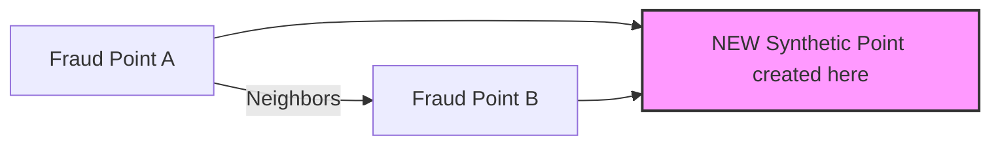
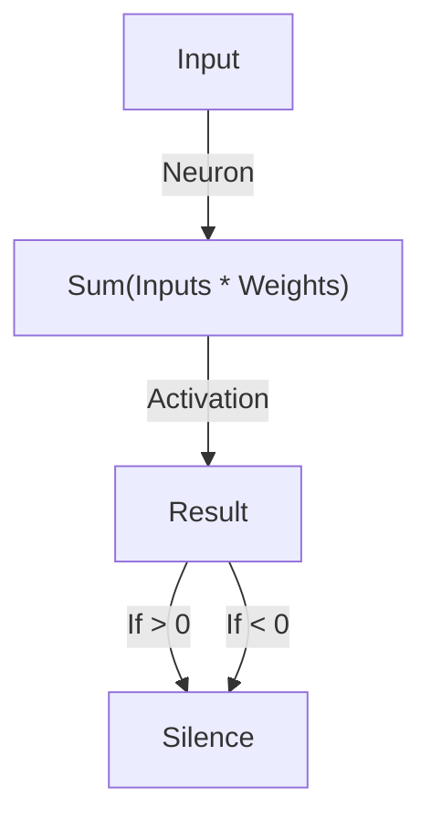
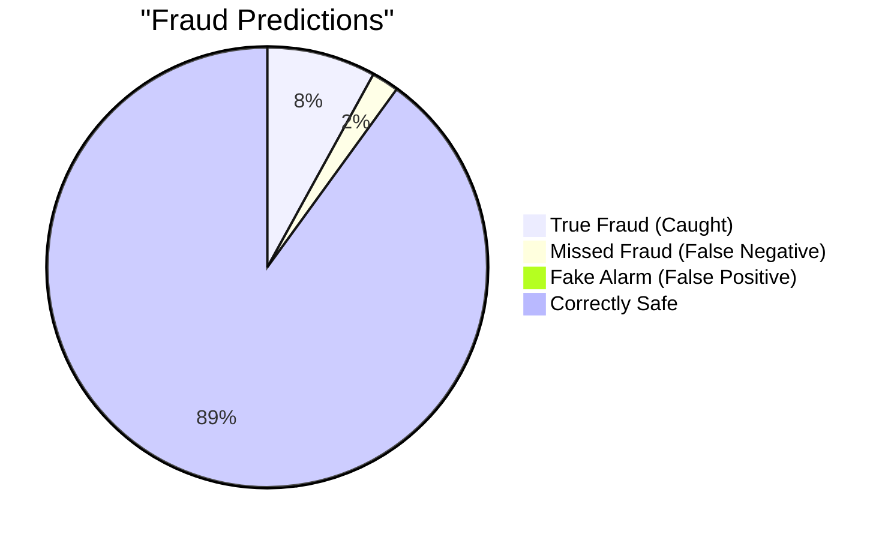

# 📚 Concepts Explained

## 1. SMOTE (Synthetic Minority Over-sampling Technique)

### 1. Definition
SMOTE is a technique to balance datasets by creating "fake" examples of the minority class (the rare items) instead of just copying them.

### 2. Why it is used
In fraud detection, 99.9% of transactions are normal. If we train a model on this, it will just learn to say "Normal" every time. SMOTE creates more fraud examples so the model can learn what fraud looks like.

### 3. When to use it
- When your dataset is highly imbalanced (e.g., 90% vs 10%).
- Ideally used ONLY on the **Training Set**.

### 4. Where to use it
- Fraud Detection
- Disease Diagnosis (Rare diseases)
- Spam Detection

### 5. Is this the only way?
| Method | Description | Pros | Cons |
| :--- | :--- | :--- | :--- |
| **SMOTE** | Creates new synthetic points | Better generalization | Computationally slower |
| **Random Oversampling** | Duplicates existing points | Easy to do | Causes overfitting (memorization) |
| **Undersampling** | Deletes majority class points | Fast | Loses information |

### 6. Explanation with Diagram


*SMOTE picks two existing fraud points and draws a line between them. Then it puts a new point somewhere on that line.*

### 7. How to use it
```python
from imblearn.over_sampling import SMOTE
smote = SMOTE(random_state=42)
X_resampled, y_resampled = smote.fit_resample(X_train, y_train)
```

### 8. How it works internally
1. Pick a fraud point.
2. Find its "k" nearest fraud neighbors (usually 5).
3. Pick one neighbor randomly.
4. Draw a line connecting them.
5. Pick a random point on that line.
6. That is your new synthetic data point!

### 9. Visual Summary
- **Input**: 100 Fraud, 10000 Normal.
- **Process**: Connect dots between Fraud points.
- **Output**: 10000 Fraud, 10000 Normal.

### 10. Advantages
- Reduces overfitting compared to just duplicating data.
- Helps the model see the "shape" of the fraud class.

### 11. Disadvantages / Limitations
- Can create noise if fraud points overlap with normal points.
- Not effective for extremely high dimensional data.

### 12. Exam & Interview Points
- **Q:** Do we apply SMOTE to the Test set?
- **A:** NO! Never touch the test set. Only apply SMOTE to the Training set.
- **Q:** How is SMOTE different from Random Oversampling?
- **A:** Random Oversampling duplicates data; SMOTE creates *new* synthetic data.

---

## 2. Activation Functions (ReLU vs Sigmoid)

### 1. Definition
Activation functions are the "Gatekeepers" of neural networks. They decide if a neuron should "fire" (output a signal) or not.

### 2. Why it is used
Without them, a neural network is just a big linear regression. Activation functions add **non-linearity**, allowing the brain to learn complex patterns like curves and shapes.

### 3. When to use it
- **ReLU**: Hidden layers (internal thinking).
- **Sigmoid**: Output layer (binary decision: Yes/No).

### 4. Where to use it
- **ReLU**: Almost all modern deep learning networks.
- **Sigmoid**: Binary Classification outputs (Fraud/Not Fraud).

### 5. Is this the only way?
| Function | Formula | Range | Best For |
| :--- | :--- | :--- | :--- |
| **Sigmoid** | $1 / (1 + e^{-x})$ | 0 to 1 | Probabilities (Output) |
| **Tanh** | $(e^x - e^{-x}) / (e^x + e^{-x})$ | -1 to 1 | Zero-centered data |
| **ReLU** | $max(0, x)$ | 0 to infinity | Hidden layers (Fast!) |

### 6. Explanation with Diagram



### 7. How to use it
```python
import torch.nn as nn
layer = nn.ReLU()
output = layer(input_tensor)
```

### 8. How it works internally
- **ReLU**: Looks at the number. Is it negative? Make it 0. Is it positive? Keep it as is.
- **Sigmoid**: Squashes any number (e.g., -1000 or +500) into a probability between 0 and 1.

### 9. Visual Summary
- **ReLU**: Linear for positive, Zero for negative. Looks like a ramp.
- **Sigmoid**: S-shaped curve.

### 10. Advantages
- **ReLU**: Very fast to calculate. Solves "Vanishing Gradient" problem.
- **Sigmoid**: Perfect for probability interpretation.

### 11. Disadvantages / Limitations
- **ReLU**: "Dying ReLU" problem (if inputs are always negative, the neuron dies and never learns).
- **Sigmoid**: "Vanishing Gradient" (gradients get too small, learning stops).

### 12. Exam & Interview Points
- **Q:** Why do we prefer ReLU over Sigmoid for hidden layers?
- **A:** Because ReLU does not suffer from the Vanishing Gradient problem and is computationally faster.
- **Q:** What is the "Dying ReLU" problem?
- **A:** When a neuron gets stuck outputting 0 for all inputs and stops learning.

---

## 3. Precision vs Recall

### 1. Definition
- **Precision**: Quality. Of all the people I caught, how many were actually thieves?
- **Recall**: Quantity. Of all the thieves in the world, how many did I catch?

### 2. Why it is used
Accuracy is misleading for fraud. If 99% of transactions are safe, a model that says "Safe" all the time has 99% accuracy but 0 detections. We need Precision/Recall to measure success correctly.

### 3. When to use it
- **Precision**: When you want to minimize False Positives (don't annoy customers).
- **Recall**: When you want to minimize False Negatives (don't miss fraud!).

### 4. Where to use it
- Fraud Detection (Balance both).
- Cancer Screening (High Recall - catch every cancer).
- Spam Filter (High Precision - don't delete important emails).

### 6. Explanation with Diagram


*Recall focuses on the red slices (True Fraud vs Missed). Precision focuses on the "Caught" vs "Fake Alarm".*

### 12. Exam & Interview Points
- **Q:** In fraud detection, is False Positive or False Negative worse?
- **A:** Usually False Negative is worse (losing money), but too many False Positives annoy customers. It's a trade-off (F1-Score).
