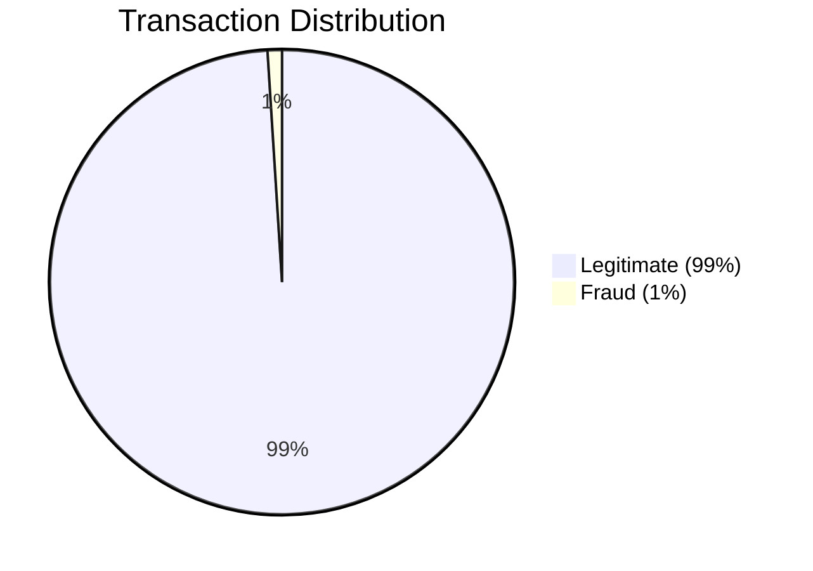
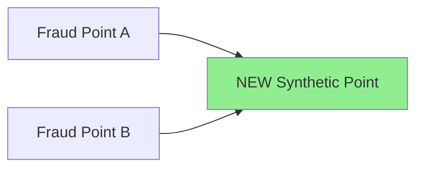
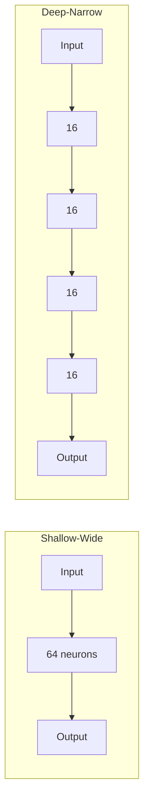
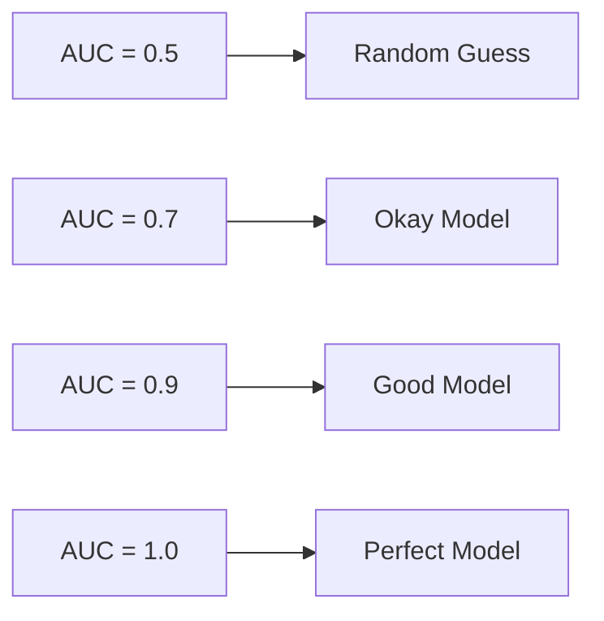

# Interview Questions: Fraud Detection with Neural Networks

This document contains 20 interview questions about fraud detection, neural networks, and imbalanced classification.

---

## Table of Contents

1. [Imbalanced Data (Q1-5)](#imbalanced-data)
2. [Neural Network Architecture (Q6-10)](#neural-network-architecture)
3. [Evaluation Metrics (Q11-15)](#evaluation-metrics)
4. [Practical Implementation (Q16-20)](#practical-implementation)

---

## Imbalanced Data

### Q1: What is class imbalance and why is it a problem in fraud detection?

**Simple Answer (for 10-year-old):**
> Imagine a classroom with 99 good students and only 1 troublemaker. If a teacher just says "everyone is good" they'll be right 99% of the time, but miss the one problem. That's class imbalance!

**Technical Answer:**
> Class imbalance occurs when one class significantly outnumbers another. In fraud detection, legitimate transactions may be 99%+ of the data. Standard models optimize for overall accuracy, leading them to predict the majority class (legitimate) for everything, achieving high accuracy but failing to detect fraud.

**Mermaid Diagram:**


**Real-Life Analogy:**
Like finding a needle in a haystack - the needles (fraud) are rare but critically important to find.

**Common Mistakes:**
- ❌ Using accuracy as the primary metric
- ❌ Not checking class distribution before training
- ❌ Applying SMOTE to test data

**Key Points:**
- Always check class distribution first
- Use precision, recall, F1 instead of accuracy
- Address imbalance through sampling or cost-sensitive learning

---

### Q2: What is SMOTE and how does it work?

**Simple Answer:**
> SMOTE is like cloning but smarter. Instead of photocopying fraud examples, it creates NEW fake fraud examples by mixing features from existing ones.

**Technical Answer:**
> SMOTE (Synthetic Minority Over-sampling Technique) generates synthetic samples by:
> 1. Selecting a minority class instance
> 2. Finding its k nearest neighbors (same class)
> 3. Creating new samples along the line connecting them

**Mermaid Diagram:**


**Key Points:**
- Only apply to training data, NEVER test data
- Creates new points, doesn't duplicate
- Reduces overfitting compared to random oversampling

---

### Q3: When should you NOT use SMOTE?

**Simple Answer:**
> Don't use SMOTE when your fraud cases are all over the place with no pattern. SMOTE draws lines between fraud points - if they're scattered among normal points, you'll create fake frauds that look normal!

**Technical Answer:**
> Avoid SMOTE when:
> 1. **Classes overlap significantly** - synthetic points may cross into majority class space
> 2. **Very high dimensionality** - neighbors become less meaningful
> 3. **Extreme imbalance** (1:10000) - may still not be enough
> 4. **Test/validation data** - NEVER apply to held-out data

**Alternatives:**
- Cost-sensitive learning
- Ensemble methods (BalancedRandomForest)
- Undersampling majority class

---

### Q4: What's the difference between oversampling and undersampling?

**Simple Answer:**
> Oversampling = Making MORE copies of the rare class (fraud)
> Undersampling = Throwing AWAY some of the common class (normal)

**Technical Answer:**

| Method | Action | Pros | Cons |
|--------|--------|------|------|
| Oversampling | Increase minority | Keeps all data | Can overfit |
| Undersampling | Decrease majority | Fast, simple | Loses information |
| SMOTE | Synthetic minority | Better generalization | Computationally expensive |

---

### Q5: Why do we apply SMOTE only to training data?

**Simple Answer:**
> The test data should be like real life - and in real life, we don't get to create fake fraud examples! Test data must show how the model works in the real world.

**Technical Answer:**
> Applying SMOTE to test data would:
> 1. **Inflate performance metrics** - model sees synthetic patterns it helped create
> 2. **Violate data integrity** - test set no longer represents real distribution
> 3. **Cause data leakage** - synthetic points derived from real test samples

---

## Neural Network Architecture

### Q6: What is the difference between shallow-wide and deep-narrow networks?

**Simple Answer:**
> Shallow-wide = A team of many generalists (few layers, many neurons)
> Deep-narrow = A pipeline of specialists (many layers, fewer neurons)

**Technical Answer:**

| Type | Structure | Best For |
|------|-----------|----------|
| Shallow-Wide | 1-2 layers, 64-128 neurons | Tabular data, simple patterns |
| Deep-Narrow | 4+ layers, 16-32 neurons | Complex hierarchical features |

**Mermaid Diagram:**


---

### Q7: Why do we use ReLU in hidden layers but Sigmoid in the output layer?

**Simple Answer:**
> ReLU is like a fast worker who never gets tired (hidden layers need speed)
> Sigmoid is like a judge who gives a probability verdict (output needs 0-1 probability)

**Technical Answer:**
> - **ReLU**: No vanishing gradient (derivative=1 for positive), computationally fast
> - **Sigmoid**: Maps output to (0,1) range, interpretable as probability for binary classification

**Key Formula:**
- ReLU: f(x) = max(0, x)
- Sigmoid: f(x) = 1/(1 + e^(-x))

---

### Q8: What is BatchNorm and why is it useful?

**Simple Answer:**
> BatchNorm is like a coach who keeps all players performing at a similar level. It prevents some neurons from getting too excited or too lazy.

**Technical Answer:**
> Batch Normalization:
> 1. Normalizes each layer's inputs (mean=0, variance=1)
> 2. Reduces internal covariate shift
> 3. Acts as regularization
> 4. Allows higher learning rates

---

### Q9: What is Dropout and when should you use it?

**Simple Answer:**
> Dropout is like making random students sit out during practice. This forces everyone to learn, not just rely on the star players.

**Technical Answer:**
> Dropout randomly sets a fraction of neurons to 0 during training:
> - Prevents co-adaptation of neurons
> - Acts as regularization (reduces overfitting)
> - Typical values: 0.2-0.5

```python
nn.Dropout(0.3)  # 30% of neurons dropped each forward pass
```

---

### Q10: What is early stopping and why is it important?

**Simple Answer:**
> Early stopping is like stopping a student from studying when they start getting worse on practice tests. More studying won't help - they're starting to memorize, not learn.

**Technical Answer:**
> Early stopping monitors validation loss and stops training when it starts increasing, preventing overfitting. Key parameters:
> - **patience**: How many epochs to wait before stopping
> - **best_model**: Save the model with lowest validation loss

---

## Evaluation Metrics

### Q11: Why is accuracy misleading for fraud detection?

**Simple Answer:**
> If 99% of transactions are normal, a model that says "everything is normal" gets 99% accuracy but catches ZERO fraud!

**Technical Answer:**
> Accuracy = (TP + TN) / Total. In imbalanced data:
> - A "predict all negative" model achieves 99%+ accuracy
> - But has 0% recall (misses all fraud)
> - Precision, Recall, F1, and AUC are better metrics

---

### Q12: Explain Precision vs Recall in fraud detection context.

**Simple Answer:**
> **Precision**: Of all the alarms you raised, how many were real fraud?
> **Recall**: Of all the real fraud, how many did you catch?

**Technical Answer:**
> - **Precision** = TP / (TP + FP) - Quality of positive predictions
> - **Recall** = TP / (TP + FN) - Coverage of actual positives

**Trade-off:**
- High Precision → Fewer false alarms, may miss fraud
- High Recall → Catch more fraud, more false alarms

---

### Q13: What is the F1-Score and when should you use it?

**Simple Answer:**
> F1-Score is the "average" of precision and recall. Use it when you need to balance catching fraud AND not annoying customers with false alarms.

**Technical Answer:**
> F1 = 2 × (Precision × Recall) / (Precision + Recall)

Use F1 when:
- Classes are imbalanced
- Both false positives and false negatives matter
- You can't decide between precision and recall

---

### Q14: What is the ROC curve and AUC?

**Simple Answer:**
> ROC curve shows how good your model is at separating fraud from normal. AUC is a single number (0-1) summarizing this - higher is better, 1.0 is perfect.

**Technical Answer:**
> - **ROC**: Plots True Positive Rate vs False Positive Rate at all thresholds
> - **AUC**: Area Under ROC Curve (0.5 = random, 1.0 = perfect)

**Mermaid Diagram:**


---

### Q15: In fraud detection, is False Positive or False Negative worse?

**Simple Answer:**
> Usually False Negative is worse - you MISSED real fraud (lost money!)
> But too many False Positives annoy customers who get blocked wrongly.

**Technical Answer:**
> It depends on business context:
> - **High-value fraud**: Prioritize recall (catch fraud)
> - **Customer experience**: Balance precision (reduce false alarms)
> - **Real-time systems**: May need to accept some false positives for speed

---

## Practical Implementation

### Q16: What is the purpose of train/validation/test split?

**Simple Answer:**
> Train = Study material, Validation = Practice tests, Test = Final exam
> You can't use the final exam to study!

**Technical Answer:**

| Set | Purpose | When Used |
|-----|---------|-----------|
| Training | Learn weights | During training |
| Validation | Tune hyperparameters, early stopping | After each epoch |
| Test | Final evaluation | Only once at the end |

---

### Q17: Why do we use StandardScaler for neural networks?

**Simple Answer:**
> Neural networks are picky eaters. They learn better when all numbers are similarly sized (around 0, not too big or small).

**Technical Answer:**
> StandardScaler transforms features to mean=0, std=1:
> - Helps gradient descent converge faster
> - Prevents features with large values from dominating
> - Required for most neural network implementations

**Important:** Fit on training data only, transform all sets with same scaler.

---

### Q18: What is Binary Cross-Entropy loss and why use it for fraud detection?

**Simple Answer:**
> BCELoss is like a strict teacher who heavily punishes confident wrong answers. If you say "99% sure it's normal" but it was fraud, you get a BIG penalty!

**Technical Answer:**
> BCE = -[y·log(p) + (1-y)·log(1-p)]

Why use it:
- Natural pairing with sigmoid output
- Penalizes confident wrong predictions heavily
- Standard for binary classification

---

### Q19: How do you handle a production fraud detection system?

**Simple Answer:**
> 1. Catch fraud quickly (real-time)
> 2. Don't annoy good customers (precision)
> 3. Keep learning from new fraud patterns (retraining)

**Technical Answer:**
1. **Real-time scoring** with low latency
2. **Threshold tuning** based on business requirements
3. **Monitoring** for model drift
4. **Retraining** as fraud patterns evolve
5. **Human review** for uncertain cases

---

### Q20: What are ensemble methods and how can they help fraud detection?

**Simple Answer:**
> Ensemble = Using multiple models and taking a vote. Just like asking multiple doctors instead of just one!

**Technical Answer:**
> Ensemble methods combine multiple models:
> - **Bagging**: Train many models on random subsets (Random Forest)
> - **Boosting**: Train models sequentially, focus on mistakes (XGBoost)
> - **Stacking**: Use model outputs as features for meta-model

For imbalanced data: BalancedBaggingClassifier, BalancedRandomForest

---

## Quick Reference Card

### Top 5 Interview Questions

| Question | Key Answer |
|----------|------------|
| Why not accuracy? | Doesn't reflect performance on minority class |
| When use SMOTE? | Training data only, imbalanced classes |
| ReLU vs Sigmoid? | ReLU hidden (no vanishing), Sigmoid output (probability) |
| Precision vs Recall? | Precision=quality, Recall=coverage |
| Why early stopping? | Prevents overfitting, saves best model |
