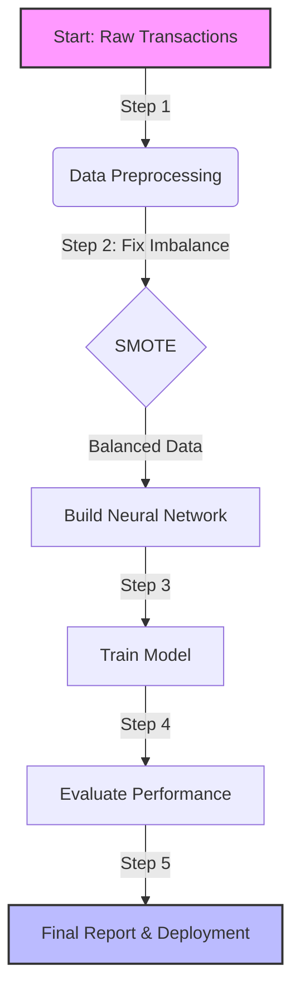

# 🧩 Problem Statement: Detecting Credit Card Fraud

## 🕵️‍♂️ What is the Problem?
Imagine you are a security guard at a huge shopping mall. Thousands of people walk in and out every hour. Most people are honest shoppers, but a tiny few (maybe 1 in 1000) are shoplifters.

Your job is to spot the shoplifters **instantly** without stopping the honest shoppers.
- If you stop an honest shopper, they get angry and might not come back (**False Positive**).
- If you let a shoplifter go, the mall loses money (**False Negative**).

In the world of credit cards, this is called **Fraud Detection**. We need to build a computer program (a "Brain" or Neural Network) that looks at every transaction and decides: *"Is this safe, or is it a thief?"*

## 🌍 Why does it matter?
1.  **Money**: Banks lose billions of dollars to thieves every year.
2.  **Trust**: If your card gets blocked when you try to buy dinner, you get annoyed at the bank.
3.  **Speed**: This decision has to happen in milliseconds, while you are standing at the checkout.

## 🪜 Steps to Solve the Problem
Here is our recipe (algorithm) to solve this:

1.  **Get the Data**: We collect a list of past transactions. Some are marked "Fraud" (1), most are "Normal" (0).
2.  **Fix the Imbalance**:
    -   Problem: We have 999 normal transactions for every 1 fraud. The Brain might just guess "Normal" every time and be 99.9% correct, but useless!
    -   Solution: We use a technique called **SMOTE** to create "fake" examples of fraud so the Brain can learn better.
3.  **Build the Brain (Neural Network)**: We design a network of digital neurons. We will try different shapes: one wide and flat, one tall and thin.
4.  **Train the Brain**: We show the Brain the data and let it practice. "Here is a transaction. What do you think?" -> Brain guesses -> We correct it.
5.  **Test the Brain**: We give it new transactions it has never seen and see how many thieves it catches.

## 🎯 Expected Output
At the end of this project, we will have:
1.  **A Working AI Model**: A Python program that can predict fraud.
2.  **Performance Charts**:
    -   **ROC Curve**: A graph showing how good the model is at separating fraud from normal.
    -   **Confusion Matrix**: A scorecard showing how many thieves we caught and how many honest people we accidentally stopped.
3.  **Comparison**: A table proving which Brain design (Wide vs Deep) was smarter.

## 🧜‍♀️ Visual Guide

## 📝 Exam Focus Points
-   **Q:** Why is accuracy a bad metric for fraud detection?
-   **A:** Because if 99.9% of data is safe, a model that *always* predicts "Safe" has 99.9% accuracy but catches 0 fraud. Use **Precision** and **Recall** instead.
