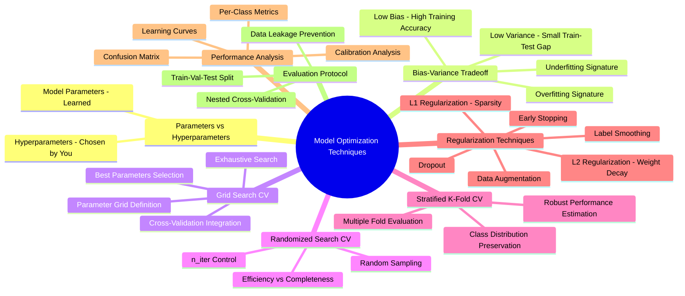
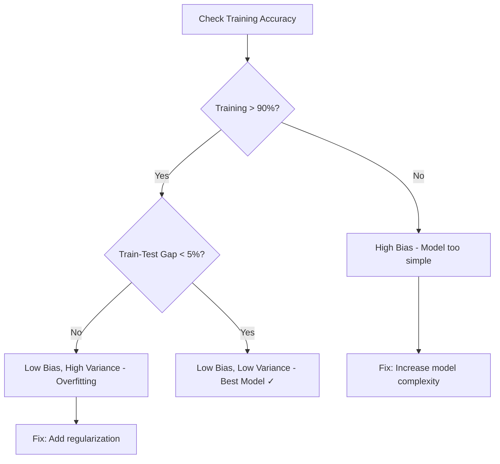
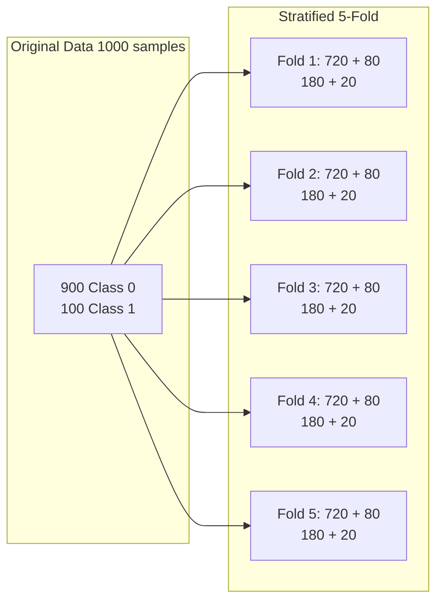
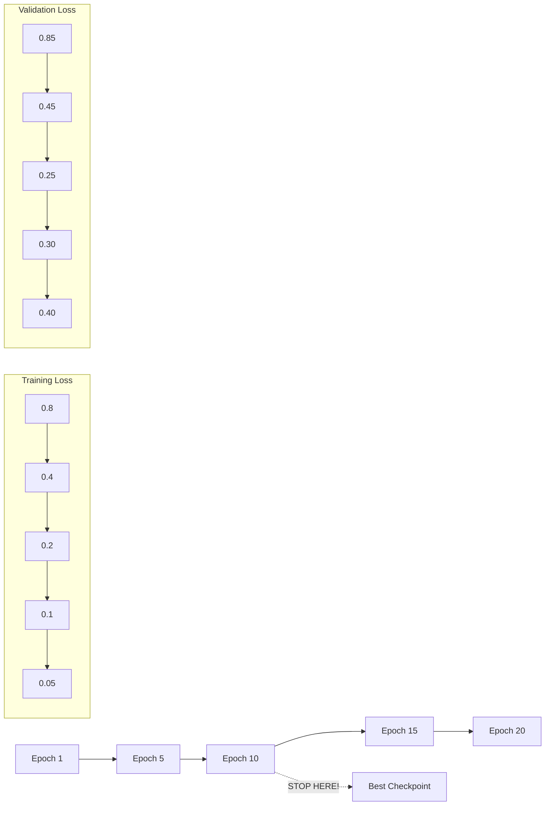
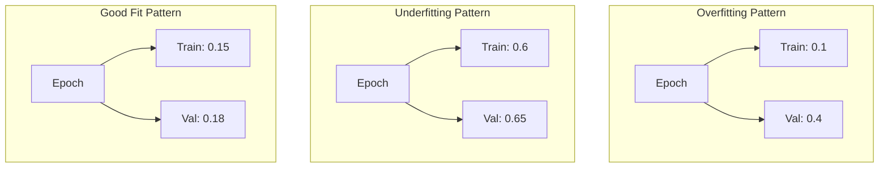
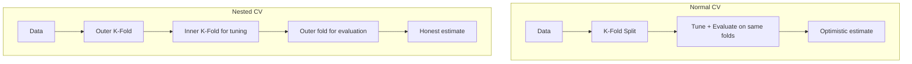
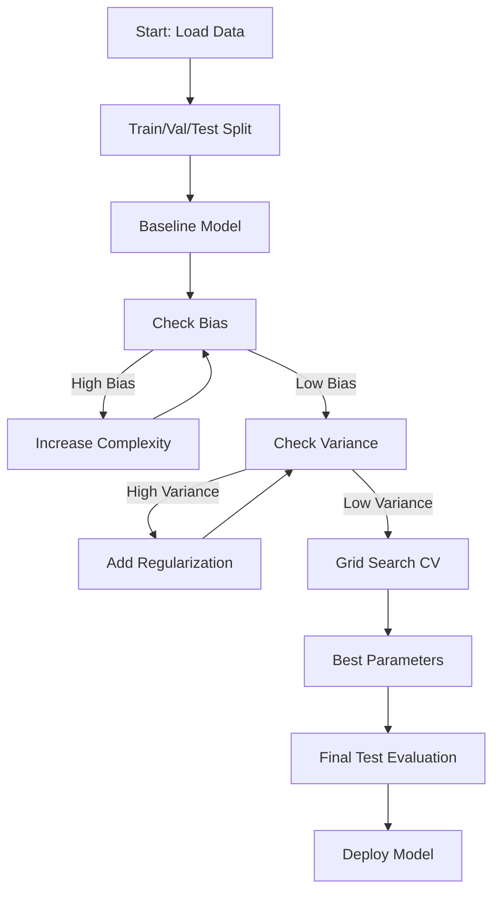

# IM17: Model Optimization Techniques - Classroom Session

## 🗺️ Mind Map - Topics to Cover



---

## 🎓 Classroom Conversation

### Topic 1: Introduction - Why Model Optimization Matters

**Teacher:** Shubhodayam students! Ippudu mana oka chala important topic start cheddam - Model Optimization Techniques. Idi industry lo chala crucial, ekada ai models deploy chestaro akkada optimization lekunda success ravadu.

**Beginner Student:** Sir, optimization ante exactly enti? Models already train chestunnam kada, inka enti optimize cheyyali?

**Teacher:** Chala manchi question! Nenu oka simple analogy cheptanu. Oka tailor ni imagine cheyyi - 100 people ki medium size t-shirts prepare cheyyali. Ippudu ee tailor oka person measurements teesukoni shirts stitch chestadu. Kaani problem enti ante - oka person ki exact ga fit ayina shirt inkoka person ki fit avvakpovacchu.

**Clever Student:** Aa analogy lo sir, tailor ni data scientist tho compare chestunnam, t-shirt ni model tho, inka 100 people ni data points tho compare chestunnam correct?

**Teacher:** Exactly correct! Ippudu think cheyyi - tailor gaa too tight shirt stitch chesthe only measured person ki fit avtundi, kaani others ki tight ga untundi. Idi **overfitting** laanti situation. Too loose shirt stitch chesthe evvariki sariggaa fit avvadu - idi **underfitting** laanti situation.

**Practical Student:** Sir, industry lo ee optimization ela use chestaru? Real projects lo?

**Teacher:** Excellent question! Banks lo fraud detection models optimize chestaru, e-commerce lo recommendation systems tune chestaru, healthcare lo disease prediction models calibrate chestaru. Every production ML system needs proper optimization.

> 💡 **Jargon Alert - Optimization**
> Simple Explanation: Model ni better ga work cheyyinchataniki settings maarchutam, like adjusting TV brightness for best picture
> Example: TV remote lo contrast, brightness adjust chestunattu, model lo hyperparameters adjust chestam

**Critique Student:** Sir, optimization always necessary aa? Already model accuracy high unte chalu kada?

**Teacher:** Aa question lo hidden trap undi! Accuracy high unte model good ane guarantee ledu. Nenu oka example cheptanu - fraud detection lo 94% accuracy vacchindi, kaani recall only 46%. Ante 100 fraudulent transactions lo 54 detect avvatledu! Idi dangerous.

**Curious Student:** Sir, adi ela possible? Accuracy high aithe all metrics high undali kada?

**Teacher:** Ledu! Imbalanced data sets lo accuracy misleading metric. 1000 transactions lo 990 genuine, 10 fraud unte - model anni genuine ani predict chesina 99% accuracy vastundi, kaani single fraud detect avvadu!

**Debate Student:** Sir, then accuracy use cheyyanki em use? Alternative metrics enti?

**Teacher:** Precision, Recall, F1 Score - ee metrics use cheyyali. Especially imbalanced data lo F1 Score most reliable. Idi precision and recall ni balance chestundi.

---

### Topic 2: Parameters vs Hyperparameters - The Two Controls

**Teacher:** Ippudu oka fundamental concept chuddam - Parameters vs Hyperparameters. Idi interview lo almost always adugutaru!

**Beginner Student:** Sir, parameters inka hyperparameters same kaada?

**Teacher:** Completely different concepts! Nenu explain chesta with a cooking analogy.

Imagine mee mom biryani prepare chestundi:
- **Recipe steps** (boil rice, add masala) = Training Algorithm
- **Ingredients adjust cheyyatam** (salt level, spice level, cooking time) = Hyperparameters
- **Final biryani taste** = Model Performance

**Clever Student:** Sir, then parameters enti in this analogy?

**Teacher:** Parameters are **learned from data**. Training process lo model automatically learn chestundi:
- Linear regression weights (w)
- Neural network weights (W) and biases (b)
- These are updated during backpropagation

**Hyperparameters** are **chosen by you before training**:
- Learning rate (η)
- Batch size
- Number of layers
- Dropout probability (p)
- Regularization strength (λ)

> 💡 **Jargon Alert - Parameters**
> Simple Explanation: Model training lo automatically learn ayye values, like student exam lo answers learn chesinatu
> Example: Line equation y = mx + b lo m and b values training lo learn avtayi

> 💡 **Jargon Alert - Hyperparameters**
> Simple Explanation: Training start cheyyaka mundu mee set chese settings, like exam ki study plan prepare chesinatu
> Example: How many hours study, which subjects first - ee decisions hyperparameters laanti vi

**Practical Student:** Sir, interview lo parameters vs hyperparameters adugutharu, one-liner answer enti?

**Teacher:** Perfect answer:
- "**Parameters** are learned from data during training - weights, biases"
- "**Hyperparameters** are set before training and control how training happens - learning rate, epochs, batch size"

**Curious Student:** Sir, hyperparameters wrong ga set chesthe em avtundi?

**Teacher:** Model performance drastically affect avtundi:
- Learning rate too high → Model oscillates, doesn't converge
- Learning rate too low → Training too slow, stuck in local minima
- Too many epochs → Overfitting
- Too few epochs → Underfitting

| Aspect | Parameters | Hyperparameters |
|--------|-----------|-----------------|
| Who sets? | Model learns | Data Scientist sets |
| When? | During training | Before training |
| Examples | Weights, biases | Learning rate, epochs |
| How to find? | Gradient descent | Grid Search, Random Search |

---

### Topic 3: Bias-Variance Tradeoff - The Core Concept

**Teacher:** Ippudu most important interview concept - Bias-Variance Tradeoff. Idi proper ga understand ayithe model optimization chala easy avtundi.

**Beginner Student:** Sir, bias inka variance ante enti simple ga?

**Teacher:** Let me explain with student exam analogy:

**Bias** = Training accuracy reflect chestundi
- **Low Bias** = High training accuracy (student training lo manchi score)
- **High Bias** = Low training accuracy (student training loney poor)

**Variance** = Train inka Test accuracy difference
- **Low Variance** = Small difference (student consistent performance)
- **High Variance** = Large difference (training lo 99%, test lo 70%)

**Clever Student:** Sir, exact thresholds enti? Entha accuracy unte low bias, entha difference unte high variance?

**Teacher:** Very important question! Note down cheyyandi:

📌 **Low Bias Threshold**: Training accuracy > 90%
📌 **Low Variance Threshold**: |Train accuracy - Test accuracy| < 5%

```
If training accuracy > 90% → Low Bias ✓
If |Train - Test| < 5% → Low Variance ✓
```

**Critique Student:** Sir, high bias high variance combination possible aa?

**Teacher:** Yes! Let me explain all combinations:

| Bias | Variance | Result | Example |
|------|----------|--------|---------|
| High | High | Underfitting | Train: 60%, Test: 55% |
| High | Low | Underfitting | Train: 65%, Test: 63% |
| Low | High | **Overfitting** | Train: 99%, Test: 70% |
| Low | Low | **Best Model** ✓ | Train: 95%, Test: 93% |

**Beginner Student:** Sir, high bias unte variance check cheyyaala?

**Teacher:** Excellent observation! **No need to check variance if bias is high**. Think about it - oka student 5th class fail aithe, 10th class clear avtada? Same way, model training loney poor aithe, testing lo ela perform chestundi?



**Practical Student:** Sir, interview lo "what is overfitting" adigithe?

**Teacher:** Perfect answer:
> "Overfitting occurs when a model has **low bias but high variance** - it performs very well on training data (>95%) but poorly on test data. The difference between training and test accuracy exceeds 5%. Solution: Add regularization, reduce model complexity, or collect more data."

**Debate Student:** Sir, underfitting better aa overfitting better?

**Teacher:** Neither is good, but **overfitting is often more tricky to detect**. Underfitting you can see immediately from low training scores. But overfitting looks great on training, only fails on test - so you might deploy a bad model thinking it's good!

---

### Topic 4: Overfitting Deep Dive - The Silent Killer

**Teacher:** Ippudu overfitting in detail chuddam. Idi ML lo "silent killer" ante cheptaru - everything looks great on training, but fails in production.

**Beginner Student:** Sir, overfitting ela identify cheyyali?

**Teacher:** Overfitting signatures:
1. Training loss keeps decreasing ↓
2. Validation loss first decreases, then increases ↑
3. Training accuracy very high (>95%)
4. Validation accuracy stalls or drops
5. Large gap between train and validation metrics

**Curious Student:** Sir, overfitting enduku ostadi? Root cause enti?

**Teacher:** Multiple reasons:

1. **Model too complex** - Decision tree depth 20 unte every noise point also learns
2. **Training too long** - Too many epochs, model memorizes noise
3. **Less training data** - Not enough examples to generalize
4. **No regularization** - No penalty for complex solutions

Let me show with code example:

```python
# Overfitting demonstration with Decision Tree
from sklearn.tree import DecisionTreeClassifier
import matplotlib.pyplot as plt

depths = range(1, 16)
train_f1 = []
val_f1 = []

for d in depths:
    model = DecisionTreeClassifier(max_depth=d, random_state=42)
    model.fit(X_train, y_train)
    
    train_f1.append(f1_score(y_train, model.predict(X_train)))
    val_f1.append(f1_score(y_val, model.predict(X_val)))

# Plotting
plt.plot(depths, train_f1, label='Training F1')
plt.plot(depths, val_f1, label='Validation F1')
plt.xlabel('Tree Depth')
plt.ylabel('F1 Score')
plt.legend()
plt.title('Overfitting with Increasing Depth')
plt.show()
```

**Clever Student:** Sir, ee code lo what happens as depth increases?

**Teacher:** 
- Depth 1-4: Train and Val both improve, gap small → Good
- Depth 5-10: Train improves a lot, Val improves little → Starting to overfit
- Depth 11+: Train reaches 100%, Val starts dropping → Clear overfitting!

**Practical Student:** Sir, overfitting fix cheyyataniki solutions enti?

**Teacher:** Multiple solutions available:

| Technique | How it helps | When to use |
|-----------|--------------|-------------|
| **Regularization (L1/L2)** | Penalizes complex weights | Always recommended |
| **Dropout** | Randomly drops neurons | Neural networks |
| **Early Stopping** | Stops when val loss increases | Deep learning |
| **Data Augmentation** | Creates more training data | Image/text data |
| **Reduce Model Complexity** | Less parameters | When model too big |
| **Collect More Data** | Better generalization | When data limited |

> 💡 **Jargon Alert - Overfitting**
> Simple Explanation: Model training data ni exact ga memorize chesindi, kaani new data ki generalize cheyatledu - like student answers memorize chesi different questions answer cheyatledu
> Example: Geography lo "India capital?" answer memorize chesina student, "Which country capital Delhi?" answer cheyatledu

---

### Topic 5: Grid Search CV - Systematic Hyperparameter Tuning

**Teacher:** Ippudu hyperparameter tuning ki most popular method - Grid Search CV chuddam.

**Beginner Student:** Sir, Grid Search ante enti? Ela work chestundi?

**Teacher:** Simple analogy - Buffet restaurant ki vellavu. So many dishes available - starters, main course, desserts. Best combination find cheyyadaniki anni try cheyyali. Grid Search same concept - possible hyperparameter combinations anni try chesi best one select chestundi.

**Clever Student:** Sir, but anni combinations try cheyyatam time consuming kada?

**Teacher:** Yes! That's the tradeoff. Let me explain with example:

```python
param_grid = {
    'max_depth': [3, 5, 7, 10],     # 4 values
    'min_samples_split': [2, 10, 30],  # 3 values
    'min_samples_leaf': [1, 5, 10]     # 3 values
}
# Total combinations = 4 × 3 × 3 = 36 experiments!
```

Each combination train and evaluate cheyyali. 36 models train cheyyali!

**Debate Student:** Sir, 36 models too much kada? Alternative undi aa?

**Teacher:** Yes, alternative undi - **Randomized Search CV**. Adi homework ga cover cheddamu. But Grid Search advantage enti ante - exhaustive search, best combination miss avvadu.

**Practical Student:** Sir, Grid Search CV syntax cheptharu?

**Teacher:** Complete implementation:

```python
from sklearn.model_selection import GridSearchCV, StratifiedKFold
from sklearn.tree import DecisionTreeClassifier

# Define model
model = DecisionTreeClassifier(random_state=42)

# Define parameter grid
param_grid = {
    'max_depth': [3, 5, 7, 10],
    'min_samples_split': [2, 10, 30],
    'min_samples_leaf': [1, 5, 10]
}

# Define cross-validation strategy
cv = StratifiedKFold(n_splits=5, shuffle=True, random_state=42)

# Create GridSearchCV object
grid_search = GridSearchCV(
    estimator=model,
    param_grid=param_grid,
    cv=cv,
    scoring='recall',  # Optimize for recall in fraud detection
    n_jobs=-1,         # Use all CPU cores
    verbose=1
)

# Fit the grid search
grid_search.fit(X_train, y_train)

# Get best parameters
print("Best Parameters:", grid_search.best_params_)
print("Best CV Score:", grid_search.best_score_)

# Get best model
best_model = grid_search.best_estimator_
```

> 💡 **Jargon Alert - Grid Search CV**
> Simple Explanation: Possible hyperparameter combinations anni systematic ga try chesi best one select cheyyatam - exam preparation lo all topics study chesi which topic most marks iste adi focus chesinatu
> Example: Physics, Chemistry, Maths - anni subjects ki time allocate chesi, which allocation best results iste adi select cheyyatam

**Curious Student:** Sir, `n_jobs=-1` ante enti?

**Teacher:** Good observation! `n_jobs` controls parallel processing:
- `n_jobs=1` → Single core use (slow)
- `n_jobs=2` → 2 cores use
- `n_jobs=-1` → All available cores use (fastest)

Since Grid Search lo 36 independent experiments unnai, parallel ga run cheste fast ga complete avtundi.

**Critique Student:** Sir, Grid Search daggara what are the problems?

**Teacher:** Valid concern! Grid Search problems:

1. **Computationally expensive** - 100 combinations × 5-fold CV = 500 model fits!
2. **Curse of dimensionality** - More hyperparameters = Exponential combinations
3. **Fixed grid** - Best value might be between grid points
4. **Doesn't learn from experiments** - Treats all regions equally

Solution ani Randomized Search, Bayesian Optimization, etc. available.

---

### Topic 6: Stratified K-Fold Cross-Validation

**Teacher:** Grid Search lo important component oka use chesaam - Stratified K-Fold CV. Idi chala important concept.

**Beginner Student:** Sir, normal K-Fold inka Stratified K-Fold difference enti?

**Teacher:** Excellent question! Classroom example tho explain chesta:

Classroom lo 100 students unnaru - 70 boys, 30 girls.

**Normal K-Fold**: Random ga 10 students select chesthe, 10 boys ravacchu (biased sample)

**Stratified K-Fold**: Proportions maintain chestundi - 7 boys, 3 girls (same 70:30 ratio)

```python
from sklearn.model_selection import StratifiedKFold

# Stratified K-Fold maintains class proportions
skf = StratifiedKFold(n_splits=5, shuffle=True, random_state=42)

for fold, (train_idx, val_idx) in enumerate(skf.split(X, y)):
    X_train_fold = X[train_idx]
    X_val_fold = X[val_idx]
    y_train_fold = y[train_idx]
    y_val_fold = y[val_idx]
    
    # Check class distribution
    print(f"Fold {fold+1} - Train: {np.bincount(y_train_fold)}, Val: {np.bincount(y_val_fold)}")
```

**Clever Student:** Sir, imbalanced data lo stratified K-fold chala important kadaa?

**Teacher:** Absolutely critical! Fraud detection example lo:
- 90% legitimate transactions
- 10% fraudulent transactions

Normal K-Fold aithe oka fold lo 95% legitimate, 5% fraud untundi - biased!
Stratified K-Fold aithe every fold lo 90:10 ratio maintain avtundi.



**Practical Student:** Sir, interview lo K-Fold advantages adigithe?

**Teacher:** K-Fold CV advantages:

1. **More robust estimates** - Multiple splits average
2. **Uses all data** - Every point used for both training and validation
3. **Reduces variance** - Less dependent on single split
4. **Better for small datasets** - Can't afford to waste data

| Technique | Pros | Cons | When to Use |
|-----------|------|------|-------------|
| Train/Val/Test Split | Simple, fast | Wastes data | Large datasets |
| K-Fold CV | Uses all data, robust | Slower | Medium datasets |
| Stratified K-Fold | Preserves class ratio | Slower | Imbalanced data |
| LOOCV | Maximum data usage | Very slow | Very small datasets |

---

### Topic 7: Regularization - Controlling Model Complexity

**Teacher:** Ippudu chala important topic - Regularization. Idi overfitting ki primary solution.

**Beginner Student:** Sir, regularization ante enti simple ga?

**Teacher:** Regularization ante model ki "complexity tax" add cheyyadam. Simple ga - model ki cheptam "complex aipothe penalty pay cheyyali".

Normal training lo:
```
Minimize: Loss = Data Loss
```

Regularized training lo:
```
Minimize: Loss = Data Loss + λ × Complexity Penalty
```

**Curious Student:** Sir, λ (lambda) enti?

**Teacher:** λ is **regularization strength** - oka hyperparameter:
- λ = 0 → No regularization, aggressive fitting
- λ small → Light regularization
- λ large → Strong regularization, simpler solutions preferred
- λ very large → Too much regularization, underfitting

> 💡 **Jargon Alert - Regularization**
> Simple Explanation: Model ni over-confident avvakunda control cheyyadam - student ki cheptam "rote memorization kaadu, concepts understand cheyyi"
> Example: Exam lo 10 marks question ki 20 pages answer raaste extra marks ravvu, concise answer better

**Clever Student:** Sir, L1 and L2 regularization difference enti?

**Teacher:** Both are different ways to penalize complexity:

**L2 Regularization (Ridge / Weight Decay)**:
```
Penalty = λ × Σ(weights²)
```
- Pushes all weights towards small values
- Doesn't make weights exactly zero
- Creates smooth decision boundaries

**L1 Regularization (Lasso)**:
```
Penalty = λ × Σ|weights|
```
- Pushes many weights to exactly zero
- Acts like feature selection
- Creates sparse models

```python
# L2 Regularization in Logistic Regression
from sklearn.linear_model import LogisticRegression

# C is inverse of regularization strength (C = 1/λ)
model_l2 = LogisticRegression(penalty='l2', C=0.1)  # Strong regularization
model_l1 = LogisticRegression(penalty='l1', C=0.1, solver='liblinear')

# L2 in neural networks - weight_decay
import torch.optim as optim
optimizer = optim.AdamW(model.parameters(), lr=0.001, weight_decay=0.01)
```

| Aspect | L1 (Lasso) | L2 (Ridge) |
|--------|-----------|-----------|
| Penalty | Sum of absolute weights | Sum of squared weights |
| Effect | Makes weights zero (sparse) | Makes weights small |
| Feature selection | Yes | No |
| Use case | High dimensional, many irrelevant features | General regularization |
| Mathematical property | Not differentiable at zero | Differentiable everywhere |

**Debate Student:** Sir, L1 better aa L2 better?

**Teacher:** Depends on problem:
- **L2 better when**: All features somewhat useful, want smooth solution
- **L1 better when**: Many irrelevant features, want automatic feature selection
- **ElasticNet**: Combines both, use when not sure!

```python
# ElasticNet - Best of both worlds
from sklearn.linear_model import ElasticNet
model = ElasticNet(alpha=0.1, l1_ratio=0.5)  # 50% L1, 50% L2
```

---

### Topic 8: Dropout - Neural Network Regularization

**Teacher:** Neural networks ki special regularization technique - Dropout.

**Beginner Student:** Sir, dropout ante enti?

**Teacher:** Training time lo randomly some neurons "drop out" chestam - temporarily off chestam.

Office team lo imagine cheyyi - 10 people unna team. Daily 2-3 people leave chesthe, remaining people all work handle cheyyali. Result - everyone becomes versatile, single person depend avvadu.

Same with neural networks - dropout forces neurons to be independently useful.

```python
import torch.nn as nn

class NeuralNet(nn.Module):
    def __init__(self):
        super().__init__()
        self.fc1 = nn.Linear(784, 256)
        self.dropout1 = nn.Dropout(p=0.2)  # 20% neurons drop
        self.fc2 = nn.Linear(256, 128)
        self.dropout2 = nn.Dropout(p=0.3)  # 30% neurons drop
        self.fc3 = nn.Linear(128, 10)
    
    def forward(self, x):
        x = torch.relu(self.fc1(x))
        x = self.dropout1(x)  # Dropout applied
        x = torch.relu(self.fc2(x))
        x = self.dropout2(x)  # Dropout applied
        x = self.fc3(x)
        return x
```

**Clever Student:** Sir, dropout training time lo work chestundi, inference time lo?

**Teacher:** Excellent question! 

**Training time**: Dropout active - neurons randomly dropped
**Inference time**: Dropout inactive - all neurons active, but weights scaled

Important: `model.eval()` cheyyadam mandatory inference time lo!

```python
# Training mode
model.train()
output = model(X_train)  # Dropout active

# Inference mode
model.eval()
with torch.no_grad():
    output = model(X_test)  # Dropout inactive
```

**Critique Student:** Sir, dropout rate entha set cheyyali?

**Teacher:** Common values:
- Input layer: 0.1 - 0.2 (don't drop too many inputs)
- Hidden layers: 0.2 - 0.5 (more aggressive OK)
- Output layer: Usually no dropout

Too much dropout (>0.6) → Underfitting, learning slow
Too little dropout (<0.1) → Not much regularization effect

| Dropout Rate | Effect | Recommendation |
|--------------|--------|----------------|
| 0.0 | No regularization | When overfitting not an issue |
| 0.1 - 0.2 | Light regularization | Input layers |
| 0.3 - 0.5 | Standard regularization | Hidden layers |
| 0.5+ | Strong regularization | Very large networks, lots of data |

> 💡 **Jargon Alert - Dropout**
> Simple Explanation: Training lo randomly konta neurons off chesi, remaining neurons independent ga learn cheyinchutam - class lo random students absent aithe, remaining students all topics cover cheyyali
> Example: Group project lo one member suddenly absent aithe, others complete cheyyagalugutaru because everyone learnt everything

---

### Topic 9: Early Stopping - Know When to Stop

**Teacher:** Another powerful regularization technique - Early Stopping. Simple but very effective.

**Beginner Student:** Sir, early stopping ante training early stop cheyyatam aa?

**Teacher:** Exactly! But random ga stop cheyyadam kaadu - validation performance monitor chesi, overfitting start avvaka mundu stop chestam.



**Clever Student:** Sir, exact stopping point ela determine chestam?

**Teacher:** **Patience** parameter use chestam. Validation loss improve avvaka consecutive epochs ki wait chestam.

```python
from keras.callbacks import EarlyStopping

early_stop = EarlyStopping(
    monitor='val_loss',      # What to monitor
    patience=10,             # Wait 10 epochs after no improvement
    restore_best_weights=True,  # Restore best model weights
    min_delta=0.001          # Minimum change to qualify as improvement
)

model.fit(
    X_train, y_train,
    validation_data=(X_val, y_val),
    epochs=1000,  # Set high, early stopping will stop
    callbacks=[early_stop]
)
```

**Practical Student:** Sir, patience value entha set cheyyali?

**Teacher:** Depends on problem:
- Simple models: patience = 5-10
- Complex models: patience = 10-20
- Very noisy validation: patience = 20-50

Too low patience → Stop too early, underfitting
Too high patience → Waste time, might overfit

**Curious Student:** Sir, early stopping regularization ela? Weights penalize cheyyadam ledu kada?

**Teacher:** Great observation! Early stopping implicitly regularizes by **limiting optimization steps**. 

Think about it:
- More epochs → Model memorizes more training noise
- Early stopping → Model stops before memorizing noise
- Effect similar to regularization but without modifying loss function

---

### Topic 10: Data Augmentation - More Data, More Generalization

**Teacher:** Image data ki powerful technique - Data Augmentation.

**Beginner Student:** Sir, data augmentation ante new data create cheyyadam aa?

**Teacher:** Sort of! Existing data variations create chestam - flips, rotations, crops, color changes. Original data variations laaga act chestundi.

Cat photo undi ante:
- Flip horizontally → Still cat
- Rotate 10° → Still cat
- Zoom slightly → Still cat
- Brightness adjust → Still cat

Aa variations tho model robust ga learn chestundi.

```python
from torchvision import transforms

# Training augmentations - aggressive
train_transform = transforms.Compose([
    transforms.RandomHorizontalFlip(p=0.5),
    transforms.RandomRotation(degrees=15),
    transforms.RandomResizedCrop(224, scale=(0.8, 1.0)),
    transforms.ColorJitter(brightness=0.2, contrast=0.2),
    transforms.RandomGrayscale(p=0.1),
    transforms.ToTensor(),
    transforms.Normalize(mean=[0.485, 0.456, 0.406], 
                        std=[0.229, 0.224, 0.225])
])

# Validation - no augmentation
val_transform = transforms.Compose([
    transforms.Resize(256),
    transforms.CenterCrop(224),
    transforms.ToTensor(),
    transforms.Normalize(mean=[0.485, 0.456, 0.406], 
                        std=[0.229, 0.224, 0.225])
])
```

**Critique Student:** Sir, all augmentations all tasks ki apply cheyyocha?

**Teacher:** No! Domain specific considerations important:

| Task | Good Augmentations | Bad Augmentations |
|------|-------------------|-------------------|
| General image classification | Flip, rotate, crop | Vertical flip for faces |
| Medical imaging | Flip, rotation, intensity | Heavy color jitter |
| Text recognition | Slight noise | Horizontal flip (reverses text!) |
| Satellite imagery | Rotation, flip | Unrealistic color changes |

**Practical Student:** Sir, augmentation inka dropout oka chota use cheyyocha?

**Teacher:** Yes! But careful about combining. Strong augmentation + strong dropout = underfitting risk.

Start with:
- Light augmentation + light dropout
- If still overfitting, increase one at a time
- Monitor both training and validation metrics

---

### Topic 11: Label Smoothing - Soft Targets

**Teacher:** Classification ki another regularization technique - Label Smoothing.

**Beginner Student:** Sir, label smoothing ante enti?

**Teacher:** Normal classification lo targets are "hard" - exactly 0 or 1.

```python
# Hard labels
y_hard = [1, 0, 0]  # Class 0 with 100% confidence

# Soft labels with smoothing (ε = 0.1)
y_soft = [0.9, 0.05, 0.05]  # Class 0 with 90% confidence
```

**Clever Student:** Sir, soft labels enduku better?

**Teacher:** Benefits:

1. **Reduces overconfidence** - Model won't predict 99.99% probabilities
2. **Better calibration** - Predicted probabilities are more meaningful
3. **Regularization effect** - Prevents memorizing training labels exactly

```python
import torch.nn as nn

# Label smoothing in PyTorch
criterion = nn.CrossEntropyLoss(label_smoothing=0.1)

# Or manually
def smooth_labels(labels, num_classes, smoothing=0.1):
    with torch.no_grad():
        # Create soft targets
        soft = torch.full((labels.size(0), num_classes), smoothing / (num_classes - 1))
        soft.scatter_(1, labels.unsqueeze(1), 1.0 - smoothing)
    return soft
```

**Curious Student:** Sir, smoothing factor entha set cheyyali?

**Teacher:** Common values:
- ε = 0.1 (most common)
- ε = 0.05 (light smoothing)
- ε = 0.2 (aggressive smoothing)

> 💡 **Jargon Alert - Label Smoothing**
> Simple Explanation: Model ki cheptam "100% confident avvaku, konta uncertainty maintain cheyyi" - exam lo answer confident ga raastunna validate cheskoni raayi
> Example: "Delhi is capital of India" - 100% sure, but "Python is best language" - 90% sure (other languages also good)

---

### Topic 12: Learning Curves Analysis - Diagnosing Model Health

**Teacher:** Ippudu model performance analyze cheyyadam ela chuddam - Learning Curves.

**Beginner Student:** Sir, learning curves ante enti?

**Teacher:** Training inka validation metrics plot cheyyadam across epochs/iterations.

```python
import matplotlib.pyplot as plt

def plot_learning_curves(history):
    fig, axes = plt.subplots(1, 2, figsize=(14, 5))
    
    # Loss curves
    axes[0].plot(history['train_loss'], label='Train Loss')
    axes[0].plot(history['val_loss'], label='Validation Loss')
    axes[0].set_xlabel('Epoch')
    axes[0].set_ylabel('Loss')
    axes[0].legend()
    axes[0].set_title('Loss Curves')
    
    # Accuracy curves
    axes[1].plot(history['train_acc'], label='Train Accuracy')
    axes[1].plot(history['val_acc'], label='Validation Accuracy')
    axes[1].set_xlabel('Epoch')
    axes[1].set_ylabel('Accuracy')
    axes[1].legend()
    axes[1].set_title('Accuracy Curves')
    
    plt.tight_layout()
    plt.show()
```

**Clever Student:** Sir, curves chusi problem identify ela cheyyali?

**Teacher:** Pattern recognition cheyyadam:

**Pattern 1: Overfitting**
```
Train loss: ↓ constantly decreasing
Val loss: ↓ first, then ↑ starts increasing
Gap: Increasing between train and val
```

**Pattern 2: Underfitting**
```
Train loss: High, not decreasing much
Val loss: Also high, similar to train
Gap: Small (both are bad!)
```

**Pattern 3: Good Fit**
```
Train loss: ↓ decreasing
Val loss: ↓ decreasing, close to train
Gap: Small and stable
```



**Practical Student:** Sir, pattern chusaka fix ela chestam?

**Teacher:** Systematic approach:

| Pattern | Diagnosis | Fix |
|---------|-----------|-----|
| Train ↓, Val ↑ | Overfitting | Add regularization, early stopping, reduce model size |
| Both high | Underfitting | Reduce regularization, increase model capacity, train longer |
| Train = Val (both low) | Perfect fit or data leakage! | Check for leakage if too good |
| Val oscillates | Learning rate too high | Reduce learning rate |
| Both plateau early | Learning rate too low | Increase learning rate |

---

### Topic 13: Data Leakage - The Silent Performance Killer

**Teacher:** Chala dangerous problem - Data Leakage. Idi detect cheyyadam chala difficult.

**Beginner Student:** Sir, data leakage ante enti?

**Teacher:** Validation/Test data information training lo leak ayyinappudu - like exam paper leak.

```python
# WRONG - Data Leakage!
from sklearn.preprocessing import StandardScaler

scaler = StandardScaler()
X_scaled = scaler.fit_transform(X)  # Fitted on ALL data including test!

X_train, X_test = train_test_split(X_scaled, test_size=0.2)

# CORRECT - No Leakage
X_train, X_test = train_test_split(X, test_size=0.2)

scaler = StandardScaler()
X_train_scaled = scaler.fit_transform(X_train)  # Fit only on train
X_test_scaled = scaler.transform(X_test)  # Transform only, no fit
```

**Clever Student:** Sir, Pipeline use chesthe leakage avoid avtunda?

**Teacher:** Exactly! Pipeline is the solution:

```python
from sklearn.pipeline import Pipeline
from sklearn.preprocessing import StandardScaler
from sklearn.linear_model import LogisticRegression
from sklearn.model_selection import GridSearchCV

# Pipeline ensures no leakage
pipe = Pipeline([
    ('scaler', StandardScaler()),  # Scaler inside pipeline
    ('clf', LogisticRegression(max_iter=1000))
])

param_grid = {
    'clf__C': [0.01, 0.1, 1, 10],
    'clf__penalty': ['l1', 'l2']
}

# GridSearchCV with pipeline - each fold's scaler fitted only on that fold's train
gs = GridSearchCV(pipe, param_grid, cv=5, scoring='f1')
gs.fit(X_train, y_train)
```

**Critique Student:** Sir, data leakage detect ela cheyyali?

**Teacher:** Leakage signatures:

1. **Too good to be true** - 99% accuracy on complex task
2. **Train ≈ Val almost equal** - Suspiciously close
3. **Test performance much worse** - Huge drop on truly unseen data
4. **Feature importance weird** - ID columns showing high importance

```python
# Check for leakage symptoms
if train_accuracy > 0.98 and val_accuracy > 0.97:
    print("⚠️ WARNING: Possible data leakage!")
    print("Check: Feature engineering, preprocessing, temporal splits")
```

Common leakage sources:

| Source | Example | Fix |
|--------|---------|-----|
| Preprocessing on full data | Scaling before split | Use Pipeline |
| Temporal leakage | Future data in training | Time-based split |
| Group leakage | Same patient in train and test | Group-aware split |
| Target leakage | Feature derived from target | Remove feature |

> 💡 **Jargon Alert - Data Leakage**
> Simple Explanation: Test information training lo leak aipovatam - exam paper advance lo chusinatu
> Example: Student ki exam questions mundu chusthe high marks vastai, kaani actual knowledge ledu

---

### Topic 14: Nested Cross-Validation - Research-Grade Evaluation

**Teacher:** Research papers lo gold standard evaluation - Nested Cross-Validation.

**Beginner Student:** Sir, nested CV normal CV ki difference enti?

**Teacher:** Normal CV lo hyperparameter tuning and evaluation same splits use chestam - slight optimistic bias untundi.

Nested CV lo two loops:
- **Outer loop**: Evaluate final model performance
- **Inner loop**: Tune hyperparameters

```python
from sklearn.model_selection import cross_val_score, GridSearchCV

# Nested CV implementation
outer_cv = StratifiedKFold(n_splits=5, shuffle=True, random_state=42)
inner_cv = StratifiedKFold(n_splits=3, shuffle=True, random_state=42)

nested_scores = []

for train_idx, test_idx in outer_cv.split(X, y):
    X_train_outer, X_test_outer = X[train_idx], X[test_idx]
    y_train_outer, y_test_outer = y[train_idx], y[test_idx]
    
    # Inner loop - hyperparameter tuning
    grid_search = GridSearchCV(
        estimator=DecisionTreeClassifier(),
        param_grid={'max_depth': [3, 5, 7, 10]},
        cv=inner_cv,
        scoring='f1'
    )
    grid_search.fit(X_train_outer, y_train_outer)
    
    # Evaluate on outer test fold
    best_model = grid_search.best_estimator_
    score = f1_score(y_test_outer, best_model.predict(X_test_outer))
    nested_scores.append(score)

print(f"Nested CV Score: {np.mean(nested_scores):.3f} ± {np.std(nested_scores):.3f}")
```

**Clever Student:** Sir, nested CV enduku better?

**Teacher:** **Honest performance estimation!**

Normal CV lo:
- Same validation used for tuning AND evaluation
- Hyperparameters optimized for those specific splits
- Reported score slightly optimistic

Nested CV lo:
- Outer folds never seen during hyperparameter tuning
- More realistic estimate of real-world performance



**Practical Student:** Sir, nested CV kab use cheyyali?

**Teacher:** 
- **Research papers**: Mandatory for honest reporting
- **Small datasets**: When every split matters
- **Model comparison**: Fair comparison between algorithms
- **Production**: Optional if you have separate test set

---

### Topic 15: Complete Model Optimization Workflow

**Teacher:** Ippudu complete workflow chuddam - start to finish.

```python
# Complete Model Optimization Workflow

import numpy as np
import pandas as pd
from sklearn.model_selection import train_test_split, GridSearchCV, StratifiedKFold
from sklearn.preprocessing import StandardScaler
from sklearn.pipeline import Pipeline
from sklearn.tree import DecisionTreeClassifier
from sklearn.metrics import classification_report, confusion_matrix, f1_score
import matplotlib.pyplot as plt

# Step 1: Load and explore data
print("=== Step 1: Data Loading ===")
# X, y = load_your_data()
# Check class distribution
print(f"Class distribution: {np.bincount(y)}")

# Step 2: Train/Val/Test split
print("\n=== Step 2: Data Splitting ===")
X_train, X_temp, y_train, y_temp = train_test_split(
    X, y, test_size=0.3, stratify=y, random_state=42
)
X_val, X_test, y_val, y_test = train_test_split(
    X_temp, y_temp, test_size=0.5, stratify=y_temp, random_state=42
)
print(f"Train: {len(X_train)}, Val: {len(X_val)}, Test: {len(X_test)}")

# Step 3: Baseline model (no tuning)
print("\n=== Step 3: Baseline Model ===")
baseline = Pipeline([
    ('scaler', StandardScaler()),
    ('clf', DecisionTreeClassifier(random_state=42))
])
baseline.fit(X_train, y_train)
baseline_score = f1_score(y_val, baseline.predict(X_val))
print(f"Baseline F1: {baseline_score:.3f}")

# Step 4: Grid Search with Cross-Validation
print("\n=== Step 4: Grid Search CV ===")
pipe = Pipeline([
    ('scaler', StandardScaler()),
    ('clf', DecisionTreeClassifier(random_state=42))
])

param_grid = {
    'clf__max_depth': [3, 5, 7, 10, None],
    'clf__min_samples_split': [2, 5, 10],
    'clf__min_samples_leaf': [1, 2, 4]
}

cv = StratifiedKFold(n_splits=5, shuffle=True, random_state=42)

grid_search = GridSearchCV(
    estimator=pipe,
    param_grid=param_grid,
    cv=cv,
    scoring='f1',
    n_jobs=-1,
    verbose=1,
    return_train_score=True
)
grid_search.fit(X_train, y_train)

print(f"Best Parameters: {grid_search.best_params_}")
print(f"Best CV F1: {grid_search.best_score_:.3f}")

# Step 5: Evaluate on validation set
print("\n=== Step 5: Validation Evaluation ===")
best_model = grid_search.best_estimator_
val_pred = best_model.predict(X_val)
print(classification_report(y_val, val_pred))

# Step 6: Check for overfitting
print("\n=== Step 6: Overfitting Check ===")
train_score = f1_score(y_train, best_model.predict(X_train))
val_score = f1_score(y_val, val_pred)
gap = train_score - val_score
print(f"Train F1: {train_score:.3f}, Val F1: {val_score:.3f}, Gap: {gap:.3f}")

if gap > 0.05:
    print("⚠️ WARNING: Possible overfitting (gap > 5%)")
else:
    print("✓ Model looks good (gap ≤ 5%)")

# Step 7: Final test evaluation (ONLY ONCE!)
print("\n=== Step 7: Final Test Evaluation ===")
test_pred = best_model.predict(X_test)
print("Final Test Performance:")
print(classification_report(y_test, test_pred))
print("\nConfusion Matrix:")
print(confusion_matrix(y_test, test_pred))

# Step 8: Model improvement summary
print("\n=== Step 8: Improvement Summary ===")
improvement = val_score - baseline_score
print(f"Baseline F1: {baseline_score:.3f}")
print(f"Tuned F1: {val_score:.3f}")
print(f"Improvement: +{improvement:.3f} ({improvement/baseline_score*100:.1f}%)")
```

---

## 📝 Teacher Summary

**Teacher:** Okay students, ippudu summary chuddam - eevroju em nercukunnam.

### Key Takeaways

1. **Parameters vs Hyperparameters**
   - Parameters: Learned from data (weights, biases)
   - Hyperparameters: Set before training (learning rate, epochs)

2. **Bias-Variance Tradeoff**
   - Low bias (>90% train accuracy) + Low variance (<5% gap) = Best model
   - High bias = Underfitting, Low bias + High variance = Overfitting

3. **Grid Search CV**
   - Exhaustive search over all hyperparameter combinations
   - Use with Stratified K-Fold for imbalanced data
   - 36 combinations = 36 × 5 folds = 180 model fits!

4. **Regularization Techniques**
   - L2 (Ridge): Shrinks weights, smooth solutions
   - L1 (Lasso): Sparsity, feature selection
   - Dropout: Neural network regularization
   - Early Stopping: Stop when validation degrades
   - Data Augmentation: Increase data diversity

5. **Data Leakage Prevention**
   - Use Pipeline to ensure preprocessing on correct splits
   - Never fit scaler on full data before splitting

6. **Learning Curves Analysis**
   - Train ↓, Val ↑ = Overfitting
   - Both high = Underfitting
   - Small stable gap = Good fit

### Common Mistakes to Avoid

| Mistake | Correct Approach |
|---------|------------------|
| Looking only at accuracy | Use F1 score for imbalanced data |
| Stopping at first good model | Compare with baseline |
| Tuning on test set | Keep test set locked until final evaluation |
| Scaling before splitting | Use Pipeline |
| Random hyperparameter values | Use log-scaled grids |
| Too many hyperparameters at once | Coarse-to-fine search |

### Visual Summary



### Interview Quick Reference

| Question | Answer |
|----------|--------|
| What is overfitting? | Model memorizes training data, fails on new data. Low bias, high variance. |
| Grid Search vs Random Search? | Grid = exhaustive, Random = samples randomly, faster for large grids |
| Why use Pipeline? | Prevents data leakage by keeping preprocessing inside CV |
| L1 vs L2 regularization? | L1 creates sparsity, L2 shrinks weights uniformly |
| What is stratified K-fold? | Preserves class distribution in each fold |
| Early stopping purpose? | Stops training when validation performance degrades |
| Bias-variance tradeoff? | Balance between underfitting (high bias) and overfitting (high variance) |

---

**Teacher:** Homework assignment - Randomized Search CV implement chesi, Grid Search tho compare cheyyi. Which one performed better on your data?

Class dismissed! 🎓
