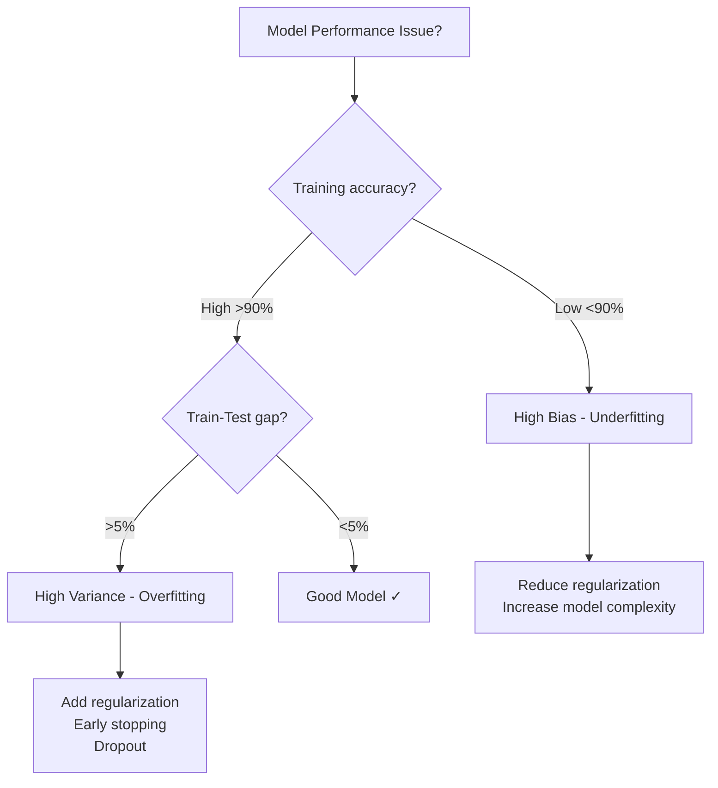

# IM17: Model Optimization Techniques - Exam Preparation

---

## Section A: Multiple Choice Questions (MCQ) - 15 Questions

### MCQ 1
**Question:** What is the primary difference between model parameters and hyperparameters?

**Options:**
- A) Parameters are set before training; hyperparameters are learned during training
- B) Parameters are learned during training; hyperparameters are set before training
- C) Both are learned during training
- D) Both are set before training

**✅ Correct Answer:** B

**📖 Explanation:** Parameters (like weights and biases) are learned from data during the training process through optimization algorithms. Hyperparameters (like learning rate, epochs, batch size) are set by the data scientist before training begins.

**❌ Why Others Are Wrong:**
- A) Reversed the definitions
- C) Only parameters are learned, not hyperparameters
- D) Only hyperparameters are set before training, parameters are learned

---

### MCQ 2
**Question:** A model has 95% training accuracy and 70% test accuracy. What is this model suffering from?

**Options:**
- A) Underfitting
- B) Overfitting
- C) Perfect fit
- D) Data leakage

**✅ Correct Answer:** B

**📖 Explanation:** The 25% gap between training (95%) and test (70%) accuracy indicates high variance - a classic overfitting signature. The model memorized training data but fails to generalize.

**❌ Why Others Are Wrong:**
- A) Underfitting shows poor training accuracy too
- C) Perfect fit would have small gap (<5%)
- D) Data leakage typically shows suspiciously high test accuracy

---

### MCQ 3
**Question:** What threshold gap between training and test accuracy indicates high variance (overfitting)?

**Options:**
- A) Greater than 1%
- B) Greater than 3%
- C) Greater than 5%
- D) Greater than 10%

**✅ Correct Answer:** C

**📖 Explanation:** If the difference between training and test accuracy exceeds 5%, it indicates a high variance model (overfitting). This is a standard industry threshold.

**❌ Why Others Are Wrong:**
- A) 1% gap is normal and acceptable
- B) 3% gap is still within acceptable range
- D) 10% is too lenient as a threshold

---

### MCQ 4
**Question:** In GridSearchCV, if param_grid has 4 values for max_depth, 3 values for min_samples_split, and 5-fold CV is used, how many models are trained?

**Options:**
- A) 12
- B) 20
- C) 60
- D) 7

**✅ Correct Answer:** C

**📖 Explanation:** Total combinations = 4 × 3 = 12. With 5-fold CV, each combination is trained 5 times. Total models = 12 × 5 = 60.

**❌ Why Others Are Wrong:**
- A) Only counts hyperparameter combinations, ignores CV folds
- B) Incorrect multiplication
- D) Just counts individual hyperparameter values

---

### MCQ 5
**Question:** What does Stratified K-Fold Cross-Validation preserve?

**Options:**
- A) Feature scaling across folds
- B) Class distribution across folds
- C) Random seed across folds
- D) Model weights across folds

**✅ Correct Answer:** B

**📖 Explanation:** Stratified K-Fold ensures each fold maintains the same proportion of classes as the original dataset. Critical for imbalanced datasets.

**❌ Why Others Are Wrong:**
- A) Feature scaling is handled by preprocessing, not CV
- C) Random seed is a separate parameter
- D) Model weights are relearned for each fold

---

### MCQ 6
**Question:** Which regularization technique creates sparse weights (many weights become exactly zero)?

**Options:**
- A) L2 regularization (Ridge)
- B) L1 regularization (Lasso)
- C) Dropout
- D) Early stopping

**✅ Correct Answer:** B

**📖 Explanation:** L1 regularization uses absolute values of weights as penalty, which pushes many weights to exactly zero, creating sparse solutions and acting as feature selection.

**❌ Why Others Are Wrong:**
- A) L2 shrinks weights but doesn't make them zero
- C) Dropout drops neurons, not weights
- D) Early stopping limits training time, doesn't affect weight sparsity

---

### MCQ 7
**Question:** In the regularized loss function L(θ) = L_data(θ) + λ × Ω(θ), what does increasing λ do?

**Options:**
- A) Makes the model more complex
- B) Makes the model simpler
- C) Increases training accuracy
- D) Has no effect on model complexity

**✅ Correct Answer:** B

**📖 Explanation:** Larger λ increases the penalty for complex solutions, pushing the model toward simpler solutions with smaller weights, reducing overfitting risk.

**❌ Why Others Are Wrong:**
- A) Higher λ reduces complexity, not increases
- C) Training accuracy typically decreases with stronger regularization
- D) λ directly controls the complexity-fitting tradeoff

---

### MCQ 8
**Question:** What happens to dropout during model inference (testing)?

**Options:**
- A) Dropout is applied with the same probability as training
- B) Dropout is deactivated; all neurons are used
- C) Dropout probability is doubled
- D) Only half the neurons are dropped

**✅ Correct Answer:** B

**📖 Explanation:** During inference, dropout is turned off and all neurons are active. The weights are typically scaled to compensate for the difference. Use model.eval() in PyTorch.

**❌ Why Others Are Wrong:**
- A) Dropout is only for training regularization
- C) No probability change occurs
- D) No neurons are dropped during inference

---

### MCQ 9
**Question:** Early stopping monitors which metric to decide when to stop training?

**Options:**
- A) Training loss only
- B) Training accuracy only
- C) Validation loss/metric
- D) Test accuracy

**✅ Correct Answer:** C

**📖 Explanation:** Early stopping monitors validation performance. When validation loss stops improving for 'patience' epochs, training stops to prevent overfitting.

**❌ Why Others Are Wrong:**
- A) Training loss keeps decreasing; not useful for stopping
- B) Training accuracy alone doesn't indicate generalization
- D) Test set should never be used during training/tuning

---

### MCQ 10
**Question:** What is data leakage in machine learning?

**Options:**
- A) When training data is too small
- B) When validation/test information leaks into training
- C) When model weights are too large
- D) When GPU memory overflows

**✅ Correct Answer:** B

**📖 Explanation:** Data leakage occurs when information from validation or test sets influences the training process, leading to overly optimistic performance estimates that don't generalize.

**❌ Why Others Are Wrong:**
- A) Small data is a different problem (underfitting)
- C) Large weights relate to regularization
- D) Memory overflow is a computational issue

---

### MCQ 11
**Question:** Which sklearn component helps prevent data leakage during preprocessing?

**Options:**
- A) train_test_split
- B) Pipeline
- C) GridSearchCV
- D) StandardScaler

**✅ Correct Answer:** B

**📖 Explanation:** Pipeline ensures preprocessing steps (like scaling) are fitted only on training data during each CV fold, preventing information leakage from validation data.

**❌ Why Others Are Wrong:**
- A) train_test_split just splits data, doesn't prevent leakage
- C) GridSearchCV uses Pipeline internally for this purpose
- D) StandardScaler can cause leakage if used incorrectly outside Pipeline

---

### MCQ 12
**Question:** In bias-variance tradeoff, low bias indicates:

**Options:**
- A) Low training accuracy
- B) High training accuracy
- C) High test accuracy
- D) Large train-test gap

**✅ Correct Answer:** B

**📖 Explanation:** Low bias means the model fits training data well, resulting in high training accuracy (typically >90%). It indicates the model has enough capacity to learn patterns.

**❌ Why Others Are Wrong:**
- A) Low training accuracy indicates high bias
- C) Test accuracy relates to variance, not bias directly
- D) Large gap indicates high variance

---

### MCQ 13
**Question:** What is the purpose of nested cross-validation?

**Options:**
- A) Faster training
- B) Honest performance estimation without optimistic bias
- C) Reduce model complexity
- D) Increase training data

**✅ Correct Answer:** B

**📖 Explanation:** Nested CV separates hyperparameter tuning (inner loop) from performance evaluation (outer loop), preventing optimistic bias from tuning on the same validation data used for reporting.

**❌ Why Others Are Wrong:**
- A) Nested CV is slower than regular CV
- C) Model complexity is controlled by hyperparameters/regularization
- D) Data size remains the same

---

### MCQ 14
**Question:** Label smoothing with ε=0.1 for a 3-class problem converts target [1, 0, 0] to approximately:

**Options:**
- A) [1, 0, 0]
- B) [0.9, 0.05, 0.05]
- C) [0.5, 0.25, 0.25]
- D) [0.33, 0.33, 0.33]

**✅ Correct Answer:** B

**📖 Explanation:** Label smoothing with ε=0.1 gives (1-ε)=0.9 to true class and distributes ε/(K-1)=0.1/2=0.05 to other classes.

**❌ Why Others Are Wrong:**
- A) No smoothing applied
- C) Too much smoothing (ε=0.5)
- D) Uniform distribution (ε=1)

---

### MCQ 15
**Question:** Which learning curve pattern indicates underfitting?

**Options:**
- A) Training loss low, validation loss high and increasing
- B) Both training and validation loss high and similar
- C) Training loss decreasing, validation loss stable
- D) Both losses decreasing with small gap

**✅ Correct Answer:** B

**📖 Explanation:** Underfitting shows both training and validation loss remaining high because the model is too simple to capture patterns in either dataset.

**❌ Why Others Are Wrong:**
- A) This indicates overfitting
- C) This is normal healthy training
- D) This indicates good fit

---

## Section B: Multiple Select Questions (MSQ) - 12 Questions

### MSQ 1
**Question:** Which of the following are hyperparameters? (Select ALL that apply)

**Options:**
- A) Neural network weights
- B) Learning rate
- C) Number of epochs
- D) Bias terms
- E) Batch size

**✅ Correct Answers:** B, C, E

**📖 Explanation:** Learning rate, epochs, and batch size are set before training. Weights and biases are learned during training (parameters).

**❌ Why Others Are Wrong:**
- A) Weights are learned parameters
- D) Biases are learned parameters

---

### MSQ 2
**Question:** Which techniques help reduce overfitting? (Select ALL that apply)

**Options:**
- A) L2 regularization
- B) Dropout
- C) Increasing model complexity
- D) Early stopping
- E) Data augmentation

**✅ Correct Answers:** A, B, D, E

**📖 Explanation:** L2 regularization, dropout, early stopping, and data augmentation all help reduce overfitting by limiting model complexity or increasing data diversity.

**❌ Why Others Are Wrong:**
- C) Increasing complexity typically increases overfitting

---

### MSQ 3
**Question:** Which are valid signatures of data leakage? (Select ALL that apply)

**Options:**
- A) Training accuracy 98%, validation accuracy 97%, test accuracy 70%
- B) ID columns showing high feature importance
- C) Results too good to be true
- D) Training accuracy 60%, test accuracy 55%
- E) Scaling done before train-test split

**✅ Correct Answers:** A, B, C, E

**📖 Explanation:** All except D indicate leakage: suspiciously close train-val with poor test, ID importance, unrealistic results, and preprocessing on full data.

**❌ Why Others Are Wrong:**
- D) This shows underfitting, not leakage

---

### MSQ 4
**Question:** Which metrics are appropriate for imbalanced classification? (Select ALL that apply)

**Options:**
- A) Accuracy
- B) F1 Score
- C) Precision
- D) Recall
- E) AUROC

**✅ Correct Answers:** B, C, D, E

**📖 Explanation:** F1 score, precision, recall, and AUROC are appropriate for imbalanced data. Accuracy can be misleading when classes are imbalanced.

**❌ Why Others Are Wrong:**
- A) Accuracy is misleading for imbalanced data

---

### MSQ 5
**Question:** Which are components of GridSearchCV? (Select ALL that apply)

**Options:**
- A) Estimator (model)
- B) Parameter grid
- C) Cross-validation strategy
- D) Scoring metric
- E) Test set evaluation

**✅ Correct Answers:** A, B, C, D

**📖 Explanation:** GridSearchCV requires estimator, param_grid, cv strategy, and scoring. Test set is kept separate and not used during grid search.

**❌ Why Others Are Wrong:**
- E) Test set should never be used during hyperparameter tuning

---

### MSQ 6
**Question:** High variance model characteristics include: (Select ALL that apply)

**Options:**
- A) Large gap between train and test accuracy
- B) High training accuracy
- C) Low test accuracy
- D) High training loss
- E) Model memorizes training data

**✅ Correct Answers:** A, B, C, E

**📖 Explanation:** High variance (overfitting) shows high train accuracy, low test accuracy, large gap, and memorization of training data.

**❌ Why Others Are Wrong:**
- D) High training loss indicates high bias (underfitting)

---

### MSQ 7
**Question:** Early stopping requires which parameters? (Select ALL that apply)

**Options:**
- A) monitor (metric to watch)
- B) patience (epochs to wait)
- C) min_delta (minimum improvement)
- D) learning_rate
- E) restore_best_weights

**✅ Correct Answers:** A, B, C, E

**📖 Explanation:** Early stopping needs monitor, patience, min_delta, and optionally restore_best_weights. Learning rate is a separate hyperparameter.

**❌ Why Others Are Wrong:**
- D) Learning rate is for optimizer, not early stopping

---

### MSQ 8
**Question:** Advantages of Pipeline in sklearn include: (Select ALL that apply)

**Options:**
- A) Prevents data leakage
- B) Faster training
- C) Cleaner code organization
- D) Automatic hyperparameter tuning
- E) Ensures preprocessing happens correctly in CV

**✅ Correct Answers:** A, C, E

**📖 Explanation:** Pipeline prevents leakage, organizes code, and ensures preprocessing fits only on training data in each CV fold.

**❌ Why Others Are Wrong:**
- B) Pipeline doesn't affect training speed
- D) GridSearchCV does tuning, not Pipeline alone

---

### MSQ 9
**Question:** L2 regularization effects include: (Select ALL that apply)

**Options:**
- A) Pushes weights toward zero
- B) Makes many weights exactly zero
- C) Increases training loss
- D) Reduces overfitting
- E) Creates sparse models

**✅ Correct Answers:** A, C, D

**📖 Explanation:** L2 shrinks weights toward zero (not exactly zero), increases training loss as penalty, and reduces overfitting.

**❌ Why Others Are Wrong:**
- B) L1 makes weights exactly zero, not L2
- E) L1 creates sparse models, not L2

---

### MSQ 10
**Question:** When should you use Stratified K-Fold? (Select ALL that apply)

**Options:**
- A) Imbalanced classification
- B) Regression problems
- C) Multi-class classification
- D) Binary classification with 50-50 split
- E) When class distribution must be preserved

**✅ Correct Answers:** A, C, E

**📖 Explanation:** Stratified K-Fold is essential for imbalanced data, multi-class problems, and when class distribution preservation matters.

**❌ Why Others Are Wrong:**
- B) Regression doesn't have classes to stratify
- D) Balanced 50-50 split doesn't need stratification

---

### MSQ 11
**Question:** Valid dropout probability values for hidden layers: (Select ALL that apply)

**Options:**
- A) 0.0
- B) 0.2
- C) 0.5
- D) 0.9
- E) 0.3

**✅ Correct Answers:** A, B, C, E

**📖 Explanation:** Common dropout values range from 0.0 to 0.5 for hidden layers. 0.9 is too aggressive and would cause severe underfitting.

**❌ Why Others Are Wrong:**
- D) 0.9 drops 90% of neurons, too extreme for most cases

---

### MSQ 12
**Question:** Nested cross-validation is used for: (Select ALL that apply)

**Options:**
- A) Honest performance estimation
- B) Research paper reporting
- C) Small dataset evaluation
- D) Faster hyperparameter tuning
- E) Fair model comparison

**✅ Correct Answers:** A, B, C, E

**📖 Explanation:** Nested CV provides honest estimates, is standard for research, works well for small data, and enables fair model comparisons.

**❌ Why Others Are Wrong:**
- D) Nested CV is slower, not faster

---

## Section C: Numerical/Calculation Questions - 8 Questions

### Numerical 1
**Question:** GridSearchCV has param_grid with 5 values for C, 4 values for kernel, and 3 values for gamma. With 5-fold CV, how many total model fits occur?

**Given:**
- C values: 5
- kernel values: 4
- gamma values: 3
- CV folds: 5

**Solution Steps:**
1. Total combinations = 5 × 4 × 3 = 60
2. Models per combination = 5 (folds)
3. Total fits = 60 × 5 = 300

**✅ Final Answer:** 300 model fits

---

### Numerical 2
**Question:** Training accuracy is 96%, test accuracy is 84%. Calculate the variance gap and determine if overfitting.

**Given:**
- Training accuracy = 96%
- Test accuracy = 84%
- Overfitting threshold = 5%

**Solution Steps:**
1. Variance gap = |96% - 84%| = 12%
2. Compare with threshold: 12% > 5%
3. Since gap exceeds 5%, model is overfitting

**✅ Final Answer:** Gap = 12%, Model is overfitting

---

### Numerical 3
**Question:** Label smoothing with ε=0.1 for 4-class classification. What is the smoothed probability for non-true classes?

**Given:**
- Smoothing factor ε = 0.1
- Number of classes K = 4

**Solution Steps:**
1. True class probability = 1 - ε = 1 - 0.1 = 0.9
2. Remaining probability = ε = 0.1
3. Distribution to other classes = ε / (K-1) = 0.1 / 3 = 0.0333

**✅ Final Answer:** Each non-true class gets 0.0333 (≈3.33%)

---

### Numerical 4
**Question:** In 10-fold CV, if each fold takes 2 minutes to train, and GridSearch has 15 hyperparameter combinations, what is total training time?

**Given:**
- Folds: 10
- Time per fold: 2 minutes
- Combinations: 15

**Solution Steps:**
1. Total model fits = 15 × 10 = 150
2. Total time = 150 × 2 = 300 minutes
3. Convert to hours = 300 / 60 = 5 hours

**✅ Final Answer:** 300 minutes (5 hours)

---

### Numerical 5
**Question:** Dataset has 1000 samples: 900 Class 0, 100 Class 1. In Stratified 5-Fold, how many Class 1 samples in each validation fold?

**Given:**
- Total samples: 1000
- Class 0: 900, Class 1: 100
- Folds: 5

**Solution Steps:**
1. Each validation fold = 1000 / 5 = 200 samples
2. Class 1 proportion = 100/1000 = 10%
3. Class 1 per fold = 200 × 10% = 20

**✅ Final Answer:** 20 Class 1 samples per validation fold

---

### Numerical 6
**Question:** Dropout rate p=0.3 in a layer with 100 neurons. On average, how many neurons are active during training?

**Given:**
- Total neurons: 100
- Dropout rate p: 0.3

**Solution Steps:**
1. Probability of being active = 1 - p = 1 - 0.3 = 0.7
2. Average active neurons = 100 × 0.7 = 70

**✅ Final Answer:** 70 neurons active on average

---

### Numerical 7
**Question:** Baseline F1 score = 0.65, tuned model F1 = 0.78. Calculate percentage improvement.

**Given:**
- Baseline F1: 0.65
- Tuned F1: 0.78

**Solution Steps:**
1. Improvement = 0.78 - 0.65 = 0.13
2. Percentage = (0.13 / 0.65) × 100 = 20%

**✅ Final Answer:** 20% improvement

---

### Numerical 8
**Question:** Nested CV with 5 outer folds and 3 inner folds. GridSearch tests 8 combinations. How many total model fits?

**Given:**
- Outer folds: 5
- Inner folds: 3
- Combinations: 8

**Solution Steps:**
1. Inner loop fits per outer fold = 8 × 3 = 24
2. Final model fit per outer fold = 1
3. Total per outer fold = 24 + 1 = 25
4. Total fits = 5 × 25 = 125

**✅ Final Answer:** 125 model fits

---

## Section D: Fill in the Blanks - 10 Questions

### Fill 1
**Question:** The difference between training and test accuracy exceeding _______ indicates high variance.

**Answer:** 5%

**Explanation:** A gap greater than 5% between training and test accuracy suggests the model is overfitting (high variance).

---

### Fill 2
**Question:** In sklearn, _______ is used to prevent data leakage by keeping preprocessing inside cross-validation.

**Answer:** Pipeline

**Explanation:** Pipeline ensures preprocessing steps fit only on training data in each CV fold.

---

### Fill 3
**Question:** L1 regularization is also known as _______ and creates sparse weights.

**Answer:** Lasso

**Explanation:** L1 regularization (Lasso) pushes many weights to exactly zero, creating sparse solutions.

---

### Fill 4
**Question:** Training accuracy >90% indicates _______ bias.

**Answer:** Low

**Explanation:** High training accuracy means the model fits training data well, indicating low bias.

---

### Fill 5
**Question:** In GridSearchCV, the parameter _______ controls how many CPU cores are used.

**Answer:** n_jobs

**Explanation:** n_jobs=-1 uses all available cores; n_jobs=1 uses single core.

---

### Fill 6
**Question:** Early stopping monitors _______ performance to decide when to stop training.

**Answer:** Validation

**Explanation:** Validation loss/metric is monitored; training stops when validation performance degrades.

---

### Fill 7
**Question:** _______ K-Fold preserves class distribution in each fold.

**Answer:** Stratified

**Explanation:** Stratified K-Fold maintains the same class proportions as the original dataset in each fold.

---

### Fill 8
**Question:** In the regularized loss L(θ) = L_data(θ) + λ×Ω(θ), λ controls regularization _______.

**Answer:** strength

**Explanation:** Lambda (λ) determines how strongly the complexity penalty affects the total loss.

---

### Fill 9
**Question:** During inference, dropout is _______ and all neurons are active.

**Answer:** deactivated (or disabled/off)

**Explanation:** Dropout only applies during training. Use model.eval() for inference.

---

### Fill 10
**Question:** _______ cross-validation separates hyperparameter tuning from performance evaluation.

**Answer:** Nested

**Explanation:** Nested CV has inner loop for tuning and outer loop for honest evaluation.

---

## 📚 Quick Revision Points

### Key Formulas

| Formula | Description |
|---------|-------------|
| Total GridSearch fits = Combinations × CV folds | Calculate training time |
| Variance gap = \|Train accuracy - Test accuracy\| | Check for overfitting |
| Label smoothing: (1-ε) for true, ε/(K-1) for others | Soft label calculation |
| Dropout active neurons = Total × (1-p) | Average active during training |

### Key Concepts Summary

| Concept | One-Line Definition | When to Use |
|---------|---------------------|-------------|
| Grid Search CV | Exhaustive hyperparameter search | When search space is small |
| Stratified K-Fold | CV preserving class distribution | Imbalanced classification |
| L2 Regularization | Weight shrinkage penalty | General overfitting prevention |
| Dropout | Random neuron deactivation | Neural network regularization |
| Early Stopping | Stop when validation degrades | Prevent overtraining |
| Pipeline | Preprocessing inside CV | Always, prevents leakage |

### Common Exam Traps

1. **Trap**: Accuracy is best metric for all problems
   **Correct**: Use F1/Precision/Recall for imbalanced data

2. **Trap**: High training accuracy = good model
   **Correct**: Check train-test gap for overfitting

3. **Trap**: L1 and L2 do the same thing
   **Correct**: L1 creates sparsity, L2 just shrinks weights

4. **Trap**: Dropout works same in training and inference
   **Correct**: Dropout is OFF during inference

---

## 🚀 Section E: Shortcuts & Cheat Codes for Exam

### ⚡ One-Liner Shortcuts

| Concept | Shortcut | When to Use |
|---------|----------|-------------|
| Overfitting check | Train - Test > 5% = Overfitting | Any model evaluation |
| Low bias check | Train accuracy > 90% = Low bias | Model capacity check |
| GridSearch fits | Combos × Folds = Total fits | Time estimation |
| L1 vs L2 | L1 = Zero, L2 = Small | Regularization choice |
| Dropout during test | Always OFF (model.eval()) | Inference code |

### 🎯 Memory Tricks (Mnemonics)

1. **BIAS-VARIANCE**: **B**ig training, **V**ariation between train-test
   - Low Bias = High training accuracy
   - Low Variance = Small train-test gap

2. **LASSO** = **L**ess **A**nd **S**parse **S**olution (L1)
   - L1 makes weights zero

3. **RIDGE** = **R**educes **I**n **D**irection of zero without **G**oing **E**xactly (L2)
   - L2 shrinks but doesn't zero

4. **PIPE** prevents **L**eakage **I**n **P**reprocessing **E**verytime
   - Always use Pipeline in sklearn

5. **STRAT** = **S**ame **T**arget **R**atios **A**cross **T**raining
   - Stratified K-Fold preserves class ratios

### 🔢 Quick Calculation Hacks

| Scenario | Hack | Example |
|----------|------|---------|
| GridSearch combinations | Multiply all grid sizes | 4×3×5 = 60 combos |
| With K-fold CV | Combos × K | 60 × 5 = 300 fits |
| Dropout active neurons | Total × (1-p) | 100 × 0.7 = 70 |
| Label smoothing true class | 1 - ε | 1 - 0.1 = 0.9 |
| Label smoothing other class | ε / (K-1) | 0.1 / 3 = 0.033 |

### 📝 Last-Minute Formula Sheet

```
📌 Overfitting: |Train - Test| > 5%
📌 Low Bias: Train accuracy > 90%
📌 GridSearch fits: combinations × folds
📌 L2 penalty: λ × Σ(weights²)
📌 L1 penalty: λ × Σ|weights|
📌 Dropout active: neurons × (1 - p)
📌 Label smooth: True=(1-ε), Other=ε/(K-1)
```

### 🎓 Interview One-Liners

| Question Pattern | Safe Answer Template |
|------------------|---------------------|
| "What is overfitting?" | "Low bias, high variance - model memorizes training, fails on new data" |
| "Grid vs Random Search?" | "Grid is exhaustive but slow; Random samples randomly, faster for large spaces" |
| "Why Pipeline?" | "Prevents data leakage by keeping preprocessing inside CV" |
| "L1 vs L2?" | "L1 creates sparsity (zero weights), L2 shrinks weights uniformly" |
| "What is regularization?" | "Complexity tax that prevents memorization by penalizing large weights" |

### ⚠️ "If You Forget Everything, Remember This"

1. **Golden Rule 1**: Train-Test gap > 5% = Overfitting, add regularization
2. **Golden Rule 2**: Always use Pipeline to prevent data leakage
3. **Golden Rule 3**: Use F1 score for imbalanced data, not accuracy
4. **Golden Rule 4**: Regularization increases training loss, may improve validation
5. **Golden Rule 5**: Dropout OFF during inference (model.eval())

### 🔄 Quick Decision Flowchart



### 🎯 Safe Answer Patterns

- **For "What is X?"** → Definition + One-line use case + When to use
- **For "Explain X"** → Analogy + Technical definition + Example
- **For "Compare X vs Y"** → Table with 3-4 key differences
- **For "Calculate X"** → Formula + Step-by-step + Final answer
- **For "Why X?"** → Problem it solves + Alternative comparison
- **For "Diagnose this model"** → Check bias (train acc) → Check variance (gap) → Suggest fix

---

## 📊 Quick Reference Tables

### Regularization Comparison

| Technique | Effect | Best For | Parameter |
|-----------|--------|----------|-----------|
| L1 (Lasso) | Sparse weights | Feature selection | λ |
| L2 (Ridge) | Small weights | General use | λ or weight_decay |
| Dropout | Random neurons off | Neural networks | p (0.2-0.5) |
| Early Stopping | Limits epochs | All models | patience |

### Cross-Validation Types

| Type | When to Use | Preserves Classes |
|------|-------------|-------------------|
| K-Fold | General | No |
| Stratified K-Fold | Imbalanced data | Yes |
| LOOCV | Very small data | N/A |
| Nested CV | Research papers | Depends on inner CV |

---

**Good luck with your exam! 🎯**
