# IM9: Linear Regression Fundamentals - Classroom Session (Part 1)

> 📚 **This is Part 1** covering: Introduction to Regression, Types of Regression, Simple Linear Regression Equation, Slope and Intercept, Ordinary Least Squares (OLS)
> 📘 **Next:** [Part 2](./IM9_LinearRegressionFundamentals2.md), [Part 3](./IM9_LinearRegressionFundamentals3.md)

---

## 🗺️ Mind Map - Topics to Cover


---

## 🎓 Classroom Conversation

### Topic 1: What is Regression?

**Teacher:** Good morning students! Ippudu mana journey lo oka very important concept start chestunnam - Linear Regression. Idi machine learning lo "Hello World" laga untundi. Every data scientist ki idi foundation!

**Beginner Student:** Sir, regression ante enti exactly? English word lagundi, edaina special meaning undi?

**Teacher:** Excellent question to start with! Let me explain with a simple analogy first.

> 💡 **Jargon Alert - Regression**
> **Simple Explanation:** "Going back to average" or "predicting a value." Originally coined by Francis Galton who noticed children's heights tend to "regress" towards the average of the population.
> **Example:** If very tall parents have children, those children are usually tall, but often not AS tall as parents - they "regress" towards average height.

**Mathematical Definition:**
Regression is a statistical technique that finds the relationship between:
- **Dependent variable (Y):** What we want to predict (target/output)
- **Independent variable(s) (X):** What we use to make the prediction (features/input)

**Clever Student:** Sir, correlation kuda relationship chepthundi kadha? Regression different enti?

**Teacher:** Ah, beautiful distinction! Let me clarify:

| Aspect | Correlation | Regression |
|--------|-------------|------------|
| **Purpose** | Measures STRENGTH of relationship | PREDICTS values using relationship |
| **Output** | Number between -1 and +1 | An equation Y = f(X) |
| **Direction** | Symmetric (X,Y same as Y,X) | Asymmetric (X predicts Y) |
| **Usage** | "How strongly related?" | "What will Y be for given X?" |

**Example:**
- **Correlation:** "Height and weight have correlation of 0.78" (just a number)
- **Regression:** "Weight = 2.5 × Height - 50" (an equation to predict!)

**Practical Student:** Sir, real life lo regression ekkada use chestharu? Interview lo aduguthara?

**Teacher:** Absolutely! Regression is EVERYWHERE. Let me give you real-world examples:

| Industry | Regression Use Case |
|----------|---------------------|
| **Real Estate** | Predict house prices based on size, location, rooms |
| **Finance** | Predict stock prices, credit risk, loan defaults |
| **Marketing** | Predict sales based on advertising spend (MMM!) |
| **Healthcare** | Predict blood pressure, glucose levels |
| **E-commerce** | Predict customer lifetime value |
| **Automotive** | Predict fuel efficiency, brake pad wear |
| **Agriculture** | Predict crop yield based on weather, soil |

**Beginner Student:** Sir, interview lo ela adugutharu this concept?

**Teacher:** Common interview questions:

1. **"What is regression?"** 
   → "Regression is a supervised learning technique that predicts continuous numerical values using the relationship between input features and target variable."

2. **"Give an example"**
   → "Predicting house price based on square footage - the relationship helps us estimate price for a new house."

3. **"Difference between classification and regression?"**
   → "Classification predicts categories (spam/not spam), regression predicts numbers (price = ₹45L)"

---

### Topic 2: Types of Regression

**Teacher:** Ippudu different types of regression chuddam. Many types untayi!

**Curious Student:** Sir, all types explain cheyandi. Which ones are most important for exams?

**Teacher:** Let me create a comprehensive overview:


**Complete Types Table:**

| Type | Features | Equation | Use Case |
|------|----------|----------|----------|
| **Simple Linear** | 1 | Y = β₀ + β₁X | Single predictor, straight line |
| **Multiple Linear** | 2+ | Y = β₀ + β₁X₁ + β₂X₂ + ... | Multiple predictors |
| **Polynomial** | 1+ | Y = β₀ + β₁X + β₂X² + ... | Curved relationships |
| **Ridge** | Any | MSE + λΣβ² | Multicollinearity handling |
| **Lasso** | Any | MSE + λΣ|β| | Feature selection |
| **Elastic Net** | Any | MSE + λ₁Σ|β| + λ₂Σβ² | Best of Ridge and Lasso |

**Debate Student:** Sir, simple linear chalu kadha? Multiple enduku learn cheyali?

**Teacher:** Great question! Let me explain with marketing example:

**Simple Linear Reality Check:**
If I say: "Sales depends ONLY on TV advertising"
- Equation: Sales = β₀ + β₁ × TV_spend

**Is this realistic?** NO! Sales depends on:
- TV advertising
- Social media
- Print media
- Discounts
- Season
- Competitor activity
- And many more!

So **Multiple Linear Regression** is needed for most real-world scenarios!

**Critique Student:** Sir, but more features better means? Overfitting risk undi kadha?

**Teacher:** Excellent point! You're absolutely right. More features don't always mean better:

| Scenario | Problem | Solution |
|----------|---------|----------|
| Too few features | Underfitting, missing patterns | Add relevant features |
| Too many features | Overfitting, multicollinearity | Feature selection, regularization |
| Irrelevant features | Noise, wrong coefficients | Domain knowledge, feature importance |

**Rule of Thumb:** Start with simple, add complexity if needed!

---

### Topic 3: Simple Linear Regression - The Foundation

**Teacher:** Ippudu Simple Linear Regression deeply understand cheddham. Idi foundation for everything!

> 💡 **Jargon Alert - Simple Linear Regression**
> **Simple Explanation:** Finding a straight line that best fits the relationship between ONE input (X) and ONE output (Y).
> **Example:** Like drawing a "line of best fit" through scattered points on a graph.

**Beginner Student:** Sir, equation cheppandi. Very slowly explain cheyandi.

**Teacher:** Of course! The equation is simple but powerful:

## The Simple Linear Regression Equation

$$Y = \beta_0 + \beta_1 X + \epsilon$$

**Breaking it down:**

| Component | Symbol | Meaning | English Name |
|-----------|--------|---------|--------------|
| **Y** | Y | What we predict | Dependent Variable / Target |
| **β₀** | beta-zero | Starting point | Intercept / Bias |
| **β₁** | beta-one | How much Y changes per unit X | Slope / Coefficient |
| **X** | X | What we use to predict | Independent Variable / Feature |
| **ε** | epsilon | Prediction error | Residual / Error Term |

**Clever Student:** Sir, visual representation tho explain cheyandi please.

**Teacher:** Perfect! Let me draw it for you:

```
    Y (Sales)
    |
 100|           * *
    |        *  /
  80|      *  /
    |    *  /      <- The equation gives us this LINE
  60|  *  /            Y = 20 + 0.8X
    |*  /
  40|  /
    |/
  20|
    +-------------------------> X (Marketing Spend)
       25    50    75    100
```

**In this example:**
- **β₀ = 20:** When marketing spend = 0, sales = 20 (baseline sales)
- **β₁ = 0.8:** For every ₹1 spent on marketing, sales increase by ₹0.80

**Practical Student:** Sir, interview lo slope aur intercept ka difference puchenge. Clear answer kya hai?

**Teacher:** Great! Here's the clear answer:

| Term | What it means | How to explain in interview |
|------|---------------|----------------------------|
| **Intercept (β₀)** | Y value when X = 0 | "The predicted value when all inputs are zero - the baseline" |
| **Slope (β₁)** | Change in Y per unit change in X | "How much the output changes when input increases by 1 unit" |

**Example Answer:**
"If our model is Price = 10 + 5×Size, then:
- Intercept = 10 means a house with zero square feet would cost ₹10L (baseline)
- Slope = 5 means each additional square foot increases price by ₹5L"

---

### Topic 4: The Error Term (ε) - Very Important!

**Teacher:** Ippudu ε (epsilon) - the error term - understand cheddham. Idi bahut important!

**Beginner Student:** Sir, error term enduku kavali? Perfect line draw chesthe error undadu kadha?

**Teacher:** Excellent doubt! Let me explain with a critical insight:

> 💡 **Jargon Alert - Error Term (ε / Residual)**
> **Simple Explanation:** The difference between what actually happened and what our line predicted. No model is perfect, so there's always some error!
> **Example:** If our model predicts sales = ₹100L but actual sales = ₹103L, error = ₹3L

**Why errors exist (ALWAYS!):**

1. **Unmeasured variables:** Things we didn't include in model
2. **Measurement errors:** Data collection imprecision
3. **Random variation:** Unpredictable human behavior
4. **Model limitations:** Real relationship may not be perfectly linear

**Visual Understanding:**

```
    Y
    |
    |    *  <- Actual point (above line = positive error)
    |   /
    |  /  *  <- Another actual point
    | /  /
    |/__/_______ <- Our regression line
    |   \
    |    *  <- Actual point (below line = negative error)
    |
    +-----------------> X
```

**The key insight:**
- Points ABOVE the line: Positive residual (Y_actual > Y_predicted)
- Points BELOW the line: Negative residual (Y_actual < Y_predicted)
- Points ON the line: Zero residual (perfect prediction - rare!)

**Curious Student:** Sir, as you mentioned earlier, ML models always have error - RMSE never zero. Why?

**Teacher:** Exactly what I explained in the Marketing Mix session! Let me elaborate:

**Why RMSE is never zero:**

1. **Randomness in real world:** Human behavior is unpredictable
2. **Missing information:** We can't measure EVERYTHING
3. **Simplification:** We use LINEAR model for potentially nonlinear reality
4. **Overfitting prevention:** Zero error on training = memorization, not learning!

**Key Quote from our session:**
> "Machine learning models always produce estimates rather than exact values."

**Healthy error is GOOD!** It means your model generalizes rather than memorizes.

---

### Topic 5: Ordinary Least Squares (OLS) - Finding the Best Line

**Teacher:** Ippudu oka crucial question: How do we FIND the best values for β₀ and β₁?

**Clever Student:** Sir, infinite lines draw cheskovachu - which one is "best"?

**Teacher:** Perfect question! This is where **OLS - Ordinary Least Squares** comes in!

> 💡 **Jargon Alert - Ordinary Least Squares (OLS)**
> **Simple Explanation:** A method to find the best line by making the total squared errors as small as possible.
> **Why squared?** To make all errors positive and penalize big errors more!
> **Example:** Like finding the position that minimizes the total "spring force" if every data point was connected to the line by a spring.

**The OLS Process:**

```mermaid
flowchart TD
    A[All Data Points X,Y] --> B[Propose a line: Y = β₀ + β₁X]
    B --> C[Calculate predictions Ŷ for each X]
    C --> D[Calculate residuals: e = Y - Ŷ]
    D --> E[Square each residual: e²]
    E --> F[Sum all squared residuals: Σe²]
    F --> G{Is this sum minimum?}
    G -->|No| H[Adjust β₀ and β₁]
    H --> B
    G -->|Yes| I[Found Best Line! ✅]
```



**Mathematical Definition:**

$$minimize \sum_{i=1}^{n} (Y_i - \hat{Y}_i)^2 = \sum_{i=1}^{n} (Y_i - \beta_0 - \beta_1 X_i)^2$$

**Beginner Student:** Sir, why SQUARED? Simple difference ka sum kyu nahi?

**Teacher:** Brilliant question! Three reasons:

**Reason 1: Positive and Negative Cancel Out**
- Without squaring: (+5) + (-5) = 0 ← Looks perfect but it's not!
- With squaring: (5²) + (5²) = 50 ← Captures both errors!

**Reason 2: Big Errors are Worse**
- Error of 2: squared = 4
- Error of 10: squared = 100
- Squaring penalizes large errors MORE (which is what we want!)

**Reason 3: Mathematically Convenient**
- Squared function is smooth, differentiable
- Easy to find minimum using calculus

**Visual Comparison:**
```
Error    | Without Square | With Square
---------|----------------|------------
+2       | 2              | 4
-3       | -3             | 9
+1       | 1              | 1
-2       | -2             | 4
---------|----------------|------------
SUM      | -2 (wrong!)    | 18 (correct!)
```

---

### Topic 6: OLS Formula Derivation (Simplified)

**Teacher:** Ippudu actual formulas for β₀ and β₁ chuddam.

**Clever Student:** Sir, derivation complete ga explain cheyandi. Exam lo important!

**Teacher:** Let me show you both the formula AND the intuition:

**Formula for Slope (β₁):**

$$\beta_1 = \frac{\sum_{i=1}^{n}(X_i - \bar{X})(Y_i - \bar{Y})}{\sum_{i=1}^{n}(X_i - \bar{X})^2} = \frac{Cov(X,Y)}{Var(X)}$$

**Formula for Intercept (β₀):**

$$\beta_0 = \bar{Y} - \beta_1 \bar{X}$$

**Where:**
- X̄ = mean of all X values
- Ȳ = mean of all Y values
- Cov(X,Y) = Covariance between X and Y
- Var(X) = Variance of X

**Intuitive Understanding:**

**For β₁ (slope):**
- Numerator: How X and Y move TOGETHER (covariance)
- Denominator: How spread out X is (variance)
- If X and Y move together a lot → high slope
- If X is very spread out → lower slope

**For β₀ (intercept):**
- The line MUST pass through the point (X̄, Ȳ) - the center of data!
- Once we know slope and center point, intercept is determined

**Practical Student:** Sir, Python mein ye calculation hota hai automatically na?

**Teacher:** Yes! But understanding the formula helps in interviews. Let me show both:

```python
# Method 1: Manual Calculation (for understanding)
import numpy as np

X = np.array([1, 2, 3, 4, 5])
Y = np.array([2, 4, 5, 4, 5])

# Calculate means
X_mean = np.mean(X)  # 3.0
Y_mean = np.mean(Y)  # 4.0

# Calculate slope (β₁)
numerator = np.sum((X - X_mean) * (Y - Y_mean))  # Covariance part
denominator = np.sum((X - X_mean) ** 2)           # Variance part
beta_1 = numerator / denominator
print(f"Slope (β₁): {beta_1:.4f}")  # 0.6

# Calculate intercept (β₀)
beta_0 = Y_mean - beta_1 * X_mean
print(f"Intercept (β₀): {beta_0:.4f}")  # 2.2

# So our equation is: Y = 2.2 + 0.6X

# Method 2: Using sklearn (for production)
from sklearn.linear_model import LinearRegression

model = LinearRegression()
model.fit(X.reshape(-1, 1), Y)

print(f"sklearn Intercept: {model.intercept_:.4f}")  # 2.2
print(f"sklearn Slope: {model.coef_[0]:.4f}")         # 0.6

# Same results! ✅
```

---

### Topic 7: Visualizing the Best Fit Line

**Teacher:** Ippudu practical visualization chuddam.

```python
import numpy as np
import matplotlib.pyplot as plt
from sklearn.linear_model import LinearRegression

# Sample data: Hours studied vs Marks obtained
hours = np.array([1, 2, 3, 4, 5, 6, 7, 8]).reshape(-1, 1)
marks = np.array([35, 45, 50, 55, 65, 70, 80, 85])

# Fit model
model = LinearRegression()
model.fit(hours, marks)

# Get predictions
predictions = model.predict(hours)

# Calculate residuals
residuals = marks - predictions

# Plot
fig, axes = plt.subplots(1, 2, figsize=(14, 5))

# Plot 1: Data with regression line
axes[0].scatter(hours, marks, color='blue', s=100, label='Actual Data')
axes[0].plot(hours, predictions, color='red', linewidth=2, label='Regression Line')
for i in range(len(hours)):
    axes[0].plot([hours[i], hours[i]], [marks[i], predictions[i]], 
                 'g--', alpha=0.7, linewidth=1)
axes[0].set_xlabel('Hours Studied')
axes[0].set_ylabel('Marks Obtained')
axes[0].set_title(f'Linear Regression: Y = {model.intercept_:.2f} + {model.coef_[0]:.2f}X')
axes[0].legend()

# Plot 2: Residual plot
axes[1].bar(range(len(residuals)), residuals, color='green', alpha=0.7)
axes[1].axhline(y=0, color='red', linestyle='--')
axes[1].set_xlabel('Data Point Index')
axes[1].set_ylabel('Residual (Actual - Predicted)')
axes[1].set_title('Residual Plot')

plt.tight_layout()
plt.show()

print(f"\nModel Equation: Marks = {model.intercept_:.2f} + {model.coef_[0]:.2f} × Hours")
print(f"Interpretation: For every additional hour of study, marks increase by {model.coef_[0]:.2f}")
```

**Teacher's Interpretation:**
- Green dashed lines show the RESIDUALS (errors)
- OLS minimizes the sum of these squared green lines!
- Residual plot should show random pattern (no structure)

---

## 📝 Teacher Summary - Part 1

**Teacher:** Okay students, let's summarize Part 1:

### Key Takeaways

1. **Regression predicts continuous values** using relationships between variables
2. **Simple Linear Regression:** Y = β₀ + β₁X + ε
3. **β₀ (intercept):** Y value when X = 0
4. **β₁ (slope):** Change in Y per unit change in X
5. **ε (error):** Difference between actual and predicted
6. **OLS:** Finds best line by minimizing sum of squared errors
7. **Errors always exist** - zero RMSE is impossible (and undesirable!)

### Formulas to Remember

| Formula | Purpose |
|---------|---------|
| Y = β₀ + β₁X + ε | Regression equation |
| β₁ = Cov(X,Y) / Var(X) | Slope calculation |
| β₀ = Ȳ - β₁X̄ | Intercept calculation |
| Minimize Σ(Y - Ŷ)² | OLS objective |

### Common Interview Questions from Part 1

| Question | Key Points |
|----------|------------|
| "What is regression?" | Predicts continuous values using relationships |
| "Difference between correlation and regression?" | Correlation measures strength, regression predicts values |
| "Explain the regression equation" | Y = β₀ + β₁X, explain each term |
| "Why do we square errors in OLS?" | Avoid cancellation, penalize big errors more |
| "What is the intercept?" | Baseline value when X = 0 |

---

> 📘 **Continue to Part 2:** [IM9_LinearRegressionFundamentals2.md](./IM9_LinearRegressionFundamentals2.md) for Model Assumptions, Evaluation Metrics (R², RMSE, MAE, MAPE), and Coefficient Interpretation.
