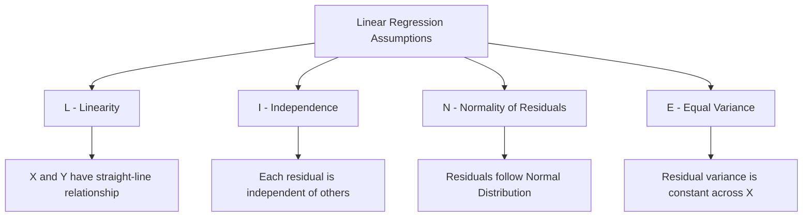

# IM9: Linear Regression Fundamentals - Classroom Session (Part 2)

> 📚 **This is Part 2** covering: Model Assumptions, R-Squared, RMSE, MAE, MAPE, Coefficient Interpretation, Residual Analysis
> 📘 **Previous:** [Part 1](./IM9_LinearRegressionFundamentals1.md)
> 📘 **Next:** [Part 3](./IM9_LinearRegressionFundamentals3.md)

---

## 🎓 Classroom Conversation (Continued)

### Topic 8: Assumptions of Linear Regression

**Teacher:** Ippudu very important topic - Linear Regression eppudu properly work avthundi? Answer: When certain ASSUMPTIONS are met!

**Beginner Student:** Sir, assumptions ante rules laga untaya? Why we need them?

**Teacher:** Exactly like exam rules! If rules are broken, results may not be trustworthy.

> 💡 **Jargon Alert - Model Assumptions**
> **Simple Explanation:** Conditions that MUST be true for the model to work correctly. If violated, predictions may be unreliable.
> **Example:** Like how a car needs fuel, proper tires, and working brakes to run correctly - regression needs certain conditions!

**The 4 KEY Assumptions (Remember: LINE)**

| Letter | Assumption | Simple Meaning |
|--------|------------|----------------|
| **L** | Linearity | Relationship is a straight line |
| **I** | Independence | Errors are not related to each other |
| **N** | Normality | Errors follow bell curve distribution |
| **E** | Equal Variance (Homoscedasticity) | Spread of errors is constant |



**Clever Student:** Sir, each assumption ko detail mein explain karo.

---

### Topic 9: Assumption 1 - Linearity

**Teacher:** First assumption: The relationship between X and Y must be LINEAR - a straight line!

**What it means:**
- Y changes by a CONSTANT amount for each unit change in X
- No curves, no bends, no sudden jumps

**How to check:**
1. Scatter plot of X vs Y - should look like a straight line pattern
2. Residual plot - should show random scatter, no patterns

**Good (Linear):**
```
Y |          *
  |        *
  |      *
  |    *
  |  *
  +-----------> X
```

**Bad (Non-Linear):**
```
Y |    *     *
  |  *         *
  |*             *
  |               *
  +-----------------> X
```

**Practical Student:** Sir, agar linearity violate avithey ela fix chestham?

**Teacher:** Great question! Solutions:

| Problem | Solution |
|---------|----------|
| Curved relationship | Log transform: log(Y) or log(X) |
| U-shaped pattern | Add polynomial term: X² |
| Complex curve | Use polynomial regression |
| Very nonlinear | Consider non-linear models |

---

### Topic 10: Assumption 2 - Independence of Errors

**Teacher:** Second assumption: Each error should be INDEPENDENT - not related to others.

> 💡 **Jargon Alert - Independence of Errors**
> **Simple Explanation:** Knowing one prediction error shouldn't help you guess another error. Like coin tosses - each is independent!
> **Example:** If you make a big error predicting Monday's sales, that shouldn't affect Tuesday's prediction error.

**When this is violated:**
- **Time series data:** Today's error related to yesterday's
- **Spatial data:** Nearby points have similar errors
- **Grouped data:** Same-school students have similar errors

**How to check:**
- Durbin-Watson test (should be ~2)
- Plot residuals over time - no patterns

**Critique Student:** Sir, interview lo aduguthey what to say?

**Teacher:** Interview answer: "Independence means residuals at one observation are not correlated with residuals at another. Violation is common in time series data and can be detected using the Durbin-Watson test. Solution: Use time series methods or add lag variables."

---

### Topic 11: Assumption 3 - Normality of Residuals

**Teacher:** Third assumption: Residuals should follow a NORMAL distribution (bell curve).

**What it means:**
- Most residuals near zero
- Few extreme residuals
- Symmetric around zero

**How to check:**
1. **Histogram** of residuals - should be bell-shaped
2. **Q-Q Plot** - points should fall on diagonal line

**Beginner Student:** Sir, Q-Q plot enti?

**Teacher:** Q-Q (Quantile-Quantile) plot compares your data to normal distribution:

```
Good Q-Q Plot:           Bad Q-Q Plot:
Sample |       *         Sample |  *  *  *
       |     *                  |       *
       |   *                    |      *
       | *                      |  *
       +-----> Theory           +-----> Theory
  (Points on line)              (Points curve away)
```

**Important Note:** For large samples (n > 30), normality becomes less critical due to Central Limit Theorem!

---

### Topic 12: Assumption 4 - Homoscedasticity (Equal Variance)

**Teacher:** Fourth assumption: Variance of residuals should be CONSTANT across all X values.

> 💡 **Jargon Alert - Homoscedasticity**
> **Simple Explanation:** The "spread" of prediction errors should be the SAME whether you're predicting for small X or large X values.
> **Opposite:** Heteroscedasticity - when spread CHANGES (like a growing cone)

**Visual Comparison:**

**Homoscedasticity (Good):**
```
Error |    *    *    *
      |  *    *    *
      |    *    *    *
      +-------------------> X
      (Same spread throughout)
```

**Heteroscedasticity (Bad):**
```
Error |                  *
      |               *  *  *
      |            *  *
      |         *  *
      |      *
      +-----------------------> X
      (Spread INCREASES with X!)
```

**Real Example:**
- Predicting spending based on income
- Poor families: spending ± ₹2k variation
- Rich families: spending ± ₹50k variation
- This violates homoscedasticity!

**Solutions:**
1. Log transformation of Y
2. Weighted Least Squares
3. Robust standard errors

---

### Topic 13: R-Squared (R²) - The Key Metric

**Teacher:** Ippudu evaluation metrics chuddam. Starting with R-Squared!

> 💡 **Jargon Alert - R-Squared (Coefficient of Determination)**
> **Simple Explanation:** What percentage of the variation in Y is explained by your model? Higher = Better!
> **Range:** 0 to 1 (or 0% to 100%)
> **Example:** R² = 0.85 means your model explains 85% of why Y values vary.

**Formula:**

$$R^2 = 1 - \frac{SS_{residual}}{SS_{total}} = 1 - \frac{\sum(Y - \hat{Y})^2}{\sum(Y - \bar{Y})^2}$$

**Breaking it down:**

| Term | Meaning | Formula |
|------|---------|---------|
| **SS_total** | Total variation in Y | Σ(Y - Ȳ)² |
| **SS_residual** | Unexplained variation (errors) | Σ(Y - Ŷ)² |
| **R²** | Explained variation | 1 - (SS_res / SS_total) |

**Beginner Student:** Sir, numbers se example dedo.

**Teacher:** Let me show with a calculation:

```python
import numpy as np

# Actual values
Y = np.array([10, 20, 30, 40, 50])
Y_mean = np.mean(Y)  # 30

# Predicted values (from our model)
Y_pred = np.array([12, 18, 32, 38, 50])

# SS_total: Total variation
SS_total = np.sum((Y - Y_mean) ** 2)
# = (10-30)² + (20-30)² + (30-30)² + (40-30)² + (50-30)²
# = 400 + 100 + 0 + 100 + 400 = 1000

# SS_residual: Unexplained variation
SS_residual = np.sum((Y - Y_pred) ** 2)
# = (10-12)² + (20-18)² + (30-32)² + (40-38)² + (50-50)²
# = 4 + 4 + 4 + 4 + 0 = 16

# R-squared
R_squared = 1 - (SS_residual / SS_total)
# = 1 - (16 / 1000) = 1 - 0.016 = 0.984

print(f"R² = {R_squared:.4f}")  # 0.9840
print(f"Model explains {R_squared*100:.2f}% of variation!")
```

**R² = 0.984 means our model explains 98.4% of the variation in Y!**

---

### Topic 14: Interpreting R² Values

**Teacher:** R² values mean different things in different contexts:

| R² Value | Interpretation | Typical Context |
|----------|----------------|-----------------|
| **< 0** | Model worse than just using mean! | Very bad model |
| **0.0 - 0.3** | Weak | Social sciences, human behavior |
| **0.3 - 0.5** | Moderate | Economics, marketing |
| **0.5 - 0.7** | Substantial | Business applications |
| **0.7 - 0.9** | Strong | Physical sciences |
| **> 0.9** | Very strong | Check for overfitting! |

**Clever Student:** Sir, R² = 1.0 best hai na?

**Teacher:** NO! R² = 1.0 often indicates OVERFITTING!

**Warning Signs:**
- Perfect R² on training data
- Poor performance on new data
- Model memorized data instead of learning patterns

**Healthy R²:** Typically 0.6 - 0.9 for most business problems.

**Critique Student:** Sir, R² always increases with more features - isn't that a problem?

**Teacher:** Excellent point! That's why we have **Adjusted R²** for Multiple Linear Regression (covered in MLR session). For Simple LR, R² is fine to use.

---

### Topic 15: RMSE - Root Mean Squared Error

**Teacher:** Ippudu RMSE chuddam - very commonly used metric!

> 💡 **Jargon Alert - RMSE (Root Mean Squared Error)**
> **Simple Explanation:** Average magnitude of prediction error, in the SAME UNITS as Y. Lower = Better!
> **Formula:** √(Σ(Y - Ŷ)² / n)
> **Example:** RMSE = 5 for house prices in lakhs means "on average, predictions are off by ₹5L"

**Why RMSE is popular:**
1. Same units as Y (easy to interpret)
2. Penalizes large errors more
3. Smooth function (good for optimization)

**Calculation:**

```python
import numpy as np

Y = np.array([10, 20, 30, 40, 50])
Y_pred = np.array([12, 18, 32, 38, 50])

# Step 1: Calculate squared errors
squared_errors = (Y - Y_pred) ** 2
# = [4, 4, 4, 4, 0]

# Step 2: Mean of squared errors (MSE)
MSE = np.mean(squared_errors)
# = (4 + 4 + 4 + 4 + 0) / 5 = 16/5 = 3.2

# Step 3: Square root (RMSE)
RMSE = np.sqrt(MSE)
# = √3.2 = 1.789

print(f"MSE = {MSE:.4f}")
print(f"RMSE = {RMSE:.4f}")

# Using sklearn
from sklearn.metrics import mean_squared_error
RMSE_sklearn = np.sqrt(mean_squared_error(Y, Y_pred))
print(f"RMSE (sklearn) = {RMSE_sklearn:.4f}")  # Same!
```

**Interpretation:** RMSE = 1.789 means on average, predictions are off by about 1.79 units.

---

### Topic 16: MAE - Mean Absolute Error

**Teacher:** MAE is another popular metric - simpler than RMSE!

> 💡 **Jargon Alert - MAE (Mean Absolute Error)**
> **Simple Explanation:** Average of absolute prediction errors. Lower = Better!
> **Formula:** Σ|Y - Ŷ| / n
> **Example:** MAE = 3 for temperature means "on average, predictions are off by 3 degrees"

**RMSE vs MAE:**

| Aspect | RMSE | MAE |
|--------|------|-----|
| **Sensitivity to outliers** | High (squares errors) | Low (absolute values) |
| **Units** | Same as Y | Same as Y |
| **Relationship** | RMSE ≥ MAE always | MAE ≤ RMSE always |
| **Interpretation** | Penalizes big errors more | Equal weight to all errors |

**When to use which?**
- **RMSE:** When large errors are especially bad (financial predictions)
- **MAE:** When all errors are equally important (general use)

**Calculation:**

```python
Y = np.array([10, 20, 30, 40, 50])
Y_pred = np.array([12, 18, 32, 38, 50])

# MAE
absolute_errors = np.abs(Y - Y_pred)
# = [2, 2, 2, 2, 0]

MAE = np.mean(absolute_errors)
# = (2 + 2 + 2 + 2 + 0) / 5 = 8/5 = 1.6

print(f"MAE = {MAE:.4f}")

# Comparison
print(f"MAE = {MAE:.4f}")
print(f"RMSE = {RMSE:.4f}")
# MAE (1.6) < RMSE (1.789) - always true!
```

---

### Topic 17: MAPE - Mean Absolute Percentage Error

**Teacher:** MAPE gives error as PERCENTAGE - very intuitive for business!

> 💡 **Jargon Alert - MAPE (Mean Absolute Percentage Error)**
> **Simple Explanation:** Average percentage error. Lower = Better!
> **Formula:** (1/n) × Σ|Y - Ŷ| / Y × 100%
> **Example:** MAPE = 10% means "on average, predictions are off by 10%"

**Why MAPE is great for business:**
- Easy to understand: "We're 10% off on average"
- Scale-independent: Compare across different Y values
- Universal interpretation

**Calculation:**

```python
Y = np.array([10, 20, 30, 40, 50])
Y_pred = np.array([12, 18, 32, 38, 50])

# MAPE
percentage_errors = np.abs((Y - Y_pred) / Y) * 100
# = [20%, 10%, 6.67%, 5%, 0%]

MAPE = np.mean(percentage_errors)
# = (20 + 10 + 6.67 + 5 + 0) / 5 = 8.33%

print(f"MAPE = {MAPE:.2f}%")
```

**Interpretation:** Our model is off by 8.33% on average.

**Practical Student:** Sir, interview mein kaunsa metric prefer karna chahiye?

**Teacher:** Interview answer: "It depends on the business context:
- **R²:** How much variation is explained (0-1)
- **RMSE/MAE:** Absolute error magnitude
- **MAPE:** Percentage error (best for business communication)

For business stakeholders, MAPE is often most understandable."

---

### Topic 18: Complete Metrics Comparison

**Teacher:** Let me give you a comprehensive comparison table:

| Metric | Formula | Range | Interpretation | Best For |
|--------|---------|-------|----------------|----------|
| **R²** | 1 - SS_res/SS_tot | 0 to 1 | % variance explained | Model quality |
| **MSE** | Σ(Y-Ŷ)²/n | 0 to ∞ | Squared error | Optimization |
| **RMSE** | √MSE | 0 to ∞ | Units of Y | Technical reporting |
| **MAE** | Σ|Y-Ŷ|/n | 0 to ∞ | Units of Y | Robust to outliers |
| **MAPE** | Σ|Y-Ŷ|/Y×100/n | 0 to ∞ | Percentage | Business communication |

**Python Implementation - All Metrics:**

```python
from sklearn.metrics import r2_score, mean_squared_error, mean_absolute_error
import numpy as np

def evaluate_regression(y_true, y_pred):
    """Calculate all regression metrics"""
    
    r2 = r2_score(y_true, y_pred)
    mse = mean_squared_error(y_true, y_pred)
    rmse = np.sqrt(mse)
    mae = mean_absolute_error(y_true, y_pred)
    mape = np.mean(np.abs((y_true - y_pred) / y_true)) * 100
    
    print("="*50)
    print("REGRESSION EVALUATION METRICS")
    print("="*50)
    print(f"R² (Coefficient of Determination): {r2:.4f}")
    print(f"MSE (Mean Squared Error):          {mse:.4f}")
    print(f"RMSE (Root Mean Squared Error):    {rmse:.4f}")
    print(f"MAE (Mean Absolute Error):         {mae:.4f}")
    print(f"MAPE (Mean Absolute % Error):      {mape:.2f}%")
    print("="*50)
    
    return {'R2': r2, 'MSE': mse, 'RMSE': rmse, 'MAE': mae, 'MAPE': mape}

# Example usage
Y_true = np.array([100, 200, 300, 400, 500])
Y_pred = np.array([110, 190, 310, 385, 505])

metrics = evaluate_regression(Y_true, Y_pred)
```

---

### Topic 19: Coefficient Interpretation - Beta Values

**Teacher:** Ippudu very important topic - interpreting the coefficients!

**Beginner Student:** Sir, model train chesaka coefficients dhorukuthayi. Ela interpret cheyali?

**Teacher:** This is where regression becomes POWERFUL for business decisions!

**Example Model:**
```
Sales = 50 + 2.5 × Marketing_Spend
```

**Interpretation:**
- **β₀ = 50:** Baseline sales of ₹50L even with zero marketing
- **β₁ = 2.5:** For every ₹1L spent on marketing, sales increase by ₹2.5L

**Business Value:**
- ROI = (2.5 - 1) / 1 = 150% return on marketing investment!
- This is exactly what Marketing Mix Models calculate!

**Clever Student:** Sir, marketing mix model mein ye kaise use hota hai?

**Teacher:** Perfect connection! As we discussed:

1. **Build regression:** Sales = β₀ + β₁×TV + β₂×Social + β₃×Print + ...
2. **Get coefficients:** β₁ = 1.5, β₂ = 2.0, β₃ = 0.8
3. **Interpret:**
   - ₹1 on TV → ₹1.50 sales
   - ₹1 on Social → ₹2.00 sales ← Best channel!
   - ₹1 on Print → ₹0.80 sales ← Losing money!
4. **Optimize:** Allocate more budget to Social Media!

**Practical Student:** Sir, interview mein coefficient interpretation ka question aayega?

**Teacher:** 100%! Common questions:

| Question | How to Answer |
|----------|---------------|
| "What does this coefficient mean?" | "For each unit increase in X, Y changes by β units" |
| "Is this coefficient significant?" | Check p-value < 0.05 for statistical significance |
| "Why is coefficient negative?" | Could be inverse relationship or multicollinearity |
| "How to use in business?" | Explain impact on target variable for decision-making |

---

## 📝 Teacher Summary - Part 2

**Teacher:** Okay students, let's summarize Part 2:

### Key Takeaways

1. **4 Assumptions (LINE):**
   - Linearity, Independence, Normality, Equal Variance

2. **Key Metrics:**
   - R²: Percentage of variance explained (0-1)
   - RMSE: Average error magnitude (same units as Y)
   - MAE: Average absolute error (robust to outliers)
   - MAPE: Average percentage error (business-friendly)

3. **Coefficient Interpretation:**
   - Intercept: Baseline value when X = 0
   - Slope: Change in Y per unit change in X

4. **Business Application:**
   - Use coefficients to calculate ROI
   - Optimize budget allocation
   - Make data-driven decisions

### Quick Formula Reference

| Metric | Formula |
|--------|---------|
| R² | 1 - (SS_res / SS_total) |
| MSE | Σ(Y - Ŷ)² / n |
| RMSE | √MSE |
| MAE | Σ|Y - Ŷ| / n |
| MAPE | Σ|Y - Ŷ| / Y × 100 / n |

### Interview Prep

| Question | Key Answer |
|----------|------------|
| "What's R²?" | Percentage of variance explained by model |
| "RMSE vs MAE?" | RMSE penalizes large errors more |
| "MAPE advantage?" | Scale-independent, easy for business |
| "Assumptions of LR?" | LINE: Linearity, Independence, Normality, Equal variance |

---

> 📘 **Continue to Part 3:** [IM9_LinearRegressionFundamentals3.md](./IM9_LinearRegressionFundamentals3.md) for Complete Python Implementation, statsmodels vs sklearn, and Interview Q&A.
