# CL39: Deep Learning with MLPs - Training, Hyperparameters & Regularization - Classroom Session

---

## 🗺️ Mind Map - Topics to Cover


---

## 🎓 Classroom Conversation

### Topic 1: What is a Multi-Layer Perceptron (MLP)?

**Teacher:** Namaste students! Aaj mana session lo, Multi-Layer Perceptron (MLP) gurinchi deep ga study cheddham. MLP ante basically neural network yoka building block. Simple ga cheppali ante, MLP is like a decision-making machine!

> 💡 **Jargon Alert - Multi-Layer Perceptron (MLP)**
> Simple Explanation: MLP is a neural network with many layers of simple calculators (neurons) connected together
> Example: Like a chain of teachers - first teacher explains basics, second explains deeper, third gives final answer

**Beginner Student:** Sir, perceptron ante enti exactly? Single neuron same aa?

**Teacher:** Excellent question! Perceptron is the simplest form of a neural network - just ONE neuron.

Imagine cheyandi:
- **Single neuron** = One student making a decision
- **Multi-layer perceptron** = Team of students where each team member processes and passes information to next team

Mathematically, oka single neuron:
```
z = w₁x₁ + w₂x₂ + ... + wₙxₙ + b
ŷ = σ(z)
```

Where:
- `xᵢ` = Input features (like marks in different subjects)
- `wᵢ` = Weights (importance of each subject)
- `b` = Bias (base adjustment)
- `σ` = Activation function (decision maker)

**Clever Student:** Sir, if single neuron is enough for simple problems, why do we need multiple layers?

**Teacher:** Brilliant thinking! Let me explain with XOR problem.

Single neuron can only draw ONE straight line to separate classes. But XOR data cannot be separated by one line!


Single line draw cheyyalante impossible! We need MULTIPLE neurons and MULTIPLE layers to create complex decision boundaries.

**Critique Student:** Sir, then more layers add chesthey, automatically better results vasthaaya?

**Teacher:** Very valid concern! No, simply adding more layers doesn't guarantee better results:
- **Too few layers** = Cannot learn complex patterns (underfitting)
- **Too many layers** = May memorize training data (overfitting)
- **Just right** = Generalizes well to new data

Inka, more layers means more parameters = more training time = more data needed!

---

### Topic 2: MLP Architecture - Layers and Shapes

**Teacher:** Ippudu architecture properly define cheddham. MNIST example tho understand chesthamu:

MNIST dataset lo:
- Each image = 28×28 pixels
- Total classes = 10 digits (0-9)

```mermaid
graph LR
    subgraph "Input Layer"
        I[784 neurons<br>Flattened 28×28]
    end
    subgraph "Hidden Layer 1"
        H1[128 neurons<br>ReLU activation]
    end
    subgraph "Hidden Layer 2"
        H2[64 neurons<br>ReLU activation]
    end
    subgraph "Output Layer"
        O[10 neurons<br>Softmax]
    end
    I --> H1 --> H2 --> O
```



**Beginner Student:** Sir, 28×28 image ni 784 ela ayindi?

**Teacher:** MLP expects oka flat vector as input, not 2D matrix. So we **flatten** the image:

```
Original: 28 × 28 = 2D matrix
Flattened: 784 × 1 = 1D vector
```

Imagine cheyandi - mee newspaper page ni oka single line lo read cheyyamante, line by line concatenate chestharu. Same concept!

**Practical Student:** Sir, hidden layer sizes 128 and 64 ela decide chesaru? Random aa?

**Teacher:** Chala important question for interviews!

**Hidden size selection:**
1. **Start simple** - Begin with small sizes (64, 128)
2. **Increase if underfitting** - Model not learning enough
3. **Decrease if overfitting** - Model memorizing too much
4. **Power of 2** - 32, 64, 128, 256 (GPU optimization)

Common patterns:
- `784 → 256 → 128 → 10` (decreasing)
- `784 → 512 → 512 → 10` (same size)

**Debate Student:** Sir, increasing hidden size ante more powerful model. Then why not always use maximum size?

**Teacher:** Excellent debate point! Trade-offs understand cheyyandi:

| Large Hidden Size | Small Hidden Size |
|-------------------|-------------------|
| ✓ More capacity | ✓ Faster training |
| ✓ Can learn complex patterns | ✓ Less overfitting |
| ✗ Slow training | ✗ May underfit |
| ✗ More prone to overfit | ✗ Limited capacity |
| ✗ Needs more data | ✓ Works with less data |

Balance kavali!

---

### Topic 3: Forward Pass - Layer by Layer Computation

**Teacher:** Ab forward pass in detail chuddam. Idi training lo first step.

For each layer, we compute:
```
z⁽ˡ⁾ = W⁽ˡ⁾h⁽ˡ⁻¹⁾ + b⁽ˡ⁾    (Pre-activation)
h⁽ˡ⁾ = σ(z⁽ˡ⁾)                 (Activation)
```

**Complete Forward Pass for 2-hidden-layer MLP:**

```
Step 1: Input to Hidden Layer 1
z⁽¹⁾ = W⁽¹⁾x + b⁽¹⁾,    h⁽¹⁾ = ReLU(z⁽¹⁾)

Step 2: Hidden Layer 1 to Hidden Layer 2
z⁽²⁾ = W⁽²⁾h⁽¹⁾ + b⁽²⁾,    h⁽²⁾ = ReLU(z⁽²⁾)

Step 3: Hidden Layer 2 to Output
z⁽³⁾ = W⁽³⁾h⁽²⁾ + b⁽³⁾    (Logits)

Step 4: Softmax for probabilities
pₖ = exp(zₖ⁽³⁾) / Σⱼexp(zⱼ⁽³⁾)
```

**Curious Student:** Sir, logits ante enti? Probabilities kaakunte final output ela decide chesthamu?

**Teacher:** Logits are **raw scores** before softmax. They can be any real number (-∞ to +∞).

```
Logits:        [-2.0, 0.5, 3.1, 0.8, ...]
After Softmax: [0.01, 0.08, 0.72, 0.11, ...]  (sums to 1.0)
```

Softmax converts logits to probabilities:
- All values between 0 and 1
- Sum of all = 1
- Highest value = Predicted class

> 💡 **Jargon Alert - Logits**
> Simple Explanation: Raw scores before converting to probabilities
> Example: Like raw marks before converting to percentage

**Beginner Student:** Sir, forward pass lo GPU ela help chesthundi?

**Teacher:** Forward pass mainly **matrix multiplications**:
- `z⁽¹⁾ = W⁽¹⁾x` is matrix multiplication
- GPU can do thousands of multiplications simultaneously!
- CPU does one at a time, GPU does parallel!

That's why deep learning = GPU mandatory for large models.

---

### Topic 4: Loss Function - Measuring Prediction Error

**Teacher:** Forward pass complete ayyaka, oka prediction vasthundi (ŷ). But how good is this prediction?

**Loss function** tells us how wrong we are!

For **multi-class classification** (like MNIST), we use **Cross-Entropy Loss**:

```
L(p, y) = -Σₖ yₖ log(pₖ)
```

Since `y` is one-hot (only one class is 1, rest are 0):
```
L = -log(p_correct_class)
```

**Numerical Example:**
```
True class = 7 (one-hot: [0,0,0,0,0,0,0,1,0,0])
Predicted probabilities = [0.01, 0.02, 0.05, 0.02, 0.01, 0.03, 0.05, 0.70, 0.06, 0.05]

Loss = -log(0.70) = 0.357
```

If prediction was perfect (p₇ = 1.0):
```
Loss = -log(1.0) = 0   (Perfect!)
```

If prediction was wrong (p₇ = 0.01):
```
Loss = -log(0.01) = 4.6  (Very high!)
```

**Critique Student:** Sir, loss function alag alag unte, which one to use ela decide chesthamu?

**Teacher:** Task based selection:

| Task | Loss Function | Why |
|------|---------------|-----|
| Multi-class Classification | Cross-Entropy | Penalizes wrong confident predictions |
| Binary Classification | Binary Cross-Entropy | Only 2 classes |
| Regression | MSE (Mean Squared Error) | Continuous output |

**Practical Student:** Sir, interview lo cross-entropy explain cheyyamante, simple ga ela cheppali?

**Teacher:** One-liner: "Cross-entropy loss measures how different the predicted probability distribution is from the true distribution. Lower loss means predictions are closer to actual labels."

---

### Topic 5: Backpropagation - The Learning Algorithm

**Teacher:** Ippudu most crucial topic - Backpropagation! Idi learning process yoka heart.

**Core idea:** Loss calculate chesthamu, then blame each weight for causing that loss. Blame proportion based on update chesthamu.

**The Chain Rule:**

We want: `∂L/∂W` (How much does weight W affect Loss?)

But Loss is connected to W through many layers:
```
W → z → h → z_out → ŷ → L
```

Chain rule says:
```
∂L/∂W = ∂L/∂ŷ × ∂ŷ/∂z_out × ∂z_out/∂h × ∂h/∂z × ∂z/∂W
```



```mermaid
graph RL
    L[Loss L] -->|"∂L/∂ŷ"| Y[ŷ]
    Y -->|"∂ŷ/∂z_out"| Zout[z_out]
    Zout -->|"∂z_out/∂h"| H[h]
    H -->|"∂h/∂z"| Z[z]
    Z -->|"∂z/∂W"| W[Weight W]
```

**Beginner Student:** Sir, chain rule ante calculus kadaa? Deep learning ki calculus kavala?

**Teacher:** Yes, basic calculus needed. But don't worry - frameworks (PyTorch, TensorFlow) automatically calculate gradients!

You need to understand:
1. **What** backprop does (calculates gradients)
2. **Why** it works (chain rule)
3. **How** to use it (call `.backward()` in PyTorch)

**Clever Student:** Sir, backpropagation lo last layer tho start chestamu because error akkade untundi kadaa?

**Teacher:** Exactly! That's why it's called **BACK**-propagation:

1. **Start from loss** (end of network)
2. **Calculate gradients layer by layer** (going backward)
3. **Each layer uses previous layer's gradient**
4. **Stop at input layer**

Benefits of going backward:
- Common terms share avutharu (gradient caching)
- Efficient computation
- Each gradient calculation reuses previous calculations

**Critique Student:** Sir, if weights anni update chesthamu, order important aa? Biases first aa weights first aa?

**Teacher:** Good question! In practice, weights and biases of SAME layer are updated together. Order between layers doesn't matter because:
1. All gradients calculated first (backward pass)
2. All updates applied together (optimizer step)

GPU lo, same layer parameters parallel ga update avutharu for efficiency.

---

### Topic 6: Weight Update and Gradient Descent

**Teacher:** Gradients calculate chesthamu. Now weights update ela chestham?

**The Golden Formula:**
```
W_new = W_old - η × ∂L/∂W
b_new = b_old - η × ∂L/∂b
```

Where:
- `η` (eta) = **Learning Rate** (step size)
- `∂L/∂W` = Gradient (direction and magnitude)

**Why minus sign?**
- Gradient points toward INCREASING loss
- We want to DECREASE loss
- So we go OPPOSITE direction = subtract!

```mermaid
graph TD
    A[Current Position on Loss Surface] -->|Gradient points uphill| B[Direction of Highest Loss]
    A -->|We go downhill| C[Negative Gradient Direction]
    C -->|Step size = η| D[New Lower Loss Position]
```



**Curious Student:** Sir, learning rate chala small unte slow training, chala large unte diverge avuthundi antunnaru. Then perfect learning rate ela find chestham?

**Teacher:** Perfect question! Learning rate tuning:

| Learning Rate | Behavior |
|---------------|----------|
| Too small (0.00001) | Very slow convergence, may never reach minimum |
| Too large (1.0) | Overshoots minimum, loss oscillates or explodes |
| Just right (0.001-0.01) | Steady convergence |

**Practical tips:**
1. Start with default (0.001 for Adam, 0.01 for SGD)
2. Watch training loss curve
3. If oscillating → decrease
4. If too slow → increase slightly

**Practical Student:** Sir, Adam optimizer vs SGD - interview lo adugutharu. Difference enti?

**Teacher:** Quick comparison:

| Aspect | SGD | Adam |
|--------|-----|------|
| Learning Rate | Fixed for all weights | Adapts per weight |
| Convergence | Slower but can find better minima | Faster |
| Memory | Less | More (stores momentum) |
| Use Case | Fine-tuning, when you want control | General purpose, beginners |

Adam = "Adaptive Moment Estimation" - automatically adjusts learning rate based on gradient history.

---

### Topic 7: Hyperparameters - The Knobs You Control

**Teacher:** Ab hyperparameters gurinchi deep dive cheddham. These are the "knobs" you manually set BEFORE training.

**Key Hyperparameters:**

1. **Learning Rate (η)**
   - Controls step size
   - Typical: 0.001 - 0.01

2. **Batch Size (B)**
   - How many samples per gradient update
   - Typical: 32, 64, 128

3. **Number of Epochs (E)**
   - How many times to go through entire dataset
   - Typical: 10-100+

4. **Hidden Layer Sizes**
   - Number of neurons per layer
   - Controls model capacity

5. **Dropout Rate**
   - Regularization strength
   - Typical: 0.2 - 0.5

**Debate Student:** Sir, batch size small vs large - which is better?

**Teacher:** Let me explain trade-offs:

| Small Batch (32) | Large Batch (512) |
|------------------|-------------------|
| ✓ More noisy gradient | ✓ Smoother gradient |
| ✓ May escape local minima | ✓ More stable training |
| ✓ Less memory needed | ✓ Faster per epoch (GPU efficient) |
| ✗ Slower per epoch | ✗ May get stuck in local minima |
| ✗ More updates per epoch | ✗ Needs larger learning rate |

**Rule of thumb:** Start with 64, adjust based on GPU memory.

**Beginner Student:** Sir, epochs eppudu aapali? Too many epochs bad aa?

**Teacher:** Yes! Too many epochs leads to **overfitting**:
- Training loss keeps decreasing
- Validation loss starts INCREASING
- Model memorizes training data
- Fails on new data

That's why we use **early stopping** (we'll learn soon)!

---

### Topic 8: Mini-Batch Training - Why Batches?

**Teacher:** Why we don't use entire dataset at once for gradient calculation?

**Full Dataset Issues:**
```
Dataset: 60,000 images
Calculate gradient for ALL 60,000 → One update
Very accurate gradient, but VERY slow!
```

**Single Sample Issues:**
```
Calculate gradient for ONE image → One update
Very fast, but VERY noisy gradient!
```

**Mini-Batch Sweet Spot:**
```
Calculate gradient for 64 images → One update
Balance between speed and stability!
```


**Curious Student:** Sir, batch lo samples ela select chesthamu? Random aa order aa?

**Teacher:** Very important - **SHUFFLE** every epoch!

Why shuffle?
1. Model doesn't memorize order
2. Each epoch sees different batches
3. Better generalization

PyTorch DataLoader automatically handles shuffling.

**Mathematical view:**
```
For batch of B samples:
L_batch = (1/B) Σᵢ L(ŷᵢ, yᵢ)

Gradient = ∇θ L_batch
```

Average loss of batch used for gradient calculation.

---

### Topic 9: One Training Epoch - Complete Cycle

**Teacher:** Let's put everything together. One epoch means:


**Pseudo-code:**
```python
for epoch in range(num_epochs):
    model.train()  # Training mode
    
    for batch_x, batch_y in dataloader:
        # Forward pass
        predictions = model(batch_x)
        loss = loss_function(predictions, batch_y)
        
        # Backward pass
        optimizer.zero_grad()  # Clear old gradients
        loss.backward()        # Compute new gradients
        optimizer.step()       # Update weights
    
    # Validation
    model.eval()  # Evaluation mode
    val_loss = evaluate(model, val_data)
```

**Practical Student:** Sir, `optimizer.zero_grad()` eppudu call cheyali? Before backward aa after aa?

**Teacher:** **BEFORE** backward pass, and it's CRITICAL!

If you don't zero gradients:
- New gradients ADD to old gradients
- Gradients keep accumulating
- Weight updates become wrong
- Training fails!

Order:
1. `zero_grad()` - Clear old
2. `backward()` - Compute new
3. `step()` - Update weights

---

### Topic 10: Overfitting vs Underfitting - Diagnosing with Curves

**Teacher:** Ab training chesthunappudu, two main problems occur avuthayi:

**Underfitting (High Bias):**
- Model too simple to learn patterns
- Training loss: HIGH
- Validation loss: HIGH (similar to training)
- Both accuracies low

**Overfitting (High Variance):**
- Model memorizes training data
- Training loss: VERY LOW
- Validation loss: High and INCREASING
- Training accuracy high, validation accuracy low


**Beginner Student:** Sir, curves chusi ela decide chesthamu - underfitting aa overfitting aa?

**Teacher:** Simple rules:

| Symptom | Diagnosis | Fix |
|---------|-----------|-----|
| Both losses high | Underfitting | Increase model size, train longer |
| Train low, Val high | Overfitting | Add regularization, reduce model |
| Both low, close | Good fit | Keep it! |
| Val loss increasing | Overfitting started | Early stopping |

**Critique Student:** Sir, sometimes validation loss temporarily dip ayyi, again increase ayyi, again decrease avuthundi. Then ela decide chesthamu?

**Teacher:** That's why we use **patience** in early stopping! We wait for few epochs before concluding overfitting has happened. More on this next...

---

### Topic 11: Early Stopping - When to Stop Training

**Teacher:** Early stopping is one of the most important regularization techniques!

**Core Idea:** Stop training when validation loss stops improving.


**Key Concepts:**

1. **Best Model Checkpoint:** Save model when validation loss is lowest
2. **Patience:** How many epochs to wait without improvement
3. **Final Model:** Use best checkpoint, NOT last epoch model

**Example:**
```
Epoch 1: Val Loss = 0.8  ← New best, save
Epoch 2: Val Loss = 0.6  ← New best, save
Epoch 3: Val Loss = 0.5  ← New best, save
Epoch 4: Val Loss = 0.52 ← No improvement, patience = 1
Epoch 5: Val Loss = 0.48 ← New best, save, reset patience
Epoch 6: Val Loss = 0.55 ← No improvement, patience = 1
Epoch 7: Val Loss = 0.60 ← No improvement, patience = 2
Epoch 8: Val Loss = 0.65 ← No improvement, patience = 3
If patience limit = 3, STOP! Use model from Epoch 5.
```

**Curious Student:** Sir, patience value ela decide chesthamu?

**Teacher:** Practical advice:
- **Small patience (2-3):** Aggressive stopping, might stop too early
- **Medium patience (5-10):** Good balance
- **Large patience (15-20):** Allows more exploration, but may waste time

Start with patience = 5, adjust based on your training curves.

**Debate Student:** Sir, early stopping use chesthey, we might miss better models found in later epochs?

**Teacher:** Valid concern! But remember:
- If val loss keeps increasing for many epochs, model is overfitting
- Even if training loss decreases, overfitted model is useless
- Better to have slightly worse training accuracy but better generalization

Early stopping prevents wasting compute on overfitting epochs.

---

### Topic 12: Dropout - Randomly Dropping Neurons

**Teacher:** Dropout is another powerful regularization technique!

**Core Idea:** During training, randomly "drop" (set to zero) some neurons with probability `p`.

```
Original layer: [h₁, h₂, h₃, h₄, h₅]
After dropout:  [h₁, 0,  h₃, 0,  h₅]  (randomly dropped h₂ and h₄)
```

> 💡 **Jargon Alert - Dropout**
> Simple Explanation: Randomly turning off some neurons during training so network doesn't depend too much on any single neuron
> Example: Like a team where sometimes random members are absent, so everyone learns to do everyone's job

**Why it works:**
1. **Prevents co-adaptation:** Neurons can't rely on specific other neurons
2. **Ensemble effect:** Each training step uses different sub-network
3. **Implicit regularization:** Makes network more robust


**Beginner Student:** Sir, training lo dropout use chesthamu, inference lo?

**Teacher:** Critical difference!

| Aspect | Training | Inference |
|--------|----------|-----------|
| Dropout | ON (random dropping) | OFF (all neurons active) |
| Why | Regularization | Need full network for best predictions |

In PyTorch:
- `model.train()` → Dropout ON
- `model.eval()` → Dropout OFF

**Clever Student:** Sir, if neurons randomly drop avuthunnayi, output scale change avuthundi kadaa?

**Teacher:** Excellent observation! Yes, expected output changes.

Without dropout: Expected output = h
With dropout (p=0.5): Expected output = 0.5 × h

To fix this, during training we scale:
```
h̃ = (1/(1-p)) × r × h
```

This ensures expected value remains same during training and inference.

**Practical Student:** Sir, dropout rate ela decide chesthamu?

**Teacher:** Guidelines:

| Dropout Rate | Effect |
|--------------|--------|
| 0.0 | No dropout |
| 0.1 - 0.2 | Light regularization |
| 0.3 - 0.5 | Standard, commonly used |
| 0.5 - 0.7 | Strong regularization |
| > 0.7 | Too aggressive, may underfit |

**Typical pattern:**
- Larger layers → Higher dropout (0.5)
- Smaller layers → Lower dropout (0.2-0.3)
- Output layer → Usually no dropout

---

### Topic 13: Putting It All Together - Complete Training Pipeline

**Teacher:** Ab full picture chuddam:


**Complete Python Pseudocode:**
```python
# Architecture
model = MLP(
    input_size=784,
    hidden_sizes=[256, 128],
    output_size=10,
    dropout_rate=0.3
)

# Hyperparameters
optimizer = Adam(lr=0.001)
loss_fn = CrossEntropyLoss()
epochs = 100
patience = 5

# Training with Early Stopping
best_val_loss = float('inf')
patience_counter = 0

for epoch in range(epochs):
    # Train
    model.train()
    for batch in train_loader:
        preds = model(batch.x)
        loss = loss_fn(preds, batch.y)
        optimizer.zero_grad()
        loss.backward()
        optimizer.step()
    
    # Validate
    model.eval()
    val_loss = evaluate(model, val_loader)
    
    # Early Stopping Check
    if val_loss < best_val_loss:
        best_val_loss = val_loss
        save_model(model)  # Checkpoint
        patience_counter = 0
    else:
        patience_counter += 1
        if patience_counter >= patience:
            break

# Final Evaluation
model = load_model()  # Best checkpoint
test_accuracy = evaluate(model, test_loader)
```

---

## 📝 Teacher Summary

**Teacher:** Okay students, aaj chala content cover chesam. Quick revision:

### Key Takeaways

1. **MLP Architecture:** Multiple layers of fully connected neurons with activation functions

2. **Forward Pass:** Input → Hidden Layers → Output, computing z = Wx + b and applying activation

3. **Loss Function:** Measures prediction error (Cross-Entropy for classification)

4. **Backpropagation:** Uses chain rule to compute gradients, goes backward from loss

5. **Weight Update:** W_new = W_old - η × gradient

6. **Hyperparameters:** Learning rate, batch size, epochs, hidden sizes - YOU must choose

7. **Overfitting vs Underfitting:**
   - Underfitting: Both losses high → Increase model capacity
   - Overfitting: Train low, Val high → Add regularization

8. **Early Stopping:** Stop when validation loss stops improving (use patience!)

9. **Dropout:** Randomly drop neurons during training to prevent co-adaptation

10. **Train vs Eval Mode:** Dropout ON during training, OFF during inference

### Common Mistakes

1. **Mistake:** Not zeroing gradients before backward → **Correct:** Always `optimizer.zero_grad()` before backward

2. **Mistake:** Using dropout during inference → **Correct:** `model.eval()` turns off dropout

3. **Mistake:** Using last epoch model → **Correct:** Use best validation checkpoint

4. **Mistake:** Very high learning rate → **Correct:** Start with 0.001, adjust based on curves

5. **Mistake:** Very high dropout (0.8+) → **Correct:** Use 0.3-0.5 for hidden layers

### Interview Power Points

- "Early stopping is a regularization technique that prevents overfitting by stopping training when validation loss starts increasing"

- "Dropout randomly sets neurons to zero during training, forcing the network to learn more robust features"

- "We use mini-batches for balance between gradient accuracy and computational efficiency"

- "Backpropagation uses chain rule to propagate error gradients from output to input layer"

- "Hyperparameters like learning rate and batch size are set BEFORE training and require tuning"

---

**Practice karandi, doubts unte adagandi! Good luck! 🍀**
