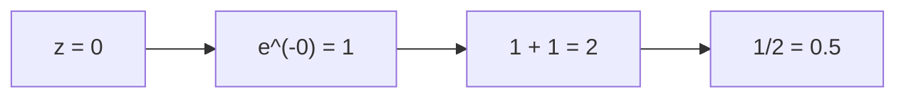

# CL39: Deep Learning with MLPs - Exam Preparation

---

## Section A: Multiple Choice Questions (MCQ) - 15 Questions

### MCQ 1
**Question:** In an MLP with 2 hidden layers, which activation function is most commonly used for hidden layers to avoid the vanishing gradient problem?

**Options:**
- A) Sigmoid
- B) Tanh
- C) ReLU
- D) Softmax

**✅ Correct Answer:** C

**📖 Explanation:** ReLU (Rectified Linear Unit) has a gradient of 1 for positive values, preventing gradient vanishing. Sigmoid and Tanh both have maximum gradients ≤ 1, which compound across layers.

**❌ Why Others Are Wrong:**
- A) Sigmoid has max gradient of 0.25, causes vanishing gradient in deep networks
- B) Tanh has similar issues to sigmoid, gradient ≤ 1
- D) Softmax is used for output layer in multi-class classification, not hidden layers

---

### MCQ 2
**Question:** If learning rate is too high during training, what is the most likely outcome?

**Options:**
- A) Very slow convergence
- B) Loss oscillates or diverges
- C) Model underfits
- D) Dropout becomes ineffective

**✅ Correct Answer:** B

**📖 Explanation:** A high learning rate causes large weight updates that overshoot the minimum, leading to oscillating or diverging loss values.

**❌ Why Others Are Wrong:**
- A) Slow convergence is caused by too SMALL learning rate
- C) Underfitting is caused by insufficient model capacity, not learning rate
- D) Dropout effectiveness is independent of learning rate

---

### MCQ 3
**Question:** What is the purpose of calling `optimizer.zero_grad()` before backward pass?

**Options:**
- A) To initialize weights to zero
- B) To reset the learning rate
- C) To clear accumulated gradients from previous iterations
- D) To set all activations to zero

**✅ Correct Answer:** C

**📖 Explanation:** In PyTorch, gradients accumulate by default. Calling `zero_grad()` clears previous gradients so only the current batch's gradients are used for the update.

**❌ Why Others Are Wrong:**
- A) Weights are not zeroed; that would disable learning
- B) Learning rate is set in optimizer constructor, not in zero_grad()
- D) Activations are computed during forward pass, not affected by zero_grad()

---

### MCQ 4
**Question:** In early stopping with patience=5, when does training stop?

**Options:**
- A) After 5 epochs
- B) When validation loss doesn't improve for 5 consecutive epochs
- C) When training loss doesn't improve for 5 epochs
- D) After validation accuracy reaches 95%

**✅ Correct Answer:** B

**📖 Explanation:** Patience defines how many epochs to wait without validation loss improvement before stopping. It monitors VALIDATION loss, not training loss.

**❌ Why Others Are Wrong:**
- A) Patience is not the total number of epochs
- C) Early stopping monitors validation loss, not training loss
- D) Early stopping doesn't have a specific accuracy threshold

---

### MCQ 5
**Question:** During inference (testing), how should dropout behave?

**Options:**
- A) Same dropout rate as training
- B) Doubled dropout rate
- C) No dropout (all neurons active)
- D) Half the dropout rate

**✅ Correct Answer:** C

**📖 Explanation:** During inference, dropout is turned OFF (`model.eval()` in PyTorch). All neurons are active to get the best predictions using the full network.

**❌ Why Others Are Wrong:**
- A, B, D) Dropout is only for training regularization; any dropout during inference would give inconsistent or suboptimal results

---

### MCQ 6
**Question:** What does the softmax function output?

**Options:**
- A) Values between -1 and 1
- B) Binary values (0 or 1)
- C) Probability distribution that sums to 1
- D) Raw scores (logits)

**✅ Correct Answer:** C

**📖 Explanation:** Softmax converts logits into a probability distribution where all values are between 0 and 1, and their sum equals 1.

**❌ Why Others Are Wrong:**
- A) That's the range of Tanh activation
- B) Binary values are for hard classification, not softmax
- D) Logits are the INPUT to softmax, not the output

---

### MCQ 7
**Question:** Cross-entropy loss for a correctly predicted class with probability 0.9 is:

**Options:**
- A) -log(0.9) ≈ 0.105
- B) -log(0.1) ≈ 2.303
- C) (0.9)² = 0.81
- D) 1 - 0.9 = 0.1

**✅ Correct Answer:** A

**📖 Explanation:** Cross-entropy loss for correct class = -log(p_correct). For p=0.9: -log(0.9) ≈ 0.105

**❌ Why Others Are Wrong:**
- B) This would be the loss if correct class had probability 0.1 (wrong answer with 0.1 confidence)
- C) This is squared error, not cross-entropy
- D) This is simple difference, not cross-entropy

---

### MCQ 8
**Question:** Which hyperparameter controls the trade-off between gradient noise and computational efficiency?

**Options:**
- A) Learning rate
- B) Number of epochs
- C) Batch size
- D) Dropout rate

**✅ Correct Answer:** C

**📖 Explanation:** Smaller batch size = noisier gradient but more updates per epoch. Larger batch size = smoother gradient but fewer updates and more memory usage.

**❌ Why Others Are Wrong:**
- A) Learning rate controls step size, not gradient noise
- B) Epochs control total training duration
- D) Dropout rate controls regularization strength

---

### MCQ 9
**Question:** In backpropagation, why do we start from the output layer?

**Options:**
- A) Because output layer has the most neurons
- B) Because loss is calculated at the output layer
- C) Because weights are largest at output layer
- D) Because input layer activations are unknown

**✅ Correct Answer:** B

**📖 Explanation:** Backpropagation uses chain rule starting from where the error is computed (loss at output), then propagates gradients backward through the network.

**❌ Why Others Are Wrong:**
- A) Number of neurons is irrelevant to backprop direction
- C) Weight magnitude doesn't determine backprop order
- D) Input activations ARE known (they're the input data)

---

### MCQ 10
**Question:** If training loss is very low but validation loss is high and increasing, the model is:

**Options:**
- A) Underfitting
- B) Overfitting
- C) Well-fitted
- D) Not training at all

**✅ Correct Answer:** B

**📖 Explanation:** Low training loss + high/increasing validation loss = classic overfitting sign. The model memorizes training data but fails to generalize.

**❌ Why Others Are Wrong:**
- A) Underfitting shows BOTH losses high
- C) Well-fitted shows both losses low and close
- D) If not training, training loss wouldn't decrease

---

### MCQ 11
**Question:** What is the primary purpose of activation functions in neural networks?

**Options:**
- A) To reduce training time
- B) To introduce non-linearity
- C) To normalize the output
- D) To reduce overfitting

**✅ Correct Answer:** B

**📖 Explanation:** Without activation functions, stacking multiple linear layers still results in a linear transformation. Activation functions add non-linearity, enabling complex pattern learning.

**❌ Why Others Are Wrong:**
- A) Activation functions don't directly reduce training time
- C) Normalization is done by BatchNorm or other techniques
- D) Regularization techniques like dropout reduce overfitting, not activations

---

### MCQ 12
**Question:** For an input image of size 28×28, what is the input dimension for an MLP?

**Options:**
- A) 28
- B) 56
- C) 784
- D) 28×28 (matrix)

**✅ Correct Answer:** C

**📖 Explanation:** MLPs require flattened input vectors. 28×28 = 784 dimensional vector.

**❌ Why Others Are Wrong:**
- A, B) These don't represent the full image
- D) MLPs cannot directly accept 2D matrices; flattening is required

---

### MCQ 13
**Question:** Adam optimizer is preferred over basic SGD because:

**Options:**
- A) It uses less memory
- B) It adapts learning rate per parameter
- C) It doesn't need gradient computation
- D) It works without a loss function

**✅ Correct Answer:** B

**📖 Explanation:** Adam (Adaptive Moment Estimation) maintains per-parameter learning rates based on first and second moments of gradients, adapting step sizes automatically.

**❌ Why Others Are Wrong:**
- A) Adam uses MORE memory (stores momentum and variance)
- C) All optimizers need gradients
- D) All optimizers work with loss functions

---

### MCQ 14
**Question:** If patience in early stopping is set to 3 and validation loss hasn't improved for 2 epochs, what happens?

**Options:**
- A) Training stops immediately
- B) Training continues for at least 1 more epoch
- C) Model weights are reset
- D) Learning rate is reduced

**✅ Correct Answer:** B

**📖 Explanation:** With patience=3 and 2 epochs without improvement, counter is at 2. Training continues and will stop only if the 3rd epoch also shows no improvement.

**❌ Why Others Are Wrong:**
- A) Patience not yet exhausted
- C) Early stopping doesn't reset weights
- D) Learning rate scheduling is separate from early stopping

---

### MCQ 15
**Question:** Dropout rate of 0.3 means:

**Options:**
- A) 30% of neurons are always active
- B) 30% of neurons are randomly dropped during training
- C) 70% of neurons are dropped
- D) Learning rate is reduced by 30%

**✅ Correct Answer:** B

**📖 Explanation:** Dropout rate p=0.3 means each neuron has a 30% probability of being set to zero (dropped) during each training iteration.

**❌ Why Others Are Wrong:**
- A) 70% neurons are active on average, not 30%
- C) This would be dropout rate of 0.7
- D) Dropout doesn't affect learning rate

---

## Section B: Multiple Select Questions (MSQ) - 10 Questions

### MSQ 1
**Question:** Which of the following are valid regularization techniques for preventing overfitting? (Select ALL that apply)

**Options:**
- A) Early stopping
- B) Dropout
- C) Increasing learning rate
- D) L2 regularization (weight decay)
- E) Data augmentation

**✅ Correct Answers:** A, B, D, E

**📖 Explanation:** Early stopping prevents overfitting by stopping before memorization. Dropout adds noise during training. L2 regularization penalizes large weights. Data augmentation increases effective dataset size.

**❌ Why Others Are Wrong:**
- C) Increasing learning rate doesn't prevent overfitting; it affects optimization stability

---

### MSQ 2
**Question:** During the forward pass in an MLP, which operations occur? (Select ALL that apply)

**Options:**
- A) Matrix multiplication (Wx)
- B) Adding bias (+ b)
- C) Gradient computation
- D) Activation function application
- E) Weight update

**✅ Correct Answers:** A, B, D

**📖 Explanation:** Forward pass: z = Wx + b (matrix multiplication, bias addition), then h = activation(z). Gradient computation and weight update happen in backward pass.

**❌ Why Others Are Wrong:**
- C) Gradient computation is in backward pass
- E) Weight update is after backward pass (optimizer step)

---

### MSQ 3
**Question:** Which of the following are hyperparameters in MLP training? (Select ALL that apply)

**Options:**
- A) Weights
- B) Learning rate
- C) Batch size
- D) Biases
- E) Number of hidden layers

**✅ Correct Answers:** B, C, E

**📖 Explanation:** Hyperparameters are set before training and not learned from data. Learning rate, batch size, and architecture choices (number of layers) are hyperparameters.

**❌ Why Others Are Wrong:**
- A, D) Weights and biases are LEARNED parameters, not hyperparameters

---

### MSQ 4
**Question:** Signs of underfitting include: (Select ALL that apply)

**Options:**
- A) High training loss
- B) High validation loss
- C) Low training loss with high validation loss
- D) Training and validation losses are similar
- E) Both accuracies are low

**✅ Correct Answers:** A, B, D, E

**📖 Explanation:** Underfitting = model too simple. Both losses remain high and similar (can't even fit training data), resulting in low accuracies on both sets.

**❌ Why Others Are Wrong:**
- C) Low training + high validation is OVERFITTING, not underfitting

---

### MSQ 5
**Question:** Which statements about the chain rule in backpropagation are correct? (Select ALL that apply)

**Options:**
- A) It allows gradient computation through composed functions
- B) Common gradient terms can be reused (gradient caching)
- C) It only applies to linear functions
- D) It's applied in reverse order from output to input
- E) Each layer's gradient depends on the next layer's gradient

**✅ Correct Answers:** A, B, D, E

**📖 Explanation:** Chain rule handles composed functions, allows caching, is applied backward, and each layer uses downstream gradients.

**❌ Why Others Are Wrong:**
- C) Chain rule applies to ALL differentiable functions, not just linear

---

### MSQ 6
**Question:** Which activation functions are suitable for the output layer in classification? (Select ALL that apply)

**Options:**
- A) Sigmoid (for binary classification)
- B) ReLU (for hidden layers)
- C) Softmax (for multi-class classification)
- D) Tanh (for output between -1 and 1)
- E) Identity/Linear (for regression)

**✅ Correct Answers:** A, C, E

**📖 Explanation:** Sigmoid outputs 0-1 for binary classification. Softmax outputs probability distribution for multi-class. Identity/Linear for regression outputs.

**❌ Why Others Are Wrong:**
- B) ReLU is for hidden layers, not typically for classification output
- D) Tanh is rarely used for classification output (more common in hidden layers)

---

### MSQ 7
**Question:** Benefits of using mini-batches instead of single samples include: (Select ALL that apply)

**Options:**
- A) More stable gradient estimates
- B) Better GPU utilization
- C) Faster per-update computation
- D) Guaranteed global minimum
- E) Some noise helps escape local minima

**✅ Correct Answers:** A, B, E

**📖 Explanation:** Mini-batches average gradients (stability), parallelize well on GPU, and have some noise that can help optimization.

**❌ Why Others Are Wrong:**
- C) Single samples are faster per update; batches are faster per epoch due to parallelization
- D) No optimization method guarantees finding global minimum for non-convex functions

---

### MSQ 8
**Question:** What happens during `model.eval()` mode in PyTorch? (Select ALL that apply)

**Options:**
- A) Dropout is disabled
- B) BatchNorm uses running statistics
- C) Gradients are not computed
- D) Weights are frozen
- E) Model runs faster

**✅ Correct Answers:** A, B

**📖 Explanation:** `model.eval()` affects layers with different train/eval behavior: dropout is disabled and BatchNorm uses stored statistics instead of batch statistics.

**❌ Why Others Are Wrong:**
- C) Gradient computation is controlled by `torch.no_grad()`, not eval mode
- D) Weights are always frozen during forward pass; training happens in backward+optimizer
- E) Speed depends on many factors, not directly on eval mode

---

### MSQ 9
**Question:** To fix overfitting, which strategies are appropriate? (Select ALL that apply)

**Options:**
- A) Add dropout
- B) Increase model size
- C) Use early stopping
- D) Get more training data
- E) Reduce hidden layer sizes

**✅ Correct Answers:** A, C, D, E

**📖 Explanation:** Overfitting fixes: add regularization (dropout), stop before overfitting (early stopping), more data, or reduce model capacity.

**❌ Why Others Are Wrong:**
- B) Increasing model size would worsen overfitting

---

### MSQ 10
**Question:** Which learning rate behaviors indicate problems? (Select ALL that apply)

**Options:**
- A) Loss oscillates wildly (too high LR)
- B) Loss becomes NaN (too high LR)
- C) Loss decreases very slowly (too low LR)
- D) Validation loss increases while training loss decreases (not LR issue)
- E) Loss stays constant from start (may be too low LR or other issues)

**✅ Correct Answers:** A, B, C, E

**📖 Explanation:** High LR → oscillation or NaN. Low LR → very slow progress or no progress.

**❌ Why Others Are Wrong:**
- D) This is overfitting, not a learning rate problem

---

## Section C: Numerical/Calculation Questions - 7 Questions

### Numerical 1
**Question:** An MLP has input size 784, hidden layer 1 with 128 neurons, hidden layer 2 with 64 neurons, and output with 10 neurons. Calculate the total number of trainable parameters (weights + biases).

**Given:**
- Input: 784
- Hidden 1: 128 neurons
- Hidden 2: 64 neurons
- Output: 10 neurons

**Solution Steps:**
1. **Layer 1 (784 → 128):**
   - Weights: 784 × 128 = 100,352
   - Biases: 128
   - Layer 1 total: 100,480

2. **Layer 2 (128 → 64):**
   - Weights: 128 × 64 = 8,192
   - Biases: 64
   - Layer 2 total: 8,256

3. **Layer 3 (64 → 10):**
   - Weights: 64 × 10 = 640
   - Biases: 10
   - Layer 3 total: 650

4. **Total:** 100,480 + 8,256 + 650 = **109,386 parameters**

**✅ Final Answer:** 109,386 trainable parameters

---

### Numerical 2
**Question:** Cross-entropy loss for a sample where the true class has predicted probability 0.25. Calculate the loss.

**Given:**
- True class probability: p = 0.25

**Solution Steps:**
1. Cross-entropy formula: L = -log(p_correct)
2. L = -log(0.25)
3. L = -log(1/4)
4. L = -(-log(4))
5. L = log(4) = log(2²) = 2 × log(2)
6. L = 2 × 0.693 = **1.386**

**✅ Final Answer:** 1.386 (or approximately 1.39)

---

### Numerical 3
**Question:** With batch size 64 and training dataset of 10,000 samples, how many batches per epoch? How many total batches for 5 epochs?

**Given:**
- Training samples: N = 10,000
- Batch size: B = 64
- Epochs: E = 5

**Solution Steps:**
1. Batches per epoch = ⌈N / B⌉ = ⌈10,000 / 64⌉
2. = ⌈156.25⌉ = **157 batches per epoch**
3. Total batches for 5 epochs = 157 × 5 = **785 batches**

**✅ Final Answer:** 157 batches per epoch, 785 total batches for 5 epochs

---

### Numerical 4
**Question:** If dropout rate is 0.4, what is the expected number of active neurons in a layer with 100 neurons during training?

**Given:**
- Total neurons: 100
- Dropout rate: p = 0.4

**Solution Steps:**
1. Probability of neuron being active = 1 - p = 1 - 0.4 = 0.6
2. Expected active neurons = 100 × 0.6 = **60 neurons**

**✅ Final Answer:** 60 neurons (on average)

---

### Numerical 5
**Question:** Sigmoid activation output for z = 0. What is σ(0)?

**Given:**
- Input z = 0
- Sigmoid: σ(z) = 1 / (1 + e^(-z))

**Solution Steps:**
1. σ(0) = 1 / (1 + e^0)
2. = 1 / (1 + 1)
3. = 1 / 2
4. = **0.5**

**✅ Final Answer:** 0.5



---

### Numerical 6
**Question:** ReLU activation: What is ReLU(-3.5) and ReLU(2.7)?

**Given:**
- ReLU(x) = max(0, x)
- Input 1: -3.5
- Input 2: 2.7

**Solution Steps:**
1. ReLU(-3.5) = max(0, -3.5) = **0**
2. ReLU(2.7) = max(0, 2.7) = **2.7**

**✅ Final Answer:** ReLU(-3.5) = 0, ReLU(2.7) = 2.7

---

### Numerical 7
**Question:** If old weight W = 0.5, gradient ∂L/∂W = 0.2, and learning rate η = 0.01, what is the new weight after one gradient descent step?

**Given:**
- W_old = 0.5
- Gradient = 0.2
- η = 0.01

**Solution Steps:**
1. Update formula: W_new = W_old - η × gradient
2. W_new = 0.5 - (0.01 × 0.2)
3. W_new = 0.5 - 0.002
4. W_new = **0.498**

**✅ Final Answer:** 0.498

---

## Section D: Fill in the Blanks - 10 Questions

### Fill 1
**Question:** The process of computing activations from input to output is called _______ propagation.

**Answer:** Forward

**Explanation:** Forward propagation computes layer outputs sequentially from input layer to output layer.

---

### Fill 2
**Question:** In neural networks, _______ introduce non-linearity, allowing the network to learn complex patterns.

**Answer:** Activation functions

**Explanation:** Without activation functions, any number of stacked linear layers would still be equivalent to a single linear transformation.

---

### Fill 3
**Question:** Early stopping monitors _______ loss to decide when to stop training.

**Answer:** Validation

**Explanation:** Validation loss indicates generalization ability. Training loss can keep decreasing even during overfitting.

---

### Fill 4
**Question:** The gradient of ReLU activation for positive inputs is _______.

**Answer:** 1 (one)

**Explanation:** ReLU(x) = x for x > 0, so d(ReLU)/dx = 1 for positive values.

---

### Fill 5
**Question:** Dropout is turned _______ during inference/testing.

**Answer:** OFF (disabled)

**Explanation:** During inference, we want the full trained network to make predictions, so dropout is disabled.

---

### Fill 6
**Question:** The _______ optimizer adapts learning rate per parameter using gradient moments.

**Answer:** Adam

**Explanation:** Adam (Adaptive Moment Estimation) maintains per-parameter learning rates based on first and second moments of gradients.

---

### Fill 7
**Question:** When training loss is very low but validation loss is high, the model is _______.

**Answer:** Overfitting

**Explanation:** The model memorizes training data (low training loss) but fails to generalize (high validation loss).

---

### Fill 8
**Question:** Cross-entropy loss for a perfectly predicted class (probability = 1) is _______.

**Answer:** 0 (zero)

**Explanation:** Loss = -log(1) = 0. Perfect prediction means no error.

---

### Fill 9
**Question:** _______ tells how many epochs to wait without improvement before early stopping triggers.

**Answer:** Patience

**Explanation:** Patience is the hyperparameter that controls early stopping's tolerance for temporary non-improvement.

---

### Fill 10
**Question:** In mini-batch training, the training data should be _______ at the start of each epoch.

**Answer:** Shuffled

**Explanation:** Shuffling prevents the model from learning the order of samples and ensures different batches each epoch.

---

## 📚 Quick Revision Points

### Key Formulas

1. **Neuron computation:** z = Σ(wᵢxᵢ) + b, then h = activation(z)

2. **Weight update:** W_new = W_old - η × (∂L/∂W)

3. **Cross-entropy loss:** L = -log(p_correct_class)

4. **Softmax:** pₖ = exp(zₖ) / Σexp(zⱼ)

5. **ReLU:** f(x) = max(0, x)

6. **Sigmoid:** σ(x) = 1 / (1 + e^(-x))

7. **Parameter count per layer:** (input_size × output_size) + output_size

### Key Concepts Summary

| Concept | One-Line Definition | When to Use |
|---------|---------------------|-------------|
| Forward Pass | Compute outputs from input to output layer | Every training iteration |
| Backpropagation | Compute gradients using chain rule | After computing loss |
| Learning Rate | Step size for weight updates | Hyperparameter tuning |
| Batch Size | Number of samples per gradient update | Balance speed and accuracy |
| Early Stopping | Stop when validation loss stops improving | Prevent overfitting |
| Dropout | Randomly disable neurons during training | Regularization |
| ReLU | max(0, x) activation | Hidden layers |
| Softmax | Convert to probability distribution | Output layer (multi-class) |

### Common Exam Traps

1. **Trap:** "Softmax is used in hidden layers"
   → **Correct:** Softmax is typically used only in the OUTPUT layer for multi-class classification

2. **Trap:** "Backpropagation updates weights during forward pass"
   → **Correct:** Forward pass computes outputs; backpropagation computes gradients; optimizer updates weights

3. **Trap:** "Higher dropout rate always prevents overfitting better"
   → **Correct:** Too high dropout (>0.7) can cause UNDERFITTING

4. **Trap:** "Early stopping watches training loss"
   → **Correct:** Early stopping watches VALIDATION loss

5. **Trap:** "Use last epoch model for deployment"
   → **Correct:** Use the best validation checkpoint

---

## 🚀 Section E: Shortcuts & Cheat Codes for Exam

### ⚡ One-Liner Shortcuts

| Concept | Shortcut/Cheat Code | When to Use |
|---------|---------------------|-------------|
| Train low, Val high | = Overfitting | Curve analysis questions |
| Both losses high | = Underfitting | Diagnosing learning problems |
| ReLU gradient | = 1 (positive), 0 (negative) | Gradient calculations |
| Sigmoid at z=0 | = 0.5 always | Quick calculation |
| Cross-entropy perfect | = 0 (log(1)) | Loss minimum questions |
| Dropout p | = probability of DROPPING | Dropout questions |
| Parameters per layer | = (in × out) + out | Parameter counting |

### 🎯 Memory Tricks (Mnemonics)

1. **FBUO** = Forward, Backward, Update, Output
   → Helps remember: Training order is Forward → Backward → Update weights → Output predictions

2. **DVS** = Dropout, Validation, Stopping
   → Three main overfitting prevention techniques

3. **LABELS** = Learning rate, Architecture, Batch size, Epochs, Layers, Stopping (early)
   → Key hyperparameters to tune

4. **RST** = ReLU for hidden, Softmax for output multi-class, Sigmoid for binary
   → Activation function placement

### 🔢 Quick Calculation Hacks

| Scenario | Hack/Shortcut | Example |
|----------|---------------|---------|
| Sigmoid(0) | Always = 0.5 | σ(0) = 0.5 |
| -log(0.1) | ≈ 2.3 | Loss for 10% confident prediction |
| -log(0.5) | ≈ 0.69 | Loss for 50/50 prediction |
| e^0 | = 1 | Any exponential at 0 |
| ReLU(negative) | = 0 | Always zero for negative |

### 📝 Last-Minute Formula Sheet

```
📌 Forward: z = Wx + b, h = activation(z)
📌 Update: W = W - η × ∂L/∂W
📌 Cross-entropy: L = -log(p_correct)
📌 ReLU: max(0, x)
📌 Sigmoid: 1/(1+e^-x)
📌 Softmax: exp(zᵢ)/Σexp(zⱼ)
📌 Parameters: (input × output) + output
📌 Batches per epoch: ceil(N/batch_size)
```

### 🎓 Interview One-Liners

| Question Pattern | Safe Answer Template |
|------------------|---------------------|
| "What is backpropagation?" | "Backpropagation uses chain rule to compute gradients of loss w.r.t each parameter, propagating error from output to input layer." |
| "Why use ReLU over sigmoid?" | "ReLU has gradient of 1 for positive values, avoiding vanishing gradient problem that affects sigmoid in deep networks." |
| "Explain dropout" | "Dropout randomly sets neurons to zero during training, preventing co-adaptation and acting as ensemble regularization." |
| "What is early stopping?" | "Early stopping monitors validation loss and stops training when it stops improving, preventing overfitting." |
| "Difference between training and inference?" | "Training involves forward pass, loss computation, backward pass, and weight updates. Inference only needs forward pass." |

### ⚠️ "If You Forget Everything, Remember This"

1. **Golden Rule 1:** Forward pass = compute outputs, Backward pass = compute gradients
2. **Golden Rule 2:** Validation loss going up while training loss going down = OVERFITTING
3. **Golden Rule 3:** Use `model.train()` for training, `model.eval()` for testing
4. **Golden Rule 4:** Learning rate too high → loss oscillates/explodes; too low → very slow training
5. **Golden Rule 5:** Always save best validation checkpoint, not the last epoch

### 🔄 Quick Decision Flowchart

```mermaid
flowchart TD
    A[Exam Question Type] --> B{What category?}
    B -->|Loss calculation| C[Use -log for cross-entropy]
    B -->|Parameter count| D["Use (in×out)+out per layer"]
    B -->|Activation| E[ReLU=max, Sigmoid=1/(1+e^-x)]
    B -->|Diagnosing| F{Train vs Val loss}
    F -->|Both high| G[Underfitting]
    F -->|Train low, Val high| H[Overfitting]
    F -->|Both low| I[Good fit]
    B -->|Hyperparameter| J[LR, batch, epochs, hidden size]
```

### 🎯 Safe Answer Patterns

- **For "What is X?"** → Definition + One example
- **For "Why X?"** → Problem it solves + Comparison with alternative
- **For "Calculate X"** → Formula + Step-by-step + Final answer with units
- **For "Compare X vs Y"** → Table with 3-4 differences + When to use each
- **For "Diagnose this curve"** → Check train vs val loss relationship + Give diagnosis + Suggest fix

---

**Good luck with your exam! 📚✨**
