# IMS18: NLP & Transformers in Practice - Classroom Session (Part 1)

> 📚 **This is Part 1** covering: NLP Model Evolution, Recurrent Neural Networks (RNNs), Long Short-Term Memory (LSTMs), Encoder-Decoder Architecture
> 📘 **See also:** [Part 2 - Attention & Transformers](./IMS18_NLP_TransformersInPractice2.md), [Part 3 - Practical Implementation](./IMS18_NLP_TransformersInPractice3.md)

---

## 🗺️ Mind Map - Topics Covered in Part 1


---

## 🎓 Classroom Conversation

### Topic 1: Introduction to NLP Model Evolution

**Teacher:** Students, aaj mana session chala exciting - NLP lo models ela evolve ayyayo chustham! Mee andhariki oka simple question - ChatGPT, Gemini ela "Jack and Jill went up the hill" lo next word predict chesthundo wonder chesaru kadaa?

**Beginner Student:** Sir, next word predict cheyyadam ante exactly ela work avuthundi? Model ki Jack, Jill ani words ela artham avuthayi?

**Teacher:** Excellent question! Ide mana starting point. Think about your phone's predictive keyboard - meeru "good" type chesthe, "morning", "night", "bye" suggest avuthundi kadaa? Same concept, but much more powerful!

NLP lo mana main challenge enti ante - models ki text directly artham kaadu. We need to convert text into numbers. And not just random numbers - meaning preserve chesthe ne adhi useful!


**Clever Student:** Sir, so 1990s lo start ayyindi aa? 30 years evolution kadaa? Each step lo enti improvement vachindi?

**Teacher:** Perfect observation! Let me give you the timeline:
- **1990s**: RNNs - Basic sequence processing, but short memory
- **Mid-1990s**: LSTMs - Added long-term and short-term memory
- **2014**: Seq2Seq (Encoder-Decoder) - Context compression
- **2017**: Transformers with Attention - "Attention is All You Need" paper
- **Now**: GPT, BERT, Gemini - Billions of parameters!

Each step solved previous step's limitations!

> 💡 **Jargon Alert - Sequence Transduction**
> Simple Explanation: Converting one sequence to another. Like translating "Hello" to "నమస్కారం" - input sequence to output sequence!
> Example: Question → Answer, English → Hindi, Text → Summary

---

### Topic 2: Recurrent Neural Networks (RNNs) - The Beginning

**Teacher:** Ippudu mana first architecture - Recurrent Neural Networks. "Recurrent" ante "repeat" or "loop" ani meaning. Same computation oka loop lo repeat avuthundi!

**Beginner Student:** Sir, loop ante enti? Normal neural network lo loop undadu kadaa?

**Teacher:** Great question! Normal neural network (feedforward) lo data oka direction lo ne pothundi - input → hidden → output. But RNN lo previous output current computation lo feedback avuthundi!

Oka example chuddam - "Jack and Jill went up the" - next word predict cheyali "hill":

```
Step 1: Input "Jack" → Generate "and" (predicted)
Step 2: Input "and" → Use "Jack" info → Generate "Jill"
Step 3: Input "Jill" → Use "Jack", "and" info → Generate "went"
... and so on
```

**Practical Student:** Sir, interview lo RNN explain cheyamante ela cheppali?

**Teacher:** Safe answer:

> "RNN is a neural network that processes sequences by using the output of the previous step as input for the next. It has a hidden state H_t that captures information from previous tokens, enabling it to handle sequential data like text."


**Curious Student:** Sir, H_t ante exactly enti? Memory aa?

**Teacher:** Exactly! H_t is the **Hidden State** - model's memory of what it has seen so far. Think of it like notes you take while reading a book - you keep updating your understanding!

```python
# Conceptual RNN computation
def rnn_cell(x_t, h_t_minus_1, W_x, W_h, b):
    """
    x_t: Current input token
    h_t_minus_1: Previous hidden state (memory)
    W_x: Weights for input
    W_h: Weights for hidden state
    b: Bias
    """
    # Combine current input with previous memory
    h_t = np.tanh(np.dot(W_x, x_t) + np.dot(W_h, h_t_minus_1) + b)
    return h_t
```

> 💡 **Jargon Alert - Hidden State (H_t)**
> Simple Explanation: Model's short notebook - it writes what it remembers from previous words. Reading "Jack and Jill" makes it note "two people mentioned".
> Example: H_t after "Jack and Jill went" contains "two people are going somewhere"

**Critique Student:** Sir, RNN perfect kaadu kadaa? Enti limitations?

**Teacher:** Excellent! RNN's biggest problem - **SHORT-TERM MEMORY**!

Example chuddam:
- "Jack and Jill went up the hill to fetch a pail of water. Jack fell down and broke his crown and Jill came tumbling after."

By the time model reaches "came tumbling after", it has forgotten "Jack and Jill" from the beginning! Why? Because H_t can only hold limited information, and new tokens keep overwriting old memories.


**Debate Student:** Sir, then RNN use cheyyadam waste kadaa? Better architectures unte RNN enduku learn chesthunnam?

**Teacher:** Valid point! But RNN is the FOUNDATION. Without understanding RNN, you cannot understand:
- How sequential processing works
- Why memory is needed in NLP
- What problems LSTM and Transformers solve

| RNN Advantage | RNN Limitation |
|---------------|----------------|
| Simple architecture | Short-term memory only |
| Handles sequences | Forgets long-range dependencies |
| Foundation for advanced models | Cannot remember book's first page at end |

---

### Topic 3: Long Short-Term Memory (LSTM) - The Memory Solution

**Teacher:** RNN's short memory problem solve cheyyadaniki - LSTM vachindi! Think of LSTM as RNN with a better memory system.

**Beginner Student:** Sir, LSTM ante enti? Long Short-Term Memory ante contradicting kadaa? Long and Short oka time lo ela?

**Teacher:** Ha ha! Great observation! LSTM has TWO types of memory:
1. **Long-term Memory (C_t)** - Cell State - Remembers important things from far back
2. **Short-term Memory (H_t)** - Hidden State - Remembers recent context

Real-life analogy:
- **Long-term memory**: Your exam preparation notes - you remember key concepts from weeks ago
- **Short-term memory**: Today's class discussions - you remember recent details

> 💡 **Jargon Alert - Cell State (C_t)**
> Simple Explanation: Model's permanent notebook where it writes very important information that should not be forgotten easily. Like your exam notes!
> Example: In "Jack and Jill" poem, C_t stores "this is about two children"

**Clever Student:** Sir, LSTM lo gates enti? Forget gate, input gate, output gate - evi ela work avuthay?

**Teacher:** Excellent question! LSTM has THREE GATES - think of them as security guards controlling information flow:

```mermaid
flowchart TD
    subgraph LSTM_Cell ["LSTM Cell"]
        FG["🚪 Forget Gate<br>What to forget?"]
        IG["🚪 Input Gate<br>What new info to add?"]
        OG["🚪 Output Gate<br>What to output?"]
        CS["📝 Cell State (C_t)<br>Long-term memory"]
        HS["📋 Hidden State (H_t)<br>Short-term memory"]
    end
    
    X["Input X_t"] --> FG
    X --> IG
    H_prev["H_t-1"] --> FG
    H_prev --> IG
    
    FG -->|"Decide what to discard"| CS
    IG -->|"Add new information"| CS
    CS --> OG
    OG --> HS
    OG --> Y["Output Y_t"]
```



#### Gate 1: Forget Gate - "Kya bhulna hai?"

```python
# Forget gate - What to forget from long-term memory
# Uses sigmoid (0 to 1): 0 = forget completely, 1 = remember completely
forget_gate = sigmoid(W_f @ [h_t_minus_1, x_t] + b_f)

# If we move from "Jack and Jill" to "Twinkle Twinkle",
# forget_gate ≈ 0 → forget Jack and Jill
# forget_gate ≈ 1 → keep remembering Jack and Jill
```

#### Gate 2: Input Gate - "Kya add karna hai?"

```python
# Input gate - What new information to add
input_gate = sigmoid(W_i @ [h_t_minus_1, x_t] + b_i)

# New candidate values to potentially add
candidate = tanh(W_c @ [h_t_minus_1, x_t] + b_c)

# Add to cell state
C_t = forget_gate * C_t_minus_1 + input_gate * candidate
```

#### Gate 3: Output Gate - "Kya output dena hai?"

```python
# Output gate - What to output as hidden state
output_gate = sigmoid(W_o @ [h_t_minus_1, x_t] + b_o)

# Final hidden state
H_t = output_gate * tanh(C_t)
```

**Practical Student:** Sir, sigmoid and tanh enduku use chestharu? Different activation functions different purposes ke aa?

**Teacher:** Great question! Interview lo adugutharu!

| Activation | Purpose in LSTM | Output Range |
|------------|-----------------|--------------|
| **Sigmoid** | Decision making (gates) | 0 to 1 |
| **TanH** | Value encoding/normalization | -1 to +1 |


**Curious Student:** Sir, model ela decide chesthundi enti forget cheyyali, enti remember cheyali?

**Teacher:** Initially model makes mistakes! But through backpropagation:

1. Model puts wrong token in long-term memory
2. Generated output is incorrect
3. Loss is high
4. Backprop updates gate weights
5. Next time, model makes better decisions

It's like learning from mistakes - initially you might forget important exam topics, but after failing once, you remember what's important!

> 💡 **Jargon Alert - Backpropagation Through Time (BPTT)**
> Simple Explanation: Error travels backward through all time steps, updating weights at each LSTM cell. Like reviewing your answers after exam and correcting mistakes!
> Example: If "hill" prediction was wrong, error goes back to update how "Jack", "and", "Jill" were processed.

**Critique Student:** Sir, LSTM perfect aa? Limitations enti?

**Teacher:** Still not perfect! LSTM limitations:
1. **Very long sequences still difficult** - Harry Potter book first page to last page challenging
2. **Cell state fixed size** - Cannot expand memory infinitely
3. **Sequential processing** - Cannot parallelize, slow training

---

### Topic 4: Encoder-Decoder (Seq2Seq) Architecture

**Teacher:** 2014 lo next evolution - Encoder-Decoder or Sequence-to-Sequence models! This was a GAME CHANGER for NLP!

**Beginner Student:** Sir, encoder-decoder ante enti? Two different models aa?

**Teacher:** Yes! Think of it like this:
- **Encoder**: Reads and compresses the input (like summarizing a book)
- **Decoder**: Takes compressed info and generates output (like writing answer from notes)

Real-life analogy - Vacuum Cleaner:
- **Main Motor (Encoder)**: Sucks all the dust from everywhere
- **Different Nozzles (Decoders)**: 
  - Nozzle 1 for carpet cleaning
  - Nozzle 2 for sofa cleaning
  - Nozzle 3 for curtain cleaning

Same encoder, different decoders for different tasks!


**Clever Student:** Sir, encoder output enti exactly? H_T and C_T aa?

**Teacher:** Exactly! Encoder's final LSTM generates:
- **H_T**: Final hidden state (short-term summary)
- **C_T**: Final cell state (long-term summary)

These together = **Context Vector** - compressed representation of entire input!

```
Input: "Jack and Jill went up the hill" (7 tokens)
↓
Encoder processes all tokens
↓
Output: H_T = [0.1, -0.5, 0.8, ...] (256 dimensions)
        C_T = [0.3, 0.2, -0.1, ...] (256 dimensions)
↓
These vectors "encode" the meaning of entire sentence!
```

**Practical Student:** Sir, real-world lo encoder-decoder kahan use hota hai?

**Teacher:** Everywhere!

| Application | Encoder Input | Decoder Output |
|-------------|---------------|----------------|
| Machine Translation | English text | Hindi text |
| Text Summarization | Long document | Short summary |
| Question Answering | Question + Context | Answer |
| Chatbots | User query | Bot response |
| Code Generation | Natural language description | Python code |

**Debate Student:** Sir, ek encoder ke saath multiple decoders ho sakte hain kya?

**Teacher:** Exactly! This is the POWER of encoder-decoder:


One encoder learns from massive data (Common Crawl - 364 TB!). Different decoders are trained for specific tasks!

> 💡 **Jargon Alert - Context Vector**
> Simple Explanation: Entire input compressed into one small vector. Like compressing a 100-page book into 256 numbers that capture the essence!
> Example: "The quick brown fox jumps over the lazy dog" → [0.2, -0.5, 0.1, ...]

**Curious Student:** Sir, compression ela work avuthundi? Book ni numbers lo ela convert chestharu?

**Teacher:** Beautiful question! Let me explain with VIBGYOR analogy:

Remember VIBGYOR? = Violet, Indigo, Blue, Green, Yellow, Orange, Red

7 colors condensed into 7 letters! You can "decode" VIBGYOR back to colors because you know the mapping.

Similarly, model encodes information into numbers:
- It decides what's important (gates)
- It represents patterns as numbers (weights)
- The decoder knows how to interpret these numbers

```python
# What C_T and H_T might look like
C_T = np.array([0.01, 0.02, -0.03, -0.08, 0.08, 0.005, 0.65, ...])
H_T = np.array([-0.89, -0.02, 0.45, 0.67, 0.99, 0.92, ...])

# We cannot understand these numbers!
# But the decoder has learned to decode them through training
```

---

## 📝 Teacher Summary - Part 1

**Teacher:** Students, let's summarize Part 1:

### Key Takeaways

| Model | Era | Key Innovation | Limitation |
|-------|-----|----------------|------------|
| **RNN** | 1990s | Sequential processing with hidden state | Short-term memory only |
| **LSTM** | Mid-1990s | Long-term (C_t) + Short-term (H_t) memory | Still struggles with very long sequences |
| **Seq2Seq** | 2014 | Encoder-Decoder for any I/O length | Fixed-size context vector bottleneck |

### Common Mistakes

1. **Confusing H_t and C_t** → H_t is short-term (hidden state), C_t is long-term (cell state)
2. **Thinking RNN is obsolete** → RNN concepts are foundation for understanding Transformers
3. **Assuming encoder output is the prediction** → Encoder outputs context vector, decoder generates prediction

### Interview Quick Points

- RNN: Uses previous output as input, has H_t for memory
- LSTM: Three gates (Forget, Input, Output) with C_t and H_t
- Sigmoid: 0-1 for decisions; TanH: -1 to +1 for encoding
- Encoder-Decoder: Compress then generate

---

> 📘 **Continue to Part 2:** [Attention Mechanism & Transformers](./IMS18_NLP_TransformersInPractice2.md)
