# IMS18: NLP & Transformers in Practice - Classroom Session (Part 2)

> 📚 **This is Part 2** covering: Attention Mechanism, Query-Key-Value (QKV) Vectors, Self-Attention, Multi-Head Attention, Transformer Architecture
> 📘 **Previous:** [Part 1 - RNNs, LSTMs, Encoder-Decoder](./IMS18_NLP_TransformersInPractice1.md)
> 📘 **Next:** [Part 3 - Practical Implementation](./IMS18_NLP_TransformersInPractice3.md)

---

## 🗺️ Mind Map - Topics Covered in Part 2


---

## 🎓 Classroom Conversation Continued

### Topic 5: The Problem with Encoder-Decoder

**Teacher:** Students, Part 1 lo mana encoder-decoder chusam. But adhi kuda perfect kaadu. Enti problem ante - H_T and C_T fixed size vectors!

**Beginner Student:** Sir, fixed size ante enti problem? Numbers lo store avthundi kadaa?

**Teacher:** Think about it - Harry Potter book (hundreds of pages) ni 256 numbers lo compress cheyyadam possible aa? Too much information loss!

```
Harry Potter Book (1000s of sentences)
↓
Encoder
↓
H_T = [256 numbers]
C_T = [256 numbers]
↓
Too much compression = Information lost!
```

**Critique Student:** Sir, then library concept example tho explain cheyandi - ela better approach undochu?

**Teacher:** Perfect analogy request! 

**Library Analogy**:
- Old way (Encoder-Decoder): Librarian memorizes entire library in head, then answers
- New way (Attention): Librarian looks at ALL books simultaneously, focuses on relevant ones

When you ask "Where is Harry Potter?", librarian doesn't recall from memory. Instead:
1. Looks at all shelves
2. Gives MORE ATTENTION to fiction section
3. LESS ATTENTION to science section
4. Returns the exact location

This is ATTENTION MECHANISM!

> 💡 **Jargon Alert - Attention Mechanism**
> Simple Explanation: Instead of compressing everything into one vector, calculate importance score for each input token. More important tokens get more "attention"!
> Example: In "Jack and Jill went up the hill", for predicting "hill", attention to "Jack", "Jill", "went", "up" is high; to "the" is low.

---

### Topic 6: "Attention is All You Need" - The Revolutionary Paper

**Teacher:** 2017 lo Google researchers ek paper publish chesaru - "Attention is All You Need". This changed NLP forever!

**Clever Student:** Sir, paper name lo "All You Need" ante - attention okate sufficient aa? RNN, LSTM vaddu aa?

**Teacher:** Exactly! The paper's main claim:
- **No RNNs needed**
- **No LSTMs needed**
- **Only Attention** is sufficient for sequence transduction

And it worked! Transformers (based on attention) now power GPT, BERT, Gemini, Claude - everything!


**Practical Student:** Sir, paper read cheyali aa? Interview lo useful aa?

**Teacher:** Absolutely! Let me share key concepts from the paper:

1. **Self-Attention**: Each token attends to ALL other tokens
2. **Multi-Head Attention**: Multiple attention calculations in parallel
3. **Positional Encoding**: Since no RNN, we need to tell position
4. **No recurrence**: All tokens processed simultaneously (parallel!)

Paper link: https://arxiv.org/abs/1706.03762 - Read it when free!

---

### Topic 7: Query, Key, Value (QKV) Vectors

**Teacher:** Ippudu core concept - QKV! Attention calculation ki three matrices use avuthayi: Query (Q), Key (K), Value (V).

**Beginner Student:** Sir, Q, K, V ante exactly enti? Simple ga cheppandi.

**Teacher:** Library search analogy tho explain chestha:

| Component | Library Analogy | In Transformer |
|-----------|-----------------|----------------|
| **Query (Q)** | Your search question: "Physics books?" | What current token is looking for |
| **Key (K)** | Book labels on shelf: "Fiction", "Science", "History" | What each token can offer |
| **Value (V)** | Actual book content | Actual information from each token |

Process:
1. You ask Query: "Physics books?"
2. Compare with all Keys: Match found at "Science" section!
3. Get Value: Here are the physics books

```python
# Attention formula
def attention(Q, K, V):
    """
    Q: Query matrix (what am I looking for?)
    K: Key matrix (what do others have?)
    V: Value matrix (actual content)
    d_k: Dimension of key vectors (for scaling)
    """
    d_k = K.shape[-1]
    
    # Step 1: Calculate similarity (Q @ K^T)
    scores = np.dot(Q, K.T) / np.sqrt(d_k)
    
    # Step 2: Softmax to get attention weights
    attention_weights = softmax(scores)
    
    # Step 3: Weighted sum of values
    output = np.dot(attention_weights, V)
    
    return output
```

> 💡 **Jargon Alert - Scaled Dot-Product Attention**
> Simple Explanation: Multiply Query with Key (dot product), scale down by √d_k, apply softmax, then multiply with Value.
> Formula: Attention(Q,K,V) = softmax(QK^T / √d_k) × V

**Curious Student:** Sir, why divide by √d_k? Scaling enduku?

**Teacher:** Great question! Without scaling:
- Large dimensions → Very large dot products
- Softmax on large values → Almost 0 or almost 1 (extreme values)
- Gradients become very small → Training fails!

Scaling keeps values in reasonable range for stable training.

```
Without scaling: scores = [1000, 2000, 500]
Softmax → [0, 1, 0]  ← Almost all attention to one token!

With scaling: scores = [10, 20, 5]
Softmax → [0.1, 0.8, 0.1]  ← Balanced attention
```

---

### Topic 8: Self-Attention - Token Relationships

**Teacher:** Self-Attention ante each token attends to ALL other tokens in the same sequence. Let's see example:

**Beginner Student:** Sir, "Jack and Jill" lo self-attention ela calculate avuthundi?

**Teacher:** Chuddam:

```
Sentence: "Jack and Jill"

Step 1: Calculate attention scores (simplified)
        Jack    and     Jill
Jack    0.1     0.3     0.6    ← Jack attends most to Jill
and     0.2     0.1     0.7    ← "and" attends most to Jill
Jill    0.5     0.3     0.2    ← Jill attends most to Jack

Step 2: These scores tell model:
- "Jack" and "Jill" are related (high attention)
- "and" connects them but is less meaningful
```


**Practical Student:** Sir, cosine similarity concept idhe kadaa? Interview lo connect cheyocha?

**Teacher:** Excellent connection! Yes, attention is related to cosine similarity:

**Cosine Similarity**:
$$cos(u, v) = \frac{u \cdot v}{||u|| \times ||v||}$$

- Measures how similar two vectors are (direction, not magnitude)
- Range: -1 (opposite) to +1 (same direction)

Attention uses similar concept - Q and K dot product measures compatibility!

```python
# Attention score is like cosine similarity
# High score = tokens are related
# Low score = tokens are unrelated

# "King" and "Queen" → High attention score (related)
# "King" and "Banana" → Low attention score (unrelated)
```

> 💡 **Jargon Alert - Cosine Similarity**
> Simple Explanation: Measure of how much two vectors point in same direction. Used to find semantic similarity between words/tokens.
> Example: cosine("movie", "film") ≈ 0.9 (similar); cosine("movie", "potato") ≈ 0.1 (unrelated)

---

### Topic 9: Multi-Head Attention

**Teacher:** Single attention head oka relationship learn chesthundi. Multi-head ante multiple attention calculations parallel ga!

**Debate Student:** Sir, oka head sufficient kaadaa? Multiple enduku?

**Teacher:** One head can focus on one type of relationship. Multiple heads learn different relationships:

| Head | What it might learn |
|------|---------------------|
| Head 1 | Subject-Object relationship |
| Head 2 | Adjective-Noun relationship |
| Head 3 | Pronoun-Noun reference |
| Head 4 | Temporal relationships |

Example: "The quick brown fox jumps over the lazy dog"
- Head 1: "fox" → "jumps" (who does action)
- Head 2: "quick" → "fox", "lazy" → "dog" (adjectives)
- Head 3: "fox" → "dog" (main entities)


```python
class MultiHeadAttention:
    def __init__(self, d_model, num_heads):
        self.num_heads = num_heads
        self.d_model = d_model
        self.d_k = d_model // num_heads  # Each head gets a portion
        
    def forward(self, Q, K, V):
        # Split into multiple heads
        heads = []
        for i in range(self.num_heads):
            head_output = attention(Q_i, K_i, V_i)
            heads.append(head_output)
        
        # Concatenate all heads
        concat = np.concatenate(heads, axis=-1)
        
        # Linear projection
        output = np.dot(concat, W_o)
        return output
```

**Curious Student:** Sir, GPT-3 lo kitne heads honge?

**Teacher:** Different models have different configurations:

| Model | Heads | Layers | Hidden Dim |
|-------|-------|--------|------------|
| BERT-base | 12 | 12 | 768 |
| GPT-2 | 12 | 12 | 768 |
| GPT-3 | 96 | 96 | 12,288 |
| GPT-4 | Unknown | Unknown | Unknown |

More heads = More parallel relationship learning!

---

### Topic 10: Token Embeddings & Dimensionality Reduction

**Teacher:** Before attention, tokens need to be embedded. Remember embedding from previous session? Let me explain the scale!

**Beginner Student:** Sir, embedding matrix size exact ga enti?

**Teacher:** Let's calculate:
- Common Crawl has billions of tokens
- Let's say vocabulary = 10,000 unique tokens
- Each token needs to know relationship with every other → 10,000 × 10,000 = 100 Million relationships!

```
Vocabulary = 10,000
Full relationship matrix = 10,000 × 10,000 = 100,000,000

TOO BIG! Cannot use directly.
```

Solution: **Dimensionality Reduction!**

```mermaid
flowchart LR
    A["Original Space<br>10,000 × 10,000"] -->|"PCA / SVD"| B["Reduced Space<br>10,000 × 256"]
    
    style A fill:#ff6b6b,color:#fff
    style B fill:#4ecdc4,color:#fff
```



**Clever Student:** Sir, 256 dimensions ki reduce chesthe information loss avvadhaa?

**Teacher:** Some loss avuthundi, but it captures MOST important relationships:

- "King" close to "Queen"
- "Dog" close to "Cat"
- "Computer" close to "Laptop"

These semantic relationships are preserved even in lower dimensions!

```python
# Conceptual embedding lookup
embedding_matrix = np.random.randn(vocab_size, 256)  # 10000 × 256

def embed_token(token_id):
    return embedding_matrix[token_id]  # Returns 256-dim vector

# "Jack" (ID: 5) → [0.1, -0.5, 0.3, ..., 0.8]  # 256 numbers
# "Jill" (ID: 6) → [0.2, -0.4, 0.35, ..., 0.75]  # Similar to Jack!
```

---

### Topic 11: Positional Encoding

**Teacher:** RNN lo position automatic ga track avuthundi (sequential). But transformer lo all tokens parallel process avuthayi. Position teliyadu!

**Practical Student:** Sir, position important kadaa? "Dog bites man" vs "Man bites dog" different meanings!

**Teacher:** Exactly! Same words, different order, completely different meaning!

Solution: **Positional Encoding** - Add position information to embeddings.

```python
def positional_encoding(seq_len, d_model):
    """
    Generate positional encoding
    
    Formula (from paper):
    PE(pos, 2i) = sin(pos / 10000^(2i/d_model))
    PE(pos, 2i+1) = cos(pos / 10000^(2i/d_model))
    """
    PE = np.zeros((seq_len, d_model))
    
    for pos in range(seq_len):
        for i in range(0, d_model, 2):
            PE[pos, i] = np.sin(pos / (10000 ** (i / d_model)))
            PE[pos, i+1] = np.cos(pos / (10000 ** (i / d_model)))
    
    return PE

# Final embedding = Token Embedding + Positional Encoding
final_embedding = token_embedding + positional_encoding
```

Types of positional encoding:
1. **Sinusoidal** (original Transformer) - Fixed formula
2. **Learned** (BERT) - Trained like other parameters
3. **Rotary** (RoPE, modern) - Relative positions

> 💡 **Jargon Alert - Positional Encoding**
> Simple Explanation: Numbers added to embeddings to tell model "this is position 1", "this is position 2", etc. Like numbering seats in a classroom!
> Example: "Jack" at position 0 gets different encoding than "Jack" at position 100

---

### Topic 12: Complete Transformer Architecture

**Teacher:** Ippudu complete transformer architecture chuddam:


**Beginner Student:** Sir, Add & Normalize enti? Residual connection aa?

**Teacher:** Yes! Two concepts:
1. **Add (Residual)**: Output = Input + Layer_Output (skip connection)
2. **Normalize**: Layer normalization for stable training

```python
# Residual connection + Layer Normalization
def add_and_norm(input_tensor, sublayer_output, layer_norm):
    # Add (residual connection) - helps gradient flow
    residual = input_tensor + sublayer_output
    
    # Normalize - stabilizes training
    normalized = layer_norm(residual)
    
    return normalized
```

**Critique Student:** Sir, feed forward network kya hai transformation block mein?

**Teacher:** FFN is a simple 2-layer MLP applied to each position:

```python
def feed_forward(x, d_model=512, d_ff=2048):
    """
    Two linear transformations with ReLU in between
    FFN(x) = max(0, xW1 + b1)W2 + b2
    """
    hidden = np.maximum(0, np.dot(x, W1) + b1)  # ReLU
    output = np.dot(hidden, W2) + b2
    return output
```

Usually d_ff = 4 × d_model (expansion then compression)

---

## 📝 Teacher Summary - Part 2

**Teacher:** Let's summarize Part 2:

### Key Takeaways

| Concept | One-Line Summary |
|---------|------------------|
| Attention | Calculate importance scores for all tokens to focus on relevant ones |
| Q, K, V | Query (what I want), Key (what others offer), Value (actual content) |
| Scaled Dot-Product | Attention = softmax(QK^T / √d_k) × V |
| Self-Attention | Each token attends to all tokens in same sequence |
| Multi-Head | Multiple attention calculations for different relationship types |
| Positional Encoding | Tell model about token positions (no RNN = no implicit order) |
| Residual + Norm | Skip connections + layer normalization for stable training |

### Common Mistakes

1. **Forgetting scaling in attention** → Gradients vanish with large dot products
2. **Ignoring positional encoding** → "Dog bites man" = "Man bites dog" (wrong!)
3. **Single head for complex tasks** → Multiple heads learn diverse relationships

### Interview Quick Points

- "Attention is All You Need" = 2017 Google paper
- QKV = Query-Key-Value matrices
- Multi-head = Parallel attention heads
- Positional Encoding = Position info for parallel processing
- Transformer = No RNN, only attention + FFN

---

> 📘 **Continue to Part 3:** [Practical Implementation, Pipelines & Fine-tuning](./IMS18_NLP_TransformersInPractice3.md)
