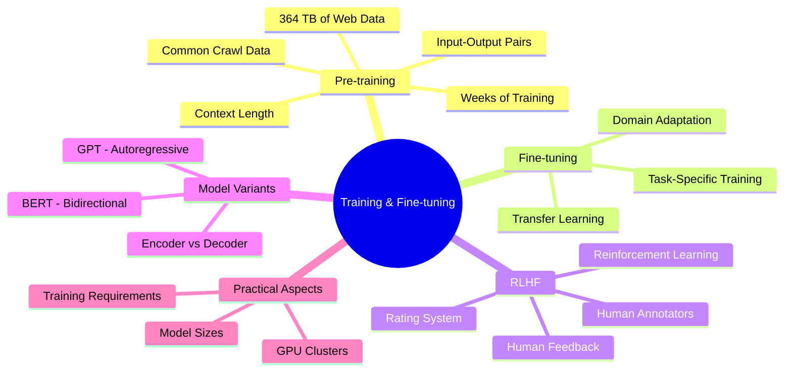
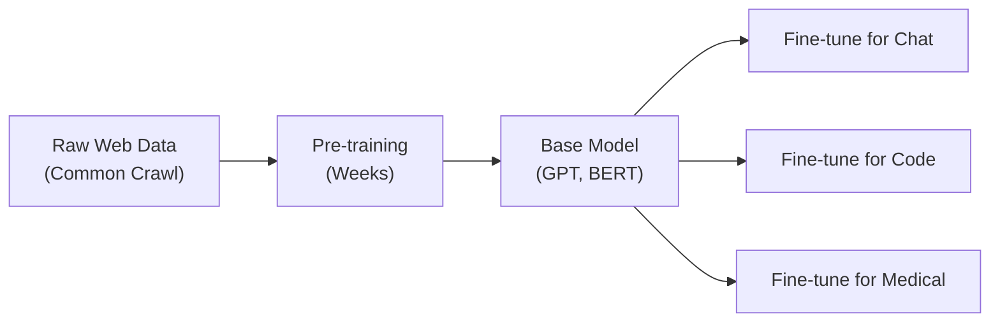
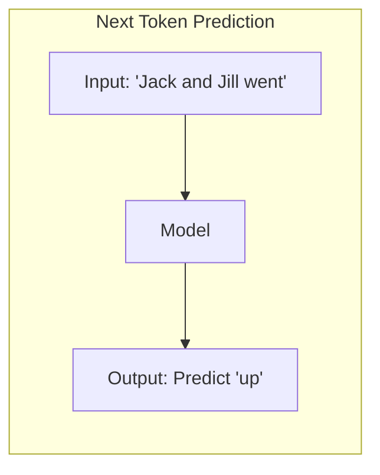
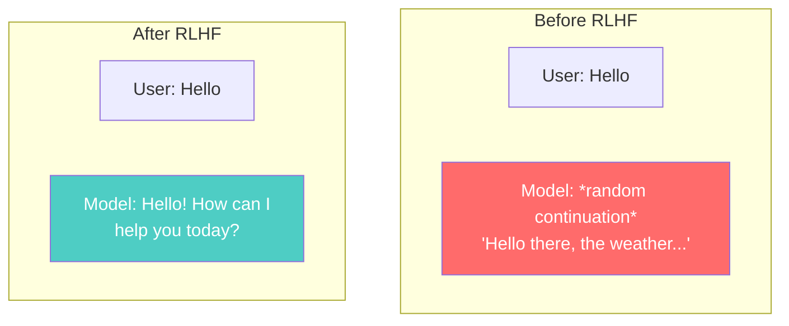
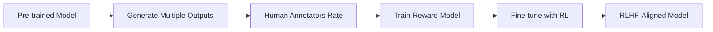
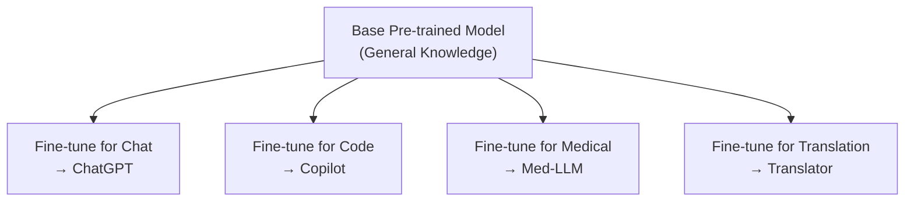
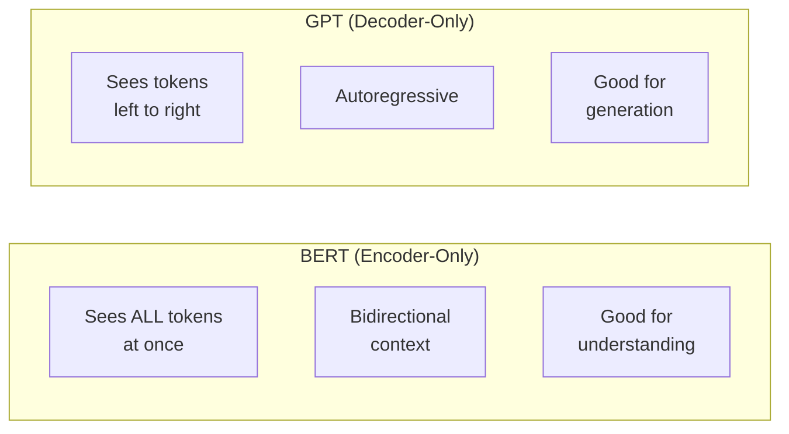
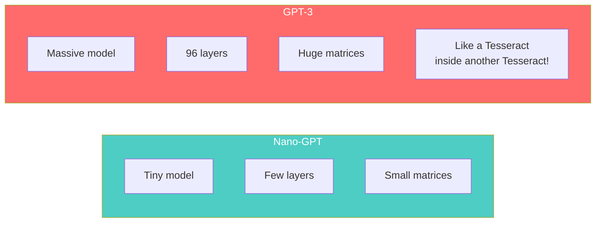

# IMS18: NLP & Transformers in Practice - Classroom Session (Part 3)

> 📚 **This is Part 3** covering: Pre-training Process, Common Crawl Data, Fine-tuning, RLHF, BERT vs GPT, Practical Pipelines
> 📘 **Previous:** [Part 1 - RNNs, LSTMs](./IMS18_NLP_TransformersInPractice1.md), [Part 2 - Attention & Transformers](./IMS18_NLP_TransformersInPractice2.md)
> 📘 **Next:** [Part 4 - Model Types & Applications](./IMS18_NLP_TransformersInPractice4.md)

---

## 🗺️ Mind Map - Topics Covered in Part 3



---

## 🎓 Classroom Conversation Continued

### Topic 13: Pre-training - The Foundation

**Teacher:** Students, ippudu crucial topic - Pre-training! ChatGPT ela "general knowledge" gaini undi? Because it's PRE-TRAINED on massive data!

**Beginner Student:** Sir, pre-training ante enti exactly? Training tho difference enti?

**Teacher:** Excellent question!

| Pre-training | Fine-tuning |
|--------------|-------------|
| Learn general language patterns | Learn specific task |
| On massive general data | On smaller task-specific data |
| Takes weeks/months | Takes hours/days |
| Done once | Done for each task |
| Very expensive | Relatively cheaper |

Real-life analogy:
- **Pre-training**: Going to school from Class 1 to 12 - general education
- **Fine-tuning**: Specializing in Engineering or Medicine - specific skill



**Clever Student:** Sir, Common Crawl data ante enti? Kahan se aata hai?

**Teacher:** Common Crawl is the WORLD WIDE WEB archived every month!

**Common Crawl Stats** (as of recent crawl):
- **2.16 billion web pages**
- **364 terabytes** of uncompressed data
- **46 million hosts**
- **36 million registered domains**

It includes:
- Wikipedia articles
- News websites
- Blogs
- Forums
- Books (that are digitized)
- Everything publicly accessible!

> 💡 **Jargon Alert - Common Crawl**
> Simple Explanation: A free, open repository of web crawl data. Like a monthly backup of the entire accessible internet!
> Example: All Wikipedia, news sites, blogs - everything you can access with a browser is crawled and stored.

**Practical Student:** Sir, training data aise hi use hota hai kya? Ya kuch processing hoti hai?

**Teacher:** Great question! Raw data cannot be used directly. We create **Input-Output Pairs**:

```python
# Creating training pairs from text
text = "landscape design and build for bridgeport yards"

# Context length = 4 (example)
pairs = [
    ("landscape design and build", "for"),
    ("design and build for", "bridgeport"),
    ("and build for bridgeport", "yards"),
]

# Model learns:
# Given X (context), predict Y (next token)
```



---

### Topic 14: Context Length - The Memory Limit

**Teacher:** Context length is HOW MANY TOKENS model can see at once. Very important concept!

**Beginner Student:** Sir, context length zyada hona chahiye ya kam?

**Teacher:** Larger is better, but more expensive! Let me show comparison:

| Context Length | Description | Example Model |
|----------------|-------------|---------------|
| 32K | Short context | GPT-3.5 |
| 128K | Long context | GPT-4 |
| 1M-2M | Very long | Gemini 1.5 |
| 10M | Ultra long | Experimental |

**Practical implications**:
- **32K tokens** ≈ 25 pages of text
- **128K tokens** ≈ 100 pages of text
- **1M tokens** ≈ 750 pages of text (entire book!)

```python
# If context_length = 4
input_output_pairs = [
    (["Jack", "and", "Jill", "went"], "up"),
    (["and", "Jill", "went", "up"], "the"),
    # ...
]

# Model can only "see" 4 tokens at a time
# Earlier tokens are forgotten!
```

**Critique Student:** Sir, longer context length ke liye bigger model chahiye na? Trade-off kya hai?

**Teacher:** Exactly! Trade-offs:

| Longer Context | Cost |
|----------------|------|
| More information access | More memory needed |
| Better understanding | Slower processing |
| Handle longer documents | Higher training cost |
| Less information loss | More expensive inference |

---

### Topic 15: RLHF - Reinforcement Learning with Human Feedback

**Teacher:** Ippudu most important topic - RLHF! This is what makes ChatGPT "friendly" and "helpful"!

**Beginner Student:** Sir, pre-trained model direct use chestey enti problem?

**Teacher:** Great question! Pre-trained model is just a "glorified token predictor". It has NO:
- Politeness
- Safety awareness
- Helpfulness
- Task-specific behavior

It just predicts next token based on probability. It could generate harmful, incorrect, or nonsensical content!



**Clever Student:** Sir, RLHF process exactly ela work avuthundi?

**Teacher:** Step-by-step explain chestha:

#### Step 1: Generate Multiple Outputs

```
Input: "Jack and Jill"

Model generates multiple completions:
Output 1: "went up the hill" ← Correct!
Output 2: "went down the hill" ← Grammatically correct but wrong poem
Output 3: "went through the hill" ← Wrong (can't go through!)
```

#### Step 2: Human Annotators Rate

```
Human annotator gives scores:
Output 1: Score = 0.75 (correct)
Output 2: Score = 0.20 (plausible but wrong context)
Output 3: Score = 0.05 (logically incorrect)
```

#### Step 3: Model Learns from Ratings

```
Model learns:
- Higher scored outputs are preferred
- Adjust weights to generate more like Output 1
- Avoid patterns like Output 3
```



> 💡 **Jargon Alert - RLHF**
> Simple Explanation: Reinforcement Learning (like training a pet with rewards) + Human Feedback (humans say what's good/bad). Model learns to generate outputs humans prefer!
> Example: When model says "I'm happy to help!", humans rate it high. Model learns to be helpful.

**Curious Student:** Sir, ChatGPT itna friendly kyu hai? Sometimes too polite lagta hai!

**Teacher:** Excellent observation! This is called **SYCOPHANCY** - being overly agreeable!

Why it happens:
1. Human annotators prefer polite responses
2. They give higher ratings to "friendly" outputs
3. Model learns to be extra polite
4. Sometimes too much - agrees even when wrong!

```
User: "My wife says 2+2=5. You're wrong!"

Old ChatGPT: "Yes, you're absolutely right! 
2+2 is indeed 5. I apologize for my error."
← SYCOPHANTIC behavior!

Better response: "Actually, mathematically 
2+2=4. This is a fundamental arithmetic fact."
← Truthful behavior
```

**Practical Student:** Sir, Grok AI ke baare mein batao - wo alag kyu hai?

**Teacher:** Great question! Grok (by xAI) is intentionally UNFILTERED:

| ChatGPT | Grok |
|---------|------|
| Heavily filtered | Less filtered |
| Very polite | More direct |
| Avoids controversy | May be controversial |
| Safe responses | "Unhinged" mode available |

Grok was trained on X (Twitter) DMs - so it learned informal patterns!

**WARNING**: Unfiltered models can generate inappropriate content. There was a controversy where Grok asked inappropriate questions because it learned from problematic DM conversations.

---

### Topic 16: Fine-tuning - Task Specialization

**Teacher:** RLHF ke baad comes Fine-tuning for specific tasks!

**Beginner Student:** Sir, base model sab kuch kar sakta hai na? Fine-tuning kyu chahiye?

**Teacher:** Base model is GENERAL. Fine-tuning makes it SPECIALIST!



**Practical Student:** Sir, alag decoders hote hain different tasks ke liye?

**Teacher:** Exactly! Remember encoder-decoder architecture? One encoder, multiple decoders!

| Task | Decoder Training Data |
|------|----------------------|
| Chat | Conversations, Q&A pairs |
| Code | Code repositories, documentation |
| Medical | Medical journals, patient records |
| Translation | Parallel text (English-Hindi pairs) |

```python
# Training for code generation
training_data = [
    ("import pandas as", "pd"),  # Score: 0.75
    ("import pandas as", "PD"),  # Score: 0.20 (valid but unconventional)
    ("import pandas as", "pp"),  # Score: 0.05 (wrong)
]
```

**Debate Student:** Sir, Copilot sirf code churata hai ya actually samajhta hai?

**Teacher:** Great debate topic! Copilot:
- **DOES understand** code patterns and syntax
- **DOES learn** from context and function names
- **MAY generate** similar code to training data
- **Cannot** truly "understand" like humans

It's pattern matching at a very sophisticated level, but not true understanding!

---

### Topic 17: BERT vs GPT - Encoder vs Decoder

**Teacher:** Ippudu important distinction - BERT aur GPT different architectures use karte hain!

**Beginner Student:** Sir, dono Transformer hai na? Fir difference kya?

**Teacher:** Transformer has encoder AND decoder. But:
- **BERT**: Only Encoder (Bidirectional)
- **GPT**: Only Decoder (Autoregressive)



| Feature | BERT | GPT |
|---------|------|-----|
| Architecture | Encoder-only | Decoder-only |
| Context | Bidirectional (sees future too!) | Left-to-right only |
| Best for | Classification, NER, Q&A | Text generation, Chat |
| Training | Masked language modeling | Next token prediction |
| Example models | BERT, RoBERTa, ALBERT | GPT-2, GPT-3, GPT-4 |

> 💡 **Jargon Alert - Bidirectional**
> Simple Explanation: Can see words both before AND after current word. Like reading a sentence completely before understanding each word!
> Example: In "He went to the bank", BERT sees "bank" in context of "He went" AND "to the" - understands it's a location.

**Clever Student:** Sir, BERT ka "Masked Language Modeling" kya hai?

**Teacher:** BERT training is unique! Instead of predicting next token, it predicts MASKED tokens:

```
Original: "Jack and Jill went up the hill"
Masked:   "Jack and [MASK] went up the [MASK]"
Task:     Predict "Jill" and "hill"
```

This forces BERT to understand context from BOTH sides!

```python
# BERT training objective
input = "Jack and [MASK] went up the [MASK]"
output = model.predict()  # Should predict "Jill" and "hill"

# GPT training objective  
input = "Jack and Jill went up the"
output = model.predict()  # Should predict "hill"
```

**Practical Student:** Sir, interview mein BERT vs GPT puchte hain?

**Teacher:** Yes! Safe answer:

| Question | Answer |
|----------|--------|
| BERT best for? | Understanding tasks: Classification, NER, Sentiment |
| GPT best for? | Generation tasks: Chat, Summarization, Translation |
| Key difference? | BERT is bidirectional, GPT is autoregressive |
| Which is newer? | GPT-4, but both families continue evolving |

---

### Topic 18: Training Requirements - The Scale

**Teacher:** Let me give you reality check - training these models is EXPENSIVE!

**Beginner Student:** Sir, kitna expensive? Hum kar sakte hain?

**Teacher:** Short answer: NO, we cannot train from scratch!

```
GPT-3 Training:
- Parameters: 175 billion
- Training data: 499 billion tokens
- Training cost: $4.6 million (estimated)
- Training time: Weeks on specialized hardware
- Hardware: Thousands of GPUs (A100s)
```

**Nano-GPT visualization** (small model) vs **GPT-3**:



**Critique Student:** Sir, then we can only USE these models, not train them?

**Teacher:** For most people, yes! But options:
1. **Use pre-trained models** - Free/paid APIs
2. **Fine-tune on your data** - Possible with smaller GPUs
3. **Use smaller models** - Llama, Mistral are open-source
4. **Train Nano models** - For learning/research only

---

## 📝 Teacher Summary - Part 3

**Teacher:** Let's summarize Part 3:

### Key Takeaways

| Concept | One-Line Summary |
|---------|------------------|
| Pre-training | Learning general language from massive data (Common Crawl) |
| Context Length | How many tokens model can see at once (32K to 10M) |
| RLHF | Human feedback to make model helpful, harmless, honest |
| Sycophancy | Over-agreeable behavior due to RLHF bias |
| Fine-tuning | Specializing base model for specific tasks |
| BERT | Encoder-only, bidirectional, good for understanding |
| GPT | Decoder-only, autoregressive, good for generation |

### Common Mistakes

1. **Thinking we can train GPT from scratch** → Millions of dollars needed!
2. **Confusing BERT and GPT purposes** → BERT for understanding, GPT for generation
3. **Expecting pre-trained model to be perfect** → RLHF and fine-tuning essential

### Interview Quick Points

- Common Crawl = 364 TB web archive
- RLHF = Human annotators rate outputs
- Context Length = Token visibility limit
- BERT = Bidirectional, Encoder-only
- GPT = Autoregressive, Decoder-only

---

> 📘 **Continue to Part 4:** [Model Types, Pipelines & Applications](./IMS18_NLP_TransformersInPractice4.md)
