```mermaid
flowchart TD
    subgraph Static ["Static Embeddings (Word2Vec)"]
        W1["'bank' → [0.1, 0.5, ...]"]
        W2["Always same vector<br>regardless of context"]
    end
    
    subgraph Contextual ["Contextual Embeddings (BERT)"]
        C1["'bank' (money) → [0.1, 0.5, ...]"]
        C2["'bank' (river) → [0.8, -0.2, ...]"]
        C3["Different vectors based<br>on surrounding words!"]
    end
    
    style Static fill:#ff6b6b,color:#fff
    style Contextual fill:#4ecdc4,color:#fff
```

# IMS18: NLP & Transformers in Practice - Classroom Session (Part 4)

> 📚 **This is Part 4** covering: Practical NLP Pipelines, HuggingFace Transformers, Tokenizers, Prompt Engineering, RAG, Static vs Contextual Embeddings
> 📘 **Previous:** [Part 1](./IMS18_NLP_TransformersInPractice1.md), [Part 2](./IMS18_NLP_TransformersInPractice2.md), [Part 3](./IMS18_NLP_TransformersInPractice3.md)

---

## 🗺️ Mind Map - Topics Covered in Part 4


---

## 🎓 Classroom Conversation Continued

### Topic 19: HuggingFace Transformers Library

**Teacher:** Students, practical implementation discuss karenge! HuggingFace is the MOST IMPORTANT library for NLP today!

**Beginner Student:** Sir, HuggingFace kya hai? Naam ajeeb hai!

**Teacher:** Ha ha! HuggingFace is a company + library + model hub. Think of it as:
- **Library**: Easy-to-use Python code for transformers
- **Model Hub**: 100,000+ pre-trained models to download
- **Datasets**: Ready-to-use datasets
- **Spaces**: Deploy ML apps

```python
# Install transformers
# pip install transformers

from transformers import pipeline

# One line to do sentiment analysis!
classifier = pipeline("sentiment-analysis")
result = classifier("I love learning NLP!")
print(result)
# Output: [{'label': 'POSITIVE', 'score': 0.9998}]
```

> 💡 **Jargon Alert - HuggingFace**
> Simple Explanation: An open-source company providing pre-trained ML models. Like an "App Store" for AI models - download and use immediately!
> Example: Download BERT with one line: `model = AutoModel.from_pretrained("bert-base-uncased")`

**Practical Student:** Sir, interview mein pipeline API ke baare mein puchte hain?

**Teacher:** Yes! Pipeline API is the EASIEST way to use transformers:

```python
from transformers import pipeline

# Different tasks with pipeline
tasks = {
    "sentiment-analysis": "Classify text sentiment",
    "text-generation": "Generate text continuation",
    "question-answering": "Answer questions from context",
    "summarization": "Summarize long text",
    "translation_en_to_fr": "Translate English to French",
    "fill-mask": "Fill missing words (BERT style)",
    "ner": "Named Entity Recognition",
    "zero-shot-classification": "Classify without training",
}

# Example usage
summarizer = pipeline("summarization")
summary = summarizer(long_article, max_length=100)
```

---

### Topic 20: Tokenizers Deep Dive

**Teacher:** Tokenization kritisch important hai! Model text directly samajh nahi sakta - tokenizer text ko numbers mein convert karta hai.

**Beginner Student:** Sir, simple split kaafi nahi hai kya? sentence.split(" ")?

**Teacher:** Great question! Simple split problems:

```python
# Simple split fails!
text = "I'm learning NLP. It's amazing!"
tokens = text.split(" ")
# ["I'm", "learning", "NLP.", "It's", "amazing!"]
# Problems:
# - "I'm" should be "I" + "'" + "m"
# - "NLP." has punctuation attached
# - "It's" should be separate
```

That's why we need SPECIALIZED TOKENIZERS!

**Clever Student:** Sir, BPE, WordPiece, SentencePiece - ye sab kya hain?

**Teacher:** Different tokenization algorithms:

| Algorithm | Used By | Approach |
|-----------|---------|----------|
| BPE (Byte Pair Encoding) | GPT-2, GPT-3 | Merge frequent character pairs |
| WordPiece | BERT | Similar to BPE, different scoring |
| SentencePiece | T5, LLaMA | Language-independent, subword |
| Unigram | T5 variant | Probabilistic |

```python
# BPE Tokenization Example
from transformers import GPT2Tokenizer

tokenizer = GPT2Tokenizer.from_pretrained("gpt2")
tokens = tokenizer.tokenize("I'm learning transformers!")
# ['I', "'m", ' learning', ' transform', 'ers', '!']

# Notice:
# - "I'm" → "I" + "'m" (separated)
# - "transformers" → "transform" + "ers" (subword)
```

> 💡 **Jargon Alert - Subword Tokenization**
> Simple Explanation: Breaking words into smaller meaningful pieces. Handles unknown words and reduces vocabulary size!
> Example: "unhappiness" → "un" + "happi" + "ness" (3 tokens instead of 1 unknown)

**Curious Student:** Sir, unknown words ka kya hota hai tokenization mein?

**Teacher:** This is where subword shines!

```python
# Word-level tokenization (old)
vocab = ["I", "am", "learning", "NLP"]
text = "supercalifragilisticexpialidocious"
# Result: [UNK] ← Unknown token! Bad!

# Subword tokenization (modern)
text = "supercalifragilisticexpialidocious"
# Result: ["super", "cal", "if", "rag", "ilis", "tic", "exp", "ial", "i", "docious"]
# Broken into known subwords! Good!
```

---

### Topic 21: Token Limits and Context Windows

**Teacher:** Every model has TOKEN LIMITS. Exceed them and model crashes or truncates!

**Practical Student:** Sir, token count exact kaise pata karta hai?

**Teacher:** Use tokenizer to count:

```python
from transformers import AutoTokenizer

tokenizer = AutoTokenizer.from_pretrained("gpt2")

text = "This is a sample sentence."
tokens = tokenizer.tokenize(text)
print(f"Number of tokens: {len(tokens)}")  # Output: 6

# Token IDs
token_ids = tokenizer.encode(text)
print(f"Token IDs: {token_ids}")  # Output: [1212, 318, 257, 6291, 6827, 13]
```

**Important rule of thumb**:
- 1 token ≈ 4 characters in English
- 1 token ≈ 0.75 words
- 100 words ≈ 130 tokens

```mermaid
flowchart TD
    A["Your Text<br>'Jack and Jill went up the hill'"] --> B["Tokenizer"]
    B --> C["Tokens<br>['Jack', ' and', ' Jill', ' went', ' up', ' the', ' hill']"]
    C --> D["Token IDs<br>[5765, 290, 12, 1816, 510, 262, 6530]"]
    D --> E["Embeddings<br>7 × 768 matrix"]
```



**Critique Student:** Sir, token limit exceed ho jaye to kya karte hain?

**Teacher:** Several strategies:

| Strategy | Description | When to Use |
|----------|-------------|-------------|
| Truncation | Cut text to fit | Simple tasks |
| Chunking | Split into pieces, process separately | Long documents |
| Summarize first | Reduce text, then process | When full context matters |
| Use longer context model | Switch to Gemini (1M tokens) | When budget allows |

---

### Topic 22: Prompt Engineering

**Teacher:** Prompt Engineering is CRITICAL skill in 2024+! How you ask determines what you get!

**Beginner Student:** Sir, prompt engineering kya hai? Just question likhna nahi hai?

**Teacher:** Prompt engineering is CRAFTING the input to get best output. It's an art + science!


**Key Techniques**:

#### 1. Zero-Shot Prompting
```
Prompt: "Translate this to French: Hello, how are you?"
Response: "Bonjour, comment allez-vous?"
```
No examples given - model uses general knowledge.

#### 2. Few-Shot Prompting
```
Prompt: 
"Translate English to Hindi:
Hello → नमस्ते
Thank you → धन्यवाद
How are you? → "

Response: "आप कैसे हैं?"
```
Give examples, model follows pattern.

#### 3. Chain of Thought (CoT)
```
Prompt: "If I have 5 apples and give 2 to John, 
then buy 3 more, how many do I have? 
Think step by step."

Response: 
"Step 1: Start with 5 apples
Step 2: Give 2 to John: 5-2 = 3
Step 3: Buy 3 more: 3+3 = 6
Answer: 6 apples"
```

> 💡 **Jargon Alert - Chain of Thought**
> Simple Explanation: Ask model to think step-by-step before answering. Improves accuracy on complex problems!
> Example: "Think step by step" at the end of math problems

**Practical Student:** Sir, system prompts kya hote hain?

**Teacher:** System prompts define model's BEHAVIOR:

```python
# ChatGPT API example
messages = [
    {
        "role": "system",
        "content": "You are a helpful assistant that speaks like a pirate."
    },
    {
        "role": "user", 
        "content": "What is 2+2?"
    }
]

# Response: "Arrr, matey! That be 4 doubloons!"
```

Common system prompt patterns:
- "You are a helpful assistant"
- "Respond in JSON format"
- "Keep answers under 100 words"
- "You are an expert in Python programming"

---

### Topic 23: RAG - Retrieval Augmented Generation

**Teacher:** RAG is GAME CHANGER for using LLMs with your own data!

**Beginner Student:** Sir, RAG kya hai? LLM mein directly data dena nahi chahiye?

**Teacher:** Problem: LLMs have CUTOFF DATE and NO ACCESS to your private data!

```
User: "What's the latest stock price of Apple?"
ChatGPT: "I don't have real-time data. My knowledge 
ends in January 2024."
← LIMITATION!
```

**RAG Solution**:
1. Store your documents in a database
2. When user asks question, RETRIEVE relevant documents
3. Pass documents + question to LLM
4. LLM GENERATES answer based on retrieved context


```python
# Simplified RAG flow
def rag_answer(question, documents):
    # Step 1: Retrieve relevant documents
    relevant_docs = vector_search(question, documents, top_k=3)
    
    # Step 2: Create prompt with context
    context = "\n".join(relevant_docs)
    prompt = f"""Based on the following context, answer the question.
    
    Context: {context}
    
    Question: {question}
    
    Answer:"""
    
    # Step 3: Generate answer
    answer = llm.generate(prompt)
    return answer
```

> 💡 **Jargon Alert - RAG**
> Simple Explanation: Instead of relying only on LLM's training data, we RETRIEVE relevant documents first, then ask LLM to answer based on those. Like an open-book exam!
> Example: Chatbot for company FAQ - retrieves relevant FAQ entries, then generates answer.

---

### Topic 24: Static vs Contextual Embeddings

**Teacher:** Final important topic - embedding types!

**Clever Student:** Sir, Word2Vec bhi embedding hai, BERT bhi embedding generate karta hai. Difference kya hai?

**Teacher:** Critical difference!

| Feature | Static Embeddings | Contextual Embeddings |
|---------|-------------------|----------------------|
| Example | Word2Vec, GloVe | BERT, GPT |
| Same word, same vector? | YES | NO |
| Context aware? | NO | YES |

**Static Embedding Problem**:
```python
# Word2Vec: "bank" always has SAME vector
sentence1 = "I went to the bank to deposit money"
sentence2 = "I sat on the river bank"

# Word2Vec gives same vector for "bank"!
# But meanings are completely different!
```

**Contextual Embedding Solution**:
```python
# BERT: "bank" has DIFFERENT vectors based on context
from transformers import BertModel, BertTokenizer

model = BertModel.from_pretrained("bert-base-uncased")
tokenizer = BertTokenizer.from_pretrained("bert-base-uncased")

# Different embeddings for "bank" in different contexts!
embedding1 = get_embedding("bank", "I went to the bank to deposit money")
embedding2 = get_embedding("bank", "I sat on the river bank")

# embedding1 ≠ embedding2  ← CONTEXT MATTERS!
```



---

## 📝 Teacher Summary - Part 4

**Teacher:** Let's summarize Part 4:

### Key Takeaways

| Concept | One-Line Summary |
|---------|------------------|
| HuggingFace | Library + Hub for transformers - "App Store for AI" |
| Pipeline API | One-line code for NLP tasks |
| Subword Tokenization | Break words into smaller pieces for better handling |
| Token Limits | Each model has max tokens (32K to 1M) |
| Zero-shot | No examples, model uses general knowledge |
| Few-shot | Give examples, model follows pattern |
| Chain of Thought | "Think step by step" for complex reasoning |
| RAG | Retrieve documents first, then generate answer |
| Static vs Contextual | Word2Vec: same vector always; BERT: context-dependent |

### Common Mistakes

1. **Not counting tokens** → Exceeding limits causes errors
2. **Using static embeddings for polysemy** → Context matters, use BERT!
3. **Skipping prompt engineering** → Good prompts = Better results

### Interview Quick Points

- HuggingFace = Transformers library + Model Hub
- Subword = BPE, WordPiece, SentencePiece
- RAG = Retrieval + Generation for private data
- Chain of Thought = Step-by-step reasoning
- Contextual Embeddings = Same word, different vectors in different contexts

---

> 📘 **Continue to Part 5:** [Complete Examples & Interview Preparation](./IMS18_NLP_TransformersInPractice5.md)
