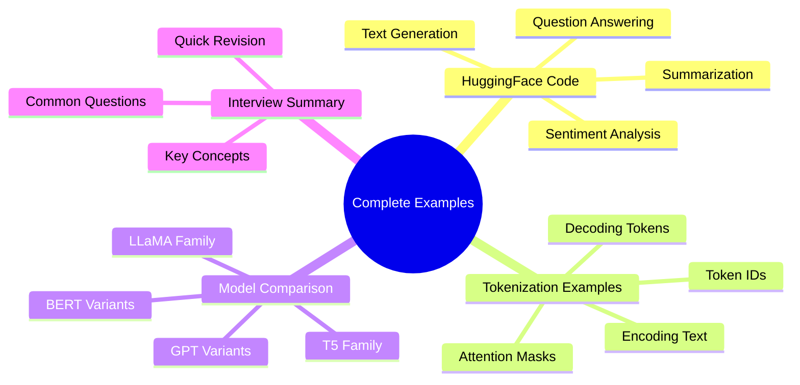
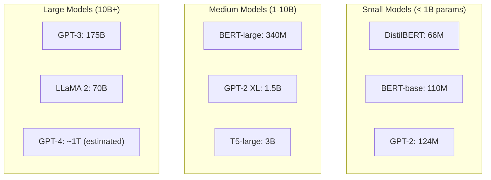

# IMS18: NLP & Transformers in Practice - Classroom Session (Part 5)

> 📚 **This is Part 5** covering: Complete Python Examples, Code Walkthroughs, Model Sizes Comparison, Final Interview Summary
> 📘 **Previous:** [Part 1](./IMS18_NLP_TransformersInPractice1.md), [Part 2](./IMS18_NLP_TransformersInPractice2.md), [Part 3](./IMS18_NLP_TransformersInPractice3.md), [Part 4](./IMS18_NLP_TransformersInPractice4.md)

---

## 🗺️ Mind Map - Topics Covered in Part 5



---

## 🎓 Classroom Conversation Continued

### Topic 25: Complete HuggingFace Examples

**Teacher:** Students, ippudu practical code chuddam! HuggingFace tho kaise kaam karte hain!

**Beginner Student:** Sir, installation se start karenge?

**Teacher:** Yes! Complete setup:

```bash
# Install required libraries
pip install transformers
pip install torch  # or tensorflow
pip install tokenizers
pip install datasets  # for loading datasets
pip install accelerate  # for optimized inference
```

#### Example 1: Sentiment Analysis

```python
from transformers import pipeline

# Initialize pipeline
sentiment_analyzer = pipeline(
    "sentiment-analysis",
    model="distilbert-base-uncased-finetuned-sst-2-english"
)

# Single text analysis
result = sentiment_analyzer("I love learning about transformers!")
print(result)
# Output: [{'label': 'POSITIVE', 'score': 0.9998}]

# Multiple texts
texts = [
    "This movie was amazing!",
    "I hated the ending.",
    "It was okay, nothing special."
]
results = sentiment_analyzer(texts)
for text, result in zip(texts, results):
    print(f"{text} → {result['label']} ({result['score']:.2f})")
```

**Practical Student:** Sir, text generation kaise karte hain?

#### Example 2: Text Generation

```python
from transformers import pipeline, set_seed

# Initialize text generation pipeline
generator = pipeline("text-generation", model="gpt2")

# Set seed for reproducibility
set_seed(42)

# Generate text
prompt = "Natural Language Processing is"
result = generator(
    prompt,
    max_length=50,
    num_return_sequences=3,
    temperature=0.7,
    do_sample=True
)

for i, sequence in enumerate(result):
    print(f"=== Sequence {i+1} ===")
    print(sequence['generated_text'])
```

> 💡 **Jargon Alert - Temperature**
> Simple Explanation: Controls randomness. Low (0.1) = predictable. High (1.0) = creative/random.
> Example: Temperature 0 picks most likely word; Temperature 1 allows surprising combinations.

#### Example 3: Question Answering

```python
from transformers import pipeline

qa_pipeline = pipeline("question-answering", model="distilbert-base-cased-distilled-squad")

context = """
Transformers were introduced in 2017 in the paper 
"Attention is All You Need" by researchers at Google.
"""

questions = ["When were Transformers introduced?", "Who introduced Transformers?"]

for question in questions:
    result = qa_pipeline(question=question, context=context)
    print(f"Q: {question}")
    print(f"A: {result['answer']} (confidence: {result['score']:.2f})")
```

---

### Topic 26: Detailed Tokenization Examples

**Teacher:** Tokenization samajhna bahut important. Detailed examples dekhte hain!

```python
from transformers import AutoTokenizer

tokenizer = AutoTokenizer.from_pretrained("bert-base-uncased")

text = "Hello, how are you doing today?"

# Step 1: Tokenize
tokens = tokenizer.tokenize(text)
print(f"Tokens: {tokens}")
# ['hello', ',', 'how', 'are', 'you', 'doing', 'today', '?']

# Step 2: Encode
token_ids = tokenizer.encode(text)
print(f"Token IDs: {token_ids}")
# [101, 7592, 1010, 2129, 2024, 2017, 2725, 2651, 1029, 102]

# Step 3: Full encoding
encoded = tokenizer(text, return_tensors="pt")
print(f"Input IDs: {encoded['input_ids']}")
print(f"Attention Mask: {encoded['attention_mask']}")
```

**Beginner Student:** Sir, special tokens kya hote hain?

| Token | Purpose | Model |
|-------|---------|-------|
| [CLS] | Classification token (start) | BERT |
| [SEP] | Separator between sentences | BERT |
| [PAD] | Padding for equal length | All |
| [MASK] | Token to predict (training) | BERT |
| <bos> | Beginning of sequence | GPT |
| <eos> | End of sequence | GPT |

---

### Topic 27: Model Size Comparison

**Teacher:** Different models have different sizes and capabilities:



| Model | Parameters | Best For |
|-------|------------|----------|
| DistilBERT | 66M | Fast inference, mobile |
| BERT-base | 110M | Classification, NER |
| GPT-2 | 124M | Simple generation |
| T5-base | 220M | Seq2Seq tasks |
| LLaMA 2 7B | 7B | Open-source general |
| GPT-3 | 175B | Complex generation |
| GPT-4 | ~1T | State-of-art |

**Practical Student:** Sir, smaller model use karna chahiye ya larger?

**Teacher:** Depends on task and resources:
- **Smaller Models**: Faster, cheaper, can run locally
- **Larger Models**: More accurate, need cloud/API

---

### Topic 28: Complete NLP Pipeline Example

**Teacher:** End-to-end pipeline example dekhte hain:

```python
import torch
from transformers import AutoTokenizer, AutoModel
import numpy as np

class NLPPipeline:
    def __init__(self, model_name="bert-base-uncased"):
        self.tokenizer = AutoTokenizer.from_pretrained(model_name)
        self.model = AutoModel.from_pretrained(model_name)
        
    def get_embeddings(self, text):
        # Tokenize
        inputs = self.tokenizer(
            text, 
            return_tensors="pt",
            padding=True,
            truncation=True,
            max_length=512
        )
        
        # Get model output
        with torch.no_grad():
            outputs = self.model(**inputs)
        
        # Use [CLS] token embedding
        embeddings = outputs.last_hidden_state[:, 0, :].numpy()
        return embeddings
    
    def similarity(self, text1, text2):
        emb1 = self.get_embeddings(text1)
        emb2 = self.get_embeddings(text2)
        
        # Cosine similarity
        similarity = np.dot(emb1, emb2.T) / (
            np.linalg.norm(emb1) * np.linalg.norm(emb2)
        )
        return similarity[0][0]

# Usage
pipeline = NLPPipeline()
sim = pipeline.similarity("I love NLP", "Natural language processing is great")
print(f"Similarity: {sim:.4f}")  # High similarity expected
```

---

## 📝 Complete Interview Summary

**Teacher:** Final interview preparation summary:

### Core Concepts Quick Reference

| Concept | One-Line Definition |
|---------|---------------------|
| RNN | Neural network processing sequences with hidden state feedback |
| LSTM | RNN with forget/input/output gates for long-term memory |
| Encoder-Decoder | Compress input (encoder) then generate output (decoder) |
| Attention | Calculate importance scores for all input tokens |
| Self-Attention | Each token attends to all tokens in same sequence |
| Transformer | No RNN, only attention + FFN for sequence processing |
| BERT | Encoder-only, bidirectional, pre-training with MLM |
| GPT | Decoder-only, autoregressive, next token prediction |
| Pre-training | Learning from massive general data |
| Fine-tuning | Specializing for specific task |
| RLHF | Human feedback for alignment |
| RAG | Retrieve documents before generating |
| Tokenization | Text to tokens to IDs |
| Embeddings | Token IDs to vectors |

### Top 10 Interview Questions

1. **Explain attention mechanism in one sentence**
   - Attention calculates importance weights for all tokens to focus on relevant information.

2. **What is Q, K, V in transformers?**
   - Query (what I want), Key (what others offer), Value (actual content).

3. **BERT vs GPT difference?**
   - BERT: Encoder, bidirectional, understanding. GPT: Decoder, autoregressive, generation.

4. **What is positional encoding?**
   - Adding position information since transformers process all tokens in parallel.

5. **Why scale by sqrt(d_k) in attention?**
   - Prevents large values causing vanishing gradients in softmax.

6. **What is RLHF?**
   - Training with human ratings to make model helpful and safe.

7. **Static vs contextual embeddings?**
   - Static: same vector always. Contextual: different vectors based on context.

8. **What is subword tokenization?**
   - Breaking words into smaller pieces (BPE, WordPiece) to handle unknown words.

9. **What is RAG?**
   - Retrieval Augmented Generation: retrieve relevant docs, then generate answer.

10. **Why can't we train GPT from scratch?**
    - Requires millions of dollars, weeks of compute, thousands of GPUs.

---

## 📖 Final Teacher Summary

**Teacher:** Students, aaj humne poora NLP evolution dekha:

1. **RNN → LSTM** - Added memory gates
2. **LSTM → Encoder-Decoder** - Context compression
3. **Encoder-Decoder → Attention** - Better focus mechanism  
4. **Attention → Transformers** - No RNN, parallel processing
5. **Transformers → BERT/GPT** - Pre-training revolution
6. **BERT/GPT → ChatGPT** - RLHF alignment

### Key Takeaways for Exam/Interview

- Attention = "Which tokens matter?"
- Transformer = "Attention is All You Need"
- BERT = Understanding, GPT = Generation
- Pre-training + Fine-tuning + RLHF = Modern LLMs
- HuggingFace = Your best friend for implementation

**Remember**: You don't need to train these models - just use them wisely!

---

> 📘 **Complete Session.** See [Exam Preparation](./IMS18_NLP_TransformersInPractice_exam_preparation.md) for questions.
