# IMS_16: CNN Model Deployment - Classroom Session

## 🗺️ Mind Map - Topics to Cover

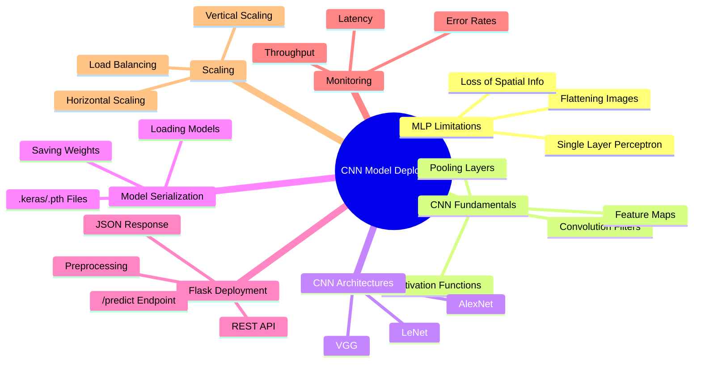

---

## 🎓 Classroom Conversation

### Topic 1: MLP Limitations - Enduku CNN Kavali?

**Teacher:** Namaskaram students! Ippudu mana session lo chala important topic discuss chestam - CNN Model Deployment. Mundu mana MLP (Multi-Layer Perceptron) limitations chuddam. Fashion MNIST dataset tho experiment cheddham.

> 💡 **Jargon Alert - MLP (Multi-Layer Perceptron)**
> Simple Explanation: MLP ante oka neural network, ikkada every neuron next layer lo unna all neurons ki connected untadi. Idi oka "fully connected" network.
> Example: Office lo every employee every department ki direct phone line unte - that's like MLP!

**Beginner Student:** Sir, MLP ki Image data ki enduku problem vastadi? Mana tabular data tho chala bagundi kada?

**Teacher:** Chala manchi question! Chudandi, oka 28x28 pixel image unte, adi 784 pixels kada? Ivanni oka row lo flatten chesi MLP ki ichham. Kaani problem enti ante - oka shoe image lo, 784 pixels lo maybe 80-90 pixels matrame important. Rest anni zeros - background color!

```python
# Fashion MNIST image shape visualization
X_train.shape  # (60000, 28, 28)
# After flattening
X_train_flat.shape  # (60000, 784)
```

**Clever Student:** Sir, mari ikkada spatial information lose avvutundhi kada? Oka shoe lo toe part oka side lo, sole part inka side lo - a relationship MLP ki teliyadu!

**Teacher:** Exactly Ankith! Adi precise problem. MLP ki, pixel 1 next to pixel 2 ani artham avvadu. Adi every pixel ni independent ga chusi, pattern detect cheyyadam kastam.

**Critique Student:** Sir, kaani MLP kuda work chestadi kada? Why exactly we need CNN? MLP accuracy 88% kada?

**Teacher:** Valid point! Kaani chudandi - confusion matrix lo classes 2, 4, 6 (pullover, coat, shirt) very poor F1-score - 0.57, 0.68. Enduku? Avi anni similar looking clothes! MLP cannot differentiate well because:

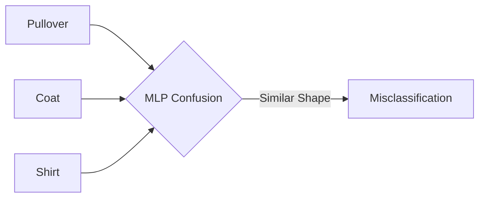

**Debate Student:** Sir, dense layers add chesthe accuracy improve avvadu kada? Why not just add more layers?

**Teacher:** Manchi question! Experiment cheste:
1. More layers → More parameters → Overfitting start avutadi
2. Train accuracy 94%, Test accuracy 88% - gap chudandi
3. Computation costly avutadi

> 💡 **Jargon Alert - Overfitting**
> Simple Explanation: Overfitting ante model training data ki too much attached avvadam. Exam lo mundu chusinave answers anni perfect, kaani new questions ki answer cheppalekapovutaru student laaga!
> Example: Student who memorizes exam paper but can't answer new questions.

**Practical Student:** Sir, interview lo idhanni ela explain cheyali?

**Teacher:** Interview lo cheppandi:
- "MLP treats each pixel independently, losing spatial relationships"
- "For similar looking classes (shirt vs coat), MLP struggles because it can't learn local patterns"
- "CNN uses filters to detect edges, textures, shapes - preserving spatial structure"

---

### Topic 2: CNN Core Concept - Convolution Operation

**Teacher:** Ippudu main hero - Convolution! Imagine mi childhood lo magnifying glass tho paper meedha move chesaru - same logic!

> 💡 **Jargon Alert - Convolution**
> Simple Explanation: Convolution ante oka small window (filter) image meedha slide chesi, patterns detect cheyyadam. Magnifying glass tho paper meedha chuse laaga!
> Example: Teacher exam paper check chestunapudu, oka section at a time focus chestaru - not entire paper at once!

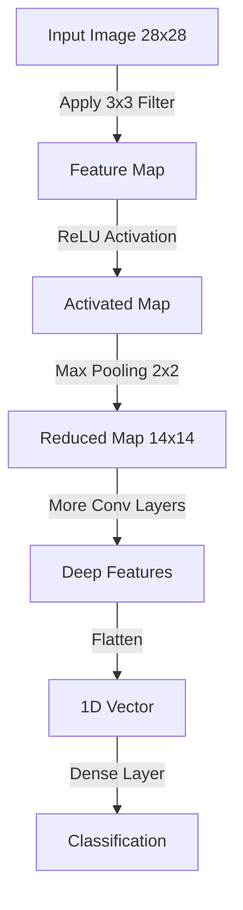

**Beginner Student:** Sir, filter ante exactly enti? Ela work chestadi?

**Teacher:** Chala simple! Filter oka small matrix - usually 3x3 size. Idi image meedha slide avutadi:

```python
# Filter example (3x3)
filter = [
    [-1, 0, 1],
    [-1, 0, 1],
    [-1, 0, 1]
]
# This filter detects vertical edges!
```

**Process:**
1. Filter image top-left corner lo place avutadi
2. Filter values × Pixel values = element-wise multiplication
3. All products add up → single output value
4. Slide one step right, repeat
5. Entire image cover ayyaka, output = FEATURE MAP!

**Curious Student:** Sir, filter values entha set avutayi? Manually set chestama?

**Teacher:** Brilliant question! Filter values RANDOMLY initialize avutayi! Training through, model automatically best values learn chestadi - same as weights in neural network!

```python
# Initial filter values (random)
filter = [
    [0.14, -0.03, 0.31],
    [0.12, 0.21, -0.21],
    [-0.23, 0.05, 0.18]
]
# After training - values change to detect specific patterns!
```

**Clever Student:** Sir, one filter one pattern matrame detect chestadi, then how we detect multiple patterns?

**Teacher:** Exactly! That's why we use MULTIPLE FILTERS!
- Layer 1: 32 filters → 32 feature maps
- Layer 2: 64 filters → 64 feature maps
- Each filter specializes in different pattern (edges, corners, textures)

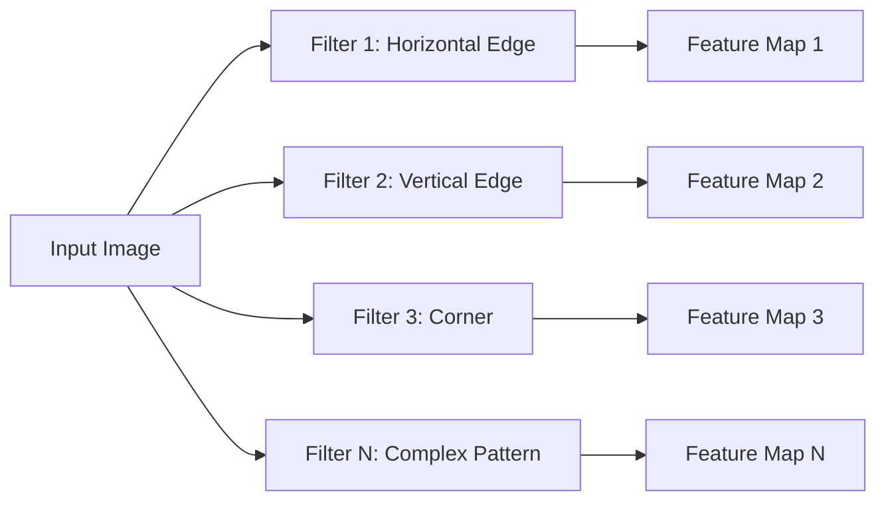

> 💡 **Jargon Alert - Feature Map**
> Simple Explanation: Feature Map ante oka filter apply chesaka output. Idi original image lo specific pattern ekkada strong ga undi ani chupistadi!
> Example: Teacher test papers lo mistakes ekkada undi ani highlight chesaru - that's like a feature map showing "mistake pattern"!

---

### Topic 3: Activation Function (ReLU) & Pooling

**Teacher:** Convolution chesaka, negative values ravochu. Kaani pixel values negative undakudadu! 0-255 range lo ne undali. Here comes ReLU!

> 💡 **Jargon Alert - ReLU (Rectified Linear Unit)**
> Simple Explanation: ReLU ante simple rule - negative values ni zero cheseyyadam, positive values unchanged unchuddam.
> Example: Exam marks - negative marks levu, 0 minimum. Below zero = 0!

```python
# ReLU formula
def relu(x):
    return max(0, x)

# Example
input_value = -0.32
output_value = relu(input_value)  # 0

input_value = 0.45
output_value = relu(input_value)  # 0.45
```

**Beginner Student:** Sir, negative values enduku vastay convolution lo?

**Teacher:** Filter values negative undochu (randomly initialized). Pixel × Negative Filter = Negative output. ReLU ivi clean chestadi!

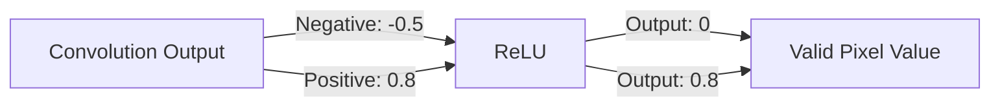

**Critique Student:** Sir, simple ga abs() function vadithe? Why specifically ReLU?

**Teacher:** Good question! ReLU advantages:
1. **Computational simplicity** - just max(0, x)
2. **No vanishing gradient** - positive values gradient = 1
3. **Sparse activation** - many zeros = efficient

| Function | Formula | Issue |
|----------|---------|-------|
| Sigmoid | 1/(1+e^-x) | Vanishing gradient |
| Tanh | (e^x-e^-x)/(e^x+e^-x) | Vanishing gradient |
| **ReLU** | max(0,x) | ✅ Works well! |

**Teacher:** Ippudu Pooling concept chuddam!

> 💡 **Jargon Alert - Pooling (Max Pooling)**
> Simple Explanation: Pooling ante image size reduce cheyyadam, important information keep chestune. Class lo 40 students lo top 10 select chesaru laaga!
> Example: Exam lo each section nundi best answer pick chestaru - that's max pooling!

**Curious Student:** Sir, pooling enduku kavali? Image size problem a?

**Teacher:** Pooling purposes:
1. **Dimension reduction** - 28x28 → 14x14 → 7x7
2. **Translation invariance** - object slight move ayina detect avvali
3. **Feature summarization** - strongest activation keep avutadi

```python
# Max Pooling 2x2 example
input_region = [
    [0.2, 0.8],
    [0.5, 0.3]
]
max_pool_output = max(0.2, 0.8, 0.5, 0.3)  # 0.8
```

**Practical Student:** Sir, interview lo "max pooling vs average pooling" adugutaru, ela answer cheyali?

**Teacher:** Simple answer:

| Feature | Max Pooling | Average Pooling |
|---------|-------------|-----------------|
| What it does | Takes maximum value | Takes average value |
| When to use | Most CNNs, classification | Some architectures, global average |
| Effect | Keeps strongest feature | Smooths features |
| Common usage | More popular | Sometimes at end (GAP) |

---

### Topic 4: CNN Architectures - LeNet, AlexNet, VGG

**Teacher:** History chuddam - CNN ela evolve ayyindi!

#### 4.1 LeNet (1998)

> 💡 **Jargon Alert - LeNet**
> Simple Explanation: LeNet = First successful CNN! Handwritten digits recognize cheyyadaniki create chesaru. GPU lekunda, simple computers meedha work chesindi!
> Example: First car ever made - not fast, but proved the concept works!

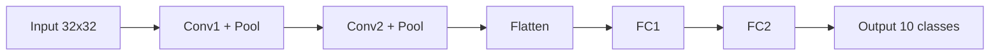

**LeNet Key Points:**
- Created by: Yann LeCun (1998)
- Purpose: Digit recognition (postal codes)
- Architecture: Conv → Pool → Conv → Pool → FC
- Impact: Proved CNNs work for images!

#### 4.2 AlexNet (2012)

> 💡 **Jargon Alert - AlexNet**
> Simple Explanation: AlexNet = Deep learning revolution start chesindi! ImageNet competition lo big margin tho win chesindi. GPUs vaadi first time large scale training chesindi!
> Example: First smartphone - changed everything that came after!

**Debate Student:** Sir, AlexNet lo enti special? LeNet kuda CNN ey kada?

**Teacher:** Major differences:

| Feature | LeNet | AlexNet |
|---------|-------|---------|
| Depth | 5 layers | 8 layers |
| Data | Small (digits) | Large (ImageNet 1M images) |
| Activation | Sigmoid/Tanh | **ReLU** (game changer!) |
| Training | CPU | **GPU** (parallel processing) |
| Regularization | Basic | **Dropout** (prevents overfitting) |
| Augmentation | Minimal | **Heavy** (flips, crops) |

**AlexNet Innovations:**
1. ReLU activation (faster training)
2. Dropout (regularization)
3. Data augmentation (better generalization)
4. GPU training (made deep networks practical)

#### 4.3 VGG (2014)

> 💡 **Jargon Alert - VGG**
> Simple Explanation: VGG = "Simple but Deep" philosophy. Only 3x3 filters use chesindi, kaani chala deep - 16 or 19 layers! Clean, easy to understand architecture!
> Example: Building made of same size bricks - simple design, but very tall!

**Clever Student:** Sir, VGG lo 3x3 only enduku? 5x5 or 7x7 better kada large area cover chestadi?

**Teacher:** Brilliant observation! Chudandi:

**Two 3x3 filters = One 5x5 filter (same receptive field)**
But:
- 2 × (3×3) = 18 parameters
- 1 × (5×5) = 25 parameters
- More non-linearities with 3x3 stacking!

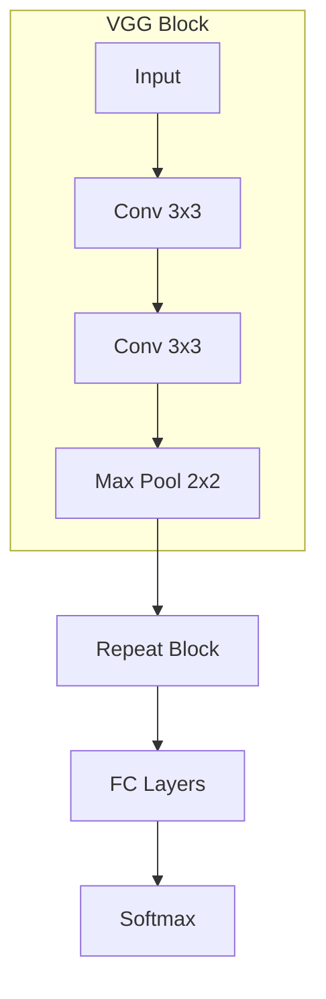

**VGG Design:**
- Block pattern: [Conv-Conv-Pool] × multiple times
- VGG-16: 13 conv + 3 FC = 16 layers
- VGG-19: 16 conv + 3 FC = 19 layers
- Clean, modular, easy to transfer learn!

---

### Topic 5: Model Serialization - Saving & Loading

**Teacher:** Model train chesaka, weights save cheyaali! Otherwise, every time restart cheste retrain cheyali - waste!

> 💡 **Jargon Alert - Serialization**
> Simple Explanation: Serialization ante model state (weights, architecture) ni file lo store cheyyadam. Student notes book lo everything write chesi, later use cheyadam laaga!
> Example: Game progress save chesaru - next time continue cheyochu!

**Beginner Student:** Sir, exactly enti save avutundi? Entire model a?

**Teacher:** Two things save avutayi:
1. **Weights & Biases** - learned parameters
2. **Architecture** - network structure

```python
# Keras - Save entire model
model.save('fashion_classifier.keras')

# PyTorch - Save state dict
torch.save(model.state_dict(), 'fashion_classifier.pth')
```

**Practical Student:** Sir, .keras vs .h5 vs .pt vs .pth - enti difference?

**Teacher:** 

| Format | Framework | Contents |
|--------|-----------|----------|
| .keras | Keras/TensorFlow new | Model + Weights + Config |
| .h5 | Keras/TensorFlow old | Model + Weights |
| .pt / .pth | PyTorch | State dict (weights only or full) |
| SavedModel | TensorFlow | Folder with all assets |

**Loading example:**
```python
# Keras
from keras.models import load_model
loaded_model = load_model('fashion_classifier.keras')

# PyTorch
model.load_state_dict(torch.load('fashion_classifier.pth'))
model.eval()  # Set to evaluation mode!
```

**Curious Student:** Sir, model.eval() enduku kavali PyTorch lo?

**Teacher:** Critical point! Training vs Inference modes different:
- **Training**: Dropout active, BatchNorm uses batch stats
- **Inference**: Dropout OFF, BatchNorm uses running stats

```python
# Always do this before inference!
model.eval()
with torch.no_grad():  # No gradient computation needed
    output = model(input_tensor)
```

---

### Topic 6: Flask REST API Deployment

**Teacher:** Ippudu main deployment concept - Flask API! Model train chesaka, users access cheyali ante API create cheyali!

> 💡 **Jargon Alert - REST API**
> Simple Explanation: REST API ante oka set of URLs (endpoints) through which different systems communicate chestay. Phone call laaga - dial number, talk, get response!
> Example: Restaurant - menu card (endpoints), order (request), food (response)!

**Beginner Student:** Sir, Flask enti exactly?

**Teacher:** Flask = lightweight Python web framework. Easy to build APIs!

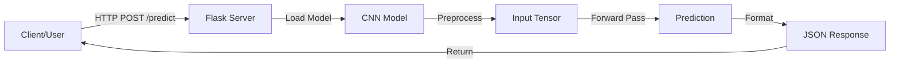

**Basic Flask structure:**
```python
from flask import Flask, request, jsonify
import keras

app = Flask(__name__)

# Load model ONCE at startup!
model = keras.models.load_model('fashion_classifier.keras')

@app.route('/predict', methods=['POST'])
def predict():
    # 1. Receive image
    image = request.files['image']
    
    # 2. Preprocess (SAME as training!)
    tensor = preprocess(image)
    
    # 3. Run inference
    predictions = model.predict(tensor)
    
    # 4. Format response
    label = class_names[predictions.argmax()]
    confidence = float(predictions.max())
    
    return jsonify({
        'label': label,
        'confidence': confidence
    })

if __name__ == '__main__':
    app.run(host='0.0.0.0', port=5000)
```

**Critique Student:** Sir, model load `/predict` function lo chesthe problem enti?

**Teacher:** MAJOR MISTAKE! Chudandi:

| Approach | Load Time | Per Request Time | Issue |
|----------|-----------|------------------|-------|
| Load in /predict | Every request | +5-10 seconds | ❌ Terrible! |
| Load at startup | Once only | Milliseconds | ✅ Correct! |

**Common Pitfalls:**
1. ❌ Loading model per request (slow!)
2. ❌ Different preprocessing than training (accuracy drops!)
3. ❌ No error handling (crashes on bad input!)
4. ❌ No logging (can't debug issues!)

**Debate Student:** Sir, Flask production lo use chestha? Better alternatives levu?

**Teacher:** Valid point!

| Tool | When to Use |
|------|-------------|
| Flask | Simple demos, prototypes |
| Flask + Gunicorn | Production-ready |
| FastAPI | Modern, async, faster |
| TensorFlow Serving | TF models specific |
| TorchServe | PyTorch models specific |

---

### Topic 7: Monitoring Deployed Models

**Teacher:** Model deploy chesaka, monitor cheyali! Otherwise blind driving laaga!

> 💡 **Jargon Alert - Monitoring**
> Simple Explanation: Monitoring ante deployed system performance continuously check cheyyadam. Car dashboard laaga - speed, fuel, temperature constantly chustaaru!
> Example: Doctor patient vitals check chestaru regularly - BP, heart rate, temperature!

**Practical Student:** Sir, exactly enti monitor cheyali?

**Teacher:** Three categories:

#### 1. System-Level Metrics
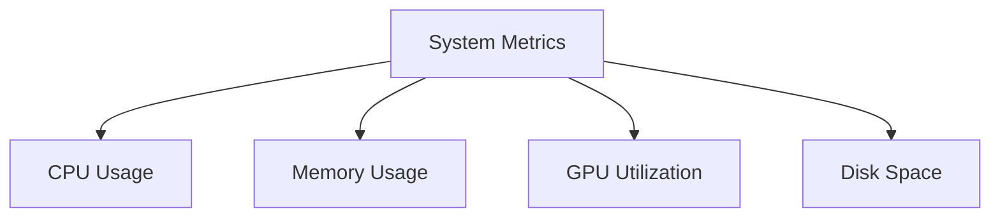

#### 2. API-Level Metrics
- **Latency**: Response time (ms)
- **Throughput**: Requests per second
- **Error Rate**: 4xx/5xx percentage
- **Request Volume**: Total calls

#### 3. Model-Level Metrics
- **Prediction Distribution**: Is model always predicting same class?
- **Confidence Scores**: Too high? Too low?
- **Accuracy on labeled samples**: Degraded over time?

```python
# Simple logging example
import logging
import time

@app.route('/predict', methods=['POST'])
def predict():
    start_time = time.time()
    
    try:
        # ... prediction logic ...
        
        latency = time.time() - start_time
        logging.info(f"Prediction: {label}, Confidence: {confidence}, Latency: {latency:.3f}s")
        
        return jsonify({'label': label, 'confidence': confidence})
    
    except Exception as e:
        logging.error(f"Prediction failed: {str(e)}")
        return jsonify({'error': 'Prediction failed'}), 500
```

**Curious Student:** Sir, "data drift" ante enti? Dangerous a?

**Teacher:** Chala important concept!

> 💡 **Jargon Alert - Data Drift**
> Simple Explanation: Data Drift ante production lo vacche data, training data kanna different avvadam. Model eppudu train ayyindo, ippudu different data ostondi!
> Example: Student old syllabus study chesaru, kaani exam new syllabus nundi vachindi!

**Data Drift Signs:**
- Confidence scores suddenly low
- Predictions biased towards one class
- More errors on certain input types

---

### Topic 8: Scaling - Handling More Traffic

**Teacher:** Oka user ok, kaani 1000 users simultaneously request chesthe? Scaling kavali!

> 💡 **Jargon Alert - Scaling**
> Simple Explanation: Scaling ante system capacity increase cheyyadam, more load handle cheyyadaniki. Restaurant busy ayte more chefs hire chestaru laaga!
> Example: Exam time lo more invigilators, more rooms arrange chestaru!

**Two types of scaling:**

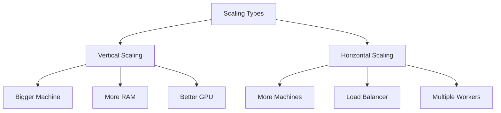

#### 8.1 Vertical Scaling

**Beginner Student:** Sir, vertical scaling simple kada? Just upgrade machine!

**Teacher:** Yes, simple but limited:

| Pros | Cons |
|------|------|
| No code changes | Hardware limits exist |
| Simple to implement | Expensive quickly |
| No architecture change | Single point of failure |

#### 8.2 Horizontal Scaling

**Clever Student:** Sir, horizontal scaling elaa work avutadi?

**Teacher:** Multiple instances + Load Balancer!

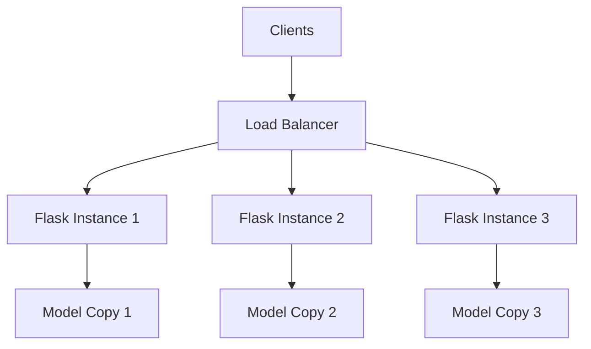

**Practical commands:**
```bash
# Using Gunicorn with multiple workers
gunicorn --workers 4 --bind 0.0.0.0:5000 app:app

# Docker for containerization
docker build -t fashion-classifier .
docker run -p 5000:5000 fashion-classifier
```

> 💡 **Jargon Alert - Load Balancer**
> Simple Explanation: Load Balancer ante traffic multiple servers ki distribute chestadi. Traffic policeman laaga - cars ni different lanes ki direct chestadu!
> Example: Railway station ticket counters - people different counters ki distribute avutaru!

**Debate Student:** Sir, Kubernetes use chestha better kada?

**Teacher:** Kubernetes = container orchestration. For large scale:
- Auto-scaling (traffic increase → more pods)
- Self-healing (pod crash → auto restart)
- Rolling updates (new model deploy without downtime)

But simple applications ki overkill. Start simple, scale when needed!

---

## 📝 Teacher Summary

**Teacher:** Okay students, let's summarize what we learned today...

### Key Takeaways

1. **MLP Limitations**: Cannot capture spatial relationships in images, struggles with similar-looking classes
2. **CNN Advantage**: Filters preserve spatial structure, learn hierarchical features
3. **Convolution**: Small filter slides over image, detects patterns
4. **Pooling**: Reduces dimensions, provides translation invariance
5. **ReLU**: Removes negatives, enables deeper networks
6. **Architectures**: LeNet → AlexNet → VGG (evolution of depth and techniques)
7. **Serialization**: Save model weights for reuse (.keras, .pth)
8. **Flask API**: Wrap model in /predict endpoint for external access
9. **Monitoring**: Track latency, errors, model performance
10. **Scaling**: Vertical (bigger) vs Horizontal (more instances)

### Common Mistakes

| Mistake | Problem | Solution |
|---------|---------|----------|
| Loading model per request | Slow responses | Load once at startup |
| Different preprocessing | Accuracy drops | Match training exactly |
| No eval() mode in PyTorch | Wrong predictions | Always call model.eval() |
| No error handling | Crashes | Try-except blocks |
| No monitoring | Blind to issues | Log metrics |
| Single Flask process | Can't scale | Use Gunicorn workers |

### Interview Ready Answers

**Q: Why CNN over MLP for images?**
A: "CNNs use convolution filters that preserve spatial relationships. They detect local patterns (edges, textures) and build hierarchical features. MLPs flatten images, losing this structure."

**Q: Explain convolution operation?**
A: "A small filter slides over the image, computing element-wise multiplication and summation at each position. Output is a feature map showing where specific patterns exist."

**Q: What is pooling and why use it?**
A: "Pooling reduces spatial dimensions while keeping important features. Max pooling takes the strongest activation in each region, providing translation invariance."

**Q: How to deploy a CNN model?**
A: "Save trained model, create Flask API with /predict endpoint, preprocess input same as training, run inference, return JSON response. For production, use Gunicorn workers and monitor performance."

**Q: What to monitor after deployment?**
A: "System metrics (CPU, memory), API metrics (latency, throughput, errors), and model metrics (prediction distribution, confidence, accuracy on samples)."
