# IMS_16: CNN Model Deployment - Exam Preparation

## Section A: Multiple Choice Questions (MCQ) - 15 Questions

### MCQ 1
**Question:** What is the primary limitation of using MLP (Multi-Layer Perceptron) for image classification?

**Options:**
- A) MLP cannot handle grayscale images
- B) MLP loses spatial relationships when images are flattened
- C) MLP requires more epochs than CNN
- D) MLP cannot use activation functions

**✅ Correct Answer:** B

**📖 Explanation:** When an image is flattened into a 1D vector for MLP, the spatial arrangement of pixels (which pixel is next to which) is lost. This means MLP treats each pixel independently without understanding that neighboring pixels form patterns.

**❌ Why Others Are Wrong:**
- A) MLP can handle grayscale images after flattening
- C) Epochs requirement depends on data, not architecture type
- D) MLP uses activation functions like ReLU, Sigmoid

---

### MCQ 2
**Question:** What is the function of a convolution filter (kernel) in CNN?

**Options:**
- A) To increase the image size
- B) To detect specific patterns like edges and textures
- C) To convert color images to grayscale
- D) To classify images directly

**✅ Correct Answer:** B

**📖 Explanation:** Convolution filters slide over an image and compute weighted sums to detect specific patterns. Different filters detect different features - horizontal edges, vertical edges, corners, textures, etc.

**❌ Why Others Are Wrong:**
- A) Filters typically maintain or reduce size, not increase
- C) Color conversion is preprocessing, not filter function
- D) Classification happens in fully connected layers, not filters

---

### MCQ 3
**Question:** What does ReLU activation function do?

**Options:**
- A) Converts all values to the range [0, 1]
- B) Outputs max(0, x) - keeps positives, makes negatives zero
- C) Outputs the mean of all input values
- D) Squares all input values

**✅ Correct Answer:** B

**📖 Explanation:** ReLU (Rectified Linear Unit) applies the function f(x) = max(0, x). Positive values pass through unchanged, while negative values become zero. This introduces non-linearity while being computationally efficient.

**❌ Why Others Are Wrong:**
- A) That describes Sigmoid activation
- C) Mean operation is not an activation function
- D) Squaring is not a standard activation function

---

### MCQ 4
**Question:** What is the purpose of max pooling in CNNs?

**Options:**
- A) To increase the number of filters
- B) To reduce spatial dimensions while retaining strongest features
- C) To add more trainable parameters
- D) To apply activation functions

**✅ Correct Answer:** B

**📖 Explanation:** Max pooling takes the maximum value from a window (e.g., 2x2), reducing height and width by factor of 2 while keeping the strongest activations. This provides dimension reduction and translation invariance.

**❌ Why Others Are Wrong:**
- A) Pooling doesn't change filter count
- C) Pooling has NO trainable parameters
- D) Activation functions are applied separately

---

### MCQ 5
**Question:** Which CNN architecture first popularized using ReLU activation instead of Sigmoid?

**Options:**
- A) LeNet
- B) VGG
- C) AlexNet
- D) ResNet

**✅ Correct Answer:** C

**📖 Explanation:** AlexNet (2012) popularized ReLU activation, showing it trains much faster than Sigmoid/Tanh due to simpler gradients. This was one of AlexNet's key innovations that enabled training deeper networks.

**❌ Why Others Are Wrong:**
- A) LeNet (1998) used Sigmoid/Tanh
- B) VGG (2014) came after AlexNet, also uses ReLU
- D) ResNet (2015) uses ReLU but didn't popularize it

---

### MCQ 6
**Question:** What is VGG's distinctive architectural feature?

**Options:**
- A) Uses only 1x1 convolutions
- B) Uses only 3x3 convolutions throughout the network
- C) Has skip connections between layers
- D) Uses no pooling layers

**✅ Correct Answer:** B

**📖 Explanation:** VGG's design philosophy was "simple but deep" - it uses uniform 3x3 convolutions stacked multiple times. This creates an effective larger receptive field while using fewer parameters than larger filters.

**❌ Why Others Are Wrong:**
- A) 1x1 convolutions are used in other architectures like Inception
- C) Skip connections are ResNet's feature
- D) VGG uses max pooling after conv blocks

---

### MCQ 7
**Question:** Where should you load a CNN model in a Flask application?

**Options:**
- A) Inside the /predict endpoint function
- B) At application startup, before defining routes
- C) Every time an HTTP request is received
- D) In the HTML template

**✅ Correct Answer:** B

**📖 Explanation:** Model loading is expensive (seconds). Loading once at startup means all subsequent requests use the already-loaded model, reducing response time from seconds to milliseconds.

**❌ Why Others Are Wrong:**
- A) Loading per request causes 5-10 second delays
- C) Same issue as A - extremely slow
- D) HTML templates cannot load Python models

---

### MCQ 8
**Question:** What is model serialization?

**Options:**
- A) Training a model on serial data
- B) Saving model weights and architecture to a file for later use
- C) Converting model to mobile format
- D) Splitting model into multiple parts

**✅ Correct Answer:** B

**📖 Explanation:** Serialization means storing the model's learned parameters (weights, biases) and optionally its architecture to disk. This allows reusing trained models without retraining.

**❌ Why Others Are Wrong:**
- A) Serial data is unrelated concept
- C) Mobile conversion is a specific type of optimization
- D) Model splitting is a different technique (model parallelism)

---

### MCQ 9
**Question:** What does model.eval() do in PyTorch?

**Options:**
- A) Evaluates model accuracy
- B) Trains the model for one epoch
- C) Sets model to inference mode, disabling dropout and using running stats for BatchNorm
- D) Deletes the model from memory

**✅ Correct Answer:** C

**📖 Explanation:** model.eval() switches the model to inference mode. Dropout layers stop dropping, and BatchNorm uses running mean/variance instead of batch statistics. This is essential for consistent predictions.

**❌ Why Others Are Wrong:**
- A) Evaluation/accuracy calculation is done separately
- B) model.train() sets training mode
- D) del model or garbage collection removes from memory

---

### MCQ 10
**Question:** What is latency in the context of API monitoring?

**Options:**
- A) Number of requests per second
- B) Time taken to process and respond to a request
- C) Amount of memory used
- D) Number of errors per day

**✅ Correct Answer:** B

**📖 Explanation:** Latency measures how long a request takes from receipt to response. Lower latency = faster user experience. Typically measured in milliseconds (ms).

**❌ Why Others Are Wrong:**
- A) That's throughput
- C) That's memory usage metric
- D) That's error rate

---

### MCQ 11
**Question:** What is horizontal scaling?

**Options:**
- A) Making one server more powerful (better CPU, more RAM)
- B) Adding more server instances to handle load
- C) Increasing database size
- D) Making API endpoints longer

**✅ Correct Answer:** B

**📖 Explanation:** Horizontal scaling means adding more machines/instances to distribute load. A load balancer routes requests across multiple servers, each running a copy of the application.

**❌ Why Others Are Wrong:**
- A) That's vertical scaling
- C) Database operations are separate from app scaling
- D) Endpoint length is unrelated to scaling

---

### MCQ 12
**Question:** What happens if preprocessing at inference time differs from training time?

**Options:**
- A) Faster predictions
- B) Model accuracy significantly drops
- C) Model trains faster
- D) No impact on predictions

**✅ Correct Answer:** B

**📖 Explanation:** The model learned patterns based on specific preprocessing (normalization, resizing). If inference preprocessing differs, the input distribution changes, causing the model to see "weird" data and produce poor predictions.

**❌ Why Others Are Wrong:**
- A) Speed unaffected by preprocessing mismatch
- C) Inference doesn't involve training
- D) There IS significant impact - accuracy drops!

---

### MCQ 13
**Question:** What is data drift in model deployment?

**Options:**
- A) Model weights changing over time
- B) Production data becoming different from training data distribution
- C) Data moving to a different server
- D) Database migration issues

**✅ Correct Answer:** B

**📖 Explanation:** Data drift occurs when real-world input data changes compared to training data. This can happen due to seasonal changes, new user behaviors, or environmental factors, causing model performance to degrade.

**❌ Why Others Are Wrong:**
- A) Weights don't change after deployment (unless retraining)
- C) Physical data location is infrastructure, not drift
- D) Database issues are different from data distribution changes

---

### MCQ 14
**Question:** How many trainable parameters does a 3x3 convolution filter with 64 output channels and 32 input channels have?

**Options:**
- A) 96
- B) 576
- C) 18,432
- D) 18,496

**✅ Correct Answer:** D

**📖 Explanation:** Parameters = filter_size × filter_size × input_channels × output_channels + bias
= 3 × 3 × 32 × 64 + 64 (bias) = 18,432 + 64 = 18,496

**❌ Why Others Are Wrong:**
- A) Only counts filter size, not channels
- B) 3×3×64 = 576, missing input channels
- C) Missed the bias term (+64)

---

### MCQ 15
**Question:** What is the output feature map size when applying 3x3 convolution with stride 1, no padding to a 28x28 input?

**Options:**
- A) 28x28
- B) 26x26
- C) 30x30
- D) 14x14

**✅ Correct Answer:** B

**📖 Explanation:** Output size = (Input - Filter + 2×Padding) / Stride + 1
= (28 - 3 + 0) / 1 + 1 = 26
Without padding, the output shrinks by (filter_size - 1) = 2 on each dimension.

**❌ Why Others Are Wrong:**
- A) Would need "same" padding
- C) Output can't be larger than input with valid convolution
- D) Would require stride 2

---

## Section B: Multiple Select Questions (MSQ) - 10 Questions

### MSQ 1
**Question:** Which of the following are advantages of CNNs over MLPs for image processing? (Select ALL that apply)

**Options:**
- A) Preserves spatial relationships between pixels
- B) Uses weight sharing (same filter across entire image)
- C) Requires more training data than MLP
- D) Has fewer parameters due to local connectivity
- E) Can detect hierarchical features (edges → shapes → objects)

**✅ Correct Answers:** A, B, D, E

**📖 Explanation:** 
- A) Convolution preserves spatial structure
- B) Same filter slides across image = weight sharing
- D) Filter parameters << fully connected parameters
- E) Deep layers build complex features from simple ones

**❌ Why C is Wrong:**
- CNNs often need LESS data due to weight sharing and data augmentation

---

### MSQ 2
**Question:** What are the components of a typical CNN block? (Select ALL that apply)

**Options:**
- A) Convolution layer
- B) Activation function (ReLU)
- C) Pooling layer
- D) Decision tree
- E) Batch normalization

**✅ Correct Answers:** A, B, C, E

**📖 Explanation:**
- A) Convolution extracts features
- B) ReLU adds non-linearity
- C) Pooling reduces dimensions
- E) BatchNorm improves training stability

**❌ Why D is Wrong:**
- Decision trees are separate ML algorithms, not CNN components

---

### MSQ 3
**Question:** Which of the following are valid reasons to use pooling layers? (Select ALL that apply)

**Options:**
- A) Reduce computational cost in subsequent layers
- B) Provide some translation invariance
- C) Add more trainable parameters
- D) Summarize features by keeping strongest activations
- E) Prevent overfitting by reducing dimensions

**✅ Correct Answers:** A, B, D, E

**📖 Explanation:**
- A) Smaller feature maps = less computation
- B) Max survives even if pattern moves slightly
- D) Max pooling keeps strongest response
- E) Fewer parameters = less overfitting risk

**❌ Why C is Wrong:**
- Pooling has ZERO trainable parameters!

---

### MSQ 4
**Question:** What were AlexNet's key innovations? (Select ALL that apply)

**Options:**
- A) ReLU activation function
- B) Dropout regularization
- C) Residual connections
- D) GPU training
- E) Heavy data augmentation

**✅ Correct Answers:** A, B, D, E

**📖 Explanation:**
- A) ReLU replaced sigmoid/tanh for faster training
- B) Dropout prevents overfitting in FC layers
- D) First to train large CNN on GPUs
- E) Random crops, flips improved generalization

**❌ Why C is Wrong:**
- Residual connections are ResNet's innovation (2015), not AlexNet (2012)

---

### MSQ 5
**Question:** What should be monitored in a deployed ML model? (Select ALL that apply)

**Options:**
- A) Request latency
- B) Error rates
- C) Model training loss
- D) Prediction confidence distribution
- E) Throughput (requests per second)

**✅ Correct Answers:** A, B, D, E

**📖 Explanation:**
- A) Latency affects user experience
- B) Errors indicate problems
- D) Shifting confidence may indicate data drift
- E) Throughput shows capacity

**❌ Why C is Wrong:**
- Training loss is monitored during TRAINING, not deployment
- Deployed model has fixed weights, no training loss

---

### MSQ 6
**Question:** Which file formats can store trained CNN models? (Select ALL that apply)

**Options:**
- A) .keras
- B) .pth
- C) .csv
- D) .h5
- E) SavedModel directory

**✅ Correct Answers:** A, B, D, E

**📖 Explanation:**
- A) Keras new format
- B) PyTorch format
- D) Keras/TensorFlow HDF5 format
- E) TensorFlow SavedModel

**❌ Why C is Wrong:**
- CSV stores tabular data, not model weights

---

### MSQ 7
**Question:** What are valid horizontal scaling strategies? (Select ALL that apply)

**Options:**
- A) Running multiple Gunicorn workers
- B) Upgrading to faster CPU
- C) Deploying multiple Flask instances behind a load balancer
- D) Using Kubernetes for auto-scaling
- E) Adding more RAM to server

**✅ Correct Answers:** A, C, D

**📖 Explanation:**
- A) Multiple workers = horizontal scaling on single machine
- C) Multiple instances = classic horizontal scaling
- D) Kubernetes manages horizontal scaling

**❌ Why B and E are Wrong:**
- B) Better CPU = vertical scaling
- E) More RAM = vertical scaling

---

### MSQ 8
**Question:** What are common pitfalls when deploying CNN models? (Select ALL that apply)

**Options:**
- A) Loading model inside /predict function
- B) Using different preprocessing than training
- C) Using model.eval() in PyTorch
- D) Not handling invalid inputs
- E) No logging or monitoring

**✅ Correct Answers:** A, B, D, E

**📖 Explanation:**
- A) Slow - should load at startup
- B) Causes accuracy drop
- D) Crashes on bad requests
- E) Can't debug issues

**❌ Why C is Wrong:**
- model.eval() is CORRECT practice, not a pitfall!

---

### MSQ 9
**Question:** Which layers in CNN have trainable parameters? (Select ALL that apply)

**Options:**
- A) Convolution layer
- B) Max pooling layer
- C) Fully connected (Dense) layer
- D) ReLU activation
- E) Batch normalization layer

**✅ Correct Answers:** A, C, E

**📖 Explanation:**
- A) Conv layers have filter weights and biases
- C) Dense layers have weight matrix and bias vector
- E) BatchNorm has gamma and beta parameters

**❌ Why B and D are Wrong:**
- B) Pooling just computes max/avg - no parameters
- D) ReLU is just max(0, x) - no parameters

---

### MSQ 10
**Question:** What are benefits of using 3x3 filters (like VGG) instead of larger filters? (Select ALL that apply)

**Options:**
- A) Fewer parameters per layer
- B) More non-linearities when stacked
- C) Simpler, more uniform architecture
- D) Larger receptive field
- E) Easier to implement and understand

**✅ Correct Answers:** A, B, C, E

**📖 Explanation:**
- A) 3×3 = 9 params vs 5×5 = 25 params per channel
- B) Two 3×3 layers = 2 ReLU activations
- C) VGG's clean block structure
- E) Regular pattern is easier to code

**❌ Why D is Wrong:**
- Same receptive field requires STACKING multiple 3×3 layers
- Single 3×3 has SMALLER receptive field than 5×5

---

## Section C: Numerical/Calculation Questions - 5 Questions

### Numerical 1
**Question:** Calculate the output feature map dimensions and number of parameters for a Conv2D layer with:
- Input: 32×32×3 (height × width × channels)
- Filter: 64 filters of size 5×5
- Stride: 1, Padding: 0

**Given:**
- Input dimensions: H=32, W=32, C_in=3
- Filter size: 5×5
- Number of filters: 64
- Stride: 1, Padding: 0

**Solution Steps:**

1. **Output Height and Width:**
   ```
   Output_H = (Input_H - Filter_H + 2×Padding) / Stride + 1
   Output_H = (32 - 5 + 0) / 1 + 1 = 28
   Output_W = 28 (same calculation)
   ```

2. **Output Channels:**
   ```
   Output_C = Number of filters = 64
   ```

3. **Output Dimensions:** 28 × 28 × 64

4. **Number of Parameters:**
   ```
   Weights = Filter_H × Filter_W × C_in × C_out
   Weights = 5 × 5 × 3 × 64 = 4,800
   Bias = 64 (one per filter)
   Total = 4,800 + 64 = 4,864
   ```

**✅ Final Answer:** 
- Output dimensions: **28 × 28 × 64**
- Parameters: **4,864**

---

### Numerical 2
**Question:** What is the receptive field of two stacked 3×3 convolution layers?

**Given:**
- Layer 1: 3×3 convolution
- Layer 2: 3×3 convolution (both stride 1, no padding)

**Solution Steps:**

1. **First 3×3 layer receptive field:** 3×3

2. **Second 3×3 layer sees 3×3 of the first layer's output**

3. **Each point in first output covers 3×3 of original input**

4. **Total receptive field calculation:**
   ```
   Let's trace: 
   - Second layer output point sees 3×3 in Layer 1 output
   - Each Layer 1 output point sees 3×3 in original input
   - Combined: 3 + (3-1) = 5
   
   Receptive field = (filter_size - 1) × num_layers + 1
   = (3-1) × 2 + 1 = 5
   ```

**✅ Final Answer:** **5×5** (equivalent to single 5×5 filter)

---

### Numerical 3
**Question:** Calculate number of parameters in a simple CNN:
- Conv1: 32 filters, 3×3, input 28×28×1
- Conv2: 64 filters, 3×3
- FC1: 128 neurons (after flattening 5×5×64)
- FC2: 10 neurons (output)

**Solution Steps:**

1. **Conv1 Parameters:**
   ```
   Weights = 3 × 3 × 1 × 32 = 288
   Bias = 32
   Total = 320
   ```

2. **Conv2 Parameters:**
   ```
   Weights = 3 × 3 × 32 × 64 = 18,432
   Bias = 64
   Total = 18,496
   ```

3. **FC1 Parameters (input: 5×5×64 = 1,600):**
   ```
   Weights = 1,600 × 128 = 204,800
   Bias = 128
   Total = 204,928
   ```

4. **FC2 Parameters:**
   ```
   Weights = 128 × 10 = 1,280
   Bias = 10
   Total = 1,290
   ```

5. **Total:**
   ```
   320 + 18,496 + 204,928 + 1,290 = 225,034
   ```

**✅ Final Answer:** **225,034 parameters**

---

### Numerical 4
**Question:** If a 2×2 max pooling with stride 2 is applied to a 14×14 feature map, what is the output size?

**Given:**
- Input: 14×14
- Pooling window: 2×2
- Stride: 2

**Solution Steps:**

1. **Pooling output formula:**
   ```
   Output = (Input - Pool_size) / Stride + 1
   ```

2. **Calculate:**
   ```
   Output_H = (14 - 2) / 2 + 1 = 7
   Output_W = (14 - 2) / 2 + 1 = 7
   ```

3. **Note:** For typical max pooling with Pool_size = Stride:
   ```
   Output = Input / Pool_size = 14 / 2 = 7
   ```

**✅ Final Answer:** **7 × 7**

---

### Numerical 5
**Question:** A Flask ML API handles 100 requests per minute. Each request takes 50ms on average. If traffic increases by 5x, how many Gunicorn workers (minimum) are needed to maintain the same latency?

**Given:**
- Current traffic: 100 requests/minute
- New traffic: 500 requests/minute
- Processing time: 50ms per request
- Assume 1 worker currently handles load

**Solution Steps:**

1. **Current throughput calculation:**
   ```
   1 worker handles 100 requests/minute
   Time per request = 50ms
   Maximum requests/min with 1 worker = 60,000ms / 50ms = 1,200 (theoretical)
   Current utilization = 100/1200 ≈ 8.3%
   ```

2. **New load:**
   ```
   500 requests/minute
   Utilization per worker = 500/1200 ≈ 41.7%
   ```

3. **To maintain same latency with 500 req/min:**
   ```
   If 1 worker handles 100 at 8.3% utilization
   Need 500/100 = 5 workers to maintain same utilization
   ```

4. **Alternatively:**
   ```
   Traffic increase = 5x
   Workers needed = Current × 5 = 1 × 5 = 5
   ```

**✅ Final Answer:** **5 workers (minimum)**

---

## Section D: Fill in the Blanks - 5 Questions

### Fill 1
**Question:** A _______ is a small matrix that slides over an image to detect patterns in CNN.

**Answer:** Filter (or Kernel)

**Explanation:** Filters/kernels are the trainable components of convolution layers. They slide over the input to compute weighted sums, producing feature maps that highlight specific patterns.

---

### Fill 2
**Question:** _______ pooling takes the maximum value from each window, while _______ pooling takes the mean.

**Answer:** Max, Average

**Explanation:** Max pooling keeps the strongest activation (most prominent feature), while average pooling gives a smoother representation by taking the mean of all values in the window.

---

### Fill 3
**Question:** In PyTorch, you must call _______ before inference to disable dropout and set BatchNorm to evaluation mode.

**Answer:** model.eval()

**Explanation:** model.eval() switches layers like Dropout (don't drop) and BatchNorm (use running stats) to inference mode, ensuring consistent and correct predictions.

---

### Fill 4
**Question:** _______ scaling adds more machines/instances, while _______ scaling improves existing hardware.

**Answer:** Horizontal, Vertical

**Explanation:** Horizontal scaling (scale out) distributes load across multiple machines. Vertical scaling (scale up) makes single machine more powerful with better CPU/RAM/GPU.

---

### Fill 5
**Question:** The process of saving a trained model's weights and architecture to a file is called _______.

**Answer:** Serialization

**Explanation:** Serialization converts the in-memory model state to a persistent file format (.keras, .pth, .h5), allowing later reloading without retraining.

---

## 📚 Quick Revision Points

### Key Formulas

| Formula | Description |
|---------|-------------|
| Output = (Input - Filter + 2×Pad) / Stride + 1 | Conv/Pool output size |
| ReLU(x) = max(0, x) | ReLU activation |
| Params = F_h × F_w × C_in × C_out + C_out | Conv layer parameters |
| Softmax(z_i) = e^(z_i) / Σe^(z_j) | Final classification |

### Key Concepts Summary

| Concept | One-Line Definition | When to Use |
|---------|---------------------|-------------|
| Convolution | Filter sliding over image to detect patterns | Feature extraction |
| Pooling | Downsampling that keeps important features | Dimension reduction |
| ReLU | max(0,x) - removes negatives | After every conv |
| Dropout | Randomly disable neurons during training | Prevent overfitting |
| BatchNorm | Normalize layer outputs | Faster training |
| Serialization | Save model to file | After training |
| Flask API | Web framework for /predict endpoint | Model deployment |
| Monitoring | Track latency, errors, predictions | Production systems |

### Common Exam Traps

1. **Trap 1**: "Pooling has trainable parameters"
   → **Correct Understanding**: Pooling has ZERO parameters. It just computes max/average.

2. **Trap 2**: "Larger filters always better"
   → **Correct Understanding**: Two 3×3 filters = 18 params (same receptive field as 5×5 = 25 params), plus more non-linearities.

3. **Trap 3**: "model.eval() trains the model"
   → **Correct Understanding**: model.eval() sets INFERENCE mode, not training.

4. **Trap 4**: "Data preprocessing can differ between training and inference"
   → **Correct Understanding**: MUST be identical, else accuracy drops significantly.

---

## 🚀 Section E: Shortcuts & Cheat Codes for Exam

### ⚡ One-Liner Shortcuts

| Concept | Shortcut/Cheat Code | When to Use |
|---------|---------------------|-------------|
| Conv output size | (N - F + 2P)/S + 1 | Any conv/pool |
| Same padding size | P = (F-1)/2 | Keep same dimensions |
| Receptive field | (F-1)×L + 1 | Stack of L same filters |
| Pool output | N / stride | When pool equals stride |
| Total params | Weights + Biases | Always count both! |

### 🎯 Memory Tricks (Mnemonics)

1. **CNN Layers Order**: **CRPF** = Conv → ReLU → Pool → FC
   - "**C**ount **R**upees **P**lease **F**irst" 

2. **AlexNet Innovations**: **DR4G** = Dropout, ReLU, Data augmentation, GPU
   - "**DR**agon **4** **G**old"

3. **Monitoring Metrics**: **LET** = Latency, Errors, Throughput
   - "**L**et **E**rrors **T**ell you"

4. **Scaling Types**: **H**orizontal = More **H**elpers, **V**ertical = **V**ery Strong
   - "Hire Helpers vs Very Strong Single"

### 🔢 Quick Calculation Hacks

| Scenario | Hack/Shortcut | Example |
|----------|---------------|---------|
| 3×3 filter params | 9 × C_in × C_out + C_out | 3×3×32×64+64 = 18,496 |
| 2×2 pool halves | Output = Input ÷ 2 | 28→14→7 |
| Receptive field (3×3 × n) | 2n + 1 | 3 layers → 7×7 |
| FC params | In × Out + Out | 784×128+128 = 100,480 |

### 📝 Last-Minute Formula Sheet
```
📌 Conv Output: (N-F+2P)/S + 1 → Use for any dimension change
📌 ReLU: max(0, x) → Keeps positives, zeros negatives
📌 Params: F×F×Cin×Cout + Cout → Don't forget bias!
📌 Pooling: No params! → Just max/avg computation
📌 Softmax: e^zi / Σe^zj → Converts to probabilities
```

### 🎓 Interview One-Liners

| Question Pattern | Safe Answer Template |
|------------------|---------------------|
| "What is CNN?" | "CNN uses convolution filters to extract spatial features from images, preserving local patterns that MLP loses." |
| "Why not MLP for images?" | "MLP flattens images, losing spatial relationships. CNNs preserve local structure through filters." |
| "Explain convolution?" | "A small filter slides over input, computing weighted sums to detect patterns like edges and textures." |
| "What is pooling?" | "Pooling reduces dimensions by taking max/average of regions, providing translation invariance." |
| "How to deploy ML model?" | "Serialize trained model, create Flask API with /predict endpoint, match preprocessing, return JSON." |
| "What to monitor?" | "Latency, throughput, error rates for API; prediction distribution and confidence for model." |

### ⚠️ "If You Forget Everything, Remember This"

1. **Golden Rule 1**: CNN = Filters + Spatial + Hierarchical features
2. **Golden Rule 2**: Always load model at startup, never per request
3. **Golden Rule 3**: Preprocessing MUST match between training and inference
4. **Golden Rule 4**: model.eval() before inference in PyTorch
5. **Golden Rule 5**: Monitor latency, errors, and prediction patterns

### 🔄 Quick Decision Flowchart

```mermaid
flowchart TD
    A[Exam Question] --> B{What type?}
    B -->|Theory| C[Definition + Why + Example]
    B -->|Numerical| D[Formula + Step-by-step + Units]
    B -->|Comparison| E[Table with differences]
    B -->|Architecture| F[LeNet→AlexNet→VGG evolution]
    B -->|Deployment| G[Serialize→Flask→Monitor→Scale]
```



### 🎯 Safe Answer Patterns

- **For "What is X?"** → One-line definition + Why it's used
- **For "Explain X"** → Definition + How it works + Simple example
- **For "Compare X vs Y"** → Table with 3-4 key differences
- **For "Calculate X"** → Formula + Substitution + Final answer with units
- **For "Why X?"** → Problem it solves + Alternative comparison
- **For "Deploy model?"** → Serialize → Load once → API → Preprocess → Predict → JSON
